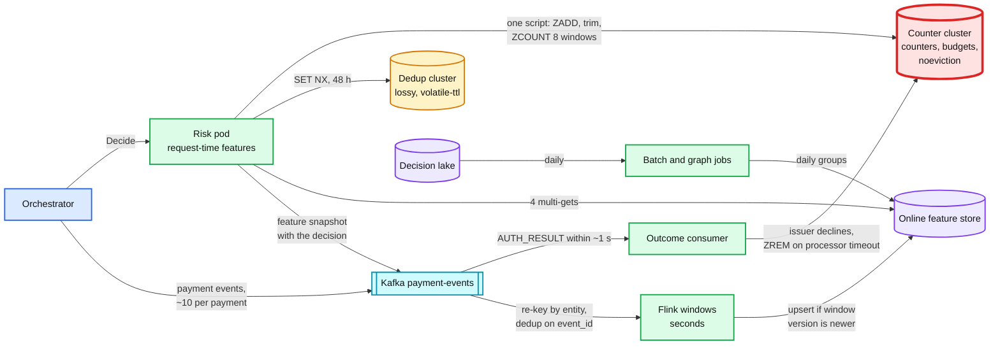

# Deep dive: features and freshness

> One-line answer: ~300 features come from four places with four freshness levels (request fields in process, 8 synchronous counters in a small Redis counter cluster, streaming windows from Flink in seconds, batch and graph features daily), and only the 8 counters an attack needs are read-your-writes, because a stream that is usually 1 s behind is 30 s behind exactly when a rebalance or an attacker hits it; those counters are sets keyed by payment id or card fingerprint so retries never double count, and the exact vector the model saw is logged with every decision so training never recomputes it.

Zoom-in on [`../solution.md`](../solution.md) §4.3 (the learning loop), §5.3 (synchronous counters), §5.4 (retries) and §10.5 (idempotency). Reusable blocks: [`../../../concepts/stream-processing.md`](../../../concepts/stream-processing.md) (event time, watermarks, checkpoints), [`../../../concepts/exactly-once.md`](../../../concepts/exactly-once.md), [`../../../concepts/stream-sketches.md`](../../../concepts/stream-sketches.md) (HyperLogLog at 10x), [`../../../concepts/crdt.md`](../../../concepts/crdt.md) (cross-region counters). Siblings: [`latency-budget-and-hot-path.md`](latency-budget-and-hot-path.md), [`timeouts-and-fallback-policy.md`](timeouts-and-fallback-policy.md), [`model-lifecycle-shadow-and-labels.md`](model-lifecycle-shadow-and-labels.md).

---

## 1. Four kinds of features, four clocks

| Kind | Examples | Where | Freshness | Read cost |
|---|---|---|---|---|
| Request-time | amount vs merchant p95 ticket, BIN (bank identification number) country vs IP country, minutes since invoice sent, payer email matches invoice customer | computed in the pod from the request and in-process tables | 0 | ~0.5 ms |
| Synchronous counters | attempts per card, IP, device, bank account, email; distinct cards per merchant and per IP; attempts per merchant; issuer declines per merchant in 5 min | counter cluster (Redis), one Lua script | read-your-writes, this attempt included | ~1 ms p50, 4 ms p99 |
| Streaming | dozens of windows (1 min to 24 h) per entity, cross-merchant distinct counts, ratios, AVS (address verification) and CVV (card security code) failure rates | Flink, upserted to the online feature store | seconds typical, tens of seconds on a restart | part of the 4 multi-gets |
| Batch and graph | merchant history and dispute ratio, 13-month card history, hops to a known-bad entity, BIN and IP reputation | daily jobs over the decision lake | 24 h | same multi-gets, or in process if small |

The design rule: **pay for freshness only where an attack is faster than the clock.** Card testing is hundreds of attempts a minute on one merchant, so the counters that see it must include the attempt before this one. A merchant's dispute ratio moves over weeks; daily is plenty.



## 2. The synchronous counter script

One script per decision on the counter cluster, in the parallel stage with the feature read and the dedup lookup (solution §5.3). Redis runs a Lua script atomically on its single-threaded event loop, so two decisions cannot interleave between the add and the count.

1. `ZADD NX` the `payment_id` into the 5 attempt sets (card, IP, device, bank account, email) and the merchant attempt set, score = now.
2. `ZADD GT` the card fingerprint into the 2 distinct-card sets (per merchant, per IP), so a reused card's score moves to its latest sighting.
3. `ZREMRANGEBYSCORE` each set below now minus 1 h; `ZCOUNT` each for 60 s, 10 min and 1 h.
4. Return 24 numbers plus the merchant's attack flag and issuer-decline count.

The stored-decision check is not in this script any more: a resumed payment is answered from the orchestrator's payment row before `Decide` is called, and a concurrent duplicate is caught by the dedup cluster. A duplicate that does reach the script is harmless, because every member is a payment id or a card fingerprint.

- **`ZREM` only for attempts that never reached an issuer because the processor timed out** (solution §5.4). A first draft also removed attempts that ended in our own soft decline. That erased an attacker's attempts from the per-card and per-IP counters during degraded mode, which is when we most want them. Distinct-card sets are never trimmed by `ZREM`.
- **`GT`, not `NX`, for distinct-card sets** (solution §5.3). An earlier version added every member with `ZADD NX`, which freezes a member's score at its first sighting: a card first used on this merchant 30 minutes ago and used again now kept its old score and dropped out of the 60 s count (simulation (C) below: 2 instead of 3). `ZADD GT` moves the score forward, and a same-card retry still adds no new member. Attempt sets keep `NX`: the member is the payment id, and its first sighting is the attempt.

**Sizes.** 8 sets, ~70 B per member, longest window 1 h: `2k/s x 8 x 3,600 s x 70 B = ~4 GB` at design (solution §2). ~16 to 24 sorted-set operations per script, ~2k scripts a second at design: one primary is far from its limit (solution §10.3).

## 3. Freshness against an attack, in numbers

500 new cards in 60 s on one merchant; the rule fires above 10 distinct cards in 60 s (`max(10, 5 x merchant p99)` with a p99 of 2). The simulation below counts how many attempts are approved before the rule can fire:

| Counter path | Approved before the rule fires | Fires at |
|---|---|---|
| Synchronous (read-your-writes) | 10 | 1.1 s |
| Stream, 1 s lag | 25 | 2.3 s |
| Stream, 5 s lag | 52 | 6.2 s |
| Stream, 30 s lag (a rebalance) | 260 | 31.1 s |

- **Push back on "make Flink faster".** A 1 s checkpoint lowers the typical lag, not the lag during a restart, a rebalance or a backlog after a deploy. Those are the moments an attacker is active.
- **Big merchants dull the rule.** A merchant whose p99 is 40 distinct cards a minute gets a threshold of 200, so ~200 tests pass first. So the rule also reads ratio signals that do not scale with size (solution §5.3): share of never-seen cards in the last minute, share of attempts under $5, and the issuer-decline share per merchant in 5 minutes. Stripe's card-testing page lists spikes in failed payments and low-amount payments with nonsensical details as the signs ([card testing](https://docs.stripe.com/disputes/prevention/card-testing)).

## 4. Card-level counters are split across regions

Merchants are homed in one region, so per-merchant counters are exact. Per-card, per-IP and per-device counters are not: a stolen card tried on 40 merchants, 20 in each region, shows ~20 attempts in each region's counter cluster. Solution §7 and §10.6 state it: only merchant-keyed counters are exact.

- **Accept it for the synchronous path.** The attack that needs read-your-writes is enumeration on one merchant: many cards, one place. One card across many merchants is a slower pattern (an attacker uses a validated card a few times), and the stream sees all of it within seconds once both regions' events are mirrored.
- **Do not add a cross-region call.** A synchronous call to the other region is 30 to 70 ms [estimate], half the budget.
- **If it ever matters,** keep a per-region counter and merge them asynchronously as a G-counter (a grow-only CRDT, conflict-free replicated data type, [`../../../concepts/crdt.md`](../../../concepts/crdt.md)): exact eventually, seconds behind, no coordination.

## 5. Why the hot state is two clusters and a payment row

| Job | Where | Size at design (2k/s peak, ~17 M payments a day) | If lost |
|---|---|---|---|
| Inline decision of record | Orchestrator's payment row, written before the processor call | part of the payments DB | n/a: strongly consistent, the system of record |
| Attack counters, attack flags, issuer declines, degraded budgets | Counter cluster, `noeviction` | ~4 GB | Card-testing defense drops to stream speed plus per-pod attack counters; budgets run on per-pod slices |
| 48 h dedup (`SET NX dec:{payment_id}`, TTL, time to live) | Dedup cluster, `volatile-ttl` | ~17 GB (2k/s x 172,800 s x ~50 B) | Nothing visible: at worst a recompute for a payment nobody was told about |

**Why not one Redis for all three jobs.** A first draft kept counters, a 7-day decision cache and budgets on one primary per region. It failed review on two counts:

- **Sizing.** The cache had been sized at today's volume (~10 GB). At design volume a 7-day cache is ~60 GB (17 M x 7 x 0.5 KB) in one single-threaded primary: a full resync after failover copies 60 GB, and a fork for persistence doubles memory under write load.
- **Coupling.** `noeviction` is right for counters (never silently drop one), but it meant a cache that grew (a TTL bug, a traffic jump) would make every counter write fail. One job could take down the other.

**What the design does instead** (solution §3.3, §5.4, §10.1):

1. **The orchestrator writes the inline decision to its payment row before it calls the processor.** A resumed payment reads its row and never calls `Decide` again.
2. **Risk keeps a lossy 48 h dedup** for the gaps: two calls racing, or a pod that died between our answer and its row write (nobody has been told anything yet). `Decide` carries `attempt_created_at`, and an attempt older than 48 h gets `STALE_ATTEMPT` instead of a fresh decision.
3. **Counters and budgets in their own small cluster**, hash-tagged by merchant when it needs to shard (~10x). Budgets ride with counters because their failure is already covered by per-pod slices and per-pod attack counters ([`timeouts-and-fallback-policy.md`](timeouts-and-fallback-policy.md)).

**Blast radius.** Counter cluster down: decisions use stream counters, the in-process attack flags and per-pod attack counters, budgets on slices (diagrams D5c). Dedup cluster down: nothing visible. Neither takes a payment down.

## 6. Point-in-time correctness

- **Train on the logged vector.** Every decision logs the ~300 values the model saw (~1.2 KB), counters included. Training joins labels to snapshots by `payment_id`; it never recomputes a feature for an old payment. No training-serving skew by construction ([`../solution.md`](../solution.md) §4.3).
- **A new feature needs a backfill**, and the backfill must use the time the data **became available**, not its event time. A dispute dated day 47 but ingested on day 49 was not knowable on day 48. Join on ingest time, then compare backfilled values of an existing feature with its logged values as a skew test.
- **`NOT_FOUND` is a value, `UNAVAILABLE` is not.** A card never seen returns count 0 and first seen now. A shard that timed out returns no information. Log them differently, or a shard outage looks to the model like a wave of new cards ([`timeouts-and-fallback-policy.md`](timeouts-and-fallback-policy.md) §5).
- **Stream idempotency.** Flink drops duplicates by `event_id` in keyed state (1 h TTL) and the sink only overwrites an older window version, so a replay after a restart is a no-op (diagrams D2b).

## 7. Simulation: freshness, retries, and the `NX` trap

```python
"""(A) Card testing against counters with different visibility lag.
(B) Retries: integer counters vs sets keyed by payment id.
(C) ZADD NX vs ZADD GT for a distinct-card window. Standard library only."""
import random

class ZSet:                                   # a Redis sorted set: member -> score (ms)
    def __init__(self): self.m = {}
    def zadd(self, member, score, mode):
        if mode == "NX" and member in self.m: return
        if mode == "GT" and member in self.m and self.m[member] >= score: return
        self.m[member] = score
    def zrem(self, member): self.m.pop(member, None)
    def zcount(self, lo, hi): return sum(lo <= s <= hi for s in self.m.values())

def card_testing(lag_s, attempts=500, window_s=60, threshold=10, seed=1):
    rng = random.Random(seed)
    times = sorted(rng.uniform(0, 60) for _ in range(attempts))
    for i, t in enumerate(times):
        seen = [u for u in times[:i] if t - window_s <= u <= t - lag_s]   # earlier attempts visible now
        visible = len(seen) + (1 if lag_s == 0 else 0)                   # sync path also sees this one
        if visible > threshold:
            return i, t                                    # rule fires, attack mode from here on
    return attempts, None

print("(A) 500 new cards in 60 s on one merchant, rule: over 10 distinct cards in 60 s")
for name, lag in [("sync counter (read your writes)", 0.0), ("stream, 1 s lag", 1.0),
                  ("stream, 5 s lag", 5.0), ("stream, 30 s lag (rebalance)", 30.0)]:
    n, t = card_testing(lag)
    print(f"  {name:34} approved before the rule fires: {n:3d}   at t = {t:5.1f} s")

print("(B) card c_1, limit 3 attempts in 10 min: p_9 decided, resumed twice, processor timeout, buyer retries as p_10")
calls = [("p_9", 0), ("p_9", 400), ("p_9", 900), ("p_10", 5000)]
incr, zs = 0, ZSet()
for pid, ms in calls:
    incr += 1
    zs.zadd(pid, ms, "NX")
zs.zrem("p_9")                                             # outcome consumer: p_9 never reached the issuer
print(f"  INCR counter: {incr} attempts -> {'DECLINE' if incr > 3 else 'ok'}")
print(f"  ZADD NX by payment_id, ZREM on technical failure: {zs.zcount(0, 10**9)} attempt -> ok")

print("(C) distinct cards per merchant in the last 60 s, card c_7 first used 30 min ago, reused now")
for mode in ("NX", "GT"):
    z = ZSet()
    z.zadd("c_7", 0, mode)                                  # t = 0
    for i, c in enumerate(["c_1", "c_2", "c_7"]):           # three payments in the last minute
        z.zadd(c, 1_800_000 + i * 10_000, mode)
    print(f"  ZADD {mode}: distinct cards in last 60 s = {z.zcount(1_800_000 - 60_000 + 20_000, 1_800_000 + 20_000)} (truth 3)")
```

Output:

```text
(A) 500 new cards in 60 s on one merchant, rule: over 10 distinct cards in 60 s
  sync counter (read your writes)    approved before the rule fires:  10   at t =   1.1 s
  stream, 1 s lag                    approved before the rule fires:  25   at t =   2.3 s
  stream, 5 s lag                    approved before the rule fires:  52   at t =   6.2 s
  stream, 30 s lag (rebalance)       approved before the rule fires: 260   at t =  31.1 s
(B) card c_1, limit 3 attempts in 10 min: p_9 decided, resumed twice, processor timeout, buyer retries as p_10
  INCR counter: 4 attempts -> DECLINE
  ZADD NX by payment_id, ZREM on technical failure: 1 attempt -> ok
(C) distinct cards per merchant in the last 60 s, card c_7 first used 30 min ago, reused now
  ZADD NX: distinct cards in last 60 s = 2 (truth 3)
  ZADD GT: distinct cards in last 60 s = 3 (truth 3)
```

- (A) is the case for the synchronous path: 10 vs 260 approved tests.
- (B) is the case for sets: an integer counter declines an honest buyer for our own retries.
- (C) is the `NX` trap: the reused card disappears from the short window, which is why distinct-card sets use `GT`.

## 8. What an interviewer pushes on

1. **"Your stream is 30 s behind during an attack."** Eight counters are synchronous; 300 features are not. A guarantee for 8 keys, not a faster stream.
2. **"A retry trips your velocity rule."** A resume is answered from the orchestrator's payment row and never reaches us; a duplicate that does reach us is a no-op, because members are payment ids.
3. **"Redis fails over and loses a second of writes."** Counter cluster: ~1 s of `ZADD`s (a few counts on one merchant), so counters come back slightly low. Dedup cluster: ~1 s of `SET NX`s, which costs nothing because the orchestrator's row holds the decision.
4. **"Card counters are per region."** Yes, by choice. The synchronous path defends the per-merchant attack; cross-merchant card use is a seconds-scale stream pattern.
5. **"How do you avoid training-serving skew?"** Log the vector. Backfill only new features, on availability time, with a skew test.
6. **"Why not HyperLogLog for distinct counts?"** ~4 GB of exact sets at design is cheap and exact; HyperLogLog is the seam at 10x ([`../../../concepts/stream-sketches.md`](../../../concepts/stream-sketches.md)).

## 9. Trade-offs

| Decision | Option A | Option B | Chose | Why |
|---|---|---|---|---|
| Attack freshness | Faster stream | 8 synchronous counters | Sync counters | A guarantee, not a typical lag |
| Counter type | `INCR` | Sorted sets by payment id or card | Sets | Retries cost nothing; distinct counts for free |
| Distinct-card score | `NX` (first seen) | `GT` (last seen) | `GT` | `NX` drops a reused card from short windows |
| `ZREM` scope | All technical failures, our soft declines included | Processor timeouts only | Processor only | Do not erase an attacker's attempts in degraded mode |
| Hot state | One Redis, three jobs | Counter cluster plus a lossy 48 h dedup cluster; decision of record on the orchestrator row | Split | One Redis would be ~60 GB at design and one job could starve the other |
| Card counters across regions | Synchronous cross-region | Per region plus the mirrored stream | Per region | 30 to 70 ms per call is half the budget |
| Training features | Recompute as of the decision | Log the vector | Log | No skew, replay for free, ~0.45 TB a year |
