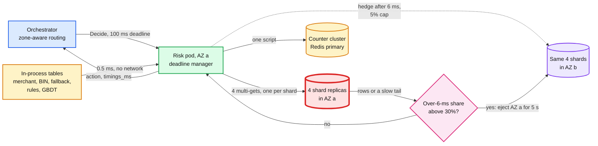

# Deep dive: the latency budget and the hot path

> One-line answer: a decision waits for the slowest of its parallel feature reads, so the p99 of the risk service is set by the tail of the online feature store, not by the model; cut the number of remote calls to 4 (one multi-get per shard), keep the GBDT (gradient-boosted decision trees) model and every small table in process, hedge a read to another AZ (availability zone) after 6 ms under a 5% cap, and add the piece the independent-tail math hides: a slow AZ makes all 4 calls slow at once, which hedging cannot fix, so the pod must eject a slow AZ on latency and the orchestrator must route around a slow risk AZ.

Zoom-in on [`../solution.md`](../solution.md) §2 (latency budget), §5.1 (the long tail) and §10.1 (internals). Reusable blocks: [`../../../concepts/fan-out-fan-in.md`](../../../concepts/fan-out-fan-in.md) (tail amplification, hedging), [`../../../concepts/rate-limiting-and-load-shedding.md`](../../../concepts/rate-limiting-and-load-shedding.md), [`../../../concepts/caching-patterns.md`](../../../concepts/caching-patterns.md). Siblings: [`timeouts-and-fallback-policy.md`](timeouts-and-fallback-policy.md) (what happens after a deadline fires), [`features-and-freshness.md`](features-and-freshness.md) (what is read).

---

## 1. The 100 ms, line by line

The orchestrator gives us 100 ms as a gRPC deadline. We stop ourselves at 80 ms so the answer and the orchestrator's own work still fit.

| Stage | p50 | p99 | Stage deadline (from arrival) | Remote? |
|---|---|---|---|---|
| Orchestrator to risk (mTLS, mutual TLS) | 1 ms | 4 ms | | network |
| Parse, request-time features, in-process tables | 0.5 ms | 2 ms | | no |
| Parallel: 4 hedged multi-gets, 1 counter-cluster script, 1 dedup lookup | 6 ms | 15 ms | 30 ms | **yes, the fan-out** |
| Pre-model rules (compiled CEL, Common Expression Language) | 0.3 ms | 1 ms | | no |
| GBDT, ~1,000 trees of depth 8, ~300 features | 2.5 ms | 5 ms | 45 ms | no |
| Policy, post-model rules | 0.2 ms | 0.5 ms | | no |
| `SET NX` the 48 h dedup entry | 1 ms | 4 ms | 60 ms | yes, one call |
| Response | 1 ms | 4 ms | | network |
| GC (garbage collection), queueing | 2 ms | 10 ms | | no |
| **Total** | **~15 ms** | **~46 ms bound** | **hard stop 80 ms** | |

- **Two numbers for "the feature read".** The 4 multi-gets alone are ~3 ms p50 (the max of four ~2 ms calls). The stage, including deserializing ~10 KB of rows and the counter script and dedup lookup in parallel, is ~6 ms p50 and ~15 ms p99 after hedging. The README and solution §2 quote the stage. Say which one you mean.
- **The p99 column is a bound.** Adding p99s assumes every stage hits its tail on the same request. The simulation in §6 gives the real distribution.
- **Only two lines are remote.** Everything else is CPU in the pod. That is the design: one fan-out, one counter script, one dedup write. The inline decision of record is written by the orchestrator to its own payment row, after our answer and before the processor call, so it costs the risk budget nothing.

## 2. Why the tail is a fan-out problem

A decision finishes when the slowest of its N parallel calls finishes. If each call is slower than its own p99 with probability 1%:

```
P(decision waits on at least one call past the per-call p99) = 1 - 0.99^N
N = 1 -> 1%     N = 4 -> 3.9%     N = 9 -> 8.6%     N = 20 -> 18%
Decision p99 = per-call quantile 0.99^(1/N):  N = 4 -> p99.75,  N = 9 -> p99.89
```

With the per-call distribution from solution §5.1 (p50 2 ms, p95 5 ms, p99 9 ms, p99.9 30 ms, p99.99 60 ms [estimate]), the decision's feature stage is ~18 ms p99 at N = 4 and ~28 ms at N = 9. That is why the design shards for memory (4 shards of 30 GB) and groups keys per shard, instead of sharding wide "for scale". See [`../../../concepts/fan-out-fan-in.md`](../../../concepts/fan-out-fan-in.md).



## 3. Hedging: what it buys and what it costs

- **The rule.** If a shard has not answered in 6 ms, send the same read to that shard's replica in another AZ and take the first answer. Cancel the loser (gRPC cancel), so a sick node does not pile up work.
- **The cost.** 6 ms is about the per-call p97 of the assumed distribution, so ~3% of calls hedge (the simulation measures 3.0%). At design that is ~250 extra reads/s across the fleet. Cross-AZ transfer is ~10 KB per hedge, a rounding error.
- **The cap.** Hedges are limited to 5% of calls per pod (a token bucket that earns 0.05 of a token per call). Healthy traffic already spends ~3 of those 5 points. Above the cap the store is sick, and hedging every call would double its load exactly when it is weakest.
- **Reads only.** Never hedge the counter script or the dedup `SET NX`. Each goes to one primary, so a hedge has nowhere better to go.
- **The textbook source.** Dean and Barroso's "The Tail at Scale" (Communications of the ACM, 2013) is the reference for hedged requests and tail amplification. Our researcher could not open the article page to check its exact numbers, so quote the idea, not their figures [unverified].

## 4. The correlated tail: a slow AZ

The `0.99^N` math assumes the four calls are slow independently. They often are not:

- **Shared fate.** The pod reads AZ-local replicas. All four live in the same AZ, behind the same network fabric, often on the same instance type and deployed in the same wave. A congested top-of-rack switch, a noisy neighbour on that host family, or packet loss in the AZ hits all four calls on the same request.
- **Gray failure.** The replicas still answer, just slowly. Health checks pass. A **dead** replica is caught by a health check; a slow one never trips it, which is why the design ejects by latency ([`../diagrams.md`](../diagrams.md#d5a-a-gray-az-then-a-dead-replica) D5a).
- **Packet loss is worse than slowness.** A lost TCP segment waits for a retransmit timeout, and Linux's minimum RTO (retransmission timeout) is 200 ms (`TCP_RTO_MIN = HZ/5` in `include/net/tcp.h`). 3% loss on a 4-call fan-out puts ~11% of decisions in that AZ past 80 ms.
- **Why the 5% cap cannot fix it.** During the episode every call from the pod wants to hedge. The cap lets 5% through. The other 95% wait for the slow AZ, and most decisions miss the 30 ms stage deadline.

**The design's answer, in two places, plus the guard behind them** (solution §5.1, §10.2).

1. **In the pod: latency-based ejection.** Keep an exponentially weighted share of calls slower than the hedge delay, per AZ. Above 30%, read straight from another AZ for 5 s, then probe the local one again. Cost: +0.5 ms per read while ejected. This is outlier detection on latency, not on errors.
2. **At the orchestrator: zone-aware routing on risk latency.** If the slowness is the risk pod's own AZ (its network card, its hosts), a different replica does not help. The orchestrator tracks p99 of `Decide` per risk AZ and shifts traffic away from an AZ whose p99 is over 2x the others for 30 s [estimate]. Risk pods are sized so two AZs carry 2k/s (solution §10.3).
3. **The stage deadline stays the last guard.** Whatever the detectors miss becomes a bounded fallback at 30 ms, not a timeout at 100 ms.

## 5. What else is in process, and why

| Thing | Size | Why not remote |
|---|---|---|
| GBDT champion | ~30 MB | A model server is a second fan-out leg, 15 to 25 ms p99 [estimate], for a model that runs in 2.5 ms on one core |
| Challenger in shadow | ~30 MB, +2.5 ms CPU | **Score it after the response is sent**, from the same snapshot. Scored on the request thread it would add 2.5 ms to p50 and its own tail to p99 (solution §2 and §5.5) |
| Merchant profile, tier, budgets config | ~1 M x 100 B = ~100 MB | The hottest key on the platform (a big merchant) would otherwise be one shard's hot row |
| BIN (bank identification number), email-domain, routing-number reputation | tens of MB | Small, slow-changing, read on every decision |
| Rule bundle, fallback table | a few MB | The fallback path must have no network dependency |

Everything here is a versioned snapshot pushed by the control plane (p99 ~30 s to every pod) and named on each decision, so nothing needs invalidation and every decision is replayable.

## 6. Simulation: independent vs correlated slowness, with and without hedging

One pod at 30 decisions/s for 2 hours. Per-call latency follows the solution §5.1 quantiles with a log-log tail. The rest of the path is ~7.5 ms plus a 0.3% chance of a 15 to 45 ms GC pause. The slow-AZ scenario puts the AZ-local replicas into a gray failure for 1% of the time (six 12 s episodes); the independent scenario gives each call the same 1% chance on its own. `fallback` = feature stage over the 30 ms deadline; `over80` = raw latency over 80 ms if no stage deadline existed.

```python
"""Decision latency with N parallel feature calls: independent vs correlated slowness,
with and without hedging (5% cap), plus latency-based AZ ejection. Standard library only."""
import math, random

# Per-call latency of one multi-get (solution 5.1): (quantile, ms). Log-log interpolation in the tail.
Q = [(0.0, 0.8), (0.5, 2.0), (0.95, 5.0), (0.99, 9.0), (0.999, 30.0), (0.9999, 60.0), (0.99999, 120.0)]

def base_call(rng):
    u = rng.random()
    if u >= Q[-1][0]:
        return Q[-1][1]
    for (q0, v0), (q1, v1) in zip(Q, Q[1:]):
        if u <= q1:
            f = (math.log(1 - u) - math.log(1 - q0)) / (math.log(1 - q1) - math.log(1 - q0))
            return math.exp(math.log(v0) + f * (math.log(v1) - math.log(v0)))

def gray(ms, rng):                 # gray-failing AZ: slow, not dead; 3% packet loss costs a 200 ms TCP retransmit
    return 3 * ms + 20 + (200 if rng.random() < 0.03 else 0)

def rest_of_path(rng):             # rules, GBDT, policy, SET NX, network legs, GC (solution section 2)
    gc = rng.uniform(15, 45) if rng.random() < 0.003 else 0.0
    return 6.5 + rng.expovariate(1.0) + gc

def run(n_calls, mode, hedge, eject, hours=2.0, rate=30, seed=7):
    rng = random.Random(seed)
    total = int(hours * 3600 * rate)
    episodes = [(s, s + 12.0) for s in (600, 1800, 3000, 4200, 5400, 6600)]   # 72 s of 7,200 s = 1%
    tokens, ema, ejected_until, hedges, calls = 10.0, 0.0, -1.0, 0, 0
    lat, fallbacks = [], 0
    for i in range(total):
        t = i / rate
        in_episode = mode == "corr" and any(a <= t < b for a, b in episodes)
        worst = 0.0
        for _ in range(n_calls):
            calls += 1
            tokens = min(10.0, tokens + 0.05)                       # hedge budget: 5% of calls
            remote = eject and t < ejected_until                    # read from the other AZ instead
            ms = base_call(rng) + (0.5 if remote else 0.0)
            slow = (in_episode and not remote) or (mode == "indep" and rng.random() < 0.01)
            if slow:
                ms = gray(ms, rng)
            ema = 0.98 * ema + 0.02 * (ms > 6.0)
            if eject and ema > 0.3 and t >= ejected_until:
                ejected_until = t + 5.0                             # re-probe the local AZ after 5 s
            if hedge and ms > 6.0 and tokens >= 1.0:
                tokens -= 1.0
                hedges += 1
                ms = min(ms, 6.0 + 0.5 + base_call(rng))            # replica in a healthy AZ
            worst = max(worst, ms)
        fallbacks += worst > 30.0                                   # features missed the 30 ms stage deadline
        lat.append(worst + rest_of_path(rng))
    lat.sort()
    pct = lambda p: lat[int(p * (len(lat) - 1))]
    over80 = sum(x > 80 for x in lat) / len(lat)
    return pct(0.5), pct(0.99), pct(0.999), fallbacks / total, over80, hedges / calls

rows = [("N=4 healthy, no hedge", 4, "none", False, False),
        ("N=9 healthy, no hedge", 9, "none", False, False),
        ("N=4 healthy, hedge", 4, "none", True, False),
        ("N=4 1% indep slow calls, no hedge", 4, "indep", False, False),
        ("N=4 1% indep slow calls, hedge", 4, "indep", True, False),
        ("N=4 slow AZ 1% of time, no hedge", 4, "corr", False, False),
        ("N=4 slow AZ, hedge 5% cap", 4, "corr", True, False),
        ("N=4 slow AZ, hedge + ejection", 4, "corr", True, True)]
print(f"{'scenario':36} {'p50':>5} {'p99':>5} {'p99.9':>6} {'fallback':>9} {'over80':>7} {'hedged':>7}")
for name, n, mode, h, e in rows:
    p50, p99, p999, fb, o80, hr = run(n, mode, h, e)
    print(f"{name:36} {p50:5.1f} {p99:5.1f} {p999:6.1f} {fb:9.3%} {o80:7.3%} {hr:7.2%}")
```

Output (Python 3, ~6 s):

```text
scenario                               p50   p99  p99.9  fallback  over80  hedged
N=4 healthy, no hedge                 10.7  28.9   55.5    0.387%  0.023%   0.00%
N=9 healthy, no hedge                 11.9  38.4   67.0    0.875%  0.050%   0.00%
N=4 healthy, hedge                    10.7  17.8   46.9    0.000%  0.000%   3.04%
N=4 1% indep slow calls, no hedge     10.8  39.2  230.0    1.035%  0.143%   0.00%
N=4 1% indep slow calls, hedge        10.8  18.7   46.1    0.005%  0.000%   4.01%
N=4 slow AZ 1% of time, no hedge      10.7  38.2  230.3    0.915%  0.153%   0.00%
N=4 slow AZ, hedge 5% cap             10.7  34.6  230.6    0.495%  0.125%   3.07%
N=4 slow AZ, hedge + ejection         10.7  17.8   47.3    0.012%  0.003%   3.07%
```

**How to read it.**

- **Hedging is load-bearing, not polish.** Without it, 0.39% of decisions at N = 4 miss the 30 ms feature deadline. At 3 M payments a day that is ~11.6k fallbacks a day, over the 0.1% the full-decision SLO (service level objective, solution §8) allows. With hedging: ~0. At N = 9 the miss rate is 0.88%, ~26k a day. Counting only decisions past the 80 ms hard stop would suggest ~3k a day, but the 30 ms stage deadline fires first; that is why solution §5.1 calls hedging load-bearing.
- **Same per-call slowness, opposite outcome.** With 1% of calls slow independently, hedging restores p99 to 18.7 ms. With the same 1% concentrated in one AZ's time, the 5% cap leaves p99 at 34.6 ms and half the decisions inside an episode fall back. The hedge budget is the binding limit.
- **Ejection fixes the correlated case** (p99 17.8 ms, fallback 0.012%) at the cost of ~1 s of slow decisions before the detector trips.
- **After hedging, p99.9 is our own GC.** The ~47 ms p99.9 in the hedged rows comes from the 0.3% of requests with a pause. The next millisecond is won in the process (allocation-free request path, a low-pause collector), not in the store.
- **Caveat.** The rest-of-path model is ~7.5 ms, lighter than solution §2's ~9 ms, so the p50s here sit ~4 ms under the solution's ~15 ms. Compare rows, not absolute values.

## 7. What an interviewer pushes on

1. **"Your feature store is 5 ms. Why worry?"** Ask for its p99.9, not its median, and do `0.99^(1/N)`. Four calls make the decision's p99 the store's p99.75.
2. **"Just add shards."** More shards means more calls per decision. Twelve shards turn 4 calls into ~9 and the 30 ms miss rate from 0.39% to 0.88%.
3. **"Hedging fixes tails."** Independent tails, yes. A slow AZ makes every call slow at once; a 5% cap cannot cover 100% demand. Ejection by latency, and routing around a slow risk AZ at the orchestrator.
4. **"Why not cap at 50%?"** Then a sick store gets ~1.5x its load at the worst time. The cap protects the store; the detector protects the decision.
5. **"Why is the model not the bottleneck?"** 2.5 ms in process. A remote model server adds a second fan-out leg and a second set of tails for no benefit to a 30 MB model.
6. **"Where does shadow scoring run?"** After the response, same pod, same snapshot. Never on the request thread.
7. **"Why 80 ms and not 99?"** 20 ms covers the response leg and the orchestrator's own fallback path. The 80 ms wall is for what has no timeout of its own: a GC pause, a starved thread pool.

## 8. Trade-offs

| Decision | Option A | Option B | Chose | Why |
|---|---|---|---|---|
| Shard count | Many shards for throughput | 4 for memory | 4 | 8k calls/s is small; fewer calls means a thinner tail |
| Tail control | Long timeout and retry | Hedge after 6 ms, 5% cap | Hedge | A retry after a timeout is too late inside 30 ms |
| Correlated slowness | Health checks only | Latency-based AZ ejection plus zone-aware routing | Ejection and routing | Gray failures pass health checks; p99 34.6 ms vs 17.8 ms simulated |
| Model serving | Remote model server | In process | In process | One fewer network leg; GBDT is small |
| Shadow scoring | Inline, next to the champion | After the response | After | Shadow must not cost the buyer latency |
| What we refused | A graph query, a vendor score or any second fan-out on the 100 ms path | | | Each adds a tail we cannot hedge |

## 9. Numbers to say out loud

- 100 ms deadline, 80 ms hard stop, stage deadlines 30 / 45 / 60 ms.
- ~15 ms p50 total; feature stage ~6 ms p50, ~15 ms p99 after hedging; the 4 multi-gets alone ~3 ms p50.
- `1 - 0.99^4 = 3.9%`. Decision p99 at N = 4 is the per-call p99.75 (~18 ms with the assumed distribution).
- Hedge after 6 ms, ~3% of calls, cap 5%. Unhedged, 0.39% of decisions miss 30 ms (~11.6k a day).
- A slow AZ at 1% of the time: p99 17.8 ms becomes 34.6 ms with hedging alone; latency ejection brings it back to 17.8 ms. Page when the hedge rate sits at its cap for 1 minute.
- Linux minimum TCP retransmit: 200 ms. One lost packet blows the whole budget.
