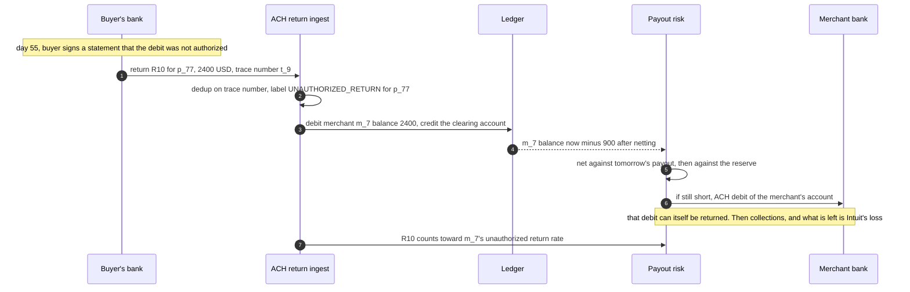

# Deep dive: layered controls and merchant risk

> One-line answer: an inline score judges one payment in 100 ms, but QuickBooks pays the merchant in a day or two while card disputes take weeks and unauthorized consumer ACH (automated clearing house) debits can come back for 60 days, so the real control for merchant fraud is **when money may leave**: deferred capture for `REVIEW`, payout delay by tier, a re-scorer that holds a merchant whose volume spikes against its own history, a cap that pays out unseasoned volume only once its return windows have passed, a cooling period after a payout bank change, and a rolling reserve for the long tail; a static reserve alone covers ~5% of a bust-out. Instant deposit is open only to seasoned merchants within their history, and refunds are capped and counted, because they are the two same-day exits.

Zoom-in on [`../solution.md`](../solution.md) §4.4 (bust-out walkthrough), §5.7 (three layers, ACH) and D8c (payout hold lifecycle). Money movement and the ledger are [`../../payments-ledger/`](../../payments-ledger/); holds are ledger entries written in one transaction with the hold row. Reusable blocks: [`../../../concepts/distributed-transactions.md`](../../../concepts/distributed-transactions.md), [`../../../concepts/exactly-once.md`](../../../concepts/exactly-once.md) (hold ids). Siblings: [`timeouts-and-fallback-policy.md`](timeouts-and-fallback-policy.md) (fallbacks re-scored before payout), [`model-lifecycle-shadow-and-labels.md`](model-lifecycle-shadow-and-labels.md) (merchant-loss labels).

---

## 1. Three clocks

| Clock | Time | What it can do |
|---|---|---|
| Layer 1, inline | under 100 ms | Approve, step up, review (approve and hold the money), decline one payment |
| Layer 2, post-auth re-scorer and review | seconds to hours | Void an uncaptured authorization, hold a payment or a whole merchant, change the tier, open a case |
| Layer 3, payout risk | at every payout and instant deposit | Decide how much of the settled balance may leave: holds, reserve, delay, caps |
| The truth | weeks (card disputes), up to 60 days (Nacha: R10 and R11 "have a 60 days timeframe"), merchant loss in 1 to 4 months | Arrives after the money has usually left |

Everything paid out before the truth arrives is Intuit's loss if the merchant cannot repay. So each layer is judged by one question: **how much money left before we knew?**

```mermaid
%% How payable is computed for one merchant. Instant deposit of unseasoned volume is red: it is where money leaves before any later layer has had time to work.
flowchart LR
    SET[Settled balance<br/>from the ledger] -->|"minus"| HOLDS[Open holds<br/>payment and merchant-wide]
    RS[Post-auth re-scorer<br/>merchant model, graph] -->|"hold, void,<br/>tier change"| HOLDS
    HOLDS -->|"minus"| RES[Rolling reserve<br/>r pct for 90 days]
    RES -->|"minus"| UNS[Unseasoned excess<br/>above k x own history]
    UNS -->|"minus"| BANK[Bank change cooling<br/>3 days]
    BANK -->|"payable amount"| GATE{Instant deposit<br/>or 5 PM run?}
    GATE -->|"seasoned, within history"| ID[Instant deposit]
    GATE -->|"everyone else"| RUN[Scheduled payout<br/>delay by tier]
    ID -->|"money leaves today"| OUT[Merchant bank]
    RUN -->|"money leaves"| OUT

    class SET,HOLDS,RES,UNS,BANK,RS,RUN service
    class GATE decision
    class ID critical
    class OUT external

    classDef service  fill:#dcfce7,stroke:#16a34a,stroke-width:2px,color:#111
    classDef critical fill:#fee2e2,stroke:#dc2626,stroke-width:4px,color:#111
    classDef decision fill:#fce7f3,stroke:#db2777,stroke-width:2px,color:#111
    classDef external fill:#e5e7eb,stroke:#6b7280,stroke-width:2px,color:#111,stroke-dasharray:4 3
```



## 2. What merchant fraud looks like

| Pattern | How it works | Why inline cannot stop it | Signal and control |
|---|---|---|---|
| Bust-out | Build a clean history, spike, cash out, vanish | Each payment looks normal | Volume vs own history, ticket shift; spike hold, unseasoned cap |
| Self-processing stolen cards | A new merchant keys stolen cards into its own terminal, then withdraws | Cards are valid; no single card has velocity | Payer device or IP equals the merchant's own QuickBooks session; keyed share; never-seen cards; many BINs (bank identification numbers) |
| Collusion | Real buyers, fake goods, disputes later | Buyers are willing; payments authorize | Refund and dispute ratios, graph links between buyers and owner |
| Merchant account takeover | Attacker changes the payout bank account, then payouts flow to it | Payments are the honest merchant's | Bank change cooling, notify the previous contact, step-up on the change itself |
| Fake invoices over ACH | Invoices debit bank accounts the fraudster has credentials for | Account validation passes: the accounts are real | Payer name vs account holder name, first-time payers, R10 history; ACH release rules |
| Refund to another card | Charge a stolen card, refund to a card the merchant controls | The charge is authorized; the refund is money out with no payout | Refunds only to the original payment method, never above captured, refund velocity counter, no refund under hold |

**The self-processing case is the QuickBooks-specific one.** We see both sides: the merchant's own login sessions (device, IP) and the buyer's checkout device. A keyed or pay-link payment whose payer device or IP matches the merchant's own recent session is a strong inline rule: `REVIEW` with deferred capture, never `APPROVE` (solution §4.4, Flow 6). Refunds go only to the original payment method and never above the captured amount, which closes the other common cash-out.

## 3. The controls, with numbers

- **Deferred capture for `REVIEW` card payments.** Authorize now, capture when the re-score or an analyst clears it. Stripe: an authorization reversed before capture "isn't reported" to the monitoring programs ([monitoring programs](https://docs.stripe.com/disputes/monitoring-programs), quoted in solution §5.7). A void costs nothing.
- **Payout delay by tier.** A and B next day, C 2 business days, D after review [estimate]. The delay is what gives layer 2 its hours.
- **Spike hold by the re-scorer.** The merchant model in solution §4.4 reads volume against the merchant's own history and places a merchant-wide hold (`m_44`: $91k against ~$430 a day). The simulation stands it in with a simple rule: a day above ~5x the 30-day average.
- **Unseasoned-volume cap** (solution §5.7). Pay at most ~1.5x the merchant's seasoned daily average [estimate]; the excess waits until its return windows have mostly passed (60 days for consumer ACH). Spike holds miss a slow ramp; this does not.
- **Rolling reserve.** Hold r% of each payout for 90 days, sized from expected disputes plus returns at the p95 (solution §5.7: $200k a month at 1% is ~$6k expected over 90 days; a 5% reserve holds ~$30k). It covers the honest merchant's tail, not a fraudster's spike, because it is sized from history.
- **Bank account change cooling.** Payouts held 3 days [estimate] after a change, previous contact notified.
- **Instant deposit only for seasoned merchants** whose day is within their history (solution §5.7), on top of the `payable` check at every instant deposit. It is the one path where money leaves the same day, so it is the red node above.
- **Refund controls** (solution §4.4, §5.7). Refunds go only to the original payment method and never above the captured amount; refund velocity per merchant is a synchronous counter in the counter cluster; a refund on a payment under hold is blocked. A refund is money out that never passes a payout, so payout holds alone would not see it.

## 4. ACH: the 60-day tail

- **Validate before the first WEB debit.** Nacha's WEB (internet-initiated) debit rule, effective March 19, 2021, requires "a commercially reasonable means to determine that the account number to be used for the WEB debit is for a valid account" ([Nacha](https://www.nacha.org/rules/supplementing-fraud-detection-standards-web-debits)).
- **Two return clocks.** NSF (non-sufficient funds, R01) and administrative returns come within ~2 banking days [unverified]; the design releases a large first debit's funds only after that window (solution §5.7). Unauthorized consumer returns (R10, R11) can come for 60 days, long after release. Business-account unauthorized returns use R29, with a much shorter window [unverified: 2 banking days].
- **A return rate to watch per merchant.** Nacha sets an unauthorized-return rate threshold for originators (0.5% [unverified]). Track it per merchant like the VAMP (Visa Acquirer Monitoring Program) ratio for cards.

**Walkthrough: a buyer's ACH debit is returned R10 on day 55.**



- **Honest merchant, still active:** netted from the next payouts. A cost to the merchant, not a loss for Intuit.
- **Merchant gone:** only what is still held (reserve, holds, unseasoned excess) covers it. The simulation shows how little a 5% reserve is.

## 5. Simulation: how much leaves before the truth arrives

Three fraudulent merchants that cash out and disappear. Loss = clawbacks the retained balance cannot cover. Payout delay is 2 days (tier C); the spike hold is merchant-wide and confirmed by review; the unseasoned cap pays at most 1.5x the merchant's 30-day average and holds the rest.

```python
"""Intuit's loss when a fraudulent merchant cashes out and disappears, under layered payout controls.
Loss = clawbacks (disputes, ACH returns) the merchant's retained balance cannot cover. Amounts in USD."""

def merchant(kind):
    days = {}
    if kind == "card bust-out":            # 45 quiet days, then $91k of stolen cards keyed by itself
        days.update({d: 430.0 for d in range(45)}); days[45] = 91000.0
        claw = 0.005 * 430 * 45 + 0.90 * 91000
        vanish = 48
    elif kind == "ACH R10 at day 55":      # fake invoices debit 20 taken-over bank accounts on day 10
        days.update({d: 500.0 for d in range(10)}); days[10] = 40000.0
        claw = 40000.0                     # unauthorized returns arrive days 40 to 65, after it is gone
        vanish = 15
    else:                                  # slow ramp: +12% a day for 40 days, then vanish
        v = 300.0
        for d in range(40):
            days[d] = v; v *= 1.12
        claw = 0.9 * sum(x for d, x in days.items() if d >= 15)
        vanish = 40
    return days, claw, vanish

def paid_out(days, vanish, delay, reserve, spike_k, unseasoned_k):
    paid = 0.0
    for d in range(vanish):
        day_in = days.get(d - delay, 0.0)                     # receipts that become payable today
        hist = [days.get(x, 0.0) for x in range(max(0, d - delay - 30), d - delay)]
        avg = sum(hist) / len(hist) if hist else day_in
        if spike_k and avg and day_in > spike_k * avg:
            continue                                          # re-scorer hold: merchant-wide, review confirms fraud
        payable = day_in * (1 - reserve)                      # rolling reserve kept for 90 days
        if unseasoned_k and avg:
            payable = min(payable, unseasoned_k * avg)        # pay at most k x seasoned volume, rest waits 60 days
        paid += payable
    return paid

policies = [("inline only, tier C 2-day delay", 2, 0.0, None, None),
            ("+ 5% rolling reserve, 90 days", 2, 0.05, None, None),
            ("+ re-scorer spike hold (5x own avg)", 2, 0.05, 5, None),
            ("+ unseasoned-volume cap (1.5x avg)", 2, 0.05, 5, 1.5)]
for kind in ("card bust-out", "ACH R10 at day 55", "slow ramp"):
    days, claw, vanish = merchant(kind)
    total = sum(days.values())
    print(f"{kind}: volume ${total:,.0f}, clawbacks ${claw:,.0f}, merchant gone on day {vanish}")
    for name, delay, res, k, cap in policies:
        retained = total - paid_out(days, vanish, delay, res, k, cap)
        print(f"   {name:38} retained ${retained:>9,.0f}   Intuit loss ${max(0.0, claw - retained):>9,.0f}")
```

Output:

```text
card bust-out: volume $110,350, clawbacks $81,997, merchant gone on day 48
   inline only, tier C 2-day delay        retained $        0   Intuit loss $   81,997
   + 5% rolling reserve, 90 days          retained $    5,518   Intuit loss $   76,479
   + re-scorer spike hold (5x own avg)    retained $   91,968   Intuit loss $        0
   + unseasoned-volume cap (1.5x avg)     retained $   91,968   Intuit loss $        0
ACH R10 at day 55: volume $45,000, clawbacks $40,000, merchant gone on day 15
   inline only, tier C 2-day delay        retained $        0   Intuit loss $   40,000
   + 5% rolling reserve, 90 days          retained $    2,250   Intuit loss $   37,750
   + re-scorer spike hold (5x own avg)    retained $   40,250   Intuit loss $        0
   + unseasoned-volume cap (1.5x avg)     retained $   40,250   Intuit loss $        0
slow ramp: volume $230,127, clawbacks $197,049, merchant gone on day 40
   inline only, tier C 2-day delay        retained $   47,178   Intuit loss $  149,871
   + 5% rolling reserve, 90 days          retained $   56,326   Intuit loss $  140,723
   + re-scorer spike hold (5x own avg)    retained $   56,326   Intuit loss $  140,723
   + unseasoned-volume cap (1.5x avg)     retained $  145,859   Intuit loss $   51,190
```

- **A reserve alone recovers ~5%** of a bust-out: it is sized from history, and a fraudster's history is the clean part.
- **A spike hold stops spikes** completely, and does nothing against a slow ramp of +12% a day, which never jumps 5x in one day.
- **The unseasoned cap cuts the ramp loss from ~$141k to ~$51k.** The rest is the merchant model's job: a ramp is visible as a trend, and a case should open long before day 40.

## 6. What an interviewer pushes on

1. **"Why can an inline model not stop merchant fraud?"** The payments are real or look real one at a time. The pattern is across payments and the loss is in the payout.
2. **"A new merchant keys stolen cards into its own terminal."** Payer device equals merchant session device: `REVIEW` with deferred capture inline. Spike hold and unseasoned cap at payout. Refunds only to the original card.
3. **"An ACH debit comes back R10 on day 55."** Debit the merchant's balance, net from payouts, then the reserve, then debit the merchant's bank, then collections. Count it toward the merchant's unauthorized return rate and label it.
4. **"Reserves annoy good merchants."** Size them by tier and history, release on schedule, show the merchant the amount, the reason category and the release date (solution §5.9).
5. **"Instant deposit is a product feature."** Keep it, for seasoned merchants within their history. It is the one same-day exit.

## 7. Trade-offs

| Decision | Option A | Option B | Chose | Why |
|---|---|---|---|---|
| Merchant fraud control | Decline more inline | Control when money leaves | Money timing | Tighter inline thresholds mostly decline honest buyers of honest merchants |
| Spike handling | Static reserve | Re-scorer spike hold plus unseasoned cap | Both, reserve kept for the tail | Reserve alone recovers ~5% of a bust-out |
| `REVIEW` card payments | Capture now, refund later | Defer capture, void if bad | Defer | A void is not reported; a refund after capture is |
| ACH release | After settlement | After the NSF window, with the 60-day tail on reserve and cap | Window plus cap | Unauthorized returns outlive any reasonable delay |
| Refunds | Any method, any time | Original method, up to captured, velocity-counted, blocked under hold | Original and guarded | Closes refund-to-own-card cash-out |
| What we refused | Holding every new merchant's payouts for 60 days; per-merchant custom models | | | Kills good merchants' cash flow; too little data per merchant |

## 8. Numbers to say out loud

- Inline 100 ms; payout in 1 to 2 days; card disputes in weeks; consumer ACH R10 and R11 up to 60 days; reserve held 90 days.
- `payable = settled - holds - reserve - unseasoned excess - bank-change cooling`.
- Bust-out `m_44`: $91k in 3 hours against ~$430 a day. A 5% reserve keeps ~$5.5k of it; a spike hold keeps all of it.
- Slow ramp at +12% a day: spike hold catches nothing; a 1.5x unseasoned cap cuts the loss from ~$141k to ~$51k.
- Bank change: payouts cool for 3 days [estimate]. Instant deposit: seasoned merchants within their own history only.
