# Deep dive: model lifecycle, shadow and labels

> One-line answer: fraud labels arrive 60 to 90 days after the payment, so the model trains on decisions 3 to 15 months old using the feature vectors logged at decision time, sets its thresholds from a cost model whose both sides scale with the amount (0.23, 0.14 and 0.12 at $20, $200 and $2,000), proves a new version in shadow and canary on leading indicators before any outcome exists, and rolls back by a pointer flip that takes the thresholds and calibration with it; the blind spot of declined payments is covered by two exploration slices, a 3-D Secure (3DS) step-up slice that measures the step-up band and a tiny capped approve slice that measures the decline band, because a step-up alone changes the very outcome it is meant to measure; and every training join is as of the decision, because an as-of-today join leaks the label.

Zoom-in on [`../solution.md`](../solution.md) §4.3 (the learning loop), §5.5 (labels, thresholds, rollout) and D8a (model lifecycle). Reusable blocks: [`../../../concepts/stream-processing.md`](../../../concepts/stream-processing.md), [`../../../concepts/exactly-once.md`](../../../concepts/exactly-once.md) (label dedup). Siblings: [`features-and-freshness.md`](features-and-freshness.md) (snapshots, point-in-time), [`rules-engine-and-attack-response.md`](rules-engine-and-attack-response.md) (the minutes-scale path), [`timeouts-and-fallback-policy.md`](timeouts-and-fallback-policy.md) (`PARTIAL` validation).

---

## 1. Where labels come from, and when

| Source | Arrives | Covers | Bias to know |
|---|---|---|---|
| Analyst review outcome | Minutes to days | Only reviewed payments | Reviewers see the model's score |
| TC40 issuer fraud report | Days to weeks [estimate] | Card fraud, even without a dispute | Counted by VAMP (Visa Acquirer Monitoring Program) |
| Fraud chargeback | Weeks, most within 60 to 90 days | Disputed card fraud | Under-reported after 3DS (liability moved to the issuer) |
| Unauthorized consumer ACH (automated clearing house) return, R10 or R11 | Up to 60 days (Nacha: "Both return codes have a 60 days timeframe") | Consumer debits the account holder did not authorize | Business accounts (CCD, corporate entries) return unauthorized debits as R29, in a much shorter window [unverified: 2 banking days] |
| ACH NSF (non-sufficient funds) and administrative returns | ~2 banking days [unverified] | Credit and data risk | A separate label, not fraud |
| Merchant loss | 1 to 4 months | Unrecovered negative balances | Rare, merchant-level |

- **"Not disputed yet" is not "legitimate".** A payment from last week has most of its fraud still invisible. Training on it as a negative teaches the model that fresh fraud is clean.
- **So the main model trains on mature windows:** decisions 3 to 15 months old, joined to labels by `payment_id`, on the logged snapshots. The last 90 days feed only the fast labels (TC40, review outcomes) and monitoring.
- **Declined payments never get a label.** The model only learns about what it let through. That is the blind spot the exploration slice exists for (§3).

```mermaid
%% From decision to champion. The label join is red: 60 to 90 days of label maturity is the slowest clock in the system and sets how fast any model can learn.
flowchart LR
    DEC[Risk pods<br/>decision + snapshot] -->|"Kafka, minutes"| LAKE[(Decision lake<br/>by decision date)]
    SRC[Disputes, TC40,<br/>ACH returns, reviews] -->|"dedup on source id"| LBL[Label join<br/>mature after 60 to 90 days]
    LAKE -->|"payment_id"| LBL
    LBL -->|"3 to 15 months old,<br/>out-of-time split"| TR[Train, calibrate,<br/>evaluate per segment]
    TR -->|"eval report"| REG[(Model registry<br/>model, calibration,<br/>thresholds, schema)]
    REG -->|"SHADOW"| SH[Shadow 7 to 14 days<br/>after the response]
    SH -->|"disagreement set<br/>to analysts daily"| SRC
    SH -->|"gates pass"| CAN{Canary 5, 25,<br/>100 pct}
    CAN -->|"guardrail trips:<br/>pointer back"| REG
    CAN -->|"clean"| CH[Champion]

    class DEC,TR,SH,CH service
    class LAKE,REG store
    class SRC external
    class LBL critical
    class CAN decision

    classDef service  fill:#dcfce7,stroke:#16a34a,stroke-width:2px,color:#111
    classDef store    fill:#ede9fe,stroke:#7c3aed,stroke-width:2px,color:#111
    classDef critical fill:#fee2e2,stroke:#dc2626,stroke-width:4px,color:#111
    classDef decision fill:#fce7f3,stroke:#db2777,stroke-width:2px,color:#111
    classDef external fill:#e5e7eb,stroke:#6b7280,stroke-width:2px,color:#111,stroke-dasharray:4 3
```



## 2. Leakage: the trap in the training data

Training on logged snapshots removes most leakage by construction: a snapshot holds what was known at decision time. Leakage comes back through every join that is not the snapshot.

1. **As-of-today entity joins.** "Chargebacks on this card", joined from today's table, includes this payment's own chargeback. The simulation below: the honest feature has an AUC (area under the ROC, receiver operating characteristic, curve; 0.5 is a coin flip) of 0.55, the leaked one 0.86. Offline looks brilliant; production gets the 0.55.
2. **Post-decision events.** `AUTH_RESULT` (issuer response, AVS address check, CVV card-security-code result) and the 3DS result arrive after the inline decision. The post-auth re-scorer may use them; the inline model must not. Keep two feature schemas, and fail the training job if an inline schema references an event stage after `DECIDED`.
3. **The merchant's current state.** A merchant closed for bust-out is now tier D. Joining today's tier to old payments makes "tier D" predict fraud perfectly. Use the tier logged in the snapshot.
4. **Event time vs availability time** in a backfill. A dispute dated day 47 but ingested on day 49 was not knowable on day 48. Backfills join on ingest time ([`features-and-freshness.md`](features-and-freshness.md) §6).
5. **Random splits.** A random train/test split puts the same card, device and fraud ring on both sides. Split by time (out-of-time), and group by entity within the training period.
6. **Labels that encode the decision.** Analyst outcomes exist only for payments the model sent to review. Weight or separate them; do not treat "reviewed and cleared" as a random negative.

## 3. Two exploration slices, because 3DS biases one

The goal is to learn what happens to payments the model would decline. A first draft did it with one slice: about 1% [estimate] of decline-band payments under $50 got `STEP_UP` instead of `DECLINE`, with the propensity logged.

**Why one step-up slice is not enough.** `STEP_UP` is not `APPROVE` with a label attached. It changes the outcome:

- **Fraudsters walk away at the challenge.** Those attempts produce no payment and no label.
- **Liability moves to the issuer.** Stripe: "The liability shift rule typically applies to payments successfully authenticated using 3DS" ([3DS authentication flow](https://docs.stripe.com/payments/3d-secure/authentication-flow)). An issuer that cannot win a fraud chargeback rarely files one, so chargeback labels collapse even when fraud happened.
- **TC40 reports still come.** The issuer reports fraud to Visa whether or not it can charge it back, so TC40 is the label that survives.

In the simulation, with a 35% true fraud rate if approved: approve-exploration measures 24% with chargebacks only and 34% with chargebacks or TC40 (close to the truth). Step-up exploration measures **1.3%** with chargebacks only and 18% with TC40 added. A model retrained on the step-up rows would learn that its decline band is far safer than it is, and the next threshold review would loosen it.

**The design: one slice per question** (solution §5.5).

1. **To check the decline threshold**, you need `P(fraud | APPROVE)` in the decline band. Only approving gives it: a much smaller slice, ~0.1% of model declines [estimate], excluding rule hits, attack-mode merchants and tiers C and D, under $50, with a monthly dollar cap set by risk policy (for example $10k [estimate]) and its losses booked as the price of measurement.
2. **To tune the step-up band**, the 1% step-up slice is the right data: it measures `P(fraud | STEP_UP)` and the abandon rate of good buyers. Label it with TC40 plus the 3DS outcome (failed or abandoned challenges as an "attempt" label), never with chargebacks alone.
3. **Weight by the logged propensity** (inverse propensity weighting) and keep the explored rows out of the main training set unless weighted.
4. **No exploration during an attack.** It would approve card tests. Attack mode switches it off for the merchant.

## 4. Thresholds from cost, and why the inputs must scale

Decline when `p x L > (1 - p) x C_fd`, so the threshold is `p* = C_fd / (C_fd + L)`.

- **Why a flat false-decline cost failed.** A first draft used one $200 example, `L` = $200 + ~$15 dispute fee and `C_fd` = ~$70 [estimate], `p*` ~0.25, and applied the same $70 everywhere. At $20 that gives `p* = 70 / 105 = 0.67`: we would almost never decline a small payment, which is where card testing lives. At $2,000 it gives `p* = 0.03`: we would decline any large payment with a 3% fraud probability, mostly good buyers.
- **The design makes both sides functions of the amount** (solution §5.5). `L(a) = a + $15 dispute fee` (plus a VAMP penalty term for merchants near the threshold). `C_fd(a) = our fee (~3% [estimate]) x a + a weight on the merchant's lost margin (~10% [estimate]) x a + a churn constant (~$8 [estimate])`. That gives `p*` of 0.23, 0.14 and 0.12 at $20, $200 and $2,000.
- **Sensitivity is the honest answer.** Halving or doubling `C_fd` moves `p*` at $200 from 0.14 to 0.07 or 0.24. The input is an estimate, so say so and measure it.
- **How to measure `C_fd`.** A declined buyer who pays the same invoice with another method within 10 minutes is a cheap false decline; one who never pays is the expensive one. Merchant churn after weeks with high decline rates. Both are observable without new experiments.
- **Whose cost?** Intuit's fee revenue, the merchant's lost sale and the network penalty are different budgets. Risk policy decides the weights and signs them, like the fallback table.
- **Calibrate first.** Thresholds assume `p` is a probability: isotonic regression on the latest mature month, monthly ([`../solution.md`](../solution.md) §5.5).

## 5. Proving a model before it declines anyone

- **Offline.** Out-of-time test per segment: recall at the champion's decline rate, dollars caught, calibration.
- **Shadow, 7 to 14 days on all traffic.** Scored **after** the response from the same snapshot, so it costs the buyer nothing. Gates: p99 under 6 ms, score distribution per segment, would-be decline rate within ±10% of the champion's, and the **disagreement set** (challenger declines, champion approved) sampled to analysts daily, which yields labels in days, not months.
- **Canary 5%, 25%, 100% by payment-id hash** with per-segment guardrails on decline, step-up, review and issuer-approval rates. Leading indicators stand in for outcomes: per-feature null rate, PSI (population stability index) above 0.2 on the top 30 features, decline rate per segment at 2x baseline.

## 6. Rolling a model back

- **What moves together.** A model version is the trees, the calibration table, the thresholds per segment and the feature schema version. The registry pointer flips all four at once; flipping only the trees would apply new thresholds to old scores.
- **Keep N-1 warm.** Every pod keeps the previous champion loaded, so a rollback is a pointer flip in under 1 minute, not a 30 MB download under pressure.
- **Features are expand-then-contract.** A new model may add a feature group; the old group keeps being produced for two model versions, so rolling back never meets a missing input.
- **Clean up after it.** Decisions made by the bad version are found by `model_version` in the lake. `REVIEW` holds it placed are re-scored and released in bulk. Declines cannot be undone (the buyer has left), so measure them and tell the affected merchants' account teams. Its decline-band payments got no labels: exclude that window from exploration estimates.

## 7. Simulation: exploration bias, thresholds by amount, leakage

```python
"""(A) Exploration by STEP_UP biases labels. (B) Cost thresholds by amount. (C) The as-of-now leakage trap.
All rates are [estimate]; the point is the direction and size of the bias. Standard library only."""
import random
rng = random.Random(42)

# (A) 20,000 payments in the decline band. True fraud rate if approved: 35%.
N, F = 20000, 0.35
P_CB, P_TC40 = 0.70, 0.90            # chance a fraud is reported as a chargeback / as a TC40
ABANDON_F, ABANDON_L = 0.60, 0.10    # who walks away at a 3DS challenge: fraudster vs good buyer
CB_AFTER_3DS = 0.10                  # liability shifted to the issuer, so it rarely disputes
def explore(action):
    done = cb = cb_or_tc40 = 0
    for _ in range(N):
        fraud = rng.random() < F
        if action == "STEP_UP" and rng.random() < (ABANDON_F if fraud else ABANDON_L):
            continue                                       # no payment, no label at all
        done += 1
        if fraud:
            c = rng.random() < (P_CB * CB_AFTER_3DS if action == "STEP_UP" else P_CB)
            t = rng.random() < P_TC40
            cb, cb_or_tc40 = cb + c, cb_or_tc40 + (c or t)
    return done, cb / done, cb_or_tc40 / done
print(f"(A) decline band, true fraud rate if approved = {F:.0%}")
for action in ("APPROVE", "STEP_UP"):
    done, cb, any_ = explore(action)
    print(f"  explore with {action:8} completed {done:6,}  chargeback-only label {cb:6.1%}"
          f"  chargeback or TC40 {any_:6.1%}")
print("  -> STEP_UP outcomes estimate P(fraud | step up), not P(fraud | approve).")

# (B) Decline when p > C_fd / (C_fd + L). L = amount + $15 dispute fee.
print("(B) decline threshold p* by amount")
print(f"  {'amount':>7} {'flat C_fd $70':>14} {'C_fd = 13% of amount + $8':>27} {'C_fd x0.5':>10} {'C_fd x2':>8}")
for a in (20, 200, 2000):
    L = a + 15
    flat = 70 / (70 + L)
    c = 0.13 * a + 8                                       # fee ~3% + merchant margin share ~10% + churn
    pt = lambda cost: cost / (cost + L)
    print(f"  {a:>7} {flat:14.2f} {pt(c):27.2f} {pt(c / 2):10.2f} {pt(2 * c):8.2f}")

# (C) Leakage: 'chargebacks on this card' joined as of today instead of as of the decision.
def auc(scores, labels):
    pos = [s for s, y in zip(scores, labels) if y]
    neg = [s for s, y in zip(scores, labels) if not y]
    wins = sum((p > n) + 0.5 * (p == n) for p in rng.sample(pos, 300) for n in rng.sample(neg, 300))
    return wins / 90000
labels, as_of_decision, as_of_today = [], [], []
for _ in range(50000):
    fraud = rng.random() < 0.02
    prior = int(rng.random() < (0.10 if fraud else 0.01))  # chargebacks known before this payment
    own = int(fraud and rng.random() < P_CB)               # this payment's own chargeback, day 47
    labels.append(fraud); as_of_decision.append(prior); as_of_today.append(prior + own)
print("(C) single-feature AUC for 'chargebacks on this card'")
print(f"  as of the decision (what serving sees): {auc(as_of_decision, labels):.2f}")
print(f"  as of today (leaks the label):          {auc(as_of_today, labels):.2f}")
```

Output:

```text
(A) decline band, true fraud rate if approved = 35%
  explore with APPROVE  completed 20,000  chargeback-only label  24.4%  chargeback or TC40  33.9%
  explore with STEP_UP  completed 14,472  chargeback-only label   1.3%  chargeback or TC40  17.9%
  -> STEP_UP outcomes estimate P(fraud | step up), not P(fraud | approve).
(B) decline threshold p* by amount
   amount  flat C_fd $70   C_fd = 13% of amount + $8  C_fd x0.5  C_fd x2
       20           0.67                        0.23       0.13     0.38
      200           0.25                        0.14       0.07     0.24
     2000           0.03                        0.12       0.06     0.21
(C) single-feature AUC for 'chargebacks on this card'
  as of the decision (what serving sees): 0.55
  as of today (leaks the label):          0.86
```

## 8. What an interviewer pushes on

1. **"Retrain daily to keep up."** With 60 to 90 day labels, daily retraining re-fits the same mature labels. Speed comes from rules (minutes) and fast labels; the model moves weekly to monthly.
2. **"How do you know the new model is better before it declines anyone?"** Out-of-time offline, shadow with a disagreement set reviewed daily, canary with per-segment guardrails.
3. **"Your exploration uses 3DS. Is that unbiased?"** No. It measures the step-up outcome. Approve a tiny capped slice for the counterfactual; label step-up rows with TC40 and the 3DS result.
4. **"Defend your threshold."** `p* = C_fd / (C_fd + L)`, both sides scaled with the amount, inputs estimated, sensitivity shown, weights signed by risk policy.
5. **"Your offline AUC jumped. Celebrate?"** Look for an as-of-today join, a post-decision event, or a random split first.
6. **"Roll back now."** Pointer flip, under a minute, thresholds and calibration included; previous version kept warm; features expand-then-contract.

## 9. Trade-offs

| Decision | Option A | Option B | Chose | Why |
|---|---|---|---|---|
| Training window | Recent data | 3 to 15 months, mature labels | Mature | Recent data is full of fraud not yet reported |
| Training features | Recompute | Logged snapshot | Snapshot | Kills skew and most leakage |
| Blind-spot data | `STEP_UP` slice only | Small capped `APPROVE` slice plus the `STEP_UP` slice, each for its own question | Both | 3DS changes the outcome being measured |
| Threshold inputs | Flat `C_fd` and `L` | Functions of amount, signed by policy | Functions | A flat `C_fd` gives 0.67 at $20 and 0.03 at $2,000 |
| Rollback unit | Trees only | Trees, calibration, thresholds, schema | All four | Mixed versions score nonsense |
| What we refused | Daily retraining; auto-applied thresholds without policy sign-off; chargebacks as the only label | | | Each looks fast and teaches the model the wrong thing |

## 10. Numbers to say out loud

- Labels: TC40 in days to weeks, chargebacks mostly within 60 to 90 days, consumer ACH R10 and R11 up to 60 days. Train on decisions 3 to 15 months old.
- ~1.1 M positives a year, negatives sampled 1:20, ~23 M training rows (solution §2): hours on a few machines.
- `p* = C_fd / (C_fd + L)`. Flat $70: 0.67 at $20, 0.25 at $200, 0.03 at $2,000. Scaled: 0.23, 0.14, 0.12.
- Step-up exploration with chargeback-only labels: 1.3% measured vs 35% true. TC40 brings it to 18%; only approving measures 34%.
- Shadow 7 to 14 days, canary 5 / 25 / 100%, PSI alert at 0.2, rollback under 1 minute.
