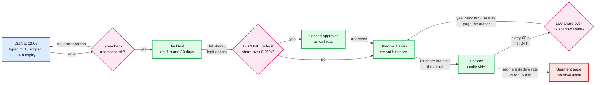

# Deep dive: the rules engine and attack response

> One-line answer: rules hold hard policy and the minutes-scale answer to a new attack, the model ranks risk across hundreds of weak signals, and both run in process from one immutable bundle; a rule written at 2 AM is typed, scoped, backtested, shadowed for 10 minutes and born with a 24 h expiry, and because the most dangerous moment is the first minute after it goes live, every new rule also carries an automatic kill that returns it to shadow when its live hit share runs 3x above what its shadow run predicted, which stops a typo after ~1,000 false declines instead of the ~13,000 a 15-minute decline-rate page allows at night.

Zoom-in on [`../solution.md`](../solution.md) §5.6 (the 2 AM rule), D6 and D8b in [`../diagrams.md`](../diagrams.md) (precedence and the rule lifecycle), and §10.9 (runbook). The rules-as-data, bundle and shadow machinery is shared with [`../../expense-rules-engine/`](../../expense-rules-engine/) (its `deep-dives/safe-rule-changes.md` and `deep-dives/rule-model-and-evaluation.md`). Reusable block: [`../../../concepts/rate-limiting-and-load-shedding.md`](../../../concepts/rate-limiting-and-load-shedding.md). Siblings: [`features-and-freshness.md`](features-and-freshness.md) (the counters rules read), [`model-lifecycle-shadow-and-labels.md`](model-lifecycle-shadow-and-labels.md).

---

## 1. Rules and the model do different jobs

| Job | Rules | GBDT (gradient-boosted decision trees) model |
|---|---|---|
| Hard policy: blocklists, sanctions hits, "validate a bank account before its first WEB (internet-initiated ACH, automated clearing house) debit", contract limits | Yes. Must be exact and explainable | No. A policy is not a probability |
| A new attack pattern tonight | Yes. Minutes from idea to enforce | No. Needs labels that take weeks |
| Ranking across ~300 weak signals | No. Thousands of thresholds nobody can reason about | Yes |
| Speed of change | Minutes (guarded) | Weekly to monthly |
| Who writes it | Risk operations analysts | Risk ML |

Uber's Mastermind is the published reference: analysts write rules in a Python-based language, "running 300 complex rules takes only 30 milliseconds", and 200 new rules shipped in the three months after a self-serve front end ([Mastermind](https://www.uber.com/blog/mastermind/), checked in solution §10.8). Ours are compiled CEL (Common Expression Language) predicates in an immutable bundle, so ~300 rules cost well under a millisecond in process.

## 2. What a rule is

```text
Rule {
  rule_id, version
  expression: CEL, typed against the feature schema   // amount_minor < 500 && bin in ATTACK_BINS
  scope: segment filter (method, tier, BIN range, merchant list)
  level: HARD_BLOCK | ATTACK | REQUIRED_STEP | ALLOWLIST | MODEL_POLICY | POST_MODEL
  action: APPROVE | STEP_UP | REVIEW | DECLINE
  mode: SHADOW | ENFORCE
  expires_at                                          // 24 h default for emergency rules, 72 h max
  owner, approver, shadow_hit_share                   // the last field feeds the auto-kill
}
```

- **Typed, not free text.** A type error comes back with its position at save time. A rule that references a feature the schema does not have cannot be saved.
- **Compiled into a bundle.** Every change makes a new bundle version, pushed to every pod (p99 ~30 s) and named on every decision, so a decision can be replayed against the exact rules that made it.
- **Expiry by default.** Emergency rules die in 24 h unless reviewed into permanent rules through a normal 7-day shadow.

## 3. Precedence, and the allowlist problem

The design's order, highest first (solution §5.6, diagrams D6): hard blocks, attack rules and attack mode, required steps, allowlists, model policy, post-model overrides. Within a level the most severe action wins.

- **Why allowlists sit below attacks.** A first draft checked allowlists (a customer plus a payment method) **before** attack rules and attack mode. Then an account takeover of a long-standing customer, or an insider who allowlists a pair, walks past every attack defense and the model. The simulation below runs both orders on the same payment: the old order approves it, the design's order steps it up.
- **What an allowlist may do.** Lower friction from the model (skip a step-up for a known customer), never override a block or an attack response. Allowlist hits are still scored and logged, and an allowlist hit rate above its 7-day baseline pages risk operations.

## 4. The 2 AM path, gate by gate



1. **02:00 attack panel.** Distinct cards spiking on 40 merchants, one BIN (bank identification number) range, all under $5.
2. **02:06 draft.** `bin in ATTACK_BINS && method == CNP_ONLINE && amount_minor < 500`, action `STEP_UP`, 24 h expiry.
3. **02:08 backtest** on the decision lake: hits in the last hour and in 30 days, and the **legitimate** share and dollars (hits not labelled or flagged as attack).
4. **Gate.** A scoped `STEP_UP` with legitimate impact under ~0.05% of its segment [estimate] needs one analyst. A `DECLINE`, an allowlist entry or more impact needs a second approver from the on-call rota.
5. **02:09 shadow, 10 minutes.** The hit share on live traffic is recorded on the rule as `shadow_hit_share`.
6. **02:19 enforce.** Under 30 s to every pod.
7. **The per-rule auto-kill** (solution §5.6 step 7). For its first 24 h, every 60 s the pod fleet reports each new rule's live hit share **of its segment's traffic**. Above 3x `shadow_hit_share`, or above 1% of the segment for a `DECLINE` rule [estimate], the rule goes back to `SHADOW` automatically and the author and the on-call are paged. Share, not count: traffic triples between 2 AM and 9 AM, and a count threshold would kill every good rule at breakfast.
8. **Morning.** Review, then permanent through a 7-day shadow, or expire.

## 5. "A rule pushed at 2 AM blocks 30% of traffic"

A bad paste loses the BIN and method clauses and turns `500` into `5000`: `amount_minor < 5000 -> DECLINE`. Every payment under $50 is declined, ~31% of traffic.

- **The backtest catches it** if it runs: 31% legitimate hit share and ~$1.07 M of legitimate payments in the hour. A `DECLINE` needs a second approver anyway.
- **If it gets through anyway** (break-glass, an approver who clicks yes at 2 AM, a backtest window that did not represent the segment), what stops it is the detector:

| Detector | Time to stop | False declines at 2 AM (~35/s [estimate]) | At the ~350/s peak |
|---|---|---|---|
| Per-rule auto-kill, one 60 s window plus a 30 s push | ~1.5 min | ~1,000 | ~10,000 |
| Segment decline rate 2x baseline for 15 min (the backstop page in solution §8), plus 5 min for a human | ~20 min | ~13,000 | ~131,000 |

- **The kill switch does not depend on the control plane.** If the rule went out through the control plane and the control plane is what broke, the kill must still land. So the design keeps a small signed kill list that every pod polls every 10 s, separate from the bundle path (solution §5.6). Any analyst can add a rule id; it is audit-logged.

## 6. What a backtest cannot tell you

- **It replays the night.** A rule built on 2 AM traffic has never seen the 9 AM mix (lunch-time small tickets on the same BIN range). Normalizing the auto-kill by segment share is what makes the morning safe.
- **It can only use logged features.** A rule on a feature the snapshot does not carry cannot be backtested: it needs a longer shadow.
- **A `DECLINE` backtest is a guess about payments we approved.** It counts how many approved payments the rule would have declined and how many of those were later labelled fraud, but labels lag 60 to 90 days, so a 30-day backtest undercounts fraud in the hits. Report "hits with a fast label" (a TC40 issuer fraud report, a review outcome) separately.
- **The attack is in the window.** The last hour includes the attack, so hit counts are inflated by design; the gate looks at the legitimate share.

## 7. Rule hygiene

- **Owner and expiry on every rule.** A monthly review retires rules that have not fired in 30 days or whose precision (hits later labelled fraud) dropped below the model's at the same decline rate.
- **An overlap linter.** Two enforced rules at the same level with different actions on overlapping scopes are flagged at save time; the most severe one wins anyway, so the lesser one is dead code.
- **Rules do not tune the model's thresholds.** Thresholds belong to the model version (risk ML plus risk policy, [`model-lifecycle-shadow-and-labels.md`](model-lifecycle-shadow-and-labels.md)); a `POST_MODEL` rule that rewrites every score above 0.1 is a threshold change wearing a rule's clothes and goes through model review.

## 8. Simulation: backtest gate, auto-kill, precedence

```python
"""A tiny rule engine with precedence, a backtest gate, and a per-rule auto-kill.
Shows why a 2 AM rule with a scope typo must be stopped by a gate, not by a 15-minute page."""
import random

SEV = {"APPROVE": 0, "STEP_UP": 1, "REVIEW": 2, "DECLINE": 3}
LEVELS = ["hard_block", "attack", "required_step", "allowlist", "model_policy", "post_model"]   # the design
OLD_LEVELS = ["hard_block", "required_step", "allowlist", "attack", "model_policy", "post_model"]
ATTACK_BINS = {f"41472{i}" for i in range(10)}

def evaluate(p, rules, levels=LEVELS):
    for level in levels:                                     # highest level with a hit decides
        hits = [r for r in rules if r["level"] == level and r["mode"] == "ENFORCE" and r["pred"](p)]
        if hits:                                             # within a level, most severe action wins
            return max((r["action"] for r in hits), key=SEV.get), [r["id"] for r in hits]
        if level == "model_policy":
            s = p["score"]
            return ("DECLINE" if s > 0.25 else "STEP_UP" if s > 0.05 else "APPROVE"), ["model"]

def traffic(rng, per_s, seconds, attack=1240):              # night traffic plus a card-testing run
    out = []
    for _ in range(int(per_s * seconds)):
        bin_ = f"{rng.randint(400000, 559999)}"
        out.append({"bin": bin_, "amount": int(rng.lognormvariate(9.1, 1.2)), "cnp": rng.random() < 0.7,
                    "score": rng.betavariate(1, 60), "attack": False})
    for _ in range(attack):
        out.append({"bin": rng.choice(sorted(ATTACK_BINS)), "amount": rng.choice([100, 200, 300]),
                    "cnp": True, "score": rng.betavariate(1, 30), "attack": True})
    return out

intended = {"id": "r_901", "level": "attack", "mode": "ENFORCE", "action": "STEP_UP",
            "pred": lambda p: p["bin"] in ATTACK_BINS and p["cnp"] and p["amount"] < 500}
typo = {"id": "r_902", "level": "attack", "mode": "ENFORCE", "action": "DECLINE",   # bad paste: BIN and CNP
        "pred": lambda p: p["amount"] < 5000}                                       # clauses lost, 500 -> 5000

rng = random.Random(2)
log = traffic(rng, per_s=35, seconds=3600)                  # last hour at ~2 AM [estimate: 10% of peak]
print(f"backtest over {len(log):,} payments from the last hour")
for r in (intended, typo):
    hits = [p for p in log if r["pred"](p)]
    legit = [p for p in hits if not p["attack"]]
    share = len(legit) / len(log)
    gate = "second approver" if r["action"] == "DECLINE" or share > 0.0005 else "one analyst"
    print(f"  {r['id']} {r['action']:8} hits {len(hits):6,}  legit hit share {share:7.3%}"
          f"  legit $ {sum(p['amount'] for p in legit) / 100:>10,.0f}  gate: {gate}")

print("if the typo is enforced anyway (break-glass), false declines before it stops:")
shadow_share = 1240 / len(log)                              # what the analyst expected the rule to hit
per_min = [sum(1 for p in traffic(random.Random(m), 35, 60, attack=0) if typo["pred"](p) and not p["attack"])
           for m in range(25)]
def stopped_after(minutes):
    return sum(per_min[:minutes])
live_share = per_min[0] / (35 * 60)
print(f"  live hit share {live_share:.1%} vs shadow {shadow_share:.1%}: auto-kill trips at 3x after one 60 s window")
print(f"  per-rule auto-kill, 60 s window + 30 s push : {stopped_after(1) + per_min[1] // 2:6,} false declines")
print(f"  segment decline page at 15 min, +5 min human : {stopped_after(20):6,} false declines")
print(f"  same page at the 350/s peak, 10x the traffic : {10 * stopped_after(20):6,} false declines")
ato = {"bin": "414723", "cnp": True, "amount": 100, "score": 0.3, "pair": "cust_5:fp_9"}   # taken-over customer
rules = [intended, {"id": "allow_17", "level": "allowlist", "mode": "ENFORCE",
                    "action": "APPROVE", "pred": lambda p: p.get("pair") == "cust_5:fp_9"}]
print("allowlisted pair during an attack, old order (allowlist above attack):", evaluate(ato, rules, OLD_LEVELS))
print("allowlisted pair during an attack, design order (attack above allowlist):", evaluate(ato, rules))
```

Output:

```text
backtest over 127,240 payments from the last hour
  r_901 STEP_UP  hits  1,240  legit hit share  0.000%  legit $          0  gate: one analyst
  r_902 DECLINE  hits 40,924  legit hit share 31.188%  legit $  1,072,516  gate: second approver
if the typo is enforced anyway (break-glass), false declines before it stops:
  live hit share 31.3% vs shadow 1.0%: auto-kill trips at 3x after one 60 s window
  per-rule auto-kill, 60 s window + 30 s push :    990 false declines
  segment decline page at 15 min, +5 min human : 13,147 false declines
  same page at the 350/s peak, 10x the traffic : 131,470 false declines
allowlisted pair during an attack, old order (allowlist above attack): ('APPROVE', ['allow_17'])
allowlisted pair during an attack, design order (attack above allowlist): ('STEP_UP', ['r_901'])
```

## 9. What an interviewer pushes on

1. **"Why not let the model learn the attack?"** Its labels arrive in weeks. Rules are the minutes-scale answer; the attack's labels go into the next training set.
2. **"An analyst fat-fingers a rule at 2 AM."** Type-check, backtest with legitimate share, second approver for a `DECLINE`, 10-minute shadow, and an auto-kill on live share. ~1,000 false declines worst case at night, not ~13,000.
3. **"Thousands of rules nobody understands."** Expiry by default, an owner per rule, monthly retirement by precision and fire rate, an overlap linter.
4. **"The control plane is down and you need to kill a rule."** A separate signed kill list polled every 10 s.
5. **"Can a rule see raw card data?"** No. The schema it types against has tokens, fingerprints, BIN and last 4 only ([`../solution.md`](../solution.md) §5.9).
6. **"Should an allowlist beat attack mode?"** No. It sits below the attack level; the old order let an allowlisted pair through an attack rule (simulation).

## 10. Trade-offs

| Decision | Option A | Option B | Chose | Why |
|---|---|---|---|---|
| Rule language | Free Python (Mastermind) | Typed CEL in a compiled bundle | CEL | Type errors at save time, no loops, microseconds per rule |
| Emergency speed | Free-for-all, or full 7-day shadow | Backtest, 10-min shadow, 24 h expiry, two-person for `DECLINE` | Guarded fast path | ~20 minutes from attack to enforce |
| Bad-rule detection | Segment decline page at 15 min | Per-rule auto-kill on live share vs shadow share | Auto-kill, page kept | 13x fewer false declines at night |
| Allowlist precedence | Above attack rules | Below attack rules and hard blocks | Below | An allowlist must not bypass an attack defense |
| Kill switch path | Through the control plane | Separate signed kill list | Separate | The kill must work when the control plane is the problem |
| What we refused | Rules that change model thresholds; rules on raw card data; rules without expiry | | | Each moves risk outside its owner's review |
