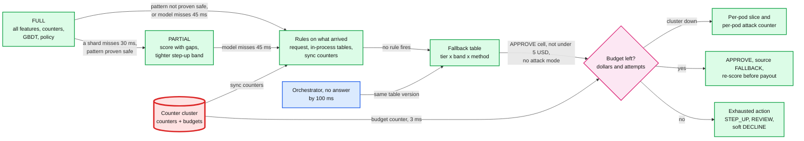

# Deep dive: timeouts and the fallback policy

> One-line answer: every stage of the risk decision (feature read, GBDT or gradient-boosted decision trees model, dedup write) has a deadline (features 30 ms, model 45 ms, store 60 ms, hard stop 80 ms), and a missed deadline steps down a ladder that risk policy signed in advance: score `PARTIAL` only for missing-data patterns an offline test proved safe, otherwise run the rules on whatever did arrive, then the fallback table by tier x amount band x method, with card-not-present payments under $5 always stepped up, under a per-merchant budget that counts **attempts as well as dollars** and scales with the merchant's own p95 hour; the flat dollar budget per tier that §4.2 starts with fails, because it lets ~2,860 $1 card tests through per merchant per hour and does not fit both a $300-an-hour merchant and a $40k-an-hour one.

Zoom-in on [`../solution.md`](../solution.md) §4.2 (the table, with the flat-dollar first cut), §5.2 (what replaces it, ownership, loss math, D6). Reusable blocks: [`../../../concepts/rate-limiting-and-load-shedding.md`](../../../concepts/rate-limiting-and-load-shedding.md) (budgets as token buckets), [`../../../concepts/caching-patterns.md`](../../../concepts/caching-patterns.md) (stale-if-error). Siblings: [`latency-budget-and-hot-path.md`](latency-budget-and-hot-path.md) (why deadlines fire), [`features-and-freshness.md`](features-and-freshness.md) (the counter cluster the budgets live in), [`layered-controls-and-merchant-risk.md`](layered-controls-and-merchant-risk.md) (the re-score before payout).

---

## 1. Deadlines, passed down

- **One deadline from the orchestrator.** `Decide` carries a 100 ms gRPC deadline. The risk service stamps stage deadlines from arrival: features by 30 ms, model by 45 ms, store by 60 ms, hard stop at 80 ms.
- **Each remote call gets `min(stage deadline, time left minus reserve)`.** The reserve (~5 ms [estimate]) pays for the fallback path itself: a table lookup in memory and one budget call with a 3 ms timeout.
- **Nothing starts that cannot finish.** A request that arrives with under ~20 ms left (it queued in the pod, or the orchestrator was slow) skips the fan-out and goes straight to the table.
- **The orchestrator never retries risk inside the request.** No answer by 100 ms means `ORCH_FALLBACK` from its own copy of the same table version. A retry would arrive after the buyer's budget is gone.

## 2. The degradation ladder

Each rung uses only what the rung above it lost (solution §5.2, D6). The red node is the counter cluster: one small Redis primary per region holds the attack counters **and** the degraded budgets, so the failure that removes one removes both. The 48 h dedup lives in a separate cluster and plays no part here.



- **Why "rules on what arrived" comes before the table.** A first draft went from "features not back by 30 ms" straight to the table, on the argument that velocity rules read the feature store. That is true of the ~300 streamed features, not of the 8 counters an attack needs: the counter script runs in parallel with the feature read, in its own cluster, and usually answers in 1 ms. When only the feature store is down, the counters, the blocklists held in process and the required-step rules are all still there, so the design runs them first and a **new** card-testing attack is still caught. The table only answers when no rule fires.
- **Why rules alone are not the whole fallback.** Rules say what is clearly bad; they cannot rank the rest, so on their own they would approve everything else. They are the first rung, not the ladder.

## 3. The full fallback table

Bands: small under $250, medium $250 to $2,500, large over $2,500 [estimate]. An amount above the merchant's own p99 ticket moves up one band. Owned by risk policy, version 17 in the examples.

| Tier | Method | Small | Medium | Large |
|---|---|---|---|---|
| A, over 12 months, clean | Card present | APPROVE | APPROVE | REVIEW (hold payout) |
| A | Online card | APPROVE | APPROVE | STEP_UP (3-D Secure, 3DS) |
| A | Keyed card | APPROVE | APPROVE | REVIEW (deferred capture) |
| A | ACH (automated clearing house), WEB (internet-initiated) or CCD (business) | APPROVE, debit in next file | APPROVE | REVIEW (debit after re-score) |
| B, 3 to 12 months | Card present | APPROVE | APPROVE | REVIEW |
| B | Online card | APPROVE | STEP_UP | STEP_UP, else soft DECLINE |
| B | Keyed card | APPROVE | REVIEW (deferred capture) | soft DECLINE |
| B | ACH | APPROVE | REVIEW | REVIEW |
| C, new or on watch | Card present | APPROVE | REVIEW | soft DECLINE |
| C | Online card | STEP_UP | STEP_UP, else soft DECLINE | soft DECLINE |
| C | Keyed card | REVIEW (deferred capture) | soft DECLINE | soft DECLINE |
| C | ACH | REVIEW (debit after re-score) | REVIEW | REVIEW, verified account only |
| D, under investigation | Any | soft DECLINE (card present small: REVIEW) | soft DECLINE | soft DECLINE |

The rows for tier A card present, online card and ACH, tier B and C online card, tier C ACH and tier D are the solution's §4.2 excerpt verbatim; the keyed rows and the card-present and ACH rows for B and C are filled in to match its §5.2 loss table (tier A small and medium plus tier B small approve card-not-present). Two guards sit in front of every cell (solution §4.2):

- **Degraded micro-amounts.** In any fallback rung, a card-not-present payment under $5 [estimate] gets `STEP_UP` (online) or soft `DECLINE` (keyed), whatever the cell says. Card testing (scripts checking stolen cards with tiny payments) lives in that band; honest buyers rarely do.
- **`STEP_UP` carries its own fallbacks** (`on_fail`, `on_unavailable`), so a 3DS outage during a risk outage never sends the orchestrator back for a second decision.

## 4. Budgets: attempts and dollars, sized to the merchant

**The design** (solution §5.2, §10.2), which replaces the flat-dollar first cut that §4.2 starts with:

- **Two token buckets per merchant** in the counter cluster, refilled every second (budget / 3,600 per second, so there is no top-of-the-hour reset that allows 2x at :59 and :00): dollars = `clamp(1.5 x the merchant's p95 hourly volume, $200, $50k)`, attempts = `max(20, 2 x its p95 hourly count)` [estimate]. Tier sets the multiplier; tier D gets none. Example: a merchant like `m_7` that sells ~$3k in its p95 hour gets buckets of $4.5k and 120 attempts. Each fallback approval takes its amount and one attempt; the buckets refill continuously, so a long outage spends at that rate, never in one burst.
- **When the counter cluster is down too,** each pod spends a local slice sized by the **maximum** pod count, with a floor of ~3 typical tickets; a restarted pod gets half a slice until it reaches the cluster.
- **A per-pod attack counter in memory.** Each pod counts a merchant's requests in the last 60 s. Above `max(3, 3 x that merchant's expected per-pod rate)`, the pod puts the merchant in local attack mode: every card-not-present payment steps up. With 12 pods an 8-a-second attack is ~40 a minute per pod, so it trips within seconds with the cluster gone.
- **Worst case is ~3x the budget, and it is stated:** cluster buckets, risk-pod slices and orchestrator slices can each be spent once in a bad hour. The fallback never waits on the network to find out.

**Why not a flat dollar budget per tier.** Solution §4.2 starts with the obvious first cut: fail-open capped at A $5k, B $2k, C $500, D $0 an hour, in dollars, with `budget / current pods` slices. §5.2 breaks it three ways:

1. **Dollars do not bound card testing.** Tests are $1 to $3. A tier A merchant's $5k is ~2,800 approved tests an hour, and every approved test validates a stolen card for the attacker and counts toward Visa's enumeration trigger (solution §1). "A double failure fails open for small payments only" was exactly the band the attacker uses.
2. **Flat does not scale with the merchant.** $5k an hour is ~17x the hourly volume of a $300-an-hour merchant (fail open on everything, attacks included) and 12% of a $40k-an-hour merchant (most of its good sales get a 3DS challenge, and some buyers walk away).
3. **Per-pod slices drift.** Risk pods autoscale on CPU, and a card-testing flood is CPU. A slice computed from the current pod count grows the total as pods are added, a restarted pod starts with a fresh slice, and for a small merchant `$585 / 12 = $49` is less than one ticket, so the slice declines everything.

### Simulation: one hour with the counter cluster and the feature store both down

Every decision uses the fallback table. Tier A cells approve small and medium. "flat" is the §4.2 first cut; "scaled" is the §5.2 design. "Cards validated" counts approved test attempts. A stepped-up good buyer abandons 15% of the time [estimate].

```python
"""One hour with the counter cluster AND the feature store down, so every decision uses the
fallback table and per-pod budget slices. Card testing ($1 to $3 attempts) may run on top.
Compares the flat dollar first cut with the design's count + dollar budget scaled to the merchant."""
import random

PODS, STEP_UP_ABANDON = 12, 0.15            # [estimate] share of good buyers lost at a 3DS challenge

def arrivals(rng, per_s, seconds):
    t, out = 0.0, []
    while per_s > 0:
        t += rng.expovariate(per_s)
        if t >= seconds:
            return out
        out.append(t)
    return out

def run(policy, hourly_usd, ticket, attack_per_s, seed=5):
    rng = random.Random(seed)
    per_pod_min = hourly_usd / ticket / 60 / PODS          # good payments per pod per minute
    if policy == "flat":                                     # section 4.2 first cut: tier A, $5k per hour
        usd, cnt, micro, local_limit = 5000.0, float("inf"), False, None
    else:                                                    # the design: scaled to the merchant's p95 hour
        usd = min(50000.0, max(200.0, 1.5 * 1.3 * hourly_usd))
        cnt = max(20.0, 2 * 1.3 * hourly_usd / ticket)
        micro, local_limit = True, max(3, 3 * per_pod_min)
    floor = 0 if policy == "flat" else 3 * ticket            # a slice must fit a few real tickets
    s_usd = [max(usd / PODS, floor)] * PODS
    s_cnt = [max(cnt / PODS, 0 if policy == "flat" else 2)] * PODS
    recent = [[] for _ in range(PODS)]                       # this merchant's requests per pod, last 60 s
    ev = [(t, "good", rng.lognormvariate(0, 0.6) * ticket) for t in arrivals(rng, hourly_usd / ticket / 3600, 3600)]
    ev += [(t, "atk", float(rng.choice([1, 1, 2, 3]))) for t in arrivals(rng, attack_per_s, 3600)]
    ev.sort()
    good_ok = good_lost = 0.0
    atk_ok = 0
    for t, kind, amt in ev:
        p = rng.randrange(PODS)
        recent[p] = [x for x in recent[p] if x > t - 60] + [t]
        local_attack = local_limit is not None and len(recent[p]) > local_limit   # in-process attack mode
        approve = (not (micro and amt < 5) and not local_attack
                   and s_usd[p] >= amt and s_cnt[p] >= 1)
        if approve:
            s_usd[p] -= amt
            s_cnt[p] -= 1
        if kind == "atk":
            atk_ok += approve                                # an approved test validates a stolen card
        elif approve:
            good_ok += amt
        else:
            good_lost += amt * STEP_UP_ABANDON               # stepped up, some buyers abandon
    return good_ok, good_lost, atk_ok

rows = [("small A, $300/h, no attack", 300, 60, 0), ("small A, $300/h, 8 tests/s", 300, 60, 8.3),
        ("large A, $40k/h, no attack", 40000, 150, 0), ("large A, $40k/h, 8 tests/s", 40000, 150, 8.3)]
print(f"{'merchant and attack':30} {'policy':7} {'good $ approved':>15} {'good $ lost':>12} {'cards validated':>16}")
for name, usd, ticket, atk in rows:
    for pol in ("flat", "scaled"):
        ok, lost, a = run(pol, usd, ticket, atk)
        print(f"{name:30} {pol:7} {ok:15,.0f} {lost:12,.0f} {a:16,d}")
```

Output:

```text
merchant and attack            policy  good $ approved  good $ lost  cards validated
small A, $300/h, no attack     flat                148            0                0
small A, $300/h, no attack     scaled              148            0                0
small A, $300/h, 8 tests/s     flat                  0           22            2,862
small A, $300/h, 8 tests/s     scaled                0           22                0
large A, $40k/h, no attack     flat              4,658        5,945                0
large A, $40k/h, no attack     scaled           41,641          398                0
large A, $40k/h, 8 tests/s     flat                750        6,532            2,429
large A, $40k/h, 8 tests/s     scaled                0        6,644                0
```

- **Flat dollars, attack on:** ~2,400 to 2,900 stolen cards validated per merchant per hour, and the attack drains the budget so the good buyers get challenged anyway. Spread over 100 targeted merchants that is ~250k to 290k cards an hour, the scale of Visa's 300,000-attempt enumeration trigger.
- **Flat dollars, big merchant, no attack:** only $4.7k of ~$40k of good sales fail open; ~$5.9k is lost to challenges. Scaled: $41.6k approved, $0.4k lost.
- **Scaled, attack on:** zero cards validated. The price is that the merchant's good card-not-present buyers are stepped up while the attack runs (good $ approved 0): the right trade for an hour, and the same thing attack mode does when everything is healthy.

## 5. `PARTIAL`: a validated lookup, not an importance rule

A first draft scored with missing feature groups if they carried under ~20% of the model's importance [estimate]. Nobody had tested that heuristic, and it measures the wrong thing: feature importance (gain) says how often a feature was used in splits, not how much accuracy is lost when it is absent; correlated features substitute for each other; and the loss depends on the payment (a missing card row hurts most on a card we have never seen).

**The design validates offline and ships a lookup table** (solution §5.1). How it is built:

1. **Data.** One mature out-of-time month (labels at least 90 days old), with the logged feature snapshots **and** the logged entity keys.
2. **Mask like production.** A missing shard does not drop a feature group. It drops every entity whose key hashes to that shard. Re-hash the logged keys and mask all groups of those entities: 4 single-shard patterns, 6 two-shard patterns.
3. **Score and cost it per segment.** For each pattern, score with the dropout-trained model and compare three things against the full score: recall at the champion's decline rate; calibration (predicted vs observed fraud rate per decile); and **expected cost**, using the same `p x L` vs `(1 - p) x C_fd` cost as the thresholds ([`model-lifecycle-shadow-and-labels.md`](model-lifecycle-shadow-and-labels.md)), against the expected cost of the fallback table cell for the same payments.
4. **Decide.** `PARTIAL` for (segment, pattern) only if its expected cost is at least 10% under the table's and its calibration error is under ~2 points [estimate]. Ship the result as a small table in the rule bundle: `(segment, missing shards) -> PARTIAL or FALLBACK`.
5. **Keep checking online.** Mask one random shard in shadow for 1% of traffic and log the `PARTIAL` action next to the `FULL` one; alert if they disagree on more than ~2% of payments. Every real `PARTIAL` is re-scored `FULL` later anyway, which gives a second disagreement measure for free.

**The encoding trap underneath.** The model must see "this card has never been seen" (a real value: count 0, first seen now, a strong fraud signal) differently from "the read failed" (no information). If both arrived as null, the model would learn that null means new, and during a shard outage every payment whose card row is missing would look like a brand-new card: `PARTIAL` scores would jump and false declines spike exactly when the system is already degraded. So the snapshot logs `NOT_FOUND` and `UNAVAILABLE` as different values, and dropout training uses `UNAVAILABLE` (solution §3.3, §10.1).

## 6. Who decides, and how much can it lose

- **Risk policy owns the table**, signed with payments product and finance; engineering owns the mechanism. Two approvers for any change, a diff showing expected loss per cell per hour at peak, a monthly game day that forces the fallback in one region.
- **The 10-minute outage math** (solution §5.2): fail open on ~$22 M of payments costs ~$15k to $25k expected; fail closed costs 210k declined payments. That math assumes buyer fraud at the base rate. During an attack the exposure is set by the attempt budget and the under-$5 rule, not the dollars.
- **Every fallback is re-scored before money leaves.** Payouts and instant deposits exclude payments whose `risk_source` is `FALLBACK` or `ORCH_FALLBACK` and whose `rescored_at` is empty. Both are read from the orchestrator's payment row (the system of record), not from a Kafka-fed view: with Kafka down, a view would not know the payment needs a re-score and would let it be paid (solution §5.2).

## 7. What an interviewer pushes on

1. **"Model timed out. Approve or decline?"** Neither by default. The cell for this merchant's tier, the amount band and the method, signed by risk policy, under the merchant's budget, re-scored before payout.
2. **"Redis and the feature store are down during a card-testing run."** Region-wide blast radius: every merchant homed there is on the table. Micro-amount step-up, the attempt budget and the per-pod attack counter keep validated cards near zero; a flat dollar budget alone would allow ~2,800 an hour per merchant.
3. **"Why not just fail closed?"** 210k declines and ~$42 M of mostly good sales in 10 minutes at peak, to avoid ~$20k of expected fraud.
4. **"Prove `PARTIAL` is safe."** Masked out-of-time evaluation per shard pattern, an expected-cost comparison against the table, and 1% shadow masking online.
5. **"What stops the budget from leaking?"** Token-bucket refill, slices sized by the maximum pod count, half a slice after a restart. Worst case is ~3x the budget, bounded and stated.

## 8. Trade-offs

| Decision | Option A | Option B | Chose | Why |
|---|---|---|---|---|
| Degraded answer | One global switch | Signed table by tier x band x method | Table | Bounded by segment, re-scored later |
| Before the table | Straight to the table | Rules on what arrived, then the table | Rules first | Sync counters usually survive a feature-store outage |
| Budget unit | Dollars per hour | Dollars and attempts, token bucket | Both | $1 tests cost nothing in dollars |
| Budget size | Flat by tier | Scaled to the merchant's p95 hour, clamped | Scaled | Fits both a $300/h and a $40k/h merchant |
| `PARTIAL` gate | Importance under ~20% | Validated lookup per segment and shard pattern | Lookup | A heuristic nobody tested is a guess |
| Missing values | One null | `NOT_FOUND` vs `UNAVAILABLE` | Two codes | Otherwise an outage looks like a wave of new cards |
| What we refused | Retrying risk inside the request; a fallback that waits on a network call longer than 3 ms | | | Both turn a degraded answer into no answer |
