# Diagrams: QuickBooks Payments with inline risk decisioning

> One-line answer: twelve views of one design. A synchronous path (orchestrator, risk decision service with rules, GBDT and policy in process, one hedged 4-shard feature read, one counter-cluster script) answers in ~15 ms p50 and steps down a ladder (validated `PARTIAL`, rules on what arrived, a signed table under attempt and dollar budgets) when a stage misses its deadline. The orchestrator's payment row holds the inline decision of record. An asynchronous path (Kafka, Flink, decision lake, labels, training, control plane) learns. A post-auth path (re-scorer, review, payout risk) decides when money may leave. The online feature store is the one red box: its tail sets the decision's tail.

The D1 to D12 set from `hld/CLAUDE.md` §4, each with a one-line caption. A diagram already in [`solution.md`](solution.md) gets a heading, a caption and a link, never a second copy. Acronyms: ACH (automated clearing house), GBDT (gradient-boosted decision trees), 3DS (3-D Secure), AZ (availability zone), KV (key-value), TC40 (Visa issuer fraud report), ODFI (originating depository financial institution, the merchant-side bank in ACH), NSF (non-sufficient funds), WEB (internet-initiated ACH entry), CAPTCHA (a challenge that tells humans from bots), TTL (time to live), PSI (population stability index).

| # | Diagram | Where it lives |
|---|---|---|
| D1 | Context | below |
| D2 | Data flow | below, plus D2b the streaming feature job |
| D3 | Component architecture (final design) | [solution §6](solution.md#6-final-design-and-the-core-flows) |
| D4 | Happy path per FR | FR1 decide: [solution §4.1](solution.md#41-decide-inline-inside-the-budget). FR2 degrade: [§4.2](solution.md#42-degrade-safely-a-bounded-pre-agreed-answer). FR3 learn: [§4.3](solution.md#43-learn-features-labels-retraining-safe-rollout). FR4 act after: [§4.4](solution.md#44-act-after-the-payment-re-score-review-hold-the-money). New below: an ACH payment, a 3DS step-up, a payout |
| D5 | Failure paths | Below: a gray AZ and a dead replica, a resumed payment, the counter cluster fails during an attack, a re-sent dispute file. In solution: card testing (§5.3), risk unreachable after a bad deploy ([§10.4](solution.md#104-failure-timeline)) |
| D6 | Decision flow | Fallback: [solution §5.2](solution.md#5-deep-dives). Rule and model precedence: below |
| D7 | Entity relationship | [solution §3.3](solution.md#33-data-model) |
| D8 | State machines | Model version: [solution §5.5](solution.md#5-deep-dives). Rule (with auto-kill), payout hold, payment risk lifecycle: below |
| D9 | Deployment / topology | below |
| D10 | Scaling / partitioning | below |
| D11 | Failure mode map | below, two trees |
| D12 | Rollout / migration | below |

## D1. Context (zoom-out)

Our system as one box: the orchestrator asks, the networks and banks report outcomes weeks later, analysts steer, payouts ask how much may leave.

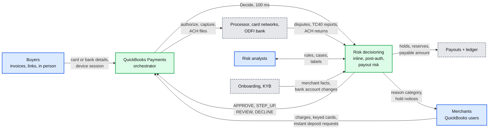

## D2. Data flow (DFD)

Inputs to outputs with format, size and rate. Peak today unless marked design (2k/s). Volumes from solution §2; marked [estimate] there.

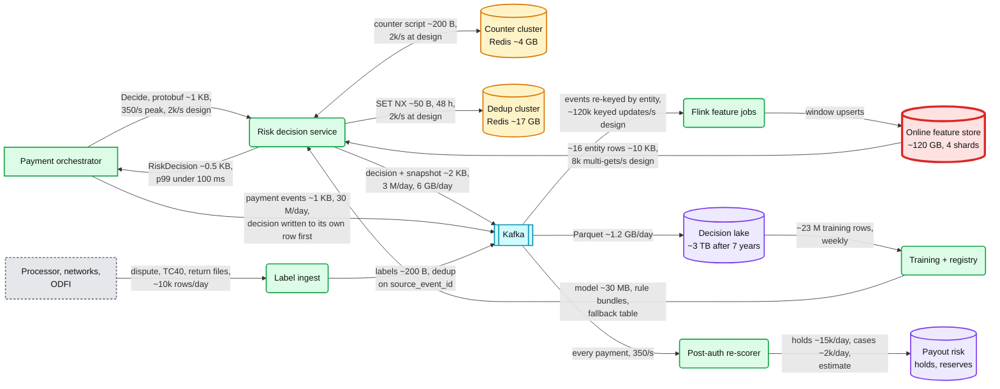

### D2b. Inside the streaming feature job

Duplicates are dropped by `event_id` in keyed state; windows run on event time; the sink only overwrites an older window version, so a replay after a restart is harmless.

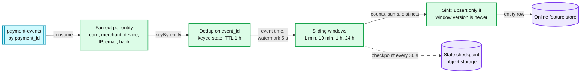

- A restart replays up to 30 s of events from the last checkpoint. Dedup state and versioned upserts make the replay a no-op, which is why the stream can lag tens of seconds during a restart and why the synchronous counters exist (solution §5.3). See [`../../concepts/stream-processing.md`](../../concepts/stream-processing.md).

## D3. Component architecture

The final design, online feature store in red. Embedded once in [solution §6](solution.md#6-final-design-and-the-core-flows).

## D4. Happy paths, one per FR

The four FR sequences are in solution §4.1 to §4.4 (links in the table above). Three more paths an interviewer asks for:

### D4a. A buyer pays a $2,400 invoice by bank transfer from a new account

The step-up is required by Nacha before the first WEB debit from an account; the money becomes payable only after the short return window.

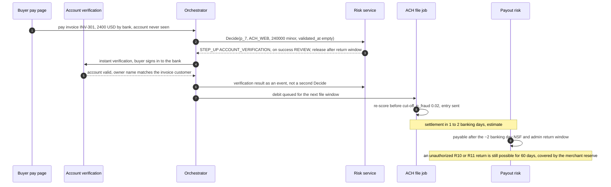

### D4b. A 3DS step-up, frictionless or challenged

`STEP_UP` carries its own fallbacks, so the orchestrator never comes back for a second decision.

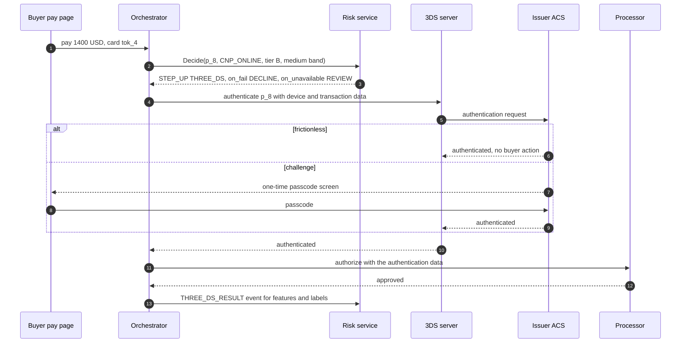

### D4c. The 5 PM payout asks what is payable

Payout risk is the last gate: holds and the reserve come off the settled balance.

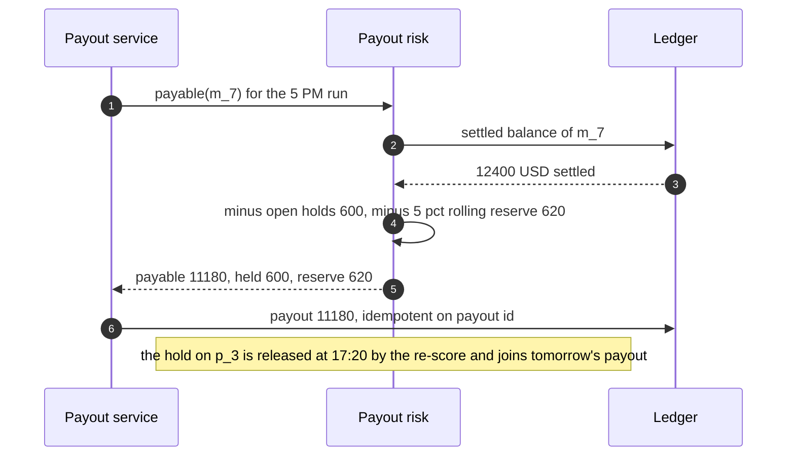

## D5. Failure paths

### D5a. A gray AZ, then a dead replica

Hedging hides a slow call; latency-based ejection hides a slow AZ, which health checks never see ([`deep-dives/latency-budget-and-hot-path.md`](deep-dives/latency-budget-and-hot-path.md) simulates both).

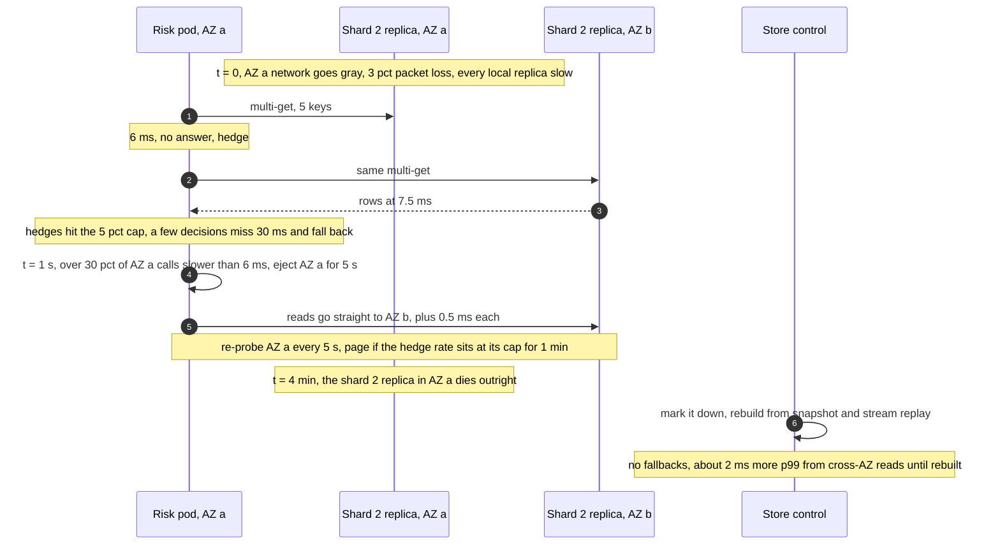

### D5b. A resumed payment gets the stored decision

The orchestrator writes the inline decision to its payment row before the processor call; risk's 48 h dedup only covers the gap before that write (solution §5.4).

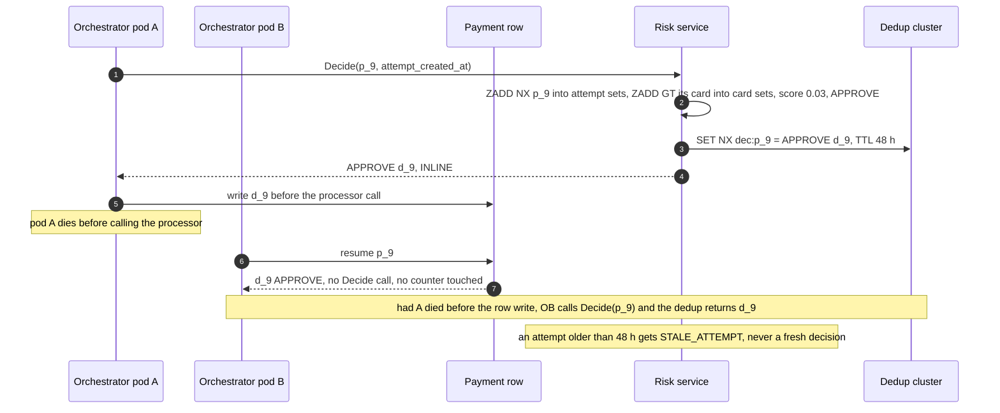

### D5c. The counter cluster fails during a card-testing run

The synchronous counters go away for ~10 s; attack mode, already pushed to every pod, and the per-pod attack counters keep merchants protected.

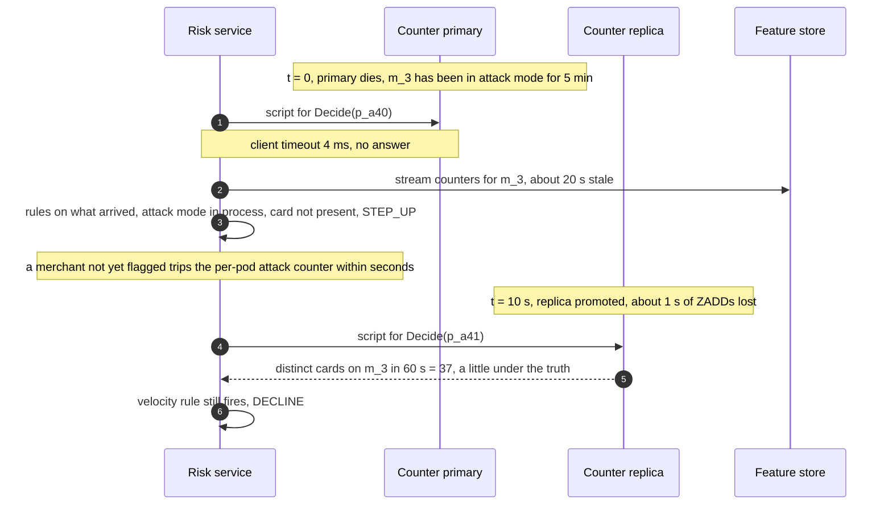

### D5d. A dispute file is re-sent, and a label arrives before its decision

Labels are idempotent on the source's own id, and an early label waits for its decision instead of being dropped.

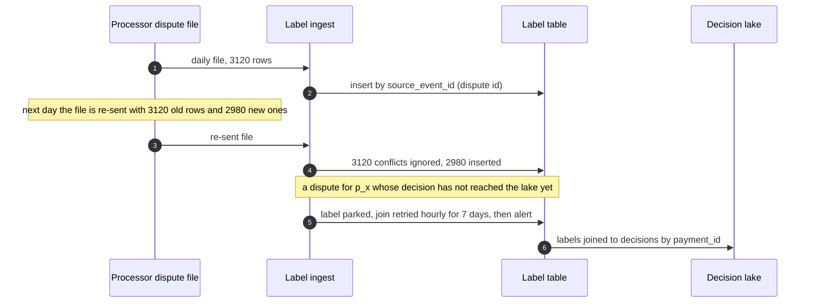

## D6. Activity / decision flow

The fallback flow is in [solution §5.2](solution.md#5-deep-dives). This is the normal path: how rules and the model combine. Precedence runs top to bottom; within one level the most severe action wins.

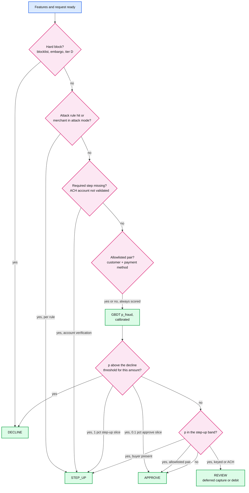

- An allowlist only removes friction (a step-up for a known customer). It never overrides a block, an attack response or a model decline; an account takeover of a long-standing customer is exactly the case it must not wave through.
- Exploration (solution §5.5): the step-up slice estimates `P(fraud | step-up)` with TC40 plus 3DS-outcome labels; the approve slice (no rule hits, tiers A and B, under $50, a monthly dollar cap) is the only estimate of `P(fraud | approve)`. Neither runs for a merchant in attack mode, which never reaches this point anyway.

## D7. Entity relationship

In [solution §3.3](solution.md#33-data-model), with partition keys and TTLs.

## D8. State machines

### D8b. Rule

An emergency rule is born expiring; for its first 24 h a live hit share over 3x its shadow share sends it back to shadow; becoming permanent goes through the normal 7-day shadow.

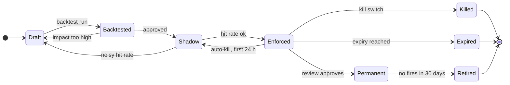

### D8c. Payout hold

A hold is released by a re-score, an analyst, or the end of the return window; nothing else moves it.

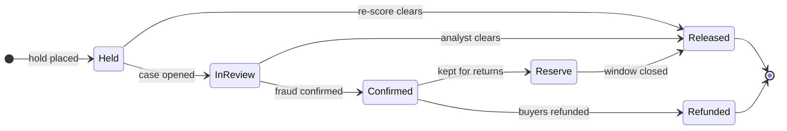

### D8d. The risk life of one payment

From the 100 ms decision to the label that arrives weeks later. The inline decision never changes; `Rescored` is a new `RESCORE` decision linked by `parent_decision_id`.

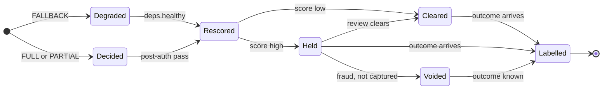

## D9. Deployment / topology

Two regions, three AZs each; merchants are homed in one region so their counters are exact. Region A is drawn in full; region B has the same shape.

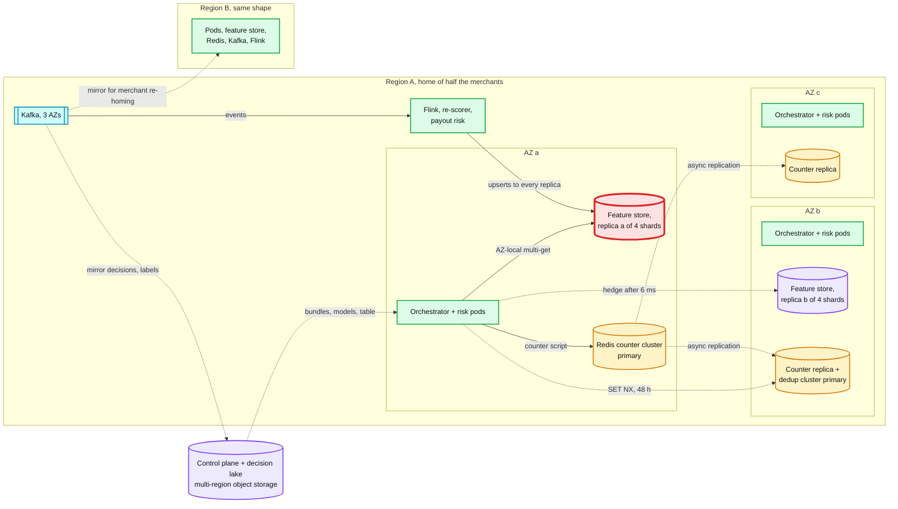

- Each region is sized to carry 2k/s alone. AZ c also has a full set of feature replicas (not drawn) so that any AZ can lose its own and hedge to another. A pod that sees over 30% of its AZ-local reads slower than 6 ms ejects that AZ for 5 s, and the orchestrator routes `Decide` away from a risk AZ whose p99 is out of line. The dedup cluster's replicas are not drawn; it is lossy by design, since the decision of record is the orchestrator's payment row ([`../payments-ledger/`](../payments-ledger/)).
- **Crosses a region:** decisions and labels mirrored to the lake, bundles and models from the control plane, and a merchant's re-homing after a region loss. The counters are per region (exact for merchant keys only); after a re-home they start empty and stream counters stand in for their first hour.

## D10. Scaling / partitioning

Entity keys hash to 4 shards; each decision sends one multi-get per shard. Red is the slow shard, not a hot key: at this scale the problem is tail latency, not load.

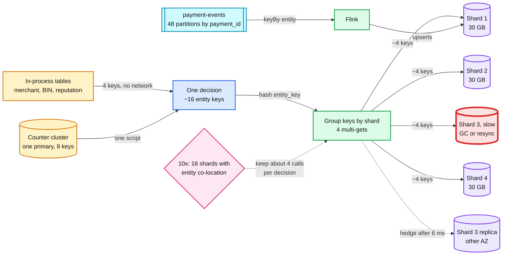

- Per shard at design: ~2k multi-gets/s of ~4 keys and ~5k upserts/s, a light load for an in-memory node. The biggest merchant's row would be the hottest key, which is why merchant features live in process. See [`../../concepts/sharding.md`](../../concepts/sharding.md) and [`../../concepts/fan-out-fan-in.md`](../../concepts/fan-out-fan-in.md).

## D11. Failure mode map

Component, then what fails and how far it reaches, then the mitigation. Two trees to stay under 15 nodes each.

### D11a. The 100 ms path

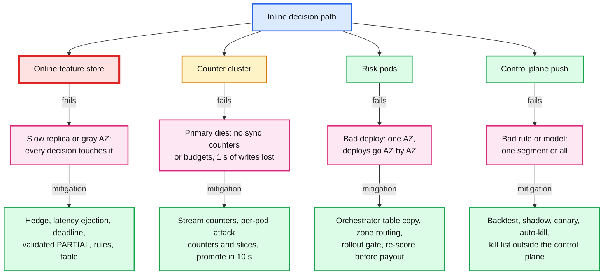

### D11b. The learning and money path

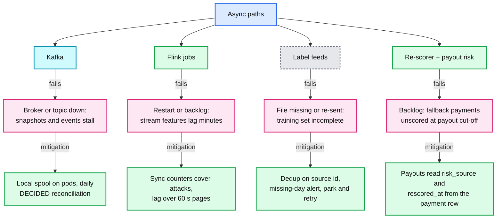

## D12. Rollout / migration

From a legacy rules engine or vendor score to this design, the five phases of [solution §8](solution.md#8-staff-level-notes). Snapshots are logged from day one, so 90 days of skew-free training data exist by phase 5. Each milestone is that phase's rollback point. Durations are estimates.

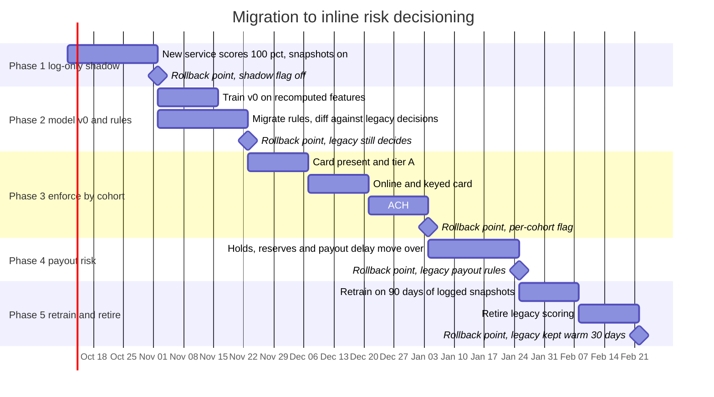

- Phase 3 starts where a wrong decision is cheapest: card present (outside VAMP's card-not-present count) and established merchants. ACH goes last because its mistakes surface up to 60 days later.
