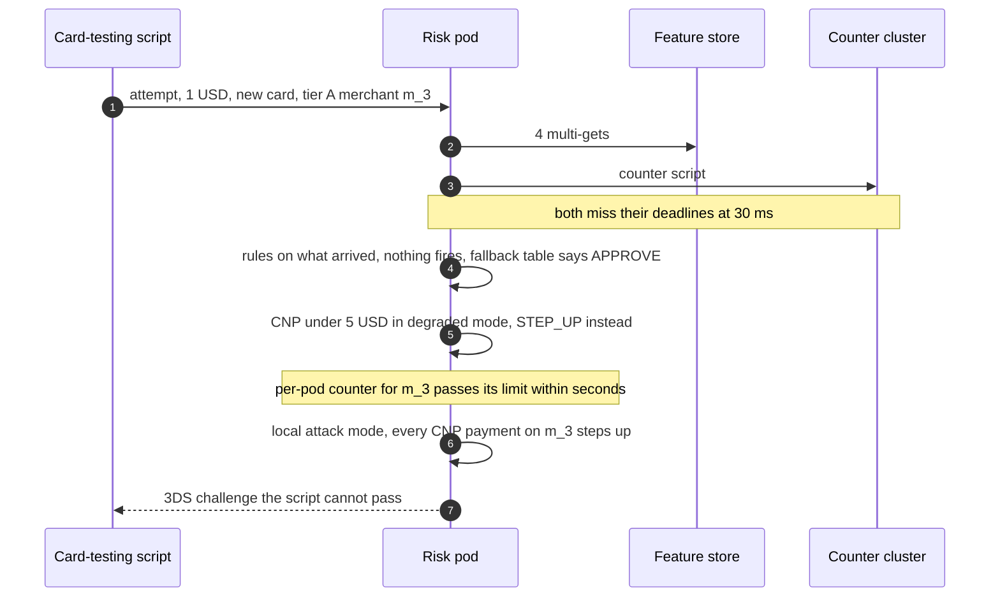
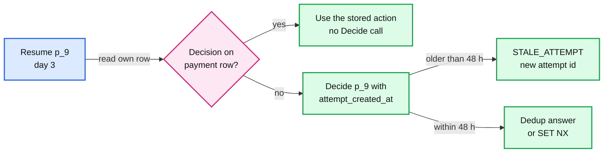
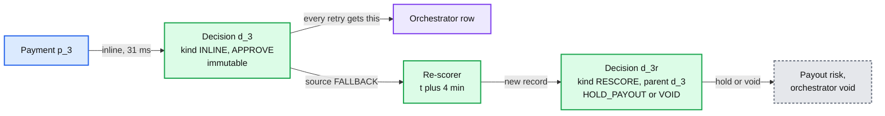
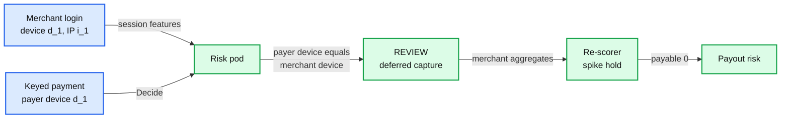

# Edge cases: QuickBooks Payments with inline risk decisioning

Every entry answerable in under 60 seconds out loud. Categories: failure, consistency, scale, data, operations, security / abuse. Design reference: [`solution.md`](solution.md). Every answer describes the design as solution.md now has it; where an earlier draft failed, the entry says why (with the simulation). An answer bullet that starts with **Proposal:** goes past what solution.md states today and is listed in the review. Acronyms: ACH (automated clearing house), AZ (availability zone), GBDT (gradient-boosted decision trees), 3DS (3-D Secure), CNP (card not present), BIN (bank identification number), TTL (time to live), SLO (service level objective), VAMP (Visa Acquirer Monitoring Program), TC40 (Visa issuer fraud report), HMAC (keyed hash), AVS (address verification), CVV (card security code), CAPTCHA (a human-or-bot challenge), AUC (area under the ROC, receiver operating characteristic, curve; 0.5 is a coin flip).

---

## Failure

## Edge case: the feature store is slow in one AZ, not down
- **Trigger:** a gray failure: congestion or 3% packet loss in AZ a. The AZ-local replicas of all 4 shards answer, slowly. Health checks pass.
- **Symptom:** fallback rate climbs for pods in AZ a only; decision p99 jumps from 17.8 ms to 34.6 ms; hedge rate pinned at its 5% cap.
- **Answer:**
  - Hedging alone fails here. The `0.99^N` tail math assumes independent calls; a slow AZ makes all 4 calls slow on the same request, every call wants to hedge, and the 5% cap lets 5% through. Simulation: p99 34.6 ms, and ~50% of decisions inside the episode miss the 30 ms stage deadline.
  - So the design ejects by latency (solution §5.1): when a pod's weighted share of calls over 6 ms passes 30%, it reads from another AZ for 5 s (+0.5 ms a read), then probes again. p99 back to 17.8 ms, fallbacks 0.012%.
  - The orchestrator routes `Decide` away from a risk AZ whose p99 is out of line, for when the slow thing is the risk pod's own AZ, and a hedge rate pinned at its cap for 1 minute pages. See [`deep-dives/latency-budget-and-hot-path.md`](deep-dives/latency-budget-and-hot-path.md) §4.
- **Confidence:** [ ] shaky  [ ] ok  [ ] confident

## Edge case: a whole feature shard is unreachable
- **Trigger:** both the AZ-local replica and its hedge for shard 2 stall (a resync, a bad node image).
- **Symptom:** ~1 in 4 entity rows missing on every decision; `source: PARTIAL` or `FALLBACK` spikes.
- **Answer:**
  - At 30 ms the stage deadline fires. The design looks up a validated table `(segment, missing shards) -> PARTIAL or FALLBACK`, built offline by masking every entity whose key hashes to the missing shard on a mature out-of-time month and comparing expected cost against the table cell (solution §5.1). An earlier "under ~20% of model importance" rule was an untested heuristic. See [`deep-dives/timeouts-and-fallback-policy.md`](deep-dives/timeouts-and-fallback-policy.md) §5.
  - Not `PARTIAL`: rules on what arrived (the counters are in their own cluster and still answer), then the table.
  - The snapshot logs `NOT_FOUND` (a card never seen) and `UNAVAILABLE` (the read failed) as different values, and dropout training uses `UNAVAILABLE`. With one null, the outage would look like a wave of brand-new cards and `PARTIAL` scores would spike.
- **Confidence:** [ ] shaky  [ ] ok  [ ] confident

## Edge case: the counter-cluster primary dies at peak
- **Trigger:** primary crash in the small Redis cluster that holds the 8 attack counters and the degraded budgets; promotion of a replica takes ~10 s; async replication loses ~1 s of writes.
- **Symptom:** counter scripts fail after their 4 ms timeout for ~10 s; synchronous counters and the shared budgets are unavailable.
- **Answer:**
  - Decisions run on stream counters (seconds stale), the attack-mode flags already pushed to pods, and per-pod attack counters; budgets fall back to per-pod slices (solution §10.4, diagrams D5c).
  - Counters come back slightly low (a few lost `ZADD`s per merchant). Nothing about the decision of record is lost: it lives on the orchestrator's payment row.
  - The dedup cluster is separate; if it dies instead, nothing is visible (at worst a recompute for a payment nobody was told about).
- **Confidence:** [ ] shaky  [ ] ok  [ ] confident

## Edge case: the counter cluster and the feature store fail together during a card-testing attack
- **Trigger:** a network event in region A takes out the feature store and the counter cluster while a script tests $1 cards on a tier A merchant's payment link at 8 a second.
- **Symptom:** every decision in the region uses the fallback table; budgets fall back to per-pod slices; no synchronous counters, no stream counters.
- **Answer:**
  - Blast radius is region-wide: every merchant homed there. The flat dollar budget that solution §4.2 starts with ($5k an hour for tier A) would not bound this, which is why §5.2 replaces it: $1 to $3 tests drain it at ~2,800 validated stolen cards per merchant per hour (simulation).
  - The design: in every fallback rung, CNP payments under $5 step up; the budget counts attempts as well as dollars, sized to the merchant's p95 hour; each pod keeps an in-memory per-merchant request counter that triggers local attack mode (solution §5.2). Simulation: 0 cards validated. See [`deep-dives/timeouts-and-fallback-policy.md`](deep-dives/timeouts-and-fallback-policy.md) §4.
  - The decision of record is untouched: it is on the orchestrator's payment row, and the dedup is a separate cluster.
- **Diagram:**

- **Confidence:** [ ] shaky  [ ] ok  [ ] confident

## Edge case: the risk service is unreachable after a bad deploy
- **Trigger:** a release that passes readiness but whose thread pool stalls under peak load (a release that crash-loops on start never takes traffic behind a readiness gate).
- **Symptom:** in the AZ that got it first, `Decide` times out at 100 ms; `ORCH_FALLBACK` on those payments.
- **Answer:**
  - The orchestrator answers from its own copy of the same table version and its own budget slices, with no network call, and writes `ORCH_FALLBACK` to the payment row. Payments keep flowing.
  - Releases go one AZ at a time behind a gate. At ~60 s zone-aware routing moves `Decide` to the other AZs; at 5 min the gate (fallback rate and p99) fails, auto-rollback, page. ~7k payments are re-scored at ~400/s before the payout cut-off (solution §10.4).
  - The same release everywhere at once would put the whole region on `ORCH_FALLBACK`, ~105k payments in 5 minutes at peak.
- **Confidence:** [ ] shaky  [ ] ok  [ ] confident

## Edge case: Kafka is down for 30 minutes
- **Trigger:** the shared cluster carrying `payment-events`, `risk-decisions` and `risk-labels` is unavailable.
- **Symptom:** decisions still flow; stream features go stale; the re-scorer sees nothing; snapshots back up on pods.
- **Answer:**
  - Pods spool decision logs and snapshots to local disk and replay when Kafka returns. Synchronous counters keep attacks covered; stream lag over 60 s pages.
  - Fallback payments made in the window cannot be re-scored until Kafka is back. Payouts exclude unscored fallbacks by reading `risk_source` and `rescored_at` on the orchestrator's payment row, not a Kafka-fed view (solution §5.2); a view would never have heard of these payments and would let them be paid out.
  - A pod that dies with an unflushed buffer loses a few snapshots: a daily job reconciles `DECIDED` payment events against `risk-decisions` and counts the gap; those rows are excluded from training (solution §4.3).
- **Confidence:** [ ] shaky  [ ] ok  [ ] confident

## Edge case: Flink restarts and streaming features lag two minutes
- **Trigger:** a deploy, a rebalance, a checkpoint restore.
- **Symptom:** "stream lag above 60 s" pages; velocity windows in the feature store are two minutes old.
- **Answer:**
  - Decisions still use the stale values, logged as-is in the snapshot, so training sees exactly what serving saw.
  - The 8 synchronous counters cover attacks: 10 tests get through instead of ~260 at 30 s lag (simulation in [`deep-dives/features-and-freshness.md`](deep-dives/features-and-freshness.md)).
  - On restart, Flink replays from its checkpoint; dedup on `event_id` and version-checked upserts make the replay a no-op.
- **Confidence:** [ ] shaky  [ ] ok  [ ] confident

## Edge case: a region is lost
- **Trigger:** region A goes dark. Its merchants are re-homed to region B.
- **Symptom:** region B carries 2k/s design alone; re-homed merchants arrive with empty counters, an empty dedup cache and fresh budgets.
- **Answer:**
  - Each region is sized for the full load. Stream counters (mirrored) stand in for the first hour (diagrams D9).
  - Resumed payments read the orchestrator's row; a recompute is possible only where the row was lost too, and those payments are re-scored.
  - **Proposal:** re-homed merchants start the hour with half their degraded budget, so a region failover does not hand every merchant a fresh full budget during the incident.
- **Confidence:** [ ] shaky  [ ] ok  [ ] confident

## Edge case: the 3DS server or the issuer's challenge page is down when we say STEP_UP
- **Trigger:** our 3DS server provider fails, or one issuer's authentication service is down.
- **Symptom:** step-ups cannot complete.
- **Answer:**
  - `STEP_UP` carries `on_unavailable` (`REVIEW` or `DECLINE`) in the first answer, so the orchestrator never comes back for a second decision.
  - `REVIEW` means authorize with deferred capture and hold; no liability shift happens, so the re-scorer's threshold for these is tighter.
- **Confidence:** [ ] shaky  [ ] ok  [ ] confident

---

## Consistency

## Edge case: the orchestrator resumes a payment after a pod death, or two calls race
- **Trigger:** pod A gets `APPROVE` for `p_9` and dies before writing its row; pod B resumes `p_9`. Or a duplicate message makes two `Decide(p_9)` calls 3 ms apart.
- **Symptom:** without care, a second decision that may differ and counters that count `p_9` twice.
- **Answer:**
  - The orchestrator writes the inline decision to its payment row before calling the processor, so a resume that finds the row answered never calls `Decide` (solution §5.4).
  - Pod A died before the row write, so nobody was told anything. B's `Decide(p_9)` hits risk's 48 h dedup: `SET NX dec:p_9` returns A's answer if it was stored; on a race, the first writer wins and the loser returns the winner's answer. If the dedup lost it, the recompute is harmless.
  - Counters are sets with member `p_9`, so the second `ZADD NX` is a no-op (diagrams D5b).
- **Confidence:** [ ] shaky  [ ] ok  [ ] confident

## Edge case: a retry arrives after the dedup entry expired
- **Trigger:** a stuck workflow resumes `p_9` after 3 days; risk's `dec:p_9` (48 h TTL) is gone.
- **Symptom:** without a guard, risk would recompute: the old attempt was trimmed from the 1 h windows, so the retry would count as a new attempt, and a newer model might answer differently.
- **Answer:**
  - The orchestrator's row is the system of record; a payment with a decision on its row is answered from the row and never re-decided.
  - It is a contract, not a hope (solution §3.2, §5.4): `Decide` carries `attempt_created_at`, and an attempt older than the 48 h dedup window gets `STALE_ATTEMPT`. The orchestrator then uses its row, or creates a new payment attempt with a new id.
- **Diagram:**

- **Confidence:** [ ] shaky  [ ] ok  [ ] confident

## Edge case: a dedup-cluster failover loses the second in which a decision was stored
- **Trigger:** `SET NX dec:p_9` acknowledged, then the dedup primary dies before replicating; a duplicate of `p_9` lands on the promoted replica.
- **Symptom:** the duplicate finds no dedup entry and recomputes.
- **Answer:**
  - Lossy by design (solution §5.4, §7): the orchestrator writes the inline decision to its payment row before the processor call, so anything already acted on is answered from the row. Only a payment nobody has been told about can be recomputed.
  - A strongly consistent store inside risk would add 3 to 10 ms of p99 to cover a gap the row already covers. Recomputes are counted (`decision_recomputed`) and alert above a baseline.
- **Confidence:** [ ] shaky  [ ] ok  [ ] confident

## Edge case: the orchestrator used its own fallback, then risk's late answer was stored
- **Trigger:** risk answered at 82 ms; the response was delayed past the orchestrator's 100 ms; the orchestrator went `ORCH_FALLBACK` (approve) while risk stored `FULL` (decline).
- **Symptom:** two decisions on record for one payment.
- **Answer:**
  - The answer that was sent wins: the payment row says `ORCH_FALLBACK`. The payment event carrying that source lets the re-scorer mark risk's decision superseded and turn the late `FULL` score into a `RESCORE` decision (solution §5.4).
  - If the late score is above the review threshold: hold the payout, or void if not yet captured.
- **Confidence:** [ ] shaky  [ ] ok  [ ] confident

## Edge case: the re-scorer voids a payment the inline decision approved
- **Trigger:** a `FALLBACK` approval re-scored 4 minutes later at 0.31 with AVS and CVV mismatches.
- **Symptom:** "same payment id, same decision" seems broken: the payment was approved, now it is voided.
- **Answer:**
  - The contract is "same payment id, same **inline** decision". The inline decision is immutable and returned to every retry; a re-score is a separate decision record (kind `RESCORE`, its own id, linked to the inline one) with its own action: hold the payout, or void before capture.
  - Solution §1.2 states the contract in these words, and `RiskDecision` carries `kind` (`INLINE` or `RESCORE`) and `parent_decision_id` (solution §3.2). The re-scorer writes `rescored_at` on the payment row.
- **Diagram:**

- **Confidence:** [ ] shaky  [ ] ok  [ ] confident

## Edge case: a stream replay or a duplicate event recounts a window
- **Trigger:** Flink restarts from a checkpoint 30 s back; the processor re-sends an `AUTH_RESULT`.
- **Symptom:** without dedup, velocity counts inflate and honest buyers get declined.
- **Answer:**
  - Flink drops duplicates by `event_id` in keyed state (TTL 1 h) and aggregates over payment-id sets; the sink overwrites only an older window version (diagrams D2b). See [`../../concepts/exactly-once.md`](../../concepts/exactly-once.md).
- **Confidence:** [ ] shaky  [ ] ok  [ ] confident

## Edge case: a card reused within minutes disappears from the distinct-card window
- **Trigger:** card `c_7` paid this merchant 30 minutes ago and pays again now.
- **Symptom:** "distinct cards on this merchant in 60 s" reads 2 when the truth is 3.
- **Answer:**
  - `ZADD NX` would keep the first-seen score; the reused card's score would be 30 minutes old, outside the 60 s range. That is the bug an earlier version had.
  - The design uses `ZADD GT` for the 2 distinct-card sets (the score moves to the latest sighting; a same-card retry still adds no member) and keeps `NX` for payment-id sets (solution §5.3). Simulation in [`deep-dives/features-and-freshness.md`](deep-dives/features-and-freshness.md) §7.
- **Confidence:** [ ] shaky  [ ] ok  [ ] confident

## Edge case: could our own soft declines erase an attacker's attempts?
- **Trigger:** during degraded mode, a tier C merchant's cells answer soft `DECLINE` to an attacker who keeps retrying.
- **Symptom:** a first draft `ZREM`ed every attempt that ended in a "technical failure (processor timeout, our soft decline)", so per-card and per-IP attempt counts would read near zero for an attacker who is hammering us.
- **Answer:**
  - The design `ZREM`s only attempts that never reached an issuer because the processor timed out (solution §5.4). Our own soft declines stay counted. Distinct-card sets are never trimmed by `ZREM`.
  - A processor timeout on `p_9` followed by the buyer's `p_10` still counts one attempt, which is what the removal is for.
- **Confidence:** [ ] shaky  [ ] ok  [ ] confident

---

## Scale

## Edge case: one merchant's payment link gets 1,000 requests a second
- **Trigger:** a bot floods one invoice link: ~3x today's platform peak, half the 2k/s design.
- **Symptom:** risk pods, feature reads and processor authorizations all scale with it; other merchants queue.
- **Answer:**
  - Edge token bucket per payment link at ~10x the merchant's p99 rate (min 5/s), CAPTCHA above it, not a 503.
  - Per-merchant bulkhead: at most ~10% of a pod's in-flight decisions; beyond it, the fallback table. Attack mode short-circuits to one script then `STEP_UP` or `DECLINE`, no feature read, no model.
  - Shed and challenge first, autoscale second: every passed request costs a processor fee and a VAMP enumeration count (solution §5.8).
- **Confidence:** [ ] shaky  [ ] ok  [ ] confident

## Edge case: card testing on a very large merchant
- **Trigger:** a merchant whose p99 is 40 distinct cards a minute; the rule threshold is `max(10, 5 x p99)` = 200.
- **Symptom:** ~200 tests pass before the rule fires.
- **Answer:**
  - So the rule also reads ratio signals that do not scale with merchant size (solution §5.3): share of never-seen cards in the last minute, share of attempts under $5, and the issuer-decline share per merchant in 5 minutes. Stripe lists spikes in failed payments and low-amount payments with nonsensical details as card-testing signs ([card testing](https://docs.stripe.com/disputes/prevention/card-testing)).
- **Confidence:** [ ] shaky  [ ] ok  [ ] confident

## Edge case: one stolen card tried on 40 merchants across both regions
- **Trigger:** a validated card is used on 20 merchants homed in each region.
- **Symptom:** each region's synchronous per-card counter sees ~20, half the truth.
- **Answer:**
  - By choice, and stated in solution §7: merchants are homed per region, so only merchant-keyed counters are exact; card, IP and device counters are per region. A synchronous cross-region call costs 30 to 70 ms [estimate], half the budget.
  - The mirrored stream sees all 40 within seconds; cross-merchant card use is a slower pattern than single-merchant enumeration. A G-counter merged across regions is the seam if it ever matters ([`../../concepts/crdt.md`](../../concepts/crdt.md)).
- **Confidence:** [ ] shaky  [ ] ok  [ ] confident

## Edge case: thousands of honest buyers share one IP
- **Trigger:** a mobile carrier's carrier-grade NAT (many phones behind one public IP) or a corporate proxy.
- **Symptom:** "attempts per IP" and "distinct cards per IP" look like card testing; honest buyers get stepped up.
- **Answer:**
  - **Proposal:** an IP reputation table in process (mobile carrier, proxy, data centre, residential) sets per-type thresholds; the IP counters are features for the model, and only data-centre IPs feed a hard velocity rule.
- **Confidence:** [ ] shaky  [ ] ok  [ ] confident

## Edge case: traffic grows to the 2k/s design point
- **Trigger:** 5.7x today's peak: ~17 M payments a day.
- **Symptom:** feature store, risk pods and both Redis clusters are fine; the question is why the hot state is two clusters.
- **Answer:**
  - At design the counter cluster holds ~4 GB and the 48 h dedup cluster ~17 GB (solution §2, §10.3), each on one primary, far from their limits.
  - A first draft kept a 7-day decision cache next to the counters, sized at today's volume (~10 GB). At design that would have been **~60 GB** (17 M x 7 x 0.5 KB) in one single-threaded primary, and under `noeviction` a growing cache could fail every counter write. Hence the split, with the decision of record on the orchestrator's payment row.
  - At ~10x the counter cluster shards by merchant hash tag; HyperLogLog replaces exact cross-merchant distinct counts.
- **Confidence:** [ ] shaky  [ ] ok  [ ] confident

## Edge case: a re-score backlog meets the 5 PM payout cut-off
- **Trigger:** a one-hour outage at peak leaves ~1.26 M `FALLBACK` payments (350/s x 3,600 s); the re-scorer runs ~400/s.
- **Symptom:** ~53 minutes to clear; payouts at 5 PM exclude whatever is still unscored.
- **Answer:**
  - Re-score in priority order: highest amount and lowest tier first, then by payout time. Unscored payments wait for the next payout run; their merchants see "processing", not a hold.
  - Scale the re-scorer horizontally for the backlog; it is async and its lag, not its latency, is the metric.
- **Confidence:** [ ] shaky  [ ] ok  [ ] confident

---

## Data

## Edge case: labels arrive 60 to 90 days late
- **Trigger:** fraud chargebacks take weeks; unauthorized consumer ACH returns (R10, R11) come up to 60 days later (Nacha: "Both return codes have a 60 days timeframe").
- **Symptom:** last month's data is full of fraud that looks legitimate.
- **Answer:**
  - Train on decisions 3 to 15 months old; use the last 90 days only for fast labels (TC40, review outcomes) and monitoring. Prove new models in shadow on leading indicators. See [`deep-dives/model-lifecycle-shadow-and-labels.md`](deep-dives/model-lifecycle-shadow-and-labels.md).
- **Confidence:** [ ] shaky  [ ] ok  [ ] confident

## Edge case: the leakage trap in training data
- **Trigger:** a data scientist joins "chargebacks on this card" from today's table, or adds AVS and CVV results to the inline model.
- **Symptom:** offline AUC jumps (simulation: 0.55 to 0.86); production gets nothing.
- **Answer:**
  - Train on logged snapshots. Every other join is as of the decision, on availability time. The inline schema may not reference events after `DECIDED`; the training job fails if it does.
  - Merchant tier from the snapshot, never today's (a closed merchant is tier D now). Split out of time and group by entity.
- **Confidence:** [ ] shaky  [ ] ok  [ ] confident

## Edge case: the exploration slice uses 3DS, which changes the outcome
- **Trigger:** ~1% of decline-band payments under $50 get `STEP_UP` to learn about the blind spot.
- **Symptom:** fraudsters abandon at the challenge, and liability moves to the issuer, so chargebacks collapse: chargeback-only labels read 1.3% when the true rate if approved is 35% (simulation). A first draft used only this slice.
- **Answer:**
  - The design runs one slice per question (solution §5.5). Step-up rows estimate `P(fraud | STEP_UP)` and good-buyer abandonment, labelled with TC40 plus the 3DS outcome, never chargebacks alone.
  - For the decline threshold, ~0.1% of model declines (no rule hits, tiers A and B, under $50) are approved under a monthly dollar cap set by risk policy: the only way to measure `P(fraud | APPROVE)`. Both are weighted by the logged propensity; no exploration for a merchant in attack mode.
- **Confidence:** [ ] shaky  [ ] ok  [ ] confident

## Edge case: a new feature needs history to train on
- **Trigger:** risk ML adds "minutes since this device last paid any QuickBooks merchant".
- **Symptom:** no logged history for it.
- **Answer:**
  - Backfill point in time from the lake on **availability** time (ingest time, not event time); then compare backfilled values of an existing feature with its logged values as a skew test. The feature goes into snapshots from day one, and the next retrain uses logged values.
- **Confidence:** [ ] shaky  [ ] ok  [ ] confident

## Edge case: a model release changes the feature schema, then needs a rollback
- **Trigger:** v42 adds a feature group and v41 lacks it; v42 is rolled back on day 2 of canary.
- **Symptom:** risk of a model scoring with inputs it was not trained on.
- **Answer:**
  - A model version is trees + calibration + thresholds + `feature_schema_version`; the pointer moves all four. Pipelines are expand-then-contract: old groups keep being produced for two model versions. Pods keep N-1 loaded, so rollback is under a minute.
- **Confidence:** [ ] shaky  [ ] ok  [ ] confident

## Edge case: an ACH debit is returned R10 on day 55, after the payout
- **Trigger:** a buyer tells their bank the debit was unauthorized; the return arrives long after the merchant was paid.
- **Symptom:** a negative balance on the merchant.
- **Answer:**
  - Dedup on the return trace number, label `UNAUTHORIZED_RETURN`, debit the merchant's balance, net against next payouts, then the reserve, then an ACH debit of the merchant's account, then collections. Count it in the merchant's unauthorized-return rate.
  - If the merchant is gone, only what is still held covers it: a 5% reserve recovers ~5%; the re-scorer's merchant-wide hold on the day-10 spike, or the unseasoned-volume cap, recovers it all (simulation in [`deep-dives/layered-controls-and-merchant-risk.md`](deep-dives/layered-controls-and-merchant-risk.md) §5).
  - Business-account debits (`ACH_CCD`) are different: their unauthorized returns use R29 with a much shorter window [unverified: 2 banking days], so the 60-day tail is a consumer-debit problem.
- **Confidence:** [ ] shaky  [ ] ok  [ ] confident

## Edge case: a buyer asks for GDPR or CCPA erasure
- **Trigger:** a privacy request under GDPR (EU General Data Protection Regulation) or CCPA (California Consumer Privacy Act) from a buyer whose email and device appear in features and snapshots.
- **Symptom:** identifiers live in the feature store, the lake (7 years) and case notes.
- **Answer:**
  - Risk stores HMACs of email, phone and account numbers, never raw values; raw contact data lives only in the orchestrator and, encrypted, in the case UI, where it is erased.
  - Keeping pseudonymous fraud records for fraud prevention and legal retention is an exception privacy counsel must confirm per regime [unverified]; HMAC keys rotate with a dual-key window so features do not reset.
- **Confidence:** [ ] shaky  [ ] ok  [ ] confident

---

## Operations

## Edge case: a rule pushed at 2 AM blocks 30% of traffic
- **Trigger:** a bad paste turns `bin in ATTACK_BINS && amount_minor < 500` into `amount_minor < 5000 -> DECLINE`.
- **Symptom:** every payment under $50 declined, ~31% of traffic.
- **Answer:**
  - The backtest shows 31% legitimate hit share and ~$1.07 M an hour; a `DECLINE` needs a second approver. That should stop it.
  - If it gets through anyway, the per-rule auto-kill stops it (solution §5.6): for its first 24 h, a live hit share over 3x its shadow share in any 60 s window sends the rule back to shadow and pages, ~990 false declines at 2 AM. Share, not count, so morning traffic does not trip it.
  - Why the auto-kill exists: the segment decline-rate page (2x baseline for 15 minutes) plus a human would have let ~13,000 false declines through at night and ~131,000 at peak (simulation). See [`deep-dives/rules-engine-and-attack-response.md`](deep-dives/rules-engine-and-attack-response.md).
- **Confidence:** [ ] shaky  [ ] ok  [ ] confident

## Edge case: a new model doubles the decline rate in one segment
- **Trigger:** v42 at 25% canary; keyed-card declines for tier B at 2x baseline.
- **Symptom:** the segment guardrail trips.
- **Answer:**
  - Registry pointer back to v41 in under a minute (trees, calibration, thresholds and schema together). Decisions by v42 are found by `model_version`; its `REVIEW` holds are re-scored and released in bulk; its declines cannot be undone, so they are counted and reported to account teams.
- **Confidence:** [ ] shaky  [ ] ok  [ ] confident

## Edge case: someone edits the fallback table so tier C fails open
- **Trigger:** a well-meant change to stop declining new merchants during outages.
- **Symptom:** the next outage approves new merchants' card-not-present payments, exactly the population bust-outs live in.
- **Answer:**
  - The table is versioned config owned by risk policy, two approvers, and the diff shows expected loss per cell per hour at peak. A monthly game day forces the fallback in one region with the active table.
- **Confidence:** [ ] shaky  [ ] ok  [ ] confident

## Edge case: the control plane is down when you need to kill a rule
- **Trigger:** the rule that is hurting traffic went out through the control plane, and the control plane's database is the thing that broke.
- **Symptom:** the kill endpoint fails.
- **Answer:**
  - The design has a separate kill path (solution §5.6): a small signed kill list that pods poll every 10 s, independent of the bundle push. Any analyst can add a rule id; it is audit-logged. The kill lands even when the control plane is what broke.
- **Confidence:** [ ] shaky  [ ] ok  [ ] confident

## Edge case: what pages at 3 AM
- **Trigger:** any of the SLO burns below.
- **Symptom:** a page to risk platform on-call, or to risk operations for attacks.
- **Answer:**
  - Engineering (solution §8): fallback rate above 1% for 5 min; decision p99 above 90 ms for 5 min; hedge rate pinned at its 5% cap for 1 min (an early sign of a gray AZ); stream lag above 60 s; null-rate spike on a top-20 feature; a kill-switch failure. The full-decision SLO is 99.9%, and unhedged tails alone would miss it at 0.39%.
  - Risk operations: decline rate in a segment at 2x baseline for 15 min; an auto-killed rule; attack-mode merchants above baseline.
- **Confidence:** [ ] shaky  [ ] ok  [ ] confident

## Edge case: migrating off the legacy engine without a big bang
- **Trigger:** the current system is a vendor score plus legacy rules.
- **Symptom:** no labels on the new feature vectors yet; nobody trusts the new decisions.
- **Answer:**
  - Phase 1 log-only shadow on 100% with snapshots from day one; phase 2 rules migrated and diffed until every difference is explained; phase 3 enforce by cohort (card present and tier A first, ACH last because its mistakes surface 60 days later), rollback by a per-cohort flag; phase 4 payout risk; phase 5 retrain on logged snapshots and retire legacy (diagrams D12).
- **Confidence:** [ ] shaky  [ ] ok  [ ] confident

## Edge case: a merchant asks why their customer was declined
- **Trigger:** a support ticket from the merchant.
- **Symptom:** the merchant wants the reason; an attacker wants the boundary.
- **Answer:**
  - The merchant gets a category and an action ("card used unusually, ask the customer to try 3-D Secure or another card"), never the score or the rule. Analysts get rule hits, versions, SHAP (SHapley Additive exPlanations) factors and a replay from the snapshot (solution §5.9).
- **Confidence:** [ ] shaky  [ ] ok  [ ] confident

---

## Security / abuse

## Edge case: a new merchant keys stolen cards into its own terminal, then withdraws
- **Trigger:** a merchant onboarded 45 days ago keys $91k of stolen cards in 3 hours and asks for an instant deposit.
- **Symptom:** each payment is valid on its own; no single card has velocity.
- **Answer:**
  - QuickBooks sees both sides. A payment whose payer device matches the merchant's own logged-in session device gets `REVIEW` with deferred capture inline (solution §4.4).
  - The re-scorer's merchant model reads volume against the merchant's own history, places a merchant-wide hold and moves it to tier D in ~30 s; `payable` is 0 at the instant deposit.
  - Instant deposit is open only to seasoned merchants whose day is within their history, and an unseasoned-volume cap (pay at most ~1.5x the seasoned daily average, hold the rest past the return windows) catches slow ramps the spike hold misses: ~$51k loss instead of ~$141k in the simulation (solution §5.7, [`deep-dives/layered-controls-and-merchant-risk.md`](deep-dives/layered-controls-and-merchant-risk.md)).
- **Diagram:**

- **Confidence:** [ ] shaky  [ ] ok  [ ] confident

## Edge case: a merchant account takeover changes the payout bank account
- **Trigger:** stolen QuickBooks credentials; the attacker changes the bank account, then waits for the payout.
- **Symptom:** the honest merchant's payouts go to the attacker.
- **Answer:**
  - Payouts cool down for 3 days [estimate] after a bank change, the previous contact is notified, and the change itself requires step-up authentication. A bank account two hops from a closed fraud merchant in the graph opens a case.
- **Confidence:** [ ] shaky  [ ] ok  [ ] confident

## Edge case: a merchant refunds a stolen-card charge to a card it controls
- **Trigger:** charge a stolen card $2,000, refund $2,000 to the merchant's own card.
- **Symptom:** money leaves without any payout, so payout holds never see it.
- **Answer:**
  - Refunds go only to the original payment method and never above the captured amount; refund velocity per merchant is a synchronous counter; a refund on a payment under hold is blocked (solution §4.4, §5.7).
- **Confidence:** [ ] shaky  [ ] ok  [ ] confident

## Edge case: an attacker probes the decision boundary
- **Trigger:** a fraudster varies amount, BIN and device to learn what passes.
- **Symptom:** a slow climb in approvals for one pattern.
- **Answer:**
  - Buyers and merchants get categories, never scores; the decline code a buyer sees is generic. Per-device, per-IP and per-merchant limits cap the probes. The exploration slice adds a little randomness at the boundary, and the disagreement set catches a pattern the champion misses.
- **Confidence:** [ ] shaky  [ ] ok  [ ] confident

## Edge case: an insider allowlists a fraud ring
- **Trigger:** an analyst adds customer-and-card pairs to the allowlist.
- **Symptom:** those pairs skip the model's friction.
- **Answer:**
  - Two-person approval above a dollar limit, every console action audit-logged, allowlist hit rate monitored.
  - Allowlists sit below hard blocks and attack rules (solution §5.6, diagrams D6): an allowlist may skip a step-up, never override a block or an attack response. A first draft put them above attacks; the simulation shows that order approving an allowlisted pair during an attack, and the design's order stepping it up ([`deep-dives/rules-engine-and-attack-response.md`](deep-dives/rules-engine-and-attack-response.md)).
- **Confidence:** [ ] shaky  [ ] ok  [ ] confident

## Edge case: something other than the orchestrator calls `Decide`, or sends garbage
- **Trigger:** a compromised internal service, or a malformed request (negative amount, unknown currency, missing card fingerprint).
- **Symptom:** a free scoring oracle, or a crash on the hot path.
- **Answer:**
  - mTLS (mutual TLS) service identities: only the orchestrator's identity may call `Decide`. Requests are schema-validated before anything else; an invalid request gets a typed error the orchestrator treats as a decline, never a fallback approval.
- **Confidence:** [ ] shaky  [ ] ok  [ ] confident

## Edge case: friendly fraud poisons the labels
- **Trigger:** a cardholder disputes a real purchase as "fraud".
- **Symptom:** honest patterns get labelled fraud, and the model learns to decline them.
- **Answer:**
  - Labels keep the reason code and the representment outcome; a dispute the merchant won is not fraud. A merchant cannot label its own payments as fraud. TC40s and analyst outcomes cross-check chargebacks.
- **Confidence:** [ ] shaky  [ ] ok  [ ] confident
