# HLD: QuickBooks Payments with inline risk decisioning

> One-line answer: the payment orchestrator calls a **risk decision service** with a hard 100 ms budget before it asks the processor to authorize. Inside that budget: one parallel batch read of precomputed features from an in-memory **online feature store** (~15 ms p99 after hedging, ~6 ms p50), request-time features, a deterministic **rules layer** (blocklists, sanctions, velocity caps) and an in-process gradient-boosted model (~5 ms), then a policy that maps score plus merchant segment to approve, decline, step up (3-D Secure for cards, extra verification or a delayed debit for ACH) or approve-and-hold-payout. Every stage has its own deadline. When the model or the feature store misses its deadline, the service does not guess: it returns a **pre-computed fallback decision** for the merchant's risk tier (fail open for established merchants and small amounts, under a per-merchant budget in attempts and dollars; step up or fail closed for new merchants and large amounts), marks the payment for async re-scoring, and holds the merchant's payout if the late score is bad. The orchestrator writes the inline decision to its payment row before the processor call and risk keeps a 48 h dedup, so a retry gets the same answer and never double counts a velocity counter. Inline scoring is only the first of three layers: QuickBooks pays merchants out, so payout holds and reserves catch merchant fraud that no 100 ms model can see.

Sources: the problem statement and numbers in [`README.md`](README.md) (Tier 3, #52; not a reported candidate prompt, it plays to an Uber Risk background). The agent survey [`research/facts-survey.md`](research/facts-survey.md) is weak, so every external number below was re-checked on a primary page: Stripe's ["How we built it: Stripe Radar"](https://stripe.dev/blog/how-we-built-it-stripe-radar) (2023-03-29) and Stripe docs on [risk evaluation](https://docs.stripe.com/radar/risk-evaluation), [card testing](https://docs.stripe.com/disputes/prevention/card-testing), [monitoring programs](https://docs.stripe.com/disputes/monitoring-programs) and [3-D Secure (3DS)](https://docs.stripe.com/payments/3d-secure/authentication-flow); Uber's [Mastermind](https://www.uber.com/blog/mastermind/) (2017); Visa's [VAMP fact sheet](https://corporate.visa.com/content/dam/VCOM/corporate/visa-perspectives/security-and-trust/documents/visa-acquirer-monitoring-program-fact-sheet-2025.pdf); Nacha's [fraud monitoring phase 1](https://www.nacha.org/rules/risk-management-topics-fraud-monitoring-phase-1), [new rules](https://www.nacha.org/newrules), [WEB (internet-initiated) debit account validation](https://www.nacha.org/rules/supplementing-fraud-detection-standards-web-debits) and [R10/R11](https://www.nacha.org/rules/differentiating-unauthorized-return-reasons) pages; [EMVCo 3-D Secure](https://www.emvco.com/emv-technologies/3-d-secure/). Anything I could not verify is marked [estimate]. Reusable blocks: [`../../concepts/fan-out-fan-in.md`](../../concepts/fan-out-fan-in.md) (tail latency, hedging), [`../../concepts/stream-processing.md`](../../concepts/stream-processing.md), [`../../concepts/exactly-once.md`](../../concepts/exactly-once.md), [`../../concepts/caching-patterns.md`](../../concepts/caching-patterns.md), [`../../concepts/rate-limiting-and-load-shedding.md`](../../concepts/rate-limiting-and-load-shedding.md), [`../../concepts/bloom-filter.md`](../../concepts/bloom-filter.md), [`../../concepts/stream-sketches.md`](../../concepts/stream-sketches.md). Neighbours I link instead of repeating: [`../expense-rules-engine/`](../expense-rules-engine/) §4.3 and [`deep-dives/authorization-hot-path.md`](../expense-rules-engine/deep-dives/authorization-hot-path.md) (a deadline-bound decision on a card authorization, rules as versioned data, shadow and simulation), and [`../payments-ledger/`](../payments-ledger/) §1 and §6 (the orchestrator, idempotency keys, the ledger that holds money). That file budgets ~50 ms for risk inside a whole payment API call and defaults to failing open to rules; here the risk service gets its own p99 of 100 ms at the orchestrator, and that default is refined into rules on what arrived, then a signed fallback table (§5.2). Written flow-first: §4 builds one diagram one functional requirement at a time, §5 breaks and mutates it one non-functional requirement at a time, §6 shows the final design and the flows to rehearse.

---

## 1. Understanding the problem

QuickBooks Payments lets a small business take cards (in person, keyed, or online through an invoice or payment link) and ACH (automated clearing house, the US bank-transfer network) bank payments. Intuit collects the money and pays it out to the merchant. Before the orchestrator asks the processor to authorize, it asks us: should this payment go through?

Three facts shape every decision. Say all three in the first minute:

1. **100 ms is a wall on the checkout path, not a target.** Risk runs before the processor call, so its latency is the buyer's latency. A miss must produce a pre-agreed answer, never an exception and never "whatever the code defaults to". And the long pole is not the model: it is the tail of a parallel feature read, where the slowest of N calls sets the decision's p99.
2. **The truth arrives after the money leaves.** Fraud chargebacks take weeks. Unauthorized consumer ACH debits can be returned for 60 days (Nacha R10 and R11). QuickBooks pays merchants in a day or two. So an inline score is our first chance, not our only one, and **holding money** (delaying capture, holding a payout, a reserve) is the strongest control we have.
3. **Two adversaries, and the network keeps score.** Buyers with stolen cards or bank logins (fast, many cards against one merchant: card testing) and **merchants who are the fraud** (bust-out: build trust, spike, cash out, vanish), which no per-payment model can see. Visa's VAMP (Visa Acquirer Monitoring Program) counts fraud reports plus disputes per settled card-not-present transaction: a US merchant with at least 1,500 of them in a month is "Excessive" at ≥150 bps (basis points, hundredths of a percent) from 1 April 2026 (220 bps before), an acquirer portfolio is "Above Standard" at ≥50 bps, and card testing has its own trigger at ≥300,000 enumerated attempts and ≥20% of authorizations ([Visa fact sheet](https://corporate.visa.com/content/dam/VCOM/corporate/visa-perspectives/security-and-trust/documents/visa-acquirer-monitoring-program-fact-sheet-2025.pdf)). That is the external loss budget.

### 1.1 Functional requirements

Core:
1. **Decide inline.** For every card and ACH payment, return `APPROVE`, `STEP_UP`, `REVIEW` or `DECLINE` before the processor is called, inside the budget. `STEP_UP` is 3-D Secure (3DS) for an online card, account verification or a delayed debit for ACH. `REVIEW` means approve the payment but hold its money (authorize now and capture later, or hold the payout) until a later check clears it.
2. **Degrade safely.** When any dependency is slow or down, return a bounded, pre-agreed decision instead of blocking the payment or approving everything.
3. **Learn.** Stream payment events into features (velocity counters, graph links), collect labels (chargebacks, ACH returns, confirmed fraud), retrain, and roll out new models and rules behind shadow and canary.
4. **Act after the payment.** Re-score asynchronously with heavier models, hold or delay merchant payouts, set reserves, and queue cases for human review.

Below the line (say it out loud, it is graded):
- **Merchant onboarding underwriting (KYB, know your business)**, except as a feature source (tier, owner links, bank account).
- **Dispute handling workflow** (evidence, representment) and **the case-management UI**. We consume dispute outcomes as labels and define the review queue's payload.
- **The processor and card networks themselves**, and the ledger (that is [`../payments-ledger/`](../payments-ledger/)).
- **AML (anti-money laundering) transaction monitoring** and sanctions screening of merchants. A sanctions or blocklist hit is one input to our rules; the screening program is not ours.

### 1.2 Non-functional requirements

Ask for scale first: payments a day, card vs ACH mix, ticket size, how fast merchants are paid, and which latency the orchestrator gives us. Then:

| Dimension | Target | Why it matters |
|---|---|---|
| Scale | ~3 M payments/day [estimate] (avg ~35/s, peak ~350/s), designed for 2k/s. ~20 entity feature lookups per decision, so ~40k feature reads/s at design peak. ~10 events per payment into the stream | Throughput is small. Attack bursts on one merchant are the real spike |
| Latency | Risk decision p99 under 100 ms, p50 ~30 ms, measured at the orchestrator. Internal hard stop at 80 ms, then fallback | Every millisecond is checkout latency, and the processor call still has to fit after us |
| Availability | Payments 99.99%. A risk outage must never take payments down. The fallback path has no network dependency | Risk is a dependency of revenue. It may degrade decisions, never availability |
| Feature freshness | Velocity counters visible to the next decision in under 1 s p99 for the same card or merchant. Batch features daily | Card testing fires hundreds of attempts a minute; a 30 s stream lag lets most of them through |
| Correctness | Same payment id, same inline decision (the async re-scorer may still hold the payout or void before capture, and that is logged as a separate decision). Velocity counters are idempotent per payment id. Every decision logged with features, model version and rule version for replay | A retry that trips our own velocity rule is a false decline we caused. Unreplayable decisions cannot be explained or trained on |
| Loss budget | Fraud loss and false declines are the product metrics. Degraded-mode exposure is capped per merchant in attempts and dollars, sized to the merchant's p95 hour (clamped $200 to $50k) and refilled as a token bucket; card-not-present payments under $5 always step up in fallback, so a dollar cap cannot be used for card testing | Fail open and fail closed both cost money; the cap is what makes fail open a decision instead of a hope. A $1 card test costs nothing in dollars, so dollars alone are not a cap |
| Security | Card data never enters the risk service in clear (tokens and fingerprints only). PCI DSS (Payment Card Industry Data Security Standard) scope kept to the vault | A fraud system sees every payment. It must not drag the whole platform into PCI scope |

---

## 2. Back-of-envelope

Only the numbers that change the design. Inputs marked [estimate] are assumptions to state out loud; QuickBooks Payments does not publish volume.

```
Payments        3 M/day [estimate] / 86,400 s = 34.7/s avg. Peak 10x = ~350/s.
                Design 2k/s = 5.7x today's peak: growth plus attack bursts.
Dollars         avg ticket ~$200 [estimate] -> ~$600 M/day, ~$7k/s avg.
Mix by count    card present 20%, card not present (CNP) 55%, ACH 25% [estimate].
Feature reads   ~20 entity keys per decision (card fingerprint, payer email, device, IP,
                bank account, card x merchant, customer, BIN (bank identification number,
                the card's first digits), merchant, ...).
                2k/s x 20 = 40k key reads/s at design, 7k/s at today's peak.
                4 of the 20 (merchant, BIN, email domain, routing number) are small
                tables kept in process. The other ~16 go out as 4 shard-grouped
                multi-gets: 2k x 4 = 8k calls/s at design.
Online store    100 M cards x 0.5 KB + 100 M payer emails x 0.3 KB + 50 M devices x 0.3 KB
                + 50 M IPs x 0.2 KB + 20 M bank accounts x 0.5 KB + 1 M merchants x 4 KB
                = 50 + 30 + 15 + 10 + 10 + 4 = ~120 GB [estimate].
                4 shards x 30 GB, one replica per AZ (availability zone) = 360 GB RAM per region.
Sync counters   8 keys per decision (merchant, card, IP, device, bank account, email,
                distinct-cards-per-merchant, distinct-cards-per-IP), ~70 B per member,
                longest window 1 h: 2k/s x 8 x 3,600 s x 70 B = ~4 GB at design (0.7 GB today).
Dedup cache     48 h of SET NX entries: 2k/s design x 172,800 s x ~50 B = ~17 GB, its own
                Redis cluster. The decision of record is the orchestrator's payment row.
Events          ~10 per payment (decided, authorized, captured, settled, refunded,
                3DS result, payout, ...) = 30 M/day = 347/s avg, ~3.5k/s peak, 20k/s design.
                ~1 KB each = 30 GB/day.
Decision log    decision ~0.8 KB + feature snapshot (~300 features x 4 B) ~1.2 KB = ~2 KB.
                3 M x 2 KB = 6 GB/day raw, ~2.2 TB/year, ~0.45 TB/year as Parquet (~5x).
Model CPU       GBDT (gradient-boosted decision trees), ~1,000 trees of depth 8 over ~300
                features: ~2.5 ms on one core [estimate].
                2k/s x 2.5 ms = 5 cores for the champion, 5 more for a challenger scored in
                shadow after the response is sent, never on the request thread.
Labels          fraud labels ~0.1% of payments [estimate] = ~3k/day.
                ACH returns of all kinds ~1% of ACH [estimate] = ~7.5k/day, unauthorized ones
                arrive for up to 60 days.
Training set    12 months x 3 M = 1.1 B decisions, ~1.1 M positives; negatives sampled 1:20
                -> ~23 M rows. Hours on a few machines, not a cluster problem.
Review          ~2k cases/day [estimate] x 3 min = ~100 analyst-hours/day, ~13 analyst shifts a day.
Payouts         ~300k merchants paid per day [estimate], each asks "how much is payable".
```

**Latency budget for one decision** (our side, warm connections, same AZ):

| Stage | p50 | p99 | Stage deadline (from arrival) |
|---|---|---|---|
| Orchestrator to risk service (mTLS, mutual TLS, gRPC) | 1 ms | 4 ms | |
| Parse, request-time features, in-process caches (merchant tier, BIN, fallback table) | 0.5 ms | 2 ms | |
| In parallel: 4 feature-store multi-gets (hedged; ~3 ms p50 on their own), one counter-cluster script, one dedup lookup | 6 ms | 15 ms | 30 ms |
| Pre-model rules (compiled, in process) | 0.3 ms | 1 ms | |
| GBDT model, in process | 2.5 ms | 5 ms | 45 ms |
| Policy and post-model rules | 0.2 ms | 0.5 ms | |
| Dedup entry (`SET NX` by payment id, 48 h) | 1 ms | 4 ms | 60 ms |
| Decision and feature snapshot to Kafka (in-memory buffer, async) | 0 | 0 | |
| Response to orchestrator | 1 ms | 4 ms | |
| GC (garbage collection) pauses, queueing, serialization allowance | 2 ms | 10 ms | |
| **Total** | **~15 ms** | **~46 ms bound** | **hard stop 80 ms** |

- The p99 column adds p99s, so it is an upper bound, not a p99. Two stages rarely hit their tails on the same request.
- ~15 ms p50 on our side and ~20 ms at the orchestrator sits inside the ~30 ms p50 target with room for growth (more features, a bigger model).
- The 80 ms hard stop leaves 20 ms for the response leg and the orchestrator's own work inside its 100 ms. It is the wall for anything without its own timeout: a GC pause, a starved thread pool.

**What the numbers tell us.** 350/s is one server's worth of work, 120 GB fits in four memory nodes, and the decision log costs pennies. Nothing here is a throughput problem. The two real constraints are **time**: the p99 tail of a parallel read inside an 80 ms wall (§5.1), and a learning loop whose labels arrive 60 to 90 days after the payouts they should have stopped (§5.5, §5.7).

---

## 3. The set-up

Product-style.

### 3.1 Core entities

- **Payment attempt**: one `payment_id` from the orchestrator. A buyer clicking "Pay" again after a decline is a new attempt with a new id; the orchestrator's retry of the same attempt keeps the id.
- **Decision**: the answer for one payment id, with its kind (`INLINE` once; `RESCORE` later, linked by `parent_decision_id`), action, source (`FULL`, `PARTIAL`, `FALLBACK`, `ORCH_FALLBACK`), score, reasons and versions. Immutable once stored; a re-score never edits the inline decision, it adds one.
- **Feature snapshot**: the exact feature vector the model saw, logged with the decision. Training reads it; nobody recomputes it.
- **Entity features**: precomputed values per entity key (card fingerprint, payer email hash, device, IP, bank account hash, merchant, BIN), in feature groups with their own freshness (batch daily, stream seconds).
- **Velocity window**: a short-window set of members (payment ids or card fingerprints) per entity, for the synchronous counters.
- **Rule** and **rule bundle**: a typed predicate plus scope, action, precedence, mode (`SHADOW` or `ENFORCE`) and expiry, compiled into immutable bundle versions.
- **Model version**: a trained, calibrated model with its role (`SHADOW`, `CANARY`, `CHAMPION`) and thresholds per segment.
- **Merchant risk profile**: tier (A to D), degraded-mode budget (dollars and attempts), payout delay, reserve, attack-mode flag.
- **Fallback table**: a versioned map `(tier, amount band, payment method) -> action`, owned by risk policy.
- **Label**: an outcome joined to a payment id later: fraud chargeback, TC40 (Visa's issuer fraud report), unauthorized ACH return, review outcome, merchant loss.
- **Payout hold** and **review case**: money held for a payment or a merchant, and the human work item that releases or keeps it.

### 3.2 API

Data plane. Internal only; the orchestrator is the only caller of `Decide`.

| Call | Caller | Request | Response | Notes |
|---|---|---|---|---|
| `Decide` (gRPC) | Payment orchestrator | `payment_id, merchant_id, method (CARD_PRESENT, CNP_ONLINE, CNP_KEYED, ACH_WEB, ACH_CCD), amount_minor, currency`, card `{token, fingerprint, bin, last4, wallet}` or bank `{routing, account_hmac, validated_at}`, payer `{email_hmac, phone_hmac}`, `device_session_id, ip, invoice_id, customer_id, attempt_created_at`, gRPC deadline | `RiskDecision` (below), or `STALE_ATTEMPT` if the attempt is older than the 48 h dedup window | Idempotent on `payment_id`. No PAN (primary account number), ever; identifiers arrive as HMACs (keyed hashes) |
| `payment-events` (Kafka) | Orchestrator, processor adapters | `event_id, payment_id, stage` (`AUTH_RESULT` with AVS (address verification) and CVV (card security code) results, `CAPTURE`, `REFUND`, `THREE_DS_RESULT`, `SETTLED`, `PAYOUT`) | | Feeds streaming features and the re-scorer. Dedup on `event_id` |
| `risk-labels` (Kafka) | Dispute, TC40, ACH return and review ingesters | `source_event_id, payment_id, label_type, reason_code, event_date` | | Dedup on `source_event_id` (dispute id, return trace number, case id) |
| `GET /v1/merchants/{id}/payable` | Payout service | | `payable_minor, held_minor, reserve_minor, holds[]` | Called before every payout and every instant deposit |
| `GET /v1/decisions/{payment_id}` | Analysts, support | | decision, rule hits, top factors, snapshot, versions | Internal explain and replay |
| `GET /v1/merchant/payments/{id}/risk` | QuickBooks app | | reason category, what the buyer can do, hold release date | Coarse on purpose, see §5.9 |

Control plane. Analysts and the ML team, behind SSO (single sign-on) and MFA (multi-factor authentication).

| Call | Request | Response | Notes |
|---|---|---|---|
| `POST /v1/rules` | CEL (Common Expression Language) expression, scope, action, precedence, `expires_at` | draft, type errors with positions | Same rules-as-data model as [`../expense-rules-engine/`](../expense-rules-engine/) §4.1 |
| `POST /v1/rules/{id}:backtest` | window (24 h, 30 days) | hits, dollars, estimated false declines by segment | Minutes, on the decision lake |
| `POST /v1/rules/{id}:promote` | `mode: SHADOW or ENFORCE`, approver | new bundle version | Global `DECLINE` needs a second approver (§5.6) |
| `POST /v1/rules/{id}:kill` | | new bundle version | Any analyst, under 30 s to every pod |
| `POST /v1/models/{version}:promote` | `role: SHADOW, CANARY(pct), CHAMPION` | registry pointer | Needs an eval report id (§5.5) |
| `POST /v1/cases/{id}:resolve` | `outcome: FRAUD or LEGIT`, notes | label emitted, holds released or kept | The fastest label source we have |

**The return type.**

```text
RiskDecision {
  decision_id, payment_id
  kind: INLINE | RESCORE, parent_decision_id?   // a re-score is a new, linked decision
  action: APPROVE | STEP_UP | REVIEW | DECLINE
  step_up?: {type: THREE_DS | ACCOUNT_VERIFICATION | DELAYED_DEBIT,
             on_fail: DECLINE | REVIEW, on_unavailable: REVIEW | DECLINE}
  hold?:    {capture: DEFERRED | NOW, payout: HOLD_UNTIL_CLEARED | NORMAL}
  source: FULL | PARTIAL | FALLBACK | ORCH_FALLBACK
  reason_codes: [..]               // internal codes; the merchant sees a category
  score?: 0.0..1.0                 // calibrated probability, never leaves the risk boundary
  model_version, rule_bundle_version, fallback_table_version, feature_schema_version
  decided_at, timings_ms {features, counters, model, total}
}
```

- **`STEP_UP` carries its own fallbacks.** A 3DS outage or a buyer who fails the challenge must not send the orchestrator back to us for a second decision. The answer to "and then?" is in the first answer.
- **`REVIEW` is "approve but hold the money"**, not "wait for a human". The buyer sees success. Capture is deferred for a card-not-present card, online or keyed (so a void costs nothing, see §5.7), and the payout is held for everything else.
- **`source`** is how every downstream system knows a decision was degraded, and how the re-scorer finds work.
- **`kind`** keeps the contract honest: the inline answer for a payment id never changes; a later hold or void is its own `RESCORE` decision pointing at the inline one.
- **Versions** make the decision replayable and attributable: which model, which rules, which fallback table.

### 3.3 Data model

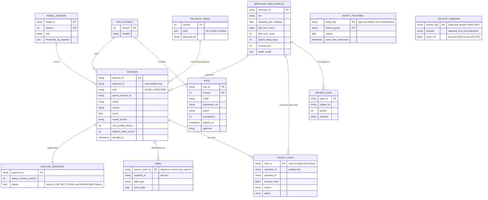

Access patterns that justify it:
- **Inline decision by `payment_id`** (every resume, every payout check): the orchestrator writes `decision_id`, action, `risk_source` and later `rescored_at` to its payment row **before** it calls the processor. That row is the system of record; a resumed payment reads it and never calls `Decide` again. Risk keeps only a 48 h dedup, `dec:{payment_id}` with `SET NX` and a TTL (time to live), in its own Redis cluster, for concurrent duplicates and a pod that died between our answer and its row write.
- **Features by entity key** (every decision, ~16 keys): the online store is partitioned by `hash(entity_key)` over 4 shards. The key is `type:HMAC(id)`, never a raw email or account number. Feature groups of one entity live in one row, so one entity is one read.
- **Velocity windows by counter key** (every decision, 8 keys in one script): a small separate Redis cluster (counters and degraded budgets, `noeviction`), sorted sets, member = `payment_id` (attempt counts, `ZADD NX`, score = first-seen time, so a retry is a no-op) or card fingerprint (distinct-card counts, `ZADD GT`, score = last-seen time, so a card reused inside the window stays in it).
- **Merchant profile and fallback table** (every decision): a full copy in every risk and orchestrator pod (~1 M merchants x ~100 B = ~100 MB), refreshed by versioned push. No network read, so the fallback path cannot fail on it.
- **Decisions, snapshots and labels by `payment_id`** (training, backtests, investigations): in the lake, partitioned by decision date, joined on `payment_id`. Labels arrive up to 90 days later and land in the decision's date partition through the join, not by rewriting files.
- **Holds by merchant** (every payout): `PAYOUT_HOLD` partitioned by `merchant_id`; the payable amount is one indexed sum per merchant, and each hold is mirrored as a ledger entry that moves funds from available to held.

---

## 4. High-level design

One subsection per functional requirement. Each one traces a payment through the boxes, redraws one growing diagram with the boxes it needs, and ends with what is still missing. The design at the end of §4 is deliberately the simple version; §5 breaks it.

### 4.1 Decide inline, inside the budget

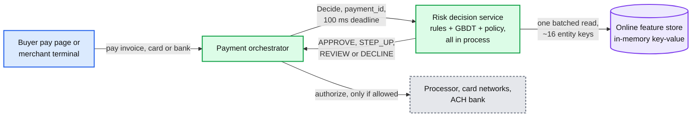

**Walkthrough: a buyer pays a $180 invoice online with a card.**

1. **Input.** The pay page posts a card token from the vault (the PAN never leaves the vault). The orchestrator creates payment `p_1` (idempotent on the client's key, as in [`../payments-ledger/`](../payments-ledger/) §4.1) and calls `Decide(p_1, CNP_ONLINE, 18000 USD minor, ...)` with a 100 ms gRPC deadline.
2. **Request-time features** (~0.5 ms): amount against this merchant's p95 ticket, BIN country against IP country, minutes since the invoice was sent, whether the payer email matches the invoice's customer. That last one is QuickBooks-specific: we have the merchant's books, so "the same customer paying with the same card as their last six invoices" is a strong legitimate signal no generic gateway has.
3. **Feature read** (~6 ms): one batched read of ~16 entity keys: card fingerprint (a keyed hash from the vault, the same for the same card everywhere), card x merchant, payer email, device session, IP, customer, and so on. Each key returns its feature groups: counts over 1 h, 24 h and 30 days, first-seen dates, prior chargebacks, network-wide history.
4. **Rules** (~0.3 ms): blocklists (confirmed-fraud card fingerprints, devices, bank accounts), required steps (an ACH bank account never validated must be validated), contract limits (max ticket). Nothing fires.
5. **Model** (~2.5 ms): a GBDT over ~300 features returns a calibrated `p_fraud = 0.012`.
6. **Policy** (~0.2 ms): thresholds for the segment (tier A merchant, online card, small amount) map 0.012 to `APPROVE`. Thresholds come from cost, not taste (§5.5).
7. **Output.** `APPROVE`, `decision_id d_1`, model `v41`, rules `v812`, ~15 ms. The decision and the feature vector go to the decision log asynchronously. The orchestrator writes the decision to its payment row, then calls the processor.

Data model touched: `ENTITY_FEATURES` (read), `RULE_BUNDLE`, `MODEL_VERSION`, `MERCHANT_RISK_PROFILE` (in process), `DECISION` and `FEATURE_SNAPSHOT` (logged).

**What breaks, compressed.**
- **Naive: fetch features from their owners.** Call the merchant service, the customer service, and `COUNT(*)` payments for this card in 24 h on the payments database. Five to eight calls, a count query of 10 to 50 ms that grows with history, and a sequential p50 of ~60 ms before the model runs. The p99 is several hundred ms. Dead on arrival.
- **Better: precomputed features in a KV (key-value) store, model on a model server.** Features are now one read. But the model server is a second network hop with its own queue: ~3 ms p50 and 15 to 25 ms p99 [estimate], and a second dependency that can time out.
- **Chosen: features precomputed into one online store, one batched parallel read, and the model compiled into the risk service.** A GBDT evaluates in ~2.5 ms on the request thread. Rules come from an immutable bundle in memory. The only remote calls left are the feature read (and, after §5.3, one counter-cluster script).

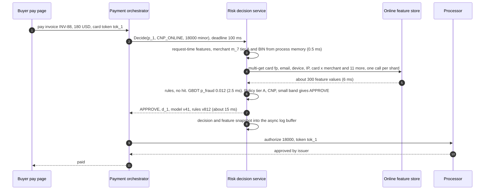

**What is still missing:** the diagram has no answer for "the feature store is slow". A stalled read at 95 ms means the orchestrator's deadline fires and the code does whatever it happens to do. §4.2.

### 4.2 Degrade safely: a bounded, pre-agreed answer

```mermaid
%% Incremental diagram, step 2 of 4: the fallback table and merchant tiers are pushed into every risk pod and every orchestrator pod. Degraded decisions are re-scored later; a bad late score holds the payout.
flowchart LR
    BUY[Buyer pay page or<br/>merchant terminal] -->|"pay"| ORC[Payment orchestrator<br/>own copy of fallback table]
    ORC -->|"Decide, 100 ms deadline"| RDS[Risk decision service<br/>stage deadlines,<br/>hard stop 80 ms]
    RDS -->|"batched read"| OFS[(Online feature store)]
    CP[Risk control plane<br/>fallback table, tiers,<br/>rules, models]
    CP -->|"versioned push, in process"| RDS
    CP -->|"same table version"| ORC
    RDS -->|"decision, source FULL<br/>or FALLBACK"| ORC
    ORC -->|"authorize"| PROC[Processor, networks,<br/>ACH bank]
    RDS -->|"decision events"| K[[Kafka<br/>risk-decisions]]
    K -->|"FALLBACK and PARTIAL"| RS[Async re-scorer]
    RS -->|"late score bad: hold"| PAY[Payouts + ledger]

    class BUY client
    class ORC,RDS,CP,RS service
    class OFS store
    class K queue
    class PROC,PAY external

    classDef client   fill:#dbeafe,stroke:#2563eb,stroke-width:2px,color:#111
    classDef service  fill:#dcfce7,stroke:#16a34a,stroke-width:2px,color:#111
    classDef store    fill:#ede9fe,stroke:#7c3aed,stroke-width:2px,color:#111
    classDef queue    fill:#cffafe,stroke:#0891b2,stroke-width:2px,color:#111
    classDef external fill:#e5e7eb,stroke:#6b7280,stroke-width:2px,color:#111,stroke-dasharray:4 3
```

**Walkthrough: the feature store stalls while a $600 online card payment arrives at a tier A merchant.**

1. **Input.** `Decide(p_2, CNP_ONLINE, 60000 minor, m_7)`. The deadline manager stamps stage deadlines: features by 30 ms, model by 45 ms, store by 60 ms, hard stop at 80 ms.
2. **Feature read.** One shard does not answer; its hedge (§5.1) does not answer either. At 30 ms the stage deadline fires.
3. **Partial, rules, then the table.** A validated lookup `(segment, missing shards) -> PARTIAL or FALLBACK` (§5.1) says this pattern is not safe to score: the missing shard held the card and device history. So the service first runs **rules on what arrived**: request fields, in-process blocklists and required steps, and the synchronous velocity counters from the counter cluster (§5.3), which is still up. No rule fires. Then the **fallback table** (in process, version 17): tier A, online card, $250 to $2,500 band: `APPROVE` under the degraded budget.
4. **Budget (first cut).** The obvious design: a dollar counter per merchant per hour in the counter cluster, flat by tier: A $5k, B $2k, C $500, D $0. `m_7` has $4,400 left this hour, so the $600 fits. Had it been spent, the cell's "budget exhausted" action would apply: `STEP_UP` (3DS; a keyed card, with no buyer present, gets `REVIEW`). If the counter cluster is down too, each pod spends a local slice of `budget / pods`. §5.2 breaks this budget with a card-testing script and replaces it.
5. **Output.** `APPROVE`, `source: FALLBACK`, at ~31 ms. The decision event goes to Kafka with its source.
6. **Later.** The re-scorer consumes every `FALLBACK` and `PARTIAL` decision, waits until the feature store is healthy, and re-scores with full features plus what we learned since (the issuer's AVS and CVV results, the 3DS outcome). The result is a new `RESCORE` decision linked to `d_2`, and `rescored_at` is written to the payment row. A late score above the review threshold holds that payment's payout and opens a case; above the decline threshold, an uncaptured authorization is voided instead.

The **fallback table** (an excerpt; the full table is in [`deep-dives/timeouts-and-fallback-policy.md`](deep-dives/timeouts-and-fallback-policy.md)). Bands: small under $250, medium $250 to $2,500, large over $2,500 [estimate], and an amount above the merchant's own p99 ticket moves up one band.

| Tier | Method | Small | Medium | Large |
|---|---|---|---|---|
| A, over 12 months, clean | Card present | APPROVE | APPROVE | REVIEW (hold payout) |
| A | Online card | APPROVE | APPROVE | STEP_UP (3DS) |
| A | ACH | APPROVE, debit in next file | APPROVE | REVIEW (debit after re-score) |
| B, 3 to 12 months | Online card | APPROVE | STEP_UP | STEP_UP, else soft DECLINE |
| C, new or on watch | Online card | STEP_UP | STEP_UP, else soft DECLINE | soft DECLINE |
| C | ACH | REVIEW (debit after re-score) | REVIEW | REVIEW, verified account only |
| D, under investigation | Any | soft DECLINE (card present small: REVIEW) | soft DECLINE | soft DECLINE |

Rules on what arrived run before every cell. The first-cut budget is per merchant per hour in dollars: A $5k, B $2k, C $500, D $0. When it is spent, `APPROVE` cells become `STEP_UP` where a buyer is present and `REVIEW` or soft `DECLINE` where not. A soft decline is a retriable code ("try again shortly"), not a fraud decline. The final table and its budgets are in [`deep-dives/timeouts-and-fallback-policy.md`](deep-dives/timeouts-and-fallback-policy.md).

Data model touched: `FALLBACK_TABLE`, `MERCHANT_RISK_PROFILE` (tier, budget), `DECISION.source`, `PAYOUT_HOLD`.

**What breaks, compressed.**
- **Naive: no deadline of our own.** The orchestrator's 100 ms fires and its code path decides by accident: an exception declines (fail closed by accident) or a default approves (fail open by accident). Nobody chose either.
- **Naive: one global switch.** Fail closed during a 10-minute outage at peak declines `350/s x 600 s = 210k` payments, ~$42 M of mostly good sales. Fail open approves the same $42 M with no model, and if the outage overlaps an attack, the attacker's throughput is unbounded.
- **Better: rules-only fallback.** Run the rules on what arrived. Necessary, and it stays as the first rung: the synchronous counters live in their own cluster, so velocity rules still fire when only the feature store is down. But rules only say what is clearly bad; they cannot rank the rest, so on their own they approve everything else.
- **Chosen: rules on what arrived, then a precomputed table by tier x band x method, in process on both sides of the call, under a per-merchant dollar budget, with every fallback re-scored later.** The orchestrator holds the same table version, so even "risk is unreachable" has the same answer with zero network calls.

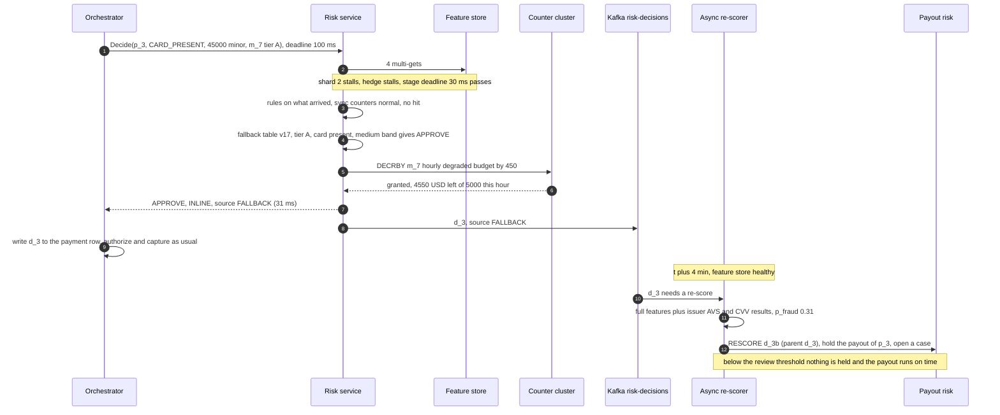

**What is still missing:** the model and its features are frozen. Nothing feeds counters, nothing collects labels, and a new attack pattern needs a code deploy. §4.3.

### 4.3 Learn: features, labels, retraining, safe rollout

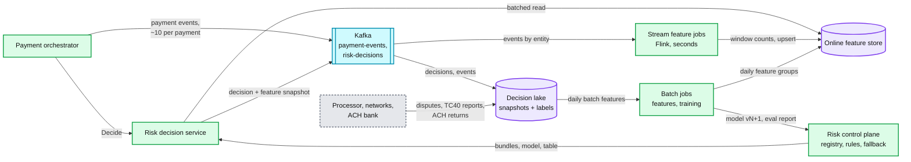

**Walkthrough: from one payment to the next model.**

1. **Events.** For `p_1`, the orchestrator emits `DECIDED`, `AUTH_RESULT` (issuer response, AVS, CVV), `CAPTURE`, `SETTLED` into `payment-events`, partitioned by `payment_id`.
2. **Streaming features.** Flink re-keys each event by every entity it touches (card fingerprint, merchant, device, IP, email, bank account), drops duplicates by `event_id`, and maintains sliding windows (1 min, 10 min, 1 h, 24 h). Results are upserted into the online store with an event-time version, typically seconds after the payment [estimate]. See [`../../concepts/stream-processing.md`](../../concepts/stream-processing.md).
3. **Batch features.** A daily job over the lake computes slow features: merchant history and dispute ratio, 13-month card history across all QuickBooks merchants, graph features (how many hops from a merchant or card to a known-bad entity through shared devices, bank accounts and owners), BIN and IP reputation tables.
4. **Decision log.** Every decision goes to `risk-decisions` with the exact feature vector the model saw (~1.2 KB) and lands in the lake within minutes. The producer buffer is in memory, so a pod crash can lose a few snapshots: a daily job reconciles the orchestrator's `DECIDED` events against `risk-decisions` and counts the gaps (those rows are excluded from training, never guessed).
5. **Labels.** On day 47 the cardholder disputes `p_1` as fraud. The processor's dispute file is ingested, deduplicated on the dispute id, and written as `LABEL(FRAUD_CHARGEBACK)` keyed by `payment_id`. Other sources: TC40 fraud reports (usually sooner than disputes [estimate]), unauthorized ACH returns (R10, R11, up to 60 days), analyst outcomes (minutes to days), merchant losses.
6. **Training.** A weekly job takes decisions 3 to 15 months old (labels mostly mature), joins labels by `payment_id`, and **trains on the logged snapshots, not on recomputed features**. It calibrates, evaluates out of time per segment, and registers `v42` as a challenger.
7. **Rollout.** Every risk pod loads `v42` and scores it in shadow next to the champion `v41`, after the response is sent; the shadow score is logged, never acted on. Canary and promotion are §5.5. Rules follow the same draft, backtest, shadow, enforce path (§5.6).

Data model touched: `ENTITY_FEATURES` (written), `FEATURE_SNAPSHOT`, `LABEL`, `MODEL_VERSION`, `RULE`, `RULE_BUNDLE`.

**What breaks, compressed.**
- **Naive: nightly batch features, train on features recomputed in the warehouse.** Features are up to 24 h stale, so a card used at 30 merchants this morning looks clean. And training sees features computed after the fact, with late events included, so offline accuracy is higher than anything production can deliver (training-serving skew).
- **Better: streaming features plus point-in-time joins** (the Feast or Tecton pattern: reconstruct each feature "as of" the decision time from history). Freshness is fixed. Skew is smaller but not gone: the online value at decision time depended on stream lag, a late event or a failed upsert, and the as-of reconstruction cannot know which.
- **Chosen: log the feature vector with every decision and train on that.** No skew by construction, and replay is free. Recompute history only to backfill a brand-new feature, then compare the backfilled values against the logged values of existing features as a skew test.

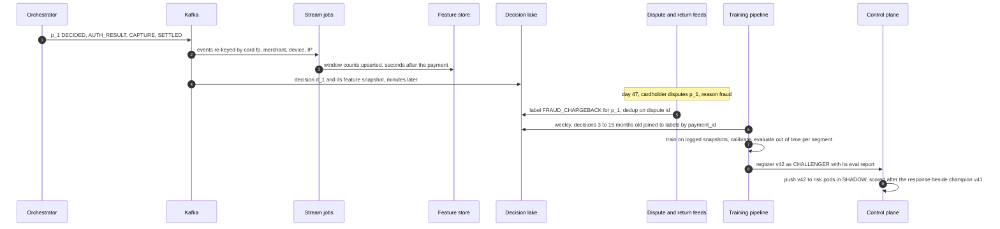

**What is still missing:** everything so far judges one payment. A merchant who is the fraud makes every single payment look fine, gets paid out tomorrow, and is gone before the first chargeback. §4.4.

### 4.4 Act after the payment: re-score, review, hold the money

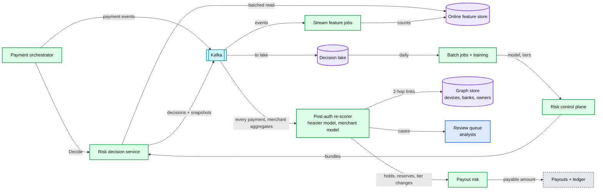

**Walkthrough: a merchant bust-out.**

1. **Setup.** Merchant `m_44` onboarded 45 days ago, invoices ~$3k a week at ~$150 a ticket, changed its payout bank account 5 days ago.
2. **Spike.** Today it runs 38 keyed card payments in 3 hours, $91k at ~$2.4k each, and asks for an instant deposit. Each payment, on its own, passes inline: the cards are real (bought, or collusive buyers), no single card has velocity, and even tier C thresholds (new merchant, recent bank change) let most through. The few in the step-up band cannot do 3DS on keyed entry, so they become `REVIEW` with a deferred capture.
3. **Post-auth re-score** (seconds to minutes after each payment): the re-scorer keeps merchant-level aggregates (volume against its own history, ticket shift, keyed share, refund rate) and runs a merchant model that predicts loss in the next 60 days. It queries the graph store: `m_44`'s new bank account is two hops from `m_12`, closed for bust-out last quarter (shared device).
4. **Action.** Merchant loss score 0.7: payout risk places a merchant-wide hold, downgrades `m_44` to tier D (pushed to every pod within ~30 s, so its next payment is a soft decline), and opens a priority-1 case with $91k of exposure.
5. **Payout.** At the 5 PM payout run, and at the instant deposit request, the payout service asks `payable(m_44)`: payable $0, held $91k.
6. **Resolution.** An analyst confirms. Uncaptured authorizations are voided, captured ones refunded to the buyers, the hold stays until the dispute window closes, and the case outcome becomes a label for the merchant model.

Data model touched: `PAYOUT_HOLD`, `REVIEW_CASE`, `MERCHANT_RISK_PROFILE` (tier, payout delay, reserve), `LABEL` (merchant loss).

**What breaks, compressed.**
- **Naive: inline only.** The payments look fine one at a time. `m_44` is paid $91k tomorrow; disputes and returns arrive over 30 to 60 days into an empty account, and Intuit owes the networks.
- **Better: post-auth re-score plus manual review.** Catches the pattern, but if payouts are next-day for everyone, a 3-hour spike can still be paid before an analyst looks, and ACH returns land weeks after any review.
- **Chosen: the re-scorer drives money controls.** Payable = settled minus holds minus reserve. Payout delay by tier, rolling reserves sized from expected disputes and returns, deferred capture for `REVIEW` card payments, and a cooling period after a payout bank change. Two QuickBooks-specific checks close the common cash-outs: a payer device that equals the merchant's own logged-in session device (a merchant keying stolen cards into its own invoice) is `REVIEW` with deferred capture inline, and refunds go only to the original payment method, never above the captured amount. The risk decision becomes a question of **when money may leave**, not only whether a payment may happen.

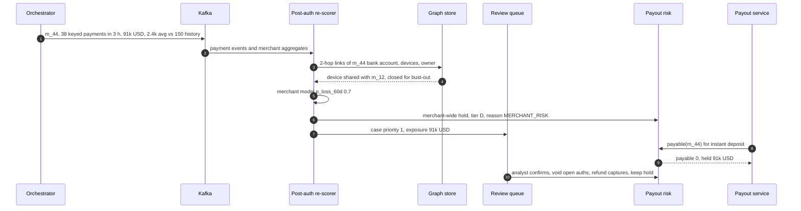

**What is still missing:** this is the simple version. §5 asks what breaks it: a 4-way fan-out with a fat tail (§5.1), a fallback nobody owns (§5.2), streaming counters 30 s behind a card-testing script (§5.3), retries that double count (§5.4), models judged on labels that do not exist yet (§5.5), a rule pushed at 2 AM (§5.6), ACH money that can come back in 60 days (§5.7), an attack that floods one merchant (§5.8), and the PCI and explainability questions (§5.9).

---

## 5. Deep dives

One per non-functional requirement, phrased as the interviewer asks it. Each names what breaks in the §4 design with a number, fixes it, and lists what changed.

### 5.1 "Walk the 100 ms. Which call is the long tail?" (latency)

**What breaks.** The model is not the problem: ~2.5 ms in process. The problem is the parallel read. A decision waits for the **slowest** of its N feature calls, so its p99 is not the store's p99:

```
P(decision waits on at least one call slower than the per-call p99) = 1 - 0.99^N
N = 4  -> 3.9%      N = 9 -> 8.6%      N = 20 -> 18%
decision p99 = per-call quantile 0.99^(1/N):  N = 9 -> per-call p99.89,  N = 4 -> per-call p99.75
```

Take a per-call latency for one multi-get to one in-memory shard of p50 2 ms, p95 5 ms, p99 9 ms, p99.9 30 ms, p99.99 60 ms [estimate: GC pauses, a noisy neighbour, a replica resync]:

| Layout | Remote calls per decision | Decision p50 | Decision p99 | Decision p99.9 |
|---|---|---|---|---|
| 12 shards, one call per shard touched (16 keys hit ~9 of 12) | ~9 | ~4.5 ms | **~28 ms** | **~58 ms** |
| 4 shards, keys grouped into one multi-get per shard | 4 | ~3 ms | ~18 ms | ~45 ms |
| 4 shards, plus a hedge after 6 ms to the replica in another AZ | 4, plus ~3% hedges | ~3 ms | ~10 ms | ~15 ms |

These columns are the 4 multi-gets alone; the whole parallel stage is ~6 ms p50 and ~15 ms p99 after hedging. What matters is the 30 ms stage deadline, which fires long before the 80 ms stop. The reviewer's simulation ([`deep-dives/latency-budget-and-hot-path.md`](deep-dives/latency-budget-and-hot-path.md)) measures the miss rate: 0.88% of decisions on 12 shards (~26k fallbacks a day for no reason except a fat tail), 0.39% on 4 shards unhedged (~11.6k a day, which already breaks the 99.9% full-decision SLO in §8), ~0 with hedging. **Hedging is load-bearing, not polish.** That is why the **online feature store is the red node**: it is the only remote dependency we fan out to, so its tail, not its median, sets ours. The counter cluster (§5.3) is one call and comes second.

The table assumes shards are slow independently, which is the optimistic case. A gray AZ (slow, not dead, often with packet loss) slows every AZ-local replica at once: with 1% of the time in that state and hedging capped at 5%, the decision p99 is 34.6 ms in the simulation and half the decisions inside an episode fall back.

**The fix** ([`deep-dives/latency-budget-and-hot-path.md`](deep-dives/latency-budget-and-hot-path.md), [`../../concepts/fan-out-fan-in.md`](../../concepts/fan-out-fan-in.md)):
- **Cut N.** Shard for memory, not throughput: 120 GB needs 4 shards of 30 GB, and 8k calls/s at design is a small load for 4 in-memory nodes. Group each decision's keys by shard into one multi-get per shard. Keep all feature groups of an entity in one row. Keep the small, hot tables (merchant profile, BIN table, email-domain and routing-number reputation) in process, which removes 4 keys and the hottest one (a big merchant's row).
- **Hedge the tail.** If a shard has not answered in 6 ms (~its p97), send the same read to that shard's replica in another AZ and take the first answer. It costs ~3% more reads (~250 a second at design). Cap hedges at 5% of calls so a sick store is not hit twice as hard.
- **Eject a slow AZ, by latency.** Each pod keeps a moving share of calls slower than 6 ms per AZ; above 30%, it reads from another AZ for 5 s, then probes again (+0.5 ms per read while ejected). Health checks never see a gray failure; latency does. The orchestrator likewise routes `Decide` away from a risk AZ whose p99 is out of line, and a hedge rate pinned at its cap for 1 minute pages. Simulated: p99 back to 17.8 ms, fallbacks 0.012%.
- **Deadlines per stage, not one big timeout.** Features by 30 ms, model by 45 ms, store by 60 ms, hard stop at 80 ms. Each remote call carries the remaining budget as its gRPC deadline, and nothing starts that cannot finish.
- **Score with what arrived, only where it was proven safe.** A missing shard drops every entity hashed to it, so the question is per pattern. An offline masked evaluation on a mature out-of-time month scores each `(segment, missing shards)` pattern against the fallback cell's expected cost; the result ships in the rule bundle as a lookup `-> PARTIAL or FALLBACK`, and 1% of traffic is masked in shadow online to keep checking it. `NOT_FOUND` (a card never seen: count 0, a real fraud signal) and `UNAVAILABLE` (the read failed) are different values in the snapshot, and dropout training uses `UNAVAILABLE`; otherwise a shard outage looks to the model like a wave of new cards.
- **Keep the model in process.** A remote model server adds a second fan-out leg with ~15 to 25 ms of p99 [estimate] for nothing a 30 MB GBDT needs.

**Push back on the textbook answer.** "Use a managed feature store, it serves in 5 ms." A median says nothing about the max of four. Ask for the per-call p99.9 and do the `0.99^(1/N)` arithmetic. Equally: "shard wider for scale" makes it worse. Twelve shards turn 4 calls into 9 and move the decision p99 from the store's p99.75 to its p99.89.

**What changed:** stage deadlines and the 80 ms wall; 4 shards x 3 AZ replicas with hedged multi-gets and latency-based AZ ejection; in-process merchant, BIN and reputation tables; the validated `PARTIAL` lookup and `UNAVAILABLE` values; `timings_ms` in the response.

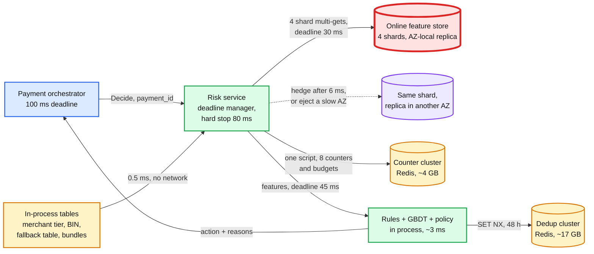

### 5.2 "A dependency misses its stage deadline and you hit the 80 ms hard stop. Approve or decline? Who decided, and how much can it lose?" (availability)

**What breaks in §4.2.** The table exists, but nobody owns it, so nobody can answer "how much can it lose". The §4.2 first-cut budget, flat dollars per tier ($5k an hour for tier A), does not bound card testing at all: tests are $1 to $3, so $5k validates ~2,800 stolen cards per merchant per hour, and it is 17x the volume of a $300-an-hour merchant while being 12% of a $40k-an-hour one. Per-pod slices drift as pods autoscale on the attack's own CPU. And if the outage overlaps an attack, a fail-open cell is exactly what the attacker wants.

**The fix** ([`deep-dives/timeouts-and-fallback-policy.md`](deep-dives/timeouts-and-fallback-policy.md), which simulates every row below):
- **Risk policy owns the table, engineering owns the mechanism.** The head of risk signs it with payments product and finance, like a credit policy. It is versioned config, needs two approvers, and every cell carries its expected loss per hour at peak. Reviewed quarterly against actual degraded-mode losses; a monthly game day forces the fallback in one region.
- **A ladder, not a switch.** `FULL`, then `PARTIAL` where the validated lookup allows it (§5.1), then **rules on what arrived** (request fields, in-process blocklists and required steps, and the synchronous counters, which live in their own cluster), then the table. Velocity rules still fire when only the feature store is down.
- **Card-not-present under $5 always steps up** in every fallback rung. That is the band card testing lives in, and it costs honest buyers almost nothing.
- **Budgets in attempts and dollars, sized to the merchant.** Two token buckets per merchant in the counter cluster, refilled every second: dollars `clamp(1.5 x p95 hourly volume, $200, $50k)`, attempts `max(20, 2 x p95 hourly count)` [estimate]; tier sets the multiplier. If the counter cluster is down too, each pod spends a local slice sized by the maximum pod count (floor ~3 tickets; a restarted pod gets half until it reaches Redis) and keeps a **local attack counter**: a merchant above `max(3, 3x its expected per-pod rate)` in 60 s goes into local attack mode. Worst case is ~3x the budget (orchestrator slices, autoscaling, restarts), and the fallback never waits on the network to find out.
- **The loss math, for a 10-minute total outage at peak** (`350/s x 600 s = 210k` payments, ~$42 M, mix and fraud rate [estimate]):

| Slice | Payments | Dollars | Fallback answer | Exposure |
|---|---|---|---|---|
| Card present, 20% | 42k | $8.4 M | APPROVE (large: REVIEW) | Low fraud, and outside VAMP's card-not-present count |
| Online and keyed card: tier A small and medium, tier B small, ~60% of card-not-present | 69k | $14 M | APPROVE under budget | ~10 bps [estimate] = ~$14k expected |
| Rest of card-not-present | 46k | $9 M | STEP_UP, REVIEW with deferred capture, soft DECLINE | Conversion loss, not fraud loss |
| ACH, 25% | 52k | $10.5 M | APPROVE or REVIEW, re-scored before the next file cut-off | ~$0 if the re-score lands before the file goes out |

  So fail open on ~$22 M costs ~$15k to $25k expected at the base fraud rate. Fail closed on everything costs 210k declined payments, $42 M of mostly good sales and a support queue. During an attack the exposure is set by the attempt budget and the under-$5 rule, not the dollars: the reviewer's simulation validates zero cards with them and ~2,400 to 2,900 per merchant per hour with a flat dollar budget.
- **Attack mode and a global brake.** A merchant under attack (§5.3) has every card-not-present cell forced to `STEP_UP` or `DECLINE`. A platform brake flips all card-not-present `APPROVE` cells to `STEP_UP` if degraded approvals pass ~$10 M in 10 minutes [estimate].
- **Every fallback is re-scored before money moves.** Re-score within 15 minutes of recovery and before the next payout cut-off. The payout service excludes payments whose `risk_source` is `FALLBACK` or `ORCH_FALLBACK` and whose `rescored_at` is empty, reading both from the orchestrator's payment row, not from a Kafka-fed view (with Kafka down, a view would simply not know). Uncaptured authorizations that score badly are voided, captured ones are held.
- **The orchestrator never retries risk inside the request.** No answer by 100 ms means `ORCH_FALLBACK` from its own copy of the table.

**Push back on the textbook answer.** "It is money, so fail closed." Declining 210k payments to avoid ~$20k of expected fraud is a bad trade, and it is the merchant's revenue, not ours, that we would be declining. The opposite answer, "fraud is rare, fail open", is wrong too: an outage is when an attacker who is already probing gets through, so fail open must be bounded in attempts, closed under $5, and switched off for anyone under attack.

**What changed:** table ownership and per-cell loss numbers; the ladder with rules on what arrived; the under-$5 step-up; attempt and dollar buckets sized per merchant, with local slices and a local attack counter behind them; attack mode and the global brake; the payout exclusion read from the payment row; `source` on every decision.

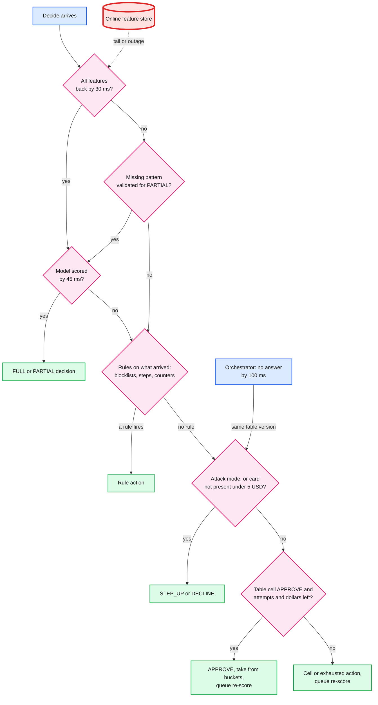

### 5.3 "500 card-testing attempts in 60 s, and your stream counters lag 30 s" (feature freshness)

**What breaks.** Card testing: a script checks stolen cards with small payments, often through a merchant's public invoice or payment link (Stripe: small payments, "nonsensical customer names", spikes in declines). 500 attempts in 60 s is 8.3/s on one merchant. Streaming counters behind 30 s (a checkpoint, a rebalance, a backlog after a deploy) mean the first ~250 attempts are scored as if nothing is happening. Every approved attempt validates a card for the attacker, and Visa counts enumeration against the merchant (≥300,000 enumerated attempts and ≥20% of authorizations is "Excessive").

**The fix: a synchronous counter path for the few counters an attack needs** ([`deep-dives/features-and-freshness.md`](deep-dives/features-and-freshness.md)).
- **A counter cluster.** A small Redis per region (one primary, 2 replicas, ~4 GB at design) holding only the attack counters, attack flags and degraded budgets, with `noeviction`. The 48 h dedup lives in a separate cluster, so a growing cache can never make a counter write fail. One Lua script per decision, in the parallel stage: add this payment to 8 sorted sets (`ZADD NX` for payment-id sets, `ZADD GT` for the two distinct-card sets), trim them to their windows, `ZCOUNT` them. ~1 ms p50, 4 ms p99. Merchants are homed in one region, so merchant-keyed counters are exact; card, IP and device counters are per region (a card tried in both regions shows half in each), which the stream covers within seconds.
- **The 8 counters:** attempts per card, per IP, per device, per bank account, per payer email (member = `payment_id`); distinct cards per merchant and per IP (member = card fingerprint); attempts per merchant. Windows 60 s, 10 min, 1 h.
- **The rule:** distinct cards on one merchant in 60 s above `max(10, 5 x that merchant's p99)` declines and sets **attack mode** on the merchant for 1 hour: every card-not-present payment needs 3DS, and the pay-page edge adds a CAPTCHA, a human-or-bot challenge (Stripe's card-testing guidance recommends CAPTCHA and rate limits for exactly this).
- **Issuer declines and ratios.** A small consumer of `AUTH_RESULT` events increments "issuer declines per merchant in 5 min" in the counter cluster within ~1 s; a burst of issuer declines is the clearest card-testing tell there is. For big merchants a count threshold is dull (a p99 of 40 distinct cards a minute sets the bar at 200), so the rule also reads ratios that do not scale with size: share of never-seen cards in the last minute, share of attempts under $5, and the issuer-decline share.
- **Everything else stays in the stream:** dozens of windows per entity, cross-merchant distinct counts, ratios, graph features. Seconds of lag are fine for them.
- **Point-in-time correctness** covers both paths: the snapshot logs the counter values the model saw. Result: the attack is cut at attempt ~11, so ~10 attempts get through instead of ~250.

**Push back on the textbook answer.** "Make Flink faster: 1 s checkpoints, smaller windows." That lowers typical lag, not the p99: a rebalance or a restart still stalls the stream for tens of seconds, exactly when an attacker is active. The attack defense needs a guarantee that the attempt before this one is counted, which only a read-your-writes path gives. And it needs it for 8 counters, not 300 features.

**What changed:** the counter cluster and its script; attack mode in `MERCHANT_RISK_PROFILE`; the issuer-decline consumer and ratio signals; the CAPTCHA hook at the pay-page edge.

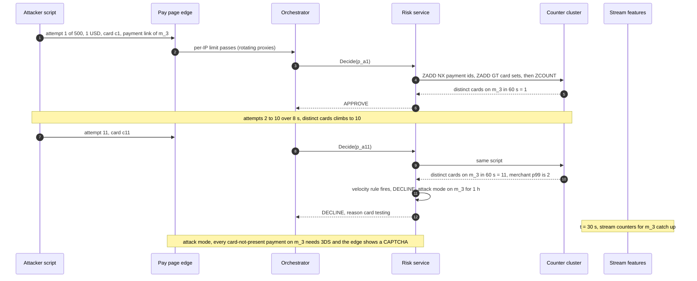

### 5.4 "The client retries after a timeout. Does your velocity rule count it twice?" (correctness)

**What breaks.** Three ways in the §4 design:
1. An orchestrator pod calls `Decide(p_9)`, risk approves, and the pod dies. Another pod resumes `p_9` and calls again. The stream now includes `p_9`'s first attempt, a new champion may have shipped, and the counters see `p_9` twice: the "same" payment can come back declined by our own velocity rule.
2. Two `Decide(p_9)` calls race (a duplicated message, an orchestrator hedge).
3. The buyer gets a timeout and clicks "Pay" again: a new attempt, `p_10`, on the same card. Is that two attempts?

**The fix:**
- **The orchestrator owns the inline decision.** It writes `decision_id`, action and `risk_source` to its payment row before it calls the processor. A resumed payment reads the row and never calls `Decide` again; that row is what the buyer was told and what payouts read.
- **Risk keeps a 48 h dedup for the gaps.** If the pod died between our answer and its row write, nobody has been told anything yet. The resume calls `Decide`; risk's `SET NX dec:{payment_id}` (its own Redis cluster, ~17 GB at design) returns the first answer, and a concurrent duplicate gets the winner's answer. Losing that cache costs only a recompute for a payment nobody has seen. `Decide` carries `attempt_created_at`; an attempt older than 48 h gets `STALE_ATTEMPT`, never a fresh decision.
- **Counters are sets, not integers.** `ZADD NX` with `member = payment_id` makes a recount a no-op. Distinct-card sets use the card fingerprint with `ZADD GT`, so a same-card retry never raises "distinct cards" and a card used again stays inside the window (with `NX` it would age out at its first use: 2 counted when the truth is 3). Stream jobs drop duplicates by `event_id` and aggregate over payment-id sets. See [`../../concepts/exactly-once.md`](../../concepts/exactly-once.md).
- **Attempts are removed only for processor timeouts.** When the outcome consumer sees that a payment never reached an issuer because the processor timed out, it `ZREM`s that attempt, so `p_10` after a timed-out `p_9` counts once. Our own soft declines stay counted: removing them would erase an attacker's attempts exactly when we are degraded.
- **The answer that was sent wins.** If the orchestrator answered from `ORCH_FALLBACK` while a slow risk call later stored `FULL` for the same id, the payment row wins: the risk decision is marked superseded and its score feeds the re-scorer as a `RESCORE`.
- **Replay.** `replay(decision_id)` loads the model version and rule bundle (both kept 7 years) and feeds the logged snapshot; a different score pages the risk platform team.

**Push back on the textbook answer.** "Store decisions in a strongly consistent database inside risk." The orchestrator already writes the payment row in a strongly consistent store before the processor call. A second consistent store on the risk side would add 3 to 10 ms of p99 to cover a gap the row already covers; risk's dedup can be a lossy cache.

**What changed:** the decision of record on the payment row; the 48 h dedup cluster and `STALE_ATTEMPT`; set-based counters; `ZREM` on processor timeouts only; the superseded flag; replay. The resume sequence is [`diagrams.md` D5b](diagrams.md#d5b-a-resumed-payment-gets-the-stored-decision); counter mechanics are in [`deep-dives/features-and-freshness.md`](deep-dives/features-and-freshness.md).

### 5.5 "Labels arrive 60 to 90 days later. How do you train, and how do you know a new model is better before it declines real customers?" (loss budget: the model)

**What breaks.** "Not disputed yet" is not "legitimate", so last month's data is full of false negatives. A model cannot be judged on outcomes that do not exist yet. Declined payments never produce a label at all, so the model only learns about what it let through. And thresholds set by feel trade fraud for false declines blindly. See [`deep-dives/model-lifecycle-shadow-and-labels.md`](deep-dives/model-lifecycle-shadow-and-labels.md).

**The fix.**

| Label source | Typical arrival | What it covers |
|---|---|---|
| Analyst review outcome | Minutes to days | Only reviewed payments, but the fastest |
| TC40 issuer fraud report | Days to weeks [estimate] | Card fraud; counted by VAMP even without a dispute |
| Fraud chargeback | Weeks; most within 60 to 90 days | Card fraud the cardholder disputes |
| Unauthorized ACH return (R10, R11) | Up to 60 days (Nacha) | Consumer debits the account holder did not authorize |
| ACH NSF (non-sufficient funds, R01) and admin returns | ~2 banking days [estimate] | Credit and data risk, a separate label from fraud |
| Merchant loss | 1 to 4 months | Unrecovered negative balances |

- **Train on mature windows.** The main model trains on decisions 3 to 15 months old, on the logged snapshots. The last 90 days are used for the fast labels only (TC40, review outcomes, early returns), never as "legitimate" negatives.
- **Fix the blind spot, and know what each slice estimates.** A step-up is not an approval with a label attached: fraudsters walk away at the challenge, and liability shift makes chargebacks collapse. So two slices, both with the propensity logged and weighted by it: about 1% [estimate] of decline-band payments under $50 get `STEP_UP`, which estimates `P(fraud | step-up)` and good-buyer abandonment, labelled with TC40 plus the 3DS outcome, never chargebacks alone; and ~0.1% of model declines [estimate] (no rule hits, tiers A and B, under $50, a monthly dollar cap set by risk policy) are approved, the only way to estimate `P(fraud | approve)` in the decline band. No exploration for a merchant in attack mode. Stripe does a version of this: "For a small subset of payments, Stripe modifies the reported risk score so we can measure the performance of our models" ([risk evaluation docs](https://docs.stripe.com/radar/risk-evaluation)).
- **Thresholds from cost, per segment and per amount.** Decline when `p x L > (1 - p) x C_fd`, so `p* = C_fd / (C_fd + L)`. Both sides scale with the amount `a`: `L(a) = a + ~$15 dispute fee`, `C_fd(a) = our fee (~3%) x a + a weight on the merchant's lost margin (~10%) x a + a churn constant (~$8)` [estimate]. That gives `p*` of 0.23, 0.14 and 0.12 at $20, $200 and $2,000; a flat $70 would give 0.67 at $20 (never decline where card testing lives) and 0.03 at $2,000 (decline good big buyers). **Sensitivity is the honest answer:** halving or doubling `C_fd` moves the $200 threshold from 0.14 to 0.07 or 0.24, so we measure it: a declined buyer who pays the same invoice another way within 10 minutes is a cheap false decline, one who never pays is the expensive one. Whose cost (Intuit's fee, the merchant's sale, network penalties) is a weighting risk policy signs. A step-up band sits below `p*`, where 3DS typically moves fraud-dispute liability to the issuer (Stripe: "typically", not guaranteed). Calibrate monthly on the latest mature month (isotonic regression) so `p` means a probability.
- **Prove it before it declines anyone.** Offline: out-of-time test per segment, recall at the champion's decline rate, dollars caught. Shadow, 7 to 14 days on all traffic, scored after the response is sent: p99 under 6 ms, score distribution per segment, would-be decline rate within ±10% of the champion's at matched thresholds, and the **disagreement set** (challenger declines, champion approved) sampled to analysts daily, which yields labels in days. Canary at 5%, 25%, 100% by payment-id hash, with decline, step-up, review and issuer-approval guardrails per segment. Rollback is a registry pointer flip, under 1 minute.
- **Leading indicators, because outcomes lag.** Per-feature null rate (hourly), PSI (population stability index) of the top 30 features (daily, alert above 0.2), score distribution and decline rate per segment (page at 2x the 7-day baseline), a weekly online and offline skew test, TC40 rate per segment.

**Push back on the textbook answer.** "Retrain daily to keep up with fraudsters." With 60 to 90 day labels, a daily retrain re-fits the same mature labels and adds a release every day. Speed belongs to rules (minutes, §5.6) and to the fast labels; the model moves weekly to monthly.

**What changed:** the label table and its six sources; the step-up and approve exploration slices with propensities; amount-dependent costs; per-segment thresholds in `MODEL_VERSION`; the shadow, disagreement-set and canary gates; drift monitors.

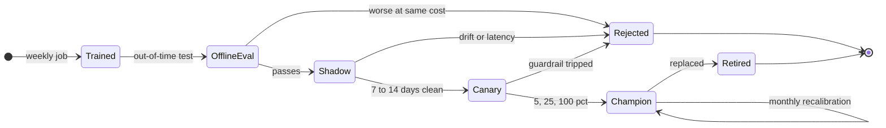

### 5.6 "An analyst wants to push a rule at 2 AM during an attack" (loss budget: rules)

**Rules and ML do different jobs.** Rules hold hard policy (blocklists, regulatory steps such as "validate a bank account before its first WEB debit", contract limits) and the fast response to a new attack. The model ranks risk across hundreds of weak signals, which rules cannot do. Uber's Mastermind is the reference: analysts write rules in a Python-based language, "running 300 complex rules takes only 30 milliseconds", 200 new rules shipped in the three months after a self-serve front end (versus 300 in the 18 months before), and rules call a machine-learning service for scores. Precedence, highest first: hard blocks, attack rules and attack mode, required steps, allowlists, model policy, post-model overrides. Within one level, the most severe action wins. Allowlists sit below attacks on purpose: an allowlist may skip a step-up for a known customer, never override a block or an attack response, or an account takeover of a long-standing customer walks straight past the defenses. Details and the rule language: [`deep-dives/rules-engine-and-attack-response.md`](deep-dives/rules-engine-and-attack-response.md); the rules-as-data, bundle and shadow machinery is the same as [`../expense-rules-engine/`](../expense-rules-engine/) §4.1 and §5.4.

**What breaks.** A rule written in a hurry at 2 AM is the biggest blast radius in the system: `amount < 5 and card_not_present -> DECLINE` with a typo in the scope declines every small online payment on the platform in ~30 s.

**The fix: fast, but every step is a gate.**
1. **02:00.** The attack panel shows distinct cards spiking on 40 merchants, all one BIN range, all under $5.
2. **02:06. Draft** in the console: typed CEL, scope `bin in [...] and method in [CNP_ONLINE]`, action `STEP_UP`, expiry 24 h.
3. **02:08. Automatic backtest** on the lake (minutes): 1,240 hits in the last hour, 12 a day historically, ~$40 a day of legitimate volume affected.
4. **Guardrail.** Scoped rules that only step up, with estimated legitimate impact under ~0.05% of the segment [estimate], need one analyst. A global `DECLINE`, an allowlist entry or a bigger impact needs a second approver from the on-call rota.
5. **02:09. Shadow for 10 minutes** on live traffic: the hit rate must match the attack, not the base rate.
6. **02:19. Enforce,** with the 24 h expiry. A kill switch any analyst can pull reaches every pod in under 30 s, through a small signed kill list that pods poll every 10 s, so it still lands when the control plane is what broke.
7. **First 24 h: per-rule auto-kill.** Every 60 s the fleet reports the new rule's live hit share of its segment. Above 3x its shadow hit share (or 1% of the segment for a `DECLINE`) [estimate], it goes back to shadow and pages. The backtest replays the night; the auto-kill protects the 9 AM mix the backtest never saw. A bad paste that declines everything under $50 (~31% of traffic) costs ~990 false declines at 2 AM this way, against ~13k at 2 AM and ~131k at peak if it waits for the segment decline-rate page plus a human ([`deep-dives/rules-engine-and-attack-response.md`](deep-dives/rules-engine-and-attack-response.md)).
8. **Morning.** The rule is reviewed: made permanent through the normal path (7 days of shadow), or allowed to expire. The labels from the attack go into the next training set.

**Push back on the textbook answer.** "Just let the model learn it." The model needs labels that take weeks. Rules are the minutes-scale response. The opposite failure is real too: thousands of interacting rules nobody can reason about. So rules expire by default, each has an owner, and a monthly review retires rules that have not fired in 30 days or whose precision dropped.

**What changed:** `expires_at`, `precedence`, `approver` and `shadow_hit_share` on `RULE`; backtest, kill and auto-kill; a kill list outside the control plane; allowlists below attacks; the rule lifecycle in [`diagrams.md`](diagrams.md#d8-state-machines).

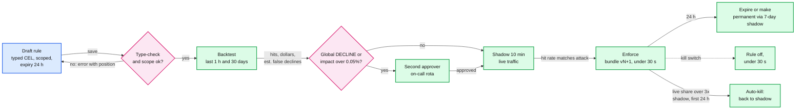

### 5.7 "QuickBooks pays out to the merchant. What does merchant fraud look like, and why can an inline model not stop it?" (loss budget: money that leaves)

**What breaks.** Inline scoring judges a payment. Merchant fraud is a pattern across payments (bust-out, collusion, a fake business running stolen cards, an account takeover that changes the payout bank account). And the clock is against us: a merchant is paid in a day or two, a card dispute arrives in weeks, an unauthorized consumer ACH debit can come back for 60 days (Nacha: "The return timeframe is 60 days" for R11, the same as R10). Everything paid out before the truth arrives is Intuit's loss if the merchant cannot repay. See [`deep-dives/layered-controls-and-merchant-risk.md`](deep-dives/layered-controls-and-merchant-risk.md).

**The fix: three layers, each on a longer clock with heavier tools.**

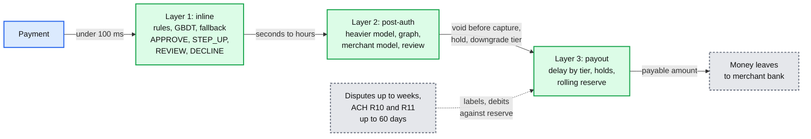

- **Defer capture for `REVIEW` card payments.** Authorize now, capture when the re-score or the analyst clears it (minutes to hours). Stripe's guidance: issuers must report possible fraud on a captured payment even if refunded, but "if you identify and reverse a fraudulent or suspicious payment authorisation before it's captured, it isn't reported" ([monitoring programs](https://docs.stripe.com/disputes/monitoring-programs)). A void costs nothing in VAMP's numerator.
- **Payout delay by tier.** Tier A and B next day, tier C 2 business days, tier D only after review [estimate]. The delay is what gives layer 2 time to work.
- **Rolling reserve sized from expected losses.** Hold `r%` of each payout for 90 days so that the reserve covers the p95 of 90-day disputes plus returns. Example: $200k a month at a 1% dispute-plus-return rate is ~$6k expected over 90 days; a 5% reserve holds ~$30k at steady state, about 5x the expectation [estimate].
- **Payout bank account changes cool down.** A change holds payouts for 3 days [estimate] and notifies the previous contact. This is the account-takeover defense; Nacha's 2026 rules target payments "authorized under False Pretenses" as well.
- **Cap unseasoned volume, gate instant deposit, guard refunds.** Pay out at most ~1.5x the merchant's seasoned daily average [estimate]; the excess waits until its return windows have mostly passed. A spike hold catches a jump but misses a slow ramp: in the reviewer's simulation of a merchant ramping +12% a day, the cap cuts Intuit's loss from ~$141k to ~$51k ([`deep-dives/layered-controls-and-merchant-risk.md`](deep-dives/layered-controls-and-merchant-risk.md)). Instant deposit, the one path where money leaves the same day, is only for seasoned merchants whose day is within their history. Refund velocity per merchant is a synchronous counter in the counter cluster, and a refund on a payment under hold is blocked (on top of refunds only to the original method, §4.4).
- **ACH-specific controls.** Validate the account before its first WEB (internet-initiated) debit, as the Nacha WEB debit rule has required since March 19, 2021 (prenote, micro-entries or a commercial validation service). Velocity on the bank account across merchants. A large first debit from a new account: `REVIEW`, debit in the next file but release funds only after the ~2-banking-day window for NSF and administrative returns [estimate]. Since Nacha's fraud-monitoring rule (phase 1 March 20, 2026 for ODFIs (originating banks) and originators, third-party service providers and senders with 2023 volume of 6 M or more; phase 2 June 19, 2026, in practice June 22, for everyone else), originators and their providers need "risk-based processes and procedures reasonably intended to identify ACH Entries initiated due to fraud". This system is that evidence. QuickBooks Payments' exact Nacha role is not public.

**Push back on the textbook answer.** "Decline more at checkout to stop merchant fraud." A colluding merchant's cards are often real and its buyers often willing; tighter inline thresholds mostly decline honest buyers of honest merchants. The control for merchant fraud is **when money may leave**, not whether a payment may happen.

**What changed:** deferred capture on `REVIEW`; `payout_delay_days` and `reserve_bps` on the merchant profile; bank-change cooling; the unseasoned-volume cap, seasoned-only instant deposit and refund guards; ACH validation and release rules; payable = settled minus holds, reserve and unseasoned excess.

### 5.8 "One merchant's payment link gets 1,000 requests a second. What saturates first?" (scale)

**What breaks.** 1,000/s on one merchant is ~3x today's platform peak, half the 2k/s design. Risk pods, feature reads and processor authorizations all scale with it, the processor bills every authorization, and honest merchants' payments queue behind a bot.

**The fix.**
- **Admit per merchant at the edge.** A token bucket per merchant payment link at ~10x that merchant's p99 rate, minimum 5/s [estimate]; above it, a CAPTCHA, not a 503. See [`../../concepts/rate-limiting-and-load-shedding.md`](../../concepts/rate-limiting-and-load-shedding.md).
- **Bulkhead per merchant in the risk service.** One merchant may hold at most ~10% of a pod's in-flight decisions [estimate]; beyond that its requests get the fallback table, never a timeout for everyone else.
- **Attack mode is cheap.** For a merchant in attack mode, card-not-present requests skip the feature read and the model: one counter-cluster script, then `STEP_UP` or `DECLINE`. The flood stops costing feature reads. Headroom: 2k/s design means ~8k feature multi-gets/s across 4 shards and ~2k Redis scripts/s on one primary, both far from their limits. Risk pods autoscale on CPU at 50%, sized so one AZ loss still carries 2k/s.

**Push back on the textbook answer.** "Autoscale." Scaling takes minutes, a card-testing run takes minutes, and every request we pass on costs a processor fee and a VAMP enumeration count. Shed and challenge first, scale second.

**What changed:** per-merchant edge buckets and CAPTCHA; per-merchant bulkheads; the attack-mode short circuit. Capacity per component is in §10.3.

### 5.9 "A merchant asks why their customer was declined. And what is in PCI scope?" (security)

**What breaks.** A fraud system sees every payment, so it is a tempting place to put card numbers "just for features"; that would pull every risk pod, Kafka topic and lake table into PCI scope. And an explanation that names the rule or the score teaches an attacker the boundary.

**The fix** (details in §10.10):
- **No cardholder data.** The risk service receives a vault token, a card fingerprint (a keyed hash computed in the vault), the BIN and the last 4 digits; for ACH, the routing number and an HMAC (keyed hash) of the account number; for buyers, HMACs of email and phone. The PAN stays in the vault, the only system in the cardholder-data environment, so risk, Kafka and the lake stay out of it.
- **Merchants get a category and an action, never the reason internals.** "Card used unusually, ask the customer to try 3-D Secure or another card", "Bank account not verified", "Temporarily unavailable, retry". For a hold or reserve, which is adverse to the merchant: the amount, the reason category, the expected release date, and how to submit documents or appeal.
- **Analysts get everything.** Rule hits, model version, score, top contributing features (SHAP, SHapley Additive exPlanations, computed asynchronously for every `DECLINE` and `REVIEW`, ~2% of payments, ~60k a day), and a replay from the snapshot.
- **Authn and authz.** mTLS service identities; only the orchestrator's identity may call `Decide`. Analysts use SSO with MFA and role-based access; two-person approval for global rules, allowlist entries above a dollar limit, fallback-table changes and model promotion. Every change is audit-logged with actor and diff.

**What changed:** the identifier contract in `Decide`; merchant-facing reason categories; async SHAP; the two-person matrix.

---

## 6. Final design and the core flows

Everything from §5 composed. 14 nodes; zoom-ins in [`diagrams.md`](diagrams.md).

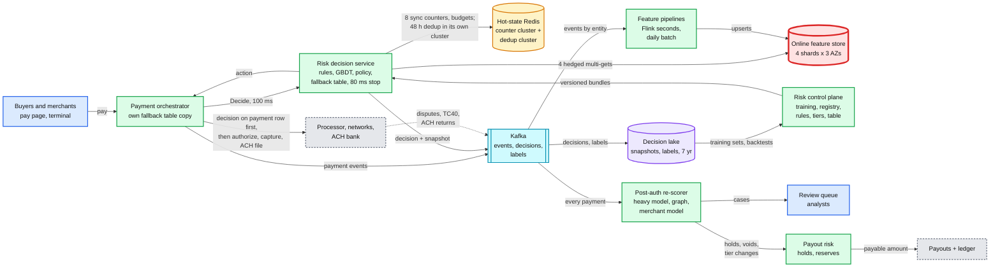

The six flows to say from memory (final design, not the §4 version):

**Flow 1: a $180 online card payment is approved (~15 ms ours, ~20 ms at the orchestrator).** (1) `Decide(p_1)`, stage deadlines stamped (features 30, model 45, store 60, stop 80 ms). (2) In parallel, ~6 ms: 4 hedged multi-gets, the counter-cluster script (8 counters, 1 ms), the dedup lookup. (3) Rules, no hit; GBDT 0.012 (2.5 ms); policy for tier A, online, $180: `APPROVE`. (4) `SET NX` the dedup entry, snapshot to Kafka async, shadow model scored after the response. (5) The orchestrator writes `d_1` to its payment row, then authorizes. Diagram: §4.1.

**Flow 2: a feature shard stalls.** (1) Shard 3 misses 6 ms; the hedge to its replica in another AZ answers at 8 ms; nobody notices. (2) A gray AZ that slows every replica trips latency ejection (over 30% of calls slower than 6 ms): reads move to another AZ for 5 s. (3) If both copies stall, the 30 ms deadline fires: the validated `(segment, missing shards)` lookup says `PARTIAL` or not; if not, rules on what arrived (counters still up), then the table, under $5 always stepping up, attempts and dollars from the merchant's buckets. (4) Out by ~31 ms, `source: FALLBACK`. (5) Re-scored within 15 minutes, before payout; payouts check `rescored_at` on the payment row. Diagrams: §5.1, §5.2, [`diagrams.md` D5](diagrams.md#d5-failure-paths).

**Flow 3: card testing on `m_3`.** (1) Attempts 1 to 10 in 8 s are counted synchronously. (2) Attempt 11 makes 11 distinct cards in 60 s against a p99 of 2 (for a big merchant, the never-seen-card and under-$5 shares fire instead): `DECLINE`, attack mode for 1 h. (3) Every card-not-present payment on `m_3` now needs 3DS; the edge shows a CAPTCHA; the flood skips the model; exploration is off. (4) ~10 attempts got through, not ~250. If the counter cluster is down, the per-pod attack counter trips within seconds. Diagram: §5.3.

**Flow 4: a retry after a timeout.** (1) Pod A gets `APPROVE` for `p_9`, writes it to the payment row, and dies before the processor call. (2) Pod B resumes from the row: no `Decide` call, no counter touched. (3) Had A died before the row write, B's `Decide(p_9)` gets the 48 h dedup answer (or a harmless recompute, since nobody was told). (4) A processor timeout on `p_9` followed by the buyer's `p_10` counts one attempt: processor timeouts are `ZREM`ed, our own soft declines are not. Diagram: [`diagrams.md` D5b](diagrams.md#d5b-a-resumed-payment-gets-the-stored-decision).

**Flow 5: a rule at 2 AM.** (1) 02:00 attack panel. (2) 02:06 scoped `STEP_UP` draft, 24 h expiry. (3) 02:08 backtest: 1,240 hits in an hour vs 12 a day. (4) 02:09 shadow for 10 minutes. (5) 02:19 enforce, under 30 s to every pod. (6) For 24 h the auto-kill watches live hit share against shadow share every 60 s. (7) Morning review. Diagram: §5.6.

**Flow 6: a bust-out stopped at the payout.** (1) `m_44`, 45 days old, runs $91k of keyed payments in 3 h. (2) Inline: most pass, some `REVIEW` with deferred capture; a payer device equal to the merchant's own session device would make each one `REVIEW`. (3) The re-scorer sees the spike plus a graph link to a closed merchant: merchant model 0.7, a `RESCORE` decision. (4) Merchant-wide hold, tier D within ~30 s, priority-1 case. (5) `payable(m_44) = 0` at the 5 PM run, and instant deposit was never open to a 45-day-old merchant; refunds may only go back to the original cards and none while held. Diagram: §4.4.

---

## 7. Trade-offs

| Decision | Option A | Option B | Chose | Why |
|---|---|---|---|---|
| Where the model runs | Remote model server | In process in the risk service | In process | ~2.5 ms on the request thread vs a second fan-out leg with ~15 to 25 ms p99; a GBDT is ~30 MB |
| Model family inline | DNN, deep neural network (Stripe moved Radar from XGBoost plus DNN to DNN-only) | GBDT | GBDT | At ~3 M payments a day, tabular features, CPU inference and cheap SHAP explanations win. The heavier post-auth model can be a DNN |
| Feature store layout | Many shards for throughput | 4 shards for memory, AZ-local replicas, hedged | 4 shards | 8k calls/s is small; fewer calls per decision means a thinner tail (§5.1) |
| Freshness for attacks | Faster streaming | Synchronous counters for 8 keys | Sync counters | A guarantee that the previous attempt is counted; the stream keeps the other ~300 features |
| Training features | Recompute point in time | Log the vector with each decision | Log | No training-serving skew, replay for free, ~0.45 TB a year |
| Degraded mode | Fail closed, or fail open | Rules on what arrived, then a table by tier x band x method, under $5 steps up, attempt and dollar budgets per merchant, re-score | Ladder and table | ~$20k expected loss vs 210k declines in a 10-minute outage; a $1 card test cannot spend a dollar budget |
| Who owns degraded mode | Engineering defaults | Risk policy signs the table | Risk policy | It is a credit decision, not a code path |
| Decision of record | A consistent store inside risk | The orchestrator's payment row, written before the processor call, plus a 48 h lossy dedup in risk | Payment row | Already strongly consistent; risk's cache only covers concurrent duplicates |
| Hot state | One Redis for counters, dedup and budgets | Counter cluster (`noeviction`, ~4 GB) and a separate dedup cluster (~17 GB) | Split | A growing cache must never make a counter write fail |
| Gray AZ | Health checks | Latency-based ejection plus zone-aware routing | Ejection | Gray failures pass health checks; p99 34.6 ms vs 17.8 ms simulated |
| Counters | Integers (`INCR`) | Sets keyed by payment id or card fingerprint | Sets | Retries cost nothing; distinct counts for free |
| Rules vs ML | Rules only, or ML only | Rules for policy and minutes-scale response, ML for ranking | Both | Rules cannot rank; ML cannot react in minutes or encode a contract |
| Emergency rules | Free-for-all, or full 7-day shadow | Scoped, backtested, 10-minute shadow, 24 h expiry, two-person for global, per-rule auto-kill | Guarded fast path | ~20 minutes from attack to enforce; a bad paste costs ~990 false declines, not ~13k |
| Model release | Ship on offline metrics | Shadow, disagreement set, canary, guardrails | Shadow and canary | Outcomes take 60 to 90 days; leading indicators and fast labels stand in |
| Merchant fraud | Decline more inline | Payout delay, holds, reserves, deferred capture | Money controls | The payments are real; the money timing is the control |
| What we refused to build | A graph database on the 100 ms path; a remote model server; daily retraining; a global fail switch; raw card or bank data anywhere in risk; auto-applied model thresholds without policy sign-off | | | Each adds latency, a failure mode or PCI scope that the requirements do not pay for |

**Consistency model, stated once.** The inline decision is strongly consistent per payment id: it is written to the orchestrator's payment row before the processor call, and risk's 48 h dedup is a lossy cache in front of it. Re-scores are separate, later decisions. Synchronous counters give read-your-writes, but only merchant-keyed counters are exact (merchants are homed in one region); card, IP and device counters are per region, and a failover can lose ~1 s of increments. Streaming features are eventual (seconds), batch features daily. Rules, models and the fallback table are versioned snapshots, p99 ~30 s to every pod, named on each decision. Labels are eventual by design (minutes to 90 days). Payout holds are strong, written with ledger entries in one transaction ([`../payments-ledger/`](../payments-ledger/)).

---

## 8. Staff-level notes

- **Simplest thing that meets the bar.** One risk service with everything in process, one fan-out, one counter script, one table for degraded mode. Refused: graph queries inline, a model server, a strongly consistent decision store, daily retraining, per-merchant models.
- **Failure modes and blast radius.** A risk pod: its in-flight requests fall back; the orchestrator does not retry inside the request. A feature shard: hedges absorb it; if a whole shard is gone, ~1/4 of keys are missing, so most decisions go `PARTIAL` or fallback until a replica is promoted (~10 to 30 s [estimate]). A gray AZ: latency ejection moves reads within ~1 s. Counter cluster: card-testing defense falls back to per-pod attack counters and stream counters, budgets to local slices; a failover is ~10 s plus ~1 s of lost writes. Dedup cluster: nothing visible. Kafka: decisions still flow, snapshots buffer locally, streaming features go stale (alert), re-scores wait. The widest blast radius is **our own change**: a bad global rule (stopped by backtest, shadow, two-person, then the per-rule auto-kill), a bad model (shadow, canary, pointer rollback), a bad fallback table (two approvers, game days).
- **Migration from a legacy rules engine or vendor score, with rollback.** Phase 1: log-only shadow of the new service on 100% of traffic, snapshots on from day one. Phase 2: model v0 trained on point-in-time recomputed features (accepting skew), rules migrated and diffed against the legacy decisions until the diff is explained. Phase 3: enforce by cohort, card present and tier A first, then online card, then ACH; legacy keeps scoring in shadow; rollback is a per-cohort flag. Phase 4: payout risk takes over holds and reserves. Phase 5: retrain on 90+ days of logged snapshots (removing the v0 skew), then retire the legacy path. Gantt: [`diagrams.md` D12](diagrams.md#d12-rollout--migration).
- **Operability.** SLOs (service level objectives, monthly): 99.99% of payments get a risk answer (full or fallback) within 100 ms; full-decision rate at least 99.9% (unhedged, the feature tail alone would miss it at 0.39%); sync counters visible in under 1 s p99; every fallback re-scored before its payout. Pages at 3 AM: fallback rate above 1% for 5 min; decision p99 above 90 ms for 5 min; hedge rate pinned at its 5% cap for 1 min (a gray AZ); a rule auto-killed; decline rate in any segment above 2x baseline for 15 min (a model, rule or data bug); stream lag above 60 s; null-rate spike on a top-20 feature; a rule kill-switch failure. Attack alerts page risk operations, not engineering.
- **Cost.** Per region [estimate]: ~12 risk pods of 8 vCPU, 12 feature-store nodes (4 shards x 3 AZs, ~64 GB each), two small Redis clusters (counters, dedup), a small Flink cluster, shared Kafka; roughly $60k to $100k a month for two regions. The lake adds ~0.45 TB a year. People cost more: ~13 analyst shifts a day for review, and the teams below. Both are small next to fraud losses of even a few basis points on ~$220 B a year of volume [estimate].
- **Team boundaries.** Payments owns the orchestrator, the processor integration and the ledger. The risk platform team (6 to 8) owns the decision service, feature pipelines, the Redis clusters and the control plane. Risk ML (4 to 6) owns models, labels, thresholds and drift. Risk operations owns rules, review and merchant investigations. Risk policy (with finance) owns the fallback table, tiers and reserve policy. Security owns the vault. The contracts are `Decide`, the `payment-events` schema, the label schema and the fallback table format.
- **Explicit trade-off.** We accept a bounded, re-scored fraud exposure during outages to avoid declining honest buyers, and we let risk's dedup be a lossy cache because the orchestrator's payment row already holds the decision of record.

---

## 9. What is expected at each level

**Mid (80/20 breadth/depth).** A risk service called before authorization, a feature store, a model, some rules, a timeout with "approve if it times out", Kafka for events, a nightly retrain. Likely misses the fan-out tail, label delay, retry double counting, and that payouts are the second chance.

**Senior (60/40).** Walks a latency budget with an in-process model, separates batch and streaming features, states fail open vs fail closed and picks per segment, idempotent counters, shadow before launch, and a post-auth review queue. Goes deep on one of: features, the fallback, or the model lifecycle.

**Staff+ (40/60).** Everything above, plus: does the `0.99^(1/N)` tail arithmetic and cuts N instead of sharding wider; makes the fallback a ladder (validated `PARTIAL`, rules on what arrived, then a signed table budgeted in attempts and dollars) with a loss number per cell and a re-score before payout; handles a gray AZ by latency, not health checks; adds the synchronous counter path and says why a faster stream is not a guarantee; trains on logged snapshots; handles the label delay, the decline blind spot (exploration) and cost-based thresholds; separates rules (minutes) from models (weeks); names merchant fraud as a payout-timing problem with deferred capture, delays and reserves; knows ACH's 60-day tail and the VAMP numbers; and gives the shadow-first migration.

---

## 10. Nitty-gritty (past interview scope)

### 10.1 Internals of each chosen technology

- **GBDT inference.** Each tree is a few hundred nodes laid out in an array; a decision walks ~8 comparisons per tree, ~1,000 trees, ~2.5 ms on one core, dominated by cache misses. `UNAVAILABLE` values follow a learned default branch (dropout training), kept apart from `NOT_FOUND`; whether that is safe for a given missing pattern is decided by the validated lookup, not assumed. Output goes through an isotonic calibration table, then the segment's thresholds. TreeSHAP explains one prediction in roughly tens of ms [estimate], so it runs off the request path.
- **Redis, two clusters.** Single-threaded event loop, so one Lua script is atomic: no two decisions interleave between `ZADD` and `ZCOUNT` (`NX` for payment-id sets, `GT`, Redis 6.2+, for card sets). Sorted sets give sliding windows (`ZREMRANGEBYSCORE` to trim, `ZCOUNT` by time); token buckets are a refill-on-read script. Replication is asynchronous, the source of the ~1 s failover window. The counter cluster runs `noeviction` (a counter must never be silently evicted; alert at 70% memory); the dedup cluster runs `volatile-ttl`, so growth there can only evict old dedup entries, never block a counter.
- **Online feature store.** Any in-memory KV with multi-get and per-key TTL works (Redis Cluster, Aerospike, or a managed store). What matters: one row per entity, keys grouped per shard, an AZ-local replica for reads and a replica in another AZ to hedge to.
- **Kafka and Flink.** Topics `payment-events` and `risk-decisions` are partitioned by `payment_id`; Flink re-keys by entity. See [`../../concepts/stream-processing.md`](../../concepts/stream-processing.md).

The streaming job (dedup on `event_id` in keyed state, event-time windows, idempotent upserts, checkpoints) is drawn in [`diagrams.md` D2b](diagrams.md#d2b-inside-the-streaming-feature-job).

### 10.2 Configuration knobs that matter

| Component | Knob | Value | Why |
|---|---|---|---|
| Orchestrator | risk call deadline, retries | 100 ms, none | No retry fits; the table answers |
| Risk service | stage deadlines | features 30 ms, model 45 ms, store 60 ms, hard stop 80 ms | A slow stage becomes a bounded answer |
| Risk service | hedge delay, hedge cap | 6 ms (~per-call p97, ~3% hedged), 5% of calls | Load-bearing: unhedged, 0.39% of decisions miss 30 ms |
| Risk service | AZ ejection | over 30% of calls slower than 6 ms, eject for 5 s | Gray failures pass health checks |
| Feature store | shards x replicas | 4 x 3 AZs | Memory, not throughput, sets the shard count |
| Counter cluster | windows, TTL | 60 s, 10 min, 1 h; TTL window plus 60 s | Exact sliding counts, bounded memory |
| Dedup cluster | TTL, `Decide` cut-off | 48 h; older attempts get `STALE_ATTEMPT` | The payment row is the record; this only covers races |
| Flink | checkpoint, watermark, allowed lateness | 30 s, 5 s, 60 s | Seconds of freshness; the sync path covers the rest |
| Kafka | `acks`, `min.insync.replicas`, retention | all, 2, 7 days | Decision log survives a broker loss; replay window for re-scores |
| Model | trees, depth, features | ~1,000, 8, ~300 [estimate] | ~2.5 ms on one core |
| Policy | thresholds | per tier x method x band, from `C_fd(a) / (C_fd(a) + L(a))` with both sides scaled by amount, monthly | Cost-based, recalibrated, sensitivity shown |
| Fallback | budget per merchant, token buckets | dollars `clamp(1.5 x p95 hour, $200, $50k)`, attempts `max(20, 2 x p95 hour)`, tier multiplier; under $5 card not present always steps up | A $1 card test cannot spend a dollar cap |
| Rules | emergency expiry, shadow, auto-kill | 24 h (max 72 h), 10 min, live share over 3x shadow in 60 s for the first 24 h; normal rules 7 days | Fast without permanence or a 2 AM typo |
| Drift | PSI alert | 0.2 | Classic "significant shift" line |
| Payout | delay by tier, reserve | next day / next day / 2 days / review; 0 to 10% for 90 days | Gives layer 2 time; covers the tail |

### 10.3 Capacity math per component

| Component | Per unit | Total at design (2k/s) | Headroom |
|---|---|---|---|
| Risk pods | ~200 decisions/s per 8-vCPU pod (model 2.5 ms, shadow scored after the response, I/O waits) [estimate] | 10 pods, run 12 per region | Sized to lose one AZ |
| Feature store | 8k multi-gets/s over 4 shards = 2k/s per shard, ~16 keys each | 30 GB per shard | Far below an in-memory node's limit; **its p99.9, not its throughput, is the limit** |
| Counter cluster | 2k scripts/s (16 to 24 sorted-set ops each) | ~4 GB | One primary; first to shard at ~10x (hash-tag by merchant) |
| Dedup cluster | 2k `SET NX`/s, 48 h | ~17 GB | Lossy by design |
| Kafka | 20k events/s x 1 KB = 20 MB/s, plus 2k decisions/s x 2 KB | ~24 MB/s | Trivial for a shared cluster |
| Flink | 20k events/s x ~6 entities = 120k keyed updates/s | ~10 task slots [estimate] | Fine |
| Lake | 6 GB/day raw, ~1.2 GB/day Parquet | ~3 TB after 7 years | Object storage |
| Re-scorer | ~350/s peak at 50 to 200 ms each, plus graph queries | ~70 concurrent evaluations | Async; lag is the metric |
| Review | ~2k cases/day at ~3 min | ~13 analyst shifts a day | People are the tightest resource after latency |

### 10.4 Failure timeline

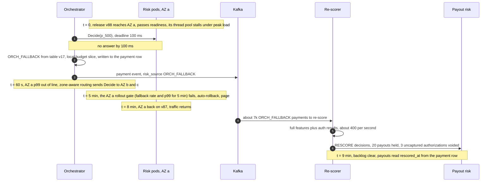

- **The same release everywhere at once** would put the whole region on `ORCH_FALLBACK` (~105k payments in 5 minutes at peak) until the fallback-rate page at t = 5 min; that is why releases go one AZ at a time behind a gate.

- **Feature-store shard primary dies:** t=0 reads to that shard stall; t≈6 ms per request, hedges to the other AZ's replica answer; t≈10 to 30 s a replica is promoted [estimate]. User impact: none; fallback rate blips only if both replicas of a shard are lost.
- **Counter-cluster primary dies:** t=0 scripts fail after a 4 ms timeout; decisions run on stream counters with the in-process attack flags, per-pod attack counters and local budget slices; t≈10 s replica promoted, ~1 s of increments lost. A dedup-cluster loss is invisible: at worst a recompute for a payment nobody was told about ([`diagrams.md` D5c](diagrams.md#d5c-the-counter-cluster-fails-during-a-card-testing-run)).

### 10.5 Exactly-once and idempotency end to end

| Hop | Where duplicates come from | Dedup key | Where removed | Lifetime |
|---|---|---|---|---|
| Client to orchestrator | Double click, app retry | `Idempotency-Key` | Payments DB ([`../payments-ledger/`](../payments-ledger/) §4.1) | 24 h |
| Orchestrator to risk | Pod death, resume, duplicate call | `payment_id` | Payment row (written before the processor call); risk's `SET NX` for races; `STALE_ATTEMPT` after 48 h | Row: life of the payment; dedup 48 h |
| Risk to counters | Recompute of the same payment | `payment_id` or card fingerprint as set member | `ZADD NX` (payment ids), `ZADD GT` (card sets) | Window length |
| Risk to Kafka | Producer retry; a pod crash loses its in-memory buffer | Idempotent producer; `payment_id` | Consumers upsert by `payment_id`; a daily job reconciles `DECIDED` events against `risk-decisions` | Topic retention |
| Events to Flink | Redelivery, replay from checkpoint | `event_id` | Keyed dedup state | 1 h |
| Flink to feature store | Replay after restart | Entity key plus window version | Upsert only if newer | Row lifetime |
| Labels | Re-sent dispute or return files | Dispute id, return trace number, case id | Unique `source_event_id` | 7 years |
| Holds | Re-score retried | `hold_id = hash(subject, reason)` | Unique key, mirrored in one ledger transaction | Until released |

### 10.6 Consistency model per edge

| Edge | Model | Why |
|---|---|---|
| Orchestrator to risk | Synchronous, idempotent per `payment_id` | One answer per payment |
| Risk to counter cluster | Atomic script on one primary; async replicas | Read-your-writes; exact for merchant keys, per region for card, IP and device; ~1 s failover gap |
| Risk to feature store | Eventual (stream seconds, batch daily) | Freshness where it pays; sync counters cover attacks |
| Control plane to pods | Versioned snapshot, p99 ~30 s, named on each decision | No invalidation, replayable |
| Orchestrator payment row | Strong, written before the processor call; payouts read `risk_source` and `rescored_at` from it | What the buyer was told is the truth, and Kafka down must not hide a fallback |
| Kafka to lake | At-least-once, upsert by `payment_id` | Training and audit, minutes |
| Labels to lake | Eventual, minutes to 90 days | The nature of fraud outcomes |
| Re-scorer to payout risk | Strong: hold and ledger entry in one transaction | Money must not leave while a hold is being written |
| Payout risk to payouts | Synchronous read of payable before every payout | No payout on a stale view |

### 10.7 Alternatives rejected

| Alternative | Why it looked attractive | Why rejected |
|---|---|---|
| Vendor fraud score as the only layer | No ML team, fast to launch | No QuickBooks books data (invoice and customer history), no merchant-risk or payout control, a third-party call on the 100 ms path |
| Remote model server inline | Independent model deploys, GPUs | A second fan-out leg with its own p99; a GBDT does not need it. Used for the post-auth model |
| Graph database query inline | Fraud rings are graphs | 2-hop queries take tens to hundreds of ms; graph features are precomputed daily and queried live only post-auth |
| HyperLogLog for distinct counts | Constant memory | ~4 GB of exact sets at design is cheap and exact; HLL is the seam at 10x ([`../../concepts/stream-sketches.md`](../../concepts/stream-sketches.md)) |
| Point-in-time joins only (no snapshots) | Standard feature-store pattern | Residual skew from stream lag and failed writes; snapshots cost ~0.45 TB a year |
| Daily retraining | "Fresh" models | Labels are 60 to 90 days late; rules give speed |
| One global fail-open or fail-closed switch | Simple | 210k declines, or unbounded exposure during an attack |
| Strongly consistent decision store | Closes the ~1 s window | 3 to 10 ms p99 and another stateful dependency to cover what the orchestrator row already records |

### 10.8 How the big companies do it

- **Stripe Radar** ([how we built it](https://stripe.dev/blog/how-we-built-it-stripe-radar), 2023): assesses "more than 1,000 characteristics", decides "in less than 100 milliseconds", and "incorrectly blocks just 0.1%" of legitimate payments. It moved from a Wide & Deep ensemble (XGBoost plus a DNN) to a DNN-only model, cutting training time by over 85% to under two hours. Rules can allow, block, review or request 3DS; the risk score runs 0 to 99, 65+ elevated, 75+ high and blocked by default ([docs](https://docs.stripe.com/radar/risk-evaluation)). Difference from us: Stripe's network sees most cards ("92% chance we've seen the card"); our edge is the merchant's books.
- **Uber Mastermind** ([blog](https://www.uber.com/blog/mastermind/), 2017): analyst-written rules, "300 complex rules takes only 30 milliseconds" after caching parsed ASTs, rules call an ML service for scores, and v2 was migrated by shadow testing: "The new version didn't actually make decisions, but rather recorded the results". Same split as ours: rules for speed of response, models for ranking.
- **Brex pluggable authorizations and Monzo Stand-in** (summarized with sources in [`../expense-rules-engine/`](../expense-rules-engine/) §10.8): parallel checks with a short timeout and a per-plugin default decision, and a minimal stand-in platform whose approvals are applied verbatim later. Both are our "pre-agreed answer, reconciled afterwards" pattern.
- **Visa VAMP** is not a company system but the scorecard every acquirer and payment facilitator runs against: a count-based ratio of TC40 fraud reports plus TC15 dispute records over settled card-not-present transactions, monthly.

### 10.9 Operational runbook

- **Dashboards (five):** decision latency p50/p99/p99.9 and fallback rate by `source`; action mix by segment against baseline; feature health (stream lag, null rates, hedge rate, AZ ejections, counter-cluster latency); attack panel (distinct cards per merchant top 20, issuer decline rate, attack-mode merchants); model and label health (shadow agreement, PSI, TC40 and dispute rates, VAMP ratio projection per merchant).
- **Alerts:** the §8 pages; plus tickets for re-score backlog over 15 minutes, label feed missing for a day, a merchant projected over 100 bps of VAMP ratio.
- **Rollout:** risk service by AZ, never in the US lunch peak; models via shadow and canary (§5.5); rules via backtest and shadow (§5.6); the fallback table via two approvers and a game day before activation.
- **Rollback:** code by redeploy; a model by registry pointer (under 1 min); a rule by kill switch (under 30 s); the table by version pin. Decisions made by a bad version are found in the lake by version and re-scored; affected holds are released in bulk.

### 10.10 Security and abuse

- **PCI scope:** only the vault holds PANs. Risk sees a token, a vault-computed fingerprint, BIN and last 4. Raw buyer emails appear only in the orchestrator and, field-encrypted, in the case UI.
- **Encryption and keys:** TLS everywhere, keys at rest in a KMS (key management service), HMAC keys for identifiers rotated with a dual-key window so features do not reset.
- **Adversarial probing:** buyers and merchants get categories, never scores; per-merchant, per-IP and per-device limits; the decline code a buyer sees is generic.
- **Insiders:** allowlist entries above a dollar limit and global rules need two people; allowlist hits are themselves monitored for anomalies; every console action is audit-logged.
- **Label poisoning:** "friendly fraud" disputes are labelled by reason code and representment outcome, not counted as fraud blindly; a merchant cannot mark its own payments as fraud to train the model.

### 10.11 Evolution

- **10x (20k/s).** Feature store to 16 shards with entity co-location so a decision still touches ~4 shards; counter cluster hash-tagged by merchant across shards; HyperLogLog for cross-merchant distinct counts; GPU or batched inference for the post-auth DNN.
- **Instant payments (RTP, the Real-Time Payments network, and FedNow).** Credit pushes are irrevocable: no return window, no second chance. Those cells fail closed, payee confirmation comes first, and the payout layer's leverage disappears.
- **New markets.** Strong customer authentication rules (for example in the UK) make 3DS mandatory with exemptions; our fraud rate per segment becomes the input to the exemption decision.
- **GenAI for analysts.** A copilot that summarizes a case and drafts a rule. It never decides: its draft goes through the same type-check, backtest and shadow.

---

## 11. Follow-up questions to expect

Ranked by likelihood. Answers in [`edge-cases.md`](edge-cases.md) and the deep dives.

1. **Walk the 100 ms; which call is the long tail?** §5.1, [`deep-dives/latency-budget-and-hot-path.md`](deep-dives/latency-budget-and-hot-path.md).
2. **A dependency misses its stage deadline and you hit the 80 ms stop. Approve or decline, who decided, how much can it lose?** §5.2, [`deep-dives/timeouts-and-fallback-policy.md`](deep-dives/timeouts-and-fallback-policy.md).
3. **Card testing faster than your stream.** §5.3, [`deep-dives/features-and-freshness.md`](deep-dives/features-and-freshness.md).
4. **Labels 60 to 90 days late; how do you know the new model is better, and how do you set the threshold?** §5.5, [`deep-dives/model-lifecycle-shadow-and-labels.md`](deep-dives/model-lifecycle-shadow-and-labels.md).
5. **A retry trips your own velocity rule.** §5.4.
6. **Merchant fraud vs buyer fraud.** §4.4, §5.7, [`deep-dives/layered-controls-and-merchant-risk.md`](deep-dives/layered-controls-and-merchant-risk.md).
7. **A rule at 2 AM during an attack.** §5.6, [`deep-dives/rules-engine-and-attack-response.md`](deep-dives/rules-engine-and-attack-response.md).
8. **Why was this customer declined?** §5.9.
9. **ACH is different how?** §5.7.
10. **Declined payments never get labels; what is in PCI scope?** §5.5 (exploration), §5.9, §10.10.

---

## 12. Presenting this as an Intuit case study

Intuit hands out the problem before the loop and re-opens your deck in every round ([`../company-questions.md`](../company-questions.md) §1). Scoping, AI and security are graded explicitly.

**Ten slides.**
1. The problem and the one-line answer: decide in 100 ms, never block a payment, hold money when unsure.
2. **Scope and what we cut:** in: inline decision, degraded mode, learning loop, post-auth and payout controls. Out: KYB underwriting (used as features), disputes workflow, AML, the processor, the case UI. Why: the loss and latency live in the four we kept.
3. Numbers: 3 M a day, ~350/s peak, 2k/s design, 100 ms with an 80 ms stop, labels 60 to 90 days late, ACH returns up to 60 days.
4. Architecture: the §6 diagram, red node named.
5. The 100 ms walkthrough and the tail arithmetic.
6. Degraded mode: the ladder, the table, budgets in attempts and dollars, the loss per 10-minute outage, who signed it.
7. The AI slide: the model, its features, labels, thresholds from cost, shadow and canary, drift.
8. Three layers and merchant risk: deferred capture, payout delay, reserves, ACH.
9. Security and explainability: PCI boundary, identifiers, merchant-facing reasons, two-person controls.
10. Rollout, SLOs, cost, teams, and the three risks I would watch.

**The AI story.** The model is the product: a calibrated GBDT that ranks every payment in ~2.5 ms. Guardrails: it can only act inside its stage deadline (else the signed fallback table answers); thresholds are set from cost per segment and amount, with their sensitivity shown, and signed by risk policy; rules sit above it for policy and attacks; every version goes through offline, shadow, disagreement review and canary; drift and decline-rate monitors page within minutes; humans review holds above a dollar limit; and every decision is explainable (SHAP internally, a reason category for merchants) and replayable. If asked about GenAI: an analyst copilot that drafts cases and rules, never a decision maker.

**The security story.** Authn: mTLS service identities, SSO with MFA for analysts. Authz: only the orchestrator may call `Decide`; role-based console with two-person approval for global rules, allowlists, the table and model promotion. PII: no PAN, HMAC'd identifiers, raw contact data only where a human needs it, field-encrypted. Encryption: TLS in transit, KMS at rest, rotated HMAC keys. Audit: every decision with its versions, every control-plane change with actor and diff, 7 years. PCI: the vault is the only cardholder-data system.

**Questions each round will re-open.**
- **Architecture deep dive:** the fan-out p99 math; what happens when the feature store is down for 10 minutes; why the model is in process.
- **AI and ML:** how you train with 60 to 90 day labels; how you fix the declined-payment blind spot; how you pick and defend a threshold.
- **Security and risk:** what is in PCI scope; who can change a rule at 2 AM and how it is undone; what a merchant is told and why not more.
- **Hiring manager or director:** who owns fail-open and how much it can lose; how you migrate off the current engine with rollback; team boundaries and cost.
