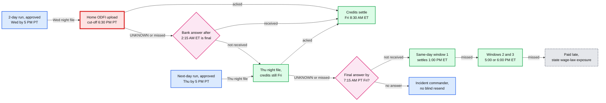

# Deep dive: deadlines and ACH windows

> One-line answer: the deadline is our ODFI's cut-off, so every date is planned backwards from FedACH's windows on the **bank** calendar (pay dates, cut-offs, return windows), while federal tax deposits use a **second** calendar (District of Columbia legal holidays); the night's files are built after the customer cut-off and uploaded to each company's home ODFI (two banks, companies split by cohort), and an upload whose outcome is still unknown at the cut-off is never re-sent that night, because 2-day runs have a free fallback (Thursday's file still pays Friday) and the bank's answer becomes final once FedACH's last future-dated deadline (2:15 AM ET) has passed.

Zoom-in on [`../solution.md`](../solution.md) §4.1, §5.1 and §10.4. Acronyms: ACH (automated clearing house), ODFI (originating depository financial institution, our bank), RDFI (the receiver's bank), FedACH (the Federal Reserve's ACH operator), PT / ET (Pacific / Eastern time), DC (District of Columbia), IRS (Internal Revenue Service), EFTPS (Electronic Federal Tax Payment System), DST (daylight saving time), SFTP (SSH, Secure Shell, file transfer protocol). Reusable blocks: [`../../../concepts/leases-fencing-clocks.md`](../../../concepts/leases-fencing-clocks.md) (clocks and instants); the closest sibling problem is [`../../distributed-job-scheduler/`](../../distributed-job-scheduler/). Siblings: [`exactly-once-money-movement.md`](exactly-once-money-movement.md), [`funding-risk-and-returns.md`](funding-risk-and-returns.md).

---

## 1. The windows we plan from

Verified on the [FedACH processing schedule](https://www.frbservices.org/resources/resource-centers/same-day-ach/fedach-processing-schedule.html) (effective 12 September 2022):

| FedACH deadline (ET) | Kind | Settles |
|---|---|---|
| 10:30 AM, 2:45 PM, 4:45 PM | Same-day eligible | 1:00 PM, 5:00 PM, 6:00 PM ET the same day |
| 8:00 PM (Sunday to Thursday only), 10:45 PM | Future-dated | 8:30 AM ET on the effective date |
| 2:15 AM (distributed by 6:00 AM) | Future-dated, last of the night | 8:30 AM ET on the effective date |

- **Our ODFI's cut-off sits before FedACH's.** The solution assumes 6:30 PM PT (9:30 PM ET) for the night file `[estimate: set by the bank contract]`, so the bank can make the 10:45 PM ET deadline. The customer cut-off (5:00 PM PT) is derived backwards from it: upload by 6:00, build by 5:45, calc barrier by 5:30, customer cut-off 5:00.
- **Same-day is tighter.** A 7:00 AM PT customer cut-off is 10:00 AM ET, against an ODFI same-day cut-off around 10:15 AM ET `[estimate]`. Every same-day entry is at most $1 M ([Nacha](https://www.nacha.org/million)) and costs the ODFI a 5.2 cent Same Day Entry Fee paid to the RDFI ([Nacha](https://www.nacha.org/rules/same-day-ach-moving-payments-faster-phase-1)).
- **FedACH keeps its own holiday hours.** On Veterans Day 2026 processing ends Tuesday 10 November at 11:30 PM ET and resumes Wednesday 11 November at 5:30 PM ET ([holiday schedules](https://www.frbservices.org/about/holiday-schedules)). The planner reads windows from data, never from code.

## 2. The fallback ladder for a Friday payday



- **The slack differs by speed, so the risk does too.** Wednesday's night file carries the big 2-day volume (~3.3 M paychecks on a normal week, ~5.6 M at the design peak, solution §2), and every one of them has a full banking day of slack. Thursday's night file carries the next-day runs for Friday (~25% of Friday's paychecks `[estimate]`, ~1.1 M on a normal week, ~1.85 M at the design peak) and has **no** night-file fallback.
- **So the riskiest window is Thursday, not Wednesday.** Wednesday's cliff is the volume problem. Thursday's is the slack problem. That is why the countdown alerts page from T−90 on Thursday instead of T−60 (solution §5.1, §10.9).
- **Two banks halve each night's blast radius.** Each company is homed at one of two ODFIs, so an outage at one bank's cut-off hits only its cohort, about half the window (solution §7, §8).

| Speed (Friday payday) | Night file | Fallback if that file is UNKNOWN or missed | Slack | What the fallback costs |
|---|---|---|---|---|
| 2-day | Wednesday | Thursday night file, credits still effective Friday | 1 banking day | Debit settles Friday, not Thursday: one more day of exposure (§5.6) |
| Next-day | Thursday | Friday same-day window 1, credits at 1:00 PM ET | Hours: a final answer is needed by ~7:15 AM PT | 5.2 cents per entry; an employer debit over $1 M needs a wire |
| Same-day | Friday window 1 | Windows 2 and 3 | Hours | Pay lands 4 to 5 hours later |
| 4-day (`NEW` tier) | Monday debit only | Tuesday's debit | The "debit clears first" guarantee is lost | Hold credits for high-risk companies, or accept one day of overlap |

## 3. Two calendars, and the holidays that bite

- **FedACH holidays decide money dates:** pay dates ("previous banking day" by default), cut-offs, effective dates, settlement, return windows. 2026 and 2027 lists are on the [Federal Reserve holiday page](https://www.frbservices.org/about/holiday-schedules): "For holidays falling on Saturday, Federal Reserve Banks and Branches will be open the preceding Friday." So **Friday 3 July 2026 is a banking day**.
- **DC legal holidays decide IRS deposit dates.** IRS Publication 15 (2026): "The term 'legal holiday' means any legal holiday in the District of Columbia", and its 2026 list includes **April 16 (DC Emancipation Day)** and **July 3 (Independence Day observed)**, neither of which is a FedACH holiday ([Pub 15](https://www.irs.gov/publications/p15)).
- **The semiweekly rule has a holiday extension.** Wednesday to Friday paydays deposit by the following Wednesday, Saturday to Tuesday paydays by the following Friday, and "Semiweekly schedule depositors have at least 3 business days following the close of the semiweekly period to make a deposit. If any of the 3 weekdays after the end of a semiweekly period is a legal holiday, you'll have an additional day for each day that is a legal holiday" (Pub 15).
- **The $100,000 next-day rule overrides both schedules.** "If you accumulate $100,000 or more in taxes on any day ... you must deposit the tax by the next business day" (Pub 15). Any company whose federal liability per payday reaches $100k (a debit of ~$476k at ~21% federal, ~280 employees at ~$1,680) is on this rule every payday, so the deposit service computes each liability's due date per company per payday (solution §4.3 step 7). The first version scheduled semiweekly dates only.

The planner, runnable (Python 3.9+, standard library only):

```python
"""Two calendars. FedACH holidays (frbservices.org) decide pay dates, cut-offs and return
windows. DC legal holidays (IRS Pub 15) decide federal tax deposit due dates."""
from datetime import date, datetime, time, timedelta as TD
from zoneinfo import ZoneInfo

FED = {date(2026, 10, 12), date(2026, 11, 11), date(2026, 11, 26), date(2026, 12, 25),
       date(2027, 1, 1), date(2027, 1, 18), date(2027, 2, 15)}       # 2026-07-03: Fed OPEN
DC = FED | {date(2026, 4, 16), date(2026, 7, 3), date(2027, 4, 16)}  # Pub 15 adds these
PT, UTC = ZoneInfo("America/Los_Angeles"), ZoneInfo("UTC")

def bday(d, cal): return d.weekday() < 5 and d not in cal
def shift(d, n, cal):                       # move n business days, n < 0 means earlier
    step = TD(days=1 if n > 0 else -1)
    for _ in range(abs(n)):
        d += step
        while not bday(d, cal): d += step
    return d
def pay_date(nominal):                      # holiday rule: previous banking day
    while not bday(nominal, FED): nominal -= TD(days=1)
    return nominal
def deposit_due(pay, cal=DC):              # semiweekly: 3 business days after the period
    wd = pay.weekday()                      # Wed-Fri period ends Fri, Sat-Tue period ends Tue
    end = pay + TD(days=(4 - wd) if wd in (2, 3, 4) else (1 - wd) % 7)
    return shift(end, 3, cal)
def d(x): return x.strftime("%a %d %b")

print("nominal payday | paid    | 2-day cut-off | debit returnable to | 4-day cut-off | IRS due (DC) | if from nominal | if bank calendar")
for nominal in (date(2026, 10, 13), date(2026, 11, 13), date(2026, 12, 25), date(2027, 1, 1),
                date(2027, 2, 15), date(2026, 6, 30), date(2026, 7, 3)):
    pay = pay_date(nominal)
    cut2 = shift(pay, -2, FED)              # night file that day; debit settles next banking day
    ret_close = shift(shift(cut2, 1, FED), 2, FED)   # opening of business, 2nd banking day after
    cut4 = shift(pay, -4, FED)              # debit first; credits leave the night before payday
    naive = pay - TD(days=4)                # naive 4-day: 4 calendar days before payday
    while not bday(naive, FED): naive -= TD(days=1)
    overlap = shift(shift(naive, 1, FED), 2, FED) > shift(pay, -1, FED)
    print(f"{d(nominal)} {nominal.year} | {d(pay)} {pay.year} | {d(cut2):13} | {d(ret_close):19} | "
          f"{d(cut4)}{' (naive: overlap)' if overlap else ''} | {d(deposit_due(pay)):12} | "
          f"{d(deposit_due(nominal)):15} | {d(deposit_due(pay, FED))}")

# Daylight saving ends Sun 1 Nov 2026. A run created on 21 Oct for payday Fri 6 Nov:
cut = shift(date(2026, 11, 6), -2, FED)
right = datetime.combine(cut, time(17), PT).astimezone(UTC)
created = datetime.combine(date(2026, 10, 21), time(9), PT)
wrong = (datetime.combine(cut, time(17)) - created.utcoffset()).replace(tzinfo=UTC)
print(f"DST: cut-off {d(cut)} 5 PM PT = {right:%H:%M} UTC; with the offset of the day the run was "
      f"created ({created.utcoffset().total_seconds() / 3600:+.0f} h) it is {wrong:%H:%M} UTC, one hour early")
```

Real output:

```
nominal payday | paid    | 2-day cut-off | debit returnable to | 4-day cut-off | IRS due (DC) | if from nominal | if bank calendar
Tue 13 Oct 2026 | Tue 13 Oct 2026 | Thu 08 Oct    | Wed 14 Oct          | Tue 06 Oct (naive: overlap) | Fri 16 Oct   | Fri 16 Oct      | Fri 16 Oct
Fri 13 Nov 2026 | Fri 13 Nov 2026 | Tue 10 Nov    | Mon 16 Nov          | Fri 06 Nov (naive: overlap) | Wed 18 Nov   | Wed 18 Nov      | Wed 18 Nov
Fri 25 Dec 2026 | Thu 24 Dec 2026 | Tue 22 Dec    | Mon 28 Dec          | Fri 18 Dec | Wed 30 Dec   | Wed 30 Dec      | Wed 30 Dec
Fri 01 Jan 2027 | Thu 31 Dec 2026 | Tue 29 Dec    | Mon 04 Jan          | Thu 24 Dec | Wed 06 Jan   | Wed 06 Jan      | Wed 06 Jan
Mon 15 Feb 2027 | Fri 12 Feb 2027 | Wed 10 Feb    | Tue 16 Feb          | Mon 08 Feb | Thu 18 Feb   | Fri 19 Feb      | Thu 18 Feb
Tue 30 Jun 2026 | Tue 30 Jun 2026 | Fri 26 Jun    | Wed 01 Jul          | Wed 24 Jun (naive: overlap) | Mon 06 Jul   | Mon 06 Jul      | Fri 03 Jul
Fri 03 Jul 2026 | Fri 03 Jul 2026 | Wed 01 Jul    | Mon 06 Jul          | Mon 29 Jun | Wed 08 Jul   | Wed 08 Jul      | Wed 08 Jul
DST: cut-off Wed 04 Nov 5 PM PT = 01:00 UTC; with the offset of the day the run was created (-7 h) it is 00:00 UTC, one hour early
```

What each row teaches:

- **Columbus Day (row 1).** The 2-day cut-off for a Tuesday 13 October payday is Thursday 8 October, as solution §4.1 says. Four calendar days before payday (Friday 9 October) would leave the debit returnable until Thursday 15 October, two days after the credits.
- **Veterans Day on a Wednesday (row 2).** The 2-day cut-off jumps to Tuesday 10 November. The 4-day cut-off is **Friday 6 November**, not "Monday": a Monday approval settles the debit on Tuesday, and its return window then runs to Friday 13 November at the opening of business, after the credits left on Thursday night. That is why the design counts "4 banking days before payday" (solution §5.6), not "approve Monday".
- **New Year's Day (row 4).** A Friday 1 January 2027 payday moves to Thursday 31 December 2026, which moves the wages into **tax year 2026**: the 2026 wage base, 2026 YTD (year to date), the 2026 W-2 and the fourth-quarter 941. So the snapshot is frozen from the actual pay date, the admin is warned that "these wages count for 2026" before approving, and "next banking day" (Monday 4 January) is offered instead (solution §5.1).
- **Presidents Day (row 5).** A semimonthly Monday 15 February payday moves to Friday 12 February. The deposit is due **Thursday 18 February** (Monday 15 is a legal holiday inside the 3-day window, so +1). A deposit service that computes the due date from the nominal Monday gets Friday 19 February: one day late, a 2% failure-to-deposit penalty ([IRS](https://www.irs.gov/payments/failure-to-deposit-penalty)). The design computes it from the actual pay date on the DC calendar (solution §5.1).
- **July 3 (rows 6 and 7).** The bank is open, so a Friday 3 July payday stays put. The IRS is closed, so a Tuesday 30 June payday's deposit is due Monday 6 July. Using the bank calendar for the IRS is early (safe, but it spends float). Using the DC calendar for pay dates moves a payday that did not need to move.
- **DST (last line).** The cut-off is an instant computed from a local time on the cut-off date. A run created on 21 October (PDT, UTC−7) with its cut-off stored as "17:00 at today's offset" closes approvals at 4:00 PM PST on 4 November. Store `cutoff_at` as a UTC instant computed with the time zone database for the cut-off date, and re-derive every window daily from the `FILE_WINDOW` table (solution §5.1).

## 4. An upload that is still UNKNOWN at the cut-off

The scenario from solution Flow 3, pushed one step further: at 6:05 PM PT the SFTP put of file C (~940k entries, ~$2.4 B) times out, the listing times out too, and the ODFI ops desk cannot confirm receipt before 6:30 PM.

- **What we know.** The file either reached the bank or it did not. If it did, the bank may still forward it to FedACH before 10:45 PM ET or 2:15 AM ET. So **any answer before 2:15 AM ET can still change**; an answer after it is final for that cycle.
- **Rule 1: never send a second copy that night** (solution §5.3). A re-upload of the same bytes is allowed only on a confirmed "not received" before the cut-off. After the cut-off, a "not received" answer can be wrong for another ~5 hours.
- **Rule 2: for 2-day runs, wait for daylight.** File C's 2-day runs lose nothing by waiting: Thursday's night file still pays Friday. Thursday ~6:00 AM PT, ask the ODFI for its forwarded-file report. Received: mark C `ACKED` late. Not received: C goes to the terminal `NOT_RECEIVED` state, its rows return to `READY` for Thursday's window, and they are rebuilt under a new File ID Modifier (solution §5.3, D6, [`../diagrams.md`](../diagrams.md) D8b). It is the only way a file that reached `UPLOADING` is ever rebuilt, and it is gated on a final bank answer.
- **Rule 3, my addition: upload by slack, not by size** `[decision]`. Build next-day entries (Thursday paydays on Wednesday night, Friday paydays on Thursday night) into their own small files and upload them first. An UNKNOWN then lands, most likely, on a file whose runs can wait a day. Solution.md does not order uploads this way.
- **Cost of the Wednesday case.** ~85k employer debits (file C's count, solution §4.3) settle Friday instead of Thursday. At ~$16.8k each that is ~$1.4 B of exposure held one more banking day, and zero late paychecks.
- **Cost of the Thursday case.** If C were Thursday's next-day file, the fallback is same-day window 1: ~940k entries × 5.2 cents = ~$49k in Same Day Entry Fees, credits at 1:00 PM ET instead of 8:30 AM ET, and every employer debit above $1 M moved to a wire. It needs a final answer by ~7:15 AM PT, which is why the bank's early desk hours are part of the contract `[estimate]`.

## 5. Trickle through the afternoon, or build after the cut-off?

The solution builds the night's files only after 5:00 PM PT, because customers may cancel until then. The alternative is to send runs in batches all afternoon.

- **How much trickling could move.** Of the design peak's 6 M paychecks, ~1 M are approved before 3:00 PM and ~5 M between 3:00 and 5:00 PM (solution §2). Even with a linear ramp (gentler than the real final-minute spike), only 25% of those 5 M arrive by 4:00 PM. A 4:30 PM file of everything approved by 4:00 PM moves ~2.25 M paychecks (~37%). The 5:00 PM drop still carries **~3.75 M, ~62%**. Trickling shrinks the final blast radius; it never removes it.
- **What it breaks.** Every trickled run loses "cancel until the cut-off". A Nacha reversal is permitted only for an erroneous entry (a duplicate, the wrong receiver, the wrong amount, a debit earlier or a credit later than intended, or certain PPD credits related to a separation from employment); one sent for any other reason is improper and the RDFI may return it as R11 within 60 days or R17 within 2 banking days ([Nacha reversals rule](https://www.nacha.org/rules/reversals-and-enforcement)). "The customer changed its mind" is not on the list. At ~1% of runs cancelled or edited after approval `[estimate]`, that is ~2,250 runs a peak night with no clean remedy.
- **"Hold only the edited runs" needs the bank.** Pulling one batch out of a file the ODFI already holds is a bank-specific warehouse feature `[unverified]`. It moves the cut-off-time dependency from "upload" to "delete", which is not simpler.
- **What trickling would genuinely buy: early proof that the bank path works.** The 4:00 PM dry run validates format but never touches the bank, and the last real exchange is same-day window 3 (~1:30 PM PT). The design gets that proof without moving money: an SFTP liveness probe every 5 minutes from 3:00 PM PT (connect, list, a zero-byte marker in a test folder where the bank allows one), plus alarms on PGP (Pretty Good Privacy) key and SSH host key expiry 30 days ahead (solution §5.1, §10.2).
- **Verdict, as designed.** Build after the cut-off, probe the bank from 3:00 PM, never re-send after the cut-off, and fall back by speed. That keeps the product promise and removes most of the residual risk. Uploading by slack (Rule 3) would remove a little more.

## 6. Why two banks

The design originates through two ODFIs, each company pinned to one by a sticky `home_bank` flag (solution §7, §8). The comparison that decided it:

| | One ODFI (rejected) | Two ODFIs, companies split by cohort (chosen) |
|---|---|---|
| Bank outage at the cut-off | Every run in the window | ~Half the runs |
| Trace sequence used on the peak day | ~7 M of 10 M, ~70% | ~3.5 M per bank, ~35% (solution §10.3) |
| Origination exposure limit | ~$10 B a night against one limit | ~half per bank, checked per bank before upload (solution §5.6) |
| The bank exits the third-party-sender relationship | Payroll stops until a new ODFI is onboarded, months `[estimate]` | Move a cohort; the other half keeps paying |
| Cost | Baseline | ~2 engineers for ~2 quarters, a second settlement account, per-bank reconciliation `[estimate]` (solution §8) |

- **Split by company, never by file.** A company's debit and its credits use the same bank, so each bank's settlement account funds itself (the employer debit settles a day before the credits). `home_bank` is sticky, flipped only between pay cycles, exactly like the `money_owner` flag in solution §8.
- **Re-homing is not failover.** A cohort may move to the other bank only for a window none of its files reached `UPLOADING`. Solution §7 refuses automatic bank failover for exactly this reason, and that stays true.
- **The Staff argument is the relationship, not the 6:30 PM risk.** The fallback ladder already absorbs most cut-off incidents. What it cannot absorb is a bank that stops originating for us for a week. A second ODFI turns that from an outage into a cohort migration, which is why the design has it at 1x and adds a third only at 10x (solution §10.11).
- **Each bank has its own cut-off.** Two bank contracts need not share one cut-off time. The planner derives each window's milestones from each bank's own `odfi_cutoff_at`, and the customer cut-off from the earlier of the two `[decision: solution.md assumes one 6:30 PM PT cut-off]`.

## 7. The night, as a runbook

| Time (PT) | Check | If it fails |
|---|---|---|
| 3:00 PM onward, every 5 min | SFTP probe per bank: connect, list, marker file (solution §5.1) | Page at 2 consecutive failures; call the bank before 4:00 PM, not at 5:45 PM |
| 4:00 PM | Dry-run build of everything approved so far: format, control totals, File ID Modifiers left | Fix the bug with 2.5 h to spare (solution §5.1) |
| 5:00:00 | Customer cut-off; commits accepted until 5:02 for approvals received before 5:00 | Late approvals get `409 CUTOFF_PASSED` with the next options |
| 5:02 | Builder may start (cut-off plus the 120 s grace), so a cancel received at 4:59:59 can still commit | Never start claims earlier, even if the calc barrier passed |
| 5:30 (worst case) | Calc barrier: every approved run for the window `INSTRUCTED` | Page; the fleet is sized to make this at 3,333 paychecks/s |
| 5:30, 6:00, 6:15 | Countdown: any file not `ACKED` at T−60, T−30, T−15 | Page, then the bank's ACH desk. Thursday pages from T−90 (solution §10.9) |
| 6:00 | Window completeness: instructions not cancelled = entries in registered files (solution §5.1) | Page: something is stranded ([`exactly-once-money-movement.md`](exactly-once-money-movement.md) §6) |
| 6:30 | ODFI cut-off | `UNKNOWN` files wait for the final answer; nothing is re-sent tonight |
| Next morning, ~6:00 AM | Ask for the ODFI's forwarded-file report for any `UNKNOWN` file | `NOT_RECEIVED` rows go to the fallback window |

## 8. What an interviewer pushes on

1. **"Why not just run at midnight?"** Friday's credits must be in our ODFI's file by 6:30 PM PT on Wednesday. Midnight PT is 3:00 AM ET, after the 2:15 AM ET FedACH deadline.
2. **"The upload is unknown at 6:25 PM. Re-send?"** No. For 2-day runs Thursday's file is a free fallback; ask again after 2:15 AM ET, when the bank's answer is final.
3. **"Which night is riskier?"** Thursday. Smaller, but zero slack for Friday's next-day runs.
4. **"A federal holiday on Monday?"** Columbus Day moves a Tuesday payday's 2-day cut-off to the previous Thursday. Banks may be open; FedACH is not.
5. **"Same calendar for taxes?"** No. The IRS counts DC legal holidays, including April 16 and the Friday before a Saturday holiday, when FedACH is open.
6. **"Why not trickle files?"** It keeps ~62% of the night in the last drop anyway and breaks "cancel until the cut-off", for which Nacha offers no legal undo.
7. **"Why two banks at 1x?"** Not for the cut-off: the ladder handles that. For the day a bank ends the third-party-sender relationship. Two banks also halve blast radius and trace use (70% to 35%).

## 9. Trade-offs

| Decision | Chose | Gave up |
|---|---|---|
| Build files after the customer cut-off | Cancel until 5:00 PM PT, one deterministic build | A 90-minute window that depends on each company's home bank |
| Never re-send after the cut-off | Zero duplicate risk | Some next-day entries pay 4 hours late on a bad night |
| Upload order by slack (my addition) | UNKNOWN lands on runs that can wait | A slightly more complex build plan |
| Two calendars | Correct deposit dates on DC holidays | Two tables to maintain, and tests that cross them |
| Two ODFIs by cohort, sticky `home_bank` | Survives a bank exit; half the blast radius | ~2 engineer-quarters and a second treasury relationship |

## 10. Numbers to say out loud

- FedACH future-dated deadlines 8:00 PM (Sunday to Thursday), 10:45 PM and 2:15 AM ET; settlement 8:30 AM ET. Same-day 10:30 AM, 2:45 PM, 4:45 PM ET, at most $1 M, 5.2 cents an entry.
- Customer cut-off 5:00 PM PT, ODFI 6:30 PM PT `[estimate]`, a ~90-minute window, upload by 6:00 PM.
- Debit returnable until the opening of business on the 2nd banking day after settlement. 4-day = 4 **banking** days.
- Semiweekly deposit: 3 business days after the period, +1 per DC legal holiday. $100k in one day: next business day.
- Trickling moves at most ~37% of the peak night; ~62% still rides the 5:00 PM drop.
