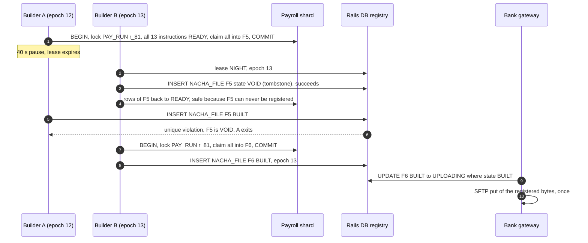

# Deep dive: exactly-once money movement

> One-line answer: exactly-once is three guarantees composed, each with its own arbiter: an instruction enters the ledger once (a deterministic id that includes the snapshot, under a unique index), an instruction enters at most one file (a whole run is claimed in one shard transaction under the run's lock, and a file id is registered **or** tombstoned by one insert on the registry's primary key, so a stale builder and an orphan sweep can never both win), and a file reaches the bank at most once (explicit states, `UNKNOWN` resolved by asking the bank, never a blind resend); reconciliation against the bank's acknowledgements and statements proves the result every night.

Zoom-in on [`../solution.md`](../solution.md) §4.3, §5.3 and §10.5, and [`../diagrams.md`](../diagrams.md) D5a and D8b. Acronyms: ACH (automated clearing house), ODFI (our originating bank), NACHA file (the fixed-width ACH file format), SFTP (SSH, Secure Shell, file transfer protocol), PT / ET (Pacific / Eastern time). Reusable blocks: [`../../../concepts/exactly-once.md`](../../../concepts/exactly-once.md), [`../../../concepts/leases-fencing-clocks.md`](../../../concepts/leases-fencing-clocks.md), [`../../../concepts/mvcc-and-isolation.md`](../../../concepts/mvcc-and-isolation.md), [`../../../concepts/distributed-transactions.md`](../../../concepts/distributed-transactions.md). Related problem: [`../../payments-ledger/`](../../payments-ledger/). Siblings: [`deadlines-and-ach-windows.md`](deadlines-and-ach-windows.md), [`funding-risk-and-returns.md`](funding-risk-and-returns.md).

---

## 1. Three guarantees, three arbiters

```mermaid
%% Where duplicates can enter on the money path and which single row decides each hop. The upload is red: it is the only hop that cannot be made idempotent, so it is at-most-once and reconciled.
flowchart LR
    SAGA[Pay run saga<br/>activity retries]:::service -->|"INSERT ON CONFLICT,<br/>id = H(run, snapshot, payee, purpose)"| LED[(Instruction ledger<br/>unique instruction_id)]:::store
    LED -->|"claim a whole run,<br/>run row locked"| FB[File builder<br/>lease, epoch e]:::service
    FB -->|"INSERT file_id BUILT"| REG[(Registry<br/>primary key file_id)]:::store
    SW[Orphan sweep<br/>new lease holder]:::service -->|"INSERT file_id VOID,<br/>then free rows"| REG
    REG -->|"BUILT to UPLOADING,<br/>conditional update"| GW["Bank gateway upload<br/>at-most-once"]:::critical
    GW -->|"SFTP put, same bytes only"| ODFI[ODFI bank]:::external
    ODFI -->|"ack: count and totals"| REC[Reconciliation<br/>ack = registry = ledger]:::service
    REC -->|"breaks page"| OPS[On-call]:::client
    classDef client   fill:#dbeafe,stroke:#2563eb,stroke-width:2px,color:#111
    classDef service  fill:#dcfce7,stroke:#16a34a,stroke-width:2px,color:#111
    classDef store    fill:#ede9fe,stroke:#7c3aed,stroke-width:2px,color:#111
    classDef critical fill:#fee2e2,stroke:#dc2626,stroke-width:4px,color:#111
    classDef external fill:#e5e7eb,stroke:#6b7280,stroke-width:2px,color:#111,stroke-dasharray:4 3
```



| Hop | Duplicate comes from | Arbiter (one row) | Lifetime |
|---|---|---|---|
| Saga to ledger | Activity retry, worker death | `instruction_id` unique index | 7 years |
| Ledger to file | Two builders, a crash mid-claim, a writer racing the claim | The `PAY_RUN` row lock (claim per run) and the registry primary key `file_id` | File lifetime |
| File to bank | Upload retry after a timeout | Registry state, conditional updates, `UNKNOWN` | 7 years |
| Bank to us | Re-delivered acknowledgement or return file | `BANK_EVENT (file sha256, line)` | 7 years |

The rule behind the table: **no step spans two databases atomically**, so each guarantee must be decided by one row in one database. The lease and its epoch reduce how often two builders run; they do not decide anything on their own.

## 2. Instruction ids, and the re-freeze trap

- **The id includes the snapshot.** `instruction_id = H(pay_run_id, snapshot_id, payee_ref, purpose, seq)`, inserted `ON CONFLICT DO NOTHING`; a conflicting id with a different amount stops the run and pages (solution §3.3, §4.3 step 1).
- **Why the snapshot is in it.** The first version was `H(pay_run_id, payee_ref, purpose, seq)`. A superseding tax release re-freezes runs still `READY` (solution §5.4), and the recalculated `NET_PAY` credits arrived with new amounts under the **same** ids, so every re-freeze would have hit the "different amount" page and stopped the run.
- **A re-freeze is one shard transaction under the run's lock:** require every old instruction `READY`, move them to `SUPERSEDED`, insert the new snapshot's set, re-check that the run balances, re-reserve exposure. Runs whose cut-off is under ~2 hours away, or with any instruction already claimed, keep their pinned release and get a catch-up line in the next run ([`gross-to-net-calc-and-tax-tables.md`](gross-to-net-calc-and-tax-tables.md) §4).
- **Repairs keep derived ids:** `H(original_id, REISSUE, n)`, `H(original_id, REVERSAL, n)`, `H(company, agency, period, due_date)` for tax deposits. A second click, a replayed return file or a re-run job collides on the unique index.
- **A second, short id for the bank.** The 128-bit id does not fit any ACH field. Each instruction also gets a 15-character `ach_ref` (2 characters of shard plus a 13-character per-shard sequence) written into the entry's Identification Number field, which comes back on a return (solution §3.3; [`funding-risk-and-returns.md`](funding-risk-and-returns.md) §3).

## 3. The first protocol, and where it raced

The first version of the file protocol, before the simulation below:

| Step (first version) | Database | What it did |
|---|---|---|
| Claim | Payroll shard | `UPDATE instruction SET state = 'CLAIMED', file_id = F ... WHERE window_id = W AND state = 'READY' ... LIMIT 50000 FOR UPDATE SKIP LOCKED` |
| Register | Rails DB | Insert `NACHA_FILE(F, BUILT)` "conditional on its lease epoch still being current" |
| Orphan sweep | Reads rails, writes shards | Rows `CLAIMED` under an older epoch, for a file that "never reached BUILT", go back to `READY` |
| Upload | Rails DB + SFTP | `BUILT → UPLOADING` conditional, one put, `UPLOADED`, wait for the acknowledgement |
| Cancel and other writers | Payroll shard | Allowed until the run's instructions are claimed by a file |

Three gaps the review pressed on, each now closed in the design:

1. **Claims were by row, not by run.** A run whose instructions straddled two 50,000-row chunks was claimed in two transactions, and `SKIP LOCKED` skipped any row another transaction held. Now a whole run is claimed in one transaction under its `PAY_RUN` lock (solution §4.3 step 3, §10.1).
2. **The sweep was check-then-act across two databases.** "Never reached BUILT" was read in the rails DB and the reset written in the shards. A builder whose epoch check was a moment stale (a separate read, or a READ COMMITTED snapshot taken before the new lease committed) could register in between. Now the sweep tombstones the file id first (solution §5.3, [`../diagrams.md`](../diagrams.md) D5a).
3. **The customer's cancel is protected by time, the other writers were not.** Claims start at the cut-off plus the 120 s grace, so a customer cancel cannot meet a claim. But a risk hold after a fresh R01, a tax re-freeze, a fraud pull by ops or a `VOID_BEFORE_FILE` correction could touch a run's `READY` rows mid-claim. Now every one of them takes the run lock.

## 4. All interleavings, in Python

Builder A holds epoch 12 and may pause or crash at any step. Builder B takes epoch 13 and runs two passes of sweep, claim and register. Writer P pulls the run (a hold or a re-freeze). One run has an employer debit and two credits. The program walks every interleaving, then lets the gateway upload every `BUILT` file and judges the result. **NAIVE** is the first protocol (§3). **FIXED** is the design in solution.md: claims and pulls are per run and all-or-nothing under the run's lock, and the sweep tombstones the file id before freeing rows. Builder A's stale epoch check is kept in both, on purpose: it shows the primary key, not the epoch, is what decides.

```python
"""All interleavings: builder A (epoch 12, may pause or crash), takeover builder B (epoch 13,
two sweep-claim-register passes), writer P pulling the run. Then every BUILT file uploads."""
from collections import Counter
RUN = ("debit", "cr1", "cr2")                       # one run: employer debit + 2 credits
def claim(s, ids, f, whole_run):
    if whole_run and any(s["rows"][i][0] != "READY" for i in RUN): return
    for i in ids:
        if s["rows"][i][0] == "READY": s["rows"][i] = ("CLAIMED", f)

def register(s, f, epoch, seen):                    # the epoch check may be stale (seen)
    if seen == epoch and f not in s["reg"]:         # file_id is the registry primary key
        s["reg"][f] = ("BUILT", frozenset(i for i, r in s["rows"].items() if r == ("CLAIMED", f)))

def sweep_check(s, fixed):                          # is A's file safe to treat as orphan?
    if fixed and "FA" not in s["reg"]: s["reg"]["FA"] = ("VOID", frozenset())  # tombstone
    s["loc"]["orphan"] = s["reg"].get("FA", ("NONE",))[0] in ("NONE", "VOID")

def sweep_reset(s):
    for i, r in s["rows"].items():
        if s["loc"]["orphan"] and r == ("CLAIMED", "FA"): s["rows"][i] = ("READY", None)

def pull(s, fixed, phase):                          # naive: check, then UPDATE ... WHERE READY
    if fixed or phase == "check": s["loc"]["ok"] = all(s["rows"][i][0] == "READY" for i in RUN)
    if (fixed or phase == "write") and s["loc"]["ok"]:
        s["pulled"] = True
        for i in RUN:
            if s["rows"][i][0] == "READY": s["rows"][i] = ("PULLED", None)

def programs(fixed):
    A = [("A claim debit,cr1", lambda s: claim(s, RUN if fixed else RUN[:2], "FA", fixed)),
         ("A claim cr2", lambda s: claim(s, () if fixed else RUN[2:], "FA", fixed)),
         ("A reads lease", lambda s: s["loc"].__setitem__("seen", s["lease"])),
         ("A registers FA", lambda s: register(s, "FA", 12, s["loc"]["seen"]))]
    B = [("B takes lease 13", lambda s: s.__setitem__("lease", 13))]
    for n, f in (("1", "FB"), ("2", "FB2")):
        B += [("B sweep check " + n, lambda s: sweep_check(s, fixed)),
              ("B sweep reset " + n, sweep_reset),
              ("B claims into " + f, lambda s, f=f: claim(s, RUN, f, fixed)),
              ("B registers " + f, lambda s, f=f: register(s, f, 13, s["lease"]))]
    P = [("P checks run", lambda s: pull(s, fixed, "check")),
         ("P pulls READY rows", lambda s: pull(s, fixed, "write"))]
    return {"A": A, "B": B, "P": P}

def freeze(s): return tuple(tuple(sorted(s[k].items())) if isinstance(s[k], dict) else s[k]
                            for k in ("pc", "rows", "reg", "lease", "loc", "pulled"))
def verdict(s):
    files = [m for st, m in s["reg"].values() if st == "BUILT" and m]       # gateway uploads
    paid = Counter(i for m in files for i in m)
    if any(c > 1 for c in paid.values()): return "DUPLICATE PAYMENT"
    gone = {i for i, r in s["rows"].items() if r[0] == "PULLED"}
    if paid and gone: return "PAID ROWS MARKED PULLED" if gone & set(paid) else "SPLIT RUN: some paid, rest pulled"
    if s["pulled"] and paid: return "PULL SAID OK, RUN PAID ANYWAY"
    return "ok"

def explore(fixed):
    progs, first = programs(fixed), {}
    def go(key, trace):
        s = {"pc": dict(key[0]), "rows": dict(key[1]), "reg": dict(key[2]), "lease": key[3],
             "loc": dict(key[4]), "pulled": key[5]}
        moves = [(a, n) for a, p in progs.items() if s["pc"][a] < len(p) for n in (0, 1)
                 if n == 0 or a == "A"]                                     # n == 1: A crashes
        if not moves:                                                       # all done: judge it
            v = verdict(s); first.setdefault(v, trace); return Counter({v: 1})
        out = Counter()
        for a, crash in moves:
            t = {k: (dict(v) if isinstance(v, dict) else v) for k, v in s.items()}
            name = "A crashes" if crash else progs[a][t["pc"][a]][0]
            if not crash: progs[a][t["pc"][a]][1](t)
            t["pc"][a] = len(progs[a]) if crash else t["pc"][a] + 1
            out += go(freeze(t), trace + (name,))
        return out
    start = {"pc": {"A": 0, "B": 0, "P": 0}, "rows": {i: ("READY", None) for i in RUN},
             "reg": {}, "lease": 12, "loc": {"seen": 0, "orphan": False, "ok": False}, "pulled": False}
    return go(freeze(start), ()), first

for fixed in (False, True):
    res, first = explore(fixed)
    print(("FIXED" if fixed else "NAIVE"), "interleavings:", sum(res.values()))
    for v, n in sorted(res.items(), key=lambda kv: -kv[1]):
        print(f"  {n:>9,}  {v}")
        if v != "ok": print("     e.g.", " > ".join(first[v]))
```

Real output:

```
NAIVE interleavings: 175120
    121,403  ok
     47,166  PULL SAID OK, RUN PAID ANYWAY
     e.g. A claim debit,cr1 > A claim cr2 > A reads lease > A crashes > B takes lease 13 > B sweep check 1 > B sweep reset 1 > P checks run > B claims into FB > B registers FB > B sweep check 2 > B sweep reset 2 > B claims into FB2 > B registers FB2 > P pulls READY rows
      6,447  SPLIT RUN: some paid, rest pulled
     e.g. A claim debit,cr1 > B takes lease 13 > B sweep check 1 > B sweep reset 1 > P checks run > A claim cr2 > A reads lease > A registers FA > B claims into FB > B registers FB > B sweep check 2 > B sweep reset 2 > P pulls READY rows > B claims into FB2 > B registers FB2
        102  DUPLICATE PAYMENT
     e.g. A claim debit,cr1 > A claim cr2 > A reads lease > B takes lease 13 > B sweep check 1 > A registers FA > B sweep reset 1 > B claims into FB > B registers FB > B sweep check 2 > B sweep reset 2 > B claims into FB2 > B registers FB2 > P checks run > P pulls READY rows
          2  PAID ROWS MARKED PULLED
     e.g. A claim debit,cr1 > A claim cr2 > A reads lease > B takes lease 13 > B sweep check 1 > A registers FA > B sweep reset 1 > P checks run > P pulls READY rows > B claims into FB > B registers FB > B sweep check 2 > B sweep reset 2 > B claims into FB2 > B registers FB2
FIXED interleavings: 175120
    175,120  ok
```

Reading the counterexamples:

- **Duplicate payment (102 interleavings).** A reads epoch 12. B takes 13 and its sweep sees no `FA` in the registry. A registers `FA` on its stale read. B frees `FA`'s rows and claims them into `FB`. Two registered files carry the same three entries: every employee in them is paid twice. At file scale that is up to 1 M entries, ~$1.2 B (solution §4.3).
- **Split run (6,447).** A, already fenced in spirit, claims `cr2` after B's first sweep. B claims the debit and `cr1` into `FB`. B's second sweep frees `cr2` and P pulls it. The employer is debited and one employee is not paid, while the run says "held".
- **Pull said OK, run paid anyway (47,166).** P saw "all `READY`", B claimed the run, and P's `UPDATE ... WHERE state = 'READY'` touched zero rows but reported success. The admin or risk analyst is told the run was stopped; the money leaves.
- **Fixed: 0 of 175,120.** With a stale epoch check still in place, the registry insert and the tombstone collide on one primary key, so exactly one of "A's file is real" and "A's file is void" can ever be true. These results are why the design reads as it does in solution §4.3 and §5.3.

## 5. The protocol as designed

The same order is drawn in [`../diagrams.md`](../diagrams.md) D5a.



- **Claims are per run.** One shard transaction locks the `PAY_RUN` row, requires all of the run's instructions `READY`, and claims all of them into one file. A builder "chunk" is N runs, not N rows. The 50k-employee run is a 50,000-row claim in one transaction, which Postgres handles in about a second `[estimate]`.
- **Every other writer takes the same lock and the same rule.** Hold, re-freeze, void and cancel lock the run row first and refuse with `409 IN_FILE` unless every instruction is `READY`; they check the affected row count, never trust a predicate.
- **The sweep tombstones first.** `INSERT NACHA_FILE(F, VOID)` on the primary key, and only if that insert wins are F's rows freed. The builder's registration is an insert on the same key. The epoch check stays as an early exit, not as the arbiter.
- **The sweep repeats** until the window's completeness check passes (§6), because a stale builder can still claim after the first pass. Rows claimed into a `VOID` file are always safe to free.
- **A new lease holder adopts or voids old `BUILT` files explicitly.** `BUILT → VOID` and `BUILT → UPLOADING` are both conditional updates on `state = 'BUILT'`, so exactly one wins. Files already in `UPLOADING`, `UNKNOWN` or later go to the ask-the-bank path, never to the sweep.

## 6. Invariants and the checks that catch a violation

| Invariant | Enforced by | Detected by, if code is wrong |
|---|---|---|
| I1. An instruction is in at most one registered file | Run lock on claim; registry primary key; tombstone sweep | Registry vs ledger join: an instruction id in two `BUILT`-or-later files pages before upload |
| I2. A run's instructions travel together | Claim per run, all-or-nothing | Per company batch totals equal the run's instructions (solution §5.7) |
| I3. Only registered files are uploaded | Gateway reads the registry row and moves it conditionally | File name and SHA-256 in the bank's acknowledgement must match a registry row |
| I4. Nothing approved is left behind | Repeated sweep | `count(instructions in window W, not cancelled) = Σ entry_count(registered files of W)` at T−30 min, pages (solution §5.1, §10.9) |
| I5. The bank got what we registered | Same bytes on every re-upload | Three-way totals: acknowledgement = registry = ledger, per file, within minutes |

I4 is the check that catches a stranded claim: without it, "employees not paid" can happen with no file ever in `UNKNOWN` and no countdown alert firing, because every registered file was acknowledged.

## 7. The upload: at-most-once, then ask

- **Exceptions become `UNKNOWN`, never "failed".** A failed connect sends no bytes and stays `BUILT`; a failure mid-put is `UNKNOWN` (solution §5.3, [`../diagrams.md`](../diagrams.md) D8b).
- **Ask in order:** remote listing, the acknowledgement (up to 20 min `[estimate]`), the bank's status API or portal, the ACH operations desk.
- **Re-upload only the same bytes, the same processing day.** Same name, same File ID Modifier, same SHA-256, only on a confirmed "not received" before the ODFI cut-off.
- **After the cut-off, nothing is re-sent that night.** The bank's answer is final only after FedACH's last future-dated deadline of the cycle (2:15 AM ET, [FedACH schedule](https://www.frbservices.org/resources/resource-centers/same-day-ach/fedach-processing-schedule.html)). Then, and only then, a "not received" sets the terminal **`NOT_RECEIVED`** state: the file's rows return to `READY` for the fallback window and are rebuilt with a new modifier and dates (solution §5.3, D6 and D8b). It is the one way a file that reached `UPLOADING` is ever rebuilt; the first version both forbade that rebuild and moved such runs to the fallback window, and this state is what makes both rules hold.
- **Files that never left are voided, not rebuilt in place.** If a bank is down past its cut-off, `BUILT` files go `BUILT → VOID` and their runs move to the fallback window (solution §10.4). Each company's files go to its home ODFI only; a file is never moved to the other bank.
- **The bank's own duplicate checks are a backstop.** The File ID Modifier exists "to allow for thorough duplicate file identification", and a trace number "uniquely identifies each entry within a batch and the file" ([ACH developer guide](https://achdevguide.nacha.org/ach-file-details)). An RDFI can return R24 (duplicate entry). We never plan on any of them.

## 8. What an interviewer pushes on

1. **"Leader election gives you one builder, so why fencing?"** A paused leader wakes up believing it still leads. Here even fencing is not enough: the arbiter must be a row both sides insert into.
2. **"Why not one global transaction across the 64 shards?"** Two-phase commit across 64 primaries at the cut-off couples every shard's availability to the night file. One registry row per file is the commit point (solution §10.6).
3. **"Can a cancel at 4:59:59 PM race the builder?"** Not the customer's cancel: claims begin at the cut-off plus 120 s. A risk hold or a re-freeze can, so they take the run lock.
4. **"The upload timed out. Retry with backoff?"** No. Mark `UNKNOWN` and ask. Backoff is the right reflex for idempotent calls only.
5. **"How do you know nothing was left behind?"** The window completeness check (I4), plus three-way totals.

## 9. Trade-offs

| Decision | Chose | Gave up |
|---|---|---|
| Claim granularity | Whole run, one transaction | Perfectly even file sizes; a 50k run is one big claim |
| Sweep arbiter | Tombstone insert on `file_id` | One more registry row per orphan |
| Upload retry | Same bytes, same day, only on a confirmed "not received" | Speed on a bad night; a human on the phone |
| After the cut-off | `NOT_RECEIVED` only after 2:15 AM ET | A few hours of waiting, absorbed by the 2-day ladder |
| Instruction id includes snapshot | Re-freeze without paging | Ids of superseded rows stay in the ledger forever |

## 10. Numbers to say out loud

- 175,120 interleavings of one run, two builders and one writer: 53,717 bad outcomes in the first protocol (102 double payments, 6,449 split or mislabelled runs, 47,166 false "stopped" answers), 0 in the design (run claims and a tombstone sweep).
- Lease 30 s, renewed every 10 s; acknowledgement wait 20 min `[estimate]`; final bank answer after 2:15 AM ET.
- At most 1 M entries a file, ~$1.2 B of credits a duplicate file, 36 File ID Modifiers a day.
- Dedup keys live as long as the record they protect: 7 years, not a payments API's 24 hours.
