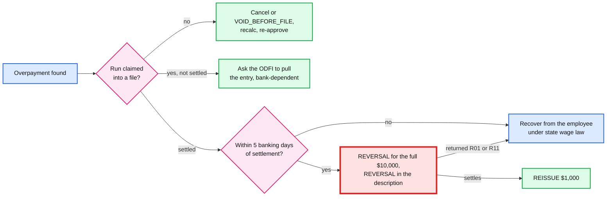

# Deep dive: funding risk and returns

> One-line answer: every 2-day or next-day run is a short loan to the employer (~$10 B outstanding in a peak week), so speed is priced by risk tier with per-company limits, a 4-day "debit first" speed counted in **banking** days and wire prefunding for big or held runs; every return is matched to its instruction by a reference we put in the entry's Identification Number field (it comes back on the return, while the original processing date does not, and a 7-digit trace repeats every processing day), and every repair is a new instruction (re-issue, reinitiation, reversal) inside Nacha's rules, never an edit and never a reversal to cover an employer's failure to fund.

Zoom-in on [`../solution.md`](../solution.md) §2 (credit exposure), §4.4, §5.6, Flow 4 and Flow 6. Acronyms: ACH (automated clearing house), ODFI / RDFI (originating / receiving bank), NSF (non-sufficient funds), NOC (notification of change), PPD / CCD (consumer / corporate entry classes), SEC code (standard entry class), PT / ET (Pacific / Eastern time). Reusable blocks: [`../../../concepts/exactly-once.md`](../../../concepts/exactly-once.md), [`../../../concepts/sharding.md`](../../../concepts/sharding.md). Related problems: [`../../payments-ledger/`](../../payments-ledger/), [`../../payments-risk-decisioning/`](../../payments-risk-decisioning/), [`../../bank-feed-aggregation/`](../../bank-feed-aggregation/) (verifying the employer's account). Siblings: [`deadlines-and-ach-windows.md`](deadlines-and-ach-windows.md), [`exactly-once-money-movement.md`](exactly-once-money-movement.md).

---

## 1. The loan we make every week

- **Size.** On a peak week ~$10 B of employer debits can still be returned while the employees' credits are already spendable (solution §2). If 0.05% of runs come back R01 `[estimate]`, that is ~300 runs × ~$16.8k = ~$5 M a week to collect; if a tenth is never recovered `[estimate]`, ~$0.5 M a week, ~$26 M a year: larger than the whole infrastructure bill (solution §8).
- **Window.** A debit can be returned R01 (insufficient funds) until the opening of business on the 2nd banking day after it settles (solution §2). For a 2-day run that is Thursday's debit, returnable until Monday morning, while the credits settled Friday at 8:30 AM ET.
- **Levers.** Tiers (`NEW`, `STANDARD`, `TRUSTED`, `HOLD`), a per-company payroll limit and exposure cap checked inside the approval transaction, the 4-day speed for `NEW`, wire prefunding for `HOLD` and every big tenant, account verification, and a check against each ODFI's origination limit (solution §5.6).
- **4-day is 4 banking days.** The cut-off is `payday − 4 banking days` (solution §5.6). "Approve Monday", the first version, fails in the week of Veterans Day (Wednesday 11 November 2026): a Monday approval leaves the debit returnable until Friday 13 November at the opening of business, after the credits left on Thursday night. The cut-off that week is Friday 6 November ([`deadlines-and-ach-windows.md`](deadlines-and-ach-windows.md) §3).

## 2. Return windows that set our timers

| Return | Who | Window | Source |
|---|---|---|---|
| R01, R02, R03, R04 and other administrative returns | Any entry | Opening of business on the 2nd banking day after settlement | Nacha rules as summarized by [Increase](https://increase.com/documentation/ach-returns): "ACH debits can be returned within two business days for commercial accounts" |
| Unauthorized consumer debit (R05, R07, R10, R11) | Our debits to **employees** (reversals) | 60 calendar days | [Increase](https://increase.com/documentation/ach-returns) |
| Improper reversal, consumer account | R11 | "by the opening of business on the banking day following the 60th calendar day" | [Nacha reversals rule](https://www.nacha.org/rules/reversals-and-enforcement) |
| Improper reversal, non-consumer account | R17 | 2nd banking day after settlement | [Nacha reversals rule](https://www.nacha.org/rules/reversals-and-enforcement) |
| Late return with the ODFI's consent | R31 (CCD and CTX corporate entries), R06 | After the window, if we agree | [Increase](https://increase.com/documentation/ach-returns), moov-io [return codes](https://github.com/moov-io/ach/blob/master/docs/returns.md) |
| Reinitiation after R01 or R09 | Our employer debit | At most 2 more times, within 180 days of the original settlement | [Increase](https://increase.com/documentation/ach-returns) |

- **Consequence 1: `CLOSED` is not final.** The saga closes a run and releases exposure when the 2-day window ends (solution §4.4 step 5). An employer can still send a late return through its bank, and we may accept it as R31 or R06. A late return re-opens the amount as a receivable on a `CLOSED` run: the pay run lifecycle has a `Closed → InCollections` edge and the instruction lifecycle a `Closed → Returned` edge (solution §4.4, [`../diagrams.md`](../diagrams.md) D8a).
- **Consequence 2: our debits to employees live 60 days.** Every reversal is a PPD debit to a consumer account and can come back R11 for two months. Return matching must work across a 60-day horizon.

## 3. Matching a return to its instruction

```mermaid
%% Two ways to find the instruction a return belongs to. The green path is the design: decode our own reference. The red path was the first design and is now only a fallback: a central index keyed by a trace that repeats every processing day and a processing date the return does not carry.
flowchart LR
    RF[Return file<br/>from the ODFI]:::external -->|"parse, store raw,<br/>BANK_EVENT by sha and line"| RS[Returns service]:::service
    RS -->|"original trace +<br/>guessed processing date"| TI["Central trace index<br/>(trace, processing_date)"]:::critical
    RS -->|"ach_ref from the<br/>Identification Number"| DEC[Decode ref<br/>shard + sequence]:::service
    DEC -->|"one keyed read"| SH[(Payroll shard<br/>instruction by ach_ref)]:::store
    SH -->|"verify trace, amount,<br/>account token"| OK{All three match?}:::decision
    OK -->|"yes"| ACT[RETURNED, journal,<br/>reissue or collections]:::service
    OK -->|"no"| Q[Manual queue,<br/>page if over 0.1%]:::client
    TI -.->|"fallback only"| OK
    classDef client   fill:#dbeafe,stroke:#2563eb,stroke-width:2px,color:#111
    classDef service  fill:#dcfce7,stroke:#16a34a,stroke-width:2px,color:#111
    classDef store    fill:#ede9fe,stroke:#7c3aed,stroke-width:2px,color:#111
    classDef critical fill:#fee2e2,stroke:#dc2626,stroke-width:4px,color:#111
    classDef decision fill:#fce7f3,stroke:#db2777,stroke-width:2px,color:#111
    classDef external fill:#e5e7eb,stroke:#6b7280,stroke-width:2px,color:#111,stroke-dasharray:4 3
```



**What a return carries back.** moov-io's ACH library, summarizing Nacha's Appendix Four: "When a Return Entry is prepared, the original Company/Batch Header Record, the original Entry Detail Record, and the Company/Batch Control Record are copied for return to the Originator. The Return Entry is a new Entry. These Entries must be assigned new batch and trace numbers" ([addenda99.go](https://github.com/moov-io/ach/blob/master/addenda99.go)). The return addenda (type 99) adds the return reason code, the 15-digit Original Entry Trace Number, a date of death (R14, R15 only), the original RDFI id and 44 characters of addenda information. **Nothing in it is the original processing or settlement date.** I could not open Nacha's rule text itself, so this rests on that summary, and the design carries the same tag: `[verify with the ODFI's return file spec]`.

**Why the trace alone fails.** A trace number is the ODFI's 8-digit routing prefix plus a 7-digit sequence, "assigned ... in ascending sequence" and unique "within a batch and the file" ([ACH developer guide](https://achdevguide.nacha.org/ach-file-details)). The design keeps it unique per file, and per processing day only to help the fallback index (solution §10.3). At ~1.6 M entries a banking day on average and ~3.5 M per bank on the peak day (two ODFIs, ~35% of the 10 M sequence space each), every low sequence number is reused every processing day. Increase, a bank, says the same thing: traces have "only seven digits of entropy ... it's usually not possible to uniquely rely on trace numbers for reconciling returns" ([Increase](https://increase.com/documentation/ach-returns)). The first design keyed its index on `(trace_number, processing_date)`, and the return does not carry the second half.

**The design** (solution §3.3, §4.4). Every instruction gets `ach_ref`: 2 base-36 characters of logical shard plus a 13-character per-shard sequence (36^13 is above 2^64), assigned once when the instruction row is inserted and written into positions 40 to 54 of the entry (Identification Number, 15 characters, optional, "to identify the transaction to the Receiver"). The return copies the entry, so the ref comes back. The returns service decodes the shard, reads one row, and verifies trace, amount and account token. The central trace index stays as a fallback for a bank that mangles the field.

A simulation, Python 3 standard library, seeded:

```python
"""Match returns to instructions. Traces restart at 1 every processing day (unique per day),
assigned in (company, instruction) order. A return carries the original trace, amount,
account and Identification Number, but not the original processing date."""
import random
from collections import defaultdict
rng = random.Random(29)
COS, EMP, WEEKS, ODFI = 1500, 10, 9, "09100001"
people = [(c, e) for c in range(COS) for e in range(EMP)]
salaried = {p: rng.random() < 0.6 for p in people}                 # [estimate]
pay = {p: rng.randrange(60_000, 250_000) for p in people}          # net cents

entries, by_trace = [], defaultdict(list)
for w in range(WEEKS):
    day, seq = 7 * w, 0                                            # one processing day a week
    for c in range(COS):
        if rng.random() < 0.005: continue                          # a few companies skip a week
        for e in range(EMP):
            seq += 1
            p = (c, e)
            cents = pay[p] if salaried[p] else pay[p] + rng.randrange(-3000, 3000)
            ref = f"{c % 64:02d}{len(entries):013d}"               # shard + per-shard id, 15 chars
            x = {"day": day, "trace": f"{ODFI}{seq:07d}", "cents": cents, "acct": p, "ref": ref}
            entries.append(x); by_trace[x["trace"]].append(x)

def candidates(r, key, horizon):
    if key == "ref":                                               # decode shard, one lookup
        return [x for x in by_trace[r["trace"]] if x["ref"] == r["ref"]]
    pool = [x for x in by_trace[r["trace"]] if 0 < r["arrive"] - x["day"] <= horizon]
    if key == "trace": return pool
    return [x for x in pool if (x["cents"], x["acct"]) == (r["cents"], r["acct"])]

returns = []
for x in rng.sample([x for x in entries if x["day"] >= 7 * 2], 3000):
    late = rng.random() < 0.10                                     # R11 on a reversal, R06, R31
    lag = rng.randrange(8, 61) if late else rng.choice((1, 2))    # [estimate] mix
    returns.append(dict(x, arrive=x["day"] + lag, late=late))

for key, horizon, label in (("trace", 60, "trace only, 60-day search"),
                            ("trace+amt+acct", 60, "trace + amount + account, 60-day search"),
                            ("trace+amt+acct", None, "same, horizon by return code (3 or 60 days)"),
                            ("ref", None, "our ref in Identification Number")):
    amb = wrong = 0
    for r in returns:
        h = horizon or (60 if r["late"] else 3)
        c = candidates(r, key, h)
        amb += len(c) != 1
        wrong += bool(c) and max(c, key=lambda x: x["day"])["ref"] != r["ref"]
    print(f"{label:46} ambiguous {amb / len(returns):6.1%}   newest candidate is wrong {wrong / len(returns):5.1%}")

stable = sum(1 for x in entries if x["day"] == 56 and any(
    y["acct"] == x["acct"] for y in by_trace[x["trace"]] if y["day"] == 49))
print(f"credits on day 56 that reuse the same person's trace from day 49: {stable} of {COS * EMP}")
```

Real output:

```
trace only, 60-day search                      ambiguous  99.8%   newest candidate is wrong  8.3%
trace + amount + account, 60-day search        ambiguous  39.8%   newest candidate is wrong  2.2%
same, horizon by return code (3 or 60 days)    ambiguous   3.5%   newest candidate is wrong  2.2%
our ref in Identification Number               ambiguous   0.0%   newest candidate is wrong  0.0%
credits on day 56 that reuse the same person's trace from day 49: 6440 of 15000
```

- **Deterministic ordering makes it worse.** Traces assigned in `(company_id, instruction_id)` order from 1 each day give ~43% of people the **same** trace two weeks running (6,440 of 15,000). A salaried employee then has the same trace, amount and account every week.
- **The best trace-based key still misfiles, which is why the design does not use one.** With the horizon set by the return code, 3.5% of returns are ambiguous and 2.2% are silently matched to the wrong week's entry by "pick the newest". Almost all of them are the late class (R11 on a reversal, R06, R31): about one in five of those would be misfiled.
- **The ref removes the central dependency too.** A return no longer needs the rails DB to find its tenant; the shard is in the ref. Monday's 7 AM ET return file keeps flowing during a rails DB failover.

## 4. Repairs, one return code at a time

| Event | Instruction effect | Journal | Next step |
|---|---|---|---|
| R03 / R02 / R04 on `NET_PAY` | `RETURNED` | Dr settlement bank, Cr net pay payable | Employee fixes the account (step-up MFA); `REISSUE` with id `H(original, REISSUE, 1)` joins the next window, same-day window 1 if before 10:30 AM ET |
| NOC on a credit | None, no money moves | None | Update the account token for the next run; tonight's already-claimed entry still uses the old one |
| R01 / R09 on `EMPLOYER_DEBIT` | `RETURNED` | Dr employer receivable, Cr settlement bank | Tier to `HOLD`; reinitiate at most twice within 180 days once funds are confirmed, or take a wire |
| R29 on `EMPLOYER_DEBIT` (unauthorized corporate debit) | `RETURNED` | Same as R01 | Account-takeover playbook: freeze the company, no reinitiation |
| Late R31 / R06 after `CLOSED` | `RETURNED` on a closed run | Receivable re-opened | Collections; exposure model counts late returns as a loss rate |
| R11 or R17 on our reversal | Reversal `RETURNED` | Receivable from the employee stays | No more ACH remedy; employer and employee settle it |

- **An employer NSF is never a reason to reverse employees.** Nacha: a reversal is improper if sent "due to the failure of an Originator or any Third-Party Sender to provide funding for the original entry", and RDFIs may return improper reversals (R11 consumer, 60 days; R17 non-consumer, 2 days). A willful or reckless violation involving at least 500 entries or $500k is "egregious", and a Class 3 sanction can reach $500,000 per occurrence plus suspension of the third-party sender ([Nacha](https://www.nacha.org/rules/reversals-and-enforcement)). Reversing a 500-employee run on an NSF is exactly that shape.
- **When a whole cohort returns R01.** A Monday with 10x the usual employer returns (a bank-wide event, a fraud ring) pages risk on-call at 0.1% of the night's debits (solution §10.9). The per-bank check against each ODFI's limit (solution §5.6) is what keeps one bad week from becoming a bank holding our files.

## 5. "One employee was paid $10,000 instead of $1,000"



- **The rules of a reversal** ([Nacha](https://www.nacha.org/rules/reversals-and-enforcement)). Permitted only for an erroneous entry: a duplicate, the wrong receiver, the wrong dollar amount, a debit earlier or a credit later than intended, or "certain PPD credits related to termination/separation from employment". It must reach the RDFI "within 5 banking days following the Settlement Date", carry "REVERSAL" in the Company Entry Description, and keep the original's Company ID, SEC code and **amount** identical. So the full $10,000 is reversed and $1,000 re-issued; a $9,000 "partial reversal" does not exist.
- **The paid-by-mistake terminated employee is a permitted reason.** Auto-payroll paid someone fired last week: a reversal is allowed, inside the same 5 banking days.
- **Sequencing** (solution Flow 6). The reversal goes in Friday's night file; the $1,000 re-issue waits in `CREATED` until the reversal settles (Monday) and its 2-banking-day return window passes, then rides Wednesday night's file. Sent together, as the first version did, a returned reversal (the employee spent the money, R01) leaves the employee holding $11,000 and owing $10,000; sequenced, the loss is capped at the $9,000 overpayment. The cost is the $1,000 arriving ~3 banking days later, and no wages are late because the employee was overpaid on payday. An R11 dispute can still come up to 60 days later, so the re-issue does not wait for that.
- **Notify first, and mind the law.** The receiver must be told of a reversal by its settlement date (Nacha). Some states restrict how an employer may recover overpaid wages `[unverified: varies by state]`; product and legal own that policy, the engine owns the ledger.
- **Tax effects.** The corrected paycheck changes the run's tax liabilities. If the deposit already went (a semiweekly depositor's Wednesday), the next deposit is reduced; across a quarter boundary it is a 941-X adjustment `[estimate]`. The journal reverses the original postings and books the corrected ones.

## 6. The exposure ledger, end to end

| Event | `COMPANY_FUNDING.open_exposure_cents` | Where it happens |
|---|---|---|
| Approve run (non-wire) | `+ debit` | The approval transaction, with `FOR UPDATE` on the funding row (solution §4.1) |
| Run cancelled or superseded before the file | `− old debit (+ new debit)` | The same shard transaction that cancels or re-freezes, under the run lock |
| Debit's return window closes | `− debit` | The saga's timer, after "opening of business on the 2nd banking day" plus a buffer for the bank's file timing |
| R01 on the debit | Moves from exposure to a receivable; tier `HOLD` | Returns service, one transaction |
| Wire received for a prefunded run | No exposure at all | Credits are released only when the wire shows on the bank's intraday report |
| Late return (R31, R06) after `CLOSED` | Receivable re-opened | Returns service; counted in the loss model |

- **Reconcile it daily** `[decision]`. `open_exposure_cents` must equal the sum of debits that are approved, not returned and inside their return window, per company. A drift means a missed timer or a double release; it pages the risk on-call, not the payroll on-call.
- **Platform exposure, per bank.** Each company is homed at one of two ODFIs (a sticky `home_bank`, flipped only between pay cycles), so the sum over companies for a window is checked against **each** ODFI's origination limit before upload, with a page at 80% (solution §5.6, §10.3). On the design-peak night that is ~$10 B, about half per bank, against limits we do not set `[unknown]`.

**What pages at 3 AM for returns.** Return files land early in the morning ET (solution §8). The pages: employer-debit returns above 0.1% of the night's debits; any return that matches no instruction or more than one (with `ach_ref` this should be zero, so any is a bug or a bank mangling the field); a reversal returned R11 or R17 (a human must review every one); and the exposure reconciliation drift above.

## 7. What an interviewer pushes on

1. **"R01 two days after employees were paid. Who eats it?"** We do first: the employees keep their pay, the employer owes us, collections and the service agreement recover it. Tiers and limits keep it to ~$0.5 M a week.
2. **"Why not reverse the employees' credits?"** Improper under Nacha when the cause is a failure to fund, returnable by RDFIs, and an enforcement risk at 500 entries.
3. **"A return names trace 0910000100000042. Which instruction?"** Not knowable from the trace alone: it repeats every processing day. Decode our ref from the Identification Number, then verify trace, amount and account.
4. **"$10,000 instead of $1,000. By when?"** Before the file: cancel. After it: a full-amount reversal within 5 banking days of settlement, then the $1,000. After that: no ACH remedy.
5. **"How do you stop a fake employer?"** `NEW` tier, 4-day speed in banking days, account verification, velocity rules; a changed funding account resets the tier (solution §5.6).

## 8. Trade-offs

| Decision | Chose | Gave up |
|---|---|---|
| Speed by risk tier | Bounded exposure per company | A slower first 90 days for new customers |
| 4-day in banking days | No overlap even in holiday weeks | Some approvals move a day earlier |
| `ach_ref` in Identification Number | Exact return matching, no central index on the hot path | The field can no longer show the employee number on bank statements |
| Re-issue after the reversal settles | Caps an overpayment loss at the overpayment | The corrected $1,000 arrives ~3 banking days later |
| Accept late returns (R31) case by case | Customer goodwill, fewer disputes | `CLOSED` runs can re-open |

## 9. Numbers to say out loud

- ~$10 B exposed in a peak week; ~$5 M a week to collect at 0.05% R01; ~$0.5 M a week lost.
- Returns: 2 banking days for R01 to R04; 60 days for consumer unauthorized and R11; reinitiate R01 or R09 at most twice within 180 days.
- Reversal: within 5 banking days, identical amount, Company ID and SEC code, "REVERSAL" in the description.
- Trace: 8 + 7 digits, unique per file by rule, per day only for the fallback index; ~43% of people get the same trace next week with deterministic ordering; 2.2% of returns misfiled by the best trace-based key, 0% with our ref.
