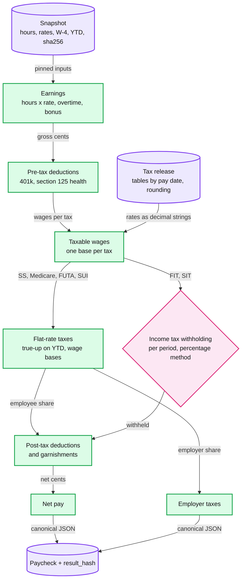
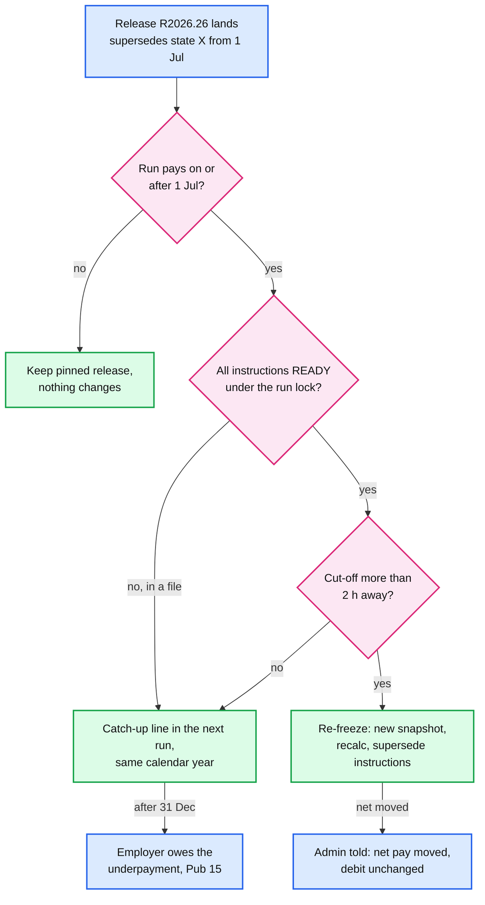

# Deep dive: gross-to-net calc and tax tables

> One-line answer: a paycheck is `calc(snapshot, tax release, engine version)`, a pure function in integer cents with decimal rates, one rounding per line and stable ordering, so a retry, a replay or an auditor six years later gets the same `result_hash`; flat-rate taxes (Social Security, Medicare, unemployment) are trued up on year-to-date wages against their wage bases, while income tax withholding is computed per period and needs an explicit catch-up line when a table change is missed; a release is immutable and picks its tables by pay date, a superseding release re-freezes only runs that are still `READY` and far enough from their cut-off, and an engine change ships only after a replay of last quarter's ~82 M paychecks shows every diff inside its declared intent.

Zoom-in on [`../solution.md`](../solution.md) §3.3, §4.2 and §5.4. Acronyms: YTD (year to date), SS (Social Security), FICA (Social Security plus Medicare), FUTA / SUI (federal / state unemployment tax), FIT / SIT (federal / state income tax withholding), IRS (Internal Revenue Service), W-4 (the employee's withholding certificate), PT (Pacific time). Reusable blocks: [`../../../concepts/exactly-once.md`](../../../concepts/exactly-once.md) (idempotent upserts), [`../../../concepts/temporal-durable-execution.md`](../../../concepts/temporal-durable-execution.md) (deterministic replay is the same idea one level up). Related: [`../../expense-rules-engine/deep-dives/audit-replay-and-determinism.md`](../../expense-rules-engine/deep-dives/audit-replay-and-determinism.md). Siblings: [`exactly-once-money-movement.md`](exactly-once-money-movement.md), [`multi-tenant-batch-and-retries.md`](multi-tenant-batch-and-retries.md).

---

## 1. The pipeline, and where each input comes from



- **The order is fixed in the engine version, not the data.** Pre-tax before taxable wages, taxes before garnishments, because a garnishment limit is a share of disposable pay after taxes `[unverified per state]`.
- **Every tax has its own wage base.** A section 125 health premium leaves FIT, FICA and FUTA wages but a 401k deferral leaves only FIT wages `[estimate: the release encodes which deduction reduces which base]`. That table belongs in the release, not in code.
- **The release is content, the engine is code.** A tax content team ships releases without an engine deploy, and the engine team ships without touching content (solution §8).

## 2. The determinism contract

| Banned inside `calc` | Why | What replaces it |
|---|---|---|
| The wall clock | "Today" changes between preview and retry | The pay date and period in the snapshot |
| Floats | `0.1 + 0.2 != 0.3` | `int64` cents; rates as decimal strings; `Decimal` products |
| Rounding more than once per line | Overtime $23.15 × 1.5 = $34.725: round the rate first and 10 h is $347.30, round once and it is $347.25 (solution §5.4) | Round once, at the line, by the release's rule |
| Dict, set or map iteration order | Two processes, two orders, two hashes | Sort by employee id; canonical JSON with sorted keys |
| Network calls, live tables | A vendor table changes between preview and calc | Releases are content-addressed and cached forever |
| Locale and time zones | A comma decimal separator, a DST-shifted "date" | ASCII parsing; dates as ISO strings from the snapshot |

- **Enforced three ways.** A lint rule for the banned calls; CI runs every golden snapshot twice in separate processes with shuffled input order and compares hashes; production treats a different `result_hash` for the same key as a determinism bug that pages (solution §4.2 step 5).
- **The hash covers what was paid, not how.** `result_hash = SHA-256(canonical JSON of the paycheck lines + release id + engine version)`. A refactor that keeps every cent keeps every hash.

## 3. Money math that survives a year

- **Flat-rate taxes are trued up on YTD.** `this_period = round(rate × min(YTD_wages + gross, wage_base)) − YTD_withheld`. Rounding error never accumulates: the year's total is always `round(rate × capped YTD)`.
- **Wage bases and thresholds (2026, IRS Pub 15).** Social Security 6.2% each up to $184,500; Medicare 1.45% each, no base; Additional Medicare 0.9% withheld "from wages you pay to an employee in excess of $200,000 in a calendar year"; FUTA 6.0% on "the first $7,000 you pay to each employee" (0.6% effective after the state credit, solution §3.3) ([Pub 15](https://www.irs.gov/publications/p15)).
- **Income tax withholding is not a true-up.** FIT uses the Percentage Method or Wage Bracket Method tables (Pub 15-T, referenced from Pub 15): annualize this period's wages, apply the annual table and the W-4, divide by periods. Most states with an income tax use a similar method `[estimate]`. A missed or late table change is **not** corrected by the next run's formula. The design first trued up "every tax" on YTD and counted on the next run to fix runs already in a file; that holds for flat-rate taxes only (line 5 of the output below), so withholding gets an explicit **catch-up line** instead (solution §4.2 step 4, §5.4).
- **The catch-up line has a deadline.** Pub 15: "Underwithheld income tax and Additional Medicare Tax must be recovered from the employee on or before the last day of the calendar year", and "you're the one who owes the underpayment". A table change missed in the year's last run cannot be caught up from the employee at all.

## 4. Tax releases and the mid-quarter table change

- **A release is immutable, signed and content-addressed.** It holds every jurisdiction's full table history, each row with `effective_from` by **pay date** (the date wages are paid, which is what the withholding rules key on).
- **The snapshot pins the release the admin previewed.** Inside it, the pay date picks the row. Run `r_95`, approved 25 June 2026 for a Thursday 2 July pay date, pinned release R2026.25, which has no 1 July row yet.
- **A superseding release lands Friday 26 June** with the new state row from 1 July, marked `supersedes: state X, pay dates from 2026-07-01`. What happens to each affected run:



- **A cut-off margin.** Re-freezing thousands of runs at 4:55 PM PT would compete with the approval minute and the calc barrier, so runs within ~2 hours of their cut-off keep the pinned release and get a catch-up line (solution §5.4). The 2 hours is a knob, not a law.
- **The instruction id includes the snapshot.** Re-freezing changes `NET_PAY` and `TAX_LIABILITY` amounts. The first id, `H(pay_run_id, payee_ref, purpose, seq)`, made the new amounts collide with the old ids and page. With `snapshot_id` in the hash (solution §3.3), the re-freeze is one shard transaction under the run lock: old rows `SUPERSEDED`, new rows `READY` ([`exactly-once-money-movement.md`](exactly-once-money-movement.md) §2).
- **A withholding change does not move the employer debit.** It moves money from net pay to the tax liability, so the admin is told net pay moved; the debit moves only for an employer-side change such as a SUI rate (solution §5.4, and line 4 of the output below).
- **Proof.** The snapshot names the release; the release is immutable; a replay reproduces the stored `result_hash`; the release's `supersedes` record and the run's re-freeze event say which runs moved and why.

## 5. The engine, runnable

Python 3, standard library only, no randomness except a seeded generator for the 12 employees.

```python
"""A pure gross-to-net engine: integer cents in, integer cents out, decimal rates from an
immutable release, one rounding per line, YTD true-up for flat-rate taxes, tables by pay date."""
import hashlib, json, random
from decimal import Decimal as D, ROUND_HALF_UP

R_OLD = {"id": "R2026.25", "ss": ("0.062", 18450000),       # 2026 wage base $184,500 (Pub 15)
         "state": [("2026-01-01", "0.0400", 1000000)]}       # (effective_from, rate, annual allowance)
R_NEW = dict(R_OLD, id="R2026.26", state=R_OLD["state"] + [("2026-07-01", "0.0450", 1000000)])

def rnd(x): return int(x.quantize(D(1), rounding=ROUND_HALF_UP))     # cents, half-up, once

def calc(snap, rel):
    out = []
    for e in sorted(snap["employees"], key=lambda e: e["id"]):       # never dict or set order
        gross = e["gross"]
        rate, base = rel["ss"]
        ytd_w = min(e["ytd_ss_wages"] + gross, base)                 # capped at the wage base
        ss = rnd(D(rate) * ytd_w) - e["ytd_ss_withheld"]             # true-up, not per period
        _, srate, allow = max(t for t in rel["state"] if t[0] <= snap["pay_date"])  # by pay date
        annual = max(gross * snap["periods"] - allow, 0)             # percentage method
        st = rnd(D(srate) * annual / snap["periods"])                # NOT a YTD true-up
        out.append({"id": e["id"], "gross": gross, "ss": ss, "state": st, "net": gross - ss - st})
    body = json.dumps({"release": rel["id"], "engine": "3.18", "paychecks": out}, sort_keys=True)
    return out, hashlib.sha256(body.encode()).hexdigest()[:12]

# 1. YTD true-up vs rounding each period: $868.88 a week for 52 weeks
ytd_w = ytd_ss = naive = 0
weeks_up = []
for wk in range(1, 53):
    p, _ = calc({"pay_date": "2026-03-06", "periods": 52, "employees": [
        {"id": "e1", "gross": 86888, "ytd_ss_wages": ytd_w, "ytd_ss_withheld": ytd_ss}]}, R_OLD)
    naive += rnd(D("0.062") * 86888)
    if p[0]["ss"] != 5387: weeks_up.append(wk)
    ytd_w, ytd_ss = ytd_w + 86888, ytd_ss + p[0]["ss"]
print(f"SS for the year: true-up {ytd_ss / 100:.2f}, per-period rounding {naive / 100:.2f}, "
      f"6.2% of {ytd_w / 100:.2f} = {rnd(D('0.062') * ytd_w) / 100:.2f}; 5388-cent weeks: {weeks_up}")

# 2. Crossing the wage base: $10,000 a week, YTD wages $180,000
p, _ = calc({"pay_date": "2026-11-06", "periods": 52, "employees": [
    {"id": "e2", "gross": 1000000, "ytd_ss_wages": 18000000, "ytd_ss_withheld": 1116000}]}, R_OLD)
print(f"wage-base week: SS {p[0]['ss'] / 100:.2f} (only {4500:,} dollars left under the base); "
      f"year total {(1116000 + p[0]['ss']) / 100:.2f} = 6.2% of 184,500")

# 3. A state table effective for pay dates from 1 July; run r_95 pays on 2 July
rng = random.Random(95)
emps = [{"id": f"e{i:02d}", "gross": rng.randrange(150000, 400000), "ytd_ss_wages": 0,
         "ytd_ss_withheld": 0} for i in range(12)]
snap = {"pay_date": "2026-07-02", "periods": 26, "employees": emps}
old, h_old = calc(snap, R_OLD)
new, h_new = calc(snap, R_NEW)
again, h_again = calc(dict(snap, employees=list(reversed(emps))), R_OLD)
diff = sum(n["state"] - o["state"] for o, n in zip(old, new))
debit = lambda ps: sum(p["net"] + p["ss"] + p["state"] for p in ps)   # + employer taxes, same
net_moved = sum(o["net"] - n["net"] for o, n in zip(old, new))
print(f"r_95 pinned to {R_OLD['id']}: hash {h_old}, replay in reverse order {h_again}, equal {h_old == h_again}")
print(f"re-frozen on {R_NEW['id']}: hash {h_new}, state withholding +{diff / 100:.2f}, net pay "
      f"-{net_moved / 100:.2f}, debit {debit(old) / 100:.2f} -> {debit(new) / 100:.2f}")
missed = sum(n["state"] - o["state"] for o, n in zip(old, new) if o["id"] == "e00")
print(f"if r_95 had already left: e00 is under-withheld {missed / 100:.2f}; the bracket formula does not "
      f"self-correct, so the next run needs an explicit catch-up line of {missed / 100:.2f}")
```

Real output:

```
SS for the year: true-up 2801.27, per-period rounding 2801.24, 6.2% of 45181.76 = 2801.27; 5388-cent weeks: [9, 27, 45]
wage-base week: SS 279.00 (only 4,500 dollars left under the base); year total 11439.00 = 6.2% of 184,500
r_95 pinned to R2026.25: hash 9a52181841bb, replay in reverse order 9a52181841bb, equal True
re-frozen on R2026.26: hash a833ee86c040, state withholding +162.10, net pay -162.10, debit 37039.06 -> 37039.06
if r_95 had already left: e00 is under-withheld 15.54; the bracket formula does not self-correct, so the next run needs an explicit catch-up line of 15.54
```

- **Line 1** reproduces solution §4.2 and §5.4: the true-up ends the year at exactly $2,801.27 by withholding one extra cent in weeks 9, 27 and 45; rounding per period ends at $2,801.24.
- **Line 2** is the wage-base crossing: $279.00 in the crossing week, then zero, and the year totals exactly 6.2% × $184,500 = $11,439.00.
- **Line 3** is reproducibility: reversing the input order changes nothing, because the engine sorts and hashes canonically.
- **Line 4** is the re-freeze: withholding up $162.10 for 12 people, net pay down by the same amount, debit unchanged. The hash changes, so the run gets a new snapshot and new instructions.
- **Line 5** is why "the next run's true-up fixes it" is wrong for withholding: e00's $15.54 never comes back unless a catch-up line asks for it.

## 6. Testing an engine change before it computes 10 M paychecks

| Gate | What runs | Cost | Blocks on |
|---|---|---|---|
| Golden replay | Last quarter, `330 M ÷ 4 = ~82 M` paychecks on their own snapshots and releases | `82 M × 10 ms = ~825k core-seconds`, ~2.3 h on 100 cores (solution §5.4) | Any diff outside the change's declared intent ("only SIT lines in state X for pay dates from 1 July") |
| Property tests | Generated snapshots | Minutes | `net + Σ employee taxes + Σ deductions = gross`; the run balances; no negative net without an explicit rule |
| Year-boundary suite | Wage-base crossings, 31 December pay dates moved from 1 January, quarter-spanning runs | Minutes | Any change to a year total |
| Shadow | Both versions on live approvals for one pay cycle; pay with the old one | ~2x calc for 2 weeks | Unexplained diffs |
| Cohorts | 1%, 10%, 50%, 100% of tenants over 4 weeks | Calendar time | A determinism page or a support spike |

- **Rollback is a pointer.** The engine version is pinned per snapshot, so a rollback changes only new approvals. Every old run still replays on the version that paid it (workers keep the last 3 versions loaded, solution §4.2).
- **Declared intent is the key idea.** "Some diffs are expected" is not a gate. "Diffs only in these line types, these jurisdictions, these pay dates" is.

## 7. Ordering, holidays and year ends

- **Two runs in flight for one employee.** Approval order defines YTD order: the later snapshot records `prior_run_ids` and its calc waits for them (solution §3.3). If the earlier run is then **cancelled**, the later run's YTD is wrong. Its saga must re-freeze it if it is still `READY`, or carry a catch-up line if not `[decision]`.
- **A holiday can move wages into the previous year.** Friday 1 January 2027 is a FedACH holiday; "previous banking day" pays on Thursday 31 December 2026, so the paycheck uses 2026 tables, the 2026 wage base and 2026 YTD, and lands on the 2026 W-2 ([`deadlines-and-ach-windows.md`](deadlines-and-ach-windows.md) §3). So the snapshot is frozen from the actual pay date, never the nominal one, the admin is warned before approving, and "next banking day" (Monday 4 January) is offered instead (solution §5.1).
- **Quarter-spanning semiweekly periods.** Pub 15's own example: a Wednesday 30 September 2026 pay date and a Friday 2 October pay date need two deposits, both due 7 October. Liabilities carry the pay date's quarter.

## 8. What an interviewer pushes on

1. **"Why not decimals and round at the end of the year?"** Withholding is owed per paycheck, and the stub shows per-period amounts. Round per line, then true up flat-rate taxes on YTD.
2. **"A state table changes mid-quarter. Which runs use which table, and can you prove it?"** Pay date picks the row inside the pinned release; runs still `READY` and far from cut-off re-freeze; the rest get a catch-up line. Proof is the hash replay.
3. **"Recompute on demand instead of storing paychecks?"** The record is what was paid and withheld. Recompute only proves and tests (solution §5.4).
4. **"How do you test an engine change?"** Replay a quarter on 100 cores in ~2.3 h, gate on declared intent, shadow a cycle, roll out by cohort.
5. **"What does a missed table change cost?"** The employer owes the under-withholding; it can be recovered from the employee only within the calendar year.

## 9. Trade-offs

| Decision | Chose | Gave up |
|---|---|---|
| Money type | `int64` cents, decimal rates, `Decimal` products | Some speed; nothing that matters at ~10 ms a paycheck |
| Flat taxes | YTD true-up | A paycheck's tax depends on history, so YTD must be in the snapshot |
| Withholding | Per period plus explicit catch-up lines | No automatic self-correction; a catch-up policy to own |
| Release pinning | Pin at approval, re-freeze only `READY` runs far from cut-off | Some runs pay on the old table and need a catch-up |
| Engine rollout | Replay + shadow + cohorts, ~4 weeks | Slow tax-rule fixes; urgent ones ship as a release, not an engine change |

## 10. Numbers to say out loud

- ~10 ms a paycheck; ~82 M paychecks a quarter; replay ~825k core-seconds, ~2.3 h on 100 cores.
- 2026: Social Security 6.2% to $184,500; Medicare 1.45%; Additional Medicare 0.9% over $200,000; FUTA 6.0% on the first $7,000.
- $868.88 a week: $2,801.27 with the true-up, $2,801.24 without.
- Re-freeze margin ~2 h before the cut-off (solution §5.4); catch-up lines must land before 31 December.
