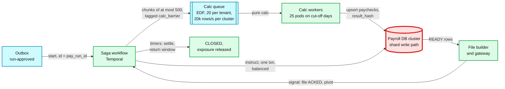

# Deep dive: multi-tenant batch and retries

> One-line answer: each pay run is one saga (a Temporal workflow keyed by `pay_run_id`) whose calc fans out in chunks of at most 500 employees onto an earliest-deadline-first queue with a per-tenant cap, every activity is a retry-safe pure function or an idempotent insert, and the pivot is the file acknowledgement; the fleet is pre-scaled to ~3x the worst case, which makes CPU a non-issue and moves the real risk to the shard write path during a backlog drain (unpaced, ~35k rows/s per cluster and 51k on the big tenant's cluster in simulation), so the dispatcher paces every physical cluster with a ~20k rows/s write budget, and the 50k-employee tenant gets its own placement, file group, wire funding, asynchronous incremental preview and next-day tax deposits.

Zoom-in on [`../solution.md`](../solution.md) §4.2, §5.2, §10.1 (Temporal) and §10.3. Acronyms: EDF (earliest deadline first), FIFO (first in, first out), vCPU (virtual CPU), RLS (row-level security), KMS (key management service), EFTPS (Electronic Federal Tax Payment System), PT / ET (Pacific / Eastern time). Reusable blocks: [`../../../concepts/temporal-durable-execution.md`](../../../concepts/temporal-durable-execution.md), [`../../../concepts/distributed-transactions.md`](../../../concepts/distributed-transactions.md) (sagas), [`../../../concepts/sharding.md`](../../../concepts/sharding.md), [`../../../concepts/rate-limiting-and-load-shedding.md`](../../../concepts/rate-limiting-and-load-shedding.md), [`../../../concepts/fan-out-fan-in.md`](../../../concepts/fan-out-fan-in.md). Related: [`../../distributed-job-scheduler/`](../../distributed-job-scheduler/). Siblings: [`gross-to-net-calc-and-tax-tables.md`](gross-to-net-calc-and-tax-tables.md), [`exactly-once-money-movement.md`](exactly-once-money-movement.md).

---

## 1. One saga per run



| Step | Retry-safe because | Retry policy `[estimate]` | If it keeps failing |
|---|---|---|---|
| Start workflow | Workflow id = `pay_run_id`; Temporal rejects a duplicate start | Outbox relay retries forever | Page at cut-off + 10 min if any approved run has no workflow |
| Calc chunk | Pure function of the snapshot; upsert compares `result_hash` | Heartbeat 30 s, 5 attempts, backoff 5 s to 60 s | A hash mismatch is a determinism bug: stop the run, page the engine team |
| Instruct | Deterministic ids, `ON CONFLICT DO NOTHING`, balance assertion | 5 attempts | Unbalanced run: stop, page; never "fix" amounts in place |
| Wait for the file | A signal from the gateway; no side effect | None needed | The countdown alerts own this (solution §5.1) |
| Timers to settle and close | Dates computed by an activity from the bank calendar, never in workflow code | n/a | A late return re-opens the run as a receivable |
| Notify | Notification id derived from (run, event) | 10 attempts | Dropped notifications are logged; money is unaffected |

- **Money never moves inside an activity.** Activities write rows; only the file builder and gateway talk to the bank (solution §10.1).
- **Workflow code changes need versioning.** ~600k workflows are open in a peak week and each lives until its return window closes, so a change to workflow code must use Temporal's patch API or old histories stop replaying.

## 2. Why chunks of 500

- **History size.** One activity per employee is 6 M activities and ~18 M state transitions in 30 minutes at the design peak, and a 50k-employee run alone is ~150k history events, past Temporal's 51,200-event limit for one workflow run (solution §5.2).
- **Chunks of at most 500.** A 50k run is 100 activities and ~300 events; ~99% of runs fit one chunk `[estimate]`. A chunk takes `500 × 10 ms = 5 s`, short enough that a worker death costs one heartbeat timeout (30 s) plus 5 s of recompute.
- **The night's load on Temporal.** ~600k runs × ~25 transitions = ~15 M transitions over ~2.5 hours, ~1.7k/s on average and ~6k/s in the final 15 minutes; sized for 10k/s (solution §10.3). The fallback, if it ever gets close, is a plain work queue for the fan-out with the saga keeping only run-level steps.

## 3. The queue: deadlines first, tenants fair

- **EDF.** Each chunk carries its window's `calc_barrier`. Tomorrow's work never delays tonight's.
- **Per-tenant cap.** At most 20 in-flight chunks per tenant: the 50k run takes `100 chunks ÷ 20 × 5 s = 25 s` of wall time when the pool is idle, without starving anyone.
- **Per-cluster write budget.** A token bucket of ~20k rows/s per physical cluster `[estimate: set by a load test]`, charged `paychecks × 20` per chunk before dispatch (solution §5.2, §10.2). EDF decides the order; the budget decides how fast each cluster absorbs it.
- **Two pools.** Authoritative calc and preview never share workers; preview is budgeted in CPU-seconds per tenant, not requests, and is the first thing shed in the last hour (solution §5.2).
- **Pre-scaled by calendar.** 4 pods, then 25 pods of 4 vCPU from 2 PM PT on cut-off days, 40 on month-end Wednesdays: `100 vCPU ÷ 10 ms = ~10k paychecks/s`, ~3x the 3,333/s worst case of solution §2.

## 4. A 45-minute calc outage on the design-peak night, simulated

5 M paychecks approved between 3:00 and 5:00 PM PT on a ramp, 1 M more for tomorrow's window, the 50k-employee run approved at 4:40 PM on cluster 0, and the calc pool down from 4:00 to 4:45 PM. Small runs are bundled 50 to a job so the simulation stays small; 2% of chunks lose their worker and are retried after the 30 s heartbeat. The fourth row is the design (EDF, cap 20, a 20k rows/s budget per cluster); the others show why each piece is there. Python 3, standard library, seeded.

```python
"""Calc pool on the design-peak night with a 45-minute calc outage (16:00 to 16:45 PT).
Small runs are bundled 50 to a job (500 paychecks, 5 s of CPU). The 50k-employee tenant
approves at 16:40 as 100 chunks of 500 on cluster 0. 10 ms and 20 DB rows per paycheck.
A write budget of B rows/s per cluster allows B / 2,000 running chunks there (10k rows in 5 s)."""
import heapq, random
from collections import defaultdict

def jobs(rnd):
    out = []
    for i in range(10_000):                       # 5 M paychecks approved 15:00 to 17:00, ramping
        out.append((7200 * rnd.random() ** 0.5, 9000, f"s{i}", rnd.randrange(8)))  # due 17:30
    for i in range(2_000):                        # 1 M paychecks for tomorrow's window [estimate]
        out.append((rnd.uniform(0, 7200), 95400, f"t{i}", rnd.randrange(8)))
    return sorted(out + [(6000.0, 9000, "BIG", 0)] * 100)   # 16:40 PT, 100 chunks of 500

def run(order, cap, workers, budget=0, outage=(3600, 6300), p_fail=0.02, heartbeat=30, seed=29):
    rnd, ccap = random.Random(seed), budget // 2000 if budget else 10**9
    pending, ready, busy = jobs(rnd), [], []
    free, inflight, parked, rows = workers, defaultdict(int), defaultdict(list), defaultdict(float)
    now, i, tonight_done, big_end, drained = 0.0, 0, 0.0, 0.0, None
    key = (lambda j: (j[1], j[0])) if order == "EDF" else (lambda j: (j[0],))
    while i < len(pending) or ready or busy:
        while i < len(pending) and pending[i][0] <= now:
            heapq.heappush(ready, (key(pending[i]), pending[i])); i += 1
        if outage[0] <= now < outage[1]:          # the pool is down: nothing starts
            now = outage[1]; continue
        while free and ready:
            _, j = heapq.heappop(ready)
            c = f"c{j[3]}"                        # the chunk's physical cluster
            if inflight[j[2]] >= cap or inflight[c] >= ccap:
                parked[j[2] if inflight[j[2]] >= cap else c].append(j); continue
            inflight[j[2]] += 1; inflight[c] += 1; free -= 1
            fail = rnd.random() < p_fail          # worker dies mid-chunk, heartbeat times out
            heapq.heappush(busy, (now + (heartbeat if fail else 5.0), fail, j))
        if drained is None and now > outage[1] and not ready and not any(parked.values()): drained = now
        t_arr = pending[i][0] if i < len(pending) else float("inf")
        if not busy or t_arr < busy[0][0]:
            now = t_arr; continue
        now, fail, j = heapq.heappop(busy); free += 1; inflight[j[2]] -= 1; inflight[f"c{j[3]}"] -= 1
        for p in parked.pop(j[2], []) + parked.pop(f"c{j[3]}", []): heapq.heappush(ready, (key(p), p))
        if fail:                                  # retried from the snapshot, same result
            heapq.heappush(ready, (key(j), j)); continue
        rows[(j[3], int(now // 10))] += 500 * 20 / 10
        if j[1] == 9000: tonight_done = max(tonight_done, now)
        if j[2] == "BIG": big_end = now
    hh = lambda s: f"{15 + int(s // 3600)}:{int(s % 3600 // 60):02d}:{int(s % 60):02d}"
    c0 = max(v for (c, b), v in rows.items() if c == 0)
    oth = max(v for (c, b), v in rows.items() if c != 0)
    print(f"{order:4} cap {cap:>3} {workers:>3} workers budget {budget // 1000:>2}k | drained {hh(drained)} | "
          f"barrier {hh(tonight_done)} | big run done {big_end - 6000:4.0f} s after approval | "
          f"peak rows/s: cluster 0 {c0 / 1000:3.0f}k, others {oth / 1000:3.0f}k")

for order, cap, w, b in [("FIFO", 999, 100, 0), ("EDF", 20, 100, 0), ("EDF", 5, 100, 0),
                         ("EDF", 20, 100, 20000), ("FIFO", 999, 34, 0), ("EDF", 20, 34, 0)]:
    run(order, cap, w, b)
```

Real output:

```
FIFO cap 999 100 workers budget  0k | drained 16:51:25 | barrier 17:00:10 | big run done  620 s after approval | peak rows/s: cluster 0  87k, others  37k
EDF  cap  20 100 workers budget  0k | drained 16:51:25 | barrier 17:00:10 | big run done  595 s after approval | peak rows/s: cluster 0  51k, others  35k
EDF  cap   5 100 workers budget  0k | drained 16:51:25 | barrier 17:00:10 | big run done  650 s after approval | peak rows/s: cluster 0  43k, others  36k
EDF  cap  20 100 workers budget 20k | drained 16:54:50 | barrier 17:00:10 | big run done  675 s after approval | peak rows/s: cluster 0  20k, others  20k
FIFO cap 999  34 workers budget  0k | drained 17:08:10 | barrier 17:08:35 | big run done 1175 s after approval | peak rows/s: cluster 0  60k, others  19k
EDF  cap  20  34 workers budget  0k | drained 17:08:10 | barrier 17:06:10 | big run done 1065 s after approval | peak rows/s: cluster 0  40k, others  17k
```

What it shows:

- **CPU is not the risk.** With 100 vCPU a 45-minute outage's backlog (~2.6 M paychecks plus tomorrow's work) drains in ~6.5 minutes, and the barrier passes at 5:00:10 PM, 20 minutes inside the 5:30 PM milestone. Even at 34 workers (the "~33 cores" of solution §2, an availability zone loss plus a bad autoscale) it passes by 5:08 PM.
- **EDF matters only when the fleet is short.** At 34 workers EDF passes the barrier 2.5 minutes earlier than FIFO because tomorrow's work waits. At 100 workers the two are the same.
- **The database is the risk.** Steady-state writes are sized at 3,333 paychecks/s, ~8k rows/s per cluster (solution §2). An unpaced drain runs at the **fleet's** speed, 10k paychecks/s: the busiest small-tenant cluster peaks at ~35k rows/s in a 10-second bin, ~4x that figure, and the cluster holding the 50k-employee tenant at 51k rows/s with the cap of 20, 87k without any cap. That result is why the design has a write budget.
- **The per-tenant cap is a fairness tool, not a database guard.** Dropping it from 20 to 5 lowers cluster 0's peak only from 51k to 43k (its small tenants drain at the same time) and makes the big run 55 s slower.
- **The budget costs almost nothing.** With 20k rows/s per cluster (row 4), every cluster peaks at exactly 20k, the backlog drains by 4:54:50 PM instead of 4:51:25 PM, the barrier still passes at 5:00:10 PM, and the big run finishes 80 s later (675 s instead of 595 s after approval). The alternative, sizing every cluster for ~50k rows/s of sustained writes, costs hardware all week to absorb a few minutes a month.
- **The budget also caps the fleet.** 8 clusters × 10 running chunks is 80 chunks, ~8k paychecks/s, below the 100-vCPU fleet. If the barrier ever needs more, raise the budget after a load test, not the pod count.

## 5. The 50k-employee tenant, checklist

| Concern | Number | What changes |
|---|---|---|
| Calc | 50k × 10 ms = 500 CPU-seconds | 100 chunks, cap 20, ~25 s idle-pool wall time |
| Preview | ~300 ms in-process for a 12-person run; here 500 CPU-seconds | **Asynchronous and incremental** (solution §5.2): only employees whose inputs changed since the last preview are recomputed, keyed by `input_version`; budgeted in CPU-seconds per tenant, because a request limit of 10 a minute would allow ~83 cores |
| Snapshot | ~2 KB per employee `[estimate]`, ~100 MB | Built and hashed at preview; approval references the preview's snapshot hash so the approve call stays ~150 ms `[decision]` |
| Shard writes | 50k × 20 = 1 M rows | Own logical shard (a directory move); placed on a physical cluster with headroom, and charged to that cluster's write budget |
| Its NACHA batch | 50k credits in its own file group | A malformed field rejects only its file, not ~80k other companies' |
| Employer debit | 50k × ~$1,680 = ~$84 M | Over the $1 M same-day limit, near the $99,999,999.99 entry limit (~60k employees at this average): **wire prefunding**, never a plain ACH debit |
| Federal tax deposit | ~21% of $84 M = ~$17.6 M per payday | The $100,000 next-day rule applies every payday: due the next business day, and EFTPS needs a deposit over $1 M "by 8:00 p.m. Eastern time the day before" the due date ([IRS Pub 15](https://www.irs.gov/publications/p15)). One day late is 2%, ~$350k (solution §4.3 step 7) |
| Claim | 50k instructions | One claim transaction under the run lock ([`exactly-once-money-movement.md`](exactly-once-money-movement.md) §5), about a second `[estimate]` |
| Returns | ~0.1% of credits `[estimate]`, ~50 per run | Same path; the tenant's admin sees a returns queue, not 50 emails |
| Approval at 4:59 PM | Calc ~25 s idle, ~675 s behind a drain; write burst ~1 M rows | Fits the 30-minute barrier budget; the write budget spreads the burst over ~50 s at 20k rows/s |

- **Legal entities stay separate companies.** Each has its own EIN (employer identification number), funding account, tax liabilities and deposits (solution §5.2). A tenant with 30 entities is 30 debits, 30 deposit streams, one admin.
- **Rippling's framing.** Multi-tenant payroll with exact money math, the run as a saga, tenant isolation and an audit trail (problem README): all four are this section plus [`gross-to-net-calc-and-tax-tables.md`](gross-to-net-calc-and-tax-tables.md).

## 6. Tenant isolation and noisy neighbours

- **Data.** `tenant_id` leads every key; Postgres row-level security set per connection from the auth context; PII (personally identifiable information) in a vault with per-tenant data keys under KMS (solution §5.7).
- **Compute.** The per-tenant cap and the preview pool with its CPU-second budget; a tenant's preview cannot take authoritative calc capacity.
- **Writes.** The per-cluster write budget from §3 and §4. Without it, one big tenant's approval at 4:59 PM slows every small tenant's commits on that cluster in the approval minute, which is the minute the 99.95% target protects.
- **Files.** Big tenants in their own file group; per-company batch checks before upload (the company id must own the funding account), so a cross-tenant mix-up fails the build instead of paying the wrong people.

## 7. When the orchestrator itself is down

- **Approvals continue.** The approve path is the shard and object storage only; the outbox holds `run-approved` rows until Temporal returns (solution §5.5).
- **The barrier is at risk.** At ~5:00 PM a 20-minute Temporal outage eats most of the 30-minute calc budget.
- **Break-glass driver** `[decision]`. Calc and instruct are idempotent by construction (hash-compared upserts, deterministic instruction ids), so a simple driver can scan `APPROVED` runs for tonight's window per shard and call the same activity code directly. When Temporal returns, its workflows replay the same activities and find everything already done. This is the "DB state machine plus cron" that solution §7 rejected as the main engine, kept as a tested fallback for one window.

## 8. Load test and what pages

**The load test that proves the night** `[estimate: run monthly and before every month-end]`:
1. Replay a recorded design-peak afternoon at 1.5x: ~9 M paychecks, ~900k runs, the approval ramp of solution §2, including a synthetic 50k-employee tenant approving at 4:59 PM.
2. Kill the calc pool for 45 minutes at 4:00 PM, then one shard primary at 4:59:50 PM.
3. Pass criteria: barrier by 5:30 PM; no cluster above its write budget for more than 10 s; approval p99 under 1 s outside the failover; zero hash mismatches; the file builder's completeness check (instructions = registered entries) passes.

**What pages, from this component:**

| Signal | Threshold | Who |
|---|---|---|
| Calc barrier not passed | Cut-off + 10 min warn, + 30 min page | Payroll platform on-call |
| Approved run with no workflow | Any, 5 min after approval in the last hour | Payroll platform on-call |
| Determinism mismatch on upsert | Any | Engine team |
| Cluster write budget saturated | Above 90% for 60 s | Database on-call (the drain is throttled, not failing) |
| Temporal transitions | Above 7k/s for 5 min (70% of the 10k/s sizing) | Payroll platform on-call |
| One tenant above its preview CPU budget | Sustained 10 min | Rate-limited automatically; a ticket, not a page |

## 9. What an interviewer pushes on

1. **"A calc worker dies after 300 of 500 employees."** The heartbeat stops, the chunk is retried after 30 s, all 500 are recomputed from the snapshot, 300 upserts are no-ops by hash, 200 insert (solution Flow 5).
2. **"Why not Spark at the cut-off?"** ~33 cores of pure functions; the drain finishes in minutes. The bottleneck a cluster framework would hit is the same database.
3. **"One tenant has 50k employees. Does anything change?"** Chunks, cap, placement, file group, wire, async preview, next-day tax deposits. Ten rows of the table in §5.
4. **"What saturates first if calc falls behind?"** The shard write path during the drain, not CPU: 35k to 51k rows/s unpaced. Hence the ~20k rows/s budget per cluster, which costs the barrier nothing.
5. **"Temporal is down at 4:45 PM."** Approvals continue; the break-glass driver runs the same idempotent activities.

## 10. Trade-offs

| Decision | Chose | Gave up |
|---|---|---|
| Fan-out unit | Chunks of 500 | Per-employee retry granularity (a retry recomputes 500, ~5 s) |
| Queue order | EDF plus per-tenant cap | Strict arrival fairness |
| Capacity | Pre-scaled 3x by calendar | Idle pods most of the week (cheap) |
| Write protection | Per-cluster token bucket, ~20k rows/s | A drain takes ~3.5 minutes longer than the CPU alone would allow |
| Big-tenant preview | Asynchronous and incremental | "Instant" preview for the largest customers |
| Orchestrator | Temporal, with a tested break-glass driver | Two code paths for one window, kept honest by idempotency |

## 11. Numbers to say out loud

- Chunks of 500, ~5 s each; a 50k run is 100 chunks, ~300 history events, ~25 s on an idle pool with a cap of 20.
- Temporal: ~15 M transitions a peak night, ~6k/s at the end, sized for 10k/s; 51,200 events per workflow run.
- Fleet 100 vCPU = ~10k paychecks/s, 3x the 3,333/s worst case; a 45-minute outage drains in ~6.5 minutes.
- Drain writes: ~35k rows/s per cluster unpaced, 51k on the big tenant's cluster; paced to 20k by the budget, barrier unchanged at 5:00:10 PM.
- Big tenant: ~$84 M debit (wire), ~$17.6 M federal deposit due the next business day.
