# Diagrams: payroll run for ~1M small businesses

> One-line answer: twelve views of one design. Approval freezes a snapshot before a cut-off derived backwards from the bank's ACH (automated clearing house) windows. A saga fans the snapshot out to pure calc workers. Balanced, deterministically keyed instructions sit in a tenant-sharded payroll DB until a file builder claims whole runs, under each run's lock, into NACHA files, registers each file on a primary key that an orphan sweep can tombstone first, and a bank gateway uploads it at most once to one of two ODFIs. Returns come back as files, are matched by our own `ach_ref`, and are repaired forward. The file builder and bank gateway at the ODFI (originating bank) cut-off is the one red box.

The D1 to D12 set from `hld/CLAUDE.md` §4, each with a one-line caption. A diagram already in [`solution.md`](solution.md) gets a heading, a caption and a link, never a second copy. Acronyms: ODFI and RDFI (originating and receiving depository financial institution), FedACH (the Federal Reserve's ACH operator), EFTPS (Electronic Federal Tax Payment System), NOC (notification of change), WORM (write once, read many), AZ (availability zone), RPO (recovery point objective), EIN (employer identification number), PT and ET (Pacific and Eastern time).

| # | Diagram | Where it lives |
|---|---|---|
| D1 | Context | below |
| D2 | Data flow | below, plus D2b, the anatomy of one NACHA file |
| D3 | Component architecture (final design) | [solution §6](solution.md#6-final-design-and-the-six-core-flows) |
| D4 | Happy path per FR | FR1 approve: [solution §4.1](solution.md#41-schedule-and-approve-freeze-a-snapshot-before-the-cut-off). FR2 calc: [solution §4.2](solution.md#42-calculate-a-pure-function-of-the-snapshot). FR3 night drop: [solution §4.3](solution.md#43-move-money-exactly-once-instructions-then-files-then-the-bank); tax deposit: below. FR4 R01 return: [solution §4.4](solution.md#44-retry-and-repair-forward-only-corrections); R03 re-issue: below |
| D5 | Failure paths | Upload timeout: [solution Flow 3](solution.md#flow-3-the-upload-of-file-c-times-out-at-605-pm-pt). Shard failover at 4:59:50 PM: [solution §10.4](solution.md#104-failure-timeline). Below: a paused file builder loses to a tombstone, a calc worker dies mid-chunk, EFTPS rejects a deposit |
| D6 | Decision flow | Upload outcome: [solution §5.3](solution.md#53-the-upload-timed-out-did-the-bank-get-it-exactly-once-money-movement). Approval admission: below |
| D7 | Entity relationship | [solution §3.3](solution.md#33-data-model) |
| D8 | State machines | Pay run: [solution §4.4](solution.md#44-retry-and-repair-forward-only-corrections). Instruction and NACHA file: below |
| D9 | Deployment / topology | below |
| D10 | Scaling / partitioning | below |
| D11 | Failure mode map | below, two trees |
| D12 | Rollout / migration | below |

## D1. Context (zoom-out)

The payroll engine as one box: admins and employees in, money and records out through banks, agencies and the ledger.

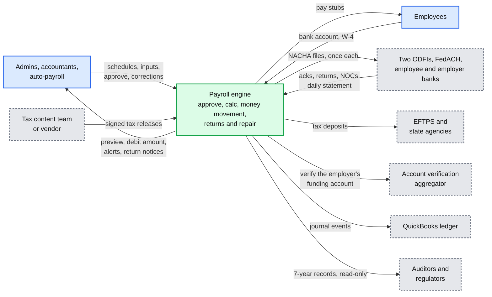

- The banks are drawn as one box on purpose: we only ever talk to our two ODFIs, each company homed at one. FedACH and every RDFI sit behind them.
- QuickBooks' ledger consumes the journal; it never writes back ([`../quickbooks-ledger/`](../quickbooks-ledger/)). The aggregator is the one used by [`../bank-feed-aggregation/`](../bank-feed-aggregation/).

## D2. Data flow (DFD)

Inputs to outputs on the design-peak night (Wednesday 28 October 2026). Stores are cylinders, processes are rounded boxes, every edge has a format, size and rate.

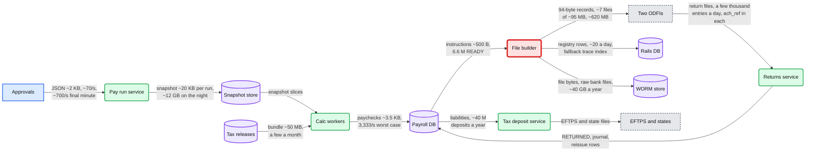

- The return volume is an `[estimate]`; the rest follows from solution §2. The file builder is red because every one of the night's ~$17 B of entries passes through it before the ODFI cut-off.

### D2b. Zoom-in: one NACHA file

The run from solution §3.3 inside a file: one batch per company and entry class, control records that the bank checks and we reconcile.

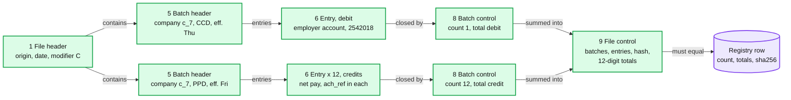

- Records are 94 characters, blocked in tens. An entry's amount is 10 digits (at most $99,999,999.99), a file's total debits 12 digits (at most $9,999,999,999.99), and the File ID Modifier one character (36 files a day). Source: the [ACH developer guide](https://achdevguide.nacha.org/ach-file-details). Positions 40 to 54 of each entry (Identification Number, 15 characters) carry our `ach_ref`, which a return copies back.

## D3. Component architecture

The final design is in [solution §6](solution.md#6-final-design-and-the-six-core-flows): 14 nodes, the file builder and bank gateway red. Not repeated here.

## D4. Happy paths, one per FR

FR1 to FR4's main sequences are in solution §4.1 to §4.4 (linked in the table above). Two more happy paths that solution.md describes only in prose:

### D4 FR3. A federal tax deposit, from liability to EFTPS

The payday was Friday 30 October 2026; the company is a semiweekly depositor under $100k of liability per payday, so the deposit is due Wednesday 4 November (counted on the DC legal-holiday calendar) and goes in the day before.

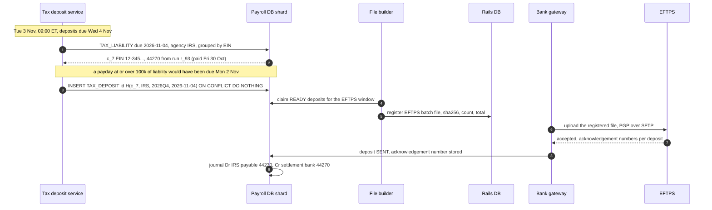

- EFTPS requires a deposit over $1 M to be submitted by 8 PM ET the day before the due date (IRS Notice 931); submitting every federal deposit the day before means no deposit depends on the same-day option. The $100,000 next-day rule (IRS Pub 15) overrides the schedule: any company with ~$476k of debit on a payday (~280+ employees), and the 50k-employee tenant every payday (~$17.6 M, ~$350k per day late at 2%), deposits the next business day. The EFTPS batch file format itself is not modelled here.

### D4 FR4. An R03 credit return is re-issued

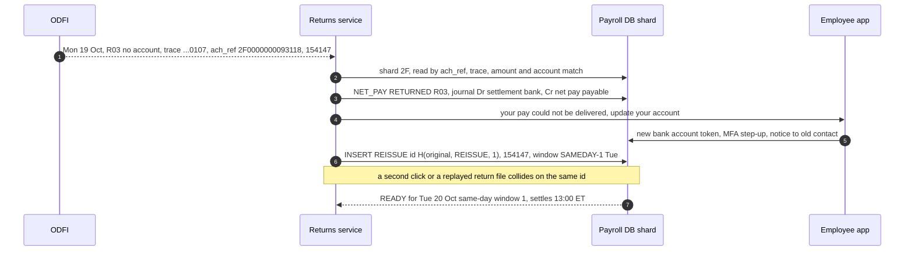

## D5. Failure paths

Two failure paths live in solution.md (the upload timeout and the shard failover across the cut-off). Three more:

### D5a. A paused file builder loses to a tombstone

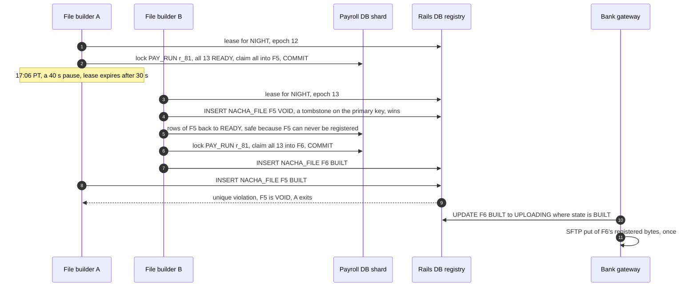

- The order is the point. Freeing rows first and checking "never registered" second lets A register in between, and both files pay the same run: that race is 102 of the 53,717 bad outcomes in the reviewer's 175,120 interleavings ([`deep-dives/exactly-once-money-movement.md`](deep-dives/exactly-once-money-movement.md) §4). The epoch is only an early exit; the primary key decides.

### D5b. A calc worker dies after 300 of 500 employees

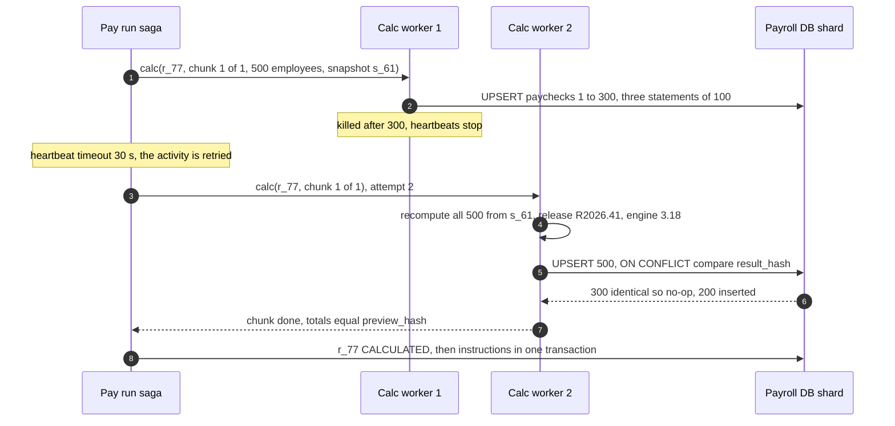

### D5c. EFTPS rejects a deposit on the eve of its due date

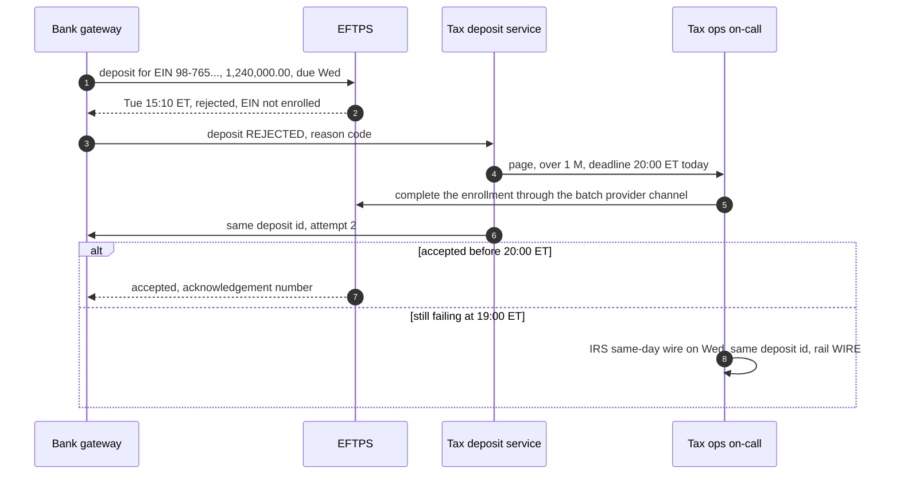

- IRS Notice 931 names the same-day wire as the option when an EFTPS deposit misses its deadline. Late by 1 to 5 days would cost 2% of $1.24 M, ~$24,800, so this pages.

## D6. Activity / decision flow

The upload-outcome tree is in [solution §5.3](solution.md#53-the-upload-timed-out-did-the-bank-get-it-exactly-once-money-movement). Here, the approval admission decision inside the pay run service's one transaction:

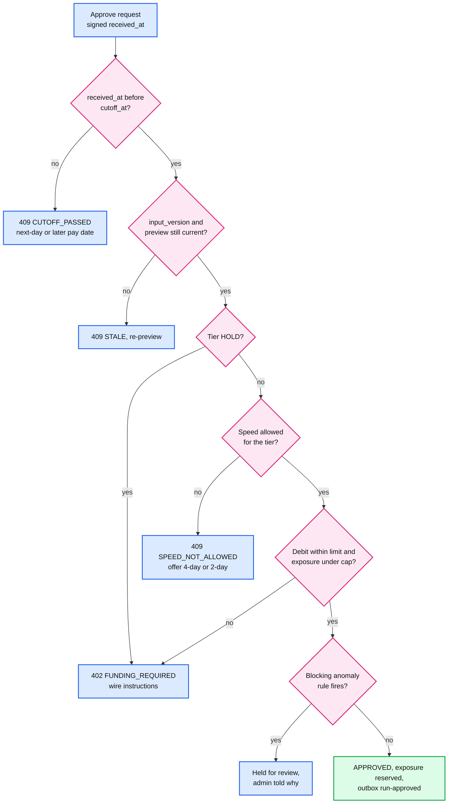

- The anomaly model from solution §12 only adds review flags at preview; only deterministic rules can hold a run here.

## D7. Entity relationship

In [solution §3.3](solution.md#33-data-model), with the access patterns and partition keys.

## D8. State machines

The pay run lifecycle is in [solution §4.4](solution.md#44-retry-and-repair-forward-only-corrections). Two more entities have lifecycles that carry the exactly-once story.

### D8a. Payment instruction

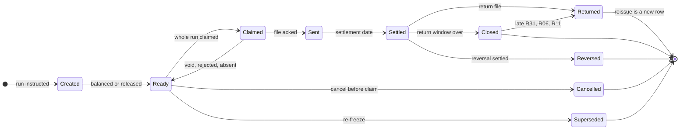

### D8b. NACHA file

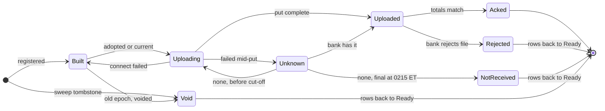

## D9. Deployment / topology

Two regions, three AZs each. Region A is active for every writer; region B is warm. One shard cluster is drawn; the other seven have the same shape.

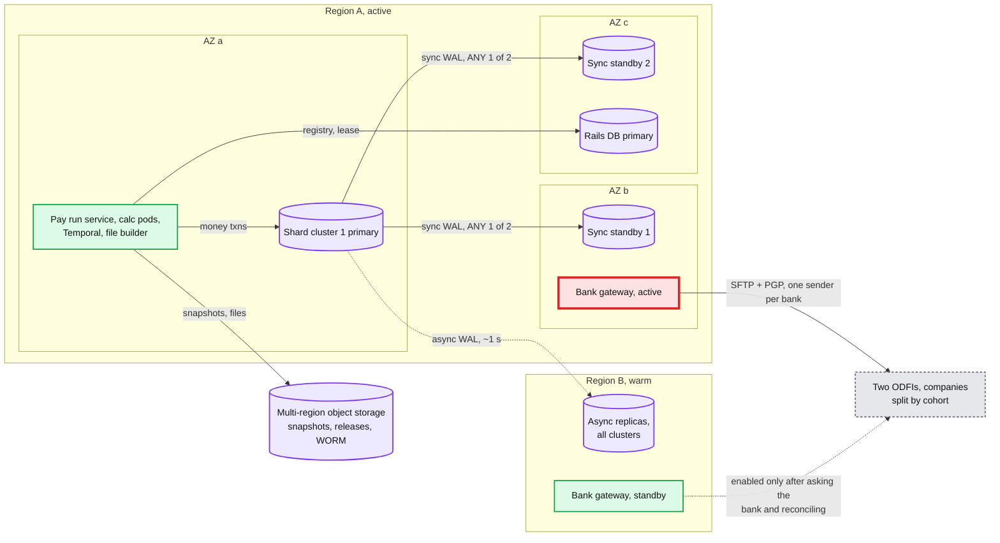

- 8 shard clusters × (primary + 2 sync standbys + 1 async replica in region B). The rails DB has the same shape. WAL is the write-ahead log.
- **Crosses a region:** async WAL (~1 s RPO), object storage replication, edge logs. Never a synchronous commit, and never two active gateways: the standby gateway is enabled by a human after the bank confirms which files it has (solution §5.5).

## D10. Scaling / partitioning

Tenant to logical shard to cluster, and how the night's instructions funnel back into a handful of files.

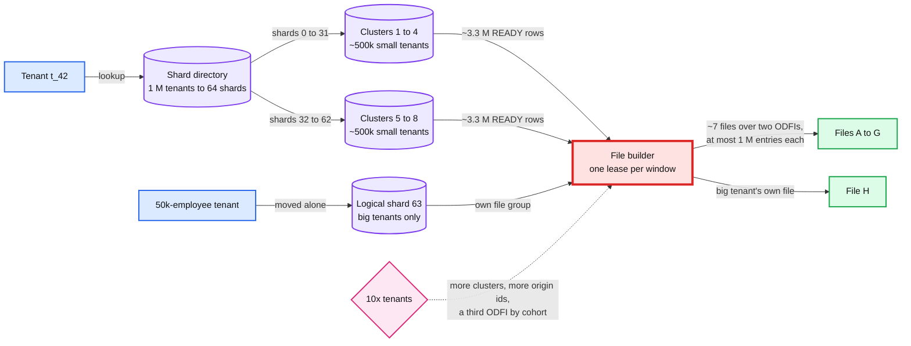

- Per cluster at the design peak: ~75k runs, ~8k rows/s for the 30-minute worst case, ~150 GB a year of hot data. No shard is hot by itself; the funnel is the window. See [`../../concepts/sharding.md`](../../concepts/sharding.md).
- The partition key is `tenant_id` everywhere. Within a file, entries are ordered by `(company_id, instruction_id)`, so a rebuild of a rejected file produces the same batches.

## D11. Failure mode map

Component, what fails, blast radius, mitigation. Split in two to stay under 15 nodes each.

### D11a. Money path

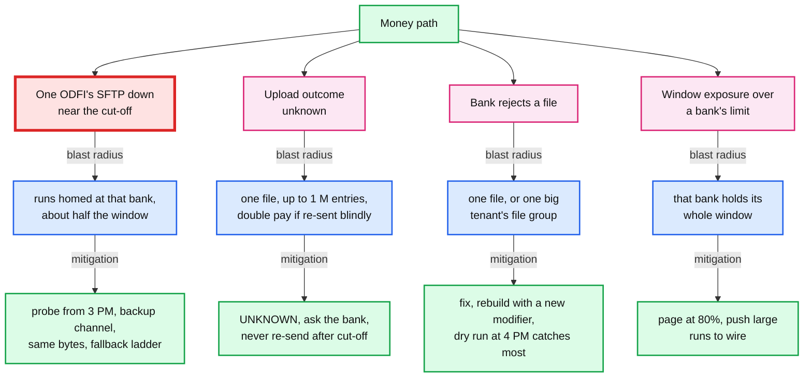

### D11b. Calc, data and control plane

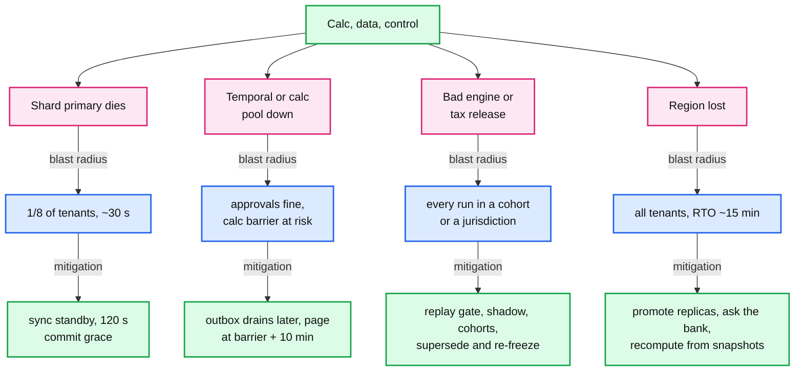

## D12. Rollout / migration

From a legacy engine (one job that calculates and writes files) to this design: the five phases of [solution §8](solution.md#8-staff-level-notes), plus the second ODFI, which is onboarded in parallel and gets its cohort once every company is on the new path. Each milestone is that phase's rollback point. Durations are estimates. The first money-ownership flips avoid quarter ends, so a quarter's tax forms come from one system.

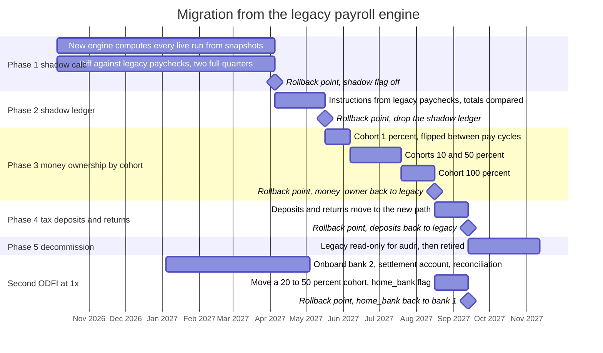

- The rollback at every phase is a flag, never a data migration, because each run lives in exactly one system. YTD balances move as opening balances in phase 3 and are checked against legacy totals per employee before a company's first flip.
