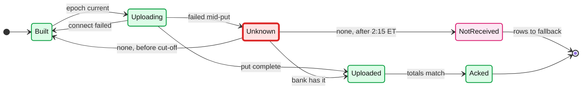
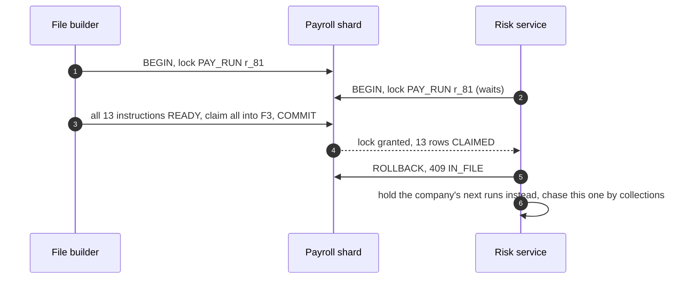
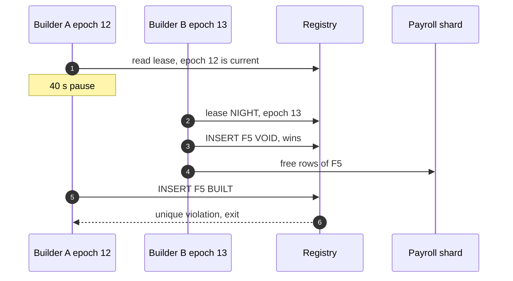
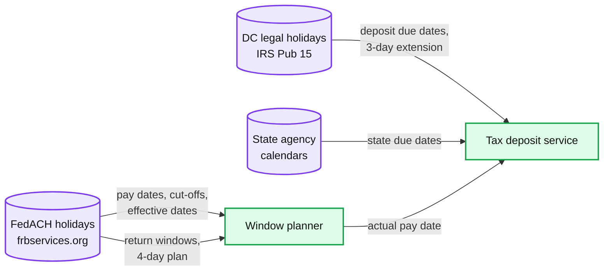

# Edge cases: payroll run for ~1M small businesses

Every entry is answerable in under 60 seconds out loud. Categories: failure, consistency, scale, data, operations, security / abuse. Design reference: [`solution.md`](solution.md). Most of the design described here came out of an adversarial review whose simulations are in the deep dives; an answer bullet that starts with **Decision:** still goes past what solution.md states. Acronyms: ACH (automated clearing house), ODFI / RDFI (originating / receiving bank), FedACH (the Federal Reserve's ACH operator), NACHA file (the fixed-width ACH file), SFTP (SSH, Secure Shell, file transfer protocol), PT / ET (Pacific / Eastern time), YTD (year to date), IRS (Internal Revenue Service), EFTPS (Electronic Federal Tax Payment System), NOC (notification of change), MFA (multi-factor authentication), RPO / RTO (recovery point / time objective), PII (personally identifiable information).

---

## Failure

## Edge case: the upload of file C times out at 6:05 PM PT and the bank cannot answer before its 6:30 PM cut-off
- **Trigger:** the SFTP put of file C (~940k entries, ~$2.4 B) dies near the end; the remote listing times out; the ODFI desk cannot confirm before 6:30 PM PT.
- **Symptom:** file C is `UNKNOWN` past the cut-off; T−30 and T−15 pages fired; ~85k employer debits and ~855k credits are in limbo.
- **Answer:**
  - Never re-send that night. Until FedACH's last future-dated deadline (2:15 AM ET) the bank may still forward the file, so a "not received" can still turn out wrong (solution §5.3). The same bytes may be re-uploaded only on a confirmed "not received" before the cut-off.
  - 2-day runs lose nothing by waiting: Thursday's night file still pays Friday. Thursday ~6:00 AM PT, ask for the ODFI's forwarded-file report. Cost if not received: ~$1.4 B of debits settle a day later, zero late paychecks.
  - A final "not received" after 2:15 AM ET sets the terminal `NOT_RECEIVED` state: the rows return to `READY` for the fallback window and are rebuilt with a new File ID Modifier (solution §5.3, D6). It is the only rebuild of a file that reached `UPLOADING`.
  - **Decision:** build next-day entries into their own small files and upload them first, so an UNKNOWN most likely lands on runs that can wait a day. See [`deep-dives/deadlines-and-ach-windows.md`](deep-dives/deadlines-and-ach-windows.md) §4.
  - A put that succeeded with an acknowledgement 40 minutes late is `UPLOADED`, not `UNKNOWN`: wait and ask, never resend.
- **Diagram:**

- **Confidence:** [ ] shaky  [ ] ok  [ ] confident

## Edge case: one ODFI's SFTP host is down from 5:50 PM PT
- **Trigger:** connections to one of our two ODFIs are refused; files 5 to 7 of the night, all for companies homed at that bank, are `BUILT`, not uploaded.
- **Symptom:** connect failures; the T−30 page at 6:00 PM; the bank confirms an outage.
- **Answer:**
  - A failed connect sent no bytes, so the file stays `BUILT` and the same bytes are retried. Only a failure mid-put is `UNKNOWN` (solution §10.4).
  - 6:10 PM: the bank's backup channel (a secondary host or a portal upload `[estimate]`), same bytes, the registry records which channel.
  - If the cut-off passes, the files are voided (`BUILT → VOID`, they never left) and their runs move to Thursday's night file with credits still effective Friday; admins hear "employees paid on time, your debit moves to Friday" (solution §10.4).
  - Blast radius is that bank's cohort, about half the window; the other bank's files are unaffected. Files are never moved to the other bank: `home_bank` flips only between pay cycles.
  - The SFTP probe every 5 minutes from 3:00 PM PT, with key-expiry alarms, finds a dead host key or credential ~2.5 hours before the upload (solution §5.1).
- **Confidence:** [ ] shaky  [ ] ok  [ ] confident

## Edge case: a shard primary dies at 4:59:50 PM PT
- **Trigger:** one of the 8 Postgres clusters loses its primary 10 s before the customer cut-off; ~1/8 of tenants.
- **Symptom:** those admins see a spinner; the pay run service returns `503` retryable for ~30 s.
- **Answer:**
  - The edge stamped and signed `received_at = 16:59:55.300` and retries with the same `Idempotency-Key` and the original `received_at` for up to 120 s (solution §10.4).
  - A synchronous standby (`ANY 1` of 2, other AZs, availability zones) is promoted with RPO 0; the commit lands at ~17:00:24 and counts.
  - The file builder starts no earlier than 5:02 PM (cut-off plus grace), so the late commit is in tonight's file.
- **Confidence:** [ ] shaky  [ ] ok  [ ] confident

## Edge case: Temporal is down from 4:40 PM PT on cut-off day
- **Trigger:** the workflow service's persistence is unavailable for 25 minutes.
- **Symptom:** approvals succeed, but no new sagas start, so nothing is calculated or instructed; the calc-barrier warning fires at cut-off + 10 min.
- **Answer:**
  - The approve path depends only on the shard and object storage; `run-approved` outbox rows wait (solution §5.5).
  - **Decision:** a tested break-glass driver scans `APPROVED` runs for tonight's window per shard and calls the same calc and instruct activity code directly. Both are idempotent (hash-compared upserts, deterministic instruction ids), so when Temporal returns its workflows replay and find the work done. See [`deep-dives/multi-tenant-batch-and-retries.md`](deep-dives/multi-tenant-batch-and-retries.md) §7.
- **Confidence:** [ ] shaky  [ ] ok  [ ] confident

## Edge case: a calc worker dies after 300 of 500 employees
- **Trigger:** An out-of-memory kill or node loss mid-chunk.
- **Symptom:** the activity's heartbeat stops; 300 paychecks are stored, 200 are not.
- **Answer:**
  - Temporal retries the chunk after the 30 s heartbeat timeout on another worker, which recomputes all 500 from the snapshot (solution Flow 5).
  - The 300 stored paychecks match by `result_hash` (no-ops) and 200 insert. A different hash for the same key is a determinism bug and pages.
  - Nothing downstream saw a partial run: instructions are written only after every chunk is stored and totals match `preview_hash`.
- **Confidence:** [ ] shaky  [ ] ok  [ ] confident

## Edge case: the rails DB (registry, window lease, trace index) fails over at 5:10 PM PT
- **Trigger:** the rails DB primary dies during the night drop.
- **Symptom:** the builder cannot renew its lease or register files; the gateway cannot move file states.
- **Answer:**
  - It fails safe: no registry row, no upload. The registry is the cross-shard commit point (solution §10.6).
  - ~30 s later the standby is promoted; a builder takes epoch + 1, the tombstone-first orphan sweep frees rows of unregistered files, and the build continues. About a minute of a ~30-minute slack.
  - A put already in flight completes; if its `UPLOADED` write cannot be recorded, the gateway treats the file as `UNKNOWN` and re-reads the registry before any further put.
  - Return processing does not need this database: `ach_ref` in each entry decodes to the shard, and the trace index here is only a fallback (solution §3.3, §4.4).
- **Confidence:** [ ] shaky  [ ] ok  [ ] confident

## Edge case: region A is lost at 4:30 PM PT
- **Trigger:** the active region goes dark 30 minutes before the cut-off.
- **Symptom:** approvals fail; the edge in region B queues retries with signed `received_at`.
- **Answer:**
  - Failover is a human decision (RTO ~15 min `[estimate]`); async replicas promote with ~1 s RPO (solution §5.5).
  - Before region B's gateway sends anything, it asks the bank which files it has received today and reconciles the registry, so a file in flight is never sent twice.
  - Calc lost in the RPO is recomputed from multi-region snapshots; approvals from the last ~1 s are found by comparing shipped edge logs with runs; the incident commander extends the grace for runs whose `received_at` predates the outage. If the RTO is blown, the fallback ladder.
- **Confidence:** [ ] shaky  [ ] ok  [ ] confident

## Edge case: object storage is slow, not down, at the approval minute
- **Trigger:** snapshot PUT p99 goes from ~50 ms to 5 s at 4:55 PM PT.
- **Symptom:** approvals take seconds; admins double-click; retries multiply the final minute's ~700/s.
- **Answer:**
  - The deadline is the edge's `received_at`, not the commit, and the 120 s grace absorbs a slow PUT. The `Idempotency-Key` plus the `DRAFT → APPROVED` compare-and-set make a double click one approval.
  - **Decision:** a 2 s timeout on the PUT; on timeout, write the snapshot bytes into the shard as an inline row (runs under ~1 MB, which is all but the biggest tenants) and copy them to object storage later. The SHA-256 is the same, so `snapshot_id` is the same.
- **Confidence:** [ ] shaky  [ ] ok  [ ] confident

---

## Consistency

## Edge case: an admin clicks approve at 4:59:59.5 PM PT and the commit lands at 5:00:00.3
- **Trigger:** our own latency straddles the cut-off.
- **Symptom:** with "commit time decides", a valid approval is refused.
- **Answer:**
  - The API gateway's receive time decides: stamped from our clock, signed, carried through retries (solution §4.1). A client timestamp is forgeable, so it is never used.
  - Commits may land until 120 s after the cut-off; the calc barrier budget starts at 5:02 PM.
  - **Decision:** clock skew on an edge node is alarmed above ~100 ms `[estimate]`, and `received_at` is compared with the DB clock at commit and flagged if they differ by over 1 s.
- **Confidence:** [ ] shaky  [ ] ok  [ ] confident

## Edge case: a customer cancels at 4:59:59 PM PT and the cancel commits during the grace
- **Trigger:** a failover delays the cancel's commit to 5:01:40 PM.
- **Symptom:** if the builder had already claimed the run, the customer gets `409 IN_FILE` for a cancel made before the cut-off.
- **Answer:**
  - Claims never start before the cut-off plus the 120 s grace, even if the calc barrier passed earlier. That keeps "cancel until 5:00 PM" true (solution §5.1).
  - The cancel locks the run, requires every instruction `READY`, cancels all of them and releases the exposure in one shard transaction.
- **Confidence:** [ ] shaky  [ ] ok  [ ] confident

## Edge case: a risk hold or a tax re-freeze touches a run while the file builder is claiming it
- **Trigger:** an R01 puts the company on `HOLD`, a superseding release re-freezes the run, or ops pulls a suspicious run, at 5:06 PM while the builder is claiming.
- **Symptom:** with row-level claims, the employer debit could land in file F3 while the credits are held, or the hold could say "stopped" while the whole run leaves.
- **Answer:**
  - The design claims whole runs: one shard transaction locks the `PAY_RUN` row, requires every instruction `READY`, claims all of them, and checks the affected row count. Every other writer (cancel, hold, re-freeze, ops pull, `VOID_BEFORE_FILE`) takes the same lock and rule; refusal is `409 IN_FILE` (solution §4.3 step 3, §10.1).
  - Why: the first version claimed 50,000-row chunks with `SKIP LOCKED`. A model of one run, two builders and one writer found 53,717 bad outcomes in 175,120 interleavings of it, 6,449 of them split or mislabelled runs, and 0 with whole-run claims ([`deep-dives/exactly-once-money-movement.md`](deep-dives/exactly-once-money-movement.md) §4).
- **Diagram:**

- **Confidence:** [ ] shaky  [ ] ok  [ ] confident

## Edge case: a paused file builder registers its file after the new builder swept it
- **Trigger:** builder A (epoch 12) reads its lease, pauses 40 s, then inserts `NACHA_FILE F5 BUILT`; builder B (epoch 13) has already read "F5 not registered" and freed F5's rows.
- **Symptom:** the same instructions are in F5 and in B's F6; both are uploaded; every employee in them is paid twice.
- **Answer:**
  - The design's sweep first inserts a tombstone `NACHA_FILE(F5, VOID)` on the registry's primary key and frees rows only if that insert wins. The builder's registration is an insert on the same key, so exactly one of "F5 is real" and "F5 is void" can ever be true. The epoch is only an early exit (solution §5.3, [`diagrams.md`](diagrams.md) D5a).
  - Why: a sweep that reads "never registered" in the rails DB and then writes the shards lets a stale builder register in between. That paid the same run twice in 102 of 175,120 interleavings.
- **Diagram:**

- **Confidence:** [ ] shaky  [ ] ok  [ ] confident

## Edge case: a superseding tax release re-freezes a run that is already `INSTRUCTED`
- **Trigger:** the state's new table lands Friday 26 June 2026; run `r_95` (pay date Thursday 2 July) has `READY` instructions.
- **Symptom:** the recalculated `NET_PAY` amounts differ from the instructions already written.
- **Answer:**
  - The id includes the snapshot, `H(pay_run_id, snapshot_id, payee_ref, purpose, seq)`, so new amounts get new ids. Under the run lock, if all instructions are `READY` and the cut-off is more than ~2 hours away, the old rows go `SUPERSEDED` and the new set is inserted; otherwise the run keeps its pinned release and the next run carries a catch-up line (solution §3.3, §5.4).
  - Why: with the first id, `H(pay_run_id, payee_ref, purpose, seq)`, the new amounts collided with the old ids and hit "a conflicting id with a different amount stops the run and pages". See [`deep-dives/gross-to-net-calc-and-tax-tables.md`](deep-dives/gross-to-net-calc-and-tax-tables.md) §4.
- **Confidence:** [ ] shaky  [ ] ok  [ ] confident

## Edge case: a bonus run and a regular run are in flight for one employee, then the earlier one is cancelled
- **Trigger:** the regular run is approved, an off-cycle bonus run is approved after it, then the regular run is cancelled.
- **Symptom:** the bonus run's snapshot assumed YTD that includes the regular run's paychecks; its Social Security and wage-base math is now wrong.
- **Answer:**
  - Approval order defines YTD order: the later snapshot records `prior_run_ids` and its calc waits for them (solution §3.3).
  - **Decision:** cancelling a run re-freezes every dependent run that is still `READY`; a dependent already in a file gets a true-up from the next run (flat-rate taxes) or an explicit catch-up line (withholding).
- **Confidence:** [ ] shaky  [ ] ok  [ ] confident

## Edge case: the same return file arrives twice
- **Trigger:** the gateway re-polls the ODFI's folder after a crash, or the bank re-delivers.
- **Symptom:** without dedup, two `RETURNED` transitions, two reversing journals, two re-issues.
- **Answer:**
  - `BANK_EVENT` is unique on `(file sha256, line number)`; the second insert is a no-op (solution §4.4).
  - Re-issues have derived ids, `H(original_id, REISSUE, 1)`, so a support double click collides too. Journal posting ids derive from instruction id plus event.
- **Confidence:** [ ] shaky  [ ] ok  [ ] confident

## Edge case: a return names a trace number that was used on several processing days
- **Trigger:** a 7-digit trace sequence repeats every processing day, and a return carries the original trace but not the original processing date.
- **Symptom:** a lookup keyed `(trace_number, processing_date)` cannot be queried; trace + amount + account still misfiled ~2.2% of returns in a simulation, mostly late ones (R11 on reversals, R06, R31).
- **Answer:**
  - A return copies the original entry and batch header (per moov-io's summary of Nacha's Appendix Four, `[verify with the ODFI's return file spec]`), so a field we fill comes back.
  - The design writes a 15-character `ach_ref` (2 characters of shard plus a 13-character sequence) into the entry's Identification Number field; the returns service decodes it, reads one row, and verifies trace, amount and account. The central trace index is only a fallback (solution §3.3, §4.4). See [`deep-dives/funding-risk-and-returns.md`](deep-dives/funding-risk-and-returns.md) §3.
- **Confidence:** [ ] shaky  [ ] ok  [ ] confident

---

## Scale

## Edge case: the design-peak night, 6 M paychecks at one cut-off
- **Trigger:** Saturday 31 October 2026 is a month end, so semimonthly and monthly paydays stack on Friday 30 October.
- **Symptom:** ~5 M paychecks approved between 3:00 and 5:00 PM PT, ~700 approvals/s in the final minute, ~6.6 M entries and ~$17 B in one night.
- **Answer:**
  - Calc is ~33 cores for 30 minutes worst case; 25 to 40 pods are pre-scaled by calendar (solution §2).
  - Files: at most 1 M entries each, ~7 files; the ~$10 B of employer debits needs at least 2 files because file debit totals are 12 digits ($9,999,999,999.99).
  - The binding limits are the banks': each of the two ODFIs' exposure limits on ~half the ~$10 B of debits, ~3.5 M of 10 M trace numbers per bank (~35%), and the cut-off itself (solution §10.3). The files split across the two banks by company cohort.
- **Confidence:** [ ] shaky  [ ] ok  [ ] confident

## Edge case: the 50k-employee tenant approves at 4:59 PM PT
- **Trigger:** the largest tenant approves last.
- **Symptom:** 500 CPU-seconds of calc, ~1 M database rows, an ~$84 M employer debit and a ~$17.6 M federal deposit.
- **Answer:**
  - 100 chunks of 500 with at most 20 in flight: ~25 s on an idle pool. Own logical shard and own file group, so a rejected batch hurts only this tenant (solution §5.2).
  - The debit is far over the $1 M same-day limit and near the $99,999,999.99 entry limit: wire prefunding only.
  - Preview is asynchronous and incremental with a CPU-second budget per tenant: a full preview here is ~500 CPU-seconds, not the ~300 ms of a 12-person run (solution §5.2). Its ~$17.6 M federal deposit is due the next business day every payday ($100,000 rule, solution §4.3).
  - **Decision:** build the snapshot at preview so the approve call stays fast. See [`deep-dives/multi-tenant-batch-and-retries.md`](deep-dives/multi-tenant-batch-and-retries.md) §5.
- **Confidence:** [ ] shaky  [ ] ok  [ ] confident

## Edge case: auto-payroll for many companies fires at the same moment
- **Trigger:** every auto-payroll company configured as "cut-off minus 1 hour".
- **Symptom:** ~40% of a night's runs `[estimate]` arrive in one minute.
- **Answer:**
  - Auto-payroll approves at a per-tenant time between 9 AM and 3 PM PT on cut-off day, a hash of the tenant id (solution §5.1).
  - Calc then keeps up with approvals all afternoon, and the barrier normally passes by ~5:05 PM.
- **Confidence:** [ ] shaky  [ ] ok  [ ] confident

## Edge case: calc falls 45 minutes behind and the backlog drains at full speed
- **Trigger:** the calc pool is down from 4:00 to 4:45 PM PT on the design-peak night.
- **Symptom:** unpaced, a simulation drains the backlog in ~6.5 minutes on 100 vCPU, but the busiest cluster writes ~35k rows/s and the big tenant's cluster 51k rows/s, against ~8k rows/s per cluster in steady state.
- **Answer:**
  - CPU is fine (barrier at 5:00 PM, 30 minutes early). The database is the risk: a drain runs at the fleet's ~10k paychecks/s, not at the 3,333/s requirement.
  - The dispatcher holds a ~20k rows/s write budget per physical cluster, charged `paychecks × 20` per chunk (solution §5.2, §10.2). In the simulation every cluster then peaks at 20k, the drain ends ~3.5 minutes later, and the barrier is unchanged at 5:00:10 PM. The per-tenant cap of 20 alone does not protect the database (cap 5 still peaks at 43k).
- **Confidence:** [ ] shaky  [ ] ok  [ ] confident

## Edge case: a partner integration calls preview 1,000 times a minute
- **Trigger:** a scripted integration re-previews on every keystroke.
- **Symptom:** preview load competes with authoritative calc in the last hour.
- **Answer:**
  - Preview has its own worker pool and task queue, is budgeted in CPU-seconds per tenant, and is the first thing shed in the last hour (solution §5.2). A request limit would not do: 10 previews a minute of a 50k-employee run is ~83 cores.
  - Big-tenant preview is incremental: only employees whose inputs changed since the last preview are recomputed.
- **Confidence:** [ ] shaky  [ ] ok  [ ] confident

## Edge case: trace numbers or File ID Modifiers run out
- **Trigger:** growth pushes one processing day past 10 M entries, or a bad night needs more than 36 files.
- **Symptom:** the builder cannot assign a unique trace or modifier.
- **Answer:**
  - Modifiers alert at 24 of 36 (solution §10.2); big files and fewer re-builds keep usage at ~20.
  - Nacha only requires a trace to be unique "within a batch and the file" ([ACH developer guide](https://achdevguide.nacha.org/ach-file-details)). Returns match on `ach_ref`, so per-day uniqueness only helps the fallback index and the 10 M daily ceiling no longer carries correctness (solution §10.3).
  - Two ODFIs give two trace and modifier spaces: ~3.5 M traces per bank on the peak day, ~35%.
- **Confidence:** [ ] shaky  [ ] ok  [ ] confident

## Edge case: 10x companies next year
- **Trigger:** 10 M companies, ~60 M paychecks at one cut-off.
- **Symptom:** software scales by adding shards and pods; the bank side does not.
- **Answer:**
  - Logical shards move to more clusters; calc pods grow 10x and stay cheap; Temporal's fan-out moves to a plain queue if its ceiling nears (solution §10.11).
  - 10x entries need more banks (traces, modifiers, exposure limits): a treasury and partnership problem before it is a code problem.
  - The second ODFI already exists at 1x, for the bank-relationship risk; 10x means a third by tenant cohort (solution §10.11).
- **Confidence:** [ ] shaky  [ ] ok  [ ] confident

---

## Data

## Edge case: a state changes its withholding table mid-quarter
- **Trigger:** a release published Friday 26 June 2026 is effective for wages paid from Wednesday 1 July.
- **Symptom:** which runs use which table, and can you prove it?
- **Answer:**
  - The snapshot pins the release the admin previewed; inside it, the pay date picks the table row. Runs still `READY` and more than ~2 hours from cut-off re-freeze under the run lock; the admin sees net pay move, not the debit (solution §5.4).
  - Runs already in a file get an explicit catch-up line in a later run, before 31 December: withholding is per period, so a YTD true-up would not fix it, and Pub 15 lets under-withheld income tax be recovered from the employee only within the calendar year ([IRS Pub 15](https://www.irs.gov/publications/p15); solution §4.2, §5.4).
  - Proof: snapshot names the release, the release is immutable, a replay reproduces `result_hash`.
- **Confidence:** [ ] shaky  [ ] ok  [ ] confident

## Edge case: an engine change must not break 10 M paychecks
- **Trigger:** a new engine version fixes a bracket boundary in some states.
- **Symptom:** unit tests pass; a one-cent error hides in a subset of states.
- **Answer:**
  - Golden replay of last quarter, ~82 M paychecks, ~825k core-seconds, ~2.3 hours on 100 cores; every diff must fall inside the change's declared intent (solution §5.4).
  - Then one pay cycle of shadow calc, then tenant cohorts 1%, 10%, 50%, 100% over 4 weeks. The version is pinned per snapshot, so rollback only affects new approvals.
- **Confidence:** [ ] shaky  [ ] ok  [ ] confident

## Edge case: a Friday 1 January 2027 payday moves to Thursday 31 December 2026
- **Trigger:** New Year's Day is a FedACH holiday; the default holiday rule is "previous banking day".
- **Symptom:** the wages are now paid in 2026: 2026 wage base ($184,500), 2026 YTD, the 2026 W-2 and the fourth-quarter 941.
- **Answer:**
  - The snapshot is frozen from the **actual** pay date, so tables, YTD and the liability's quarter all follow it.
  - The admin is warned before approving ("these wages count for 2026") and offered "next banking day" (Monday 4 January) instead (solution §5.1). The 2-day cut-off for 31 December is Tuesday 29 December.
- **Confidence:** [ ] shaky  [ ] ok  [ ] confident

## Edge case: Presidents Day moves a payday, and the tax deposit date moves with it
- **Trigger:** a semimonthly Monday 15 February 2027 payday moves to Friday 12 February.
- **Symptom:** a deposit service that uses the nominal Monday computes Friday 19 February; the real due date is Thursday 18 February. One day late is a 2% penalty.
- **Answer:**
  - Semiweekly deposits use the actual pay date: Wednesday to Friday paydays deposit 3 business days after the Friday, plus one day per legal holiday in those 3 weekdays (Pub 15).
  - Two calendars (solution §5.1): FedACH holidays for money; District of Columbia legal holidays for IRS deposits ("legal holiday means any legal holiday in the District of Columbia", Pub 15), which add April 16 and Friday 3 July 2026 while FedACH is open. One calendar for both, the first version, gets this deposit wrong.
- **Diagram:**

- **Confidence:** [ ] shaky  [ ] ok  [ ] confident

## Edge case: Veterans Day falls on a Wednesday and a `NEW` company uses 4-day speed
- **Trigger:** Friday 13 November 2026 payday; Wednesday 11 November is a FedACH holiday.
- **Symptom:** a naive "approve Monday" settles the debit Tuesday, returnable until Friday 13 November at the opening of business, after the credits left Thursday night.
- **Answer:**
  - 4-day means 4 **banking** days before payday: Friday 6 November (solution §5.6). The 2-day cut-off that week is Tuesday 10 November.
  - Every cut-off comes from the bank calendar, never calendar-day math (solution §4.1). See [`deep-dives/deadlines-and-ach-windows.md`](deep-dives/deadlines-and-ach-windows.md) §3.
- **Confidence:** [ ] shaky  [ ] ok  [ ] confident

## Edge case: a NOC arrives for an account that is in tonight's file
- **Trigger:** an RDFI sends a notification of change (new account number) on Wednesday afternoon; the employee's entry is already `READY`.
- **Symptom:** tonight's entry uses the old account details.
- **Answer:**
  - A NOC moves no money; it updates the account token for future entries (solution §4.4). Nacha sets a deadline for applying it `[unverified: check the ODFI's guide]`.
  - The entry still goes tonight; the RDFI usually posts it with the correction. If it returns R03, the re-issue path pays the corrected account.
- **Confidence:** [ ] shaky  [ ] ok  [ ] confident

## Edge case: a former employee asks for their data to be deleted
- **Trigger:** a GDPR (EU General Data Protection Regulation) or CCPA (California Consumer Privacy Act) request.
- **Symptom:** paychecks, NACHA files and journals must be kept 7 years; the request says delete.
- **Answer:**
  - Retention wins for records the law requires; PII outside them is deleted, and inside them it is pseudonymized where the law allows (solution §10.11).
  - After the retention period the PII is deleted from the vault, so tokens in old records resolve to nothing. NACHA files in WORM (write once, read many) storage expire by object lock date, not by deletion.
- **Confidence:** [ ] shaky  [ ] ok  [ ] confident

## Edge case: three years of growth, and a schema change on the instruction table
- **Trigger:** ~400 M instructions a year; a new column (as `ach_ref` and the snapshot in the id once did) must land without downtime.
- **Symptom:** a long `ALTER` or backfill locks a hot table before a cut-off.
- **Answer:**
  - ~2.3 TB a year in total, ~16 TB over 7 years, mostly cold in object storage (solution §2). Instructions are partitioned by month `[decision]`, so old partitions detach to cold storage.
  - Expand and contract: add the nullable column, dual-write, backfill outside the 1 PM to 7 PM PT freeze, then enforce. New ids apply to new snapshots only; old rows keep theirs forever.
- **Confidence:** [ ] shaky  [ ] ok  [ ] confident

---

## Operations

## Edge case: what pages at 3 AM
- **Trigger:** return files land early in the morning ET.
- **Symptom:** the night on-call's pager.
- **Answer:**
  - From solution §8 and §10.9: employer-debit returns above 0.1% of the night's debits; any file `UNKNOWN` or unacknowledged at T−30 (Thursday from T−90); the window completeness check (instructions not cancelled = entries in registered files, at T−30); acknowledgement totals not equal to registry totals; two failed SFTP probes; an EFTPS or state deposit rejection; a determinism mismatch; a reconciliation break; window exposure above 80% of a bank's limit.
  - **Decision:** also page on any return that matches zero or several instructions; with `ach_ref` that should never happen, so one is a bug or a bank mangling the field.
- **Confidence:** [ ] shaky  [ ] ok  [ ] confident

## Edge case: one employee was paid $10,000 instead of $1,000
- **Trigger:** an extra zero in a bonus input, found Friday 9:40 AM PT after settlement.
- **Symptom:** the employee has $9,000 too much; the employer wants it back.
- **Answer:**
  - Before the file: cancel and recalculate. After settlement, within 5 banking days: a Nacha reversal for the **full** $10,000 (identical amount, Company ID and SEC code, "REVERSAL" in the description, the employee notified first), plus a $1,000 re-issue ([Nacha](https://www.nacha.org/rules/reversals-and-enforcement)). After that, no ACH remedy (solution Flow 6).
  - The $1,000 waits in `CREATED` until the reversal settles and its 2-banking-day return window passes (Wednesday night's file). Sent together, a returned reversal would leave the employee holding $11,000; sequenced, the loss is capped at $9,000.
- **Confidence:** [ ] shaky  [ ] ok  [ ] confident

## Edge case: auto-payroll paid an employee who was terminated last week
- **Trigger:** the termination was entered after the run was approved.
- **Symptom:** a full paycheck to someone no longer employed.
- **Answer:**
  - Nacha permits a reversal for "certain PPD credits related to termination/separation from employment", inside the same 5 banking days ([Nacha](https://www.nacha.org/rules/reversals-and-enforcement)).
  - Final-pay laws may require some of that money anyway; the correction computes the true final paycheck first and reverses only if the difference warrants it.
- **Confidence:** [ ] shaky  [ ] ok  [ ] confident

## Edge case: the employer's debit comes back R01 on Monday, or returns late after the run closed
- **Trigger:** R01 on `r_81`'s debit, which settled Thursday; or a late return (R31 or R06, accepted by us) a week later.
- **Symptom:** employees were paid Friday; the employer owes us $25,420.18.
- **Answer:**
  - One transaction: instruction `RETURNED`, reversing journal (employer receivable), tier `HOLD`. Reinitiate at most twice, within 180 days, once funds are confirmed, or take a wire (solution Flow 4; [Increase](https://increase.com/documentation/ach-returns)).
  - Never reverse the employees: a reversal sent because the originator failed to fund is improper under Nacha.
  - `CLOSED` is not final: a late return re-opens the run as a receivable (`Closed → InCollections`, solution §4.4 step 5 and D8a).
- **Confidence:** [ ] shaky  [ ] ok  [ ] confident

## Edge case: EFTPS rejects a $1.24 M federal deposit at 3:10 PM ET on the day before it is due
- **Trigger:** the company's EIN (employer identification number) is not enrolled.
- **Symptom:** deposit `REJECTED`; over $1 M, so it had to be submitted by 8:00 PM ET today.
- **Answer:**
  - Page tax ops; fix the enrollment; retry the same deposit id before 8:00 PM ET (Pub 15: "If your payment is more than $1 million, you must submit the deposit by 8:00 p.m. Eastern time the day before").
  - Still failing at 7:00 PM ET: a same-day wire through FTCS (the Federal Tax Collection Service) on the due date, same deposit id ([`diagrams.md`](diagrams.md) D5c). One to five days late would cost 2%, ~$24,800.
- **Confidence:** [ ] shaky  [ ] ok  [ ] confident

## Edge case: a large company owes its federal deposit the next business day
- **Trigger:** any payday on which a company's federal liability reaches $100,000 (a debit of ~$476k at ~21%, ~280 employees at ~$1,680).
- **Symptom:** scheduled on the semiweekly date (the following Wednesday), the deposit would be 3 business days late.
- **Answer:**
  - Pub 15's $100,000 next-day rule: "you must deposit the tax by the next business day, whether you're a monthly or semiweekly schedule depositor". The tax deposit service computes each liability's due date per company per payday with this rule (solution §4.3 step 7, [`diagrams.md`](diagrams.md) D4 FR3).
  - Over $1 M it is submitted by 8 PM ET the day before. For the 50k-employee tenant (~$17.6 M every payday), one day late is ~$350k.
- **Confidence:** [ ] shaky  [ ] ok  [ ] confident

## Edge case: one of our ODFIs ends the third-party-sender relationship
- **Trigger:** a bank's risk review exits payroll origination for us with 30 days' notice, or suspends it overnight after a fraud event.
- **Symptom:** every company homed at that bank (about half) has no way to send files.
- **Answer:**
  - This is why the design runs two ODFIs at 1x, not at 10x (solution §7): with one bank, payroll would stop for months while a new ODFI onboards us `[estimate]`.
  - Re-home the cohort: flip `home_bank` per company between its pay cycles, only for windows none of its files reached `UPLOADING`. Debits and credits move together, so each bank's settlement account still funds itself.
  - The surviving bank must absorb ~2x volume: its exposure limit and the trace and modifier spaces (~70% of a day's traces on the peak day) are the checks to run before the flip.
- **Confidence:** [ ] shaky  [ ] ok  [ ] confident

## Edge case: migrating a million companies off the legacy engine, and rolling back
- **Trigger:** a legacy job that calculates and writes files is being replaced.
- **Symptom:** the risk is two systems sending one company's run.
- **Answer:**
  - Shadow calc for two quarters, then a shadow ledger, then a `money_owner = legacy | new` flag per company, flipped only between its pay cycles, cohorts 1% to 100% over ~3 months (solution §8).
  - Rollback is flipping the flag back before the company's next approval; no money state moves back, because each run lives in exactly one system. An engine rollback is a version pointer for new approvals.
  - The two-bank split uses the same pattern: a sticky `home_bank` per company, flipped only between pay cycles and only for a window none of its files reached `UPLOADING` (solution §8).
- **Confidence:** [ ] shaky  [ ] ok  [ ] confident

---

## Security / abuse

## Edge case: an attacker diverts an employee's direct deposit just before payday
- **Trigger:** a phished employee login changes the bank account on Wednesday.
- **Symptom:** Friday's pay lands in a mule account.
- **Answer:**
  - Step-up MFA for bank account changes, a notice to the old contact details, and a change made inside 3 banking days of a cut-off applies to the next run `[estimate]` (solution §10.10).
  - An R03 re-issue to a freshly changed account gets the same scrutiny: re-issues are a classic diversion path.
- **Confidence:** [ ] shaky  [ ] ok  [ ] confident

## Edge case: a fake employer runs a $250k payroll from a stolen account
- **Trigger:** a shell company signs up and pays mule "employees".
- **Symptom:** the debit returns R29 or R01 after the credits are spent.
- **Answer:**
  - `NEW` tier: 4-day speed (counted in banking days), so credits leave only after the debit's return window closes; account verification; velocity rules (many new employees, new accounts at one bank) (solution §5.6).
  - A changed funding account resets the tier to `NEW`; know-your-business checks at onboarding.
- **Confidence:** [ ] shaky  [ ] ok  [ ] confident

## Edge case: an admin account is taken over, or an insider adds a ghost employee
- **Trigger:** stolen admin credentials, or a payroll clerk adds a fake employee with their own account.
- **Symptom:** a run larger than usual, or a new payee sharing an account with an existing one.
- **Answer:**
  - MFA and new-device alerts; dual approval for runs above the company's usual size; deterministic rules block an account shared across companies and net pay over 3x the employee's last (solution §12).
  - The anomaly model only adds review flags at preview; it never blocks or changes an amount on its own.
- **Confidence:** [ ] shaky  [ ] ok  [ ] confident

## Edge case: malformed input tries to break the fixed-width NACHA file
- **Trigger:** an employee name with non-ASCII characters or 40 characters, hours of 1,000, an amount over 10 digits.
- **Symptom:** a field overflows into its neighbour and the bank rejects the file, or worse, accepts a shifted record.
- **Answer:**
  - Inputs are validated (at most 168 hours a week, rates within the employee's band); imports parse in a sandbox (solution §10.10).
  - The builder maps every text field to the allowed character set, truncates to width (22 characters for a name), and rejects any amount over $99,999,999.99. The 4:00 PM dry run validates the night's format.
- **Confidence:** [ ] shaky  [ ] ok  [ ] confident

## Edge case: a bug puts one company's employee in another company's batch
- **Trigger:** a join error in batch assembly.
- **Symptom:** company A's debit funds company B's employee.
- **Answer:**
  - Before upload, each batch's totals must equal that company's instructions in the window, and its company id must match the funding account's owner; a mismatch fails the build (solution §5.7).
  - Keys carry `tenant_id` and row-level security is set per connection, so a cross-tenant read needs two bugs, not one.
- **Confidence:** [ ] shaky  [ ] ok  [ ] confident

## Edge case: a support engineer wants to "fix" a paycheck in SQL
- **Trigger:** a customer escalation at 4:30 PM on cut-off day.
- **Symptom:** an in-place edit would break the audit chain and possibly the registry.
- **Answer:**
  - No production SQL writes; repairs go through the corrections API with dual control above $5,000 `[estimate]` (solution §5.7).
  - Break-glass read access is time-boxed and logged; every state change is an event with actor, reason and request id in WORM storage for 7 years.
- **Confidence:** [ ] shaky  [ ] ok  [ ] confident
