# HLD: Payroll run for ~1M small businesses (multi-tenant payroll engine)

> One-line answer: a payroll run is a **deadline-driven batch** whose deadline is the bank's ACH (automated clearing house) cut-off, not the pay date. Approving a run freezes an immutable **pay run snapshot** (inputs, tax table release, engine version), and a deterministic gross-to-net calculation in integer cents turns it into paychecks, so a crashed worker just recomputes the same numbers. Every money movement (the employer debit, each employee's net pay, each tax deposit) becomes a row in a **payment instruction ledger** with an id derived from (pay run, snapshot, payee, purpose) before any file is built, and every run must balance: employer debit = net pay + employee taxes + employer taxes + fees. At each ACH window a **file builder** claims whole runs under each run's row lock, writes a NACHA file, records it in a **file registry** (hash, entry count, totals; a primary key that an orphan sweep can tombstone first) and only then uploads it. An upload with an unknown outcome is resolved by asking the bank, never by re-sending blindly, because a duplicate payroll file is the most expensive bug in the system. The employer's debit can come back R01 (insufficient funds) up to 2 banking days after it settles, after employees are paid, so risk tiers, per-company payroll limits, a slower "debit first" speed for new companies and wire prefunding for large runs are part of the design. NACHA reversals are the last-resort repair, not the plan.

Sources: the problem contract is [`README.md`](README.md); raw notes are in [`research/facts-survey.md`](research/facts-survey.md), several of whose rows were wrong (see the editor's spot-check notes there). The numbers that carry this design were re-checked against primary pages: the [FedACH processing schedule](https://www.frbservices.org/resources/resource-centers/same-day-ach/fedach-processing-schedule.html) (three same-day windows and the overnight future-dated deadlines), Nacha's [Same Day ACH rules](https://www.nacha.org/rules/same-day-ach-moving-payments-faster-phase-1) and [$1 million limit](https://www.nacha.org/million), Nacha's [reversal rules](https://www.nacha.org/rules/reversals-and-enforcement), the [ACH developer guide file layout](https://achdevguide.nacha.org/ach-file-details), the return code tables of [Modern Treasury](https://docs.moderntreasury.com/payments/docs/ach-return-codes) and [Increase](https://increase.com/documentation/ach-returns), IRS [Notice 931](https://www.irs.gov/pub/irs-pdf/n931.pdf) (deposit schedules), the IRS [failure-to-deposit penalty](https://www.irs.gov/payments/failure-to-deposit-penalty) and [Topic 751](https://www.irs.gov/taxtopics/tc751) (FICA rates and the 2026 wage base), the BLS [pay period distribution](https://www.bls.gov/ces/publications/length-pay-period.htm), and QuickBooks' [US direct deposit page](https://quickbooks.intuit.com/payroll/direct-deposit/) and [Canada timeline article](https://quickbooks.intuit.com/learn-support/en-ca/help-article/payroll-processes/direct-deposit-processing-timeline/L6aKf86Ms_CA_en_CA). Anything I could not check is marked `[estimate]` or `[unverified]`. Reusable blocks: [`../../concepts/exactly-once.md`](../../concepts/exactly-once.md), [`../../concepts/leases-fencing-clocks.md`](../../concepts/leases-fencing-clocks.md), [`../../concepts/distributed-transactions.md`](../../concepts/distributed-transactions.md) (sagas), [`../../concepts/temporal-durable-execution.md`](../../concepts/temporal-durable-execution.md), [`../../concepts/sharding.md`](../../concepts/sharding.md), [`../../concepts/rate-limiting-and-load-shedding.md`](../../concepts/rate-limiting-and-load-shedding.md). Related problems: [`../payments-ledger/`](../payments-ledger/) (double-entry ledger, unknown rail outcomes), [`../quickbooks-ledger/`](../quickbooks-ledger/) (where the payroll journal lands), [`../bank-feed-aggregation/`](../bank-feed-aggregation/) (verifying the employer's bank account), [`../expense-rules-engine/`](../expense-rules-engine/) (reimbursements paid through payroll).

Written flow-first: §4 builds one diagram one functional requirement at a time, §5 breaks and mutates it one non-functional requirement at a time, §6 is the final design plus the six flows to rehearse. The full diagram set is in [`diagrams.md`](diagrams.md).

Acronyms used throughout: **ODFI** (originating depository financial institution: our bank, which takes our files into the ACH network), **RDFI** (receiving depository financial institution: the employee's or the employer's bank), **FedACH** (the Federal Reserve's ACH operator), **NACHA file** (the fixed-width file format Nacha, the rule-making body, defines), **EFTPS** (Electronic Federal Tax Payment System), **FICA** (Social Security plus Medicare), **FUTA / SUTA** (federal / state unemployment tax), **YTD** (year to date), **EIN** (employer identification number), **IRS** (Internal Revenue Service), **BLS** (Bureau of Labor Statistics), **PPD / CCD** (the Nacha entry classes for consumer and corporate accounts), **SFTP** (SSH file transfer protocol, how files reach the bank), **PGP** (the file encryption used on that link), **WORM** (write once, read many storage), **PII** (personally identifiable information, here SSNs, Social Security numbers, and bank accounts), **SLO** (service level objective), **PT / ET** (Pacific / Eastern time).

---

## 1. Understanding the problem

Restate before designing. Three facts shape every decision. Say all three in the first minute:

1. **The deadline belongs to the bank, and it is fixed.** A run approved at 4:59 PM PT on Wednesday for a Friday payday must be inside a file its company's home ODFI accepts by that bank's own cut-off (6:30 PM PT for the earlier of our two banks in this design `[estimate: set by the bank contract]`), so the ODFI can meet FedACH's overnight deadline and the credits settle at 8:30 AM ET on Friday. One customer cut-off serves both banks, so it is derived from the earlier bank. Approvals bunch into the last two hours before it. So the system is nearly idle all week, then has ~90 minutes on Wednesday evening to calculate, build and upload ~3 M paychecks (up to ~6 M at month end). Late is worse than slow.
2. **Money leaves through files, and a file cannot be called back.** ACH has no idempotency key. A NACHA file uploaded twice pays every employee in it twice. The network's duplicate checks are a safety net, not a design. Exactly-once is ours to build: deterministic instruction ids, a file registry written before the upload, and "ask the bank" when an upload's outcome is unknown.
3. **We pay employees before we know the employer paid us.** The employer's debit can be returned R01 until the opening of business on the second banking day after it settles. For a 2-day run that is Monday morning, about one banking day after Friday's credits reached employees' accounts. Every fast run is a short loan to the employer. Funding risk (limits, tiers, prefunding) is a functional part of payroll, not a fraud add-on.

### 1.1 Functional requirements

Core (from the README):
1. **Schedule and approve.** Each company has pay schedules (weekly, biweekly, semimonthly, monthly) and a banking holiday calendar. The admin approves the run (or auto-payroll does) before the cut-off for the chosen speed: 2-day, next-day or same-day direct deposit, plus a 4-day "debit first" speed for new companies; the riskiest (`HOLD`) tier funds by wire before the run (§5.6).
2. **Calculate.** Gross to net per employee: earnings, pre-tax deductions, federal, state and local taxes, garnishments, employer taxes. Deterministic and versioned.
3. **Move money exactly once.** Debit the employer, credit each employee by direct deposit, and deposit tax liabilities with the agencies on their schedule. Each instruction leaves the building once.
4. **Retry and repair safely.** Any step can be retried. Returns (R01, R02, R03 and others) and mistakes are handled by reversals, re-issues and adjustments that keep the books balanced.

Below the line (say it out loud):
- **Tax form filing** (941, W-2), except as the deposit schedule that drives deadlines.
- **Time tracking and benefits administration.** Hours arrive as inputs. Benefit premiums are deducted, but the employer pays the carrier itself, so that money simply stays in the employer's account.
- **Paper checks, international payroll.**
- **Writing tax rule content.** We consume it as an immutable, versioned release from a content team or vendor. We own the engine that runs it.
- **General ledger posting** to QuickBooks: a consumer of our journal events, see [`../quickbooks-ledger/`](../quickbooks-ledger/).

### 1.2 Non-functional requirements

Ask for scale first: how many companies, employees per company, the pay frequency mix, which speeds we sell, which bank we originate through and its cut-offs, and the largest tenant. Then:

| Dimension | Target | Why it matters |
|---|---|---|
| Scale | ~1 M companies, ~10 employees on average, ~10 M employees. ~33 M pay runs/year, ~330 M paychecks/year. Weekly peak: ~3 M paychecks approved in the last 2 hours before Wednesday's 2-day cut-off; design peak ~6 M at one cut-off (a Friday that is also month end). Largest tenant 50k employees | The average (~10 paychecks/s) is meaningless. The shape is a cliff before each cut-off |
| Deadline | A run approved before its cut-off is in the right ACH file, every time. Miss rate 0 for approved runs. Calc for the peak batch done in under 30 min | A missed file means employees are paid late. That is a legal problem in many states, not a UX problem |
| Exactly-once | No instruction sent twice. No NACHA file uploaded twice. Every retry safe | A duplicate night file at peak is ~$7.4 B of extra credits |
| Correctness | Every paycheck reproducible from its snapshot to the cent. Per run: employer debit = net pay + employee taxes + employer taxes + fees | Tax agencies, auditors and employees all check the arithmetic |
| Availability | Approval and calc 99.95% in the 4 hours before each cut-off (7.2 s of downtime per window). Late is worse than slow | The approval minute is the one minute customers cannot move |
| Risk | Credit exposure (debits that can still be returned) capped per company. New companies get lower limits, the 4-day speed or prefunding | One fraudulent $250k payroll is a $250k loss |
| Audit | Every run, snapshot, file, bank file and instruction kept 7 years, immutable | Payroll and tax records are retention-bound. Every dispute is "prove it" |

**Consistency model, stated once.** Strong (serializable per row, one writer) for everything that moves money: pay run state, company funding exposure, instructions, journal and the file registry. Read-your-writes for the admin on their own run. Eventual (minutes) for reports, the general ledger feed and the audit lake. Bank state is the outside truth: our view of it is reconciled, never assumed. Per edge in §10.6.

---

## 2. Back-of-envelope

**Paychecks per year.** `1 M companies × 10 employees = 10 M employees`. Pay frequency mix of US private establishments (BLS, February 2023): weekly 27.0%, biweekly 43.0%, semimonthly 19.8%, monthly 10.3%. Scheduled runs per company per year: `0.270 × 52 + 0.430 × 26 + 0.198 × 24 + 0.103 × 12 = 14.04 + 11.18 + 4.75 + 1.24 = 31.2`. Add ~2 off-cycle runs (bonus, correction, final pay) `[estimate]`: **~33 runs per company, ~33 M pay runs and ~330 M paychecks a year.**

**Averages.** `330 M ÷ 31.5 M s/year = ~10.5 paychecks/s`, and `33 M ÷ 31.5 M s = ~1 approval/s`. A laptop could do the average. Nothing about this problem is average.

**The weekly cliff.** Friday paydays: weekly payers `270k × 10 = 2.7 M` every Friday, biweekly payers `430k × 10 ÷ 2 = 2.15 M` per Friday. If ~90% of them pay on Friday `[estimate]`, that is ~4.4 M paychecks. If ~75% use 2-day speed `[estimate]`, ~3.3 M land on Wednesday's 5 PM PT cut-off, and ~3 M of those are approved in the last 2 hours: `300k runs ÷ 7,200 s = ~42 approvals/s`, with the final minute at ~10x, ~400/s `[estimate]`.

**The design peak.** Saturday 31 October 2026 is a month end, so semimonthly (`198k × 10 = 1.98 M`) and monthly (`103k × 10 = 1.03 M`) paydays move to Friday 30 October and stack on the weekly and biweekly ones: `4.4 M + 3.0 M = 7.4 M` paychecks, `× 75% = ~5.6 M` at Wednesday 28 October's cut-off. **Design peak batch: 6 M paychecks, 600k runs, at one cut-off.** About 5 M of them arrive in the last 2 hours: `500k runs ÷ 7,200 s = ~70 approvals/s`, and ~700/s in the final minute `[estimate]`.

**Calc fleet.** Size for the worst case: the whole 6 M batch inside 30 minutes (a calc outage at 4:30 PM, or auto-payroll firing late). `6 M ÷ 1,800 s = 3,333 paychecks/s`. At ~10 ms of CPU per paycheck `[estimate: federal + 1 to 2 states + a local, interpreted rules, YTD from the snapshot]` that is **~33 cores**. With 3x headroom, ~100 vCPU, ~25 pods of 4 vCPU, scaled up by calendar before each cut-off. Compute is cheap and not the constraint.

**Database writes.** ~20 rows per paycheck (the paycheck, ~15 lines, its instructions and journal postings), ~4 KB. At 3,333/s: **~67k rows/s, ~13 MB/s** across 8 Postgres clusters, ~8k rows/s each, written as one multi-row statement per chunk of 100 paychecks (~2k rows). Comfortable in steady state. But a backlog after a calc outage drains at the fleet's speed (~10k paychecks/s), which peaked clusters at ~35k to 51k rows/s in simulation, so the dispatcher paces writes with a per-cluster budget (§5.2).

**Money.** Average gross per paycheck ~$1,600 `[estimate]`. The employer debit is ~1.05x gross (employer taxes add ~8%, pre-tax deductions the employer keeps remove ~3%) `[estimate]`: **~$1,680 per paycheck, ~$16.8k per run**. Peak night: `600k × $16.8k = ~$10 B` debited from employers and `6 M × ~$1,230 net = ~$7.4 B` credited to employees. Per year: `330 M × $1,680 = ~$555 B` debited.

**Files.** Peak night: `6 M credits + 600k debits = 6.6 M entries × 94 bytes = ~620 MB` plus batch records. Two field widths matter. The file control record's total debit amount is 12 digits (`$$$$$$$$$$cc`), so **one file can carry at most $9,999,999,999.99 of debits**: the peak night's ~$10 B of employer debits needs at least 2 files by arithmetic alone. And the File ID Modifier is one character (A to Z, 0 to 9), so a sender gets **36 files per processing day**. We cap a file at 1 M entries `[our choice]`: ~7 files in the peak night drop (split across two ODFIs, §7), ~95 MB each, ~2 s each to upload at 50 MB/s `[estimate]`, and ~8 to 10 file ids per bank on the peak day, each bank against its own 36.

**Credit exposure.** For 2-day speed the debit settles Thursday and can be returned until the opening of business on the second banking day after (Monday), while employees can spend their pay from Friday. On a peak week **~$10 B is exposed at once**. If 0.05% of runs come back R01 `[estimate]`, that is `300 runs × $16.8k = ~$5 M` a week to collect. If a tenth is never recovered `[estimate]`, ~$0.5 M a week is lost. That number is why risk is a core requirement.

**Tax deposits.** Federal taxes are ~21% of the employer debit (worked example in §3.3), so ~$2 B a peak week. The IRS failure-to-deposit penalty is 2% for 1 to 5 days late: **a systemic one-day miss costs ~$40 M.** And the $100,000 next-day rule (IRS Pub 15) makes any payday with ~$476k of debit (~280+ employees) due the next business day. Deposits are first-class money movement, not a report.

**Storage.** Paychecks with lines `330 M × ~3.5 KB = 1.2 TB/year`. Snapshots `33 M × ~20 KB = 660 GB/year`. Instructions `~400 M × 500 B = 200 GB/year` (330 M credits + 33 M debits + ~40 M tax deposits `[estimate]`). Journal postings `~1.2 B × 200 B = 240 GB/year`. NACHA, acknowledgement and return files ~40 GB/year. **~2.3 TB/year, ~16 TB for 7 years**, most of it cold in object storage.

**What the numbers tell us.**

| Resource | Load at the design peak | Verdict |
|---|---|---|
| Calc CPU | ~33 cores for 30 min | Not a constraint. Pre-scale and move on |
| Database writes | ~8k rows/s per cluster steady; post-outage drains paced to ~20k by the write budget | Comfortable with batching and the budget (§5.2) |
| Approval API | ~700/s for one minute | Small, but it is the minute that matters. Isolate it (§5.5) |
| **The bank cut-off** | 6.6 M entries, ~$17 B, ~7 files, two ODFIs at ~half each, one ~90 min window | **The constraint.** It is a fixed time owned by someone else (§5.1, §5.3) |
| Credit exposure | ~$10 B outstanding each peak week | The business risk (§5.6) |
| Trace numbers | 7-digit sequence, reused every processing day; ~35% of a day's space per bank on the peak day | No longer carries return matching: `ach_ref` does (§3.3) |
| Storage | ~2.3 TB/year | Irrelevant |

---

## 3. The set-up

### 3.1 Core entities

- **Tenant and company.** A tenant is a customer account (Rippling: an org with one or more legal entities). A **company** is one employer with one EIN, one funding bank account, a risk tier, a payroll limit, a federal depositor schedule (monthly or semiweekly), a home shard and a `home_bank` (which of our two ODFIs originates its debit and credits, sticky between pay cycles). Every row below carries `tenant_id`.
- **Employee.** Tax profile (W-4 elections, work and home jurisdictions), bank accounts (tokenized, the numbers live in a vault), YTD accumulators per tax.
- **Pay schedule.** Frequency, anchor date, holiday rule ("pay on the previous banking day" by default).
- **Pay run.** Company, period, pay date, speed, type (regular or off-cycle), state, `cutoff_at`, the file window it targets, and its snapshot.
- **Pay run snapshot.** Immutable: every input (hours, rates, deductions, elections), each employee's YTD at freeze time, the `tax_release_id`, the `engine_version`, and a SHA-256 over all of it.
- **Tax release.** Immutable, content-addressed bundle of every jurisdiction's tables and rules with their effective dates and rounding rules. **Paycheck and lines:** earnings, deductions, employee and employer taxes, net, and a `result_hash`.
- **Payment instruction.** One money movement: deterministic `instruction_id`, purpose (`EMPLOYER_DEBIT`, `NET_PAY`, `TAX_DEPOSIT`, `REISSUE`, `REVERSAL`), direction, `amount_cents`, payee token, effective date, file window, state, `file_id`, trace number, and `ach_ref`: a 15-character reference (2-character shard + 13-character sequence) written into the entry's Identification Number field, so a return finds its instruction.
- **Journal entry and postings.** Double entry for every money event. Per run the postings balance to zero.
- **NACHA file (registry).** One row per file: window, sequence, File ID Modifier, SHA-256, entry count, debit and credit totals, state.
- **File window and bank event.** A window is one ACH submission opportunity (overnight future-dated, or same-day 1 to 3) at one ODFI (`odfi`), with that bank's cut-off instant. A bank event is an acknowledgement, a return or a notification of change (NOC), linked by trace number.
- **Company funding.** Payroll limit, open exposure, risk tier, funding mode. **Tax liability:** company, agency, amount, due date (from the depositor schedule), and the deposit instruction that pays it.

### 3.2 API

Customer-facing (admin app, auto-payroll, partner integrations). REST, tenant from the auth token, every mutating call takes an `Idempotency-Key`.

| Call | Request | Response | Notes |
|---|---|---|---|
| `PUT /v1/companies/{cid}/pay-schedules/{sid}` | frequency, anchor date, holiday rule, default speed | schedule + next 6 pay dates with their cut-offs | Cut-offs come from the bank calendar, never from calendar-day math |
| `POST /v1/companies/{cid}/pay-runs` | schedule or off-cycle, period, pay date, speed | `pay_run_id`, `cutoff_at`, debit and credit effective dates | Regular runs are created ~14 days ahead by the scheduler |
| `PUT /v1/pay-runs/{id}/inputs` | hours, bonuses, one-off deductions; `If-Match: input_version` | new `input_version` | Optimistic concurrency between two admins |
| `POST /v1/pay-runs/{id}/preview` | | paychecks, employer debit total, `preview_hash`, `tax_release_id` | Same engine as the real calc, on live inputs |
| `POST /v1/pay-runs/{id}/approve` | `input_version`, `preview_hash`, speed | `200` with `snapshot_id`, debit amount and date, credit date; `409 CUTOFF_PASSED` with the next options; `402 FUNDING_REQUIRED` with wire instructions | The approval time is our edge's receive time, §4.1 |
| `POST /v1/pay-runs/{id}/cancel` | reason | `200`, or `409 IN_FILE` with the correction options | Allowed until the run's instructions are claimed by a file |
| `GET /v1/pay-runs/{id}` | | state, saga step, files, returns | Read-your-writes from the shard primary |
| `POST /v1/paychecks/{id}/corrections` | `REVERSE_AND_REISSUE`, `ADJUST_NEXT_RUN` or `VOID_BEFORE_FILE`, amount, reason | correction id | Second approver above $5,000 `[estimate]`. §4.4 |

Internal: `POST /internal/windows/{window_id}/build` (scheduler only), the bank gateway's inbound handlers for acknowledgement, return and NOC files, and `POST /internal/tax-releases` (content team, signed bundles only).

### 3.3 Data model

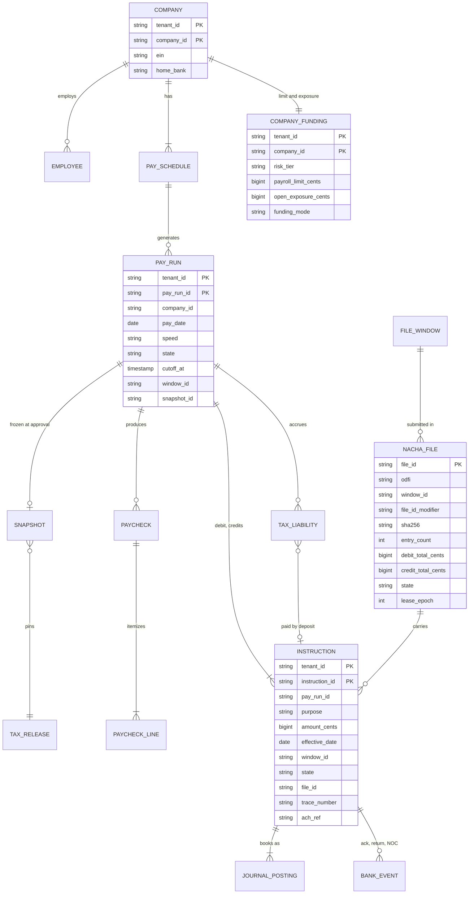

Access patterns, and the key that serves each one:

- **Partitioning.** Everything per tenant is keyed by `tenant_id` and lives on one logical shard: 64 logical shards on 8 Postgres clusters `[estimate]`, placed by a directory so a big tenant can move alone ([`../../concepts/sharding.md`](../../concepts/sharding.md)). A pay run, its paychecks, instructions, journal and the company's funding row are always on one shard, so every money-state change is a single-shard transaction.
- **Approve.** `PAY_RUN` by id `FOR UPDATE` plus `COMPANY_FUNDING` by company `FOR UPDATE`, in one transaction.
- **Runs due.** `PAY_RUN (state, cutoff_at)` per shard, for the planner and the calc barrier.
- **Calc output.** `PAYCHECK` primary key `(tenant_id, pay_run_id, employee_id)`. A recomputed chunk upserts the same keys.
- **Instruction id.** `instruction_id = SHA-256(pay_run_id, snapshot_id, payee_ref, purpose, seq)` truncated to 128 bits, unique. A retried writer produces the same ids and collides instead of duplicating; a re-frozen run (new snapshot) gets new ids, and its old `READY` rows go `SUPERSEDED` under the run lock (§5.4).
- **File building.** Runs, not rows: `PAY_RUN (window_id, state)` per shard, and each run's instructions claimed together under its `PAY_RUN` row lock (§4.3). `INSTRUCTION (pay_run_id, state)` serves the claim.
- **Registry.** In the central rails DB: primary key `file_id`, which is both the builder's `BUILT` insert and the orphan sweep's `VOID` tombstone, so exactly one wins; unique on `(odfi, processing_date, file_id_modifier)`, because File ID Modifiers, the banks' duplicate checks and trace spaces are all per bank. `FILE_WINDOW` rows are per `(odfi, window)`; a company's instructions go to its `home_bank`'s windows. Small: ~20 rows a day.
- **Returns.** A return copies the original entry and adds the original trace number, but no processing date (Nacha Appendix Four as summarized by moov-io; `[verify with the ODFI's return file spec]`), and a 7-digit trace repeats every day. So the returns service decodes the shard from `ach_ref`, reads one row by `(ach_ref)`, and verifies trace, amount and account token. A central trace index stays only as a fallback; trace-based matching misfiled 2.2% and left 3.5% ambiguous in simulation ([`deep-dives/funding-risk-and-returns.md`](deep-dives/funding-risk-and-returns.md) §3).
- **YTD order.** Two runs for one employee can be in flight (a regular run and a bonus run). Approval order defines YTD order: the snapshot records `prior_run_ids`, and a run's calc waits for those runs' paychecks.

**Money is integer cents.** No floats anywhere: rates are decimal strings in the tax release, every product is computed exactly and rounded once per line, half-up unless the jurisdiction's rule in the release says otherwise. One paycheck, biweekly, with numbers to say out loud (the federal and state income tax lines are illustrative outputs of the release's tables):

| Line | Cents | Rule |
|---|---|---|
| Gross pay, 80 h × $25.00 | 200000 | |
| Pre-tax health premium | −10000 | Reduces income tax and FICA wages. The employer pays the carrier itself |
| Social Security, employee | −11780 | 6.2% × 190000 |
| Medicare, employee | −2755 | 1.45% × 190000 |
| Federal income tax withheld | −15200 | Release table + W-4 |
| State income tax withheld | −6118 | Release table |
| **Net pay** | **154147** | $1,541.47 |
| Employer Social Security + Medicare | 14535 | 11780 + 2755 |
| FUTA (0.6% effective) + state unemployment (3.4% illustrative) | 7600 | 1140 + 6460 |
| **Employer taxes** | **22135** | |
| Platform fee `[illustrative]` | 600 | |
| **Employer debit** | **212735** | `154147 net + 35853 employee taxes + 22135 employer taxes + 600 fee` |

Where the $2,127.35 goes: $1,541.47 to the employee, $442.70 to the IRS at the next deposit (`15200 + 2 × 11780 + 2 × 2755`), $11.40 FUTA at the quarterly deposit, $61.18 and $64.60 to the state, $6.00 to us. They sum to 212735 cents. The journal for this run is in §4.3, and the run cannot reach a file unless its postings sum to zero.

---

## 4. High-level design

One subsection per functional requirement. Each traces one request from input to output, grows the same diagram, names the naive option and the number that breaks it, and ends with what is still missing. The design at the end of §4 is deliberately the simple version; §5 breaks it.

### 4.1 Schedule and approve: freeze a snapshot before the cut-off

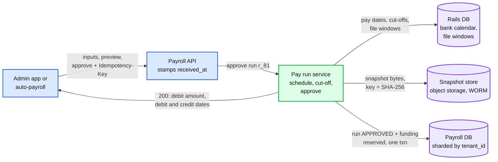

**Flow: Wednesday 14 October 2026, an admin approves a 12-employee biweekly run for Friday 16 October at 4:58 PM PT.**

1. Fourteen days earlier the scheduler created run `r_81` in `DRAFT` from the pay schedule. It asked the rails DB's bank calendar for the cut-off: 2-day speed means "5:00 PM PT two **banking** days before payday", so `cutoff_at = Wed 14 Oct 17:00 PT`, `window_id = 2026-10-14/NIGHT` (our ODFI's cut-off 6:30 PM PT), debit effective Thursday 15 October, credits effective Friday 16 October. Nacha lets a credit be dated up to two banking days after processing and a non-same-day debit one.
2. The admin types hours. Preview runs the same engine in-process on the live inputs and returns 12 paychecks, an employer debit of $25,420.18 and `preview_hash` (~300 ms; a 50k-employee preview is asynchronous, §5.2).
3. Approve. The API gateway stamps `received_at = 16:58:02.120 PT` from our own clock, checks the session (a fresh MFA, multi-factor authentication, for approvals) and forwards.
4. The pay run service writes the **snapshot** to object storage first: every input, each employee's YTD, the `tax_release_id` and `engine_version` the preview used, keyed by its SHA-256. A crash after this step leaves a harmless orphan.
5. One transaction on the tenant's shard: lock `PAY_RUN r_81` (must be `DRAFT` with the same `input_version`) and the company's `COMPANY_FUNDING` row; check `received_at < cutoff_at`; check the run against the payroll limit and reserve the exposure (§5.6); set `APPROVED` and `snapshot_id`; insert an outbox row `run-approved`; commit to the primary and its synchronous standby.
6. The API answers `200` with the debit amount and the debit and credit dates. ~150 ms end to end.

Data model touched: `PAY_SCHEDULE`, `PAY_RUN`, `SNAPSHOT`, `COMPANY_FUNDING`, the outbox.

**What breaks (the naive ladder).**
- *"A cron at midnight computes whatever is due."* The deadline is not midnight. Friday's credits must be inside our ODFI's file by 6:30 PM PT on Wednesday. And calendar-day math is wrong twice a year at least: Monday 12 October 2026 is Columbus Day, a FedACH holiday on which most businesses are open. A Tuesday 13 October payday has its 2-day cut-off on **Thursday 8 October**, not Friday 9 October. Counting calendar days puts the cut-off on Friday: the employer's money no longer arrives a banking day before the credits, and code that adds "2 banking days" to the file date dates the credits Wednesday, a day late.
- *"Approval time is when the row commits."* A click at 4:59:59.5 whose commit lands at 5:00:00.3 is refused because of our own latency. *"Use the client's timestamp"* is forgeable.
- **Chosen:** cut-off and effective dates precomputed per run from the bank calendar; approval time is our edge's receive time, with a hard 120 s commit grace; one compare-and-set transaction that also checks funding; the snapshot frozen at approval.

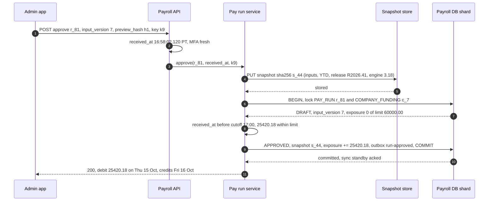

**What is still missing:** the preview's numbers are not yet the authoritative ones. Nothing has been computed from the snapshot, and nothing would survive a worker crash. §4.2.

### 4.2 Calculate: a pure function of the snapshot

```mermaid
%% Incremental diagram, step 2 of 4: a saga per pay run fans the snapshot out to stateless calc workers in chunks. Workers read the pinned tax release and upsert paychecks idempotently.
flowchart LR
    ADM[Admin app or<br/>auto-payroll] -->|"approve"| API[Payroll API]
    API -->|"approve"| PRS[Pay run service]
    PRS -->|"snapshot"| SNAP[(Snapshot store)]
    PRS -->|"APPROVED + outbox"| PDB[(Payroll DB<br/>runs, paychecks)]
    PDB -->|"run-approved via outbox"| SAGA[Pay run saga<br/>Temporal, id = pay_run_id]
    SAGA -->|"calc chunk, at most<br/>500 employees"| CALC[Calc workers<br/>pure engine, last 3 versions]
    CALC -->|"snapshot slice"| SNAP
    CALC -->|"release by id,<br/>cached forever"| TAX[(Tax release store<br/>immutable bundles)]
    CALC -->|"upsert paychecks,<br/>result_hash"| PDB
    SAGA -->|"CALCULATED when<br/>all chunks match"| PDB

    class ADM,API client
    class PRS,SAGA,CALC service
    class SNAP,PDB,TAX store

    classDef client   fill:#dbeafe,stroke:#2563eb,stroke-width:2px,color:#111
    classDef service  fill:#dcfce7,stroke:#16a34a,stroke-width:2px,color:#111
    classDef store    fill:#ede9fe,stroke:#7c3aed,stroke-width:2px,color:#111
```

**Flow: run `r_81` is calculated.**

1. The outbox relay starts a workflow with id `r_81`. A duplicate start (relay retry) is rejected by Temporal's id-reuse policy, so there is one saga per run.
2. The saga waits until every run in the snapshot's `prior_run_ids` is calculated (YTD order), then splits the employees into chunks of at most 500. `r_81` is one chunk; a 50k-employee run is 100.
3. A calc worker takes the chunk activity. It loads the snapshot slice and the tax release `R2026.41` (cached in memory by id; releases never change, so the cache is never invalidated) and runs the engine version the snapshot names. Workers keep the last 3 engine versions loaded.
4. For each employee, the engine runs a fixed pipeline: earnings (hours × rate, overtime, bonuses), pre-tax deductions, taxable wages per tax, each tax, post-tax deductions and garnishments, net pay, then employer taxes. Flat-rate taxes (Social Security, Medicare, FUTA, state unemployment) are computed **on YTD** and trued up: `this_period = round(rate × YTD_wages) − YTD_withheld`, capped at the wage base ($184,500 for Social Security in 2026). Income tax withholding is per period (annualize, apply the release's table and the W-4), so it has no true-up: a missed table change is fixed only by an explicit **catch-up line** in a later run of the same calendar year, because Pub 15 lets the employer recover under-withheld tax from the employee only until 31 December. No clock reads, no network calls, no floats.
5. The worker upserts `PAYCHECK` and `PAYCHECK_LINE` keyed `(tenant_id, pay_run_id, employee_id)` with a `result_hash`, 100 paychecks per statement. A recomputed paycheck with the same hash is a no-op; a different hash for the same key is a determinism bug and pages.
6. When all chunks are done, the saga recomputes the run totals and compares them with `preview_hash`. Same inputs, same release, same engine: they must match. It sets `CALCULATED`.

Data model touched: `PAYCHECK`, `PAYCHECK_LINE`, `TAX_RELEASE`, `PAY_RUN.state`.

**What breaks (the naive ladder).**
- *"Calculate inside the approve request."* At ~10 ms a paycheck, a 500-employee company is a 5 s request and a 50k-employee one is 500 s. A crash halfway leaves half a payroll and no record of which half.
- *"Floats, and round each period."* `0.1 + 0.2 != 0.3` in binary floating point. Even with exact decimals, rounding per period drifts: a weekly wage of $868.88 withholds $53.87 of Social Security each week, `52 × 53.87 = $2,801.24`, while 6.2% of the year's $45,181.76 is $2,801.27. Three cents per employee per year is ~$300k a year across 10 M employees of mismatches between withholding and the year-end forms.
- *"Look up the current tax table at calc time."* A retry after a table update produces a different paycheck than the one the admin approved.
- **Chosen:** chunked, idempotent activities running a pure function of `(snapshot, tax release, engine version)` in integer cents, with a YTD true-up for flat-rate taxes and catch-up lines for withholding. Details in §5.4 and [`deep-dives/gross-to-net-calc-and-tax-tables.md`](deep-dives/gross-to-net-calc-and-tax-tables.md).

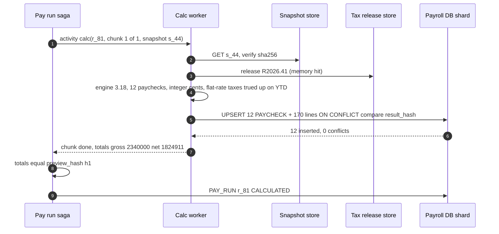

**What is still missing:** paychecks exist, but no money has moved and nothing guarantees it will move exactly once. §4.3.

### 4.3 Move money exactly once: instructions, then files, then the bank

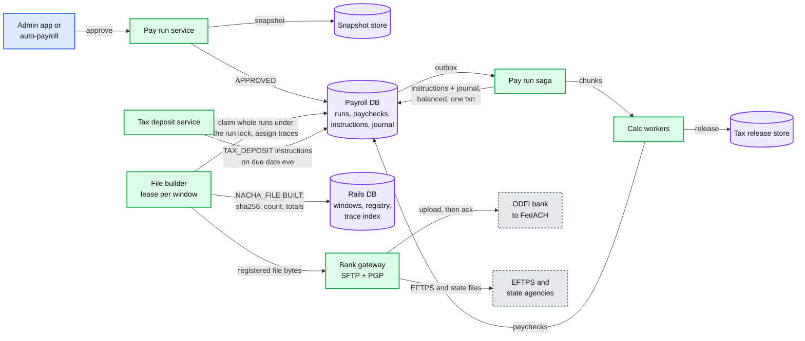

New boxes: the instruction ledger and journal (inside the payroll DB), the file builder, the registry (rails DB), the bank gateway, the tax deposit service.

**Flow: run `r_81`'s money leaves on Wednesday night.**

1. **Instruct.** The saga runs one transaction on the tenant's shard. It inserts one `EMPLOYER_DEBIT` (effective Thursday), 12 `NET_PAY` credits (effective Friday) to tokenized accounts, and one `TAX_LIABILITY` per agency with a due date from the company's depositor schedule (a semiweekly depositor's Friday payday is due the following Wednesday, IRS Notice 931). Every `instruction_id` is `H(pay_run_id, snapshot_id, payee_ref, purpose, seq)`, and every instruction gets its `ach_ref`. It writes the journal entry and asserts the run balances: `debit = Σ net + Σ liabilities + fee`. Then all instructions go `READY` for window `2026-10-14/NIGHT`. Inserts are `ON CONFLICT DO NOTHING`; a conflicting id with a different amount stops the run and pages.
2. **Cut-off and calc barrier.** At 5:00 PM PT the window stops taking approvals (plus the 120 s commit grace). The scheduler waits until every run approved for the window is `INSTRUCTED`. Calc runs continuously during the afternoon, so this is normally ~5:05 PM; the design limit is 5:30 PM.
3. **Claim whole runs.** The file builder takes the window's lease in the rails DB (its epoch is an early exit, not the arbiter). On each shard it claims **runs, not rows**: one transaction locks the `PAY_RUN` row, requires every instruction of the run `READY`, moves all of them to `CLAIMED` in file F, assigns trace numbers, and checks the affected row count equals the run's instruction count. Every other writer (cancel, risk hold, tax re-freeze, an ops pull, `VOID_BEFORE_FILE`) takes the same lock and the same all-`READY` rule, so a run never straddles two files or loses a row to a racing writer. Row-level chunks split 6,447 runs in simulation ([`deep-dives/exactly-once-money-movement.md`](deep-dives/exactly-once-money-movement.md) §4).
4. **Build and register.** It writes the bytes deterministically: one batch per company and entry class (a CCD debit from the employer, PPD credits to employees, the employer's name on the batch), file header with the next File ID Modifier, batch and file control totals. The bytes go to WORM object storage. Then it inserts `NACHA_FILE(F, BUILT, sha256, entry_count, totals)` on the registry's primary key `file_id`. If an orphan sweep already tombstoned F as `VOID`, the insert fails and the builder exits (§5.3). **No file is uploaded unless its registry row exists in `BUILT`.**
5. **Upload.** The bank gateway moves the file `BUILT → UPLOADING → UPLOADED` around one SFTP put, then waits for the ODFI's acknowledgement (file name, entry count, totals; typically 5 to 15 minutes `[estimate]`) and sets `ACKED`. The file's instructions become `SENT`. That acknowledgement is the saga's **pivot**: after it, a run can only be corrected. A customer cancel is already refused once the run is claimed (`409 IN_FILE`); between the claim and the acknowledgement, only an ops void of a still-`BUILT` file (dual control) can pull a run back.
6. **Settle.** FedACH settles the debit on Thursday at 8:30 AM ET and the credits on Friday at 8:30 AM ET. ACH has no "delivered" message: an entry is `SETTLED` on its settlement date and stays so unless a return arrives. The bank's daily statement reconciles the settlement account to our journal.
7. **Tax deposits.** On the eve of each due date the tax deposit service turns due liabilities into `TAX_DEPOSIT` instructions, one per (EIN, agency, due date), id `H(company, agency, period, due_date)`, through the same registry and gateway. Due dates come from the depositor schedule **unless the $100,000 next-day rule applies** (IRS Pub 15): a payday with $100k or more of federal liability is due the next business day. That is any run with a ~$476k debit (~280+ employees); the 50k-employee tenant has ~$17.6 M due the next business day every payday, and one day late at 2% is ~$350k. Due dates use the **DC legal-holiday calendar** (Pub 15), not the FedACH one (§5.1). Federal deposits go through EFTPS: a deposit over $1 M must be submitted by 8 PM ET the day before the due date, so every federal deposit is submitted the day before, with no reliance on EFTPS same-day.

The journal for the one-paycheck example in §3.3 (cents; the run's other paychecks add the same shape):

| Event | Debit | Credit |
|---|---|---|
| Run instructed | Employer receivable 212735 | Net pay payable 154147, IRS payable 44270, FUTA payable 1140, state withholding payable 6118, state unemployment payable 6460, fee revenue 600 |
| Employer debit settles, Thursday | Settlement bank 212735 | Employer receivable 212735 |
| Net pay settles, Friday | Net pay payable 154147 | Settlement bank 154147 |
| IRS deposit, next Wednesday | IRS payable 44270 | Settlement bank 44270 |

Data model touched: `INSTRUCTION`, `JOURNAL_POSTING`, `TAX_LIABILITY`, `NACHA_FILE`, `FILE_WINDOW`, the trace index.

**What breaks (the naive ladder).**
- *"Call the bank's API for each paycheck."* Most ODFIs take NACHA files over SFTP, and the peak night is 6.6 M entries. Even where a per-payment API exists, it does not make a retry safe after an unknown outcome.
- *"Build and upload in one step, retry on error."* An SFTP put that times out after the bytes arrived is re-sent. Every employee in a 1 M-entry file is paid twice: ~$1.2 B, for one retry.
- *"Use an idempotency key."* SFTP has none. Payments APIs keep keys about a day (Stripe prunes keys after at least 24 hours, Modern Treasury keeps results 24 hours), while returns arrive up to 2 banking days later and reversals up to 5.
- **Chosen:** an instruction ledger with deterministic ids, whole-run claims under the run lock, a registry row (primary key, tombstone-able) written before the upload, and an unknown upload resolved by asking the bank. §5.3 and [`deep-dives/exactly-once-money-movement.md`](deep-dives/exactly-once-money-movement.md).

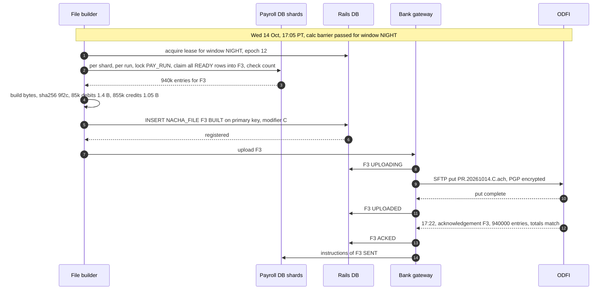

**What is still missing:** everything that comes back. Returns (an employee closed their account), notifications of change, our own mistakes, and the employer's debit that bounces after the employees were paid. §4.4.

### 4.4 Retry and repair: forward-only corrections

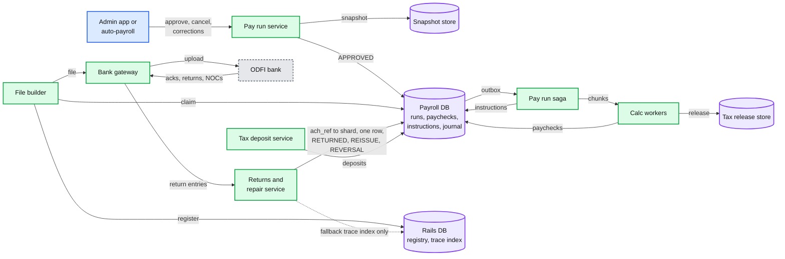

New box: the returns and repair service. The bank gateway now also reads the ODFI's outbound folder.

**Flow: Monday 19 October 2026, the ODFI's morning return file carries one R03 and one R01 (the R01 is `r_81`'s debit, settled Thursday 15 October).**

1. The bank gateway polls the ODFI's outbound folder every minute `[estimate]`, stores the raw file in WORM storage, and parses it. Each return entry carries the original trace number.
2. The returns service decodes `ach_ref` from the copied entry's Identification Number to a shard, reads the instruction by it, verifies trace, amount and account token, and inserts a `BANK_EVENT` keyed `(file sha256, line number)`, so a re-delivered return file is a no-op. No central lookup sits on this path.
3. **R03 (no account) on a `NET_PAY` credit.** The instruction goes `RETURNED`. Journal: debit settlement bank, credit net pay payable: the money is back with us and still owed to the employee. The admin and the employee are notified. When the employee fixes the account, a `REISSUE` instruction with id `H(original_id, REISSUE, 1)` joins the next window; before 10:30 AM ET that can be the morning same-day window. A NOC (notification of change) updates the account token without any money moving.
4. **R01 (insufficient funds) on the `EMPLOYER_DEBIT`.** The instruction goes `RETURNED`. Journal: debit employer receivable, credit settlement bank: the employer now owes us the whole run, and the employees keep their pay. The company's tier moves to `HOLD`: its next run needs wire prefunding. Collections reinitiates the debit once the employer confirms funds (Nacha allows at most two reinitiations for R01 and R09) or takes a wire, and the credit team gets a case. §5.6.
5. Each run's saga sleeps on a timer until its debit's return window has closed (opening of business on the second banking day after settlement, plus a buffer for the bank's file timing), then moves the run to `CLOSED` and releases the exposure. `CLOSED` is not final: a late R31 or R06 on the debit (accepted by us), or an R11 on one of our reversals within 60 days, re-opens a receivable.

**Corrections follow time** ("$10,000 instead of $1,000", Flow 6). Before the file: cancel, recalculate, re-approve. In an acknowledged file but not settled: ask the ODFI to pull the entry, a phone call whose answer depends on the bank and the hour `[estimate]`. Settled, within 5 banking days: a Nacha reversal, which must carry the original's **identical** amount, so the full $10,000 is reversed, and the new $1,000 credit is sent only after the reversal settles and its return window passes. After that: no ACH remedy; the employer recovers from the employee, inside wage-deduction law.

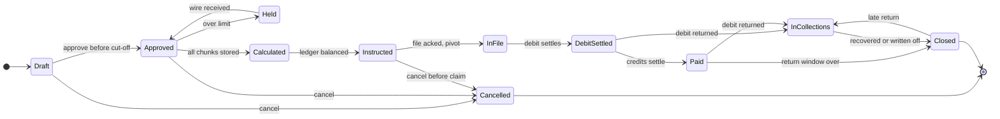

Data model touched: `BANK_EVENT`, `INSTRUCTION.state`, new `REISSUE` and `REVERSAL` instructions, reversing `JOURNAL_POSTING` rows, `COMPANY_FUNDING`.

**What breaks (the naive ladder).**
- *"Fix the paycheck row and re-run."* After the file, the re-run's credits are a second payment, and the original row no longer says what was paid.
- *"Delete the wrong instruction."* The audit trail is gone, and the registry still says the bank has it.
- *"The employer's debit bounced, reverse the employees' credits."* A Nacha reversal is only for an erroneous entry (wrong amount, account or date, or a duplicate). An employee's RDFI can return an improper reversal (R11 for consumers, R17), and the employees did nothing wrong.
- **Chosen:** forward-only corrections. Every repair is a new instruction with an id derived from the one it repairs, plus reversing journal postings. The saga's pivot is the file acknowledgement.

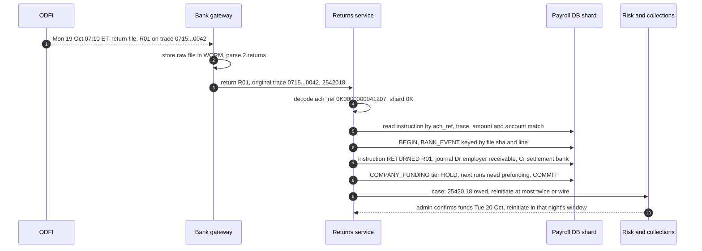

**What is still missing:** the design works for one run. It does not yet survive the Wednesday cliff, a 50k-employee tenant, an upload that times out at 6:05 PM, a tax engine change, an outage in the last hour, or a fraudulent new company. §5.

---

## 5. Deep dives

One per non-functional requirement, phrased as the interviewer asks it. Each names what breaks in the §4 design with a number, fixes it, and lists what changed. The red node across all of them is the same: **the file builder and bank gateway at the ODFI cut-off**. Everything the night's money needs funnels through it, at a time someone else owns.

### 5.1 "A run approved before its cut-off is in the right file, every time": deadlines and ACH windows

**What breaks in the current design.**
1. **One drop, one moment.** After 5:00 PM PT the night window needs the calc barrier, the build, the upload and the acknowledgement before 6:30 PM PT. Worst case: 30 min of calc tail, ~15 min of build, ~15 min of upload and acknowledgement. That leaves ~30 min of slack, and one unknown upload (§5.3) can consume 20 of them.
2. **Cut-offs computed ad hoc.** If each service computes "two banking days before payday" itself, one of them will get Columbus Day, a daylight-saving change or a Friday holiday wrong.
3. **No plan for missing.** If the night file misses, the §4 design has no answer except "employees are paid late".
4. **Auto-payroll fires together.** If every auto-payroll company approves at "cut-off minus 1 hour", ~40% of a night's runs `[estimate]` arrive in one minute.
5. **Same-day is tighter still.** A 7:00 AM PT (10:00 AM ET) customer cut-off against FedACH's 10:30 AM ET deadline leaves our ODFI's cut-off around 10:15 AM ET `[estimate]`: 15 minutes for everything.

**The fix: plan backwards from the bank's windows.**
- **Windows are data.** A daily job writes `FILE_WINDOW` rows from the FedACH schedule plus the ODFI contract. Every internal milestone is derived backwards from the ODFI cut-off: `upload_by = cutoff − 30 min`, `build_by = upload_by − 15 min`, `calc_barrier = build_by − 15 min`, `customer_cutoff = calc_barrier − 30 min`. For the night: 6:30 → 6:00 → 5:45 → 5:30 → 5:00 PM PT. Each ODFI has its own windows and milestone chain from its own `odfi_cutoff_at`; the one customer cut-off is taken from the **earlier** bank's chain. **The customer cut-off is an output of the plan, not an input.**

| Our speed | Customer cut-off | Window used | ODFI cut-off `[estimate]` | FedACH deadline | Settles |
|---|---|---|---|---|---|
| 4-day, 2-day, next-day | 5:00 PM PT | Overnight, future-dated | 6:30 PM PT (9:30 PM ET) | 10:45 PM ET (8:00 PM ET also exists, Sunday to Thursday only) | 8:30 AM ET on the effective date |
| Same-day | 7:00 AM PT on payday | Same-day window 1 | 10:15 AM ET | 10:30 AM ET | 1:00 PM ET |
| Fallback | none | Same-day window 2 | 2:30 PM ET | 2:45 PM ET | 5:00 PM ET |
| Fallback | none | Same-day window 3 | 4:30 PM ET | 4:45 PM ET | 6:00 PM ET |

- **Calculate at approval, build at the cut-off.** Calc keeps up with approvals all afternoon, so the barrier normally passes by ~5:05 PM. The 30-minute budget is the worst case, and the fleet is sized for it (§2).
- **Cancel until the cut-off, so build after it.** Customers can cancel until 5:00 PM (QuickBooks' Canadian timeline says the same: cancellation cut-off equals the submission deadline). So the night's files are built only after the cut-off, not trickled through the afternoon. Building is fast (~6.6 M rows read from 64 shards, a few minutes); the risk is the bank, which trickling would not remove.
- **A dry run at 4:00 PM PT, and a probe of the real bank path.** Build the night's files from the runs approved so far into scratch storage, validate format and control totals, never upload: a format bug is found 2.5 hours early. The dry run never touches the bank, so an SFTP probe also runs every 5 minutes from 3:00 PM PT (connect, list, a marker file where the bank allows one), with alarms on PGP key and SSH host key expiry 30 days ahead.
- **Jittered auto-payroll.** Auto-payroll approves at a per-tenant time between 9 AM and 3 PM PT on cut-off day (hash of tenant id), not at the cut-off.
- **The edge decides 4:59:59.** `received_at` from our gateway decides; the commit may land up to 120 s later (§5.5). After 5:00:00.000 PT the API answers `409 CUTOFF_PASSED` with the options: next-day speed if the tier allows and Thursday's cut-off is open, or a later pay date.
- **Two calendars.** FedACH holidays drive every money date (pay dates, cut-offs, effective dates, return windows); a payday on a bank holiday moves to the previous banking day by default. **IRS deposit due dates use DC legal holidays** (Pub 15), which include days the Fed is open (16 April, 3 July 2026). A semimonthly Monday 15 February 2027 payday moves to Friday 12 February, and its deposit is due Thursday 18 February; computing from the nominal Monday gives Friday 19 February, one day late, 2%. Christmas (Friday 25 December 2026) and New Year's Day (Friday 1 January 2027) both fall on Fridays, so Friday payrolls move to Thursday and their 2-day cut-offs to Tuesday, two weeks running. The second move **changes the tax year**: wages paid Thursday 31 December count for 2026 (wage base, YTD, W-2, the Q4 941), so the snapshot is frozen from the actual pay date, the admin is warned before approving, and "next banking day" (Monday 4 January) is offered instead. Worked rows: [`deep-dives/deadlines-and-ach-windows.md`](deep-dives/deadlines-and-ach-windows.md) §3.
- **A fallback ladder per speed.** A 2-day run that misses Wednesday's night file goes into Thursday's night file with credits still effective Friday, at no cost to employees: the debits (~$1.4 B for one ~940k-entry file) settle a day later, so exposure grows by a day. If that misses, Friday's same-day window 1 settles credits at 1:00 PM ET. **So the riskiest night is Thursday, not Wednesday:** its file carries the next-day runs for Friday (~1.1 M paychecks on a normal week, ~1.85 M at the design peak, assuming 25% next-day `[estimate]`) and has no night-file fallback. Next-day runs have one fallback (Friday's same-day windows) and same-day runs have windows 2 and 3. A same-day fallback costs the same-day entry fee (5.2 cents per entry, paid by the ODFI to the RDFI under the Nacha rule) and every same-day entry must be **at most $1 M**: a larger employer debit cannot ride a same-day window and needs a wire.
- **Countdown alerts.** Any window not `ACKED` at ODFI cut-off minus 60, 30 and 15 minutes pages (Thursday from T−90), then escalates to the bank's ACH operations desk. At T−30 a **completeness check** also pages unless the window's instructions not cancelled equal the entries in its registered files: a stranded claim never shows up as an `UNKNOWN` file.

```mermaid
%% The design-peak night, planned backwards from the ODFI cut-off. The critical tasks are the calc barrier and the upload: if either slips past its milestone, the fallback ladder starts.
gantt
    title Wednesday 28 October 2026, overnight window, times in PT
    dateFormat HH:mm
    axisFormat %H:%M
    todayMarker off
    section Customers
    Approvals bunch, about 5 M paychecks      :a1, 15:00, 120m
    Customer cut-off plus 120 s grace         :milestone, m1, 17:00, 0m
    section Calc
    Calc keeps up with approvals              :c1, 15:00, 122m
    Calc barrier, worst case                  :crit, c2, 17:00, 30m
    section Files
    Dry run build and validate, no upload     :d1, 16:00, 15m
    Build about 7 files and register them     :b1, 17:30, 15m
    Upload and wait for acknowledgements      :crit, u1, 17:45, 15m
    Slack for one retry or asking the bank    :s1, 18:00, 30m
    Earlier ODFI cut-off 1830 PT              :milestone, m2, 18:30, 0m
```

**Red node:** the file builder and bank gateway. The gantt's critical tasks are its inputs and its upload.

**Push back on the textbook answer.** "Run payroll as a nightly batch job on Spark." Calc is a pure function per run, triggered at approval, and the whole design peak is ~33 cores for 30 minutes. The only real batch is file building, and it takes minutes. A cluster framework adds a scheduler, a shuffle and a new failure mode inside a 90-minute window to do work one autoscaled pool already does.

**What changed.** `FILE_WINDOW` gains `odfi_cutoff_at`, the derived milestones and `fallback_window_id`; `PAY_RUN` gains `fallback_window_id`; auto-payroll gets jitter; a 4:00 PM dry run and the SFTP probe; countdown alerts (Thursday T−90) and the completeness check; a DC-holiday calendar for deposits. The API gains `409 CUTOFF_PASSED` with options. [`deep-dives/deadlines-and-ach-windows.md`](deep-dives/deadlines-and-ach-windows.md).

### 5.2 "3 M paychecks in 2 hours, and one tenant has 50k employees": the batch at scale

**What breaks in the current design.**
1. **Saga history size.** The obvious fan-out is one activity per employee. At the design peak that is 6 M activities and ~18 M workflow state transitions in 30 minutes (~10k/s), and a 50k-employee run is ~150k history events, past Temporal's 51,200-event limit for one workflow run.
2. **Preview shares the fleet.** A scripted integration hammering preview 1,000 times a minute competes with authoritative calc in the last hour, and one full preview of a 50k-employee tenant is 500 CPU-seconds.
3. **One FIFO queue.** A run due at the 5:00 PM cut-off can wait behind work due tomorrow.
4. **Writes, not CPU.** A backlog after a 45-minute calc outage drains at the fleet's speed (~10k paychecks/s) and peaked clusters at ~35k to 51k rows/s in simulation, against ~8k sized (§2). The big tenant's run alone writes ~1 M rows (50k paychecks × 20) into a shard it shares with ~15k small tenants.
5. **The big tenant's file.** 50k credits from one tenant sit in a file with 900k other entries. If its batch has a malformed field and the bank rejects the file, ~80k other companies miss payday.
6. **The big tenant's money.** 50k × $1,680 = ~$84 M in one employer debit: over any sensible ACH exposure limit and far over the $1 M same-day cap.

**The fix.**
- **Chunks of at most 500 employees.** One activity per chunk: a 50k run is 100 activities and ~300 history events. About 99% of runs fit in one chunk `[estimate]`. Peak: ~600k runs × ~25 transitions = ~15 M transitions over ~2.5 hours, ~1.7k/s on average and ~6k/s in the final 15 minutes `[estimate]`. Size Temporal's persistence for 10k/s. If that ever gets close, the fan-out moves to a plain work queue and the saga keeps only the run-level steps.
- **Two pools.** Authoritative calc and preview run on separate worker pools and task queues. Preview is budgeted in **CPU-seconds per tenant**, not requests, and is the first thing shed in the last hour. A big tenant's preview is asynchronous and incremental: only employees whose inputs changed since the last preview (by `input_version`) are recomputed.
- **A per-cluster write budget.** The dispatcher holds a token bucket of rows per second per physical cluster (~20k rows/s `[estimate: set by a load test]`) and charges `paychecks × 20` per chunk before dispatch. Earliest deadline first decides the order; the budget decides how fast each cluster absorbs it, so a drain never becomes a failover ([`deep-dives/multi-tenant-batch-and-retries.md`](deep-dives/multi-tenant-batch-and-retries.md) §4).
- **Earliest deadline first.** Authoritative calc tasks carry their window's `calc_barrier`. Workers poll the queue for the nearest deadline first, so tomorrow's work never delays tonight's.
- **Per-tenant fairness.** At most 20 in-flight chunks per tenant `[estimate]`. The 50k run uses 20 workers' worth, each chunk takes ~5 s (500 × 10 ms), and the run finishes in ~25 s without starving anyone.
- **Big tenants get their own placement.** A tenant above ~5k employees `[estimate]` moves to its own logical shard (a directory move, [`../../concepts/sharding.md`](../../concepts/sharding.md)) and its own NACHA file per window (a "file group"), so a rejected batch hurts only that tenant. Its debit is funded by wire or by a negotiated credit line, never as a plain next-day ACH debit (§5.6). Its ~$17.6 M of federal liability per payday falls under the $100,000 next-day deposit rule every payday (§4.3). Its legal entities are separate companies with their own EINs, so tax deposits stay per employer.
- **Pre-scale by calendar.** Calc goes from 4 pods to 25 from 2 PM PT on cut-off days; month-end Wednesdays get 40. No reactive autoscaler sits on the critical path.

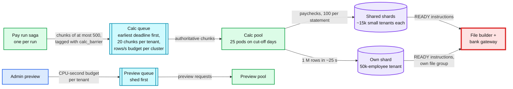

**Push back on the textbook answer.** "Partition the batch on Kafka and run a stream processor." The work is ~33 cores for 30 minutes, already partitioned by tenant, and each unit is a pure function with an idempotent write. A durable queue with deadline ordering and per-tenant caps is all the batch needs. What a stream processor adds (state, checkpoints, rebalancing) is exactly what a pure function does not need.

**What changed.** Chunked activities; separate calc and preview pools with CPU-second budgets and incremental preview; deadline-ordered queue with per-tenant caps and a per-cluster write budget; calendar pre-scaling; big-tenant placement (own shard, own file group, wire funding, next-day deposits). [`deep-dives/multi-tenant-batch-and-retries.md`](deep-dives/multi-tenant-batch-and-retries.md).

### 5.3 "The upload timed out. Did the bank get it?": exactly-once money movement

**What breaks in the current design.**
1. **A blind retry.** At 6:05 PM PT the SFTP put of file `C` (~940k entries, ~$2.4 B) times out after the bytes were streamed. A generic retry re-sends. If the first put landed, the bank has the file twice. If the retry rebuilt the file (new File ID Modifier, new creation time), the bank sees two different files and every employee in it is paid twice: ~$1 B of duplicate credits.
2. **A paused builder.** A file builder stalls in a 40 s pause, its lease expires, a second builder takes over and re-claims some rows. The first one wakes up and uploads what it built.
3. **Crashes and races between steps.** Rows `CLAIMED` for a file that was never registered; a file registered but never uploaded; a sweep that frees rows while a slow builder registers their file; a risk hold or re-freeze touching rows mid-claim. 175,120 interleavings of the protocol as first written gave 53,717 bad outcomes, 102 of them double payments ([`deep-dives/exactly-once-money-movement.md`](deep-dives/exactly-once-money-movement.md) §4).
4. **A late acknowledgement.** The bank's acknowledgement job is slow, and silence looks like failure.

**The fix.**
- **The upload is at-most-once per file, and states say so.** `BUILT → UPLOADING → UPLOADED → ACKED`, or `REJECTED`. Any exception during the put moves the file to **`UNKNOWN`**, never to "failed".
- **`UNKNOWN` is resolved by asking, in this order:** list the remote folder for the exact file name and size; wait for the acknowledgement up to 20 minutes `[estimate]`; query the bank's file-status API or portal; phone the ODFI's ACH operations desk. Before the ODFI cut-off, a confirmed "not received" allows a re-upload of the **same bytes** (same name, File ID Modifier and SHA-256). **After the cut-off nothing is re-sent that night**: the bank can still forward a file until FedACH's last future-dated deadline (2:15 AM ET), so any answer before then can change. A file that reached `UPLOADING` is never rebuilt, except through a terminal **`NOT_RECEIVED`** state, set only when the bank's answer is final after 2:15 AM ET; its runs then return to `READY` and are rebuilt under a new File ID Modifier for the fallback window, which for 2-day runs is Thursday's night file at no cost to employees.
- **One arbiter row per decision.** The lease row `(window, holder, epoch, expires_at)` lives 30 s and is renewed every 10 s ([`../../concepts/leases-fencing-clocks.md`](../../concepts/leases-fencing-clocks.md)), but the epoch is only an early exit: no step spans two databases atomically, so each decision is one row. A run's claim is decided by its `PAY_RUN` lock (§4.3), a file's existence by the registry primary key, and its upload by a conditional update (`UPDATE nacha_file SET state = 'UPLOADING' WHERE file_id = F AND state = 'BUILT'`). The gateway re-reads the registry state immediately before every put.
- **Orphan sweep, tombstone first.** For a file id claimed under an older epoch with no registry row, the new lease holder first inserts `NACHA_FILE(F, VOID)` on the primary key, and frees F's rows only if that insert wins; a stale builder's later `BUILT` insert then fails on the same key. The sweep repeats until the completeness check passes. Older-epoch files already `BUILT` are adopted (`BUILT → UPLOADING`) or voided (`BUILT → VOID`) by conditional update, so exactly one wins; files in `UPLOADING` or later go to the ask-the-bank path, never to the sweep. With run claims and the tombstone, the 175,120 interleavings give 0 bad outcomes.
- **Three-way reconciliation and completeness.** Acknowledged totals = registry totals = sum of the file's instructions, per file, within minutes. Window instructions not cancelled = entries in its registered files, at T−30. The bank's daily statement = the journal's settlement account, per day. Any break pages.
- **The bank's checks are the backstop, not the plan.** The File ID Modifier is unique per processing day ("to allow for thorough duplicate file identification", ACH developer guide). Our ODFI runs duplicate-file checks. An RDFI can return R24 (duplicate entry). We never rely on any of them.

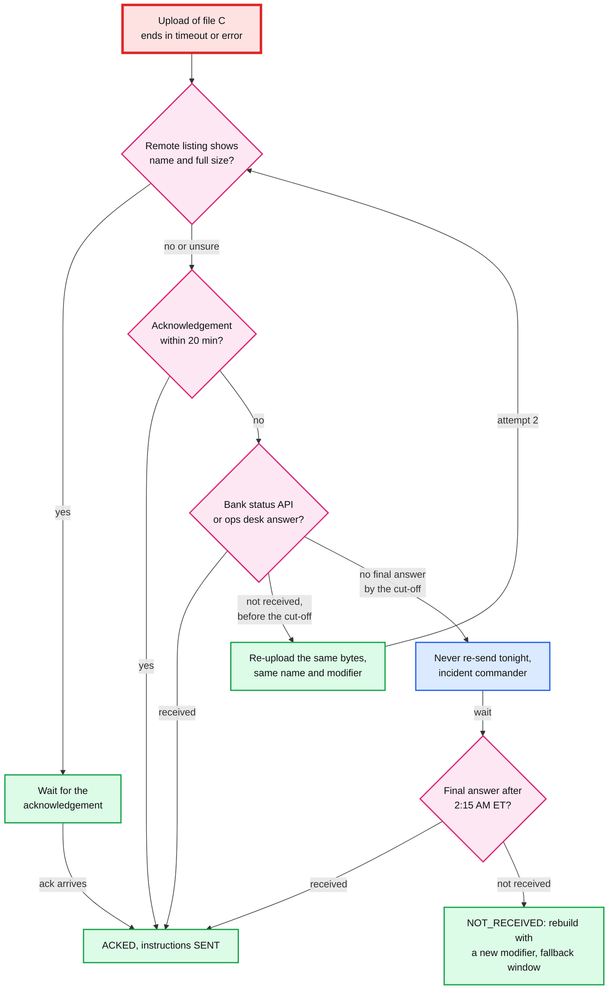

**Push back on the textbook answer.** "Make the downstream idempotent and retry with exponential backoff." We cannot make a bank's SFTP server idempotent, and backoff-and-retry is exactly the wrong reflex for a side effect that is not idempotent. The correct composition is: instruction to file is exactly-once (deterministic ids plus claims), file to bank is at-most-once (registry plus states plus asking), and reconciliation proves the result. "Use the bank API's idempotency key" has the same flaw in time: those keys live about a day (Stripe prunes after at least 24 hours, Modern Treasury keeps 24 hours), and our registry lives 7 years.

**What changed.** `NACHA_FILE.state` gains `UNKNOWN`, `VOID` and `NOT_RECEIVED`; whole-run claims under the `PAY_RUN` lock for every writer; the tombstone-first orphan sweep; per-file, per-window and daily reconciliation; a runbook for asking the bank. [`deep-dives/exactly-once-money-movement.md`](deep-dives/exactly-once-money-movement.md), [`../../concepts/exactly-once.md`](../../concepts/exactly-once.md).

### 5.4 "Every paycheck reproducible to the cent, and a tax change must not break 10 M paychecks": deterministic calc

**What breaks in the current design.**
1. **Hidden inputs.** The engine reads the wall clock for "today", a cached table that changed, or iterates a hash map whose order differs between processes. The same snapshot gives two answers.
2. **Rounding in the wrong place.** Overtime at $23.15 × 1.5 = $34.725 an hour. Rounding the rate first gives `10 h × $34.73 = $347.30`; rounding once at the end gives $347.25. Five cents, in thousands of paychecks, and a wage claim.
3. **A mid-quarter table change.** A state publishes a new withholding table on Friday 26 June, effective for wages paid from Wednesday 1 July. Run `r_95` was approved on 25 June for a 2 July pay date and pinned the release before it.
4. **An engine change that silently moves 10 M paychecks.** Unit tests pass, and a bracket boundary is off by one cent for a subset of states.

**The fix.**
- **A determinism contract.** The engine is `calc(snapshot, release, engine_version) → paychecks`. Banned inside it: the wall clock (the pay date comes from the snapshot), randomness, network calls, floats, unordered iteration, locale. A lint rule enforces the list, and CI runs every golden snapshot twice in different processes and compares hashes.
- **Exact money.** `int64` cents; rates are decimal strings in the release; products are exact decimals rounded **once per line** by the line's rule in the release (half-up by default, whole dollars where an agency's table says so).
- **YTD true-up for flat-rate taxes, catch-up lines for withholding.** Social Security, Medicare, FUTA and state unemployment are `round(rate × YTD_wages) − YTD_withheld`, capped by the wage base: the weekly $868.88 example in §4.2 withholds $53.88 in weeks 9, 27 and 45 and ends the year at exactly $2,801.27, and Form 941's fractions-of-cents line stays near zero. Income tax withholding is per period, so a missed table change needs an explicit catch-up line in a later run of the same calendar year; after 31 December the employer owes the underpayment (Pub 15).
- **Releases pick tables by pay date.** A release is immutable, content-addressed, signed, and contains every table's full history with `effective_from` by pay date. The snapshot pins the release the admin previewed; inside it, the pay date picks the table. When the 26 June release lands, it is marked `supersedes: state X, pay dates from 1 July`. An affected run is re-frozen only if all its instructions are still `READY` under the run lock **and** its cut-off is more than ~2 hours away (re-freezing thousands of runs at 4:55 PM would compete with the approval minute): one shard transaction marks the old instructions `SUPERSEDED`, writes the new snapshot's set (new ids, since the id includes `snapshot_id`), re-checks the balance and re-reserves exposure. The admin is told net pay moved; a withholding change shifts money between net pay and the tax liability, so the **employer debit does not move** unless an employer-side rate (state unemployment) changed. Every other affected run gets a catch-up line in its next run. **Proof:** the snapshot names the release, the release is immutable, and a replay reproduces the stored `result_hash`.
- **Testing an engine change against history.** (1) **Golden replay:** last quarter's ~82 M paychecks (`330 M ÷ 4`) on their own snapshots and releases, `82 M × 10 ms = 825k core-seconds`, **~2.3 hours on 100 cores**. Every diff must fall inside the change's declared intent ("only lines of type X in state Y"); anything else blocks the release. (2) **Shadow** for one full pay cycle: compute both versions on live approvals, pay with the old one, diff. (3) **Cohorts** by tenant: 1%, 10%, 50%, 100% over 4 weeks. The engine version is pinned per snapshot, so a rollback only changes new approvals, and every old run still reproduces.

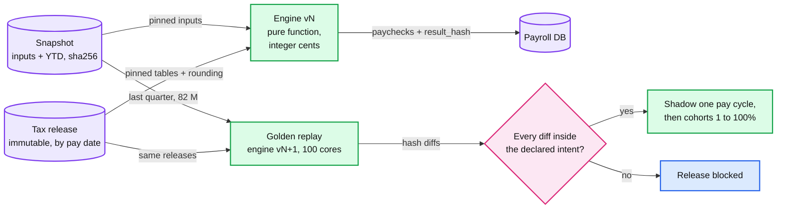

No new red node: calc correctness does not break under load. It breaks under change, and the replay gate is its control.

**Push back on the textbook answer.** "Event-source the paycheck and recompute it whenever you need it." Recompute proves and tests; it is never the record of what was paid. The record is the stored paycheck, the instruction and the bank's file, because the law (a W-2, a 941) cares what was withheld, not what today's engine thinks should have been.

**What changed.** The engine contract and lint; `result_hash` per paycheck; releases with `supersedes`; re-freeze with `SUPERSEDED` instructions and a 2-hour margin; catch-up lines; the replay, shadow and cohort pipeline. [`deep-dives/gross-to-net-calc-and-tax-tables.md`](deep-dives/gross-to-net-calc-and-tax-tables.md).

### 5.5 "99.95% in the 4 hours before the cut-off; late is worse than slow": availability

**What breaks in the current design.** 99.95% of a 4-hour window is **7.2 seconds**, and a Postgres primary failover alone takes ~30 s `[estimate]`. So the target cannot mean "nothing fails". It must mean "no approval is lost or refused while something fails".
1. **The approve path has too many dependencies.** If it waits on calc, Temporal or the preview fleet, any of them being slow makes approvals slow.
2. **A shard primary dies at 4:59:50 PM.** The approval's commit fails at 5:00:10 PM, after the cut-off.
3. **A deploy at 4:30 PM** ships a bug into the approval minute.
4. **A retry storm.** Admins double-click and the UI retries, multiplying the final minute's ~700/s.
5. **A region is lost** during the window.

**The fix.**
- **A minimal approve path:** edge, pay run service, the tenant's shard primary, object storage. Calc, Temporal and files are behind the outbox. If Temporal is down, approvals still commit and the outbox drains later; the only risk left is the calc barrier, which §5.1 already alarms on.
- **Commit grace.** The edge signs `received_at` and retries a failed commit with the same `Idempotency-Key` and the original `received_at` for up to 120 s. A 30 s failover at 4:59:50 lands the approval at ~5:00:25 and it counts. The calc barrier budget starts at 5:02.
- **Shed by priority.** Approve > authoritative calc > file build > preview > reports and exports. In the last hour preview is rate-limited per tenant and reports serve cached data ([`../../concepts/rate-limiting-and-load-shedding.md`](../../concepts/rate-limiting-and-load-shedding.md)).
- **Change freeze.** No deploys to the approve path, calc, file builder or bank gateway from 1 PM to 7 PM PT on banking days `[estimate]`. Engine versions roll out by tenant cohort anyway (§5.4).
- **AZs (availability zones).** Every shard has a synchronous standby in another AZ (RPO, recovery point objective, of 0), failover ~30 s, absorbed by the commit grace.
- **Regions: active-passive.** Region B holds async replicas (~1 s RPO), warm calc pods and a standby bank gateway with its own credentials. Failing over is a human decision (RTO, recovery time objective, ~15 min `[estimate]`). Before region B sends its first file, it asks each bank which files it has received today and reconciles the registry, so a file in flight is never sent twice. Snapshots are in multi-region object storage, so any calc lost in the RPO is redone deterministically. Approvals in the last ~1 s are found by comparing edge logs (shipped to both regions) with runs.

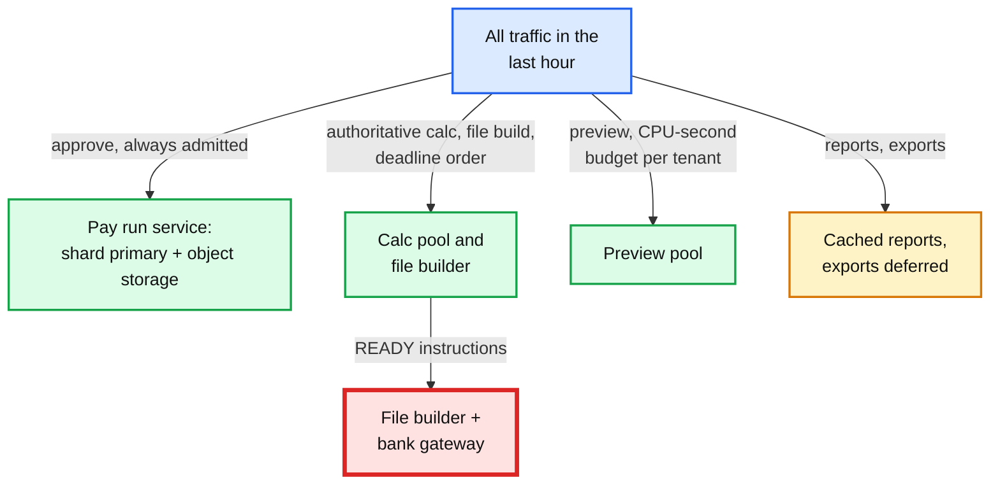

**Push back on the textbook answer.** "Go active-active across regions for 99.95%." Money state wants one writer per shard, and each bank wants one sender. Two active regions double the ways to send a file twice. This SLO is bought with a short dependency list, the commit grace, AZ redundancy and change control, not with a second writer.

**What changed.** Signed `received_at` and the 120 s grace; priority shedding; the deploy freeze; region failover with registry reconciliation against the bank.

### 5.6 "The employer's debit came back R01 two days after employees were paid": funding risk and returns

**What breaks in the current design.** Every company's debit and credits leave together. A new company signs up with a stolen bank account, or simply without the money, and runs a $250k payroll at next-day speed. The debit settles Friday, the credits settle Friday, and the R01 arrives by Tuesday morning. The $250k is in 20 employees' accounts, some of them possibly mule accounts. Across the platform ~$10 B is exposed every peak week (§2).

**The fix.**
- **An exposure ledger.** `COMPANY_FUNDING.open_exposure_cents` goes up in the approval transaction by the run's debit and comes down when the saga's timer sees the return window close. Approval is refused with `402 FUNDING_REQUIRED` if the run exceeds `payroll_limit` or pushes exposure past the company's cap.
- **Tiers decide the speed.**

| Tier | Who | Speeds allowed | Exposure |
|---|---|---|---|
| `NEW` | First 90 days, or the funding account just changed `[estimate]` | 4-day: the debit goes first, credits leave only after its return window closes | ~0 |
| `STANDARD` | Clean history | 2-day, next-day within the limit | Capped, e.g. 2x the company's median run `[estimate]` |
| `TRUSTED` | Long history, verified financials | Next-day, same-day (premium tier) | Larger limit |
| `HOLD` | After a return or a risk flag | Wire prefunding only | 0 |

- **The 4-day arithmetic, in banking days.** The cut-off is payday minus 4 **banking** days at 5 PM PT. In a normal week that is Monday: the debit is effective Tuesday, its return deadline is the opening of business on Thursday, and Thursday's night file carries the credits, effective Friday, with no overlap between "employees can spend it" and "the debit can come back". In Veterans Day week (Wednesday 11 November 2026) the cut-off for Friday 13 November is **Friday 6 November**; a Monday approval would leave the debit returnable until Friday morning, after the credits left on Thursday night.
- **Funding modes.** A plain ACH debit; a **same-day debit** for runs approved early enough to make window 3 (the debit settles a banking day sooner, so its return window closes a day sooner; only for debits of at most $1 M); and **wire prefunding** for runs over the limit, every large tenant and the `HOLD` tier, with credits held until the wire shows in the settlement account on the bank's intraday report.
- **Verify the employer's account.** At onboarding and on every change, by instant account verification through an aggregator ([`../bank-feed-aggregation/`](../bank-feed-aggregation/)) or micro-deposits. A changed funding account resets the tier to `NEW`: that is the classic account-takeover pattern.
- **Pre-approval signals.** A run 3x the company's median, many new employees with new accounts at one bank, a first run right after an account change: the run is held for review. A model scores the run (§12); the rules decide.
- **When R01 arrives.** Tier to `HOLD`. Reinitiate at most twice (Nacha's limit for R01 and R09) once the employer confirms funds, or take a wire. Collections and legal follow; the service agreement makes the employer liable.
- **Platform exposure.** Each ODFI caps how much it lets us originate as a third-party sender. The file builder checks each window's total employer debits per bank against that cap before upload; over it, the bank would hold our file, which is a missed payroll for everyone. A daily exposure budget is monitored, and large runs are pushed to wire before the cap binds.

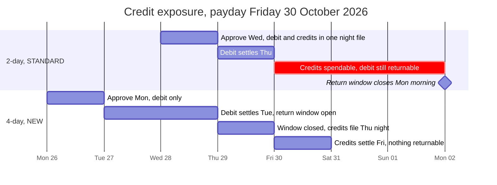

No new red node: the exposure is a financial risk, bounded by limits, not a component that fails under load.

**Push back on the textbook answer.** "When the debit bounces, reverse the employees' credits." Nacha permits a reversal only for an erroneous entry, and an RDFI can return an improper one (R11, R17). The employees were paid correctly. And "hold every credit until the debit clears" is 4-day payroll for everyone: the safest design, and the fastest way to lose customers to a competitor that pays next-day. Price speed by risk instead.

**What changed.** `COMPANY_FUNDING` (tier, limit, exposure, mode); the 4-day speed; wire prefunding with intraday reconciliation; account verification and tier reset; the platform exposure check in the file builder. [`deep-dives/funding-risk-and-returns.md`](deep-dives/funding-risk-and-returns.md).

### 5.7 "Prove what happened six years later, and keep tenants apart": audit and tenant isolation

**What breaks in the current design.** Rows are updated in place, so "what did we send on 16 October?" depends on who touched the row since. A support engineer "fixes" a paycheck in SQL. A bug in batch assembly puts one company's employee under another company's batch. A single key decrypts every tenant's bank accounts.

**The fix.**
- **An immutable chain.** Snapshot (SHA-256) → paychecks (`result_hash`) → instructions (deterministic ids) → NACHA file (SHA-256, registry) → the bank's acknowledgement and return files (stored raw, SHA-256) → journal. Every raw artifact sits in WORM object storage (write once, read many: object lock in compliance mode) for 7 years. Money rows only move forward through states, and every transition is an event with actor, reason and request id.
- **Humans go through APIs.** No production SQL writes. Repairs only through the corrections API. Break-glass read access is time-boxed and logged. Dual control (a second approver) for funding account changes, reversals, limit increases and any manual file action such as a re-upload after "not received".
- **Tenant isolation in depth.** `tenant_id` leads every primary key; Postgres row-level security is set per connection from the auth context; a tenant's PII (SSNs, bank accounts) lives in a vault, encrypted with a per-tenant data key under a KMS (key management service) master key. NACHA batches are per company. Before upload, the builder checks that each batch's totals equal that company's instructions in the window and that its company id matches the funding account's owner, so a cross-tenant mix-up fails the build instead of paying the wrong people.
- **"Prove it" is one query.** Given a paycheck id: the snapshot, the release, the engine version, the instruction, the file and its line, the acknowledgement, any return, and the journal postings. A replay recomputes the paycheck and checks the hash.

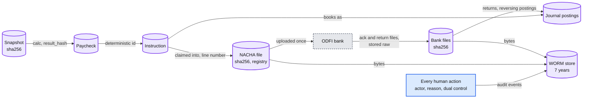

**What changed.** WORM storage for every artifact; state-transition events with actors; dual control; row-level security and per-tenant keys; the per-batch ownership and totals check before upload. No new red node.

---

## 6. Final design and the six core flows

Everything from §5 composed. Under 15 nodes; zoom-ins are in [`diagrams.md`](diagrams.md).

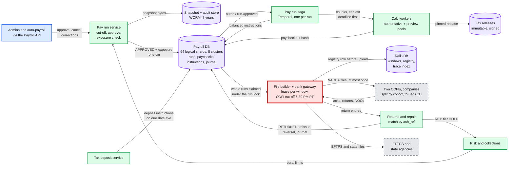

The six flows below are the ones to say from memory. Each is the final design, not the §4 version.

### Flow 1: an admin approves at 4:58 PM PT on Wednesday (about 150 ms), employees are paid Friday

The sequence is in §4.1. Rehearsal card:
1. **16:58:02.120 PT, ~150 ms.** The edge stamps and signs `received_at` and checks a fresh MFA; the snapshot goes to object storage (+50 ms); one shard transaction moves the run to `APPROVED`, checks the cut-off, reserves $25,420.18 of exposure against a $60,000 limit and writes the outbox row; `200`.
2. **Seconds later.** The saga calculates the single chunk and writes 13 instructions (1 debit, 12 credits) plus one tax liability row per agency. The fee is a journal line inside the debit's total, and the run's postings sum to zero.
3. **Wednesday ~5:20 PM PT.** The run is in file `C`, acknowledged. **Thursday 8:30 AM ET** the debit settles, **Friday 8:30 AM ET** the credits settle, **Monday** the return window closes and the run is `CLOSED`.

### Flow 2: the design-peak night, 5:00 to 6:30 PM PT (Wednesday 28 October 2026)

1. **17:00:00.000.** Customer cut-off. The API refuses later approvals with `409 CUTOFF_PASSED`. Commits for approvals received before 17:00 may land until 17:02.
2. **17:00 to 17:05.** The calc barrier: the tail of ~5 M paychecks approved since 15:00 was calculated as it arrived; the last few thousand runs finish. In the worst case (a 30-minute calc backlog) the barrier passes at 17:30.
3. **17:05.** The file builder takes the window lease (epoch 12) and claims ~600k runs, one run per transaction under its `PAY_RUN` lock, ~6.6 M instructions across 64 shards, into ~7 files of at most 1 M entries split across the two ODFIs by company cohort; big tenants get their own file group; each file's total debits stay under $9,999,999,999.99.
4. **17:12.** All files `BUILT` and registered (SHA-256, counts, totals); the platform exposure check against each bank's limit passes.
5. **17:13 to 17:20.** Uploads, ~2 s each, one at a time per connection. All `UPLOADED`.
6. **17:20 to 17:35.** Acknowledgements arrive; three-way totals match; files `ACKED`, instructions `SENT`. The countdown alerts at 17:30 (T−60) find nothing to page about, and at 18:00 (T−30) the completeness check confirms every non-cancelled instruction is in a registered file.
7. **18:30.** ODFI cut-off with ~55 minutes to spare. The bank forwards to FedACH before 22:45 ET. Debits settle Thursday 8:30 AM ET, credits Friday 8:30 AM ET.

### Flow 3: the upload of file `C` times out at 6:05 PM PT

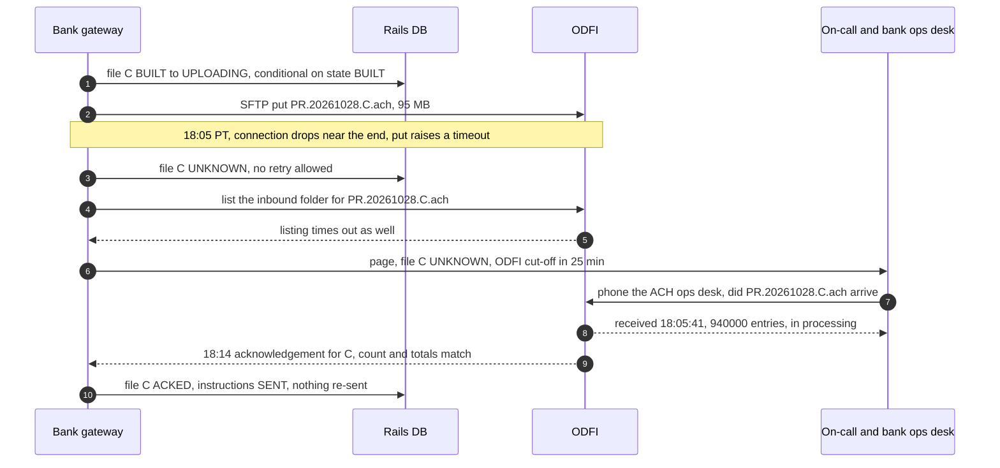

Rehearsal card: an exception means `UNKNOWN`, not "failed". Ask in order: listing, acknowledgement, status API, phone. Re-upload only on a confirmed "not received", and only the same bytes. After the cut-off nothing is re-sent that night: the file waits for the bank's final answer after 2:15 AM ET, and only `NOT_RECEIVED` moves its runs to Thursday's night file, rebuilt under a new modifier.

### Flow 4: the employer's debit comes back R01 on Monday

The sequence is in §4.4. Rehearsal card: **Monday ~07:10 ET** the return file arrives; the `ach_ref` copied back in the entry decodes to `r_81`'s shard and its `EMPLOYER_DEBIT`, verified by trace, amount and account. **One transaction:** instruction `RETURNED`, reversing journal (the employer owes us $25,420.18), tier `HOLD`. **Minutes later:** admin, credit team and collections notified; the employees keep their pay. **Tuesday:** a reinitiated debit (at most two) or a wire; the next run needs prefunding until risk restores the tier.

### Flow 5: a calc worker dies after 300 of 500 employees

The sequence is [`diagrams.md` D5b](diagrams.md#d5b-a-calc-worker-dies-after-300-of-500-employees). Rehearsal card: the activity's heartbeat stops, Temporal retries it after 30 s on another worker, which recomputes all 500 from the snapshot; the 300 stored paychecks match by hash (no-op) and 200 are inserted. The answer to "what happens on retry" is "it recomputes the same numbers". Nothing downstream saw the partial run, because instructions only exist once every chunk is stored and the totals match the preview. A hash mismatch on retry is a determinism bug and pages.

### Flow 6: one employee was paid $10,000 instead of $1,000

1. **Friday 09:40 PT.** The employee asks why their pay is so large. Support finds the paycheck: an extra zero in a bonus input, approved Wednesday, settled Friday 8:30 AM ET.
2. **Friday 10:00 PT.** The admin opens a correction `REVERSE_AND_REISSUE`. Above $5,000 it needs a second approver (dual control).
3. **Same transaction.** A `REVERSAL` instruction for **$10,000** (a Nacha reversal must carry the original's amount and company fields), id `H(original_id, REVERSAL, 1)`, and a `NET_PAY` credit for $1,000 with id `H(original_id, REISSUE, 1)`, left in `CREATED`, not `READY`. Reversing journal postings, and the YTD effect re-run in the next regular run.
4. **Friday night window.** Only the reversal goes out; the employee is notified first. It settles Monday, well inside 5 banking days of the original's settlement. The $1,000 goes `READY` only after the reversal's own 2-banking-day return window passes (Wednesday night's file): if the reversal comes back R01, the loss is capped at $9,000, not $10,000. No wages are late, because the employee was overpaid on payday ([`deep-dives/funding-risk-and-returns.md`](deep-dives/funding-risk-and-returns.md) §5).
5. **If the reversal is returned** (the money was already spent), there is no more ACH remedy. Recovery is between the employer and the employee, inside wage-deduction law. If the error was caught **before** the file, the fix would have been a cancel and recalc with no money moving at all, which is why the pre-approval anomaly check in §12 exists.

---

## 7. Trade-offs

| Decision | Option A | Option B | Chose | Why |
|---|---|---|---|---|
| What the plan is anchored on | The pay date, or a customer cut-off we pick | The ODFI's cut-off, with every milestone derived backwards | B | The bank's cut-off is the only fixed time. The customer cut-off is an output of the plan |
| When to calculate | In a batch at the cut-off | At approval, continuously | B | The barrier passes ~5 minutes after the cut-off; the batch shrinks to file building |
| When to build files | Trickle through the afternoon | After the cut-off | B | Keeps "cancel until the cut-off". Building takes minutes. Trickling would not remove the bank risk |
| Money math | Floats, or decimals rounded per period | `int64` cents, decimal rates, round once per line, YTD true-up for flat-rate taxes, catch-up lines for withholding | B | Reproducible to the cent, no 3-cent-a-year drift, and honest about what a true-up cannot fix |
| What is the record of pay | Recompute on demand from events | Stored paychecks with `result_hash`; recompute only to prove and test | B | The law cares what was withheld, not what today's engine computes |
| Instruction ids | Random UUIDs at write time | `H(pay_run, snapshot, payee, purpose, seq)` | B | A retried writer collides instead of duplicating; a re-freeze gets new ids and supersedes the old rows |
| Claim unit | Rows in chunks, `SKIP LOCKED` | Whole runs under the `PAY_RUN` lock, every writer the same | B | Row chunks split 6,447 runs in simulation; a run must travel in one file |
| Return matching | Trace number (+ amount, account) in a central index | `ach_ref` in the entry's Identification Number | B | Traces repeat daily and a return has no processing date: 2.2% misfiled, 3.5% ambiguous |
| Exactly-once to the bank | Retry with backoff, or the bank API's idempotency key | Registry before upload, explicit states, ask the bank, never re-send after the cut-off | B | SFTP is not idempotent; API keys live ~24 h, our registry 7 years; an answer can change until 2:15 AM ET |
| File builder coordination | Leader election, or a fencing epoch checked on every write | Registry primary key as arbiter: `BUILT` insert vs the sweep's `VOID` tombstone | B | No step spans two databases atomically; an epoch check can be a moment stale, a primary key cannot |
| Saga engine | DB state machine plus cron | Temporal workflow per run | B | Return-window timers, retries and history for free. A DB state machine is fine at a tenth of the scale |
| Funding risk | Debit and credits together for everyone, or 4-day for everyone | Tiered speeds, per-company limits, wire for large or held runs | B | Bounded exposure without losing the customers who need next-day |
| Repairs | Edit rows in place | New instructions with derived ids, reversing journal | B | Audit and exactly-once survive repairs |
| Regions | Active-active | Active-passive with registry reconciliation against the bank | B | One writer per shard, one sender per bank |
| Sharding | Hash of tenant | Directory of tenants to logical shards | B | The 50k-employee tenant moves alone |
| Second bank | One ODFI now, a second at 10x | Two ODFIs at 1x, companies split by cohort, home bank sticky between pay cycles; never automatic failover of a file | B | The risk it removes is the bank ending the relationship (payroll stops for months). It also halves the cut-off blast radius and trace use (70% to 35%) |
| What we refused to build | A Spark or stream batch, active-active regions, automatic bank failover, in-place edits, reversing employee credits on an employer NSF, trickling files before the cut-off, our own tax rule content, real-time rails for every paycheck | | | Each adds cost or a way to move money twice that the requirements do not pay for |

---

## 8. Staff-level notes

- **Simplest thing that meets the requirement.** One tenant-sharded Postgres holds all money state for a tenant, so every money change is one local transaction. One pure engine. One file builder per window claiming whole runs, one central registry whose primary key is the arbiter, Temporal for the saga. We refused a stream processor (33 cores of work), active-active regions (two senders), automatic bank failover, in-place edits and our own tax content, and we can say why for each.
- **Failure modes and blast radius.** A calc pod: one chunk retried, seconds. A shard cluster primary: ~1/8 of tenants for ~30 s, approvals absorbed by the commit grace. Temporal down: approvals continue, the calc barrier is at risk, pages at cut-off + 10 min. The file builder crashes: the lease expires in 30 s and the next one resumes from the registry. **An ODFI's SFTP is down near the cut-off: every run homed at that bank, about half the window, the widest blast radius we do not control**, handled by the fallback ladder (§5.1). Thursday night has the least slack. A bank ending the relationship would stop payroll for months with one ODFI; with two, it is a cohort migration. A bad engine release: every tenant in the cohort, stopped by the replay gate. A bad tax release: every run in that jurisdiction, stopped by the release's own replay and the `supersedes` re-freeze. A region: all tenants, RTO ~15 min, then the fallback windows.
- **Migration from a legacy engine** (one job that calculates and writes files): (1) **Shadow calc** for two full quarters: the new engine computes every live run from snapshots and diffs against legacy paychecks, so quarter ends, wage-base crossings and year end are all seen. (2) **Shadow ledger**: instructions built from legacy paychecks, compared with the legacy files' totals every night. (3) **Money ownership per company**: a flag `money_owner = legacy | new`, flipped only between a company's pay cycles and never inside a quarter for its first flip, so exactly one system can ever send a company's run. (4) Cohorts 1%, 10%, 50%, 100% over ~3 months, YTD migrated as opening balances and verified against legacy totals. (5) Decommission. Rollback is flipping the flag back before the company's next approval; no money state needs migrating back, because each run lives in exactly one system. The second ODFI follows the same pattern: a sticky `home_bank` per company, flipped only between pay cycles and only for a window none of its files reached `UPLOADING`.
- **Operability.** SLOs: approval availability 99.95% inside cut-off windows; 100% of approved runs in their target window (every miss is an incident with a review); calc barrier by cut-off + 30 min; zero duplicate files; zero unexplained reconciliation breaks after one banking day; 100% of tax deposits on time. **What pages at 3 AM:** return files arrive in the early morning ET, so the night on-call sees: an employer-debit return rate above 0.1% of the night's debits; any file `UNKNOWN` or unacknowledged at T−30 (Thursday's countdown from T−90); the window completeness check at T−30; two failed SFTP probes in a row from 3 PM PT, or a PGP or host key near expiry; acknowledgement totals not equal to registry totals; an EFTPS or state deposit rejection; a determinism mismatch on any paycheck; a reconciliation break; window exposure above 80% of a bank's limit.
- **Cost.** Compute is small: ~25 calc pods for a few hours a week, 8 Postgres clusters of 3 instances, a Temporal cluster, ~16 TB of object storage after 7 years (hundreds of dollars a month). Bank fees per entry dominate infrastructure: ~400 M entries a year at a fraction of a cent to a few cents each `[estimate]`, plus 5.2 cents per same-day fallback entry. The second ODFI costs ~2 engineers for ~2 quarters, a second settlement account and per-bank reconciliation `[estimate]`. **Credit losses dominate everything** (~$0.5 M a week in §2's estimate, ~$26 M a year), so the risk team and its controls are the biggest cost lever, not servers. Engineering: a payroll platform team (engine host, saga, calc) of 6 to 8; a money movement team (instruction ledger, file builder, gateway, returns, reconciliation) of 5 to 6; a tax content team that ships releases; a risk team (tiers, limits, collections) of 4 to 5.
- **Team boundaries.** The contracts are the snapshot schema, the signed tax release format with its golden tests, the instruction schema, and the registry, which the money movement team alone owns. The tax content team can ship a release without an engine deploy, and the engine team can ship without touching content.
- **Explicit trade-off.** We accept a few minutes of bank-dependent uncertainty and a human on the phone near the cut-off, rather than a retry that could pay 940k employees twice. We accept ~$10 B of weekly exposure, bounded per company, rather than making every customer wait four days.

---

## 9. What is expected at each level

**Mid (80/20 breadth/depth).** Schedules, a pay run table, a calc service that computes taxes, a job that "sends payments to the bank", and a database. Uses cents rather than floats when asked. Treats the deadline as the pay date and the bank as an API with retries. May not know what a NACHA file or a return is.

**Senior (60/40).** Separates approval from calculation, makes calc idempotent per employee, stores the tax table version on each run, and builds ACH files in batches. Knows returns exist and handles R01 with notifications. Uses idempotency keys for payments and a workflow engine for the run. Goes deep on one of: the calc engine, the file pipeline or the retry story.

**Staff+ (40/60).** Everything above, plus: says in the first minute that the deadline is the ODFI's cut-off and plans backwards from the bank's windows, with a fallback ladder; makes calc a pure function of a frozen snapshot with integer cents, rounding rules from the release, a YTD true-up for flat-rate taxes and catch-up lines for withholding; gives every money movement a deterministic id, claims whole runs, writes the registry row before the upload and matches returns by its own reference, not the trace; resolves an unknown upload by asking the bank and explains why backoff-and-retry is wrong here; names the employer debit return as credit exposure, sizes it, and answers it with tiers, limits, 4-day and wire; knows what a Nacha reversal can and cannot do; tests an engine change by replaying a quarter; handles the 50k-employee tenant (chunks, own shard, own file, wire); and gives a migration where exactly one system owns each company's money at any time.

---

## 10. Nitty-gritty (past interview scope)

### 10.1 Internals of each chosen technology

**The NACHA file.** Fixed-width ASCII, 94 characters per record, records grouped in blocks of 10 (the last block padded with `9`s). Six record types: `1` file header (immediate destination and origin, creation date and time, the one-character **File ID Modifier**, record size `094`, blocking factor `10`), `5` batch header (company name and id, SEC code such as PPD for consumer accounts or CCD for corporate ones, entry description `PAYROLL`, effective entry date), `6` entry detail (transaction code, RDFI routing number, account number, **amount in 10 digits `$$$$$$$$cc`**, the 15-character Identification Number in positions 40 to 54 where we write `ach_ref`, name, 15-digit **trace number** = the ODFI's 8-digit routing prefix + a 7-digit sequence, unique within the file), `7` addenda (optional; tax payments carry their details here), `8` batch control and `9` file control (entry and addenda count, an entry hash of the routing numbers, and total debit and credit amounts, **12 digits** at file level). Three widths become design limits: one entry is at most $99,999,999.99 (a 60k-employee employer debit would not fit, one more reason big tenants wire), one file's debits at most $9,999,999,999.99, and 36 File ID Modifiers per day ([ACH developer guide](https://achdevguide.nacha.org/ach-file-details)). The anatomy of one night file is drawn in [`diagrams.md` D2b](diagrams.md#d2b-zoom-in-one-nacha-file).

**The ACH network around us.** We are a third-party sender: we transmit entries on behalf of originators (the employers) through our ODFI, which forwards them to an ACH operator (FedACH or The Clearing House's EPN), which delivers them to each RDFI and settles between the banks. Returns travel the same path backwards, carrying the original trace number. Settlement is on the effective entry date for forward-dated entries (8:30 AM ET), or at 1:00, 5:00 or 6:00 PM ET for the three same-day windows. ACH sends no positive confirmation that a credit posted: silence plus the settlement date is success.

**Postgres as the instruction ledger.** The claim is one transaction per run: `SELECT ... FROM pay_run WHERE pay_run_id = $R AND state = 'INSTRUCTED' FOR UPDATE`, then `UPDATE instruction SET state = 'CLAIMED', file_id = $F, trace_number = ... WHERE pay_run_id = $R AND state = 'READY'`, and commit only if the updated row count equals the run's instruction count. The builder picks candidate runs with `FOR UPDATE SKIP LOCKED` on `PAY_RUN`, so it skips a run a hold or re-freeze holds and takes it on the next pass; it never skips a single row. The 50k-employee run is a 50,000-row claim, about a second `[estimate]`. Money rows are never deleted; states only move forward, enforced by a check in every update (`WHERE state = <expected>`). Commits wait for one of two synchronous standbys in the other AZs ([`../../concepts/mvcc-and-isolation.md`](../../concepts/mvcc-and-isolation.md), [`../../concepts/replication-and-quorums.md`](../../concepts/replication-and-quorums.md)).

**Temporal for the saga.** One workflow per run, id = `pay_run_id`. Activities: calc chunks, instruct, notify. The workflow waits on a signal from the bank gateway when the run's file is `ACKED`, then sleeps on timers to the debit settlement date, the credit settlement date and the close of the return window; every business date is computed by an activity from the bank calendar, never inside workflow code, because workflow code must replay deterministically. ~600k workflows open every week means changing workflow code needs Temporal's versioning (patch) API, or old histories stop replaying ([`../../concepts/temporal-durable-execution.md`](../../concepts/temporal-durable-execution.md)). Money never moves inside an activity: activities write instructions, and only the file builder and gateway talk to the bank.

### 10.2 Configuration knobs that matter

| Component | Knob | Value | Why |
|---|---|---|---|
| Planner | milestones before each ODFI's own cut-off | upload by −30 min, build by −15, calc barrier −15, customer cut-off −30, taken from the earlier bank | The plan works backwards from the bank |
| API | commit grace after the cut-off | 120 s, edge-signed `received_at` | Absorbs a ~30 s failover |
| Calc | chunk size | 500 employees | ~5 s per chunk; a 50k run is 100 activities |
| Calc | in-flight chunks per tenant | 20 `[estimate]` | Fairness without starving the big tenant |
| Calc | pods on cut-off days | 4 → 25 from 2 PM PT, 40 on month-end Wednesdays | No reactive autoscaling on the critical path |
| Preview | budget | CPU-seconds per tenant per minute `[estimate]`; incremental for big tenants | Shed first; a 50k preview is 500 CPU-seconds |
| Calc dispatcher | write budget per physical cluster | ~20k rows/s `[estimate: load test]` | A post-outage drain peaked at 35k to 51k rows/s in simulation |
| File builder | lease TTL / renew | 30 s / 10 s | The epoch is an early exit; the registry primary key decides |
| File builder | entries per file | at most 1 M | Blast radius, upload time, 12-digit totals |
| File builder | File ID Modifiers | 36 per day per bank, ~8 to 10 used, alert at 24 | The duplicate-detection field, per bank |
| Gateway | wait for acknowledgement before asking | 20 min `[estimate]` | Never a blind re-send; nothing re-sent after the cut-off |
| Gateway | SFTP probe | every 5 min from 3 PM PT; key expiry alarms 30 days ahead | The dry run never touches the bank |
| Postgres | `synchronous_standby_names` | `ANY 1` of 2 standbys in other AZs | RPO 0 in region, survives losing one standby |
| Risk | `NEW` tier | 90 days or a funding account change | 4-day speed until history exists |
| Risk | reinitiations after R01 | at most 2 | Nacha's limit |
| Tax | federal deposit submission | the banking day before the due date, on the DC legal-holiday calendar; next business day at $100k+ | EFTPS: over $1 M by 8 PM ET the day before |
| Deploys | freeze | 1 PM to 7 PM PT on banking days `[estimate]` | The approval minute is not a deploy minute |
| Engine | rollout | replay gate, 1 pay cycle shadow, cohorts 1, 10, 50, 100% over 4 weeks | Our code is the widest blast radius |

### 10.3 Capacity math per component

| Component | Per unit | Total at the design peak | Limit and headroom |
|---|---|---|---|
| Pay run service | ~200 approvals/s per pod `[estimate]` | ~700/s for a minute, 6 pods | DB-bound; 64 shards share it, ~11/s each |
| Calc pool | 4 vCPU at 10 ms = ~400 paychecks/s per pod | 3,333/s needs ~9 pods; 25 deployed | ~3x |
| Payroll DB cluster | ~8k rows/s steady, drains capped at ~20k by the write budget | 8 clusters, ~150 GB/year hot each | Uncapped drains peaked at 35k to 51k rows/s in simulation |
| Temporal | ~25 transitions per run | ~15 M a night, ~6k/s in the last 15 min | Sized for 10k/s: the closest software limit |
| File builder | reads ~100k rows per shard, ~20 s to build a 95 MB file `[estimate]` | ~7 files | Minutes |
| Bank gateway | ~50 MB/s `[estimate]` | ~620 MB, ~15 s of transfer | The bank's own processing is the unknown |
| NACHA widths | entry ≤ $99,999,999.99; file debits ≤ $9,999,999,999.99; 36 modifiers a day per bank | ~$10 B of debits a night, ~8 to 10 modifiers per bank | Split files; big tenants wire |
| Trace sequence | 7 digits, unique per file; per day only to help the fallback index | ~3.5 M per bank on the peak day, ~35% | No longer carries return matching (`ach_ref` does) |
| ODFI exposure limit | set by each bank `[unknown]` | ~$10 B of debits in one night, ~half per bank | Page at 80% |

Nothing in our own software is near a limit at the design peak, once drains are paced by the write budget. The limits that bind first are the banks': each ODFI's exposure limit on us, and the cut-off itself.

### 10.4 Failure timeline

**A shard primary dies at 4:59:50 PM PT, during the approval minute.**

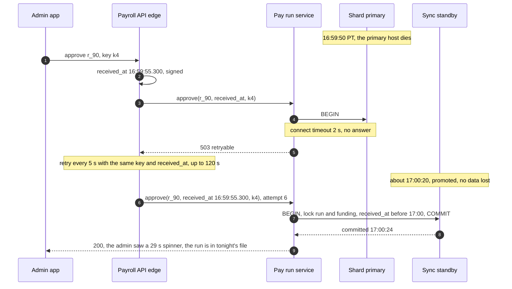

**One ODFI's SFTP is down from 5:50 PM PT** (the 3 PM probe was green; the other bank is unaffected). 17:50: uploads of files 5 to 7 fail to **connect**, so no bytes left: the files stay `BUILT` and the same bytes are retried (a failed connect is not `UNKNOWN`; a failure mid-put is). 18:00: the T−30 alert pages; the bank confirms an outage. 18:10: the bank offers its backup channel (a secondary host or a portal upload `[estimate]`); the same bytes go there, with the registry recording the channel. 18:30: if the cut-off still passes without the files, they are voided (`BUILT → VOID`, they never left) and their runs move to the fallback window: Thursday's night file with credits still effective Friday. Admins get "employees will be paid on time; your debit moves to Friday". If Thursday fails too, Friday's same-day window 1 at 10:30 AM ET.

**Region A is lost at 4:30 PM PT.** 16:30: approvals fail; the edge in region B queues retries with signed `received_at`. 16:35: the incident commander decides to fail over; shard replicas in region B are promoted (~1 s RPO); calc pods scale up. 16:45: before any file, region B's gateway asks the bank for today's received files and reconciles the registry. 16:50: approvals flow again, with the grace extended by incident decision for runs whose `received_at` predates the outage. Runs whose calc was lost are recomputed from snapshots in multi-region object storage. The night file goes out by the normal milestones if the RTO held; otherwise the fallback ladder.

### 10.5 Exactly-once and idempotency end to end

| Hop | Where duplicates come from | Dedup key | Where removed | Lifetime |
|---|---|---|---|---|
| Admin to API (approve) | Double click, UI retry, edge retry after a failover | `Idempotency-Key` + `pay_run_id` | Compare-and-set `DRAFT → APPROVED` in the approval transaction | Run lifetime |
| Outbox to saga | Relay retry | workflow id = `pay_run_id` | Temporal id-reuse policy | Run lifetime |
| Saga to calc | Activity retry, worker death | `(tenant, run, employee)` + `result_hash` | Upsert with hash compare | 7 years |
| Saga to instructions | Activity retry, a re-freeze | `H(run, snapshot, payee, purpose, seq)` | Unique index, `ON CONFLICT DO NOTHING` plus amount compare; old rows `SUPERSEDED` under the run lock | 7 years |
| Instructions to file | Two builders, a crash mid-claim, a hold or re-freeze racing the claim | The `PAY_RUN` row lock (whole-run claim, every writer); registry primary key `file_id` (`BUILT` insert vs `VOID` tombstone) | Run lock, tombstone-first sweep, completeness check at T−30 | File lifetime |
| File to bank | Upload retry after a timeout | Registry row, SHA-256, File ID Modifier; `UNKNOWN` resolved by asking; `NOT_RECEIVED` only after 2:15 AM ET | At-most-once upload, nothing re-sent after the cut-off; the bank's duplicate checks as backstop | 7 years |
| Bank files to us | Re-delivery, re-poll | `(file sha256, line number)`; matched by `ach_ref`, verified by trace, amount, account | `BANK_EVENT` unique | 7 years |
| Returns to repair | The same return twice, a support double click | `H(original, REISSUE or REVERSAL, n)` | Unique index | 7 years |
| Tax deposits | Due-date job re-run | `H(company, agency, period, due_date)` | Unique index | 7 years |
| Journal | Any of the above replayed | Posting id derived from instruction id + event | Unique index | 7 years |

The trap is key lifetime. A payments API's key lives about a day; an ACH return arrives up to 2 banking days later and a reversal up to 5; an auditor asks 6 years later. So every dedup key here lives as long as the record it protects.

### 10.6 Consistency model per edge

| Edge | Model | Why |
|---|---|---|
| Admin to pay run service | Strong; read-your-writes from the shard primary | The admin sees their approval |
| Approval to company funding | Strong, same transaction | Exposure cannot be overspent by two runs |
| Snapshot and tax release stores | Immutable, content-addressed, written before they are referenced | No consistency question to answer |
| Saga to payroll DB | At-least-once activities, idempotent writes | Retries are free |
| Payroll DB shards to file builder | Strong per shard; the registry row is the cross-shard commit point | No cross-shard transaction anywhere |
| Registry to bank | At-most-once upload, then reconciled by acknowledgement | The bank is the outside truth |
| Bank to us (returns, NOCs) | Eventual, minutes to 2 banking days (60 days for R11 on our reversals), deduped | Returns arrive on the bank's schedule; `CLOSED` runs can re-open |
| Payroll DB to general ledger, notifications, lake | Eventual, minutes, via outbox and CDC (change data capture) | Not on the money path |
| Region A to region B | Async, ~1 s RPO | Registry reconciled with the bank before region B sends anything |

### 10.7 Alternatives rejected

| Alternative | Why it looked attractive | Why rejected |
|---|---|---|
| Spark or Flink batch at the cut-off | "Batch" is in the problem statement | ~33 cores of pure functions; adds a failure mode inside the 90-minute window |
| One global, unsharded money DB | File building becomes one local transaction | One primary is the whole platform's blast radius, tenants share everything, 7 years of rows; the registry already gives a commit point |
| A per-payment bank API (sponsor bank) | Per-entry status, webhooks, idempotency keys | Keys live ~24 h, volume limits and pricing at 6.6 M entries a night, and we still need the instruction ledger. The right rail for instant pay (§10.11) |
| Instant payments (RTP, FedNow) for every paycheck | Real-time and final | Final means no reversal at all, and the employer debit risk is unchanged. Offered for on-demand pay inside prefunded limits instead |
| Live tax tables from a vendor API at calc time | Always current | Not reproducible, and a vendor outage at 4:59 PM stops payroll |
| Automatic failover to a second bank | Resilience | Two banks, one file, everyone paid twice. Manual, after reconciliation |

### 10.8 How the big companies do it

- **QuickBooks Payroll (Intuit).** Same-day direct deposit has a 7:00 AM PT cut-off and is offered only to Full Service Workforce customers ([US page](https://quickbooks.intuit.com/payroll/direct-deposit/)): speed gated by product tier, the same lever as our risk tiers. The Canadian product documents the timeline we follow: submit by 5:00 PM PT one day (next-day) or two business days (2-day) before payday, "at 5:00 PM PT (8:00 PM ET) the payroll offloads", funds are withdrawn 1 banking day before the paycheque date, and cancellation is possible until the submission deadline ([Canada article](https://quickbooks.intuit.com/learn-support/en-ca/help-article/payroll-processes/direct-deposit-processing-timeline/L6aKf86Ms_CA_en_CA)). One offload at the cut-off and cancel until then is exactly §5.1's choice. QuickBooks' US payroll customer count (1.4 M in the research file) comes from a community forum page and is `[unverified]`; this design uses the README's ~1 M.
- **Modern Treasury** stores an idempotent request's result for 24 hours ([docs](https://docs.moderntreasury.com/platform/reference/idempotent-requests)) and tracks payments as state machines: the short-lived key and the long-lived state are separate things, as with our API keys and instruction ledger.
- **Increase** (a bank API) documents R01 as insufficient funds and allows an R01 or R09 debit to be reinitiated at most two times ([docs](https://increase.com/documentation/ach-returns)), the limit our collections flow uses.
- **Stripe** prunes idempotency keys once they are at least 24 hours old and treats a reused key after that as a new request ([docs](https://docs.stripe.com/api/idempotent_requests)), which is why no dedup here depends on a provider's key.
- **The Federal Reserve** publishes the schedule our planner is built from: same-day windows at 10:30 AM, 2:45 PM and 4:45 PM ET settling at 1:00, 5:00 and 6:00 PM ET, and future-dated deadlines at 8:00 PM ET (Sunday to Thursday only), 10:45 PM ET and 2:15 AM ET, settling at 8:30 AM ET on the next business day ([FedACH schedule](https://www.frbservices.org/resources/resource-centers/same-day-ach/fedach-processing-schedule.html)). The research file's "fourth same-day window at 8:00 PM ET" is that future-dated deadline, not a same-day window; a fourth same-day window is `[unverified]`, and so is the "$10 M" same-day limit. Nacha's current same-day limit is $1 M per payment, effective March 18, 2022 ([Nacha](https://www.nacha.org/million)).

### 10.9 Operational runbook

- **Dashboards (the five):** the window countdown (runs approved, calc barrier progress, files `BUILT` / `UPLOADED` / `ACKED`, minutes to the ODFI cut-off); approvals per second and approval errors; the calc queue by deadline and the worker count; returns by code, split into employer debits and employee credits, with exposure against limits (top 20 companies, platform against the ODFI limit); reconciliation breaks and tax deposit status.
- **Alerts:** any window not `ACKED` at T−60, T−30, T−15, Thursday from T−90 (page, then the bank); window completeness at T−30 (page); two failed SFTP probes in a row from 3 PM PT, or a PGP or host key within 30 days of expiry (page); any file `UNKNOWN` (page); calc barrier not passed by cut-off + 30 min (page); acknowledgement totals not equal to registry totals (page); employer-debit returns above 0.1% of a night's debits (page risk on-call); a deposit rejected by EFTPS or a state (page); a determinism mismatch (page engine team); window exposure above 80% of the ODFI limit (page).
- **Rollout:** services deploy outside the freeze, one AZ first. Engine versions go through the replay gate, one shadow pay cycle, then cohorts. Tax releases are validated, replayed for the jurisdictions they touch, and published at least 3 banking days before their effective date where the agency allows `[estimate]`.
- **Rollback:** engine by pinning the previous version for new approvals (old runs stay pinned to theirs, so nothing needs backfill). A bad tax release by a superseding release, re-freezing runs not yet in a file (cut-off more than ~2 h away), and catch-up lines for runs already paid. A file the bank **rejected** (`REJECTED`) or confirmed absent after 2:15 AM ET (`NOT_RECEIVED`) are the only cases where rebuilding is allowed, with a new File ID Modifier.

### 10.10 Security and abuse

- **Authentication.** Intuit identity for admins and employees, OAuth 2.0 for partner integrations ([`../../concepts/oauth.md`](../../concepts/oauth.md)), and step-up MFA for approving a run, changing a funding or employee bank account, and corrections.
- **Authorization.** Roles per tenant: owner, payroll admin, accountant (one person, many client companies, each grant explicit), employee (self-service for their own bank account and W-4). Every query is scoped by `tenant_id` and row-level security.
- **PII.** SSNs and account numbers live in a vault as tokens, encrypted with per-tenant data keys under a KMS master key, masked in logs. NACHA files necessarily contain account numbers, so they are PGP-encrypted in transit over SFTP, KMS-encrypted at rest in the WORM bucket, and readable only through break-glass access. Nacha also has account-number protection rules for large senders; their thresholds are `[unverified]` here.
- **Abuse: fake employers.** A shell company funds payroll from a stolen account and pays mule accounts. Know-your-business checks at onboarding, the `NEW` tier's 4-day speed, account verification, velocity checks (many employees, new accounts, one bank).
- **Abuse: direct deposit diversion.** An attacker phishes an employee's login and changes their bank account just before payday. Re-authentication, a notification to the old contact details, and a change made inside 3 banking days of a cut-off applies to the next run `[estimate]`.
- **Abuse: admin account takeover.** MFA, new-device alerts, dual approval for runs above the company's usual size, and any funding account change resets the tier to `NEW`.
- **Malicious or malformed input.** Inputs are validated (hours at most 168 a week, rates within the employee's band), imports are parsed in a sandbox, and a tenant cannot name another tenant's employee because keys carry `tenant_id`. The pre-upload batch check (§5.7) is the last line.

### 10.11 Evolution

- **10x (10 M companies).** Logical shards move to more clusters; calc pods grow 10x and remain cheap; Temporal's fan-out moves to a plain queue if its ceiling nears. The bank side is the real work: 10x entries and File ID Modifiers need more origin ids or a third ODFI by tenant cohort (the second one is already there at 1x, §7), and each bank's exposure limit needs more banks. At 10x this is a treasury and partnership problem before it is a code problem.
- **On-demand pay (earned wage access).** Instant rails (RTP, FedNow) through a per-payment bank API. Credits are final at once, so they are allowed only against wages already earned and prefunded. The seam is a new instruction purpose and a new rail behind the same ledger, ids and registry pattern (a per-payment API call instead of a file line).
- **Tax filing (941, W-2).** Quarterly and annual aggregates come from the same paychecks and journal. The new invariant: the 941's tax total equals the quarter's deposits. That is a reconciliation job, not a new system.
- **International payroll.** One window table per rail and country calendar, minor units per currency, and a release per country. The engine contract does not change.
- **Data residency and deletion.** Tenants homed by legal entity on regional shards. Payroll records are retention-bound, so a deletion request pseudonymizes PII where the law allows and deletes after the retention period.

---

## 11. Follow-up questions to expect

Ranked by how likely an interviewer asks them. Short answers for each are in [`edge-cases.md`](edge-cases.md).

1. **The employer's debit comes back R01 after employees were paid (the window closes about one banking day after Friday's credits). Who eats it, and how do you stop it at scale?** §5.6, Flow 4, [`deep-dives/funding-risk-and-returns.md`](deep-dives/funding-risk-and-returns.md).
2. **The upload timed out. Did the bank get it? What do you do in the next 10 minutes?** §5.3, Flow 3, [`deep-dives/exactly-once-money-movement.md`](deep-dives/exactly-once-money-movement.md).
3. **An approval at 4:59:59 PM, and a federal holiday on Monday.** §4.1, §5.1, §10.4, [`deep-dives/deadlines-and-ach-windows.md`](deep-dives/deadlines-and-ach-windows.md).
4. **A calc worker dies after 300 of 500 employees.** Flow 5, [`deep-dives/multi-tenant-batch-and-retries.md`](deep-dives/multi-tenant-batch-and-retries.md).
5. **$10,000 instead of $1,000. What can you do, and by when?** Flow 6, [`deep-dives/funding-risk-and-returns.md`](deep-dives/funding-risk-and-returns.md).
6. **A state changes its withholding table mid-quarter. Which runs use which table, and can you prove it?** §5.4, [`deep-dives/gross-to-net-calc-and-tax-tables.md`](deep-dives/gross-to-net-calc-and-tax-tables.md).
7. **How do you test a tax engine change before it computes 10 M paychecks?** §5.4, the replay gate.
8. **One tenant has 50k employees. Does anything change?** §5.2, [`deep-dives/multi-tenant-batch-and-retries.md`](deep-dives/multi-tenant-batch-and-retries.md).
9. **Show me the money math for one run.** §3.3 worked example, §4.3 journal.
10. **Why not Spark, Kafka, active-active, or automatic bank failover?** §7, §10.7.
11. **How do tax deposits work, and what if one is late?** §4.3 step 7, §2 (2% for 1 to 5 days late).
12. **How do you migrate off the legacy engine without paying anyone twice?** §8, the `money_owner` flag.
13. **A return carries only the original trace number. How do you find the instruction?** `ach_ref` in the Identification Number, §3.3, [`deep-dives/funding-risk-and-returns.md`](deep-dives/funding-risk-and-returns.md) §3.

---

## 12. Presenting this as an Intuit case study

Intuit hands the case study out ahead of the loop and then re-opens your deck in every round, with AI and security graded throughout ([`../company-questions.md`](../company-questions.md) §1). Scoping is graded too, so slide 2 says what was cut.

**The deck (10 slides).**
1. **Title and the one-line answer.** The three facts of §1: the bank owns the deadline, files cannot be called back, we pay before we are paid.
2. **Scope and what we cut.** In: schedule and approve, calc, money movement, returns and repair. Cut: tax form filing, time tracking, benefits, paper checks, international, writing tax content. Why: the risk and the deadline are in money movement, so the depth goes there.
3. **Numbers.** 1 M companies, 330 M paychecks a year, 6 M at one cut-off, ~$10 B debited in one night, a ~90-minute window, ~$10 B of weekly exposure.
4. **Architecture.** The §6 diagram, with the red node explained.
5. **User story 1: an admin approves at 4:58 PM, employees are paid Friday.** Flows 1 and 2, with the backwards plan and the fallback ladder.
6. **User story 2: the employer's debit bounces.** Flow 4, tiers, limits, 4-day and wire.
7. **Exactly-once.** Instruction ids with the snapshot, whole-run claims, the registry and its tombstone, "ask the bank" (Flow 3), and `ach_ref` for returns.
8. **AI story.** Below.
9. **Security story.** Below.
10. **Operability, migration, cost, next.** SLOs and pages, the `money_owner` migration, credit losses as the biggest cost, on-demand pay as the next step.

**The AI story: catch the $10,000 paycheck before it leaves.** A model scores every paycheck and run at preview time against the company's and the employee's history (a net-pay jump, a new bank account with a large amount, two employees sharing an account, hours outliers, a first run after a funding account change). It returns schema-checked output: `{paycheck_id, reason_code, score, explanation}`. Guardrails: the model never changes an amount and never blocks on its own. Deterministic rules block (net pay over 3x the employee's last net, an account shared across companies), the model only adds "review" flags that a human confirms or dismisses, and dismissals are its training signal. Budget 200 ms at preview; on timeout or error the preview shows rule results only. If an LLM writes the explanation text, it sees only that tenant's numbers with PII masked, and its text is never used for a decision. Measured by precision on dismissals and by the number of Flow 6 reversals it prevents.

**The security story.** Authentication: Intuit identity, step-up MFA for approve, bank changes and corrections. Authorization: roles per tenant, explicit accountant grants, row-level security. PII: vault tokens, per-tenant keys, masked logs. Encryption: TLS everywhere, PGP over SFTP to the bank, KMS at rest. Audit: WORM for 7 years, dual control on money-moving manual actions, no production SQL writes. Fraud: fake employers, direct deposit diversion, admin takeover (§10.10).

**Three questions each round will re-open.**
- **Architecture round:** Why is the bank cut-off red and not the database? Why not trickle files through the afternoon? What is your consistency model, edge by edge?
- **Money and data round:** Walk me through an instruction id from calc to the bank's return file. What happens if two file builders run? How does a return with only a trace number find its tenant?
- **Reliability round:** The upload times out at 6:05 PM. A shard fails over at 4:59:50. What pages at 3 AM, and who answers?
- **Product, leadership and AI round:** How do you price speed by risk without losing customers? How do you migrate a million companies without paying anyone twice? How do you know the AI flags help, and what happens when they are wrong?
