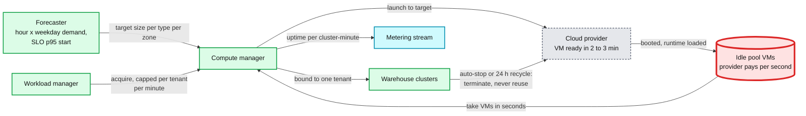
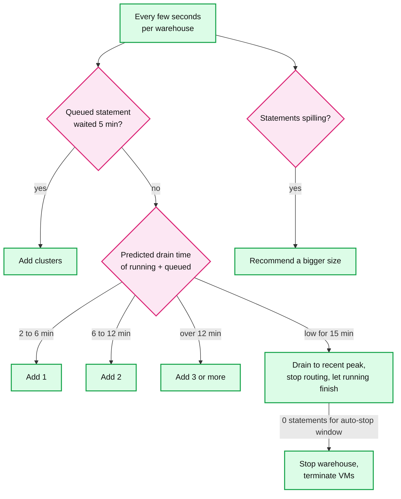
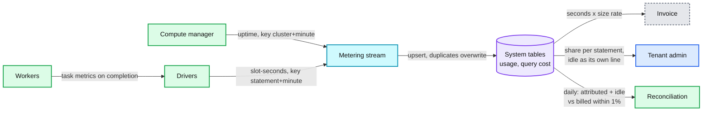

# Deep dive: elasticity, warm pools, and cost per query

> One-line answer: tenants get compute in seconds because the provider keeps booted VMs in a warm pool, and that pool is the provider's own cost, so it is sized to the startup SLO and a demand forecast rather than to peak, built from one or two instance types so one pool serves every warehouse size, and capped per tenant; warehouses scale out on queue time and predicted drain time (never CPU), stop after 10 idle minutes, and recycle every 24 hours; billing comes from cluster uptime per minute (idempotent, independent of any driver), cost per statement comes from its share of task-slot-seconds in each minute, and idle time is shown as idle rather than hidden inside query costs.

Part of [`../solution.md`](../solution.md) §2, §4.5, §5.5. Sources: [Databricks warehouse sizing, scaling and queuing](https://docs.databricks.com/aws/en/compute/sql-warehouse/warehouse-behavior), [Databricks warehouse settings](https://docs.databricks.com/aws/en/compute/sql-warehouse/create), [Databricks warehouse types](https://docs.databricks.com/aws/en/compute/sql-warehouse/warehouse-types), [STATEMENT_TIMEOUT](https://docs.databricks.com/aws/en/sql/language-manual/parameters/statement_timeout), Snowflake [NSDI 2020](https://www.usenix.org/system/files/nsdi20-paper-vuppalapati.pdf) §7. Related: [`../../concepts/serverless-architecture.md`](../../../concepts/serverless-architecture.md), [`../../concepts/rate-limiting-and-load-shedding.md`](../../../concepts/rate-limiting-and-load-shedding.md).

## 1. The naive warm pool, and why it is the provider's problem

From [`../solution.md`](../solution.md) §2:
- 5,000 warehouses running at peak, mean lifetime ~1 h: ~1.4 warehouse starts/s × ~10 VMs = ~14 VMs/s = **~840 VMs/min**.
- A cold VM (boot, image, runtime, warm JVM) takes ~2 to 3 min [estimate]. Covering 3 min of demand: 840 × 3 = ~2,500 idle VMs. Times 3 for the 09:00 spike: **~7,500 idle VMs**.
- At ~$0.62/h per i3.2xlarge [estimate]: ~$4,650/h, **~$41 M/year** that no tenant pays for.

Snowflake explains why this got worse, not better, as clouds moved to per-second pricing: "previously in the hourly billing model, as long as at least one customer VW used a particular node during a one hour duration, we could charge that customer for the entire duration. However, with per-second billing, we cannot charge unused cycles on pre-warmed nodes to any particular customer." Their conclusion: it "makes a strong case for moving to a sharing based model" (NSDI 2020 §7). Snowflake's own pool gives "compute elasticity at the granularity of tens of seconds"; Databricks serverless quotes "rapid startup time (typically between 2 and 6 seconds)".

## 2. Shrinking the pool

Four levers, each attacking one factor in the naive math.

1. **Size to the SLO percentile, not the peak.** The start SLO is "p95 under 10 s". The pool only has to cover demand during the replenish lead time at that percentile. The other 5% of starts get a partly warm cluster (the driver and a few workers now, the rest in minutes) instead of the whole cluster instantly.
2. **Forecast, and pre-fill before predictable spikes.** Demand by hour and weekday is regular: 09:00 Monday looks like last 09:00 Monday. Pre-fill ~10 minutes before the ramp, hold the peak target only during the ramp, and shrink at night. The ×3 spike factor becomes a smaller forecast-error margin.
3. **One or two instance types.** Every Databricks pro and classic size uses i3.2xlarge workers (table below), so one pool per zone serves every size. Five instance types would mean five pools, each with its own safety margin, and margins do not multiplex across pools.
4. **Per-tenant caps.** A single tenant may draw at most so many VMs per minute from the pool. A burst beyond that gets cold VMs. The pool is sized for the many, not for the largest tenant's worst minute.

Worked example with levers 1 to 3 [estimate]: hold ~2,500 VMs plus a 30% forecast-error margin (~3,300) for 4 peak hours a day, ~700 for the other 20 hours. Average: (4 × 3,300 + 20 × 700) ÷ 24 = ~1,130 idle VMs. At $0.62/h × 8,760 h = ~$5,430 per VM-year, that is **~$6 M/year instead of ~$41 M**. Still real money, which is why the long-term fix is §1's shared pool for small statements.

## 3. Cluster sizes

Databricks pro and classic sizes. "All workers use i3.2xlarge instances" (8 vCPU each); only the driver grows. Serverless sizes may use different instance types at similar price/performance ([docs](https://docs.databricks.com/aws/en/compute/sql-warehouse/warehouse-behavior)).

| Size | Driver | Workers | Worker vCPUs |
|---|---|---|---|
| 2X-Small | i3.2xlarge | 1 | 8 |
| X-Small | i3.2xlarge | 2 | 16 |
| Small | i3.4xlarge | 4 | 32 |
| Medium | i3.8xlarge | 8 | 64 |
| Large | i3.8xlarge | 16 | 128 |
| X-Large | i3.16xlarge | 32 | 256 |
| 2X-Large | i3.16xlarge | 64 | 512 |
| 3X-Large | i3.16xlarge | 128 | 1,024 |
| 4X-Large | i3.16xlarge | 256 | 2,048 |
| 5X-Large (public preview) | i3.16xlarge | 512 | 4,096 |

Size sets how fast one statement runs. The number of clusters sets how many run at once.

## 4. Scaling: on queue time, never on CPU

A queued statement uses no CPU, so a CPU-based autoscaler sees a calm cluster while users wait. The signal is queue wait and the predicted time to drain what is running and queued.

Databricks classic and pro, verbatim rules ([docs](https://docs.databricks.com/aws/en/compute/sql-warehouse/warehouse-behavior)):

| Estimated time to process running + queued load | Clusters added |
|---|---|
| 2 to 6 min | 1 |
| 6 to 12 min | 2 |
| 12 to 22 min | 3 |
| Over 22 min | 3, plus 1 per additional 15 min |

Plus: a query queued for 5 minutes forces a scale-up, and load low for 15 consecutive minutes scales down "to the minimum needed to handle the peak load from that period". Serverless replaces the fixed table with IWM's per-statement cost prediction and reacts faster ([`multi-tenant-isolation-and-admission.md`](multi-tenant-isolation-and-admission.md) §2).

## 5. Auto-stop and recycling

- **Auto-stop.** Serverless: default 10 minutes, minimum 5 in the UI, as low as 1 minute through the API. Pro and classic: default 45 minutes, minimum 10 ([docs](https://docs.databricks.com/aws/en/compute/sql-warehouse/create)). The trade: every idle minute is billed, every stop costs the next statement 2 to 6 s and a cold cache.
- **24 h recycle.** "Databricks recycles clusters that have been running for more than 24 hours": a new cluster takes new queries, existing queries finish on the old one, and it "may eventually forcefully terminate" a cluster whose queries run past 24 hours (same page). It bounds memory leaks and patch drift, and it is also how a new runtime image rolls out within a day with no restarts.

## 6. Metering and attribution: two grades of data, on purpose

- **Billing grade: cluster uptime.** The compute manager writes one record per `(cluster_id, minute)`: seconds up and size. Bill = seconds × the size's rate. It depends on no driver, so a crashed driver cannot lose billable time. The key makes replays idempotent, and records are reconciled daily against the cloud invoice.
- **Analytics grade: statement usage.** Each driver aggregates task metrics (CPU, wall, bytes, spill) per statement per minute and publishes `(statement_id, minute, task_slot_seconds)`. Never per task: at ~2 B tasks/day that would be a second big-data system just for billing.

**Worked example.** One X-Large cluster-minute: 256 slots × 60 s = 15,360 slot-seconds, billed at an illustrative $1.00 for the minute.

| Consumer | Slot-seconds | Share of the minute | Cost | Cost if idle is spread |
|---|---|---|---|---|
| A: 2 TB join | 12,000 | 78.1% | $0.781 | $0.868 |
| B: dashboard tile | 30 | 0.2% | $0.002 | $0.002 |
| C: medium ad hoc | 1,800 | 11.7% | $0.117 | $0.130 |
| Idle | 1,530 | 10.0% | $0.100 | $0 |
| Total | 15,360 | 100% | $1.000 | $1.000 |

Default view shows idle as its own line: it tells the tenant their warehouse is oversized or their auto-stop too long. A report can spread idle in proportion to use (last column). Either way attributed plus idle equals billed, which is the 1% check. If a driver dies mid-minute, its usage record for that minute is missing, that share shows up as unattributed, and the bill is unchanged.

## 7. Guardrails

- **Maximum scan bytes**, checked at plan time from the pruned file list's statistics, before any task runs.
- **Statement timeout.** `STATEMENT_TIMEOUT` accepts 0 to 172,800 s and the system default is 172,800 s (2 days) ([docs](https://docs.databricks.com/aws/en/sql/language-manual/parameters/statement_timeout)). Set ~3,600 s on BI warehouses.
- **Per-tenant budgets** with alerts, and an optional hard stop of a warehouse.
- **Per-user concurrency** limits, so one script cannot hold all 10 slots of every cluster.

## 8. Pricing: per byte or per second

| | Per byte scanned (BigQuery on-demand style) | Per compute-second (our choice) |
|---|---|---|
| Predictable for the user | Yes, known after planning | Only roughly, via the cost predictor |
| Attribution | Trivial, per statement | Needs the slot-second split above |
| Matches provider cost | No: a CPU-heavy query over few bytes is nearly free, a cheap scan of many bytes is expensive | Yes, we pay for VM seconds |
| Idle | Not billed, so the provider must share compute to survive | Billed until auto-stop |

We bill compute-seconds and expose bytes scanned as a guardrail and a report column.

## 9. Interview soundbite

"Seconds-fast startup is a warm pool, and under per-second billing the pool is the provider's cost, which Snowflake's own paper calls out. The naive pool is thousands of idle VMs and tens of millions a year. Size it to the start SLO and a forecast, build every size from one instance type so one pool serves all, and cap each tenant's draw. Scale warehouses on queue time and predicted drain, never CPU, stop after ten idle minutes, recycle every day. Bill from uptime per cluster-minute, which no crashed driver can lose, attribute to statements by slot-seconds, and show idle as idle."
