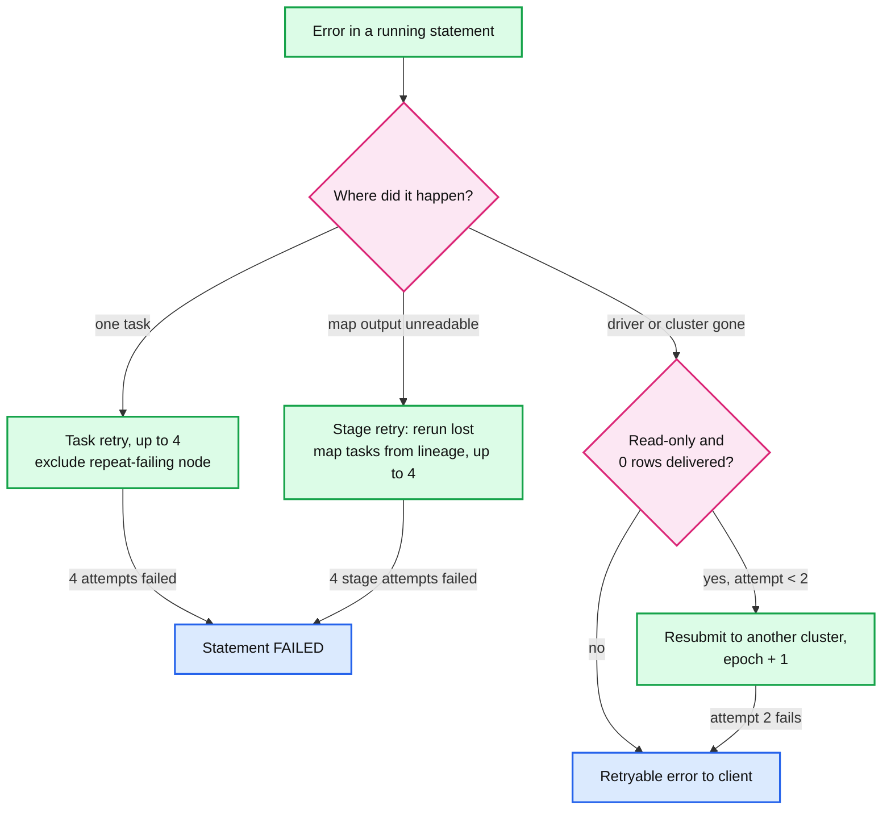
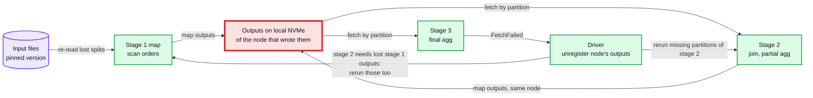
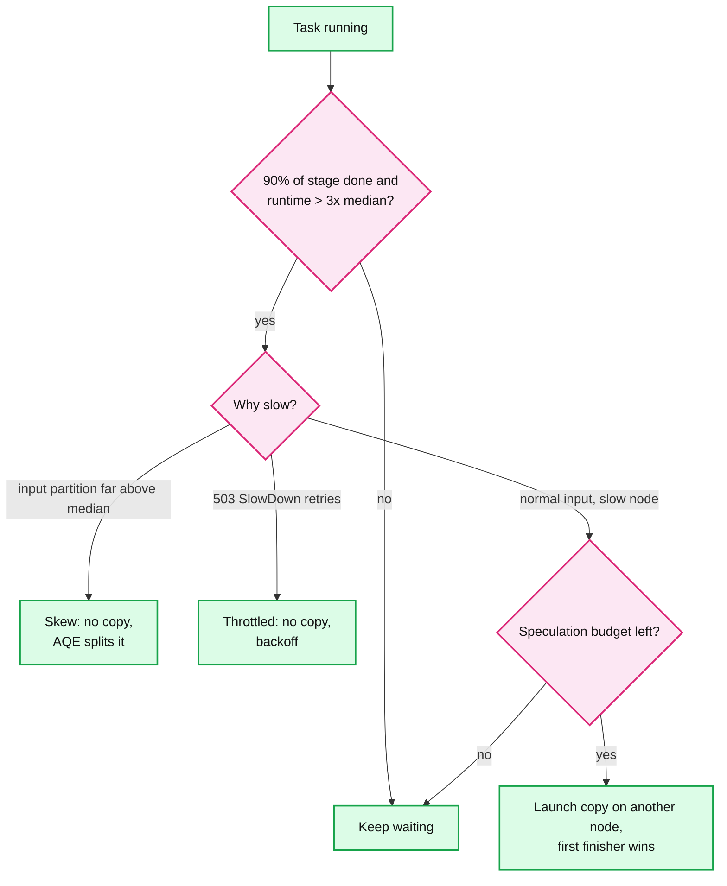
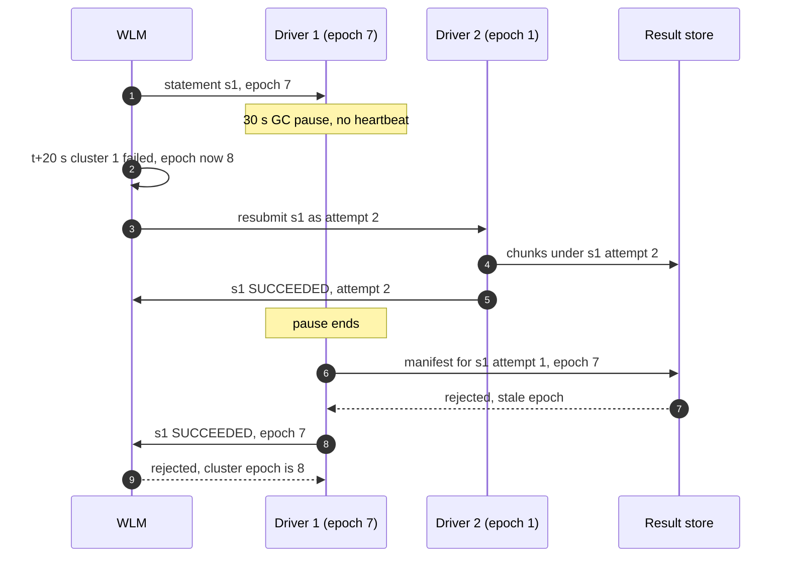

# Deep dive: fault tolerance and stragglers

> One-line answer: recovery works at three sizes, a task (rerun it elsewhere, up to 4 attempts), a stage (a lost worker's map outputs are recomputed from lineage when a reducer reports `FetchFailed`, up to 4 consecutive stage attempts), and a statement (a lost driver's read-only statements that delivered zero rows are resubmitted to another cluster under a new epoch); all three rely on tasks being deterministic functions of immutable input files, slow tasks are handled by speculation but never for skew or throttling, and the expensive options (durable or spooled shuffle, task-level recovery) are spent only on statements long enough that rerunning them from scratch would hurt.

Part of [`../solution.md`](../solution.md) §4.4, §5.4, §10.4 and §10.5. Spark defaults read from [`config/package.scala`](https://github.com/apache/spark/blob/master/core/src/main/scala/org/apache/spark/internal/config/package.scala) (master and branch-3.5). Docs: [Trino fault-tolerant execution](https://trino.io/docs/current/admin/fault-tolerant-execution.html). Papers: Presto ([ICDE 2019](https://trino.io/Presto_SQL_on_Everything.pdf) §IV-G), Magnet ([VLDB 2020](https://www.vldb.org/pvldb/vol13/p3382-shen.pdf)). Related: [`../../concepts/fan-out-fan-in.md`](../../../concepts/fan-out-fan-in.md), [`../../concepts/leases-fencing-clocks.md`](../../../concepts/leases-fencing-clocks.md), [`../../concepts/exactly-once.md`](../../../concepts/exactly-once.md).

## 1. The precondition: deterministic tasks over immutable input

Every recovery mechanism below reruns work and assumes the rerun produces the same bytes. That holds because **input is immutable** (a statement pins one table version, whose files never change, [`../../delta-lake-transactions/`](../../delta-lake-transactions/)), **a task is a pure function** of its input split, the plan and its partition id, and **output is keyed, not appended** (one map output per map id, attempt-scoped result chunk paths), so a duplicate attempt cannot add rows.

Where determinism breaks, recovery must widen. A round-robin repartition or a `rand()` without a seed can send a row to a different reducer on rerun, so rerunning only the lost map tasks could duplicate or drop rows. Such a stage is indeterminate, and its consumers must rerun in full, not just the missing partitions. Say this when asked "is lineage always safe?".

## 2. The retry ladder

| Unit | Trigger | Action | Limit | Cost |
|---|---|---|---|---|
| Task | Exception, lost S3 connection, memory kill | Rerun on another core, exclude a node that keeps failing | `spark.task.maxFailures` = 4 | Seconds |
| Stage | `FetchFailed`: a map output cannot be read | Unregister the lost outputs, rerun only those map tasks from lineage, resume the reduce stage | `spark.stage.maxConsecutiveAttempts` = 4 | Seconds to minutes |
| Statement | Driver lost, cluster or zone lost | Resubmit read-only, zero-rows-delivered statements to another cluster, new epoch | 2 attempts (our policy) | The statement's runtime again |
| Client | Anything else, or a write with unknown outcome | Retryable error, client decides | Client policy | User-visible |

## 3. Worker loss: lineage, FetchFailed, and the cascade

A worker VM dies during a reduce stage. Two things are lost: the tasks it was running (rerun at task level) and the **finished map outputs on its local disk**, which other reducers still need.

1. A reducer's fetch from the dead node is refused within seconds and it reports `FetchFailed`. Running tasks there are noticed by the missing executor heartbeat (`spark.executor.heartbeatInterval` = 10 s).
2. The driver unregisters every map output on that node and fails the current reduce stage attempt.
3. It resubmits the parent map stage for **only the missing partitions**. The plan (lineage) says how: re-read those input splits at the pinned version and rerun the same operators.
4. The reduce stage runs again for its unfinished partitions.

On Acme's X-Large (solution §5.4): 1/32 of 16,000 map outputs is ~500 tasks of ~1 s each, ~500 core-seconds, ~2 s on 256 cores. With detection and rescheduling the statement loses ~10 to 30 s out of 40 minutes.

**The cascade.** If the parent stage's rerun needs its own parent's outputs, and those were on the same dead node, the driver walks further up. A statement with five chained shuffles can recompute a slice of every ancestor stage. The deeper the DAG and the longer the statement, the more a single node loss costs. That is the argument for durable shuffle on long statements.

## 4. Keeping map outputs alive

| Option | Survives | How | Cost | Default |
|---|---|---|---|---|
| Node shuffle service | Executor process death, not VM death | A long-lived service on each node serves the files | One daemon per node | `spark.shuffle.service.enabled` = false in Spark, on in managed platforms |
| Graceful decommission | Planned VM loss (spot notice ~2 min on AWS, scale-in) | Migrate shuffle blocks to a peer before the VM goes | Network during decommission | `spark.storage.decommission.enabled` = false, `...shuffleBlocks.enabled` = true once enabled |
| Push-based merge | Loss of one copy | Merged per-partition file plus the original blocks. Magnet notes that both merged and unmerged data can feed reducers, which "helps improve reliability during shuffle" | Extra writes and a merger service | `spark.shuffle.push.enabled` = false |
| Remote or spooled shuffle | Any worker VM loss | Intermediate data in a separate tier or in object storage | An extra hop and write for every shuffled byte | Off, per statement class |

Rule: shuffle service and decommission everywhere (cheap), push-merge for large-shuffle warehouses, spooling only for statements predicted to run long (§7).

## 5. Stragglers and speculation

A stage ends when its slowest task ends. With 2,000 tasks, the chance that at least one task hits its own p99 is 1 minus 0.99 to the power 2,000, effectively 100% (the tail-at-scale math in [`../../concepts/fan-out-fan-in.md`](../../../concepts/fan-out-fan-in.md)). So every large stage has a straggler, and nothing in the retry ladder fires, because nothing failed.

**Speculation** launches a copy of a slow task on another node; the first to finish wins and the loser is killed. Spark's rule: once a `quantile` of the stage's tasks are done, any task running longer than `multiplier` × the median (and at least `minTaskRuntime` = 100 ms) gets a copy. Defaults: `quantile` 0.9 and `multiplier` 3 in Spark 4.x, 0.75 and 1.5 in Spark 3.x. `spark.speculation` itself is false by default. Example: 2,000 tasks, median 5 s, one on a bad disk heading for 60 s. At 90% done, the copy starts once the task passes 15 s and finishes ~5 s later: the stage ends at ~20 s instead of 60 s.

When a copy makes things worse: **skew** (the copy reads the same 130 GB, so let adaptive execution split it, [`shuffle-and-joins.md`](shuffle-and-joins.md)), **throttling** (a copy of a task stuck in `503 SlowDown` retries doubles the request rate on the prefix already refusing it), and **no budget** (cap concurrent copies, for example 10% of slots [estimate], so a bad hardware batch does not double the cluster's work).

## 6. Driver loss: the statement is the retry unit

The driver holds the plan, stage state, and every map output location in memory. Persisting millions of map statuses per statement to survive a driver crash would cost more than it saves, so the design accepts that a driver crash kills its statements and retries them one level up.

1. The driver heartbeats to the workload manager (WLM). After ~10 to 20 s of silence, WLM marks the cluster failed and **bumps its epoch**.
2. For each statement on that cluster: read-only, zero rows delivered, attempt < 2 → re-queue it for another cluster. Otherwise → retryable error to the client.
3. Large results are written to the result store before the statement becomes `SUCCEEDED`, so "zero rows delivered" is the common case even for big results.
4. Writes (`INSERT`, `MERGE`) are never resubmitted by the service. Their commit is atomic in the table format, so a crash before the commit leaves nothing, and a crash after it leaves a committed version. Only the client knows whether to resubmit, using the table's transaction id or version to check ([`../../concepts/exactly-once.md`](../../../concepts/exactly-once.md)).

**The zombie driver.** A driver in a 30 s GC pause is not dead; it wakes up and tries to finish. The epoch is the fencing token: WLM and the result store accept a manifest or state change only with the cluster's current epoch ([`../../concepts/leases-fencing-clocks.md`](../../../concepts/leases-fencing-clocks.md)).

**Zone loss** is the same rule at a larger scale. Clusters are zonal (shuffle never crosses zones), warehouses are not: ~15 s to notice, epochs bumped, eligible statements re-queued, replacement clusters from other zones' warm pools in 20 to 60 s (solution §10.4).

Prior art: Presto in 2018 had no meaningful fault tolerance for coordinator or worker crashes. "Coordinator failures cause the cluster to become unavailable, and a worker node crash failure causes all queries running on that node to fail." It relied on clients to retry, and Meta ran standby coordinators for interactive analytics and multiple active clusters for A/B testing and developer analytics (ICDE 2019 §IV-G). Our statement-level retry is the same idea moved server-side.

## 7. Long statements: task-level recovery with spooled exchange

Trino's fault-tolerant execution states the trade-off plainly ([docs](https://trino.io/docs/current/admin/fault-tolerant-execution.html)):
- `retry-policy=QUERY` retries the whole query and "is recommended when the majority of the Trino cluster's workload consists of many small queries".
- `retry-policy=TASK` retries individual tasks and requires an exchange manager that spools intermediate data to external storage. It is "recommended when executing large batch queries", but "can result in higher latency for short-running queries executed in high volume".

**Push back on the textbook answer.** "Make every query fault tolerant" is wrong for this workload. 90% of statements finish in a few seconds, and rerunning them is faster than paying for durable intermediate data on every run. Presto served Meta's interactive analytics with no worker fault tolerance at all. Our rule: WLM routes statements predicted to run over ~10 minutes [estimate] to spooled or remote exchange with task-level retry. Everything shorter uses local NVMe shuffle and statement-level retry.

## 8. Output commit: first attempt wins

| Output | Duplicate source | Rule |
|---|---|---|
| Map output | Task retry, speculative copy | Driver registers one map status per `(stage, partition)`, the first successful attempt. Later attempts' files are ignored and deleted |
| Result chunk | Speculative or retried final task | Path is `(statement_id, attempt, chunk_index)`. The manifest lists only the winning attempt's chunks |
| Statement result | Statement retried after driver loss | Manifest accepted only with the current cluster epoch |
| Usage record | Driver resend, stream redelivery | Upsert keyed by `(statement_id, minute)` |

## 9. Interview soundbite

"Recovery has three sizes. A failed task reruns elsewhere, four tries. A dead worker loses its map outputs, so reducers report FetchFailed and the driver reruns only the missing map tasks from lineage, which cascades up if parents were on that node too. A dead driver takes its statements with it, and the workload manager resubmits the read-only ones that delivered nothing, under a new epoch so a paused driver cannot publish. All of it works because tasks are deterministic over immutable files. Stragglers get speculation, but not skew and not throttling. And I would not make every query durable: short statements retry whole, only long ones pay for spooled shuffle and task-level retry, which is exactly Trino's QUERY versus TASK guidance."
