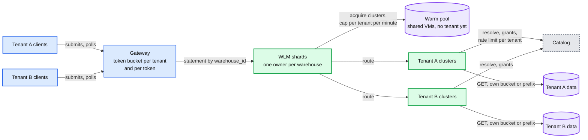
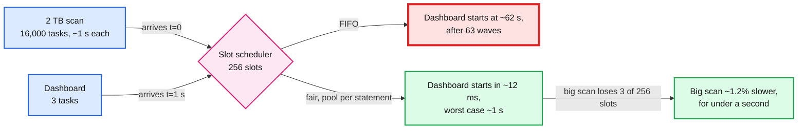
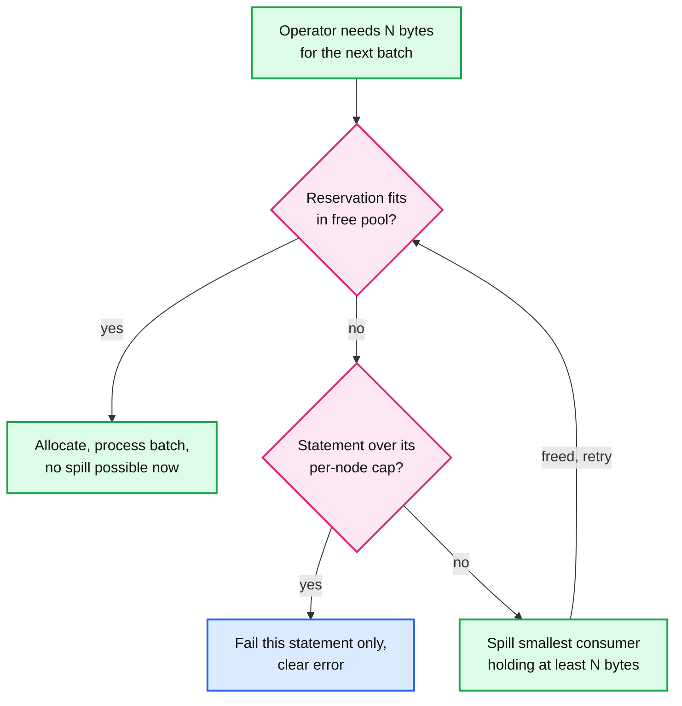

# Deep dive: multi-tenant isolation and admission

> One-line answer: isolation is a stack, not one feature. Tenants are separated by VMs they never share and by credentials scoped to one table. Workloads are separated by warehouses. Statements in a warehouse pass an admission step that predicts their cost and queues what does not fit. Statements on one cluster share cores fairly, with the ~1 s task as the preemption quantum, and share memory through reservations that spill before they fail. The shared layers above all of that (gateway, workload manager, warm pool, catalog, object store) each get a per-tenant quota, because that is where one tenant can still hurt another.

Part of [`../solution.md`](../solution.md) §4.3, §5.2. Sources: [Databricks warehouse sizing, scaling and queuing](https://docs.databricks.com/aws/en/compute/sql-warehouse/warehouse-behavior), Presto [ICDE 2019](https://trino.io/Presto_SQL_on_Everything.pdf) §IV-F, Photon [SIGMOD 2022](https://www.cs.cmu.edu/~15721-f24/papers/Photon.pdf) §5.3, [BigQuery slots](https://cloud.google.com/bigquery/docs/slots), Snowflake [NSDI 2020](https://www.usenix.org/system/files/nsdi20-paper-vuppalapati.pdf) §1. Related: [`../../concepts/rate-limiting-and-load-shedding.md`](../../../concepts/rate-limiting-and-load-shedding.md), [`../../concepts/sharding.md`](../../../concepts/sharding.md).

## 1. The stack, outermost first

| Layer | Protects against | Mechanism | Who shares it |
|---|---|---|---|
| Tenant | Data leaks, cross-tenant noise | VMs bound to one tenant for life, per-tenant network policy, per-cluster disk key, table-scoped credentials | Nobody |
| Warehouse | An ETL backlog in front of dashboards | Separate queue and clusters per workload | One team's workload |
| Admission | A cluster overloaded by too many statements | Predicted cost vs capacity, 10 running per cluster, queue ≤ 1,000 | Statements of one warehouse |
| Task slots | One statement taking every core | Fair share or multi-level feedback queue, ~1 s tasks | Statements on one cluster |
| Memory | One statement crashing the executor for ten | Reservations, spill, per-statement cap | Statements on one worker |
| Shared control plane | One tenant's burst hurting all tenants | Per-tenant quotas on each shared layer | All tenants |

The rule to say out loud: **each layer only has to handle what the layer outside it lets through.** VMs make cross-tenant compute noise zero, so everything below the tenant row is about one tenant's own users.

## 2. Admission: predict, admit, or queue

Databricks describes its serverless Intelligent Workload Management (IWM) in four steps ([docs](https://docs.databricks.com/aws/en/compute/sql-warehouse/warehouse-behavior)): "When a new query arrives, IWM predicts its resource requirements and checks available capacity." If there is no room, "the query is placed in a queue." "If wait times increase, the autoscaler quickly provisions more clusters to process queued queries." "When demand drops, IWM scales down resources to reduce costs while keeping enough capacity to handle recent peak loads."

Classic and pro warehouses use a fixed rule instead: "a fixed limit of one cluster per 10 concurrent queries", and "the maximum number of queries in a queue for all warehouse types is 1,000" (same page).

How our workload manager does it:
1. **Predict.** Features: the statement fingerprint (SQL with literals stripped), the tables and their pinned sizes, bytes to scan after pruning (the planner knows this before any task runs), and the p50 and p95 cost of past runs of the same fingerprint. Output: predicted task-slot-seconds and peak memory.
2. **Admit.** A cluster has room when its running count is under 10 and its predicted memory fits. A statement predicted at a few core-seconds (a dashboard tile) is admitted even to a cluster already running 10: it adds almost nothing, and making it queue behind large statements is exactly the failure users notice.
3. **Queue.** Otherwise the statement waits in the warehouse's queue in arrival order, with small statements allowed to jump the line (shortest-predicted-job-first among the queued, with an age bonus so large ones do not starve).
4. **Scale.** Queue wait and predicted drain time drive adding clusters. See [`elasticity-warm-pools-and-cost.md`](elasticity-warm-pools-and-cost.md).

Why a cap of 10 at all: the driver plans, schedules and tracks map outputs for every running statement, and every statement reserves memory on every worker. Past ~10, adding statements makes all of them slower instead of adding throughput.

A wrong prediction is cheap in one direction and expensive in the other. Predicting a large statement as small admits it next to dashboards, and the slot scheduler (§3) and memory reservations (§4) still protect them. Predicting a small statement as large makes it queue, which is the visible failure. So the predictor is tuned to err toward "small".

## 3. Task slots: why FIFO fails, and the task is the quantum

**Worked example.** Acme's X-Large: 32 workers × 8 vCPU = 256 task slots. A 2 TB scan arrives first: 16,000 tasks of one 128 MB split each, ~1 s per task at ~150 MB/s per core. A dashboard statement with 3 tasks arrives 1 s later.

- **FIFO** (Spark's default, `spark.scheduler.mode` = FIFO). Every freed slot goes to the earliest statement with pending tasks. The big statement has 16,000 ÷ 256 = ~63 waves, so its pending tasks run out after ~62 s. The dashboard's 3 tasks start at ~62 s. A 300 ms query takes over a minute.
- **Fair** (one Spark FAIR pool per statement, equal weight). A freed slot goes to the pool furthest below its fair share. With ~1 s tasks, 256 slots free up at about one every 4 ms, so the dashboard's 3 tasks get slots within ~12 ms on average and within one task length (~1 s) in the worst case. The big statement loses 3 of 256 slots for a fraction of a second, ~1.2% of its width.

**Presto's version: a multi-level feedback queue by CPU time.** Each worker runs many tasks with cooperative multitasking. "Any given split is only allowed to run on a thread for a maximum quanta of one second, after which it must relinquish the thread and return to the queue." Tasks are placed in "the five levels of a multi-level feedback queue" by their accumulated CPU time, "as tasks accumulate more CPU time, they move to higher levels", and "each level is assigned a configurable fraction of the available CPU time" (ICDE 2019 §IV-F). The effect: a statement that has used little CPU (a dashboard) runs ahead of one that has used a lot, without anyone predicting sizes up front.

**Why the task is the preemption quantum.** Neither engine kills a running task to make room. A slot is reassigned only when a task ends (Spark) or yields (Presto's 1 s quantum). So fairness is only as good as task length:
- Split size is capped (`spark.sql.files.maxPartitionBytes` = 128 MB) so scan tasks last about a second.
- A skewed 130 GB reduce partition holds one slot for ~15 minutes. Adaptive execution's skew split ([`shuffle-and-joins.md`](shuffle-and-joins.md)) fixes fairness as well as latency.
- Non-splittable inputs (one gzip CSV of 20 GB) produce one giant task. Say so, and recommend a splittable format.
- Killing tasks to preempt is possible but wasteful: the work is thrown away and rerun.

## 4. Memory: reserve, spill, cap

Cores can be shared in time. Memory cannot: a hash table that does not fit fails. Three designs:

- **Reservation with dynamic spill (Photon on Spark).** "A memory reservation asks for memory from Spark's unified memory manager", and it "can cause a spill, where Spark asks some memory consumer to release memory". Any consumer can be asked, including another Photon operator ("recursive spill"). The victim is chosen by sorting consumers "from least to most allocated memory" and spilling "the first consumer that holds at least N bytes", to minimise the number of spills (SIGMOD 2022 §5.3).
- **Per-statement cap on top.** If a statement's own reservations exceed its per-node cap, fail that statement with a clear message. One statement's error is better than an executor crash that kills ten.
- **Overcommit plus a reserved pool (Presto at Meta).** The paper's example: 500 nodes, 100 GB of query memory per node, statements allowed up to 5 TB globally, so 10 can each hold their maximum. Allowing 2:1 skew means a 20 GB per-node limit, and then only 5 statements are guaranteed to fit. Presto overcommits anyway because all 5 rarely peak on the same node. When a node runs out, it either spills (revoking memory from tasks in ascending order of execution time) or promotes the single largest statement into a reserved pool on every node and stalls the rest until it finishes, or kills the statement that unblocks the most nodes. Meta ran without spill: users preferred predictable in-memory latency (ICDE 2019 §IV-F).

Scale up versus scale out: spill is the signal to use a bigger cluster size ("If queries are spilling to disk, increase the cluster size", Databricks docs). Queueing is the signal to add clusters.

## 5. Shared layers and their quotas

| Shared layer | How one tenant hurts others | Quota |
|---|---|---|
| Gateway | 50k polls/s from one tenant's scripts | Token bucket per tenant and per token, long-poll to cut polls 5 to 10x |
| Workload manager | A hot warehouse saturating a WLM process | Shard by `warehouse_id`, one owner per warehouse, move hot warehouses to their own shard |
| Warm pool | One tenant's 500-cluster burst drains it, everyone else cold-starts | Cap VMs per tenant per minute. Beyond the cap the tenant gets cold VMs: slower, but only for them |
| Catalog | Metadata storms (thousands of resolves per second) | Per-tenant rate limit, drivers cache resolved metadata and grants for a short TTL |
| Object store | 5,500 GET/s per prefix shared by every reader of that prefix | Tenant data in its own bucket or prefix, randomized file prefixes on hot tables, disk cache |
| Metering stream | A tenant with millions of tiny statements | Aggregate per statement per minute on the driver, never per task |

## 6. Security isolation

- **No VM reuse.** A VM is bound to one tenant when it leaves the pool and is terminated when released. Memory and NVMe held that tenant's rows.
- **Per-cluster disk key.** Local disks (disk cache, shuffle, spill) are encrypted with a key that dies with the cluster.
- **Scoped, short-lived credentials.** The catalog checks grants at analysis and vends a credential that can read only that table's path, valid for about an hour. Workers never hold a bucket-wide key.
- **Row filters and column masks in the plan.** The planner injects them during analysis, so every execution path (Photon, fallback operators, caches keyed by security context) applies them.
- **User code in a sandbox.** Python UDFs run in a separate process with no network and no engine credentials. In a cluster shared by many users of one tenant, the row filter must hold against user code too.

## 7. The alternative: one shared pool for every tenant

BigQuery runs every query on shared slots. "BigQuery allocates slot capacity within a single reservation using an algorithm called fair scheduling." "Fair scheduling ensures that every query has access to all available slots at any time, and capacity is dynamically and automatically re-allocated among active queries as each query's capacity demands change." With reservation-based fairness, idle slots are shared "equally across all reservations within the same admin project" ([docs](https://cloud.google.com/bigquery/docs/slots)).

Why it is attractive: dedicated warehouses waste capacity. Snowflake measured average utilisation of ~51% CPU, ~19% memory, ~11% network transmit and ~32% network receive on its per-customer warehouses (NSDI 2020 §1). A shared pool multiplexes that away.

What it needs before we could adopt it: process-level isolation strong enough for untrusted tenants in one machine, a shared shuffle tier (BigQuery's disaggregated in-memory shuffle), and per-tenant accounting at slot granularity. We keep the VM as the boundary now, and name the shared pool for small statements as the evolution ([`../solution.md`](../solution.md) §10.11).

## 8. Interview soundbite

"Isolation is a stack. Tenants never share a VM and get table-scoped credentials. Workloads get separate warehouses. Admission predicts cost, admits tiny statements immediately and queues big ones, and queue time adds clusters. Inside a cluster, slots are shared fairly and the one-second task is the preemption quantum, so a dashboard gets cores within a second even behind a 16,000-task scan, where FIFO would make it wait a minute. Memory is reserved before it is used, someone spills before anyone fails, and a statement over its cap fails alone. The shared layers, gateway, pool, catalog, object store, each get a per-tenant quota."
