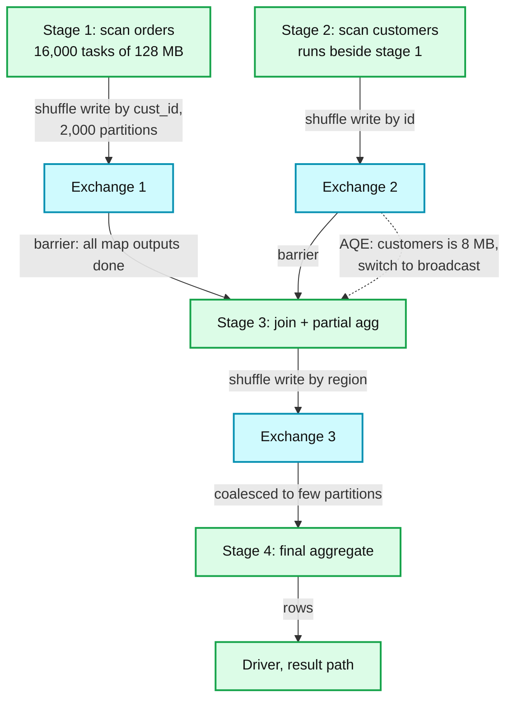
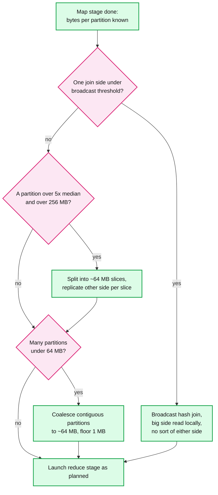

# Deep dive: query planning and adaptive execution

> One-line answer: the driver turns SQL text into a tree, resolves every name against the catalog (grants, row filters, one pinned version per table), rewrites the tree with rules until it stops changing, makes the few cost-based choices statistics can support (join order, build side, broadcast or not), inserts an exchange wherever a child's partitioning does not match what its parent needs, and cuts the plan at those exchanges into stages; then, because lake statistics are often stale or missing, it re-plans at every stage boundary from the real bytes each map task reported: coalesce tiny partitions, switch a join to broadcast, split skewed partitions, and prune the big side with runtime filters built from the small side.

Part of [`../solution.md`](../solution.md) §4.2, §5.1, §5.3, §10.1. Sources: Catalyst in [Spark SQL, SIGMOD 2015](https://people.csail.mit.edu/matei/papers/2015/sigmod_spark_sql.pdf) §4, defaults read from [`SQLConf.scala`](https://github.com/apache/spark/blob/master/sql/catalyst/src/main/scala/org/apache/spark/sql/internal/SQLConf.scala) and [`MapStatus.scala`](https://github.com/apache/spark/blob/master/core/src/main/scala/org/apache/spark/scheduler/MapStatus.scala) (Spark master, Sep 2026), [Photon, SIGMOD 2022](https://www.cs.cmu.edu/~15721-f24/papers/Photon.pdf) §5.1 and §5.5, dynamic query execution in [Dremel, VLDB 2020](https://www.vldb.org/pvldb/vol13/p3461-melnik.pdf) §5.

## 1. The pipeline, text to tasks

Catalyst uses one tree-rewriting framework "in four phases": analysis, logical optimization, physical planning, and code generation (SIGMOD 2015 §4.3). Photon keeps the first three and replaces the fourth: after physical planning it swaps in its vectorized operators and inserts a transition node wherever the plan returns to a row-based Spark operator (SIGMOD 2022 §5.1).

```mermaid
%% The planning pipeline in the driver. Plan-time stats are red: they are what makes the static plan wrong, and AQE is the loop that corrects it.
flowchart LR
    SQL[SQL text] -->|"tokens"| P[Parser]
    P -->|"unresolved tree"| A[Analyzer]
    A -->|"resolve, grants, row filters,<br/>pin version v"| CAT[Catalog]
    A -->|"resolved logical plan"| O[Rule optimizer<br/>batches to fixed point]
    O -->|"pushed filters, pruned columns"| CB[Cost-based choices<br/>join order, broadcast]
    ST[Plan-time stats<br/>stale or missing on lake tables]:::critical -->|"estimated rows, bytes"| CB
    CB -->|"logical plan"| PP[Physical planner<br/>insert exchanges]
    PP -->|"stages cut at exchanges"| DAG[Stage DAG, task sets]
    DAG -->|"map status: bytes per partition"| AQE[AQE re-plan<br/>at each boundary]
    AQE -->|"coalesce, broadcast, split skew"| DAG

    class SQL client
    class P,A,O,CB,PP,DAG,AQE service
    class CAT external

    classDef client   fill:#dbeafe,stroke:#2563eb,stroke-width:2px,color:#111
    classDef service  fill:#dcfce7,stroke:#16a34a,stroke-width:2px,color:#111
    classDef external fill:#e5e7eb,stroke:#6b7280,stroke-width:2px,color:#111,stroke-dasharray:4 3
    classDef critical fill:#fee2e2,stroke:#dc2626,stroke-width:4px,color:#111
```

## 2. Analysis: the only step that talks to the catalog

- **Resolve names** (tables, columns, functions) and fail fast on anything unknown. No task is launched for a typo.
- **Check grants** per table and per column. Column masks become projections over the scan. Row filters become filter nodes directly above the scan.
- **Row filters are a barrier for user code.** The optimizer may push its own predicates down, but it must never push a user-defined function below a row filter, or a leaky UDF could see rows the user may not read. Treat the filter as fixed in place for anything user-supplied.
- **Pin the snapshot.** For each table: the latest version `v` at this instant and its file list with per-file stats, from the snapshot cache when `(table, v)` is already parsed. The version is written into the plan, so every task, every retry, and every speculative copy reads the same files. A self-join reads one pinned version for both sides.
- **Read-your-writes.** The session carries the version its last write committed. Analysis refuses any cached snapshot older than that floor.
- **Vend credentials.** The catalog returns a credential scoped to each table's path for about an hour. Workers get it with their tasks, never a bucket-wide key.

## 3. Logical optimization: rules to a fixed point, then a little cost

Catalyst "groups rules into batches, and executes each batch until it reaches a fixed point, that is, until the tree stops changing" (SIGMOD 2015 §4.2). Simple rules compose into large effects. The ones that matter here:
- **Predicate pushdown** into the scan, where a filter becomes partition pruning, then file skipping on min/max stats, then row-group skipping inside Parquet.
- **Column pruning.** Read 2 columns of a 50-column table.
- **Constant folding, filter and projection collapsing, subquery decorrelation, outer-to-inner join** when a later filter rejects the nulls the outer join would produce.

Cost-based choices come last and are few. In 2015 "cost-based optimization is only used to select join algorithms", broadcasting relations known to be small (SIGMOD 2015 §4.3.3). Open-source Spark still ships `spark.sql.cbo.enabled` = false and `spark.sql.cbo.joinReorder.enabled` = false. The reason is the red node above: statistics on lake tables are often missing or stale, and a confident wrong estimate is worse than none. Our engine turns cost-based join ordering on only where the table format keeps fresh stats (computed from file stats on every commit), and relies on AQE to correct the rest.

## 4. Physical planning and exchange insertion

- Every physical operator declares the **distribution it requires** of its children (hash-partitioned by keys, broadcast, single partition) and the one it produces.
- The planner walks the tree. Wherever a child's output does not satisfy the parent, it inserts an **exchange** (a shuffle) or a **broadcast exchange**.
- Aggregates split into a **partial** aggregate below the exchange and a **final** one above it, so a whale key collapses to one row per map task before anything crosses the network.
- Join choice at plan time: broadcast if the estimated side is under `spark.sql.autoBroadcastJoinThreshold` = 10 MB, else sort-merge (`spark.sql.join.preferSortMergeJoin` = true). Photon does not implement sort-merge join and runs a spilling shuffled hash join instead (SIGMOD 2022 §6.1). See [`shuffle-and-joins.md`](shuffle-and-joins.md).

## 5. From plan to stages

The DAG scheduler cuts at every exchange. For the §4.2 query (`orders JOIN customers GROUP BY region`):

- Scan tasks: one per ~128 MB split (`spark.sql.files.maxPartitionBytes`), so 2 TB of `orders` is 16,000 tasks, ~63 waves on 256 cores.
- Reduce tasks: start from `spark.sql.shuffle.partitions` (200 by default, we start at 2,000 so skew is visible) and let AQE decide the real count.
- Stages 1 and 2 have no dependency, so they run at the same time. Stage 3 waits for both.

## 6. Adaptive query execution: re-plan at every boundary

AQE has been on by default since Spark 3.2 (`spark.sql.adaptive.enabled` = true). After a map stage the driver knows what no estimate could: the bytes each map task wrote for each reduce partition.

**What the driver can actually see.** Up to 2,000 reduce partitions, a map status stores each size as one byte on a log scale of base 1.1, about 10% error. Above 2,000 (`spark.shuffle.minNumPartitionsToHighlyCompress`), it keeps only the average of normal blocks plus exact sizes for blocks over 100 MB (`spark.shuffle.accurateBlockThreshold`). Skewed partitions are exactly the huge blocks, so skew detection survives the compression. Coalescing works on averages, which is fine.

Three rewrites, checked in this order:

1. **Switch to broadcast.** If a side's real size is under the adaptive threshold (it defaults to the static 10 MB), the sort-merge join becomes a broadcast hash join. Both sides' map writes already happened, so the saving is no sort on either side and a **local** read of the big side's shuffle files instead of an all-to-all fetch (`spark.sql.adaptive.localShuffleReader.enabled` = true). Dremel goes further: it starts a hash join by shuffling both sides, and "if one side finishes fast and is below a broadcast data size threshold, Dremel will cancel the second shuffle and execute a broadcast join instead" (VLDB 2020 §5).
2. **Split skew.** A partition over 5x the median **and** over 256 MB (`skewJoin.skewedPartitionFactor`, `skewedPartitionThresholdInBytes`) is split by map-output ranges into ~64 MB slices, each its own task, and the matching partition of the other side is read once per slice. The 130 GB partition from §5.3 becomes ~2,000 tasks.
3. **Coalesce.** Merge contiguous small partitions up to the advisory 64 MB (`advisoryPartitionSizeInBytes`), never below 1 MB (`coalescePartitions.minPartitionSize`). 2,000 partitions averaging 5 MB (10 GB) become ~160 tasks of 64 MB. Contiguous blocks are fetched in one request (`fetchShuffleBlocksInBatch` = true).

**Trap for a multi-tenant cluster.** `spark.sql.adaptive.coalescePartitions.parallelismFirst` defaults to true: Spark then ignores the 64 MB target and sizes partitions to fill the cluster's default parallelism. The config's own doc recommends false "on a busy cluster". A warehouse cluster running 10 statements is a busy cluster, so we set it false: one statement's thousands of tiny tasks would otherwise crowd the fair scheduler ([`multi-tenant-isolation-and-admission.md`](multi-tenant-isolation-and-admission.md)).

**Why not just better statistics?** Stats describe base tables. AQE sees the intermediate result after filters and joins. A filter on two correlated columns, or a join whose fan-out depends on the data, cannot be estimated from per-column min and max.

## 7. Runtime filters: let the small side prune the big side

- **Dynamic partition pruning** (default on since Spark 3.0). The fact table joins a dimension filtered by `region = 'EU'` on a partition column. The dimension's surviving keys become a partition filter on the fact scan, so whole partitions are never listed or read. Photon extends the idea to file min/max stats as dynamic file pruning (SIGMOD 2022 §5.5).
- **Runtime bloom filter** (added in Spark 3.3 with default off, on by default since 3.4). When the small side is under 10 MB (`runtime.bloomFilter.creationSideThreshold`), the engine builds a bloom filter over its join keys and applies it in the big side's scan, dropping non-matching rows before they are shuffled. It saves shuffle bytes, not files. [`../../../concepts/bloom-filter.md`](../../../concepts/bloom-filter.md).
- **The cost.** The big side's scan waits for the small side's filter, and the filter costs an extra pass over the small side. Worth it only when the small side is selective, which the planner checks from estimated selectivity.

## 8. Planning for the small-query path

For the 90% of statements that read under 1 GB, fixed planning costs dominate ([`../solution.md`](../solution.md) §5.1).
- **Snapshot cache.** `(table, version) -> parsed file list with stats`. One LIST of the log tail tells the driver whether `v` is still the latest. ~20 ms instead of ~250 ms cold ([`../../delta-lake-transactions/`](../../delta-lake-transactions/)).
- **Plan cache for parameterized dashboards** [design choice]. Key: normalized SQL with literals as parameters, table versions, security context. The result cache already covers exact repeats; a plan cache covers the same tile with a new date filter.
- **One-stage fast path.** When pruned input is under a few tens of MB [estimate], plan broadcast plus a single aggregating task: no exchange, no barrier, one task wave.
- **Planning CPU is a driver capacity limit.** A burst of 100 tiny statements a second is 100 plannings a second on one driver. The fix is the result cache and more clusters, not a faster optimizer ([`../solution.md`](../solution.md) §10.3).

## 9. Failure modes and trade-offs

| Failure | Symptom | Guard |
|---|---|---|
| Stale stats pick a broadcast of a 5 GB side | Executor or driver out of memory, or `spark.sql.broadcastTimeout` (300 s) expires | Check the materialized size before broadcasting; AQE falls back to a shuffle join |
| Catalog slow or down | Analysis blocks, nothing new runs | Short-TTL cache of grants and versions as a documented degradation ([`../solution.md`](../solution.md) §8) |
| 100-way join | Optimizer time explodes | Cap dynamic-programming join reorder by table count, then greedy |
| Skew on both sides of an inner join | Split both, sub-join count multiplies | Split both but cap slices; isolate the whale key into its own broadcast join |
| Long statement pins an old version | Files needed by the pin are vacuumed mid-scan | Retention longer than the statement timeout (#15 §5.5) |
| Photon and Spark disagree on a cast | Different results depending on which engine ran the operator | Semantic test suite, fall back to Spark for the operator (SIGMOD 2022 §5.6) |

## 10. Interview soundbite

"Planning is four phases: analyze against the catalog, where grants, row filters and one pinned table version get baked into the plan; rewrite with rules until the tree stops changing; make the few cost-based choices stats can support; and insert exchanges where partitioning does not match, which is where stages are cut. Lake stats are unreliable, so the real optimizer is AQE: after each map stage it knows the bytes per partition and switches to broadcast under 10 MB, splits partitions over 5x the median and 256 MB into 64 MB slices, and coalesces the tiny ones. On a shared cluster, turn off parallelism-first coalescing, or one query floods the scheduler with tiny tasks."
