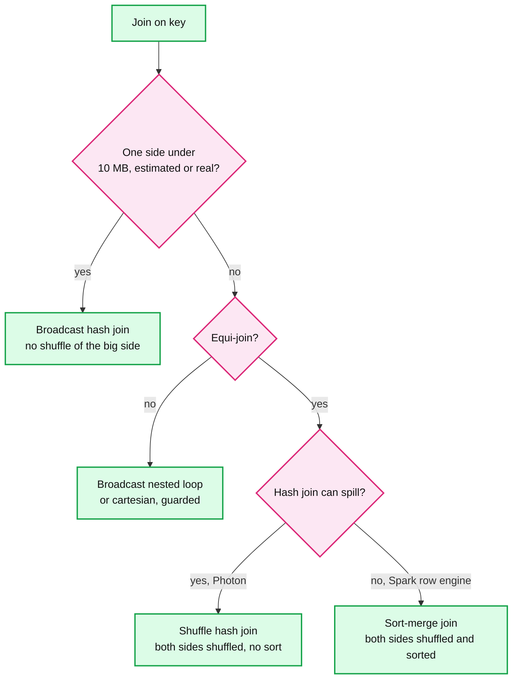
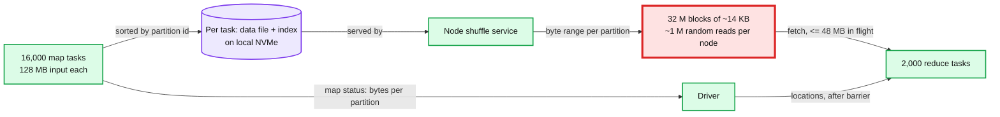
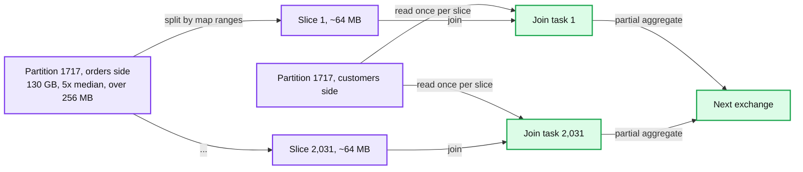
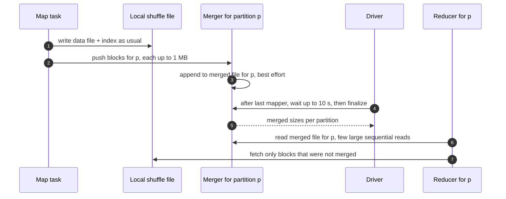

# Deep dive: shuffle and joins

> One-line answer: the cheapest shuffle is the one you avoid, so broadcast any join side under the threshold (10 MB static, re-decided at runtime); when two big sides must meet, both are hash-partitioned by key through a shuffle in which every map task writes one sorted data file plus an index to local NVMe and every reducer fetches its slice from every map output, which makes M x R blocks (32 M blocks of ~14 KB for the solution's 2 TB join) and turns bytes into random IO; adaptive execution coalesces tiny partitions and splits skewed ones at the stage boundary, a node shuffle service and decommission migration keep map outputs alive past the executor, push-based merge turns the random reads into a few sequential ones for large shuffles, and a disaggregated shuffle tier is reserved for the few statements whose predicted shuffle is big enough to pay for an extra hop.

Part of [`../solution.md`](../solution.md) §5.3 (the red node), §4.2, §10.1, §10.3. Sources: [Magnet, VLDB 2020](https://www.vldb.org/pvldb/vol13/p3382-shen.pdf), [Dremel, VLDB 2020](https://www.vldb.org/pvldb/vol13/p3461-melnik.pdf) §3.2 and §5, [Snowflake, NSDI 2020](https://www.usenix.org/system/files/nsdi20-paper-vuppalapati.pdf) §4, [Photon, SIGMOD 2022](https://www.cs.cmu.edu/~15721-f24/papers/Photon.pdf) §5.3 and §6.1, Spark defaults from [`config/package.scala`](https://github.com/apache/spark/blob/master/core/src/main/scala/org/apache/spark/internal/config/package.scala), [`SQLConf.scala`](https://github.com/apache/spark/blob/master/sql/catalyst/src/main/scala/org/apache/spark/sql/internal/SQLConf.scala) and [`configuration.md`](https://github.com/apache/spark/blob/master/docs/configuration.md) (master, Sep 2026).

## 1. What a shuffle costs

A shuffle exists wherever rows must meet other rows with the same key on one machine: a join on two big sides, a `GROUP BY` after the partial aggregate, a `DISTINCT`, a window partition. It costs twice:
- **Bytes.** Every shuffled byte is written to disk, crosses the network, and is read again. The solution's large join shuffles 440 GB on 32 nodes: ~14 GB out and ~14 GB in per node, ~11 s of network each way at 1.25 GB/s.
- **Blocks.** Every map task writes one slice per reduce partition: M x R slices, each fetched by its own request. 16,000 x 2,000 = **32 M blocks**, 440 GB ÷ 32 M ≈ **14 KB each**, ~1 M random reads per node.

The second cost is the one that grows faster, and it is why the shuffle is the red node in [`../solution.md`](../solution.md) §6.

## 2. Join strategies and when each is chosen

| Strategy | How it works | Chosen when | Breaks when |
|---|---|---|---|
| Broadcast hash join | Small side collected, sent to every executor, hashed there. Big side never moves | Side under `spark.sql.autoBroadcastJoinThreshold` = 10 MB at plan time, or under the adaptive threshold at runtime | Side is bigger than estimated: memory on every executor (32 copies on an X-Large), `spark.sql.broadcastTimeout` = 300 s |
| Shuffle hash join | Both sides shuffled by key, hash table built per partition from the smaller side | One side's partitions fit in memory. Photon's default, with spilling | Build partition does not fit and the implementation cannot spill |
| Sort-merge join | Both sides shuffled and sorted by key, then merged | Two big sides. Spark's default (`spark.sql.join.preferSortMergeJoin` = true) | Always works, pays a sort of both sides |

Why Spark defaults to sort-merge and Photon does not: "Photon does not support sort-merge join, but Apache Spark uses it by default because its shuffled hash join implementation does not support spilling" (SIGMOD 2022 §6.1). Photon's vectorized hash join ran 3x faster than the previous runtime's join in the paper's microbenchmark. With a hash join that can spill, sorting both sides is wasted work.

## 3. The shuffle file format

- **Map side, sort-based.** A map task tags each output row with its reduce partition id, buffers and sorts by partition id (spilling sorted runs if memory runs out), then writes **one data file plus one index file** of byte offsets. Files on disk are 2 x M, not M x R. The M x R blocks are byte ranges inside those files.
- **Bypass path.** With at most 200 partitions and no map-side aggregation (`spark.shuffle.sort.bypassMergeThreshold` = 200), the writer skips the sort: one temporary file per partition, concatenated at the end.
- **Map status.** On completion the task tells the driver where its file is and how many bytes each partition got (one byte per partition on a log scale, or average plus huge blocks above 2,000 partitions, see [`query-planning-and-adaptive-execution.md`](query-planning-and-adaptive-execution.md) §6).
- **Reduce side.** After the stage barrier, each reducer asks every node for the byte range of its partition in every map output, keeping at most 48 MB in flight (`spark.reducer.maxSizeInFlight`). Contiguous ranges of coalesced partitions are fetched in one request (`fetchShuffleBlocksInBatch` = true).

## 4. The M x R problem

- **Bytes grow with data. Blocks grow with M x R.** M is input ÷ split size, R is chosen for the reduce side. Double the data and M doubles, bytes double, and each block halves in size.
- **Disk.** 1 M random 14 KB reads per node is seconds on local NVMe and 1,000,000 ÷ 3,000 = ~333 s, **~5.5 min**, on a 3,000 IOPS network disk. That is why workers need local SSD.
- **Measured in production.** LinkedIn: average shuffle block "only around 10s of KBs", billions of blocks read a day, and "around 15% of the total Spark computation resources" wasted on shuffle fetch latency (Magnet §1).
- **Why tuning M or R does not fix it.** Fewer reducers means bigger partitions, more spill, and worse skew. Fewer, bigger map tasks means longer tasks, which breaks the fairness quantum and makes every straggler and retry more expensive ([`../solution.md`](../solution.md) §5.2, §5.4).

## 5. Skew in depth

**Where it comes from.** A whale customer, `NULL` join keys, default values (`0`, `'unknown'`), one hot day in a backfill. It is the hot-key problem from [`../../../concepts/sharding.md`](../../../concepts/sharding.md), with a reduce task in place of a shard.

**Aggregations mostly fix themselves.** The partial aggregate collapses a whale key to one row per map task before the shuffle. The exceptions keep every row: `COUNT(DISTINCT)`, `collect_list`, exact percentiles.

**Joins do not.** A key with 30% of 440 GB is a ~130 GB reduce partition, one task, ~15 minutes at 150 MB/s, while 1,999 siblings finish in seconds.

- **Detection and split.** Over 5x the median and over 256 MB, split into ~64 MB slices: 130 GB ÷ 64 MB ≈ 2,031 tasks. 15 minutes becomes seconds.
- **The price.** The other side's matching partition is read once per slice. Cheap when it is small, expensive when both sides are skewed on the same key.
- **Outer joins.** Only the preserved side can be split. For `A LEFT JOIN B`, splitting `B` would emit an unmatched `A` row once per slice.
- **Manual fallbacks.** Salt the key (append `0..N-1` on the big side, replicate the small side N times), or pull the whale key into its own broadcast join and `UNION` it back.
- **Skew is not a straggler.** Speculation copies the same 130 GB task and doubles the work ([`fault-tolerance-and-stragglers.md`](fault-tolerance-and-stragglers.md)).

## 6. Keeping map outputs alive

Map outputs live on the node that wrote them. Losing them costs a rerun of their map tasks from lineage. The ladder, cheapest first:
- **Node shuffle service** (`spark.shuffle.service.enabled`, default false). A separate process serves the files, so they survive the executor process dying, not the VM.
- **Decommission migration** (`spark.storage.decommission.enabled`, default false; `shuffleBlocks.enabled` defaults to true once it is on). A spot reclaim gives ~2 minutes of notice on AWS: enough to copy shuffle blocks to a peer and update the driver.
- **Push-merge's second copy** (§7). The merged file sits on a different node from the original blocks.
- **A disaggregated tier** (§8). Survives any compute loss. Dremel uses the shuffle result "as a checkpoint of the query execution state", which also lets the scheduler preempt workers mid-query (VLDB 2020 §5).

## 7. Push-based merge (Magnet)

- Blocks up to 1 MB are pushed (`spark.shuffle.push.maxBlockSizeToPush`). Merging is best effort: anything not merged is fetched the old way, so correctness never depends on the merger.
- Result: each reduce partition is one mostly contiguous file, and the original blocks remain as a second copy. Magnet reduced "the end-to-end runtime of LinkedIn's production Spark jobs by nearly 30%" (abstract).
- Costs: every block is written twice, and the driver waits up to 10 s after the last mapper to finalize merges (`spark.shuffle.push.finalize.timeout`), though only for shuffles over 500 MB (`spark.shuffle.push.minShuffleSizeToWait`). Spark's docs say it is "not well suited for jobs/queries which runs quickly dealing with lesser amount of shuffle data", and in open source it is "only supported for Spark on YARN with external shuffle service". Off by default (`spark.shuffle.push.enabled` = false).

## 8. Disaggregated shuffle

- **Dremel (2014).** A separate in-memory shuffle tier. It "reduced the shuffle latency by an order of magnitude", "enabled an order of magnitude larger shuffles", and "reduced the resource cost of the service by more than 20%". Disaggregated memory is now 80% of BigQuery's memory footprint (VLDB 2020 §3.2).
- **Snowflake.** Intermediate data in memory, spilled to local SSD, then to S3. Spilling to S3 means no tracking of remote locations and no out-of-disk failures (NSDI 2020 §4.1).
- **Trino.** An exchange manager spools intermediate data to object storage for task-level retry ([docs](https://trino.io/docs/current/admin/fault-tolerant-execution.html)).
- **Open source services.** Apache Celeborn and Apache Uniffle offer the same shape for Spark.
- **The cost, every time.** One extra network hop for every shuffled byte, and a stateful service with its own capacity planning and failure modes.

## 9. Spill

- Operators reserve memory before they allocate. When a reservation fails, the engine spills the consumer that frees enough while spilling least: Photon sorts consumers by memory held and spills the first holding at least the requested bytes, possibly another operator's state (SIGMOD 2022 §5.3).
- Sort-merge degrades gracefully (external sort). Hash joins and aggregations spill partitions to disk and process them one at a time.
- Spill, shuffle files and the disk cache share the same NVMe. A statement that spills on every run is a signal to use a bigger warehouse size, not more clusters ([`../solution.md`](../solution.md) §5.2). See [`vectorized-execution-and-scan-path.md`](vectorized-execution-and-scan-path.md).

## 10. The threshold rule

| What the planner predicts | Mechanism | Why |
|---|---|---|
| A join side under 10 MB, or real size under the adaptive threshold | Broadcast, no shuffle | Most BI joins are fact x small dimension |
| Any shuffle | AQE on: coalesce to 64 MB, split skew, local NVMe, node shuffle service | Costs nothing when there is nothing to fix |
| Shuffle over ~100 GB [estimate] | Push-based merge | Random reads dominate. Below ~500 MB the finalize wait is skipped anyway |
| Shuffle over local NVMe headroom, or statement predicted over ~10 min [estimate] | Disaggregated or spooled shuffle | Survives node loss, lets compute shrink mid-query |
| Two big sides, tight memory, no spilling hash join | Sort-merge join | Always completes |

## 11. Interview soundbite

"First, don't shuffle: broadcast anything under 10 MB, and let AQE re-decide from real sizes. When you must, every map task writes one sorted file plus an index, and every reducer pulls its slice from every map output. The trap is blocks, not bytes: 16,000 by 2,000 is 32 million 14 KB reads, which is why LinkedIn saw 15% of compute waiting on fetches. Local NVMe and AQE coalescing handle most of it, AQE splits skew over 5x the median and 256 MB, push-merge turns random reads into sequential ones for big shuffles, and a disaggregated tier like BigQuery's is for the few statements big enough to pay an extra hop."
