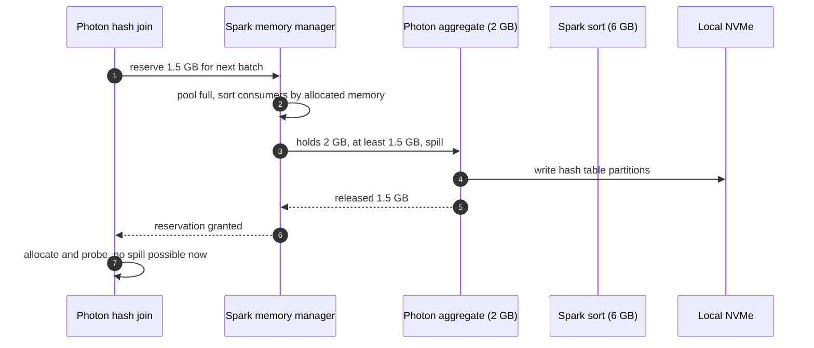
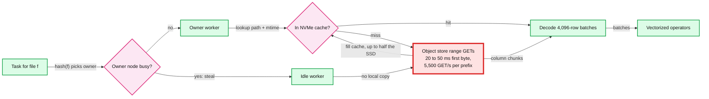

# Deep dive: vectorized execution and the scan path

> One-line answer: a worker spends its time in two places, fetching bytes from the object store and turning column chunks into answers; the scan path deletes bytes before they are fetched (partition values, file statistics, clustering, row-group statistics, runtime filters, and an NVMe cache keyed by immutable file paths), and the engine processes what is left in column batches through precompiled kernels chosen per batch at runtime (vectorized interpretation, Photon's choice over code generation), reserving memory before allocating it so any operator can spill on behalf of any other instead of the executor dying.

Part of [`../solution.md`](../solution.md) §5.1 and §10.1. Paper: Photon ([SIGMOD 2022](https://www.cs.cmu.edu/~15721-f24/papers/Photon.pdf)). Docs: [Databricks disk cache](https://docs.databricks.com/aws/en/optimizations/disk-cache), [S3 performance guidelines](https://docs.aws.amazon.com/AmazonS3/latest/userguide/optimizing-performance.html). Cache placement and work stealing: Snowflake ([NSDI 2020](https://www.usenix.org/system/files/nsdi20-paper-vuppalapati.pdf)). Spark defaults from [`SQLConf.scala`](https://github.com/apache/spark/blob/master/sql/catalyst/src/main/scala/org/apache/spark/sql/internal/SQLConf.scala). Background: [`../../concepts/columnar-db.md`](../../../concepts/columnar-db.md).

## 1. Three ways to run an operator tree

| Model | How data moves | Cost per row | Used by |
|---|---|---|---|
| Volcano iterator | Each operator calls `next()` on its child for one row | A virtual call plus branches per row per operator | Classic row engines |
| Whole-stage code generation | The planner fuses a pipeline (scan, filter, project, partial aggregate) into one generated function compiled at runtime | Near zero, but compile time per query, and operator boundaries vanish | Spark Tungsten, HyPer |
| Vectorized interpretation | Each operator runs a precompiled kernel over a batch of column values | One dispatch per batch, tight loops, SIMD | MonetDB/X100, Photon |

Photon chose vectorized interpretation even though Spark SQL already used code generation (paper §4). The reasons, which are the answer to "why not codegen?":
- **Adaptivity is natural.** Dynamic dispatch is already how the engine picks a kernel, so picking a different kernel per batch (no nulls, ASCII-only strings) costs nothing extra. A code generator would have to compile every variant or recompile at runtime.
- **Observability survives.** Operators stay separate, so time and rows are measured per operator. Code generation collapses a pipeline into one function and the per-operator profile is gone.
- **Engineering speed.** The team built an aggregation prototype with a code-generating engine in about two months and with the interpreted engine in a couple of weeks. Print debugging and profilers just work.
- **The gap is small.** Code generation still wins some cases, such as long expression trees evaluated row by row. The paper notes that even HyPer, the reference code-generating engine, includes an interpreter to avoid compile time and startup overhead.

## 2. Column batches, active rows, and per-batch specialization

A batch holds one vector per column plus a **position list of active rows**. A filter does not copy data. It writes a shorter position list, and later kernels loop only over those positions. Dense work stays dense, and a selective filter does not force a copy.

Two runtime tricks from the paper:
- **Batch-level specialization.** Before running a kernel, the operator checks cheap properties of this batch (does the column have nulls, is every string ASCII) and calls the specialized kernel. A custom SIMD ASCII check kernel gave 3x over the previous engine on an upper-casing microbenchmark.
- **Compaction of sparse batches.** After a selective join or filter, a batch may have few active rows. Probing a hash table with a sparse batch wastes the memory-level parallelism the probe loop relies on, and every downstream operator pays interpretation overhead per sparse batch. On TPC-DS Q24, compacting before the probe gave 1.5x over probing sparse batches and 1.55x over the previous code-generated engine. Without compaction Photon was slower than the old engine on that query, which is the honest cost of the vectorized model.

```mermaid
%% One batch through a pipeline. Filters shrink the position list, kernels are chosen per batch.
flowchart LR
    PQ[Parquet decode<br/>4,096 rows per batch] -->|"column vectors"| B[Batch<br/>vectors + active rows]
    B -->|"day = today"| F[Filter kernel<br/>writes new position list]
    F -->|"~5% active"| SP{Sparse?}
    SP -->|"yes: compact first"| CP[Compaction]
    SP -->|"no"| SPEC{Batch properties<br/>nulls, ASCII}
    CP -->|"dense batch"| SPEC
    SPEC -->|"no nulls: fast kernel"| HA[Hash aggregate<br/>vectorized probe]
    SPEC -->|"has nulls: general kernel"| HA
    HA -->|"partial aggregates"| OUT[Shuffle write or result]

    class PQ,B,F,CP,HA,OUT service
    class SP,SPEC decision

    classDef service  fill:#dcfce7,stroke:#16a34a,stroke-width:2px,color:#111
    classDef decision fill:#fce7f3,stroke:#db2777,stroke-width:2px,color:#111
```

## 3. Living inside Spark: JNI and transitions

Photon is not a separate system. It runs inside the Spark executor as the body of a task, called through JNI (paper §4 to §5). It never starts converting in the middle of a plan, to avoid repeated column-to-row pivots. After Spark plans a query, Photon walks the physical plan bottom up from the file scans, replaces the operators it supports, and inserts a **transition** where the plan returns to a Spark operator it does not yet support (columnar to row). So a query can be partly Photon and partly Spark, which is how the engine shipped before it covered every operator. Partial coverage has two costs. Transitions cost a pivot, which batching amortizes. In the paper's worst case (a query that only moves one integer column through a transition) 0.06% of time was in JNI methods and 0.2% in the adapter node. And **results must be identical** whichever engine runs an expression: Java and C++ disagree on some integer to floating point casts, so semantic equivalence needs its own test effort.

Photon also takes part in adaptive execution. Its operators export the statistics AQE needs at stage boundaries (shuffle file sizes, rows produced), and it works with shuffle and subquery reuse and dynamic file pruning.

## 4. Memory: reserve first, then allocate

The problem: an operator often cannot know how much memory it will need, and SQL operators share the executor with user code. Photon separates two steps (paper §5.3):

1. **Reservation.** Ask Spark's unified memory manager for N bytes. If memory is short, the manager asks some consumer to spill. That consumer can be a Spark operator, another Photon operator, or the requester itself ("recursive spill"). The policy, the same as open-source Spark: sort consumers from least to most allocated and spill the first one that holds at least N bytes. Fewest spills, no more data spilled than needed.
2. **Allocation.** Once reserved, allocate locally with no chance of spilling mid-computation. A hash join or grouping aggregation processes each input batch in two phases: reserve for the batch (spills may happen here), then produce transient data (no spills can happen).

Compare Presto's approach: per-query and per-node limits, overcommit, and a **reserved pool** into which the single biggest query is promoted when a node runs out ([ICDE 2019](https://trino.io/Presto_SQL_on_Everything.pdf)). Photon's is more flexible, Presto's is more predictable.

One trap the paper describes: most Photon memory is off-heap, so the JVM rarely garbage collects. Broadcasts go through Spark's on-heap mechanism, and those transient copies lingered until another large allocation hit a JVM out-of-memory error. The fix tied Photon state to the query's lifetime with a cleanup listener.

Knobs: `spark.memory.fraction` = 0.6 of the heap for execution plus storage, `spark.memory.storageFraction` = 0.5 of that protected for cached blocks (Spark defaults). A per-statement cap on top turns "this statement is too big" into one failed statement, not a crashed executor (solution §5.2).

## 5. The Parquet read path

For each surviving file (see [`../../concepts/columnar-db.md`](../../../concepts/columnar-db.md) for the format):
1. **Footer, 2 GETs.** Read the last 8 bytes (footer length and magic), then the footer: schema, row groups, and per column chunk the min, max and null count.
2. **Row group pruning.** Skip row groups whose chunk statistics cannot match the predicate.
3. **Column chunk range GETs.** Fetch only the chunks for the columns the query reads. Two columns out of fifty is ~4% of the bytes.
4. **Pages and encodings.** Chunks are split into pages of ~1 MB, often dictionary encoded. A filter on a dictionary-encoded column can be evaluated once per dictionary entry.
5. **Decode into batches.** Spark's vectorized reader emits 4,096 rows per batch (`spark.sql.parquet.columnarReaderBatchSize`).

Cost per file is 2 + (columns × surviving row groups) requests at 20 to 50 ms to first byte. That is why many small files hurt far more than their bytes suggest, and why splits of 128 MB (`spark.sql.files.maxPartitionBytes`) are the task size.

## 6. Pruning layers, outermost first

| Layer | When | Uses | Example skip |
|---|---|---|---|
| Partition values | Planning | Directory or partition column values in the table log | `day = today` drops other days |
| File statistics (data skipping) | Planning | Min/max per file from the table log | `tenant_id = 42` drops files whose range excludes 42 |
| Clustering | Write time, pays off at planning | Z-order or liquid clustering makes file ranges tight | Without it every file spans all tenants and stats skip nothing |
| Dynamic partition pruning | Runtime | Keys produced by the filtered dimension side | `region = 'EU'` on customers prunes orders files (on by default since Spark 3.0) |
| Runtime bloom filter | Runtime | Bloom filter of join keys | Drops fact rows before the shuffle (added in Spark 3.3, on by default since 3.4) |
| Row group statistics | Scan | Parquet footer | Skips 128 MB groups inside a file |
| Column projection | Scan | The plan's column list | Reads 2 of 50 columns |

The layers multiply. A 100 TB table in 1 GB files is ~100k files. One day of 365 is ~275 files. Clustering by tenant leaves a handful [estimate]. Nothing after this point matters as much as this funnel.

## 7. The disk cache on NVMe

The first read of a remote Parquet file stores a copy on the worker's local SSD in a fast intermediate format, and later reads are local. It uses at most half of the local SSD, it notices files that were created, deleted or overwritten and evicts stale entries, and it is lost when the cluster stops or a worker is decommissioned ([docs](https://docs.databricks.com/aws/en/optimizations/disk-cache)). Under a table format files are immutable, so a key of path plus modification time can never be stale.

Hit rates are high even for small caches: Snowflake measured 60 to 80% on persistent data depending on query type, because access is skewed and temporal (NSDI 2020 §1). Hits depend on scheduling:
- **File-to-node consistent hashing.** A file's tasks go to the node that cached it. Snowflake adds **lazy** consistent hashing: on resize, files are not moved; a task lands on the file's new owner, which fetches from the object store on first miss and caches it (NSDI 2020 §6).
- **Work stealing.** If the owner is overloaded, an idle node steals the task when its expected completion time is lower, and reads the file from the object store (NSDI 2020 §5).
- **Short locality wait.** Spark waits `spark.locality.wait` = 3 s for a preferred node by default. For a sub-second statement a cache miss is cheaper than 3 s of waiting, so lower it (~500 ms [estimate]).

## 8. Object-store limits

S3 serves at least 5,500 GET/s per prefix and returns `503 SlowDown` above what a prefix can take ([docs](https://docs.aws.amazon.com/AmazonS3/latest/userguide/optimizing-performance.html)). A hot table queried by 100 concurrent medium statements at ~4 MB per GET needs ~50k GET/s, so it will be throttled if its files share one prefix (solution §10.3). The fixes, in order: disk cache hit rate (the leading indicator), randomized file prefixes for hot tables so load spreads across partitions of the store, and retries with jittered backoff. Do not let speculation treat a throttled task as a straggler: a copy doubles the request rate against the prefix that is already refusing requests.

## 9. Numbers to quote

| Claim | Number | Source |
|---|---|---|
| Customer workloads | 3x average, over 10x maximum over the previous engine | Photon §1 |
| TPC-H at SF 3000 | 4x average, 23x maximum (Q1) | Photon §6.2 |
| TPC-DS 100 TB | Audited world record, November 2021, 256 i3.2xlarge nodes, data on S3 | Photon §1, §6.2 |
| Vectorized hash join | 3x faster than the previous engine's sort-merge and shuffled hash joins in a microbenchmark | Photon §6.1 |
| Production use | Tens of millions of queries from hundreds of customers by 2022 | Photon §1 |
| Disk cache | At most half the local SSD | Databricks docs |
| Cache hit rate | 60 to 80% on persistent data | Snowflake NSDI 2020 |
| Per-core scan rate | ~150 MB/s compressed Parquet | [estimate], solution §2 |

## 10. Interview soundbite

"Two costs dominate a scan: getting bytes and chewing them. I delete bytes first: partitions, file min/max from the table log, clustering so those ranges are tight, runtime filters from the join, row-group stats, column projection, then an NVMe cache that can never be stale because files are immutable, with tasks hashed to the node that cached their file. What survives goes through a vectorized engine: column batches with an active-row list, kernels picked per batch, and memory reserved before it is allocated so any operator can spill for another. I would pick vectorized interpretation over codegen for adaptivity, per-operator profiles and engineering speed. Photon's numbers are 3x average on customer workloads and a 100 TB TPC-DS record."
