# Diagrams: multi-tenant distributed SQL query engine

The D1 to D12 set from `hld/CLAUDE.md` §4. A diagram is drawn once: the ones embedded in [`solution.md`](solution.md) are linked here, not repeated.

| # | Diagram | Where |
|---|---|---|
| D1 | Context | below |
| D2 | Data flow | below |
| D3 | Component architecture (final design) | `solution.md` §6 |
| D4 | Happy path per FR | FR1 small query: `solution.md` §6 Flow 1. FR2 large join with skew: Flow 2. FR3 burst and scale-out: Flow 3. FR5 cost of one statement: Flow 6. FR1 large result via links: below |
| D5 | Failure paths | Worker dies mid-shuffle: `solution.md` §6 Flow 4. Driver dies: Flow 5. Zone outage: §10.4. Object-store throttling on a hot table: below. Warm pool exhausted: below |
| D6 | Decision flow | Small-query path: `solution.md` §5.1. Isolation stack: §5.2. Failure handling: §5.4. Warm pool loop: §5.5. Admission decision: below |
| D7 | Entity relationship | `solution.md` §3.3 |
| D8 | State machine | Statement lifecycle: `solution.md` §4.1. Cluster lifecycle: below |
| D9 | Deployment / topology | below |
| D10 | Scaling / partitioning | Shuffle and skew: `solution.md` §5.3. Control-plane sharding and file-to-node hashing: below |
| D11 | Failure mode map | below |
| D12 | Rollout / migration | below |

---

## D1. Context (zoom-out)

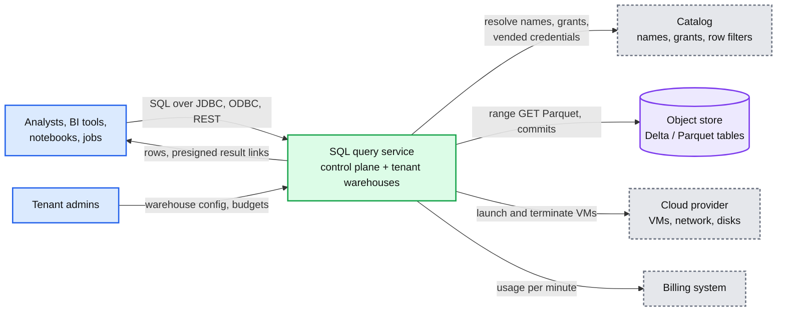

## D2. Data flow (DFD)

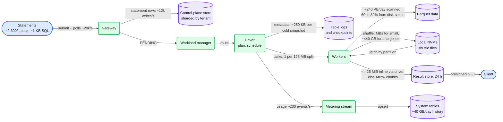

## D4. Happy path, FR1: a large result through external links

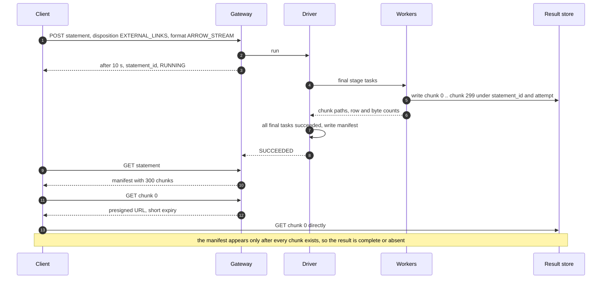

## D5. Failure path: object-store throttling on a hot table

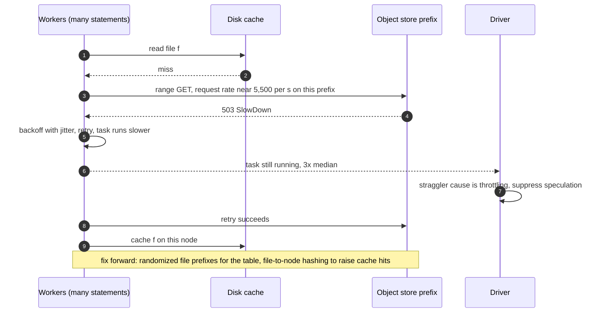

## D5. Failure path: the warm pool runs dry at 09:00

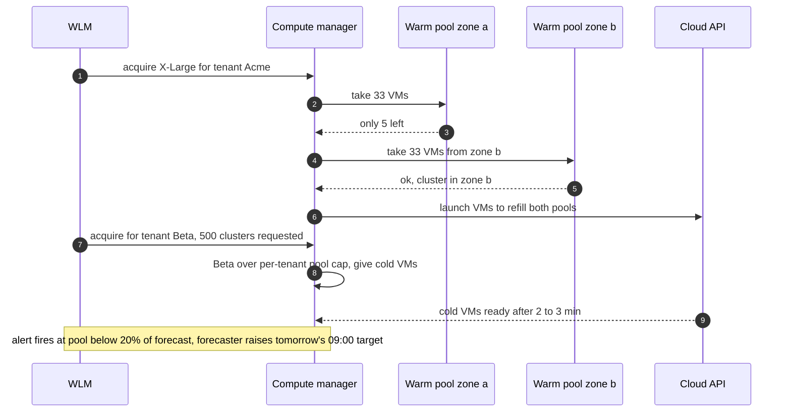

## D6. Admission decision in the workload manager

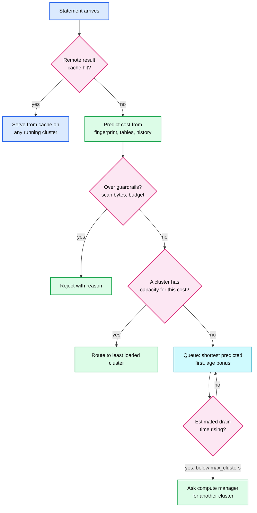

## D8. Cluster lifecycle

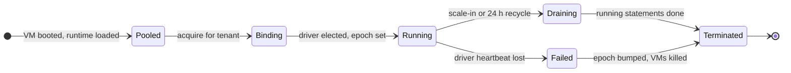

## D9. Deployment and topology

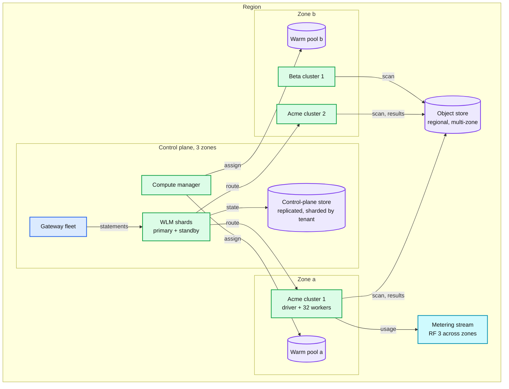

What crosses a boundary: statements and results cross zones (small). Shuffle never crosses zones because a cluster is zonal. Nothing crosses regions: tables, warehouses and billing are regional.

## D10. Partitioning: control plane and cache locality

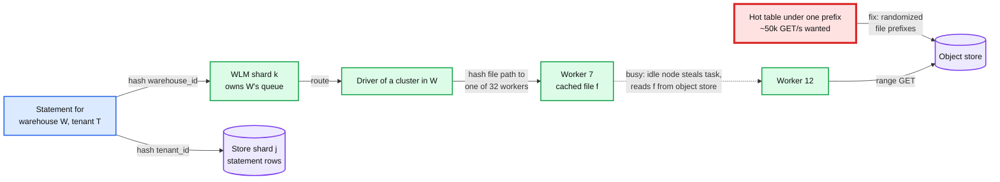

## D11. Failure mode map

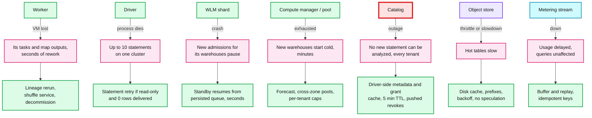

Red here marks the widest blast radius, not the throughput bottleneck. The throughput bottleneck (the shuffle) is red in the final design.

## D12. Rollout: classic per-tenant clusters to serverless warehouses

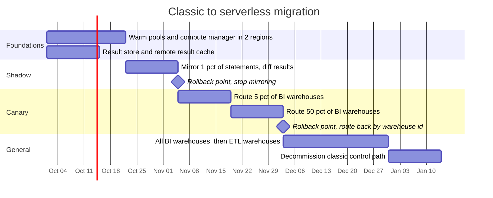

Rollback at every phase is "route the warehouse id back". Serverless writes nothing durable except results (24 h) and table commits, so there is nothing to backfill.
