# HLD: Multi-tenant distributed SQL query engine (Spark / Photon style)

> One-line answer: split the service into a control plane (a gateway, a workload manager that queues and admits statements per warehouse, a compute manager that hands out VMs from a warm pool) and a data plane of per-tenant warehouses, each 1 to N clusters of one driver plus K workers; the driver pins one snapshot of every table from the catalog, plans with a cost-based optimizer, cuts the plan into stages at every shuffle and re-plans at each stage boundary from real sizes (adaptive query execution); workers run a vectorized columnar engine over Parquet pruned by file statistics, cache hot files on local NVMe, and write shuffle output to local disk; tenants never share a VM, small queries get cores ahead of big ones inside a cluster, clusters are added when queue time grows; a dead worker costs a re-run of only the shuffle outputs it held (lineage), a dead driver costs a transparent retry of its read-only statements; and cost is billed on warehouse-seconds and attributed to statements by the task-seconds they used.

Sources: Photon (Behm et al., [SIGMOD 2022](https://www.cs.cmu.edu/~15721-f24/papers/Photon.pdf)), Spark SQL ([SIGMOD 2015](https://people.csail.mit.edu/matei/papers/2015/sigmod_spark_sql.pdf)), Snowflake ([NSDI 2020](https://www.usenix.org/system/files/nsdi20-paper-vuppalapati.pdf)), Dremel a decade later ([VLDB 2020](https://www.vldb.org/pvldb/vol13/p3461-melnik.pdf)), Presto ([ICDE 2019](https://trino.io/Presto_SQL_on_Everything.pdf)), Magnet push-based shuffle ([VLDB 2020](https://www.vldb.org/pvldb/vol13/p3382-shen.pdf)), [Databricks SQL warehouse sizing and queuing](https://docs.databricks.com/aws/en/compute/sql-warehouse/warehouse-behavior), [Trino fault-tolerant execution](https://trino.io/docs/current/admin/fault-tolerant-execution.html), and Spark defaults read from [`SQLConf.scala`](https://github.com/apache/spark/blob/master/sql/catalyst/src/main/scala/org/apache/spark/sql/internal/SQLConf.scala) and [`config/package.scala`](https://github.com/apache/spark/blob/master/core/src/main/scala/org/apache/spark/internal/config/package.scala). No Hello Interview write-up exists for this problem, so the requirement list is composed from the systems. Written flow-first: §4 builds one diagram one functional requirement at a time, §5 breaks and mutates it one non-functional requirement at a time, §6 shows the final design and six flows to rehearse. Raw notes in [`research/`](research/).

---

## 1. Understanding the problem

Restate before designing. The data already exists: Parquet files in an object store under a table format ([`../delta-lake-transactions/`](../delta-lake-transactions/)). We build the compute side, SQL text in, rows out. Three facts shape every decision:

1. **Storage is remote and shared.** Every byte crosses the network from S3, ADLS or GCS, with tens of ms to first byte and 5,500 GET/s per prefix. No node owns any data, so any node can scan any file. The scheduler is free to put work anywhere, except where a cache makes one node better than another.
2. **Query sizes span five to six orders of magnitude.** Snowflake's study of ~70 M queries over 14 days found intermediate data sizes varying over five orders of magnitude, some queries exchanging 10 to 100 TB, and no correlation between data read and data exchanged (NSDI 2020 §4). One design must serve a 50 ms dashboard tile and a 2-hour join.
3. **Tenants pay for compute, and compute is VMs.** The cheapest VM is one not running. The fastest query runs on a VM already running. That tension (cold start vs idle cost) is the multi-tenant problem, more than scheduling is.

### 1.1 Functional requirements

Core:
1. **Run a SQL query and get the result.** A client (BI tool over JDBC/ODBC, notebook, REST) submits SQL to a warehouse, polls or cancels, and gets rows: small results inline, large results as downloadable chunks.
2. **Distribute the work.** One query runs across tens to hundreds of machines. Scans split into tasks over files. Joins and aggregations repartition rows between machines (shuffle).
3. **Share the service between tenants.** Compute on demand within seconds, nothing billed when idle, no tenant sees or slows another. Inside a tenant, queries are admitted, queued and scheduled so a dashboard is not stuck behind a batch job.
4. **Survive failure.** A dead worker, a slow node, or a lost driver does not fail the query in the common case, and never produces a wrong or silently partial result.
5. **Know and bound the cost of every query.** Every statement is metered and attributed to tenant and user. Guardrails (timeouts, scan limits) stop runaway queries.

Below the line: the table format and transactions (#15, we read a pinned snapshot and commit through it), catalog and governance internals (assume a service that maps names to paths, checks grants, applies row filters, and vends short-lived credentials), streaming queries, Python and ML workloads beyond "user code runs sandboxed", cross-region federation, the SQL editor and dashboard UI.

### 1.2 Non-functional requirements

Ask for scale first. There is no published rubric for this question ([`research/interview-framing-survey.md`](research/interview-framing-survey.md)), so the numbers come from the systems' own docs and papers.

| Dimension | Target | Why this number |
|---|---|---|
| Load | 10,000 active tenants per region, 20 M statements/day, peak ~2,300 submits/s | Snowflake's 2019 study was ~5 M queries/day for the whole service ([NSDI 2020](https://www.usenix.org/system/files/nsdi20-paper-vuppalapati.pdf)). A 2026 region of a large provider is a few times that [estimate] |
| Query mix | 90% small (≤ 1 GB scanned after pruning), 9.5% medium (1 to 500 GB), 0.5% large (0.5 to 100 TB) | Dashboards dominate count, large joins dominate compute (§2) [estimate] |
| Latency, small | p50 < 500 ms, p99 < 2 s, excluding queue | A BI tile. Presto's developer analytics at Meta required ~50 ms to 5 s ([ICDE 2019](https://trino.io/Presto_SQL_on_Everything.pdf) §II) |
| Latency, medium and large | Medium p99 < 60 s on a right-sized warehouse. Large is bound by scan rate: ~40 GB/s on a 32-worker cluster | Network math in §2 |
| Concurrency | 10 running statements per cluster, then queue or add a cluster. ≤ 1,000 queued per warehouse | Databricks classic/pro: "a fixed limit of one cluster per 10 concurrent queries", queue max 1,000 ([docs](https://docs.databricks.com/aws/en/compute/sql-warehouse/warehouse-behavior)) |
| Startup | Stopped warehouse to first query in 2 to 6 s. Scale-out cluster in < 30 s | Databricks serverless: "typically between 2 and 6 seconds" ([docs](https://docs.databricks.com/aws/en/compute/sql-warehouse/warehouse-types)) |
| Isolation | No VM or process shared across tenants. A heavy tenant moves another tenant's p99 by < 5%. A small query waits < 1 s behind a big one in the same cluster | VM is the security boundary. The task is the scheduling quantum (§5.2) |
| Availability | 99.95% for submit, status, cancel. Infrastructure-caused query failures < 0.1% | Queries may fail for user errors, never for ours |
| Consistency | One snapshot per table per query. Cached results never stale. Read-your-writes within a session | §4.1, §10.6 |
| Cost | Billed per second of warehouse uptime. Auto-stop after 10 min idle (1 min via API). Per-query attribution sums to the bill within 1% | Databricks serverless auto-stop default 10 min, API minimum 1 min ([docs](https://docs.databricks.com/aws/en/compute/sql-warehouse/create)) |
| Results | Inline up to 25 MiB, larger results as presigned chunk links. Result cache 24 h | Databricks Statement Execution API INLINE limit 25 MiB ([docs](https://docs.databricks.com/aws/en/dev-tools/sql-execution-tutorial)), result cache 24 h ([docs](https://docs.databricks.com/aws/en/sql/user/queries/query-caching)) |

Below the line: sub-100 ms p99 point lookups (that is a serving store, and Databricks ships a separate warehouse type for it), a single snapshot across all tables at once (one snapshot per table, not a global one), native-speed untrusted code.

---

## 2. Back-of-envelope

**Control plane.**
- 20 M statements/day ÷ 86,400 = ~230/s average. Peak at 10x = **~2,300 submits/s**.
- Polls, not submits, are the gateway's load. The Statement API waits 10 s by default, then returns an id and the client polls. ~20k running statements at peak × 1 poll/s = 20k polls/s. Long-poll (`wait_timeout` up to 50 s) cuts that 5 to 10x.
- Query history at ~2 KB per row: 40 GB/day, ~1.2 TB/month. Plans and per-operator profiles only for statements over 1 s.

**Data plane, by query class.** Assume ~150 MB/s of compressed Parquet per vCPU for decode plus filter [estimate]. It matches an i3.2xlarge: up to 10 Gbps (1.25 GB/s) over 8 vCPUs, so a node is balanced between network and CPU.

| Class | Share | Count/day | Avg scanned | Bytes/day | vCPU-seconds each |
|---|---|---|---|---|---|
| Small | 90% | 18 M | 200 MB | 3.6 PB | ~1.3 |
| Medium | 9.5% | 1.9 M | 20 GB | 38 PB | ~133 |
| Large | 0.5% | 100k | 2 TB | 200 PB | ~13,300 |
| Total | | 20 M | | ~240 PB | |

- Compute: 240 PB ÷ 150 MB/s = 1.6 B vCPU-seconds/day ÷ 86,400 = **~18.5k vCPUs busy scanning on average**. Joins, aggregation and decode roughly double it (~40k), peak at 3x is ~120k vCPUs, ~15k i3.2xlarge. Snowflake measured average CPU utilisation of ~51% (NSDI 2020 §1), so provision ~2x: **~30k VMs at peak**.
- The asymmetry to say out loud: **90% of queries read 1.5% of the bytes. 0.5% of queries read 83%.** Latency work targets the small ones (caches, pruning, no shuffle). Cost and fault-tolerance work targets the large ones.

**One warehouse, the example used everywhere below.** Tenant Acme, X-Large = 32 workers of i3.2xlarge (8 vCPU, 61 GiB, one 1.9 TB NVMe, up to 10 Gbps each), matching the [Databricks size table](https://docs.databricks.com/aws/en/compute/sql-warehouse/warehouse-behavior). That is 256 vCPUs, ~1.9 TiB RAM, ~61 TB NVMe, ~40 GB/s of aggregate network.
- Medium query, 20 GB: 20 ÷ 40 GB/s = 0.5 s of scan at full width, 1 to 3 s end to end with planning and one shuffle.
- Large query, 2 TB: 2,000 ÷ 40 = **50 s** of scan. Prune to 10% and it is 5 s. **Pruning is worth more than any hardware.**
- Large join: 2 TB scanned becomes 400 GB after filter and projection, plus a 40 GB dimension side. 440 GB shuffled ÷ 32 nodes = ~14 GB out and ~14 GB in per node, ~11 s of network each way at 1.25 GB/s. Map tasks at 128 MB splits: 2 TB ÷ 128 MB = **16,000**. Reduce partitions: 2,000. Blocks: 16,000 × 2,000 = **32 M blocks of ~14 KB**, about 1 M random reads per node. NVMe (hundreds of thousands of IOPS) survives it. A 3,000 IOPS network disk needs ~5.5 min. That is the red node (§5.3).
- Dashboard burst at 09:00: 200 users × 30 tiles within 60 s = 100 statements/s at ~0.5 s each = 50 concurrent = **5 clusters** at 10 per cluster. With an 80% result-cache hit rate, 1 cluster.

**The warm pool** (the provider's cost, not the tenant's).
- 5,000 warehouses running at peak with a mean lifetime of ~1 h (auto-stop at 10 min idle): 5,000 ÷ 3,600 = ~1.4 warehouse starts/s × ~10 VMs = ~14 VMs/s = **~840 VMs/min**.
- A cold VM (boot, image, runtime, warm JVM) takes ~2 to 3 min [estimate]. To hand out VMs in seconds, the pool must cover demand for that lead time: 840 × 3 = ~2,500 idle VMs, and ~3x that to absorb the 09:00 spike: **~7,500 idle VMs**.
- At ~$0.62/h per i3.2xlarge on demand [estimate from list price], 7,500 × $0.62 = ~$4,650/h, **~$41 M/year of machines no tenant pays for** under per-second billing. Snowflake names this exact problem (NSDI 2020 §7). §5.5 shrinks it.

---

## 3. The set-up

Product-style. The user is a tool (BI, notebook, job) acting for a person or a service principal in a tenant.

### 3.1 Core entities

| Entity | What it is |
|---|---|
| Tenant | A customer account (workspace). The unit of billing, security and isolation |
| Warehouse | A named compute endpoint owned by a tenant: size (T-shirt), min and max clusters, auto-stop, statement timeout. Statements target a warehouse |
| Cluster | One driver VM plus K worker VMs, all for one tenant, all in one availability zone. A warehouse has 0 to N clusters. The unit of scale-out and the unit of failure |
| Statement | One SQL statement: id, text, user, state, pinned table versions, metrics, cost |
| Stage | A part of the physical plan between two exchanges (shuffles). Runs as many tasks |
| Task | One unit of work on one data partition (a file split or a shuffle partition), on one worker core |
| Map output | What a map task wrote for the next stage: one data file plus an index on the worker's local disk, sliced by reduce partition. Its location and sizes live only in driver memory |
| Result chunk | A slice of a large result in the result store, fetched through a presigned URL |
| Usage record | Cluster uptime per minute (billing truth) plus per-statement task-seconds (attribution) |

### 3.2 API

| Call | Semantics |
|---|---|
| `POST /api/2.0/sql/statements {warehouse_id, statement, wait_timeout, disposition, request_id}` | Submit. Waits up to `wait_timeout` (default 10 s, 5 to 50 s) and returns the result if done, else `statement_id` plus `PENDING` or `RUNNING`. `request_id` makes a retried submit return the same statement |
| `GET /statements/{id}` | State, manifest (schema, chunk list, row and byte counts), first chunk if `INLINE` |
| `GET /statements/{id}/result/chunks/{n}` | Chunk `n`, or a presigned URL to it when `EXTERNAL_LINKS` |
| `POST /statements/{id}/cancel` | Best effort. Tasks stop at the next batch boundary |
| JDBC / ODBC session | The same statement lifecycle behind a long-lived connection. Session holds catalog, schema, and the last committed version per table for read-your-writes |
| `POST /warehouses {size, min_clusters, max_clusters, auto_stop_mins, statement_timeout}`, `start`, `stop` | Control plane |
| `SELECT ... FROM system.query.history` / `system.billing.usage` | Cost per query is itself a SQL query over system tables |

Internal calls that matter: `Catalog.resolve(table, principal) -> {path, version, schema, row_filter, column_masks, credential(ttl=1h)}`. `ComputeManager.acquire(tenant, size, az) -> cluster` and `release(cluster)`. `Driver.submit(statement, attempt)`.

### 3.3 Data model

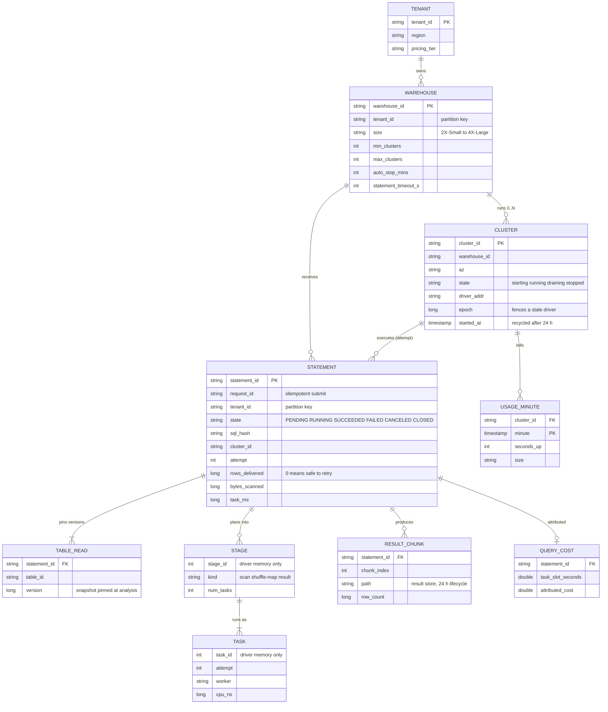

Access patterns that justify it:
- **Submit and poll by `statement_id`:** point read on the control-plane store, sharded by `tenant_id`, hot rows cached in the workload manager.
- **Queue per warehouse:** in the workload manager's memory, persisted per transition so a standby can take over.
- **Map output locations:** `(shuffle_id, map_id) -> (worker, bytes per reduce partition)` in driver memory. Deliberately not persisted. Losing the driver loses the statement, and that is cheaper than persisting millions of entries per query.
- **Query history and cost per tenant over time:** append-only system tables (themselves Delta tables) partitioned by date and clustered by tenant, queried with SQL.
- **Billing:** `USAGE_MINUTE` keyed by `(cluster_id, minute)`, written by the compute manager, idempotent upsert.

Partition key: `tenant_id` for every control-plane row. The only things shared across tenants are the gateway, the workload manager fleet, the warm pool, the catalog and the metering stream, and each gets a per-tenant quota (§5.2).

---

## 4. High-level design

One subsection per functional requirement. Each traces input to output, adds the boxes it needs to a single diagram, and ends with what is still missing. §4 is the naive version on purpose. §5 breaks it.

### 4.1 Run one query and get the result (one machine)

**Flow: `SELECT region, sum(amount) FROM sales WHERE day = '2026-09-27' GROUP BY region`**

1. Client sends `POST /statements`. The gateway authenticates (OAuth token), checks the tenant's rate limit, writes the statement row as `PENDING`, and forwards it to the warehouse's single server.
2. The server **parses** the text into a syntax tree and **analyzes** it against the catalog: resolve `sales` to a path, check `SELECT` permission, inject the user's row filter and column masks into the plan, and **pin the snapshot**: the latest table version `v` at this instant plus its file list (checkpoint plus log tail, #15). The catalog also hands back a credential that can read only `sales`'s path, valid for an hour.
3. The **optimizer** rewrites the plan with rules (push the `day` filter into the scan, read only `region` and `amount`, fold constants), then picks join order and join type from table statistics (cost-based, our choice: open-source Spark ships join reordering off by default, §10.1).
4. **Execute** in-process: drop files whose partition value or min/max stats cannot match `day`, fetch only the two column chunks from each surviving Parquet file with range GETs, filter, hash-aggregate.
5. **Return.** Result ≤ 25 MiB goes inline in the response. Larger results are written as Arrow chunks to the result store and the response carries a manifest plus presigned URLs, so bytes go from object storage to the client without passing through the server.
6. Statement row becomes `SUCCEEDED` with metrics (bytes scanned, rows, wall time).

Consistency: the statement reads exactly version `v` of `sales` for its whole life. Files are immutable and a commit after step 2 only adds new files the snapshot does not list. Snapshot isolation comes free from the table format.

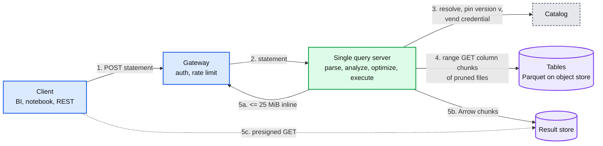

The statement lifecycle, which the API exposes and every later section extends:

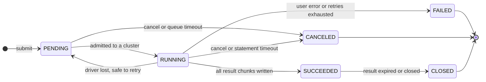

Data model so far: `statement(id, state, sql, table_versions)`, `result_chunk(statement_id, index, path)`.

**What is still missing:** one machine reads ~1.25 GB/s, so the 2 TB query takes ~27 min. Every tenant shares one process. A crash fails everything on it.

### 4.2 Distribute the work: stages, tasks, shuffle

**Flow: `SELECT c.region, sum(o.amount) FROM orders o JOIN customers c ON o.cust_id = c.id WHERE o.day >= '2026-09-01' GROUP BY c.region`**

1. The driver builds the physical plan. Wherever rows must move between machines by key, it inserts an **exchange** (a shuffle). The join needs both sides partitioned by customer id, or one side copied to every machine (broadcast). The `GROUP BY` needs a partial aggregate on each machine, an exchange by `region`, then a final aggregate.
2. The **DAG scheduler** cuts the plan at every exchange into **stages**. Stage 1: scan `orders`, filter, project, write shuffle output by `cust_id`. Stage 2: scan `customers`, write by `id`. Stage 3: join, partial aggregate, write by `region`. Stage 4: final aggregate, return to driver.
3. The **task scheduler** creates one task per ~128 MB split of the pruned file list (`spark.sql.files.maxPartitionBytes` = 128 MB): 2 TB of `orders` is 16,000 tasks. Workers pull tasks as cores free up, so 256 cores run it in ~63 waves. Many short waves are what make stragglers and fairness manageable later (§5.2, §5.4).
4. **Map side.** Each task writes its output as **one data file plus an index** on local NVMe, sorted by reduce partition (sort-based shuffle), and reports a map status to the driver: location plus bytes per reduce partition.
5. **Barrier.** Stage 3 starts only after stages 1 and 2 finish. Each reduce task fetches its partition's slice from every map output (all-to-all), joins, and partially aggregates.
6. **Re-plan at the boundary** (adaptive query execution). Before launching stage 3, the driver reads the real sizes from the map statuses. `customers` came out at 8 MB after its filter, under the 10 MB broadcast threshold, so the join becomes a broadcast join and the planned shuffle read of `orders` becomes a local read. The 2,000 reduce partitions average 5 MB, so they are coalesced into ~160 partitions of ~64 MB.
7. The last stage sends rows to the driver, which uses the §4.1 result path.

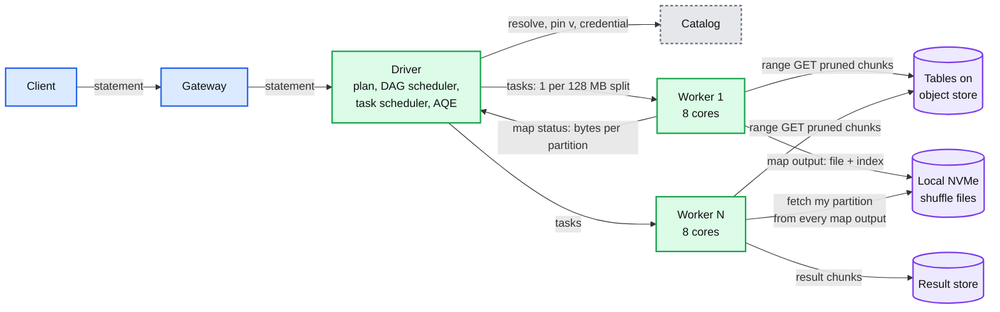

Data model so far: stage, task, map status (all in driver memory), plus the §4.1 rows.

**What is still missing:** (a) every tenant still shares one cluster, so no isolation and no elasticity (§4.3). (b) 32 M shuffle blocks for the large join (§5.3). (c) a dead worker takes its map outputs with it (§4.4). (d) a 3-file dashboard query pays the same planning, task launch and stage barriers as the 2 TB join (§5.1).

### 4.3 Share the service between tenants

The ladder, compressed:
- **Bad: one big shared cluster for all tenants.** Early multi-tenant Presto at Meta shared clusters across organisations with resource groups. Breaks for an external service on three counts: tenants' rows sit in one JVM under one credential set, a 50 TB join from tenant A takes memory and network from tenant B, and one coordinator failure takes every tenant down (Presto 2018: "Coordinator failures cause the cluster to become unavailable", ICDE 2019 §IV-G).
- **Good: an always-on cluster per tenant.** Strong isolation. Breaks on money and elasticity: a cluster sized for the 09:00 peak bills all night, and a cold start is minutes.
- **Great: serverless warehouses.** Per-tenant clusters assembled in seconds from a provider-owned **warm pool** of booted VMs, auto-stopped when idle, scaled out by adding clusters when queue time grows. A VM serves one tenant in its life and is never returned to the pool.

**Flow: 09:00, Acme's BI warehouse is stopped, then 100 statements/s arrive.**

1. The gateway receives a statement for warehouse `W`. It writes `PENDING` and passes it to the **workload manager** (WLM) shard that owns `W` (WLM is sharded by `warehouse_id`).
2. `W` has no cluster. WLM asks the **compute manager** for one X-Large cluster: 33 VMs. The compute manager takes them from the warm pool (booted, runtime loaded), binds them to Acme (network policy, workload identity, disk encryption key), picks the driver, and hands back the cluster with a fresh `epoch`. 2 to 6 s.
3. WLM routes the statement to the cluster. **Admission per cluster:** at most 10 running. The rest wait in `W`'s queue (at most 1,000).
4. At 09:01, queue wait climbs. WLM asks for a second and third cluster (up to `max_clusters`). New statements go to the least loaded cluster. A running statement never moves.
5. By 11:00 load falls. WLM drains clusters (stops routing to them, lets running statements finish) down to what the last 15 minutes' peak needed. After 10 idle minutes it stops the last one. VMs are terminated because they held Acme's data in memory and on disk. The compute manager refills the pool with new VMs.

Inside one cluster (one tenant, many users) three mechanisms keep a dashboard from waiting behind a batch query: **admission** (max concurrency), **fair sharing of task slots** so a new small statement gets cores within one task length, and **per-statement memory reservations with spill**. §5.2 has the details.

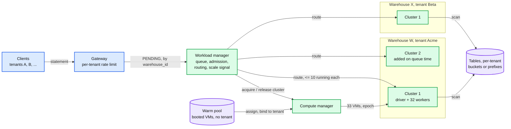

Data model so far: `warehouse(size, min/max clusters, auto_stop)`, `cluster(state, epoch, az)`, WLM queue entries.

**What is still missing:** (a) inside a cluster the 16,000-task query can still starve a dashboard, and inside a warehouse ETL can fill the queue (§5.2). (b) the warm pool is ~$41 M/year of idle VMs (§5.5). (c) the driver is a single point of failure for up to 10 statements (§4.4).

### 4.4 Survive failure

A retry ladder, smallest unit first. Each rung only works because tasks are deterministic functions of immutable input files.

1. **A task fails** (exception, lost S3 connection, killed for memory). Rerun it on another core, up to 4 attempts (`spark.task.maxFailures` = 4). A node that keeps failing tasks is excluded.
2. **A worker dies.** Its running tasks rerun elsewhere. Its **finished map outputs are gone too**, because they were on its local disk. A reducer that cannot fetch them reports `FetchFailed`. The driver marks those map outputs missing, **reruns only the lost map tasks** of the parent stage from lineage (the plan says how to recompute them from input files), then resumes the reduce stage. At most 4 consecutive attempts per stage (`spark.stage.maxConsecutiveAttempts` = 4).
3. **A worker is slow** (bad disk, noisy hardware). Speculative execution starts a copy of a task that runs far longer than its siblings. The first to finish wins, the other is killed, and the driver registers exactly one map output per map id.
4. **The driver dies.** Plans, stage state and map output locations lived only in its memory, so every statement on that cluster dies. WLM misses the driver's heartbeat, marks the cluster failed (bumping its epoch so a half-alive driver cannot write results), and **resubmits statements that are read-only and have delivered zero rows** to another cluster. The client sees latency, not an error. Statements that already streamed rows fail with a retryable error. Writes (`INSERT`, `MERGE`) are not blindly resubmitted: they commit atomically through the table format, so a crash before the commit leaves nothing (#15), and the client decides.
5. **Never a partial result.** A statement becomes `SUCCEEDED` and its chunk manifest is written only after every final-stage task succeeded. A result is complete or absent.

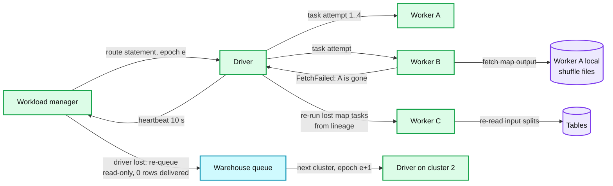

Data model so far: `statement.attempt`, `statement.rows_delivered`, `cluster.epoch`.

**What is still missing:** detection time, the cost of recomputing a big shuffle (and its parents), stragglers at 16,000 tasks, spot reclaims, and the fact that retrying a 2-hour query from scratch is not acceptable (§5.4).

### 4.5 Know and bound the cost of every query

1. **Before running.** The planner knows the bytes it will scan after pruning (from file statistics). Guardrails: the warehouse's maximum scan bytes, the statement timeout (Databricks' system default is 172,800 s, 2 days, so set 1 h on BI warehouses), per-user concurrency.
2. **During.** Every task reports metrics with its completion: CPU time, wall time, bytes read from object store and from cache, shuffle bytes, spill bytes. The driver aggregates them per statement. It never ships per-task events: at ~2 B tasks/day that would be a second big-data system just for billing.
3. **Billing truth.** The **compute manager** records, per cluster per minute, how many seconds it was up and its size. Bill = warehouse-seconds × the rate for that size. It depends on no driver, so a crashed driver cannot lose billable time, and records are keyed `(cluster_id, minute)` so a replay is idempotent.
4. **Attribution.** For each cluster-minute, split its cost across the statements that ran on it by their share of task-slot-seconds in that minute. Seconds with no running tasks are labelled idle and shown to the tenant as idle. Attributed plus idle equals billed, which is the 1% requirement.
5. Drivers and the compute manager publish to a **metering stream**. A consumer writes **system tables** (usage, query history). Cost per query is a SQL query on them.

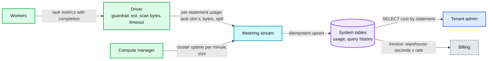

Data model so far: `usage_minute(cluster_id, minute, seconds_up, size)`, `query_cost(statement_id, task_slot_seconds, attributed_cost)`.

End of §4. A correct but naive design: small queries pay large-query overheads, a big query can starve its neighbours inside a cluster, the shuffle has 32 M tiny blocks and one skewed key can hold a stage for 15 minutes, failure recovery is correct but slow, and the warm pool costs tens of millions a year.

---

## 5. Deep dives

One per non-functional requirement. Each names what breaks in the §4 design with a number, fixes it, and lists what changed in the API, the data model, and the diagram.

### 5.1 "A dashboard tile in under 2 s on a 100 TB table": the small-query path

**What breaks.** Walk the §4.2 path for a query whose answer lives in 3 files. Gateway and WLM hops: ~5 ms. Analysis with a cold table snapshot: `_last_checkpoint`, a LIST, and a checkpoint read, 250 ms to several seconds (#15). Cost-based optimization: tens of ms. Task launch. Two footer GETs per file at 20 to 50 ms to first byte. A shuffle for the `GROUP BY` with a stage barrier. It adds up to 3 to 5 s, and 200 users refreshing the same 30 tiles recompute the same answers 200 times.

**Fix: walk the path in order and delete work.**
1. **Result cache.** Key: normalized SQL text, the pinned version of every table read, and the user's security context (row filters and masks change the answer). A hit returns in tens of ms and touches no worker. Invalidation is free: a commit changes a version, so the key changes and the old entry is simply never hit again. Two tiers: in-cluster memory, and a remote tier in object storage that survives a warehouse restart, both with a 24 h life ([Databricks query caching](https://docs.databricks.com/aws/en/sql/user/queries/query-caching)). Statements using `now()`, `rand()` or `current_user()` without a filter on it are not cacheable.
2. **Snapshot cache on the driver.** `(table, version) -> parsed file list with stats`. Analysis only has to LIST the log tail once to learn whether a newer version exists: ~20 ms instead of ~250 ms.
3. **Prune before a single task exists.** Partition values, then per-file min/max statistics (data skipping), made tight by clustering the table on the filter columns. `WHERE tenant_id = 42 AND day = today` on a 100 TB table clustered by those columns reads a handful of files. Then prune at runtime: **dynamic partition pruning** turns a filter on a dimension into a key list that prunes the fact table's files, and **runtime bloom filters** on the join key drop fact rows before the join (on by default in Spark since 3.0 and 3.4 respectively; the bloom filter rule was added in 3.3 but off there).
4. **Disk cache on NVMe.** The first read of a Parquet file keeps a copy on the worker's local SSD (up to half of it), later reads skip the object store ([Databricks disk cache](https://docs.databricks.com/aws/en/optimizations/disk-cache)). Files are immutable, so entries never go stale. Snowflake measured 60 to 80% hit rates on persistent data even with small caches, because access is skewed and temporal (NSDI 2020 §1). To keep hitting, **schedule a task on the node that cached its file** (consistent hash from file to node), and let an idle node steal the task when the owner is busy. That is Snowflake's lazy consistent hashing plus work stealing (NSDI 2020 §5, §6).
5. **Vectorized execution.** Operators process column batches through tight C++ loops with SIMD instead of row-at-a-time JVM code. Photon: 3x average and over 10x maximum speedup on customer workloads, 4x average on TPC-H at 3 TB ([SIGMOD 2022](https://www.cs.cmu.edu/~15721-f24/papers/Photon.pdf) §1, §6). This matters most for CPU-bound medium queries. For a 3-file dashboard query fixed overheads dominate, so steps 1 to 4 matter more.
6. **Small-query fast path.** When pruned input is under a few tens of MB, plan one stage: broadcast the small side, aggregate in one task, no shuffle, no barrier. Adaptive execution already turns a join into a broadcast join when the runtime size is under 10 MB.
7. **Precompute the hottest tiles** as materialized views refreshed on commit. Last resort: costs storage and refresh compute for every write.

```mermaid
%% D6 (§5.1): the small-query path, in order. Each step deletes work; the red node is what dominates a cold small query.
flowchart LR
    Q[Statement arrives] --> RC{Result cache<br/>SQL + versions + ACL}
    RC -->|"hit, ~20 ms"| OUT[Rows to client]
    RC -->|"miss"| SNAP[Snapshot cache<br/>1 LIST of log tail]
    SNAP --> PR[Prune: partitions,<br/>min/max stats, clustering]
    PR --> FP{Pruned input<br/>< ~30 MB?}
    FP -->|"yes: 1 stage,<br/>broadcast, no shuffle"| EX[Vectorized scan<br/>+ runtime filters]
    FP -->|"no: normal stages"| EX
    EX --> DC{File on local<br/>NVMe cache?}
    DC -->|"hit"| EX2[Decode + aggregate]
    DC -->|"miss"| COLD[Object store GETs<br/>20 to 50 ms first byte,<br/>2 footer reads per file]:::critical
    COLD --> EX2
    EX2 --> OUT

    class Q,OUT client
    class SNAP,PR,EX,EX2 service
    class RC,FP,DC decision

    classDef client   fill:#dbeafe,stroke:#2563eb,stroke-width:2px,color:#111
    classDef service  fill:#dcfce7,stroke:#16a34a,stroke-width:2px,color:#111
    classDef decision fill:#fce7f3,stroke:#db2777,stroke-width:2px,color:#111
    classDef critical fill:#fee2e2,stroke:#dc2626,stroke-width:4px,color:#111
```

**Push back on the textbook answer.** "Add a B-tree index." On immutable columnar files, min/max statistics plus clustering plus bloom filters give the same pruning with no index to maintain on every write. For true point lookups with a p99 under 100 ms, send them to a serving store instead of bending an analytics engine.

**What changed.** API: `use_cached_result` per session. Data model: result cache entry `(key, table versions, location, expires_at)`, a file-to-node hash in the task scheduler. Diagram: result cache beside the driver, disk cache on each worker, snapshot cache inside the driver. Numbers: cache hit ~20 ms, a cold pruned small query ~0.5 to 1.5 s, warm ~200 ms [estimate]. Details in [`deep-dives/vectorized-execution-and-scan-path.md`](deep-dives/vectorized-execution-and-scan-path.md) and [`deep-dives/query-planning-and-adaptive-execution.md`](deep-dives/query-planning-and-adaptive-execution.md).

### 5.2 "A 10 TB query from one team must not hurt another team's dashboard": isolation and admission

**What breaks.** Across tenants the VM boundary holds. Everything inside a tenant is shared, and a few things are shared across tenants:
- **Inside one cluster.** FIFO task scheduling gives all 256 cores to the 16,000-task query that arrived first. The dashboard's 3 tasks wait behind ~63 waves. A large hash join reserves most executor memory and the dashboard's aggregation fails for lack of it.
- **Inside a warehouse.** 1,000 queued statements, a backlog of ETL in front of the dashboard.
- **Across tenants.** The gateway and WLM (one tenant polling 50k times a second), the warm pool (one tenant's 500-cluster burst drains it), object-store request limits if tenants share a bucket prefix (5,500 GET/s per prefix), the catalog.

**Fix, layer by layer.**
1. **Separate warehouses by workload.** A BI warehouse and an ETL warehouse per team. The cheapest isolation there is, and the default the product should steer tenants to.
2. **Admission by predicted cost.** WLM predicts each statement's cost from its fingerprint and history before admitting it. Databricks IWM: "When a new query arrives, IWM predicts its resource requirements and checks available capacity", otherwise it queues and the autoscaler adds clusters as wait times rise ([docs](https://docs.databricks.com/aws/en/compute/sql-warehouse/warehouse-behavior)). A tiny statement can be admitted to a cluster already running 10 because it will take a few core-seconds. A large one waits for a cluster with room.
3. **Fair task slots inside the cluster.** Share cores among running statements by weighted fair share (Spark FAIR pools, one per statement), or by **accumulated CPU time**: Presto puts tasks in a five-level multi-level feedback queue, lets a split run at most 1 s before it yields, and gives more CPU to levels that have used less (ICDE 2019 §IV-F). Either way the **task is the preemption quantum**. With ~1 s tasks, a new small statement gets cores within ~1 s without killing anything. This is why task size is capped: a 30-minute task would make fairness impossible.
4. **Memory reservations with spill.** Operators reserve memory before allocating. When a reservation cannot be met, the engine spills the consumer that frees enough with the least spilling (Photon joins Spark's memory-consumer API, so one operator can spill on behalf of another, SIGMOD 2022 §5.3). A hard per-statement cap turns "this statement needs too much" into a clear error for that statement, not an executor crash for ten. Presto's alternative is to overcommit and promote the single largest query into a reserved pool (ICDE 2019 §IV-F).
5. **Scale out for concurrency, up for spill.** More clusters per warehouse (10 running each) when queue time grows. A bigger cluster size only when single statements spill.
6. **Per-tenant quotas on the shared layers.** Token-bucket rate limits per tenant and per token at the gateway ([`../../concepts/rate-limiting-and-load-shedding.md`](../../concepts/rate-limiting-and-load-shedding.md)). WLM sharded by warehouse. A per-tenant cap on warm-pool VMs per minute: a burst beyond it gets cold-started VMs, slower but isolated. Tenant data in its own bucket or prefix, with randomized file prefixes on hot tables.
7. **Security isolation.** No VM reuse across tenants. Per-tenant network isolation. The catalog vends a short-lived credential scoped to each table's path, so a worker never holds a bucket-wide key. User code (Python UDFs) runs in a sandboxed process without network or the engine's credentials, because in a cluster shared by many users of one tenant, row filters must hold against user code too.

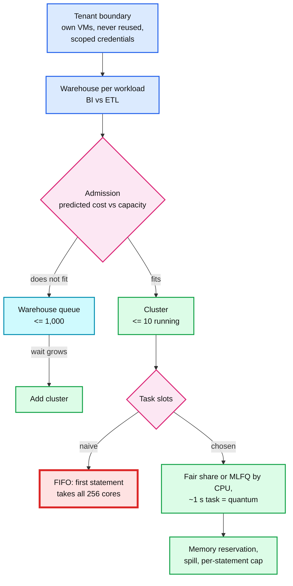

**Push back on the textbook answer.** Two opposite over-answers. "One cluster per query" gives perfect isolation and 20 M cluster starts a day. "One shared slot pool for all tenants" (BigQuery's model: fair scheduling within a reservation, "every query has access to all available slots", [docs](https://cloud.google.com/bigquery/docs/slots)) gives the best utilisation, and utilisation matters: Snowflake measured average CPU at ~51% and memory at ~19% on dedicated warehouses (NSDI 2020 §1). But it needs process-level isolation strong enough for untrusted tenants and a shared shuffle tier. We keep the VM as the tenant boundary now and name the shared pool as the evolution (§10.11).

**What changed.** API: warehouse `max_clusters`, statement timeout, queue limit, query tags. Data model: WLM queue entries carry a predicted cost. Diagram: WLM gains a cost predictor and per-tenant quotas, the task scheduler becomes fair. Details in [`deep-dives/multi-tenant-isolation-and-admission.md`](deep-dives/multi-tenant-isolation-and-admission.md).

### 5.3 "Joins and aggregations over 100 TB, with skew": the shuffle

This is the red node of the final design. It is where data volume turns into network and random IO, where one skewed key holds a whole stage, and where a lost node costs the most.

**What breaks.** From §2: 440 GB shuffled as 16,000 × 2,000 = 32 M blocks of ~14 KB.
1. **Tiny random reads.** LinkedIn measured an average shuffle block of "only around 10s of KBs", billions read a day, and ~15% of total Spark compute wasted on shuffle fetch latency ([Magnet, VLDB 2020](https://www.vldb.org/pvldb/vol13/p3382-shen.pdf) §1). The block count grows as M × R while bytes grow linearly, so blocks get smaller as data grows.
2. **Skew.** One join key (a whale customer, or `NULL`) holds 30% of the rows. One reduce partition is ~130 GB, one task grinds through it for ~15 min at 150 MB/s while 1,999 siblings finish in seconds. The stage takes 15 minutes.
3. **Fragility and fan-in.** Map outputs live on the worker that wrote them (§5.4). Every reducer connects to every mapper node: fine at 32 nodes, ~250k connections at 500.

**Fix, in order of leverage.**
1. **Do not shuffle.** Broadcast the small side of a join under a threshold (Spark: 10 MB static, re-decided at runtime by adaptive execution from real sizes). Most BI joins are a fact table against small dimensions, so most small and medium queries never shuffle the fact table. Dremel does the same: it switches to a broadcast join from statistics gathered during execution (VLDB 2020 §5).
2. **Adaptive execution at every stage boundary.** After a map stage, real partition sizes are known. **Coalesce** small partitions up to ~64 MB (`advisoryPartitionSizeInBytes`). **Split skew**: a partition over 5x the median and over 256 MB (`skewedPartitionFactor`, `skewedPartitionThresholdInBytes`) is split into ~64 MB pieces, each its own task, with the matching partition of the other join side replicated to each piece. The 130 GB partition becomes ~2,000 tasks and the stage finishes in seconds instead of 15 minutes.
3. **Local NVMe for shuffle.** One million random 14 KB reads per node is seconds on NVMe and ~5.5 minutes at 3,000 IOPS. Pick instance types with local SSD for workers.
4. **Keep map outputs alive past the executor.** A shuffle service on each node serves files after the executor process dies (not after the VM dies). Graceful decommission (spot notice, scale-in) migrates shuffle blocks to a peer before the VM goes.
5. **Push-based merge for large shuffles.** During the map stage, mappers push blocks of up to 1 MB to a merger per reduce partition (`spark.shuffle.push.enabled`, Spark 3.2+, in open-source Spark only on YARN with the external shuffle service, so a managed service builds its own merger). Each reduce partition becomes one mostly contiguous file read with a few large sequential reads, and the original blocks remain as a second copy. Magnet: nearly 30% lower end-to-end runtime on LinkedIn's production Spark jobs (VLDB 2020 abstract).
6. **A disaggregated shuffle tier for the biggest queries.** Intermediate data held by a separate memory-plus-SSD service. BigQuery's in-memory shuffle cut shuffle latency by an order of magnitude, allowed an order of magnitude larger shuffles, and cut resource cost by more than 20% (Dremel VLDB 2020 §3.2). Snowflake keeps intermediate data in memory, spills to local SSD, then to S3 (NSDI 2020 §4.1). It survives worker loss and lets compute shrink mid-query. The cost is another stateful service and an extra network hop for every shuffled byte.

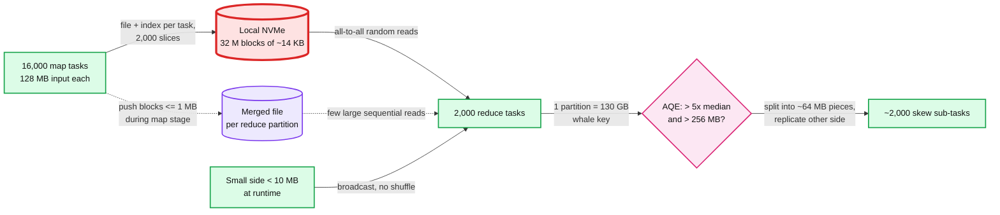

**Push back on the textbook answer.** "Add a remote shuffle service" is the answer for the 0.5% of queries that are large, not for the platform. 90% of statements shuffle a few MB or nothing. Build the remote tier when shuffle fetch wait is a measurable share of compute (LinkedIn's 15% is the kind of number that justifies it), and route to it only statements whose predicted shuffle is large (say over 100 GB). Everything else stays on local NVMe with adaptive execution.

**What changed.** API: nothing user-visible, hints for experts. Data model: per-partition sizes in map statuses drive the re-plan, merged-file metadata for push shuffle. Diagram: the shuffle box is red in §6, with a per-node shuffle service and an optional remote tier for large statements. Numbers: skewed stage 15 min to ~20 s, 32 M reads of 14 KB to ~2,000 reads of ~200 MB with push-merge. Details in [`deep-dives/shuffle-and-joins.md`](deep-dives/shuffle-and-joins.md).

### 5.4 "A 40-minute query survives a worker dying at minute 39": fault tolerance

**What breaks.** The §4.4 ladder is correct but has three costs. **Detection:** executor heartbeat every 10 s (`spark.executor.heartbeatInterval`), with a much longer network timeout as the backstop. **Recomputation:** lost map outputs are rerun, and if their parent stage's outputs were on the same dead node, the rerun cascades up the lineage. **Stragglers** are not failures at all, so nothing in the ladder fires. And the driver holds everything in memory.

**Numbers on Acme's X-Large, 440 GB join.** A worker dies during the reduce stage: 1/32 of stage 1's map outputs are gone, ~500 map tasks of ~1 s each, ~500 core-seconds, ~2 s on 256 cores. Reducers see refused connections within seconds, report `FetchFailed`, the driver resubmits just the missing map partitions. Total delay ~10 to 30 s on a 40-minute query. Without any shuffle durability, a query with five chained shuffles whose earlier outputs were also on that node pays for each ancestor stage too.

**Fix.**
1. **Task retry and exclusion.** 4 attempts per task. A node that fails tasks repeatedly is excluded, so one bad node cannot burn all 4 attempts.
2. **Lineage plus stage retry.** Rerun only the missing map partitions, at most 4 consecutive attempts per stage.
3. **Keep map outputs alive.** Node shuffle service for process death. Decommission migration for planned VM loss (a spot reclaim notice is ~2 min on AWS). Push-merge's second copy. A remote or spooled shuffle for VM loss.
4. **Speculation for stragglers.** When 90% of a stage's tasks are done and a task has run longer than 3x the median, start a copy (Spark 4.x defaults `quantile` 0.9, `multiplier` 3; Spark 3.x used 0.75 and 1.5; speculation itself is off by default). Example: 2,000 tasks, median 5 s, one on a bad disk heading for 60 s. The copy starts at ~15 s, the stage ends at ~20 s. Cap concurrent speculative copies: skew is not a straggler, and speculating a skewed task just doubles 15 minutes of work. Adaptive execution fixes skew (§5.3).
5. **Driver loss: the statement is the retry unit.** WLM detects the missing heartbeat in ~10 to 20 s, bumps the cluster epoch, and resubmits statements that are read-only, have delivered zero rows, and are under 2 attempts. Because large results are written to the result store before being exposed, "zero rows delivered" is the common case. Presto at Meta relied on clients to retry and ran standby coordinators or several active clusters (ICDE 2019 §IV-G). We do the same retry server-side.
6. **Long statements: task-level recovery with spooled exchanges.** Trino's fault-tolerant execution has two modes: `retry-policy=QUERY` retries the whole query and is recommended "when the majority of the Trino cluster's workload consists of many small queries", while `retry-policy=TASK` retries tasks and requires an exchange manager that spools intermediate data to object storage; it is "best suited for large batch queries" and "can result in higher latency for short-running queries" ([Trino docs](https://trino.io/docs/current/admin/fault-tolerant-execution.html)). Route statements predicted to run over ~10 minutes to a spooled-exchange mode.
7. **Zone failure.** A cluster lives in one availability zone, so shuffle traffic never crosses zones (cheaper, faster). A warehouse spreads clusters over zones. WLM routes new statements away from a failed zone and retries in-flight ones per rule 5.

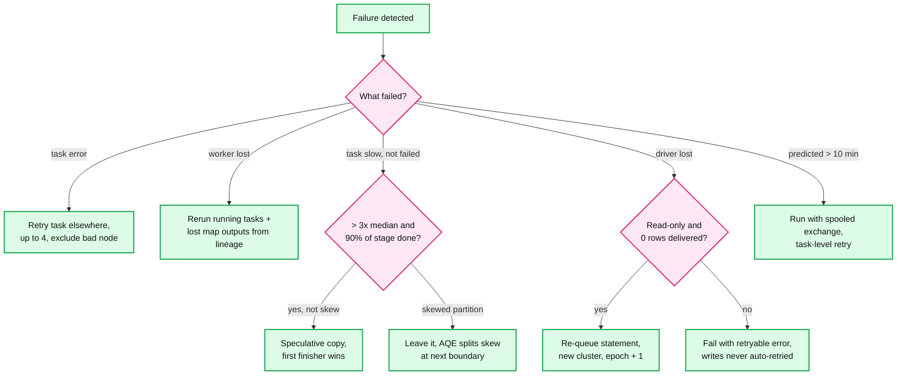

**Push back on the textbook answer.** For the 90% of statements that finish in a few seconds, all of this machinery is slower than running the statement again. Presto served Meta's interactive analytics with no worker fault tolerance at all. Retry whole statements under a runtime threshold, and spend durability (spooling, remote shuffle) only on statements predicted to run long enough that losing them hurts.

**What changed.** WLM: retry policy per statement class, attempt counter, driver heartbeat, epoch fencing. Data model: `statement.attempt`, `statement.rows_delivered`, `cluster.epoch`. Diagram: optional spooled exchange for long statements. Details in [`deep-dives/fault-tolerance-and-stragglers.md`](deep-dives/fault-tolerance-and-stragglers.md).

### 5.5 "Compute in seconds, billed per second, idle costs nothing": elasticity and cost

**What breaks.** Three things. §2's warm pool is ~7,500 idle VMs, ~$41 M/year that no tenant pays for. Autoscaling on CPU is wrong for a query engine: a queued statement uses no CPU, so CPU says "fine" while users wait. And a shared cluster's seconds must be split across ten concurrent statements for cost per query.

**Fix.**
1. **Size the pool to the startup SLO, not to peak demand.** The pool only has to cover demand during the replenish lead time at the SLO percentile. Forecast by hour and weekday (09:00 Monday is predictable), pre-fill ~10 minutes before the spike, shrink at night.
2. **Few instance types.** Build every warehouse size from one or two instance types (Databricks' table uses i3.2xlarge workers for every size, [docs](https://docs.databricks.com/aws/en/compute/sql-warehouse/warehouse-behavior)) so one pool per type per zone serves all sizes. Pool fragmentation is the hidden cost multiplier.
3. **Scale on queue time.** Add clusters by the estimated time to drain running plus queued work. Databricks classic and pro: 2 to 6 minutes of load adds 1 cluster, 6 to 12 adds 2, 12 to 22 adds 3, then one more per extra 15 minutes; a statement queued 5 minutes forces a scale-up; 15 minutes of low load scales down to that window's peak ([docs](https://docs.databricks.com/aws/en/compute/sql-warehouse/warehouse-behavior)). Serverless reacts faster with cost prediction (§5.2).
4. **Auto-stop.** 10 minutes by default, 1 minute via API for bursty use. The first statement after a stop pays 2 to 6 s.
5. **Bill from uptime, attribute from tasks.** Billing-grade: `(cluster_id, minute)` records from the compute manager, idempotent, reconciled against the cloud invoice. Analytics-grade: per-statement task-slot-seconds from drivers. Idle seconds are shown as idle, not hidden inside query costs.
6. **Guardrails.** Maximum scan bytes checked at plan time, statement timeout, per-tenant budget alerts that can stop a warehouse, per-user concurrency.
7. **Recycle.** A cluster older than 24 h is replaced: a new cluster takes new statements, the old one drains (Databricks recycles clusters after 24 h, [docs](https://docs.databricks.com/aws/en/compute/sql-warehouse/create)). Bounds memory leaks and patch drift, at the cost of a cold cache.

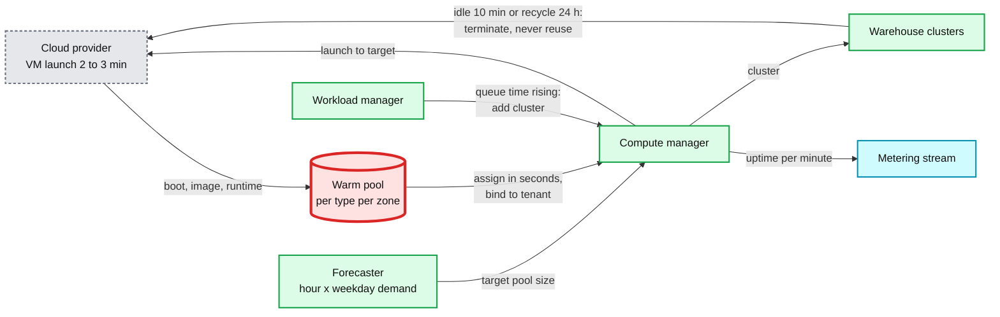

**Push back on the textbook answer.** "Keep a big warm pool" is where most candidates stop. Snowflake's own paper: a pre-warmed pool was cost-efficient under hourly billing because any customer who used a node that hour paid for the whole hour, but "with per-second billing, we cannot charge unused cycles on pre-warmed nodes to any particular customer", which "makes a strong case for moving to a sharing based model" (NSDI 2020 §7). The Staff answer names the long-term fix: statistically multiplex small statements on a shared, sandboxed pool and keep dedicated VMs for large ones.

**Pricing choice.** Per byte scanned (BigQuery on-demand) is predictable and trivially attributable, but it charges a CPU-heavy query over few bytes almost nothing and a cheap scan of many bytes a lot. We bill compute-seconds and expose bytes scanned as a guardrail.

**What changed.** Compute manager: forecaster, pools per instance type and zone, per-tenant pool caps, 24 h recycling. Data model: `usage_minute`, `query_cost`. Diagram: forecaster and metering stream. Details in [`deep-dives/elasticity-warm-pools-and-cost.md`](deep-dives/elasticity-warm-pools-and-cost.md).

---

## 6. Final design and the six core flows

Everything from §5 composed. 13 nodes. Zoom-ins in [`diagrams.md`](diagrams.md).

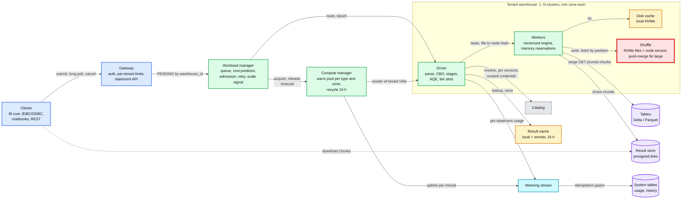

The six flows below are the ones to say from memory. Each is the final design, not the §4 version.

### Flow 1: a dashboard tile, cache miss (~600 ms)

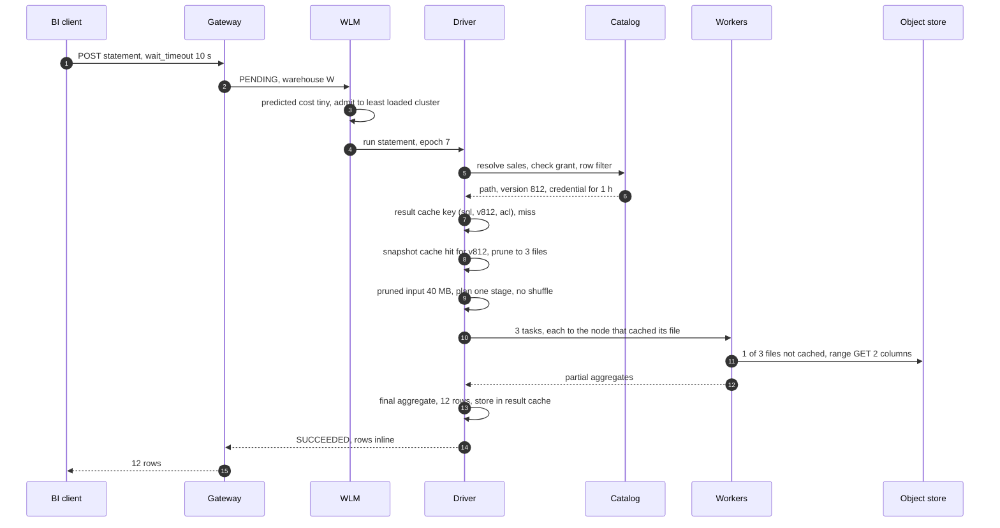

### Flow 2: a large join with skew (adaptive execution fixes it)

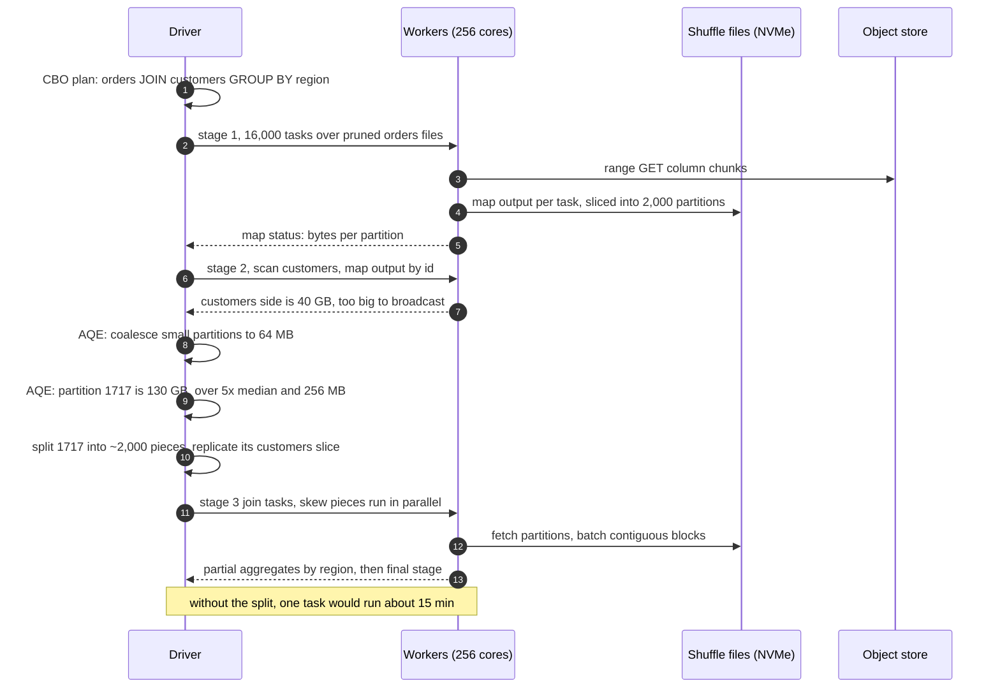

### Flow 3: the 09:00 burst, queue then scale out

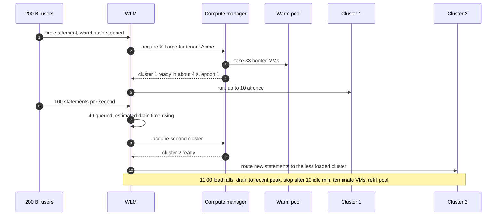

### Flow 4: a worker dies during the reduce stage (failure)

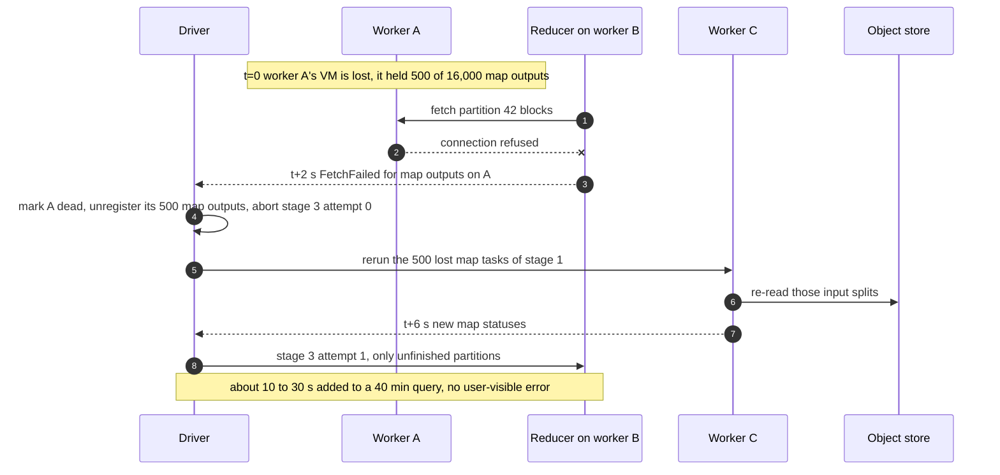

### Flow 5: the driver dies (failure)

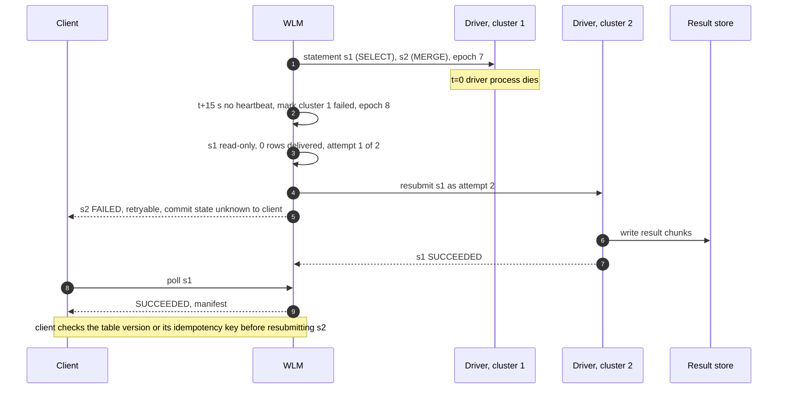

### Flow 6: cost of one statement

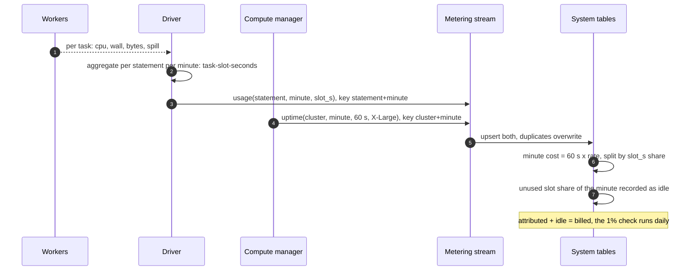

---

## 7. Trade-offs

| Decision | Option A | Option B | Chose | Why |
|---|---|---|---|---|
| Tenant isolation unit | Shared cluster for all tenants | Per-tenant VMs from a warm pool | B | Security needs a hard boundary and one coordinator failure must not hit every tenant. Cost: idle pool and lower utilisation (~51% CPU, ~19% memory on dedicated warehouses per NSDI 2020) |
| Provisioning | Always-on per-tenant clusters | Serverless: warm pool, auto-stop, scale on queue time | B | Tenants pay for seconds used. Provider pays for the pool, so it is forecast, shared across sizes, and capped per tenant |
| Execution model | Code generation (Spark whole-stage codegen, HyPer) | Vectorized interpretation (MonetDB/X100, Photon) | B | Per-batch adaptivity, observability per operator, faster engineering (Photon: aggregation prototype took two months with codegen, a couple of weeks vectorized). Codegen wins some CPU-bound expression trees; the gap is small in practice |
| Exchange between stages | Pipelined in memory, stages run at once (Presto) | Materialized, stage by stage (Spark) | B plus a one-stage fast path | Materialized outputs make task retry, lineage and AQE possible. Cost: a barrier and disk write per exchange, so tiny queries skip the exchange |
| Shuffle storage | Local NVMe files + node service | Remote shuffle tier | A by default, push-merge or remote for predicted large shuffles | 90% of statements shuffle almost nothing. The remote tier is another stateful service and a network hop per byte |
| Join strategy | Decide at plan time from stats | Decide at runtime from real sizes | Runtime (AQE) with plan-time default | Stats are stale or missing on lake tables. Real sizes at the stage boundary are exact |
| Recovery unit | Retry the whole statement | Retry tasks with lineage or spooled exchange | Statement for short, task for long | Trino's own guidance: QUERY retry for many small queries, TASK retry for large batch queries |
| Slot scheduling in a cluster | FIFO | Fair share or MLFQ by CPU time | Fair, with ~1 s tasks | Short tasks make the task the preemption quantum. FIFO lets one statement take every core |
| Scaling signal | CPU utilisation | Queue time and predicted drain time | Queue time | A queued statement uses no CPU. Queue time is what users feel |
| Pricing | Per byte scanned | Per compute-second | Compute-seconds, bytes as a guardrail | Bytes misprice CPU-heavy queries. Seconds match what we pay for |
| Caches | None | Result + snapshot + disk cache | All three, keyed by immutable versions and paths | Immutability makes invalidation free. The cost is memory and NVMe, and a cold start after recycle |
| What we refused to build | A global snapshot across all tables, a shared multi-tenant process pool (for now), cross-region queries, secondary indexes | | | Each is its own system. None is needed for "run SQL on the lake for many tenants" |

Consistency model, stated once: each statement reads **one snapshot per table**, pinned at analysis (snapshot isolation from the table format). **Cached results are never stale** because their key contains every table version. **Read-your-writes** within a session: the session carries the version its last write committed, and analysis refuses to use an older cached snapshot. Control-plane state (statement rows, warehouse config) is **strongly consistent** within a tenant's shard. Usage and history are **eventually consistent** (minutes).

---

## 8. Staff-level notes

- **Simplest thing that meets the requirement.** A driver-and-workers engine per tenant cluster, a queue in front, and a pool of warm VMs. We refused a shared multi-tenant process pool, a remote shuffle tier for every query, and task-level fault tolerance for short queries. Each is added only for the slice of traffic that needs it: large shuffles, long statements, and (later) small statements on a shared pool.
- **Failure modes and blast radius.** Worker: one stage of each statement on it reruns part of its work, seconds. Driver: up to 10 statements on one cluster, retried if read-only and nothing delivered. Cluster or zone: that warehouse's clusters in the zone, new statements go elsewhere. WLM shard: new statements for its warehouses cannot be admitted until the standby takes over (state is persisted per transition, seconds). Compute manager or pool exhausted: new warehouses start cold (minutes), running ones are unaffected. **Catalog outage: nothing new can be analyzed, for every tenant.** It is the largest blast radius, so drivers keep resolved metadata and grants for a short TTL (for example 5 minutes) as a documented degradation, with revocations pushed. Object-store regional slowdown: everything slows, disk cache hits keep dashboards up. Metering stream down: queries run, usage is buffered and replayed; billing is delayed, never lost, because uptime records are keyed and idempotent.
- **Migration.** From classic per-tenant clusters in the customer's account to serverless: keep the warehouse id, route a percentage of statements to the serverless cluster, compare latency and (for deterministic queries) result checksums, and roll back by routing back. For a new engine (Photon beside Spark): replace operators one at a time, fall back to the old engine through a row-to-column transition for anything unsupported, shadow-run and diff results. Photon's paper names the trap: Java and C++ disagree on some casts, so semantic equivalence needs its own test suite.
- **Operability.** SLOs: small statements p99 < 2 s excluding queue, queue wait p95 < 5 s, warehouse start p95 < 10 s, infrastructure failure rate < 0.1%. Pages at 3am: warm pool below 20% of forecast in a zone, queue wait p95 > 30 s on more than 1% of warehouses, infrastructure failure rate > 0.5% for 10 min, catalog error rate > 1%, a spike in `FetchFailed` per hour (bad hardware batch). Dashboards: statements/s by class, queue wait, pool size vs forecast, cache hit rates (result, disk), spill and shuffle bytes per statement, speculative task share, cost per statement class.
- **Cost.** Compute dominates, and the large 0.5% of statements are ~83% of it. The pool is the provider's own bill (~$41 M/year at the naive size in §2), which is why forecasting and few instance types are Staff-level topics here. Storage and requests are small by comparison. Engineering: the engine is the hardest team to staff. Everything else is standard control-plane work.
- **Team boundaries.** SQL service team: gateway, statement API, WLM. Compute platform: compute manager, pool, VM images. Engine team: planner, Photon, shuffle. Governance: catalog, credentials, row filters. Billing: metering and system tables. The statement API (states, retry semantics, idempotency) is the contract between the first and everything behind it.

---

## 9. What is expected at each level

**Mid (80/20 breadth/depth).** Draws clients, a coordinator, workers and S3. Knows the query is parsed, planned and split into tasks, and that joins need data moved between machines. Proposes one cluster per customer. Passes with clean requirements and a correct happy path even if failure handling is "retry the query".

**Senior (60/40).** Explains stages cut at shuffles, broadcast vs shuffle joins, partition pruning, and why Parquet plus statistics matter. Handles worker failure with task retry and knows map outputs are lost with the node. Mentions skew and a fix (salting or AQE). Adds a queue and autoscaling per tenant. Goes deep on one of: shuffle, scheduling, caching.

**Staff+ (40/60).** Everything above, plus: does the query-mix math and draws the conclusion (latency work for the 90%, cost and fault tolerance for the 0.5%); separates the control plane from per-tenant data planes and states the VM as the security boundary; names the warm pool as the provider's cost and knows why per-second billing makes it worse; explains the task as the preemption quantum and why task size is capped; gives the M × R block math and the ladder broadcast, AQE, NVMe, push-merge, remote shuffle, with a threshold for each; separates statement-level from task-level recovery with Trino's rule; knows why the result cache can never be stale; makes billing idempotent and attribution honest about idle time; and says what was refused and when it would be built.

---

## 10. Nitty-gritty (past interview scope)

### 10.1 Internals of each chosen technology

**Planner.** The logical plan is a tree of operators. Analysis resolves names against the catalog and fails fast on unknown columns or missing grants. Optimization applies rule batches to a fixed point (predicate pushdown, column pruning, constant folding, subquery rewrites), then cost-based choices from statistics: join order, join side, build side. Physical planning picks operators and inserts exchanges wherever the child's partitioning does not satisfy what the parent requires. Spark's Catalyst is the reference ([SIGMOD 2015](https://people.csail.mit.edu/matei/papers/2015/sigmod_spark_sql.pdf)). Photon plugs in after physical planning: it replaces the operators it supports and inserts a transition node where the plan returns to row-based Spark operators ([SIGMOD 2022](https://www.cs.cmu.edu/~15721-f24/papers/Photon.pdf) §5.1). Open-source Spark ships cost-based optimization and join reordering off (`spark.sql.cbo.enabled` and `spark.sql.cbo.joinReorder.enabled` default false, and the SIGMOD 2015 paper says CBO was then used only to pick join algorithms). We turn them on where column statistics exist and let AQE repair the rest.

**Stages and tasks.** A stage boundary is every shuffle dependency. Map stages end in shuffle writes, the final stage returns results. Each stage attempt submits a set of tasks, one per partition. The task scheduler matches tasks to free cores with locality levels (process, node, any) and waits up to `spark.locality.wait` = 3 s for a better one. Against an object store, locality means "the node whose NVMe cached this file", nothing else.

**Map status and what AQE can see.** Each map task reports bytes per reduce partition. Up to 2,000 partitions, each size is one byte on a log scale of base 1.1 (so about 10% error). Above 2,000 (`spark.shuffle.minNumPartitionsToHighlyCompress`), the status keeps only the average of normal blocks plus exact sizes for blocks over 100 MB (`spark.shuffle.accurateBlockThreshold`). That is enough for skew detection, because skewed blocks are exactly the huge ones. It keeps the driver's memory for 16,000 × 2,000 statuses in the tens of MB.

**Photon.** Vectorized and interpreted, not code-generated. Data moves in column batches with a list of active row positions, and each operator runs a kernel over the batch. Kernels are specialised per batch at runtime (no nulls, ASCII-only strings) because dynamic dispatch is already part of the model. It runs inside the Spark executor as a task, through JNI. Memory is reserved before it is allocated: a reservation can make any consumer spill, including another Photon operator ("recursive spill"), and the consumer chosen is the smallest one that holds enough, to minimise spills. Broadcasts go through Spark's on-heap mechanism, which caused JVM out-of-memory errors until Photon tied that state to query lifetime (§5.3 to §5.4 of the paper).

**Parquet read path.** Footer at the end of the file: schema, row groups, and per column chunk min, max and null counts. A reader does 2 GETs to learn the footer, then range GETs of only the needed column chunks of the row groups whose stats can match. Pages inside a chunk are ~1 MB, dictionary-encoded where cardinality is low. Spark's vectorized reader produces batches of 4,096 rows (`spark.sql.parquet.columnarReaderBatchSize`). [`../../concepts/columnar-db.md`](../../concepts/columnar-db.md).

**Shuffle files.** Sort-based: each map task writes one data file, records sorted by reduce partition id, plus an index file of offsets. A reducer asks each node's shuffle service for the byte range of its partition. With at most 200 partitions and no map-side aggregation (`spark.shuffle.sort.bypassMergeThreshold` = 200), the writer skips sorting: one file per partition, concatenated at the end. Reducers keep at most 48 MB of fetches in flight (`spark.reducer.maxSizeInFlight`). Push-based: mappers push blocks up to 1 MB (`spark.shuffle.push.maxBlockSizeToPush`) to a merger per partition while the map stage runs.

**Workload manager.** One queue per warehouse, owned by one WLM shard. Admission compares predicted cost (from the statement fingerprint, tables, estimated bytes, and history percentiles) with cluster capacity. Routing picks the least loaded cluster. Scaling uses estimated drain time. Every transition is persisted, so a standby shard resumes the queue.

**Compute manager.** Pools per instance type per zone. `acquire` binds VMs to a tenant (identity, network policy, disk key), elects a driver, and assigns a new cluster epoch. `release` terminates VMs. A forecaster sets pool targets by hour and weekday.

### 10.2 Configuration knobs that matter

| Knob | Value we pick | Why |
|---|---|---|
| `spark.sql.adaptive.enabled` | `true` (default since Spark 3.2) | Re-plan at stage boundaries from real sizes |
| `spark.sql.adaptive.advisoryPartitionSizeInBytes` | 64 MB (default) | Target size when coalescing or splitting partitions |
| `spark.sql.adaptive.skewJoin.skewedPartitionFactor` / `...ThresholdInBytes` | 5 and 256 MB (defaults) | Skewed = over 5x median and over 256 MB |
| `spark.sql.autoBroadcastJoinThreshold` | 10 MB default, raise to ~100 MB on large workers | Broadcast avoids the shuffle entirely. Too high and a broadcast OOMs the driver or executors |
| `spark.sql.shuffle.partitions` | 200 default, set high (e.g. 2,000) and let AQE coalesce | Start fine-grained so skew is visible and coalescing has room |
| `spark.sql.files.maxPartitionBytes` | 128 MB (default) | Split size sets task length, which sets the fairness quantum |
| `spark.sql.adaptive.coalescePartitions.parallelismFirst` | `false` (default true) | With true, AQE ignores the 64 MB target to maximise parallelism. Spark's own doc says set false "on a busy cluster", which a shared warehouse always is |
| `spark.sql.cbo.enabled`, `spark.sql.cbo.joinReorder.enabled` | `true` where statistics exist (defaults false) | Join order is the one thing AQE cannot repair at runtime |
| `spark.task.maxFailures` / `spark.stage.maxConsecutiveAttempts` | 4 / 4 (defaults) | Enough for transient faults, bounded for real bugs |
| `spark.speculation`, `.quantile`, `.multiplier` | `true`, 0.9, 3 (Spark 4.x defaults for the last two) | Stragglers without doubling skewed work |
| `spark.shuffle.push.enabled` | `true` for large-shuffle warehouses | Merged per-partition files, sequential reads |
| `spark.storage.decommission.enabled` | `true` (default is false) | Migrate shuffle blocks off a spot VM before it is reclaimed |
| `spark.locality.wait` | 3 s default, lower to ~500 ms [estimate] | Only disk-cache locality matters. Waiting 3 s for it costs more than a cache miss on small queries |
| Warehouse `max_clusters` | 1 per 10 expected concurrent statements at peak | Databricks' own sizing rule for classic and pro |
| Warehouse auto-stop | 10 min default, 1 min for bursty API use | Idle cost vs 2 to 6 s restart |
| `STATEMENT_TIMEOUT` | 3,600 s on BI warehouses (system default 172,800 s) | Runaway guardrail |
| Result disposition | `INLINE` ≤ 25 MiB, else `EXTERNAL_LINKS` | Keep the driver out of the byte path for big results |

### 10.3 Capacity math per component

| Component | Unit | Number | Closest to its limit? |
|---|---|---|---|
| Gateway | requests/s | 2,300 submits + ~20k polls at peak, ~2k with long-poll | No, stateless, scale out |
| Control-plane store | writes/s | ~5 transitions per statement × 2,300 = ~12k/s at peak, 16 tenant shards at < 1k/s each | No |
| WLM | queue entries | ≤ 1,000 per warehouse, 5,000 active warehouses | No |
| Driver | concurrent statements, memory | 10 running, map statuses for 16,000 × 2,000 in tens of MB | Planning CPU for bursts of tiny statements. Fix: result cache, more clusters |
| Worker memory | GiB | 61 GiB, ~60% for execution and storage (`spark.memory.fraction` = 0.6) | Yes for big hash joins. Fix: spill, bigger size |
| Worker NVMe | TB | 1.9 TB: up to half for disk cache, rest for shuffle and spill | Shuffle-heavy statements. Fix: push-merge, remote tier |
| Worker network | GB/s | ~1.25 per i3.2xlarge, ~40 GB/s per X-Large | Yes for large scans and shuffles, by design (balanced with CPU) |
| **Shuffle** | blocks, random reads | 32 M blocks of ~14 KB, ~1 M reads per node for the large join | **Yes. The red node.** |
| Object store | GET/s per prefix | 5,500. 100 concurrent medium statements on one hot table at ~4 MB per GET is ~50k GET/s | Yes for hot tables. Fix: disk cache, randomized prefixes, backoff on 503 |
| Warm pool | idle VMs | ~7,500 naive, a few thousand with forecasting [estimate] | The provider's cost ceiling |
| Metering stream | events/s | ~230 statement usage events/s average, ~170/s of cluster-minute records at 10k clusters | No |

### 10.4 Failure timeline

Worker loss and driver loss are §6 Flows 4 and 5. The third one worth rehearsing is a zone outage.

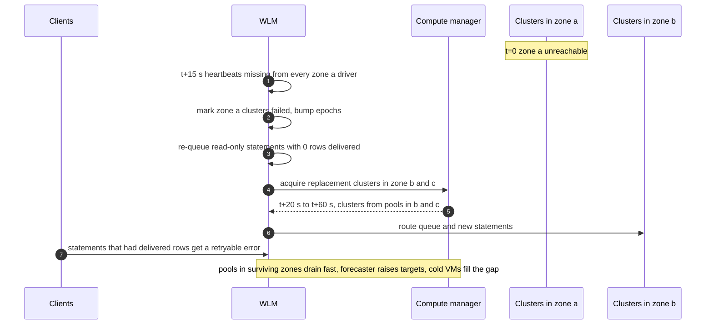

Detection ~15 s. Recovery for queued and retried statements 20 to 60 s, bounded by how much warm capacity the other zones hold. Data at risk: none, all state is in object storage. What the user sees: slower dashboards for a minute, some long statements failing with a retryable error. What on-call sees: pool-below-forecast alerts in the surviving zones.

**Object-store throttling.** A hot table under one prefix meets 5,500 GET/s. Workers get `503 SlowDown` and back off with jitter, so tasks slow, speculation must not multiply requests (it counts as a straggler otherwise, so speculation is suppressed when the cause is throttling). Fix forward: randomized file prefixes for the table, and disk cache hit rate as the leading indicator.

### 10.5 Exactly-once and idempotency end to end

| Hop | Duplicate can enter when | Removed by | Key | Lifetime |
|---|---|---|---|---|
| Client submit | client retries after a timeout | Gateway returns the existing statement | `request_id` per tenant | 24 h |
| WLM to cluster | WLM failover resends a routed statement | Driver rejects a statement id it already runs, cluster epoch fences old routes | `(statement_id, attempt)`, epoch | Statement life |
| Driver retry after driver loss | statement re-run on a new cluster | Only read-only, zero rows delivered, so a rerun has no effect | `statement_id`, attempt ≤ 2 | Statement life |
| Task attempts and speculation | two attempts of one map task both finish | Driver registers one map output per map id, first wins | `(stage, partition)` | Stage attempt |
| Result-writing tasks | two attempts write the same chunk | Chunk path is `(statement_id, attempt, chunk_index)`, manifest lists only the winner's | chunk path | 24 h |
| Writes (`INSERT`, `MERGE`) | client resubmits after an unknown outcome | Table format commit is atomic, idempotent writers use a transaction id in the commit (#15) | `txn(appId, version)` | Table retention |
| Metering | stream redelivery, driver resend | Upsert keyed by `(statement_id, minute)` and `(cluster_id, minute)` | those keys | Billing period |

### 10.6 Consistency model per edge

| Edge in the final diagram | Model | Notes |
|---|---|---|
| Client ↔ gateway ↔ WLM (statement state) | **Strong** per statement | One owner shard per warehouse, persisted transitions |
| Driver → catalog | **Strong** at analysis, then **pinned** | Grants and versions read once per statement. With the outage TTL cache, bounded staleness of minutes |
| Driver → table snapshot | **Snapshot isolation** per table | Pinned version for the whole statement. Different tables pinned at slightly different instants |
| Workers → object store data | **Immutable** | Files never change after commit |
| Workers → disk cache | **Immutable** | Keyed by path and modification time |
| Driver → result cache | **Never stale** | Key contains every table version and the security context |
| Session → next statement | **Read-your-writes** | Session carries its last committed version per table |
| Workers → shuffle files | Written once per attempt, read after the stage barrier | The barrier is what makes them complete |
| Drivers, compute manager → metering → system tables | **Eventual**, minutes | Idempotent upserts |

### 10.7 Alternatives rejected

| Alternative | Why it looked attractive | Why rejected |
|---|---|---|
| One shared Presto-style cluster per region | Best utilisation, simplest ops | No security boundary between tenants, noisy neighbours, one coordinator is a regional SPOF |
| Shared slot pool across tenants (BigQuery) | Statistical multiplexing, no idle pool | Needs process-level isolation strong enough for untrusted tenants and a shared shuffle tier. Kept as the evolution for small statements |
| Always-on per-tenant clusters | Warm caches, no startup | Idle cost is the tenant's, minutes to resize |
| Pipelined in-memory exchange everywhere | Lowest latency, no disk writes | No task retry, no AQE, whole query fails on a node loss. Used only as the one-stage fast path |
| Remote shuffle for every statement | Durable intermediate data, elastic compute | An extra hop per byte for 90% of statements that shuffle nothing |
| Code generation for the engine | Best on complex CPU-bound expressions | Harder to build, observe, and adapt per batch. Photon chose vectorization for these reasons |
| Shared-nothing MPP with data on local disks | No object-store latency | Compute and storage cannot scale apart, resizing moves data, and the lake is the source of truth anyway |
| Per-byte pricing | Simple, attributable, predictable | Misprices CPU-heavy queries. Exposed as a guardrail instead |
| Secondary indexes on lake tables | Fast point lookups | Index maintenance on every write. Stats, clustering and bloom filters cover analytics |

### 10.8 How the big companies do it

- **Databricks SQL with Photon.** Spark's planner and scheduler with Photon replacing supported operators, disk cache on NVMe, result caches, serverless warehouses from a warm pool (2 to 6 s start), IWM predicting cost for admission and scaling. Photon: tens of millions of queries from hundreds of customers by 2022, 3x average speedup on customer workloads, and the audited 100 TB TPC-DS record in November 2021 on a 256-node i3.2xlarge cluster ([SIGMOD 2022](https://www.cs.cmu.edu/~15721-f24/papers/Photon.pdf)).
- **Snowflake.** Virtual warehouses per customer from a pre-warmed pool, elasticity in tens of seconds, local SSD caching with lazy consistent hashing and work stealing, intermediate data in memory then local SSD then S3. Their own paper argues per-second billing breaks the economics of the pre-warmed pool and points to sharing compute across customers ([NSDI 2020](https://www.usenix.org/system/files/nsdi20-paper-vuppalapati.pdf)).
- **Google BigQuery (Dremel).** Fully shared: slots (virtual compute units) fair-scheduled across queries within a reservation. Disaggregated in-memory shuffle since 2014, which cut shuffle latency by 10x, allowed 10x larger shuffles, cut resource cost by over 20%, and now accounts for 80% of the service's memory. Dynamic query execution switches join strategies from runtime statistics ([VLDB 2020](https://www.vldb.org/pvldb/vol13/p3461-melnik.pdf)).
- **Presto and Trino.** Coordinator plus workers with pipelined in-memory exchanges. At Meta, clusters up to ~1,000 nodes with 50 to 100 concurrent queries, no worker fault tolerance in 2018, clients retried ([ICDE 2019](https://trino.io/Presto_SQL_on_Everything.pdf)). Trino later added fault-tolerant execution with query-level or task-level retry and spooled exchanges ([docs](https://trino.io/docs/current/admin/fault-tolerant-execution.html)).
- **Amazon Redshift.** Concurrency scaling adds transient clusters when read queries queue, which is the same "scale out on queue" move as multi-cluster warehouses ([docs](https://docs.aws.amazon.com/redshift/latest/dg/concurrency-scaling.html)).

### 10.9 Operational runbook

**Dashboards:** statements/s by class and outcome, queue wait p50/p95 per warehouse, warm pool size vs forecast per type and zone, warehouse start time, result cache and disk cache hit rates, bytes scanned vs bytes pruned, shuffle bytes and fetch wait per statement, spill bytes, `FetchFailed` and speculative task counts, infrastructure failure rate, attributed vs billed cost.

**Alerts:** pool below 20% of forecast in any zone (page), queue wait p95 over 30 s on over 1% of warehouses (page), infrastructure failure rate over 0.5% for 10 min (page), catalog error rate over 1% (page), `FetchFailed` rate 3x baseline (ticket, bad hardware), daily attribution check off by over 1% (ticket, billing).

**Rollout of an engine change:** new runtime images go to the warm pool gradually. 1% of new clusters, then 10%, then all, per region. Shadow-run a sample of deterministic statements on old and new and diff results. Clusters recycle within 24 h, so a full rollout takes at most a day and needs no restart of running statements.

**Rollback:** stop assigning the new image, recycle clusters that have it. No data to backfill, because the engine writes nothing durable except results (24 h) and commits (table format).

### 10.10 Security and abuse

- **Tenant boundary.** VMs belong to one tenant for life, per-tenant network isolation, encrypted local disks with a per-cluster key, VMs terminated rather than reused.
- **Data access.** The catalog checks grants and vends a short-lived credential scoped to the table's path, per statement. Workers never hold bucket-wide keys. Row filters and column masks are injected by the planner, so they apply to every engine path.
- **User code.** Python UDFs run in a separate sandboxed process with no network access and no engine credentials, so they cannot read another user's data in a shared cluster.
- **Results.** Presigned links are short-lived bearer tokens. Treat them as secrets. They expire with the result.
- **Abuse.** Per-tenant and per-token rate limits at the gateway, maximum scan bytes and statement timeouts, per-tenant caps on warm-pool draw so one tenant cannot empty the pool.
- **Statistics leak values.** Min/max stats in the table log reveal values to anyone who can read the log (see #15 §10.10). The engine should not expose stats beyond what the user's grants allow.

### 10.11 Evolution

- **10x statements (200 M/day).** Most are small. Share a sandboxed pool across tenants for small statements (BigQuery's model), keep dedicated clusters for large ones. The result cache becomes a first-class tier in front of the WLM.
- **10x data per query.** Push-merge by default, a remote shuffle tier for statements over a shuffle threshold, task-level recovery with spooled exchanges for long statements.
- **Multi-region.** Warehouses are regional. Cross-region queries read remote tables at egress cost. Replicate hot tables instead of querying across regions.
- **New requirement: sub-100 ms serving.** A separate warehouse type with materialized views and a row-oriented cache. Do not bend the analytics engine.
- **New requirement: workload priority across a tenant's warehouses.** Tenant-level budgets in the WLM and a shared per-tenant queue. The seam is the WLM's admission function.

---

## 11. Follow-up questions to expect

Ranked by how likely an interviewer asks them. Each links to the file with the answer.

1. **Walk a join from SQL to tasks.** Stages at exchanges, map outputs, barrier, AQE. §4.2, [`deep-dives/query-planning-and-adaptive-execution.md`](deep-dives/query-planning-and-adaptive-execution.md).
2. **One key has 30% of the rows.** AQE skew split, 5x median and 256 MB, replicate the other side. §5.3, Flow 2, [`deep-dives/shuffle-and-joins.md`](deep-dives/shuffle-and-joins.md).
3. **A worker dies mid-shuffle.** FetchFailed, rerun lost map tasks from lineage. Flow 4, [`deep-dives/fault-tolerance-and-stragglers.md`](deep-dives/fault-tolerance-and-stragglers.md).
4. **The driver dies.** Statement retry if read-only and zero rows delivered, epoch fencing. Flow 5, [`edge-cases.md`](edge-cases.md).
5. **A big query slows a dashboard.** Separate warehouses, admission by predicted cost, fair slots with short tasks, memory reservations. §5.2, [`deep-dives/multi-tenant-isolation-and-admission.md`](deep-dives/multi-tenant-isolation-and-admission.md).
6. **Cold start in seconds, and who pays.** Warm pool, forecasting, few instance types, per-second billing makes it the provider's cost. §5.5, [`deep-dives/elasticity-warm-pools-and-cost.md`](deep-dives/elasticity-warm-pools-and-cost.md).
7. **Why is the shuffle slow and what do you do.** M × R blocks, broadcast, NVMe, push-merge, remote tier with a threshold. §5.3.
8. **Cost per query with 10 statements on a cluster.** Uptime bills, task-slot-seconds attribute, idle shown as idle. §4.5, Flow 6.
9. **Stale results after a write.** Impossible: the cache key has every table version. §5.1, §10.6.
10. **Stragglers.** Speculation at 0.9 and 3x, not for skew. §5.4.
11. **Vectorized vs code generation.** Adaptivity, observability, engineering speed. §7, [`deep-dives/vectorized-execution-and-scan-path.md`](deep-dives/vectorized-execution-and-scan-path.md).
12. **Zone outage.** Clusters are zonal, warehouses are not. §10.4.
13. **A hot table hits S3 request limits.** Disk cache, randomized prefixes, backoff, no speculation on throttling. §10.4, [`edge-cases.md`](edge-cases.md).
14. **Pipelined (Presto) vs staged (Spark) execution.** Latency vs recoverability, fast path for tiny queries. §7.
15. **How would you share compute across tenants safely.** Sandboxed shared pool for small statements, the Snowflake §7 argument. §10.11.
