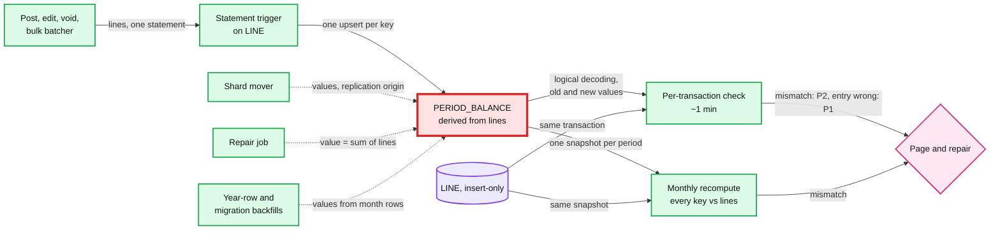

# Deep dive: audit trail and continuous verification

> One-line answer: every change writes its audit event in the same transaction, a change stream copies audit events to write-once storage for 7+ years, and a verifier re-checks the books in three loops: per committed transaction from the change stream within ~1 minute (entries sum to zero, balance deltas equal the lines, nothing mutated), per company once a month by recomputing every balance row from lines, and per company per day by chaining a Merkle root of the day's entries into write-once storage. Balance rows are derived data: every path that inserts lines gets its deltas from one statement-level trigger, which removes the "forgot or doubled a delta" bug class (the simulation below shows why), and every path that writes balance rows without lines (shard mover, repair, year-row and migration backfills) is invisible to the fast loop, so each ends with its own targeted recompute.

Zoom-in on [`../solution.md`](../solution.md) §4.2 (audit in the same transaction), §5.4 (the verifier), §10.4 (drift timeline) and §10.10. Reusable blocks: [`../../../concepts/merkle-tree.md`](../../../concepts/merkle-tree.md), [`../../../concepts/exactly-once.md`](../../../concepts/exactly-once.md), [`../../cdc-pipeline/`](../../cdc-pipeline/). Siblings: [`posting-engine-and-balance-invariant.md`](posting-engine-and-balance-invariant.md), [`fast-reports-period-balances.md`](fast-reports-period-balances.md), [`tenant-sharding-and-hot-tenants.md`](tenant-sharding-and-hot-tenants.md).

---

## 1. Who writes balance rows, and which loop sees it



## 2. The audit trail

- **Same transaction.** `AUDIT_EVENT(action, txn_id, versions, actor, app_id, ip, override_reason)` commits with the change, so no change exists without its event. The verifier checks it: every `TXN` change in a transaction has an audit event in the same transaction.
- **Archive.** CDC (change data capture) copies audit events to write-once object storage, kept 7+ years. QBO's own audit log view shows two years ([QuickBooks help](https://quickbooks.intuit.com/learn-support/en-us/help-article/audit-log/use-audit-log-quickbooks-online/L2WoVnW6I_US_en_US)); ours keeps the rest behind it.
- **The books are their own audit for amounts.** Lines and reversals are insert-only, with `posted_at`, so "who changed March revenue and from what" is a query over entries, and "the books as of a system time" is a filter. The audit event adds who, from which app and why.
- **People who read the books are audited too.** Support access is a time-limited grant, logged.

## 3. The per-transaction check

The verifier reads the same logical-decoding stream as CDC, grouped by database transaction, and checks statelessly:
- Each new entry's lines sum to zero, in transaction and home currency.
- For every balance key, Σ (new − old) of the balance rows equals Σ of that transaction's lines mapped to the key, per grain. `REPLICA IDENTITY FULL` on `PERIOD_BALANCE` puts the old row in the stream (~80 B extra per update).
- No `UPDATE` or `DELETE` on `LINE`, `JOURNAL_ENTRY`, `TXN_VERSION`, `AUDIT_EVENT`.
- Every `TXN` change has an `AUDIT_EVENT`; no write lands for a company whose placement is `MOVED`.

Load: ~900 posts/s × ~14 row changes ≈ 13k changes/s average, ~140k/s peak, a few cores. Detection: within ~1 minute.

## 4. A lost delta, a doubled delta, a stale mover copy

Why the design moved delta maintenance into the database. Three injected bugs: a code path that computes deltas itself forgets one balance key (transaction 701), a resumed bulk batch sums deltas over its input instead of the rows it actually inserted (1902), and the shard mover copies one balance value stale. Then the same workload with the deltas made by the database from the inserted lines, as the design now does.

```python
# Balance rows are derived data. Inject a lost delta, a doubled delta and a bad
# mover write; see which verifier loop finds each, repair, then rerun with a trigger.
import random, hashlib
from collections import defaultdict
random.seed(11)
ACCTS = ["AR", "Sales", "Tax", "Bank", "Fuel"]

def workload(n=3000):
    for i in range(n):
        a, b = random.sample(ACCTS, 2); amt = random.randint(100, 99_999)
        yield i, [(a, i % 12, amt), (b, i % 12, -amt)]     # key = (account, month)

def run(mode):
    lines, bal, stream = [], defaultdict(int), []
    def write_balances(tx, deltas, origin=None):
        changes = []
        for k, d in sorted(deltas.items()):
            changes.append((k, bal[k], bal[k] + d)); bal[k] += d
        stream.append((tx, origin, changes))
    for i, ls in workload():
        new = [(i,) + l for l in ls]; lines.extend(new)
        sums = defaultdict(int)
        for _, acct, m, amt in new: sums[(acct, m)] += amt
        if mode == "app":                                   # bugs live in caller code
            if i == 701: sums.popitem()                     # new path forgets one key
            if i == 1902: sums = {k: 2 * v for k, v in sums.items()}  # resumed batch
        write_balances(i, dict(sums))
        if i == 2500:                                       # mover copies a stale value
            k = ("Bank", 9); write_balances("mv", {k: -5}, origin="mover")
    return lines, bal, stream

def per_txn_check(lines, stream):
    by_tx = defaultdict(lambda: defaultdict(int))
    for tx, acct, m, amt in lines: by_tx[tx][(acct, m)] += amt
    bad = []
    for tx, origin, changes in stream:
        if origin: continue                                 # skipped: replication origin
        got = defaultdict(int)
        for k, old, new in changes: got[k] += new - old
        if {k: v for k, v in got.items() if v} != {k: v for k, v in by_tx[tx].items() if v}:
            bad.append(tx)
    return bad

def recompute(lines, bal):
    truth = defaultdict(int)
    for _, acct, m, amt in lines: truth[(acct, m)] += amt
    return {k: (bal[k], truth[k]) for k in set(bal) | set(truth) if bal[k] != truth[k]}, truth

for mode in ("app", "trigger"):
    lines, bal, stream = run(mode)
    print(f"[{mode}] per-transaction verifier flags txns: {per_txn_check(lines, stream)}")
    drift, truth = recompute(lines, bal)
    print(f"[{mode}] monthly recompute finds {len(drift)} drifted keys: {sorted(drift.items())}")
    for k in drift: bal[k] = truth[k]                       # repair: set value from lines
    print(f"[{mode}] after repair: {len(recompute(lines, bal)[0])} drifted keys")

def day_roots(lines, per_day=500):                          # daily root, chained
    prev, roots = b"genesis", []
    for d in range(0, len(lines), per_day):
        h = hashlib.sha256(repr(lines[d:d + per_day]).encode()).digest()
        prev = hashlib.sha256(prev + h).digest(); roots.append(prev.hex()[:12])
    return roots

lines = run("trigger")[0]; published = day_roots(lines)
lines[1234] = lines[1234][:3] + (lines[1234][3] + 1,)       # DBA edits one old line by 1 cent
now = day_roots(lines)
print("first day whose chained root differs:", next(i for i, (a, b) in enumerate(zip(published, now)) if a != b),
      "of", len(now), "| later roots differ too:", sum(a != b for a, b in zip(published, now)))
```

Real output (Python 3, seed 11):

```
[app] per-transaction verifier flags txns: [701, 1902]
[app] monthly recompute finds 4 drifted keys: [(('AR', 5), (-1221671, -1265516)), (('AR', 6), (-814149, -875225)), (('Bank', 9), (737708, 737713)), (('Fuel', 6), (-288024, -226948))]
[app] after repair: 0 drifted keys
[trigger] per-transaction verifier flags txns: []
[trigger] monthly recompute finds 1 drifted keys: [(('Bank', 9), (-21094, -21089))]
[trigger] after repair: 0 drifted keys
first day whose chained root differs: 2 of 12 | later roots differ too: 10
```

- **The fast loop catches both code bugs**, by transaction id, within the stream lag. It cannot see the mover's write: that write carries a replication origin and no lines, so it is skipped.
- **The monthly recompute catches all four drifted keys,** including the mover's, but up to 28 days later.
- **Repair is "set the value to Σ lines".** Running it twice is the same as once. After repair, zero drift.
- **With trigger-maintained balances the caller's bugs cannot happen:** the caller only inserts lines. The mover's stale copy still drifts, because the mover writes values. That is the class the trigger does not remove, and the reason for §5.
- **The daily root chain** finds a one-cent edit to an old line at the day it was made, and every later root differs too.

## 5. The blind spots, and how the design closes them

| Path that writes balance rows | Lines in the same transaction? | Per-transaction loop | Check in the design |
|---|---|---|---|
| Post, edit, void, bulk | Yes, through the statement trigger | Checked | Also the monthly loop |
| Shard mover catch-up | Values copied by key, triggers off | Skipped, but only inside its `(origin, company, move window)` allowlist | Per-key compare and a targeted recompute on the target before the flip (solution §5.5 step 4) |
| Repair job | No | Skipped | Runs under the exclusive company fence and ends with a targeted recompute |
| Year-row enablement | No | Skipped | Fenced backfill, then a targeted recompute ([`fast-reports-period-balances.md`](fast-reports-period-balances.md) §5) |
| Migration backfill (solution §8 phase 1) | No | Skipped | Per company under the fence, then a targeted recompute before its flag flips |

- **The rule (solution §5.4): no path that writes balance rows without lines reports success until a targeted recompute of what it touched comes back clean.** The monthly loop is the backstop for bugs, not the only check for whole code paths.
- **The origin skip is allowlisted.** Without it, a database administrator who sets the mover's replication origin on a session would make their writes invisible to the fast loop. The mover registers `(origin, company, move window)`; an origin-tagged change outside it pages.
- **Decision: a repair receipt.** The repair job also writes `(key, value, Σ lines, snapshot)` rows, so the verifier can check the repair itself rather than skip it.

## 6. Why a statement-level trigger, and its sharp edges

A first draft kept delta maintenance in application code and rejected a trigger because "per-row triggers kill the batching" and a trigger hides logic from the code that owns posting rules. Neither holds for a statement-level trigger, which is what the design now uses (solution §10.1):

- **Statement-level, not per row.** An `AFTER INSERT ... REFERENCING NEW TABLE AS new_lines FOR EACH STATEMENT` trigger on `LINE` ([CREATE TRIGGER](https://www.postgresql.org/docs/current/sql-createtrigger.html)) sees every line the statement inserted, groups them by balance key and runs one sorted upsert. A 2,500-line bulk insert is still ~6 upserts.
- **The mapping is not posting-rule logic.** Rules decide which lines exist; the trigger only maps a line to `(account, grain, period, class, location)` plus the year-row flag, and picks `delta_acct` from the account's currency.
- **The check runs first.** The entry-balance constraint trigger is row-level and set `IMMEDIATE`, and "row-level AFTER triggers fire at the end of the statement (but before any statement-level AFTER triggers)" ([trigger behaviour](https://www.postgresql.org/docs/current/trigger-definition.html)). An unbalanced entry aborts the statement before any balance row is locked.
- **The mover stays silent.** Ordinary triggers fire only when `session_replication_role` is `origin` or `local` ([client defaults](https://www.postgresql.org/docs/current/runtime-config-client.html)); the mover applies as `replica`, so balance rows arrive as copied values. Only "superusers and users with the appropriate SET privilege" can set it: **Decision:** grant it to the mover's role alone.
- **Sharp edge 1, partitions.** `LINE` is partitioned by year. A statement trigger fires for "the explicitly named table, but not statement-level triggers for its partitions" (CREATE TRIGGER notes). An `INSERT` straight into a partition (the late-lines partition of a tiered year, a hand-run backfill) would get the row-level check but **no balance upsert**. **Decision:** the app role has `INSERT` on the parent `LINE` only.
- **Sharp edge 2, grants.** If the app role can still write `PERIOD_BALANCE`, a path that adds its own deltas double counts. "The trigger will always run as the role that queued the trigger event, unless the trigger function is marked as SECURITY DEFINER" (trigger behaviour page). **Decision:** the trigger function is `SECURITY DEFINER`, owned by a ledger-owner role; the app role loses `INSERT` and `UPDATE` on `PERIOD_BALANCE`; only that owner and the audited repair role keep them.

What it removes: "a code path forgot the delta, applied it twice, or used the wrong grain", for every path that inserts lines through the parent, including ones not written yet (cash-basis rows, a new dimension). What it does not remove: a bug in the trigger itself (one place, tested once) and set-value writers (§5). The verifier stays.

## 7. The monthly recompute without false alarms or bloat

- **One snapshot per key range, not per company.** Lines are insert-only and a period's balance rows change only when lines of that period are inserted, so reading lines and balance rows of one month in one `REPEATABLE READ` snapshot is consistent for that month. Chunking per month keeps each snapshot short.
- **Why it matters.** The verifier runs on the cross-region replica with `hot_standby_feedback` on. A 25-minute snapshot for the largest company (~300 GB) would hold back vacuum on the primary for every company in the cluster; per-month chunks hold it back for seconds.
- **Cost:** ~850 B lines × 250 B ≈ 212 TB at year 10, ~82 MB/s fleet-wide, ~1.3 MB/s per cluster (solution §5.4).

## 8. Tamper evidence

- **Daily root per company.** Hash the day's new entries and lines (by `posted_at` day) in `entry_id` order into a Merkle root, chain it with the previous day's root, and write it to write-once storage database administrators cannot alter ([`../../../concepts/merkle-tree.md`](../../../concepts/merkle-tree.md)).
- **What it proves.** Any later change to a line breaks that day's root and every root after it. An auditor recomputes a day from lines alone.
- **The same-day window.** An edit before that day's root is computed is still caught: it is an `UPDATE` on `LINE` in the stream, a P1 page.
- **A region failover breaks the chain honestly.** Entries lost in the failover were in a root already published (if the root ran before the loss) or never were. The verifier recomputes that day on the new timeline and records the break with the failover event id, so an auditor sees why.

**Push back on the textbook answer.** "Hash-chain every entry as it commits." A per-company chain head is one more row each post must lock: it serializes the company's writes and stacks on the hot row. A daily root gives an auditor the same evidence at zero cost on the write path. Stripe's Ledger also verifies after the fact: it sees "five billion events" a day and verifies "99.99% of our dollar volume" within four days ([stripe.dev](https://stripe.dev/blog/ledger-stripe-system-for-tracking-and-validating-money-movement)).

## 9. Repair

- **Trigger:** a P2 mismatch with company, key and transaction id.
- **Stop the bleeding first:** if the fast loop names a code path, disable it by flag (solution §10.4: ~15 minutes).
- **Rebuild:** under the exclusive company fence, set each affected key to Σ lines, as an audited system action that ends with a targeted recompute (solution §5.4).
- **Never touch lines.** Lines are the truth. A wrong line (a bad posting rule) is fixed by reversal plus re-post under the corrected rule version, also audited.

## 10. What an interviewer pushes on

1. **"How do you know the books are right?"** Three loops: per transaction in ~1 minute, a full recompute monthly, daily Merkle roots. Plus the constraint trigger, which stops an unbalanced entry before any balance row is touched.
2. **"Your verifier skips the shard mover. So who checks it?"** A targeted recompute on the target before the flip; and origin-tagged writes outside a move window page.
3. **"Isn't logic in a trigger hidden?"** Only the line-to-key mapping is there, one statement-level trigger, tested once; the per-row batching objection does not apply. Insert through the parent only, and revoke direct writes to balance rows.
4. **"Why not verify synchronously in the transaction?"** It would read the balance row's old value under the lock: more work in the hot-row window, for checks the trigger and the stream already give.
5. **"What does the auditor get?"** The audit archive, the close snapshots and diffs, and daily roots they can recompute from lines.

## 11. Trade-offs

| Decision | Option A | Option B | Chose | Why |
|---|---|---|---|---|
| Balance maintenance | Application code in each path | Statement-level trigger on `LINE` | Trigger | Removes a whole class of bugs; batching survives. Needs parent-only inserts and revoked balance grants |
| Set-value writers | Covered by the monthly loop | Targeted recompute before the path finishes | Targeted | Detection in an hour, not 28 days |
| Mover writes | Skip by origin, trust | Skip by origin plus allowlist by move window | Allowlist | Closes the insider bypass |
| Recompute snapshot | One per company | One per company-month | Per month | No false alarms, no long vacuum hold |
| Tamper evidence | Hash chain per entry | Daily chained root | Daily | No chain head on the write path |

## 12. Numbers to say out loud

- Fast loop: ~13k row changes/s average, ~140k/s peak, detection in ~1 minute.
- Monthly loop: 212 TB at year 10, ~1.3 MB/s per cluster, every company every 28 days.
- Daily roots: ~4 M active companies × 32 B a day.
- Targeted recompute after any value-writing path: before it reports success.
- Audit: same transaction, 7+ years write-once, two years in the QBO view.
