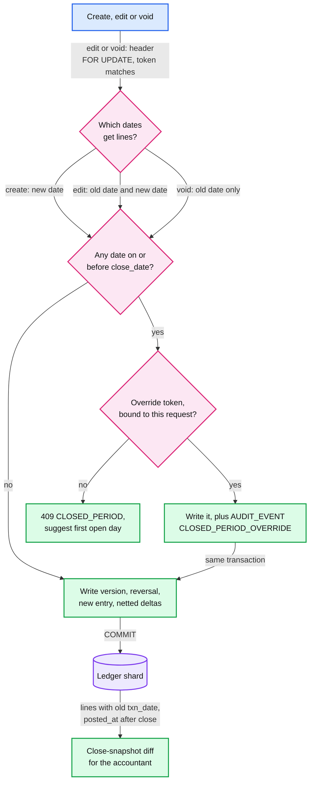
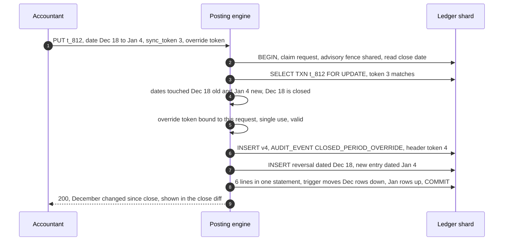

# Deep dive: edits, reversals and closed periods

> One-line answer: a business transaction is a header with a version pointer and a `sync_token`, plus immutable versions; an edit takes the header `FOR UPDATE`, compares the token, and posts a reversal of the old version (dated like the old version) plus the full new version, all lines in one statement whose trigger nets the balance deltas per key; a void is the reversal alone, and a reversal is never re-dated. The closing date is checked inside the same transaction against every date the change touches, under a company fence (an advisory lock) that posts hold shared and the close takes exclusively; an override needs a permission, a password and a reason, and shows up as a diff against the close snapshot. Retained earnings are never posted: they are computed at read from income and expense rows before the fiscal-year start, using the fiscal-year start in force on the as-of date, so a backdated entry across a year end fixes itself.

Zoom-in on [`../solution.md`](../solution.md) §4.2 (edits), §4.3 (closed periods), §4.4 (retained earnings at read) and §5.1 (`sync_token`). Reusable blocks: [`../../../concepts/mvcc-and-isolation.md`](../../../concepts/mvcc-and-isolation.md) (row locks), [`../../../concepts/exactly-once.md`](../../../concepts/exactly-once.md). Diagrams: transaction and period state machines in [`../diagrams.md`](../diagrams.md#d8-state-machines), the two-app race in [D5b](../diagrams.md#d5b-two-apps-edit-the-same-invoice). Siblings: [`fast-reports-period-balances.md`](fast-reports-period-balances.md), [`posting-engine-and-balance-invariant.md`](posting-engine-and-balance-invariant.md).

---

## 1. Which dates a change touches, and when the closing date says no



## 2. What each change writes

Invoice t_5501, $1,000 + 8% tax, dated March 10 (v1, entry E1: AR +108,000, income −100,000, tax −8,000).

| Change | New version | Entries | Lines | Balance rows | Header |
|---|---|---|---|---|---|
| Edit to $1,200, same date | v2 | E2 `REVERSAL` of E1 dated Mar 10; E3 `POST` dated Mar 10 | 3 + 3 | 3 month + 3 day, deltas netted: AR +21,600, income −20,000, tax −1,600 | version 2, token 1 |
| Edit date to April 2 | v2 | E2 reversal dated **Mar 10**; E3 dated **Apr 2** | 3 + 3 | March rows −, April rows + (12 upserts, no netting across months) | version 2, token 1 |
| Void | v2, status `VOID` | E2 reversal dated Mar 10 | 3 | March rows back to before E1 | version 2, token 1 |
| Delete (QBO offers it) | Same as void in the ledger, plus a "deleted" flag on the header | E2 reversal | 3 | Same as void | status `DELETED` |

- **Lines are insert-only.** The app role has no `UPDATE` or `DELETE` on `LINE`, `JOURNAL_ENTRY`, `TXN_VERSION`. The only mutable row is the header.
- **The reversal carries the old version's date.** That is what makes "March P&L now says $1,200" true, and what makes the current view and the audit view sum to the same totals.
- **Netting happens in the database.** The six lines go in as one statement; the statement-level balance trigger groups them by key and runs one upsert, which Postgres requires anyway: one `ON CONFLICT DO UPDATE` may not touch a row twice ([INSERT](https://www.postgresql.org/docs/current/sql-insert.html)).

## 3. Two edits race: the `sync_token`

- **Mechanism.** Each edit sends the token it read. The engine takes the header `FOR UPDATE`, compares, and either writes the next version (token + 1) or rolls back with `409 STALE` and the current token. The row lock serializes the two; the compare rejects the stale one. QBO's API carries a `SyncToken` on every entity for the same purpose (the exact stale-object error code is [unverified]).
- **A lost response, retried.** Same `request_id`: the claim collides and returns the stored v2 response, even though the token in the retry is now stale. A new `request_id` with the old token gets `409`. That is the protection against a double edit from a client that regenerates ids.
- **Edit versus payment.** Receiving a payment against t_5501 changes its open balance. The payment post takes **both** headers `FOR UPDATE` in id order (payment, then the invoices it applies to), so an edit of the invoice and the payment serialize without deadlock. An edit that lowers an invoice below what was paid leaves a credit for the customer; it is never blocked.
- **Edit versus void.** Same row lock, same compare: the second one gets `409`.

## 4. Closed periods

- **Both dates.** An edit that moves a closed December invoice into January is still a change to December: the reversal lands in December. So the check covers the old version's date and the new one (solution §4.3 step 6).
- **The close waits for in-flight posts.** Posts hold the company fence shared, the close takes it exclusively, then sets `close_date` and stores a **close snapshot** (the trial balance as of the closing date). The fence is `pg_advisory_xact_lock_shared(company_id)` in posts and `pg_advisory_xact_lock(company_id)` in the close. A first draft used `FOR KEY SHARE` and `FOR UPDATE` on the settings row; Postgres lets new share lockers jump ahead of a waiting `FOR UPDATE`, and in simulation the close waited p99 12.7 s on a company posting 245/s. The advisory lock queues fairly: p99 ~200 ms ([`tenant-sharding-and-hot-tenants.md`](tenant-sharding-and-hot-tenants.md) §4, §5).
- **Overrides.** Admin role, the closing password (in `PASSWORD` mode) and a reason produce a single-use override token bound to the request. The post and its `AUDIT_EVENT CLOSED_PERIOD_OVERRIDE` commit together. QBO's two modes are "Allow changes after viewing a warning" and "...and entering password" ([QuickBooks help](https://quickbooks.intuit.com/learn-support/en-us/help-article/close-books/close-books-quickbooks-online/L59LelyPM_US_en_US)).
- **Voiding a closed-period transaction.** The reversal must carry the original date, so a void of a December invoice after a December close needs an override, exactly like an edit. The alternative accountants use is a **reversing journal entry dated in the first open period**: a new transaction, which leaves December alone. The ledger supports both. The design's rule is that a reversal of an existing version is **never re-dated** (solution §4.2): the GL (general ledger) current view hides a voided transaction's lines, so a December original reversed in January would leave December's balance rows and December's GL detail disagreeing.
An edit that moves a closed December invoice into January, with an override:



- **"Filed".** Once taxes are filed, an override is still allowed (it is the customer's books), but it is flagged harder in the diff: "changed after filing, re-file may be needed".

## 5. Backdated entries and retained earnings at read

Fiscal year starts July 1. FY2026 (July 2025 to June 2026) closes on July 20. On August 5 a $42 fuel charge dated June 28 arrives. It needs an override; then what does the balance sheet say?

```python
# Versioned transactions, reversals, closing date, SyncToken, and retained
# earnings computed at read. Fiscal year starts in July. Amounts in cents.
from datetime import date
from collections import defaultdict
PL = {"Income", "Fuel"}                       # income and expense accounts
co = {"fy_start": 7, "close": date(2000, 1, 1)}
txns, lines, bal, audit = {}, [], defaultdict(int), []

def fy_start(d):
    return date(d.year if d.month >= co["fy_start"] else d.year - 1, co["fy_start"], 1)

def write(tid, kind, d, legs, now):           # insert-only lines + month delta rows
    for acct, amt in legs:
        lines.append((tid, kind, d, now, acct, amt)); bal[(acct, d.year, d.month)] += amt

def check_closed(dates, override, now, what):
    if any(d <= co["close"] for d in dates):
        if not override: raise PermissionError("409 CLOSED_PERIOD")
        audit.append((now, what, "CLOSED_PERIOD_OVERRIDE", override))

def post(tid, d, legs, now, override=None):
    assert sum(a for _, a in legs) == 0, "400 unbalanced"
    check_closed([d], override, now, tid)
    txns[tid] = {"token": 0, "date": d, "legs": legs, "status": "POSTED"}
    write(tid, "POST", d, legs, now)

def edit(tid, token, d, legs, now, override=None, void=False):
    t = txns[tid]                             # SELECT ... FOR UPDATE, then compare
    if token != t["token"]: raise RuntimeError(f"409 STALE, current token {t['token']}")
    check_closed([t["date"]] + ([] if void else [d]), override, now, tid)
    write(tid, "REVERSAL", t["date"], [(a, -x) for a, x in t["legs"]], now)
    if not void: write(tid, "POST", d, legs, now)
    t.update(token=t["token"] + 1, date=d, legs=legs, status="VOID" if void else "POSTED")

def bs(as_of, posted_by=None):                # month-end as-of, RE and NI at read
    if posted_by:                             # "books as they stood": slow path on lines
        rows = [(a, x, d) for _, _, d, p, a, x in lines if p <= posted_by and d <= as_of]
    else:
        rows = [(a, x, date(y, m, 1)) for (a, y, m), x in bal.items() if date(y, m, 1) <= as_of]
    fs = fy_start(as_of)
    re = -sum(x for a, x, d in rows if a in PL and d < fs)
    ni = -sum(x for a, x, d in rows if a in PL and d >= fs)
    cash = sum(x for a, x, d in rows if a == "Bank")
    return f"RE {re/100:>9,.2f}  NI {ni/100:>9,.2f}  Bank {cash/100:>9,.2f}"

inv = lambda c: [("AR", c + c * 8 // 100), ("Income", -c), ("Tax", -(c * 8 // 100))]
post("t1", date(2026, 3, 10), inv(100_000), now=date(2026, 3, 10))
try:                                          # two apps hold token 0
    edit("t1", 0, date(2026, 3, 10), inv(120_000), now=date(2026, 5, 2))
    edit("t1", 0, date(2026, 3, 10), inv(90_000), now=date(2026, 5, 2))
except RuntimeError as e: print("second edit:", e)
post("t2", date(2026, 7, 3), [("Bank", 500_000), ("Income", -500_000)], now=date(2026, 7, 3))
co["close"] = date(2026, 6, 30)               # FY2026 closed on Jul 20
print("Aug 31 before backdate :", bs(date(2026, 8, 31)))
try: edit("t1", 1, None, None, now=date(2026, 8, 5), void=True)
except PermissionError as e: print("void of March invoice:", e)
post("t3", date(2026, 6, 28), [("Fuel", 4_200), ("Bank", -4_200)], now=date(2026, 8, 5),
     override="admin, late card charge")
print("Aug 31 after backdate  :", bs(date(2026, 8, 31)))
print("Aug 31 as stood Aug 4  :", bs(date(2026, 8, 31), posted_by=date(2026, 8, 4)))
print("Jun 30 FY2026 now      :", bs(date(2026, 6, 30)))
late = [l for l in lines if l[2] <= co["close"] and l[3] > date(2026, 7, 20)]
print("changed since close    :", [(l[0], l[4], l[5] / 100) for l in late], "| audit:", audit)
print("lines:", len(lines), "| reversal lines:", sum(l[1] == "REVERSAL" for l in lines))
```

Real output (Python 3, no randomness):

```
second edit: 409 STALE, current token 1
Aug 31 before backdate : RE  1,200.00  NI  5,000.00  Bank  5,000.00
void of March invoice: 409 CLOSED_PERIOD
Aug 31 after backdate  : RE  1,158.00  NI  5,000.00  Bank  4,958.00
Aug 31 as stood Aug 4  : RE  1,200.00  NI  5,000.00  Bank  5,000.00
Jun 30 FY2026 now      : RE      0.00  NI  1,158.00  Bank    -42.00
changed since close    : [('t3', 'Fuel', 42.0), ('t3', 'Bank', -42.0)] | audit: [(datetime.date(2026, 8, 5), 't3', 'CLOSED_PERIOD_OVERRIDE', 'admin, late card charge')]
lines: 13 | reversal lines: 3
```

- **The SyncToken race:** the second app's edit gets `409 STALE, current token 1`; nothing it sent was written.
- **The void into a closed period** is refused without an override (`409 CLOSED_PERIOD`).
- **The backdated $42** lowers FY2026 net income from $1,200 to $1,158 (the June 30 line), and retained earnings as of August 31 from $1,200 to $1,158. FY2027 net income stays $5,000. No closing entry was posted or re-posted: retained earnings are income and expense rows before the fiscal-year start, summed at read.
- **"As it stood on Aug 4"** comes from lines with `posted_at` on or before August 4: the old numbers, exactly. Insert-only lines make this a filter, not a restore.
- **The close diff** lists the two lines dated on or before June 30 and posted after the close, plus the audited override. That is what the accountant needs before re-filing.

## 6. Changing the fiscal-year start

Retained earnings at read need a fiscal-year start. With one current value, a company that moves its fiscal year from January to July in 2026 would see its 2019 balance sheet re-split equity between retained earnings and net income: total equity unchanged, but no longer what was filed. So the design keeps the fiscal-year start as an effective-dated history on the company (`fy_history`), and an as-of read uses the setting in force on the as-of date (solution §4.4). **Decision:** the change itself is a closed-period-style action: admin only, audited, and it creates a short first fiscal year that reports must show.

## 7. "What did the books say then?" and paged reports

- **Books as of a system time T:** all lines with `posted_at ≤ T`, reversals included. Exact, because nothing was ever updated, with one catch: `now()` returns "the start time of the current transaction" ([date/time functions](https://www.postgresql.org/docs/current/functions-datetime.html)), so a post that began before T can commit after it. Postgres 17's `transaction_timeout` ([release notes](https://www.postgresql.org/docs/17/release-17.html)) of 5 s bounds that: any T more than 5 s old is exact. It must be set on the posting role (`ALTER ROLE ... SET`), not globally: the mover's snapshot copy and the monthly recompute run for minutes.
- **The current view as of T, without the mutable header:** `POST` entries posted by T that have no `REVERSAL` posted by T. So even the "current view" is reproducible from insert-only rows.
- **GL detail paging.** A cursor that carried only `(last key, running balance)` would skip a post that lands before the cursor between two pages and include one after it, so an export would mix two states of the books. The design pins `posted_before = start − 5 s` in the cursor (the transaction timeout above) and every page filters on it (solution §4.4). The export ties to a balance sheet run at that instant; new lines show up on the next export.

## 8. What an interviewer pushes on

1. **"Why not update the line in place and keep a history table?"** Then the ledger mutates, CDC (change data capture) consumers cannot tell a fix from corruption, and "what did March say before" needs the history table to be right.
2. **"Why not post only the difference?"** Version 2's lines would be "v1 plus a diff", and a date change produces a negative March entry and a positive April one that match no document.
3. **"The close and a post commit in the same millisecond."** The fence serializes them: either the post committed before the close (it is in the snapshot) or it sees the new date.
4. **"Backdated entry into last year: who fixes retained earnings?"** Nobody. It is computed at read.
5. **"The user changes the fiscal year."** Effective-dated history, so old reports keep their split.
6. **"Voids in closed periods."** Override plus audit, or a reversing entry in the first open period. Never a silent re-dated reversal.

## 9. Trade-offs

| Decision | Option A | Option B | Chose | Why |
|---|---|---|---|---|
| Edit model | Update lines, or post the difference | Reversal plus full new version | Reversal + version | Insert-only; each version's lines equal its document |
| Reversal date | Today | The reversed version's date | Version's date | Reports show each transaction as it is now, on its own date |
| Concurrency | Last writer wins | `sync_token` compare under `FOR UPDATE` | Token | No silent loss between two apps |
| Closed period | Hard lock | Override with password, reason, snapshot diff | Override | Accountants fix closed periods for a living |
| Retained earnings | Year-end closing entries | Computed at read | At read | Backdating and fiscal-year changes need no re-posting |
| Fiscal-year start | One current value | Effective-dated history | History | Old reports keep the split that was filed |
| Close fence | `FOR KEY SHARE` and `FOR UPDATE` on the settings row | Advisory lock, shared and exclusive | Advisory | The close is never starved by a stream of posts |

## 10. Numbers to say out loud

- Edit: 2 entries, 6 lines in one statement, 6 netted balance rows in one trigger upsert, 1 header update, 1 audit event, ~30 ms with the remote flush.
- Date change across months: 12 balance upserts, no netting across months.
- The demo: FY2026 net income $1,200 to $1,158 after a $42 backdate; retained earnings as of Aug 31 the same; FY2027 untouched.
- QBO audit log shows two years; our write-once archive keeps 7+ years behind it.
