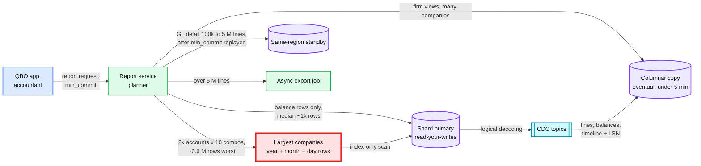
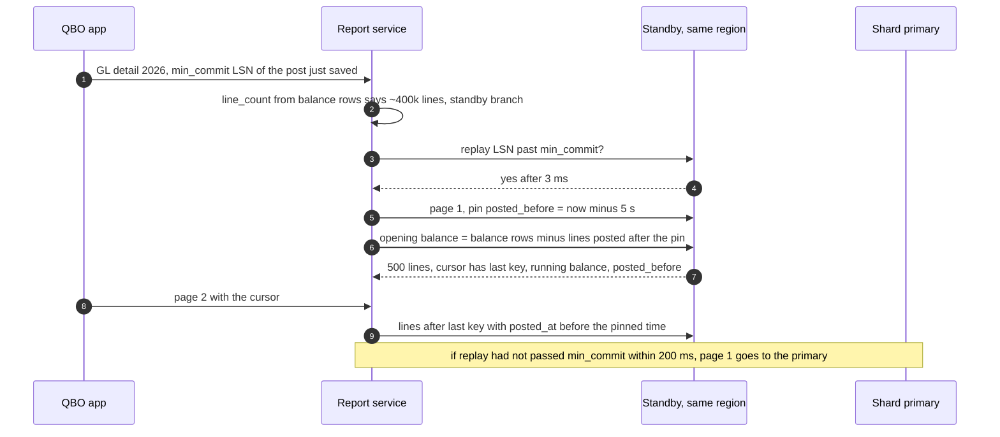

# Deep dive: fast reports from period balances

> One-line answer: every post adds deltas to per-account rows at day and month grain (and year grain for the few largest companies), keyed by class and location, written by a statement-level trigger from the lines in the same transaction; a balance as of any date is a prefix sum that reads the shorter end at each grain, so it costs at most ~31 rows per account and dimension combination whatever the volume, retained earnings and net income are split at read by the fiscal-year start in force on the as-of date, interactive reports read the shard primary for read-your-writes, and anything that scans lines goes to a standby with a commit token, an export job, or the columnar copy.

Zoom-in on [`../solution.md`](../solution.md) §4.4, §5.2, §5.6 and §10.1 (index-only scans). Reusable blocks: [`../../../concepts/columnar-db.md`](../../../concepts/columnar-db.md), [`../../../concepts/mvcc-and-isolation.md`](../../../concepts/mvcc-and-isolation.md), [`../../../concepts/caching-patterns.md`](../../../concepts/caching-patterns.md) (why there is no report cache). The as-of read plan is [D6b](../diagrams.md#d6b-which-rows-a-balance-sheet-as-of-a-date-reads). Siblings: [`edits-reversals-and-closed-periods.md`](edits-reversals-and-closed-periods.md), [`tenant-sharding-and-hot-tenants.md`](tenant-sharding-and-hot-tenants.md).

---

## 1. Where a report goes



## 2. Why deltas per period, not running balances

| Model | Backdated line dated March 2017, posted October 2026 | As-of read |
|---|---|---|
| Running balance on each line | Rewrite every later line of the account | 1 row |
| Cumulative month-end snapshots | Rewrite 116 month-end rows per account (March 2017 to October 2026) | 1 row + the partial month |
| **Per-period deltas (chosen)** | **3 rows per account: one day, one month, one year** | Prefix sum, ≤ ~31 rows |

- **Accounting time is not system time.** Users backdate and edit history all the time (solution §1). A model whose write cost grows with "how far back" makes every old edit a hot-row storm on exactly the rows the next post needs.
- **Deltas are commutative.** Two posts into one month row in either order give the same value, so concurrent posts only need the row lock, never a read-modify-write of history.

## 3. Rows read per as-of: the shorter end at each grain

The read sums full years forward, then at month level either the months before the date or the year row minus the months from the date on, then the same choice at day level. It picks the cheaper of the four combinations.

```python
# As-of balances from per-period delta rows (year, month, day) versus summing lines.
import random, calendar
from collections import defaultdict
from datetime import date, timedelta
random.seed(5)
START, YEARS, ACCTS = date(2016, 1, 1), 10, 60

def company(txns_per_month):
    lines, Y, M, D = [], defaultdict(int), defaultdict(int), defaultdict(int)
    for k in range(YEARS * 12 * txns_per_month):
        d = START + timedelta(days=random.randrange(YEARS * 365))
        a, b = random.sample(range(ACCTS), 2); amt = random.randint(1, 10**6)
        for acct, x in ((a, amt), (b, -amt)):
            lines.append((acct, d, x)); Y[acct, d.year] += x
            M[acct, d.year, d.month] += x; D[acct, d] += x
    return lines, Y, M, D

def asof(acct, t, Y, M, D):
    """Full years forward, then the shorter end at month and at day level."""
    v, rows = sum(Y[acct, y] for y in range(START.year, t.year)), t.year - START.year
    best = None
    ndays = calendar.monthrange(t.year, t.month)[1]
    for mfwd in (True, False):
        for dfwd in (True, False):
            mv = (sum(M[acct, t.year, m] for m in range(1, t.month)) if mfwd else
                  Y[acct, t.year] - sum(M[acct, t.year, m] for m in range(t.month, 13)))
            mr = t.month - 1 if mfwd else 1 + 13 - t.month
            dv = (sum(D[acct, t.replace(day=x)] for x in range(1, t.day + 1)) if dfwd else
                  M[acct, t.year, t.month] - sum(D[acct, t.replace(day=x)] for x in range(t.day + 1, ndays + 1)))
            dr = t.day if dfwd else 1 + ndays - t.day
            if best is None or mr + dr < best[1]: best = (mv + dv, mr + dr)
    return v + best[0], rows + best[1]

for label, tpm in (("median company", 600), ("10x company", 6000)):
    lines, Y, M, D = company(tpm)
    by_acct = defaultdict(list)
    for acct, d, x in lines: by_acct[acct].append((d, x))
    reads, scans, worst = [], [], 0
    for _ in range(300):
        acct = random.randrange(ACCTS)
        t = START + timedelta(days=random.randrange(YEARS * 365))
        truth = sum(x for d, x in by_acct[acct] if d <= t)
        v, rows = asof(acct, t, Y, M, D)
        assert v == truth
        reads.append(rows); scans.append(sum(d <= t for d, _ in by_acct[acct])); worst = max(worst, rows)
    print(f"{label:15s} lines {len(lines):>9,}  per account per as-of: lines scanned avg"
          f" {sum(scans)/len(scans):>7,.0f} | year+month+day rows avg {sum(reads)/len(reads):4.1f}, max {worst}")

t = date(2026, 6, 15)
print("month+day forward only, as of", t, "->", (t.year - START.year) * 12 + t.month - 1 + t.day, "rows per account")
print("backdated line dated 2017-03-10, posted Oct 2026: delta rows touched = 3 (day, month, year);"
      f" cumulative month-end snapshots Mar 2017 to Oct 2026 to rewrite = {(2026 - 2017) * 12 + 10 - 3 + 1}")
```

Real output (Python 3, seed 5):

```
median company  lines   144,000  per account per as-of: lines scanned avg   1,209 | year+month+day rows avg 16.2, max 31
10x company     lines 1,440,000  per account per as-of: lines scanned avg  12,062 | year+month+day rows avg 15.8, max 29
month+day forward only, as of 2026-06-15 -> 140 rows per account
backdated line dated 2017-03-10, posted Oct 2026: delta rows touched = 3 (day, month, year); cumulative month-end snapshots Mar 2017 to Oct 2026 to rewrite = 116
```

- **Every one of 600 random as-of reads matched the line scan exactly** (the `assert`).
- **Rows read do not grow with volume.** 16 per account on average, at most 31, for both the median company and a 10x one. A line scan reads 1.2k and 12k lines per account.
- **Without year rows and the shorter end,** a 2026 balance sheet reads ~140 rows per account (month rows since 2016 plus up to 31 day rows). Fine for a median company (~60 accounts, ~8k rows, ~5 to 15 ms). For the largest (~2k accounts × ~10 class and location combinations) it is ~3 M rows, 2 to 4 s. Year rows bring it to ~0.4 M typical and ~620k worst, ~300 ms (solution §5.2).

## 4. Retained earnings and net income, at read

For an as-of date D with fiscal-year start F(D):
- **Balance-sheet accounts** (asset, liability, equity): prefix sum to D.
- **Net income this year:** income and expense rows from F(D) to D.
- **Retained earnings:** income and expense rows before F(D), plus anything posted straight to the retained earnings account.
- **One statement, one snapshot,** grouped by account. Assets equal liabilities plus equity because every entry summed to zero.

No closing entry exists, so a backdated line into last year or a changed fiscal year needs no re-posting ([`edits-reversals-and-closed-periods.md`](edits-reversals-and-closed-periods.md) §5, §6). The fiscal-year start is read from the company's effective-dated history (`fy_history`), because with one current value old balance sheets would re-split equity after a change.

## 5. Dimensions and the year grain

- **Class and location are in the balance key.** A filtered report reads that combination's rows. Unfiltered reads group across combinations.
- **Customer is not.** Millions of customers at the largest tenants would multiply rows; one customer's lines are a small slice, read through the `(company, name_id, txn_date)` line index.
- **Year rows for the largest companies.** Turned on when `accounts × combinations × years` passes ~500k rows (a few hundred companies [estimate]).
- **Turning year rows on is fenced.** An unfenced "flag plus one-statement backfill" races posts: if the backfill reads month rows in one snapshot and the flag becomes visible to posts at a different instant, every post that commits in between is counted twice (it wrote a year delta and is in the month rows the backfill summed) or missed (in neither). So the design takes the company fence exclusively ([`tenant-sharding-and-hot-tenants.md`](tenant-sharding-and-hot-tenants.md) §5), sets the flag and inserts the year rows from month rows in one transaction (solution §5.2). For the largest company that sums ~2.4 M month rows (2k accounts × 10 combinations × 120 months): a write pause of ~1 to 2 s [estimate], once. Then a targeted recompute of that company's year rows, because the per-transaction verifier cannot check a backfill ([`audit-trail-and-continuous-verification.md`](audit-trail-and-continuous-verification.md) §5).

## 6. Postgres details that decide the milliseconds

- **Index-only scans.** The balance index is `(company_id, account_id, grain, period_start, class_id, location_id) INCLUDE (delta_home, delta_acct)`. A read visits the heap only for pages the visibility map does not mark all-visible. Old periods become all-visible after vacuum; a backdated post makes one old page not-all-visible again until the next vacuum. Cheap.
- **The covering index costs HOT updates, and the design pays it** (solution §7, §10.1). HOT (heap-only tuple) updates need that the update "does not modify any columns referenced by the table's indexes" ([HOT](https://www.postgresql.org/docs/current/storage-hot.html)). `delta_home` sits in the index, so every balance update adds an index entry [inference from that rule; the page does not mention `INCLUDE`]. Price: ~6 balance updates per post, ~5.4k/s fleet-wide at the 900/s average, ~85/s per cluster. Benefit: ~2.5k reports/s at peak × ~3k rows, ~7.5 M heap fetches/s avoided. Watch index bloat on the hottest rows.
- **One statement, one snapshot.** At `READ COMMITTED` a single statement sees one snapshot, so the balance sheet never mixes two states. A multi-page GL export is several statements; its cursor carries a pinned `posted_before` ([`edits-reversals-and-closed-periods.md`](edits-reversals-and-closed-periods.md) §7).
- **Statement timeout on the primary,** 2 s for reports. A planner mistake costs one report, never the posts sharing the disks.

## 7. Read-your-writes, and where it changes

| Path | Model | How |
|---|---|---|
| Interactive report on the primary | Strong | Sees every post that returned before it |
| Heavy report on a standby | Read-your-writes by token | Waits up to 200 ms for replay past `min_commit`, else falls back to the primary |
| GL export | One system-time snapshot | `posted_before` fixed on page 1 |
| Firm dashboard on the columnar copy | Eventual, under 5 min | Per-shard watermark on screen |

A heavy GL export right after a post, on the standby, with one system-time snapshot across pages:



**Push back on the textbook answer.** "Cache report results in Redis." A report is ~5 to 15 ms of index-only scan. A backdated edit changes every later as-of date, so invalidation is a correctness bug waiting to happen. The balance rows already are the cache, updated in the same transaction as the lines.

## 8. The columnar copy

- **Lines** are plain inserts. **Balance rows** are a replacing merge keyed by the balance key, with the source position as the version; exact queries use `argMax(value, version)`.
- **The version is `(timeline, LSN)`, not LSN alone** (solution §5.6). After a region failover the promoted replica starts a new timeline whose LSNs (log sequence numbers) begin below changes the old primary already shipped; with LSN alone a phantom from the lost window would keep winning on rows nobody touches again. Manual posts are acknowledged only after the remote flush, so such phantoms can only be imports or posts from a degraded window. **Decision:** on promotion, drop old-timeline events past the promotion point and re-snapshot the companies they touched.
- **Access** is enforced in the query service: the firm's grants are a table joined into every query, and the client list comes from the session, never from the SQL.

## 9. Foreign-currency balances as of a date

A euro bank account's home balance from the rows is the sum of historical `amount_home`: what the euros cost, not what they are worth at the as-of date. Accounting expects foreign-currency monetary balances restated at the period-end rate, with an unrealized gain or loss. The design posts a home currency adjustment entry at period end: home-only lines on an unrealized exchange gain or loss account for `Σ delta_acct × rate(period end) − Σ delta_home`, reversed on day one of the next period (solution §5.1). It is an ordinary entry, so it is audited, closable and verified. **Decision:** between adjustments, a mid-period report can show the restated figure computed at read, labelled as unposted.

## 10. What an interviewer pushes on

1. **"Balance sheet as of any day in 10 years in under 1 s?"** Prefix sum of delta rows, ≤ ~31 rows per account and combination with year rows, ~5 ms median, ~300 ms for the largest.
2. **"Why not read replicas for all reports?"** Replica lag breaks "I just saved it, where is it?" for ~0.4 core per cluster of savings.
3. **"A backdated entry into 2017?"** Three row updates, one per grain. Retained earnings move by themselves at read.
4. **"Why day rows at all?"** The partial month. Summing a month of lines is ~20 lines for a median account, up to ~1 M for the largest clearing account.
5. **"A new dimension, projects?"** Low cardinality: into the balance key, with a backfill under the exclusive fence. High cardinality: lines plus the columnar copy.
6. **"How does an accountant see 3,000 clients?"** The columnar copy, eventual and labelled. Drill-down to one client is strong again.

## 11. Trade-offs

| Decision | Option A | Option B | Chose | Why |
|---|---|---|---|---|
| Balance model | Running balance or cumulative snapshots | Per-period deltas | Deltas | A backdated write touches one row per grain |
| Grains | Month only | Day + month, year for the largest | Day + month (+ year) | Bounded partial-month and long-history reads |
| Read direction | Always forward | Shorter end at each grain | Shorter end | Max ~31 rows per account instead of ~140 |
| Year-row enablement | One statement, no fence | Flag + backfill under the exclusive fence | Fenced | No double count, no gap; ~1 to 2 s pause, once |
| Index | Plain key, HOT updates | Covering `INCLUDE`, no HOT | Covering | Saves far more heap reads than it costs index writes |
| Columnar version | LSN | `(timeline, LSN)` | Timeline + LSN | Survives a failover without phantoms |

## 12. Numbers to say out loud

- ≤ ~31 rows per account per as-of with year rows and the shorter end; ~16 on average; independent of volume.
- Median balance sheet ~5 to 15 ms; largest company ~300 ms with year rows (2 to 4 s without).
- Day rows ~0.64 TB/year, ~1% of storage. Backdated write: 3 rows instead of 116.
- Reports ~230/s average, ~2.5k/s peak, ~0.4 core per cluster on the primaries.
