# Deep dive: the posting engine and the balance invariant

> One-line answer: the posting engine turns a business document into lines with versioned rules, converts each line to home currency with half-even rounding and puts any residual cent on an explicit home-only line, then runs one single-shard transaction: claim the `request_id`, take the company fence, write the header, version, audit event and entries, and last insert all lines in one statement, at whose end a constraint trigger checks every entry sums to zero and a statement-level trigger upserts the balance rows, with `COMMIT` pipelined behind it. A manual or API post is acknowledged only after the cross-region replica has flushed the commit, a wait outside every lock. "Debits equal credits" is checked by the engine, by the database for every code path, and by the verifier after the fact.

Zoom-in on [`../solution.md`](../solution.md) §3.2 (posting rules), §4.1, §5.1, §5.5 (region loss), §10.1 (the two triggers) and §10.5. Reusable blocks: [`../../../concepts/exactly-once.md`](../../../concepts/exactly-once.md), [`../../../concepts/mvcc-and-isolation.md`](../../../concepts/mvcc-and-isolation.md), [`../../../concepts/replication-and-quorums.md`](../../../concepts/replication-and-quorums.md). Siblings: [`tenant-sharding-and-hot-tenants.md`](tenant-sharding-and-hot-tenants.md) (lock hold), [`audit-trail-and-continuous-verification.md`](audit-trail-and-continuous-verification.md) (the third layer).

---

## 1. One post, statement by statement

```mermaid
%% One post in statement order. Everything that is not a balance row is written before the hot rows are locked. Red is the balance upsert, the only place two posts of one company wait for each other.
flowchart LR
    REQ[Request<br/>document, request_id] -->|"rules vN, FX rate,<br/>half-even, residual line"| ENG{Engine pre-check<br/>sum zero in txn<br/>and home currency}
    ENG -->|"400 with reason"| REJ[Rejected,<br/>nothing written]
    ENG -->|"lines, ids minted"| CLM[Claim request_id<br/>with response,<br/>fence shared]
    CLM -->|"duplicate: stored response"| DUP[Return the<br/>first answer]
    CLM -->|"new"| INS[Header, version,<br/>audit, entries]
    INS -->|"SET CONSTRAINTS IMMEDIATE,<br/>lines in one statement"| TRG{Row trigger: each<br/>entry sums to zero?}
    TRG -->|"no: abort, page P1"| REJ
    TRG -->|"yes, then statement trigger"| UPS[One sorted upsert of<br/>netted balance deltas]
    UPS -->|"COMMIT pipelined,<br/>1 of 2 standbys"| OK[(Shard primary)]
    OK -->|"wait for remote flush,<br/>no lock held"| ACK[201 to the client]

    class REQ client
    class ENG,TRG decision
    class CLM,INS,REJ,DUP,ACK service
    class UPS critical
    class OK store

    classDef client   fill:#dbeafe,stroke:#2563eb,stroke-width:2px,color:#111
    classDef service  fill:#dcfce7,stroke:#16a34a,stroke-width:2px,color:#111
    classDef store    fill:#ede9fe,stroke:#7c3aed,stroke-width:2px,color:#111
    classDef decision fill:#fce7f3,stroke:#db2777,stroke-width:2px,color:#111
    classDef critical fill:#fee2e2,stroke:#dc2626,stroke-width:4px,color:#111
```



- **Rules are code with a version.** `INVOICE` rule v12 maps "$1,000 consulting + 8% tax" to AR (accounts receivable) +108,000, income −100,000, tax payable −8,000 (cents, debit positive). The rule version is stored on the entry (solution §3.2).
- **Why this order.** Every statement after the first hot-row lock is a round trip inside the hold. A first draft wrote the idempotency response, the audit event and the header after six separate balance upserts: ~4 to 6 ms of hold, ~250/s per row. Writing them first and the balances as one trigger statement gives ~2 ms, ~500/s ([`tenant-sharding-and-hot-tenants.md`](tenant-sharding-and-hot-tenants.md) §3, §4).

## 2. Idempotency: claim, do not look up

- **Sequential retry.** The first statement inserts `IDEMPOTENCY(company_id, request_id, request_day, request_hash, response)`. The ids are minted up front (time-ordered 64-bit), so the response is known before the lines exist. A retry of a committed post collides and returns it. No "have I seen it?" read exists, so there is no read-then-write race.
- **Concurrent duplicate.** The second insert blocks on the first one's uncommitted key, then sees the conflict. If the first is stuck on a hot row, the duplicate's wait counts against `lock_timeout` 200 ms like any lock wait ([lock_timeout](https://www.postgresql.org/docs/current/runtime-config-client.html)), so it fails fast and the client retries with the same id.
- **Same id, different body.** `request_hash` differs: `422`.
- **A rolled-back post leaves no claim.** `409 STALE` or `409 CLOSED_PERIOD` rolls the claim back too, so only successes are ever replayed.
- **Why the partition day comes from the id.** Postgres requires a unique constraint on a partitioned table to include "all of the partition key columns" ([partitioning](https://www.postgresql.org/docs/current/ddl-partitioning.html)). Partitioned by arrival day, the key is really `(company_id, request_id, day)`, and a retry that crosses midnight lands in a new partition and **posts twice**. So `request_day` is the day inside the UUIDv7, computed by the engine: every retry of one id maps to one partition. Ids more than 1 day ahead or 29 days old get `400`.
- **The stored response has no commit LSN** (it is written before `COMMIT`). **Decision:** a replayed response carries the shard's current flush LSN as `as_of_commit`, a safe upper bound for the read-your-writes token.

## 3. Where "debits equal credits" is enforced

| Layer | What it checks | Can a new code path skip it? | Cost |
|---|---|---|---|
| Engine pre-check | Lines sum to zero in both currencies; accounts exist and are active; closing date | Yes: a backfill script, a second engine version | ~1 ms, rich errors |
| Constraint trigger on `LINE` | Each new entry re-summed, once per entry (`WHEN (NEW.line_no = 1)`) | No, for any `INSERT` into `LINE` except the mover's replica-mode apply | ~0.1 ms per entry |
| Verifier | Every committed entry, every balance key, from the change stream | No, but after the fact | A few cores per fleet |
| Grants | App role has no `UPDATE` or `DELETE` on `LINE`, `JOURNAL_ENTRY`, `TXN_VERSION` | Only a superuser can | None |

**Why the check is set `IMMEDIATE`.** "Constraint triggers must be AFTER ROW triggers" ([CREATE TRIGGER](https://www.postgresql.org/docs/current/sql-createtrigger.html)). Left deferred, they run at `COMMIT`, after the balance trigger has locked the hot rows; for a 500-transaction bulk batch that was ~2,500 calls, ~50 ms [estimate] inside the hold. The design keeps the trigger `DEFERRABLE INITIALLY DEFERRED` (any path gets it at `COMMIT` at the latest) and the engine runs `SET CONSTRAINTS entry_balanced IMMEDIATE` before the lines statement. "IMMEDIATE constraints are checked at the end of each statement" ([SET CONSTRAINTS](https://www.postgresql.org/docs/current/sql-set-constraints.html)).

**Does the check really run before the balance upsert?** Yes. Both fire at the end of the same `INSERT`, and "row-level AFTER triggers fire at the end of the statement (but before any statement-level AFTER triggers)" ([trigger behaviour](https://www.postgresql.org/docs/current/trigger-definition.html)). In the source, `AfterTriggerEndQuery` fires the statement's queued events in order ([`trigger.c`](https://raw.githubusercontent.com/postgres/postgres/REL_17_STABLE/src/backend/commands/trigger.c), line 5150), and the statement-level event is queued only after the last row, by `fireASTriggers` ([`nodeModifyTable.c`](https://raw.githubusercontent.com/postgres/postgres/REL_17_STABLE/src/backend/executor/nodeModifyTable.c), line 4392). A failing check raises, so the statement trigger never runs. Two conditions:
- **Insert through the parent.** `LINE` is partitioned by `txn_date` year. Row triggers are cloned onto every partition, but "modifying a partitioned table ... fires statement-level triggers attached to the explicitly named table, but not statement-level triggers for its partitions" ([CREATE TRIGGER](https://www.postgresql.org/docs/current/sql-createtrigger.html)). An `INSERT` straight into a partition (a late-lines partition, a backfill script) gets the check but **no balance upsert**. **Decision:** the app role has `INSERT` on the parent only.
- **All lines of an entry in one statement.** An immediate check after a partial insert sees only some lines and aborts. The rule is enforced by the check itself.

**Push back on the textbook answer.** "Use `SERIALIZABLE`." Every write is an insert or `delta = delta + x` under a row lock, which cannot lose an update at `READ COMMITTED`. The reads that guard writes (closing date, `sync_token`) take explicit locks. `SERIALIZABLE` would add abort-and-retry exactly on the hot rows.

## 4. Multi-currency: the engine owns the cent

Each line stores `amount_txn` and `amount_home = round_half_even(amount_txn × rate)`, with the rate stored on the entry. The residual goes to a **home-only line** (`amount_txn = 0`) on exchange gain or loss. More than half a cent per line means the input does not balance: `400`.

```python
# Who owns the cent: convert each line, round half-even, put the residual on an
# explicit home-only line. Compare with "nudge the largest line".
import random
from decimal import Decimal, ROUND_HALF_EVEN
random.seed(3)

def home(cents, rate):                        # minor units in, minor units out
    return int((Decimal(cents) * rate).quantize(Decimal(1), ROUND_HALF_EVEN))

def post_fx(legs, rate):
    """legs: [(account, amount_txn_cents)], must sum to 0 in the txn currency."""
    assert sum(a for _, a in legs) == 0, "400: unbalanced in transaction currency"
    out = [(acct, a, home(a, rate)) for acct, a in legs]
    residual = sum(h for _, _, h in out)
    if abs(residual) * 2 > len(legs):         # more than half a cent per line
        raise ValueError("400: input does not balance")
    if residual:
        out.append(("FX gain or loss", 0, -residual))   # home-only line
    assert sum(t for _, t, _ in out) == 0 and sum(h for _, _, h in out) == 0
    return out

rate = Decimal("1.0877")
for line in post_fx([("AR", 10_000), ("Income A", -3_333), ("Income B", -3_333),
                     ("Income C", -3_334)], rate):
    print(f"  {line[0]:16s} EUR {line[1]/100:>8.2f}   USD {line[2]/100:>8.2f}")

hist, nudged_mismatch, N = {}, 0, 100_000
for _ in range(N):                            # random 3-line invoices
    r = Decimal(random.randint(5_000, 20_000)) / Decimal(10_000)
    a, b = random.randint(1, 500_000), random.randint(1, 500_000)
    legs = [("AR", a + b), ("Income", -a), ("Tax", -b)]
    out = post_fx(legs, r)
    res = -out[-1][2] if out[-1][0] == "FX gain or loss" else 0
    hist[res] = hist.get(res, 0) + 1
    if res:                                   # alternative: fold the cent into a line
        biggest = max(out[:3], key=lambda l: abs(l[1]))
        if biggest[2] - res != home(biggest[1], r): nudged_mismatch += 1
print("residual cents over", N, "3-line entries:", dict(sorted(hist.items())))
print(f"entries needing a rounding line: {100 * (N - hist[0]) / N:.1f}%")
print(f"'nudge the largest line' leaves a line != round(txn x rate) in {nudged_mismatch:,} entries")
```

Real output (Python 3, seed 3):

```
  AR               EUR   100.00   USD   108.77
  Income A         EUR   -33.33   USD   -36.25
  Income B         EUR   -33.33   USD   -36.25
  Income C         EUR   -33.34   USD   -36.26
  FX gain or loss  EUR     0.00   USD    -0.01
residual cents over 100000 3-line entries: {-1: 12471, 0: 74925, 1: 12604}
entries needing a rounding line: 25.1%
'nudge the largest line' leaves a line != round(txn x rate) in 25,075 entries
```

- **The worked example matches solution §5.1:** $108.77 debit against $108.76 of credits, one cent to exchange gain or loss.
- **A three-line entry needs a rounding line 25% of the time**, never for more than one cent.
- **Why not "nudge the largest line".** In every one of those 25% the nudged line no longer equals `round(amount_txn × rate)`, so anything that re-derives home amounts (the verifier, a revaluation, an auditor's spreadsheet) disagrees with the stored line. The explicit line keeps every line reproducible.
- **Balance rows are in the account's currency.** `delta_acct` is euros for a euro bank account, dollars for an income account, never a mix of transaction currencies; the balance trigger picks `amount_txn` or `amount_home` per line from the account's currency.
- **Revaluation at period end** restates foreign-currency balance-sheet accounts at the period-end rate with a home-only adjustment entry on unrealized gain or loss, reversed on day one (solution §5.1).

## 5. Lock order, once

Claim, then the company fence (shared advisory lock), then the `TXN` header `FOR UPDATE` for edits (several headers in id order when a payment links invoices, **Decision**), then inserts, then the lines statement whose trigger upserts balance rows in sorted key order, last. Sorted order rules out deadlock; last keeps the hot rows locked for one statement and the commit.

## 6. Region loss: why manual posts wait for the remote flush

The replica in the second region streams asynchronously. A first draft acknowledged every post at the local commit (RPO ~1 s) and planned to salvage the rest from the old region's WAL. The simulation shows what that would have cost:

```python
# Region loss if posts were acknowledged before the async cross-region replica
# had them (the first draft): posts lost, ids a per-shard sequence would reissue,
# what a source re-drive recovers, and where the cross-region wait can go.
import random, math
random.seed(9)
RATE, SEQ_LOG_VALS, COMMIT = 160, 32, 0.004   # commits/s per cluster at peak, PG constant
IMPORT_SHARE = 0.6                            # [estimate] posts from sources with own records

def trial(fail_at=60.0):
    lag = min(random.lognormvariate(math.log(0.2), 0.8), 5.0)  # replica lag at failure
    cutoff = fail_at - lag                    # replica holds all WAL written before this
    t, nid, logged, logged_on_replica, lost = 0.0, 0, 0, 0, []
    while t < fail_at:
        t += random.expovariate(RATE); nid += 1
        if nid > logged:                      # nextval writes WAL, pre-logs 32 values
            logged = nid + SEQ_LOG_VALS
            if t < cutoff: logged_on_replica = logged
        done = t + COMMIT
        if cutoff <= done < fail_at:          # acknowledged, not on the replica
            lost.append((nid, random.random() < IMPORT_SHARE))
    reissued = sum(i > logged_on_replica for i, _ in lost)
    return lag, len(lost), reissued, sum(src for _, src in lost)

rows = sorted(trial() for _ in range(2000))
q = lambda col, p: sorted(r[col] for r in rows)[int(p * (len(rows) - 1))]
print("one cluster at peak, 2,000 simulated region failures")
print(f"  replica lag at failure  p50 {q(0, .5):.2f} s   p99 {q(0, .99):.2f} s")
print(f"  acknowledged posts lost p50 {q(1, .5):4d}     p99 {q(1, .99):4d}")
print(f"  of them, ids the new primary will hand out again  p50 {q(2, .5)}  p99 {q(2, .99)}")
print(f"  re-drivable by source_ref (imports)  p50 {q(3, .5)}, the rest need the remote-flush ack")
print(f"  whole region, 64 clusters at peak: ~{64 * q(1, .5):,} lost posts at p50")

print("\nwhere the cross-region wait goes, cost per manual post (p50 RTT, Azure, Jul 2026)")
HOLD = 2                                      # ms: hot-row hold (solution §2)
for region, rtt in (("no remote", 0), ("East US 2", 8), ("Central US", 28), ("West US", 67)):
    extra = rtt                               # one round trip to the replica
    in_commit = f"+{extra:2d} ms, hot row {1000 / (HOLD + extra):4.0f}/s"
    after = f"+{extra:2d} ms, hot row {1000 / HOLD:.0f}/s"
    print(f"  {region:13s} inside COMMIT: {in_commit} | after COMMIT, response held: {after}")
```

Real output (Python 3, seed 9). Round trips are Azure's published p50 from East US, July 2026 ([Azure network latency](https://learn.microsoft.com/en-us/azure/networking/azure-network-latency)):

```
one cluster at peak, 2,000 simulated region failures
  replica lag at failure  p50 0.20 s   p99 1.15 s
  acknowledged posts lost p50   31     p99  186
  of them, ids the new primary will hand out again  p50 16  p99 174
  re-drivable by source_ref (imports)  p50 19, the rest need the remote-flush ack
  whole region, 64 clusters at peak: ~1,984 lost posts at p50

where the cross-region wait goes, cost per manual post (p50 RTT, Azure, Jul 2026)
  no remote     inside COMMIT: + 0 ms, hot row  500/s | after COMMIT, response held: + 0 ms, hot row 500/s
  East US 2     inside COMMIT: + 8 ms, hot row  100/s | after COMMIT, response held: + 8 ms, hot row 500/s
  Central US    inside COMMIT: +28 ms, hot row   33/s | after COMMIT, response held: +28 ms, hot row 500/s
  West US       inside COMMIT: +67 ms, hot row   14/s | after COMMIT, response held: +67 ms, hot row 500/s
```

- **Acknowledged posts lost:** p50 31, p99 186 per cluster per failover at peak; ~2,000 region-wide at peak. About 40% [estimate] are manual or API posts with no other record, and some invoices had already been emailed.
- **Ids handed out again:** Postgres pre-logs sequence values ("we pre-log a few fetches in advance", `SEQ_LOG_VALS` 32, [`sequence.c`](https://raw.githubusercontent.com/postgres/postgres/REL_17_STABLE/src/backend/commands/sequence.c)), so a promoted replica re-issues the lost window's ids: p50 16. A client editing "t_5501" with `sync_token 0` would reach a different invoice whose token is also 0. The design's ids are time-ordered 64-bit values from the engine, not sequences.
- **Phantoms downstream:** CDC (change data capture) events of the lost window outrank the new timeline's lower LSNs (log sequence numbers). The design versions CDC by `(timeline, LSN)`.

What the design does (solution §5.5, README Durability row):

| Writes | Mechanism | Latency cost | RPO for acknowledged posts |
|---|---|---|---|
| Manual and API posts | Commit locally (locks released at the in-region sync standby), then hold the response until the remote replica's flush position passes the commit LSN | +8 ms nearby, +67 ms cross-country; hot row stays ~500/s | 0 |
| Imports (bank feeds, Shopify, Payments, Payroll) | Acknowledged locally; after a failover each source re-sends from its watermark minus a margin; `source_ref` dedups | 0 | 0, if the source re-drives |
| Remote replica more than 5 s behind | Page, degrade the cluster to local-only acknowledgement | 0 | Lost only if the region also dies in that window |
| Rejected: the remote replica inside `COMMIT` | Synchronous replication across regions | Same +8 to +67 ms, **and** locks held for it: 500/s becomes 100/s or 14/s | 0 |

Two details the design leaves to the implementation:
- **How the engine learns the flush position.** Postgres has no "wait for this standby" call outside synchronous commit. **Decision:** a per-cluster watcher polls `pg_stat_replication.flush_lsn` for the remote replica every ~2 ms [estimate] and pushes it to engine pods; the post's commit position is `pg_current_wal_flush_lsn()` read right after `COMMIT`, a safe upper bound.
- **Lag between 0.3 s and 5 s.** In that band every manual post waits that long, so the 300 ms post p99 burns before the 5 s degrade fires. **Decision:** a per-request cap of ~1 s; past it, answer 201 with `durability: region` and log the `request_id` for a post-failover re-drive check.

## 7. What an interviewer pushes on

1. **"The client timed out but the commit landed."** The retry collides on the claim and gets the first answer, even across a failover, because the claim replicated with the post.
2. **"Two pods get the same request at once."** The second blocks on the first's uncommitted key, then returns the stored response.
3. **"A new engine version forgets to check balance."** The constraint trigger aborts the statement and pages P1.
4. **"How do you know the check runs before the balance upsert?"** Postgres fires row-level AFTER triggers before statement-level ones at the end of a statement.
5. **"Is RPO 1 s acceptable for a ledger?"** Not for a typed invoice. Manual posts wait for the remote flush (+8 to +67 ms); imports re-drive.
6. **"Then why not synchronous cross-region replication?"** It holds row locks for the round trip: 500/s becomes 14/s on the hottest row.

## 8. Trade-offs

| Decision | Option A | Option B | Chose | Why |
|---|---|---|---|---|
| Duplicate detection | Lookup then insert | Claim as the first insert | Claim | No race, concurrent duplicates serialize on the key |
| Idempotency partitioning | By arrival day | By the day inside the UUIDv7 | Id day | A retry always maps to the same partition |
| Invariant in the database | Deferred per-line check at `COMMIT` | Once per entry, set `IMMEDIATE` before the lines | Early, per entry | Same guarantee, nothing inside the hot-row hold |
| Rounding | Nudge the largest line | Explicit home-only line | Explicit line | Every line equals `round(txn × rate)` |
| Region loss, manual posts | Async, salvage from old WAL | Response held for the remote flush | Remote flush | +8 to +67 ms, zero acknowledged loss |
| Region loss, imports | Same as manual | Source re-drive by `source_ref` | Re-drive | Free, and needed anyway when Kafka is lost |

## 9. Numbers to say out loud

- ~14 row writes per post, one transaction, ~6 ms on the shard, ~26 ms p50 end to end with the remote flush.
- Hot rows held ~2 ms; ~500 updates/s per row.
- Idempotency: first insert of the transaction, 30 days, partition day from the UUIDv7.
- Rounding: 25% of three-line foreign-currency entries need a one-cent line.
- Without the remote-flush wait: p50 31 acknowledged posts lost per cluster per region failure, half their ids reissued by a sequence.
