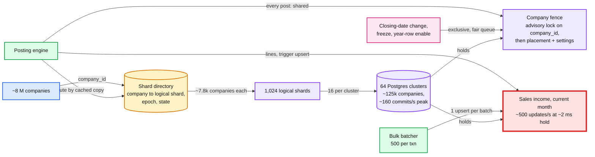
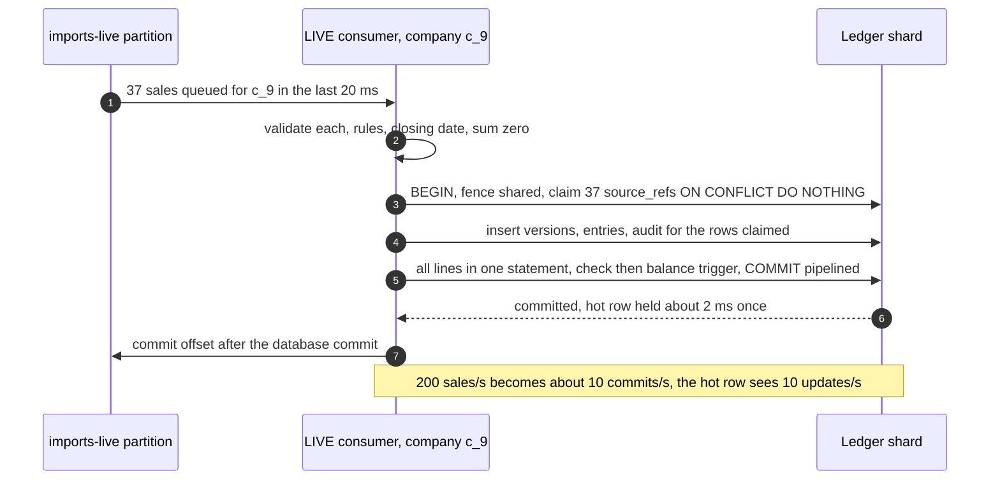

# Deep dive: tenant sharding and hot tenants

> One-line answer: each company lives on one of 1,024 logical shards spread over 64 Postgres clusters, found through a directory with epochs and fenced by a per-company placement row, so it can move alone with a ~1 to 3 s write pause. The biggest tenant is only ~3% of its cluster. What breaks first is one balance row, which serializes at 1 ÷ (lock hold time): ~500 updates/s, because the design writes the balance rows last as one statement with `COMMIT` pipelined behind it (a first draft with six separate upserts held the row ~4 to 6 ms, ~250/s). Batching protects that row from bulk paths, and the company fence is a fair advisory lock, because a `FOR KEY SHARE` row lock let a busy company's posts starve the closing-date change and the shard freeze (simulated below). Ids are time-ordered 64-bit values that no shard owns, so a move never collides.

Zoom-in on [`../solution.md`](../solution.md) §2 (the hottest row), §5.3 (hot spot), §5.5 (shard moves) and §10.1 (advisory locks, triggers). Reusable blocks: [`../../../concepts/sharding.md`](../../../concepts/sharding.md), [`../../../concepts/leases-fencing-clocks.md`](../../../concepts/leases-fencing-clocks.md), [`../../../concepts/mvcc-and-isolation.md`](../../../concepts/mvcc-and-isolation.md), [`../../../concepts/rate-limiting-and-load-shedding.md`](../../../concepts/rate-limiting-and-load-shedding.md). Siblings: [`posting-engine-and-balance-invariant.md`](posting-engine-and-balance-invariant.md), [`audit-trail-and-continuous-verification.md`](audit-trail-and-continuous-verification.md).

---

## 1. The map, and the one red row



## 2. Size the tenant, then size the row

| Thing | Number | Its limit | Share |
|---|---|---|---|
| Median company | ~600 transactions/month, ~20/day | | |
| Largest company, live | 0.39/s average, ~4/s at a 10x burst | one balance row, ~500/s | 0.08% to 0.8% |
| Public API, one company | 500 requests/min ≈ 8/s ([Intuit developer help](https://help.developer.intuit.com/s/article/API-call-limits-and-throttling)) | ~500/s | ~1.6% |
| Largest company, storage | ~300 GB after 10 years | ~9 TB per cluster | ~3% |
| One cluster | ~125k companies, ~160 commits/s, ~2.2k row writes/s at peak | tens of thousands of row writes/s | under 10% |
| A first-party live stream (a point-of-sale app posting each sale) | 100 to 250/s on one account [estimate] | ~500/s | 20% to 50% |

- **The tenant is never the problem.** It fits in 3% of a cluster. Directory placement gives it a cluster of its own if it passes ~10% (solution §5.3).
- **The row is.** Every sale credits the same `(company, Sales income, month)` row and the same day row. A row lock is FIFO, so the row is a single-server queue whose service time is the lock hold.
- **The public API cannot reach the cliff** (8/s). First-party paths are not throttled by it, so they can.

## 3. Anatomy of the lock hold

The hold starts when the balance upsert locks the row and ends when the transaction releases its locks, which Postgres does **after** the synchronous standby has acknowledged: "we have marked clog, but still show as running in the procarray and continue to hold locks" while it waits ([`xact.c`, REL_17_STABLE](https://raw.githubusercontent.com/postgres/postgres/REL_17_STABLE/src/backend/access/transam/xact.c), ~line 1542).

| Inside the hold | First draft (rejected) | The design (solution §2, §10.1) |
|---|---|---|
| Balance writes | 6 upserts, one round trip each (~0.5 ms to an engine pod in another AZ, availability zone [estimate]) | The lines go in as one statement; a statement-level trigger turns them into **one** sorted multi-row upsert |
| Writes after the balances | Idempotency response, audit event, `TXN` header | None: they are written first. The ids are minted up front, so the response is known |
| Entry balance check | Deferred constraint trigger at `COMMIT`: ~2,500 calls for a bulk batch, ~50 ms [estimate] with the row locked | `WHEN (NEW.line_no = 1)`, set `IMMEDIATE` before the lines statement: it runs at the end of that statement, before the balance trigger takes any row lock |
| `COMMIT` | Its own round trip, then WAL (write-ahead log) flush to 1 of 2 sync standbys | Pipelined behind the lines statement, then the flush (~1 to 2 ms cross-AZ [estimate]) |
| **Hold** | **~4 to 6 ms: ~250/s** | **~2 ms: ~500/s** |

The ordering of the two triggers is Postgres behaviour, not luck: "row-level AFTER triggers fire at the end of the statement (but before any statement-level AFTER triggers)" ([trigger behaviour](https://www.postgresql.org/docs/current/trigger-definition.html)). One multi-row upsert also forces netting: `ON CONFLICT DO UPDATE` may not "affect any single existing row more than once" ([INSERT](https://www.postgresql.org/docs/current/sql-insert.html)), which the trigger satisfies by grouping per key.

## 4. The simulation that set the hold and the fence

Each post takes the company fence at `BEGIN` and holds it to `COMMIT`; ~3 ms later it queues FIFO on the hot balance row, gives up after `lock_timeout` 200 ms, and holds the row for the hold time. A closing-date change or a shard freeze then wants the fence exclusively. As a `FOR KEY SHARE` row lock it gets in only when **no** post holds it (§5); as an advisory lock it waits only for posts that started before it.

```python
# One company's hot balance row (FIFO row lock, lock_timeout 200 ms) and its
# company fence, held from BEGIN to COMMIT by every post: as a FOR KEY SHARE row
# lock (first draft) or as a fair advisory lock (the design).
import random, bisect
random.seed(7)
PRE, TIMEOUT, SIM = 0.003, 0.200, 60.0   # 3 ms before the first upsert, 200 ms, 60 s

def run(rate, hold):
    t, free, waits, aborts, iv = 0.0, 0.0, [], 0, []
    while True:
        t += random.expovariate(rate)
        if t > SIM: break
        ready = t + PRE
        if free - ready > TIMEOUT:            # would wait past lock_timeout
            aborts += 1; iv.append((t, ready + TIMEOUT)); continue
        start = max(ready, free)
        free = start + hold * 0.75 + random.expovariate(1 / (hold * 0.25))
        waits.append(start - ready); iv.append((t, free))
    return waits, aborts, iv

def union(iv):                                # merged busy periods of the share lock
    segs = []
    for b, e in sorted(iv):
        if segs and b <= segs[-1][1]: segs[-1][1] = max(segs[-1][1], e)
        else: segs.append([b, e])
    return segs

def close_wait(iv, fair):
    segs, starts = union(iv), None
    starts = [s[0] for s in segs]
    out = []
    for _ in range(2000):
        t0 = random.uniform(1, SIM - 1)
        if fair:   # advisory lock: wait only for posts that began before t0
            out.append(max([e - t0 for b, e in iv if b < t0 < e], default=0.0))
        else:      # row lock: KeyShare lockers never queue, need zero holders
            i = bisect.bisect_right(starts, t0) - 1
            out.append(max(0.0, segs[i][1] - t0) if i >= 0 else 0.0)
    out.sort(); return out[len(out) // 2], out[int(len(out) * .99)]

def multixacts(iv):
    ev = sorted([(b, 1) for b, e in iv] + [(e, -1) for b, e in iv])
    live = mx = members = 0
    for _, d in ev:
        if d == 1 and live >= 1: mx += 1; members += live + 1
        live += d
    return mx / SIM, members / SIM

print("hold  rate/s  util  wait p50/p99 ms  timeouts  multixact/s  members/s  "
      "close p50/p99 ms row-lock | advisory")
for hold in (0.004, 0.002):
    for rate in (4, 100, 200, 230, 245, 260):
        w, ab, iv = run(rate, hold)
        w.sort(); p = lambda q: 1000 * w[int(len(w) * q)]
        mx, mem = multixacts(iv)
        r50, r99 = close_wait(iv, False); a50, a99 = close_wait(iv, True)
        print(f"{hold*1000:.0f} ms {rate:6d} {rate*hold:5.2f} {p(.5):7.1f} /{p(.99):6.1f}"
              f" {100*ab/(len(w)+ab):8.2f}% {mx:10.0f} {mem:10.0f}"
              f"   {1000*r50:8.0f} /{1000*r99:8.0f} | {1000*a50:4.0f} /{1000*a99:4.0f}")
```

Real output (Python 3, seed 7):

```
hold  rate/s  util  wait p50/p99 ms  timeouts  multixact/s  members/s  close p50/p99 ms row-lock | advisory
4 ms      4  0.02     0.0 /   3.0     0.00%          0          0          0 /       4 |    0 /   5
4 ms    100  0.40     0.0 /  12.5     0.00%         57        144          2 /      43 |    1 /  16
4 ms    200  0.80     5.2 /  50.2     0.00%        178        807         24 /     589 |    8 /  55
4 ms    230  0.92    14.8 / 101.8     0.00%        219       1776        121 /    1852 |   18 / 106
4 ms    245  0.98    68.0 / 194.2     0.29%        245       5102       2062 /   12679 |   73 / 196
4 ms    260  1.04   166.3 / 199.5     3.81%        260      11226      29893 /   58405 |  171 / 205
2 ms      4  0.01     0.0 /   0.0     0.00%          0          0          0 /       2 |    0 /   2
2 ms    100  0.20     0.0 /   3.1     0.00%         40         91          0 /      13 |    0 /   6
2 ms    200  0.40     0.0 /   5.2     0.00%        132        353          2 /      31 |    2 /   8
2 ms    230  0.46     0.0 /   6.7     0.00%        169        488          4 /      39 |    3 /  10
2 ms    245  0.49     0.0 /   7.0     0.00%        185        542          4 /      38 |    3 /  10
2 ms    260  0.52     0.1 /   7.6     0.00%        198        598          5 /      46 |    3 /  10
```

What it decided:
- **The 4 ms hold had a narrow cliff.** p99 wait 50 ms at 200/s, ~100 ms at 230/s (a third of the 300 ms post budget), 0.29% `lock_timeout` failures at 245/s, 3.8% at 260/s.
- **At ~2 ms, 260/s has a p99 wait under 8 ms.** Hence the statement order in §3: the cheapest fix there is.
- **The row-lock fence was a hidden second hot row.** Close or freeze wait p99 1.85 s at 230/s and 12.7 s at 245/s, past the mover's 10 s freeze timeout; median 30 s at 260/s. The company that most needs a move could not move.
- **The advisory fence is bounded by `lock_timeout`:** p99 196 to 205 ms at every rate, because a post holds it at most ~3 ms + 200 ms + hold.
- **MultiXact churn avoided:** the row-lock fence created 178 MultiXacts/s with 807 member entries/s at 200/s for one company, ~70 M member entries a day.

## 5. Why the fence is an advisory lock

- **Share lockers do not queue.** "`FOR KEY SHARE` conflicts with `FOR UPDATE` only" ([explicit locking](https://www.postgresql.org/docs/current/explicit-locking.html), Table 13.3). In `heap_lock_tuple`, a key-share request on a tuple that is only locked sets `require_sleep = false`: "If we're requesting KeyShare, and there's no update present, we don't need to wait" ([`heapam.c`](https://raw.githubusercontent.com/postgres/postgres/REL_17_STABLE/src/backend/access/heap/heapam.c), ~line 4985 to 5051). It never looks at a waiting `FOR UPDATE`.
- **The waiter loops.** The `FOR UPDATE` request sleeps on the current lockers, re-reads `xmax` when they end, and goes back to the top (`goto l3`) if a new locker joined. It wins only at an instant with **zero** holders.
- **Busy periods grow exponentially.** With Poisson arrivals λ and hold T, a busy period lasts on average (e^(λT) − 1) ÷ λ. T includes the hot-row queue, so the two rows were coupled.
- **Every share lock was also a write.** A row lock is recorded in the tuple header (a WAL record and a dirty page per post), and two concurrent lockers need a MultiXact, "used to support row locking by multiple transactions" ([routine vacuuming](https://www.postgresql.org/docs/current/routine-vacuuming.html)).
- **The advisory lock is fair and writes nothing.** Posts call `pg_advisory_xact_lock_shared(k)`; the close, the freeze and year-row enablement call `pg_advisory_xact_lock(k)`, with `k` derived from `company_id` ([admin functions](https://www.postgresql.org/docs/current/functions-admin.html)). The heavyweight lock manager queues a new request behind any conflicting waiter: "If lock requested conflicts with locks requested by waiters, must join wait queue" ([`lock.c`](https://raw.githubusercontent.com/postgres/postgres/REL_17_STABLE/src/backend/storage/lmgr/lock.c), line 1036). Posts then read placement and settings with a plain `SELECT`, whose `READ COMMITTED` snapshot is taken after the lock is granted, so they see the new closing date or `FROZEN`.

## 6. A first-party live stream: what is built, what is next

| Step | What it buys | Cost | Status |
|---|---|---|---|
| 1. Hold to ~2 ms (§3) | Row ceiling ~250/s to ~500/s | Statement order, pipelined commit | In the design |
| 2. Advisory fence (§5) | No starved close or freeze, no MultiXacts | Data-layer code | In the design |
| 3. Group commit in the LIVE lane | Up to 50 items or 20 ms per transaction for a company with a backlog; 200/s becomes ~10 commits/s | The `imports-live` consumer already owns one company's partition in order. A bad item fails the batch, which is retried without it | **Decision:** add when any company passes ~50/s live |
| 4. High-rate first-party producers post through the LIVE lane | A point-of-sale app's sales carry their own ids as `source_ref`, so they can be batched | Seconds of delay on the books, not on the sale | Product decision |
| 5. Sub-bucketed balance rows | Removes the single-row ceiling for one account | Every as-of read of that account × 16; every consumer learns the split | The design's seam, only for a synchronous path over ~100/s after 3 and 4 |



## 7. Moving a company

The seven steps are in solution §5.5: copy at LSN L0, catch up with `session_replication_role = replica` (so the balance trigger stays silent and balance rows arrive as copied values), freeze under the exclusive fence, drain, compare and run a targeted recompute, flip the directory, unfreeze. What makes it safe:

- **The fence is fair.** The freeze waits only for posts already in flight (§4: p99 ~200 ms), so the hottest company can move. Pause its bulk job first anyway.
- **Ids no shard owns.** `txn_id`, `entry_id`, `event_id` are time-ordered 64-bit ids (timestamp, generator id, counter) minted by the engine. A per-shard sequence would hand the company ids from the target's sequence, which can collide with ids it already has or run backwards.
- **Mover writes are recomputed, not trusted.** They carry a replication origin and are skipped by the per-transaction verifier only inside the `(origin, company, move window)` allowlist the mover registers; the targeted recompute runs before the flip ([`audit-trail-and-continuous-verification.md`](audit-trail-and-continuous-verification.md) §5).
- **Replica mode is a privilege.** `session_replication_role` can be set only by "superusers and users with the appropriate SET privilege" ([client defaults](https://www.postgresql.org/docs/current/runtime-config-client.html)). **Decision:** grant that SET privilege to the mover's role only; replica mode also silences foreign-key triggers.
- **Copy time.** The largest company's ~300 GB at ~100 MB/s is ~50 minutes, posts flowing. A logical shard (~9 TB ÷ 16 ≈ 560 GB at year 10) is ~1.5 hours.
- **Abort is always safe before the flip**: drop the target copy. After the flip, rollback is a move back.

## 8. Noisy neighbours inside a cluster

- **Bulk:** admission at 1k transactions/s per company and 3k/s per cluster, backing off when interactive post p99 passes 150 ms (solution §5.3).
- **Heavy reads:** the planner sends GL (general ledger) exports over ~100k lines to a standby and over ~5 M to an export job.
- **Connections:** **Decision:** a per-company cap on concurrent transactions in the engine (e.g. 8 [estimate]), so a client stuck in a retry loop cannot take a cluster's pool.
- **Long snapshots:** a snapshot on a standby with `hot_standby_feedback` holds back vacuum on the primary for **every** company in the cluster. Reports are capped at 2 s on the primary; the verifier chunks its recompute per month.

## 9. What an interviewer pushes on

1. **"Your hot row does 500/s. A POS customer does 600 sales/s."** Group commit in the LIVE lane gives ~30 commits/s. Buckets only if a synchronous path remains.
2. **"Why not shard the company?"** Every post becomes a distributed transaction for 0.0002% of companies. Splitting one row is local; splitting the tenant is global.
3. **"Why not `FOR KEY SHARE` on the settings row? It cannot block posts."** It cannot block posts. It can starve the one exclusive locker, the close, and it writes the tuple on every post.
4. **"Why a lock and not a version check?"** The close must wait for in-flight posts anyway, or a post commits into a period that closed under it. The fair lock is that wait.
5. **"Which company do you move?"** One above ~10% of its cluster's writes or storage, or a row whose lock-wait p99 passes 50 ms for an hour.
6. **"A hot logical shard?"** Move companies out one by one; the directory row is per company.

## 10. Trade-offs

| Decision | Option A | Option B | Chose | Why |
|---|---|---|---|---|
| Statement shape | One statement per balance key, writes after it | Lines last, one trigger upsert, commit pipelined | One upsert | Hold ~4 to 6 ms becomes ~2 ms; ~250/s becomes ~500/s |
| Company fence | `FOR KEY SHARE` on settings and placement | Transaction-level advisory lock | Advisory | Fair queue (close p99 ~200 ms, not 12.7 s), no tuple write per post |
| Hot-row protection, live | Sub-buckets per account | Short hold, then group commit | Short hold (+ group commit next) | 2x now and ~20x next without changing any reader |
| Ids | Per-shard sequence | Time-ordered 64-bit ids | Time-ordered | Moves and failovers can never reissue or reorder ids |
| Biggest tenant | Its own cluster from day one | Directory move past ~10% | Move on demand | It is ~3% today |

## 11. Numbers to say out loud

- 1,024 logical shards, 64 clusters, ~125k companies and ~160 commits/s per cluster at peak.
- Largest company: ~3% of its cluster, 0.39/s live, 500 requests/min through the public API.
- Hot row: ~500/s at ~2 ms hold (it was ~250/s at 4 ms: p99 50 ms at 200/s, timeouts from 245/s).
- Fence: advisory, close or freeze p99 ~200 ms at any rate (the row lock gave 12.7 s at 245/s).
- Move: ~1 to 3 s write pause, ~50 minutes to copy the largest company.
