# Diagrams: QuickBooks multi-tenant ledger

> One-line answer: twelve views of one design. A posting engine turns each business transaction into a balanced journal entry and writes it, its insert-only lines and its per-month and per-day balance deltas (made from the lines by a statement-level trigger) in one transaction on the company's shard; a manual post is acknowledged once the cross-region replica has flushed it. Reports are prefix sums over those delta rows on the shard primary. A bulk lane batches imports so a huge tenant's hot balance row is touched once per batch. A verifier, a shard mover and a CDC copy in a columnar store sit beside the write path, never on it. The ledger shard primary, with its hot balance row, is the one red box.

The D1 to D12 set from `hld/CLAUDE.md` §4, each with a one-line caption. A diagram already in [`solution.md`](solution.md) gets a heading, a caption and a link, never a second copy. Acronyms: CDC (change data capture), GL (general ledger), P&L (profit and loss), AR (accounts receivable), AP (accounts payable), FX (foreign exchange), AZ (availability zone), LSN (log sequence number), WAL (write-ahead log), OAuth (open authorization), KMS (key management service), WORM (write once, read many), ETL (extract, transform, load).

| # | Diagram | Where it lives |
|---|---|---|
| D1 | Context | below |
| D2 | Data flow | below |
| D3 | Component architecture (final design) | [solution §6](solution.md#6-final-design-and-the-six-core-flows) |
| D4 | Happy path per FR | FR1 post: [solution §4.1](solution.md#41-post-a-business-transaction-as-one-balanced-journal-entry). FR2 edit: [solution §4.2](solution.md#42-keep-history-immutable-edits-and-voids-post-reversals). FR3 closed period: [solution §4.3](solution.md#43-respect-closed-periods). FR4 report: [solution §4.4](solution.md#44-report-fast-over-the-whole-history). Bulk import and a foreign-currency invoice: below |
| D5 | Failure paths | Duplicate post, stale edit, batcher crash, close racing a post: below. Primary failover: [solution §10.4](solution.md#104-failure-timeline). Shard move: [solution §5.5](solution.md#55-a-shard-dies-or-a-company-must-move-how-do-you-keep-9995-and-move-it-with-zero-downtime) |
| D6 | Decision flow | Posting engine validation and the as-of read plan: below. Report planner: [solution §5.2](solution.md#52-balance-sheet-as-of-any-date-in-10-years-under-1-s-and-it-shows-the-post-i-just-made) |
| D7 | Entity relationship | [solution §3.3](solution.md#33-data-model) |
| D8 | State machines | Business transaction, accounting period, import item, company placement: below |
| D9 | Deployment / topology | below |
| D10 | Scaling / partitioning | Shard map: below. Hot row zoom-in: [solution §5.3](solution.md#53-one-company-syncs-1-m-shopify-orders-a-month-into-the-same-two-accounts-where-is-the-hot-spot) |
| D11 | Failure mode map | below, two trees |
| D12 | Rollout / migration | below |

## D1. Context (zoom-out)

Our system as one box: people and apps write business transactions, Intuit products and third parties feed it, accountants and auditors read it.

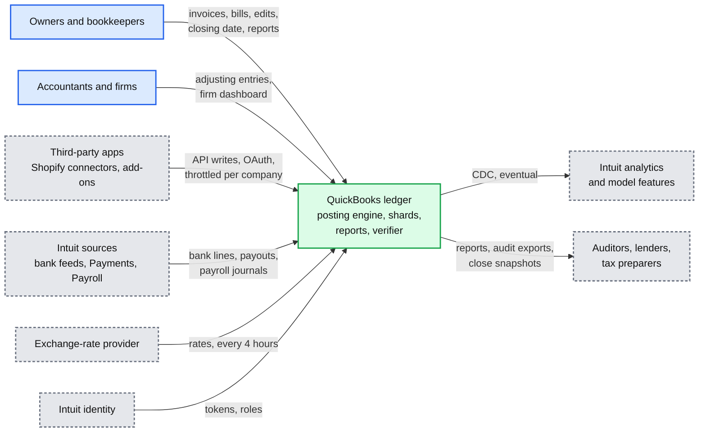

## D2. Data flow (DFD)

Inputs to outputs with format, size and rate. Processes are rounded, stores are cylinders. Numbers from solution §2.

```mermaid
%% D2: data flow. Rates are fleet-wide unless marked per cluster. Estimates as in solution section 2.
flowchart LR
    APP[Apps and API clients]:::client -->|"post or edit, JSON ~2 KB,<br/>~900/s avg, ~10k/s peak"| PE(Posting engine):::service
    SRC[Feeds and bulk files]:::external -->|"bank lines and orders, JSON ~1 KB,<br/>bulk 1k/s per company max"| IMP(Import service<br/>and batcher):::service
    IMP -->|"one post, or 500 per txn"| PE
    PE -->|"~14 row writes per txn, ~2 KB stored,<br/>~160 commits/s per cluster peak"| DB[(Ledger shards<br/>58 TB/year primary)]:::store
    DB -->|"balance rows ~80 B, ~3k per report,<br/>~2.5k reports/s peak"| RS(Report service):::service
    RS -->|"report JSON ~10 to 50 KB"| APP
    DB -->|"row changes ~300 B,<br/>~13k/s avg, ~140k/s peak"| K[[Kafka CDC<br/>~4 MB/s avg]]:::queue
    K -->|"lines and balances,<br/>~2.5 TB/year compressed"| OL[(Columnar store)]:::store
    K -->|"each committed txn"| VER(Verifier):::service
    VER -->|"one root per company-day,<br/>~4 M/day × 32 B"| ARC[(WORM archive)]:::store
    K -->|"audit events ~200 B"| ARC
    classDef client   fill:#dbeafe,stroke:#2563eb,stroke-width:2px,color:#111
    classDef service  fill:#dcfce7,stroke:#16a34a,stroke-width:2px,color:#111
    classDef store    fill:#ede9fe,stroke:#7c3aed,stroke-width:2px,color:#111
    classDef queue    fill:#cffafe,stroke:#0891b2,stroke-width:2px,color:#111
    classDef external fill:#e5e7eb,stroke:#6b7280,stroke-width:2px,color:#111,stroke-dasharray:4 3
```

## D3. Component architecture

The final design, 14 nodes, the ledger shard primary in red: [solution §6](solution.md#6-final-design-and-the-six-core-flows).

## D4. Happy paths

The four FR flows are in solution §4.1 to §4.4 (links in the table above). Two more flows that the FR walkthroughs do not cover:

### D4e. A bulk import batch of 500 orders

One batch of a 12 M-order migration. The hot balance rows are touched once, at the end.

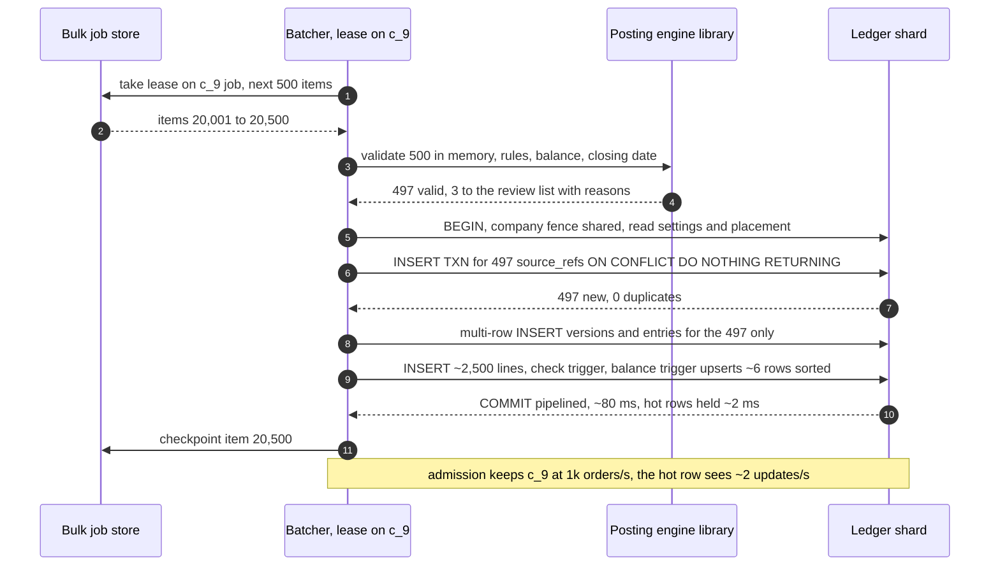

### D4f. A euro invoice, then its payment at a new rate

Home currency USD. The engine owns the rounding cent and the realized gain.

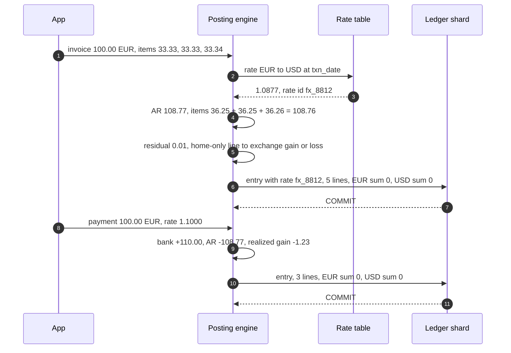

## D5. Failure paths

### D5a. The client retries a post whose commit landed

The response was lost after the commit. The retry returns the stored answer; no second invoice.

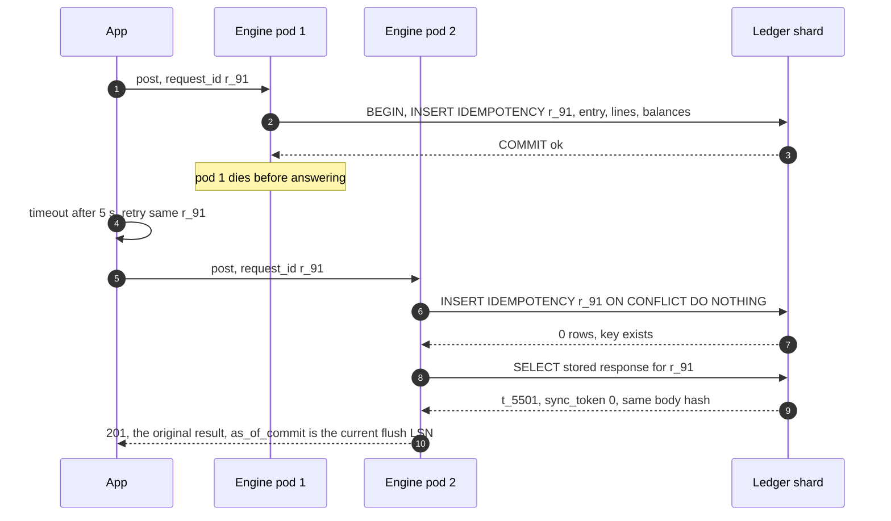

### D5b. Two apps edit the same invoice

A sync app holds an old copy. The second writer gets a conflict instead of silently erasing the first edit.

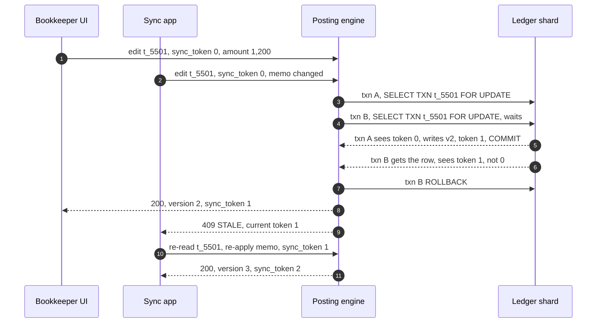

### D5c. The batcher dies between the batch commit and its checkpoint

The batch committed; the checkpoint did not. The next lease holder replays the batch, and the claim makes it a no-op.

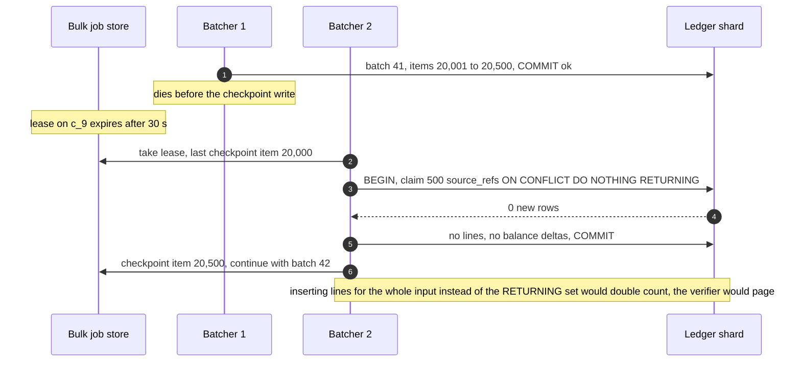

### D5d. The closing date is set while a post is in flight

The close waits for the post, and a post that arrives during the close queues behind it, so no post can land in a period after it was closed. The fence is an advisory lock on the company: shared for posts, exclusive for the close.

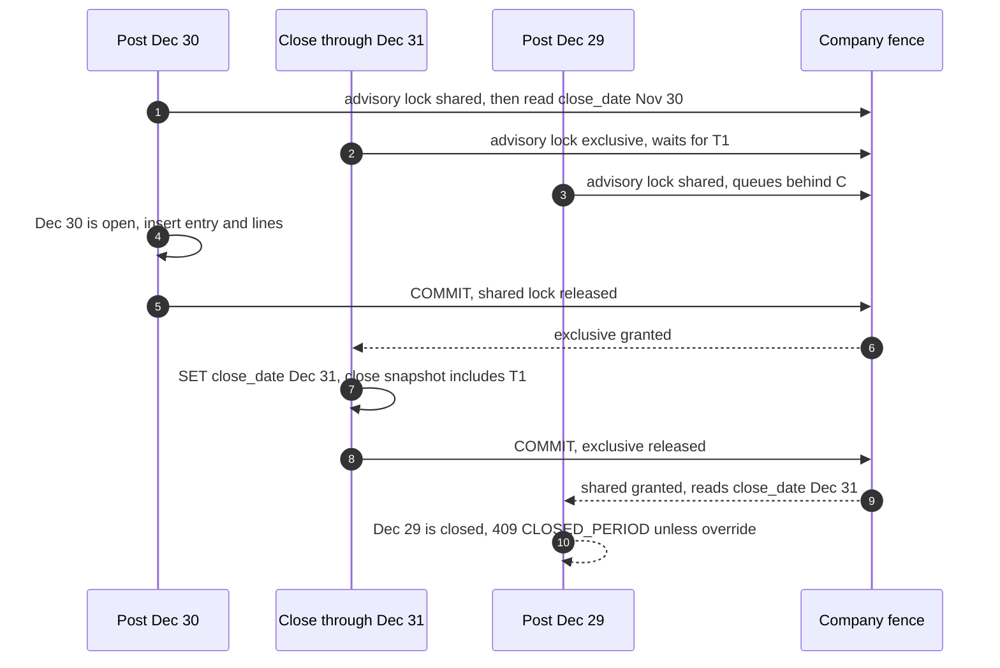

## D6. Activity / decision flow

### D6a. Posting engine: from request to commit

The branching inside the hardest component. Pink diamonds are decisions.

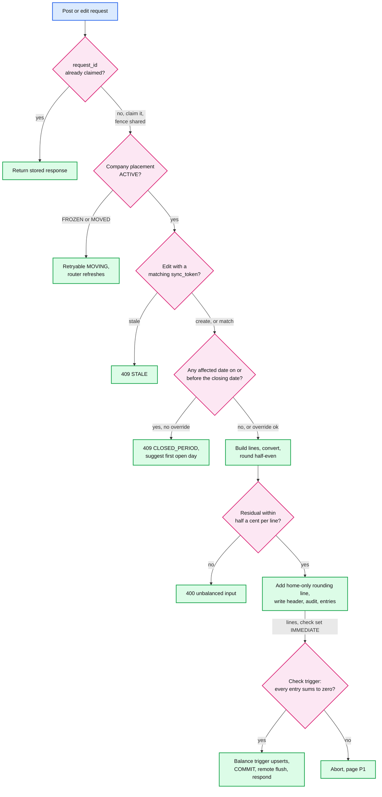

### D6b. Which rows a balance sheet as of a date reads

How "as of June 15, 2019, fiscal year from January" decomposes. Every box is a range scan of delta rows; none of them grows with the company's volume.

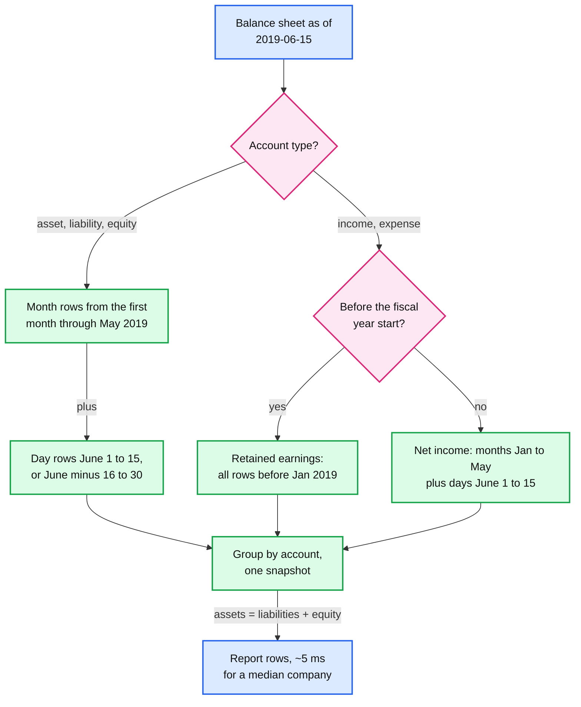

## D7. Entity relationship

In [solution §3.3](solution.md#33-data-model), with the access patterns and the partition key (`company_id`, first column of every primary key).

## D8. State machines

### D8a. Business transaction

A transaction moves through versions; its lines never change. "Locked" is not stored: it is derived from the closing date.

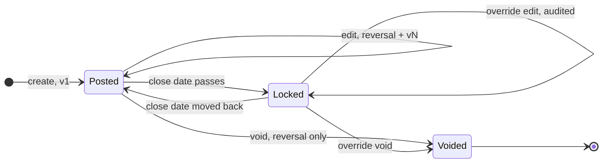

### D8b. Accounting period

What the closing date does to a month. Overrides do not reopen the period; they leave an audited exception.

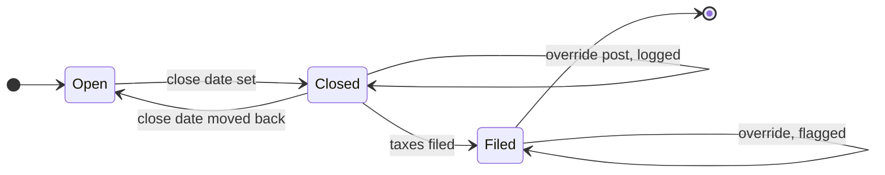

### D8c. Import item

A bank line or an order from arrival to the ledger.

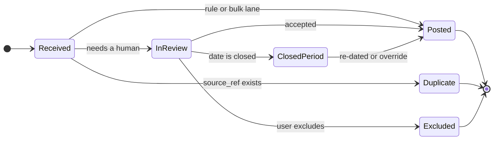

### D8d. Company placement during a shard move

The fence that makes a move safe. Only `Frozen` blocks writes, for ~1 to 3 s.

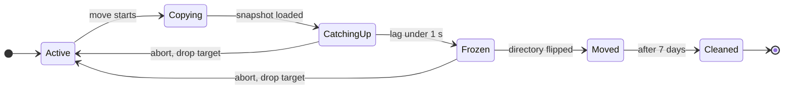

## D9. Deployment / topology

Where each piece runs. Synchronous replication stays inside the region. The cross-region replica is streamed asynchronously, but a manual or API post is acknowledged only after it has flushed, a wait that happens after `COMMIT`, outside every lock. Kafka and a CDC connector run in both regions; after a promotion, CDC resumes from region B on a new timeline.

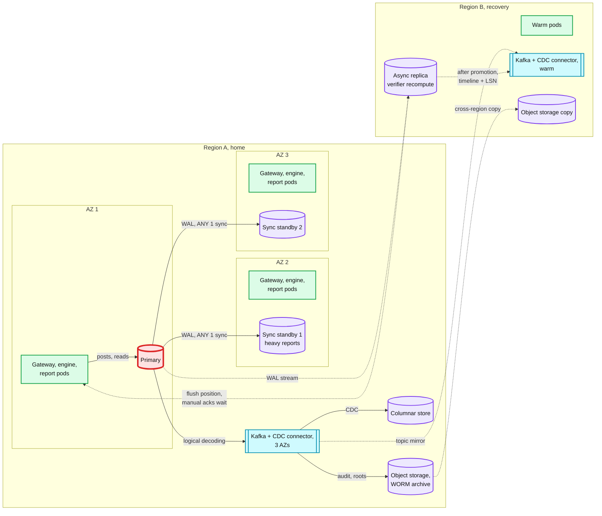

## D10. Scaling / partitioning

Directory placement: companies map to 1,024 logical shards, logical shards to 64 clusters. The biggest company is small as a tenant; its hot row is the red part. Zoom-in on the row and the batcher: [solution §5.3](solution.md#53-one-company-syncs-1-m-shopify-orders-a-month-into-the-same-two-accounts-where-is-the-hot-spot).

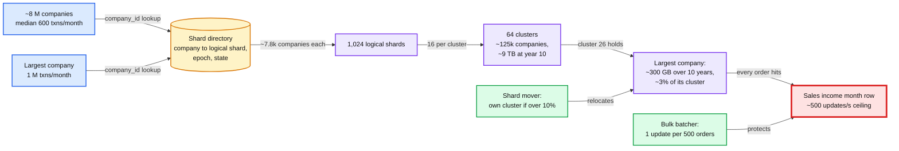

## D11. Failure mode map

### D11a. The write path

Component, what fails, blast radius, mitigation. The shard primary is red: it is the one stateful dependency every post needs.

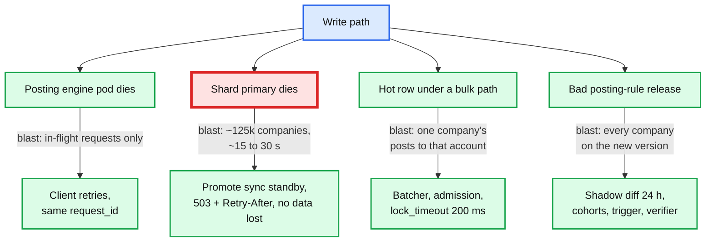

### D11b. Read, async and control paths

None of these can stop a post. They make data stale, slow or unverified, and each says so.

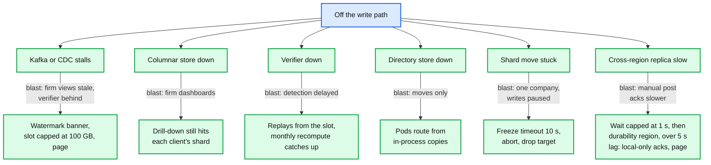

## D12. Rollout / migration

From an existing ledger whose reports scan lines (or read nightly snapshot tables) and whose edits update lines in place. Lines stay the source of truth throughout, so every rollback is "stop using the new derived thing".

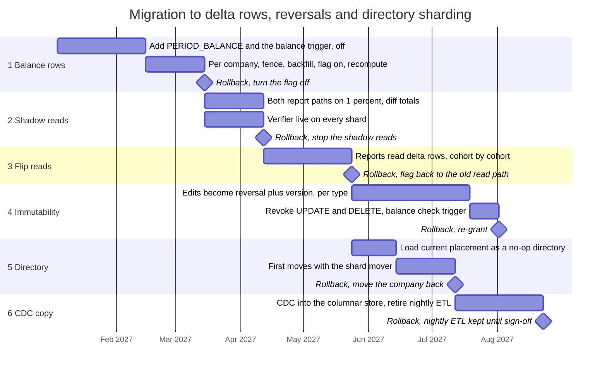
