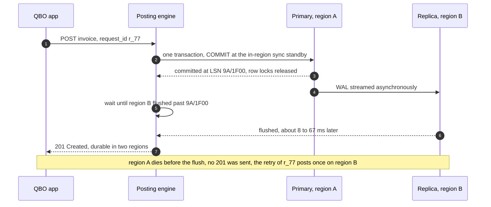
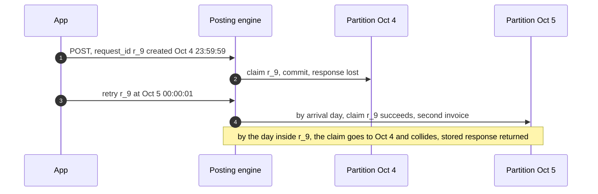
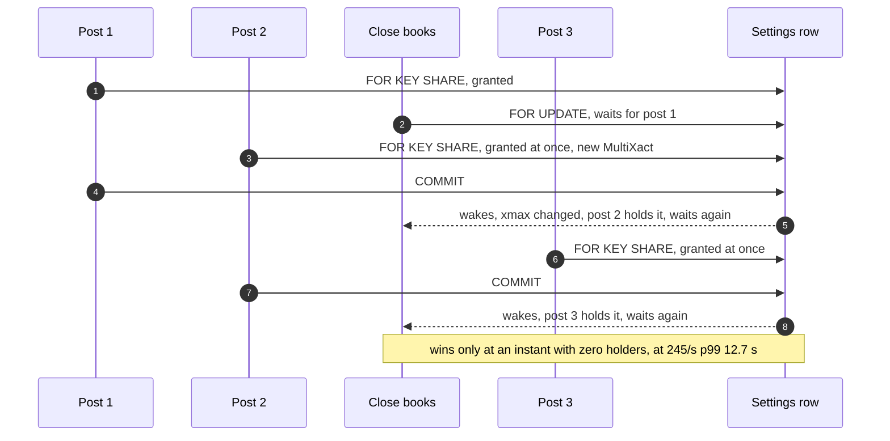

# Edge cases: QuickBooks multi-tenant ledger

Every entry answerable in under 60 seconds out loud. Categories: failure, consistency, scale, data, operations, security / abuse. Design reference: [`solution.md`](solution.md); zoom-ins in [`deep-dives/`](deep-dives/). An answer bullet that starts with **Decision:** goes past what solution.md states. Simulated numbers come from the runnable Python in the deep dives; several of them are why the design looks the way it does. Acronyms: AR (accounts receivable), AZ (availability zone), CDC (change data capture), FX (foreign exchange), GL (general ledger), LSN (log sequence number), P&L (profit and loss), RE (retained earnings), RLS (row-level security), RPO (recovery point objective), RTO (recovery time objective), WAL (write-ahead log).

---

## Failure
## Edge case: a shard primary dies at month-start peak
- **Trigger:** the primary of cluster 26 dies at ~160 commits/s. The cluster holds ~125k companies (1/64 of all).
- **Symptom:** those companies get `503` with `Retry-After` for ~15 to 30 s. One failover page.
- **Answer:**
  - `ANY 1` of two synchronous standbys in the other AZs had flushed every acknowledged commit, so nothing committed is lost. A standby is promoted in ~15 to 30 s.
  - Clients retry with the same `request_id`. The claim replicated with the post, so a post that committed returns its stored response; one that did not commits once.
  - Reports fall back to a standby with a "may be a few seconds behind" banner; bulk jobs pause. The 99.95% budget (21.9 min/month) covers ~44 such failovers.
  - **Decision:** the engine sets a client deadline and a 1 s connect timeout. `lock_timeout` and `statement_timeout` are enforced by the server, so a dead host never fires them.
- **Confidence:** [ ] shaky  [ ] ok  [ ] confident

## Edge case: the home region is lost
- **Trigger:** the region goes dark. The cross-region replica streams WAL asynchronously; RTO ~15 min.
- **Symptom:** a first draft acknowledged every post at the local commit. Simulated at one cluster's peak, that loses p50 31 and p99 186 acknowledged posts per cluster, ~2,000 per region, some of them invoices already emailed. That is why the design changed.
- **Answer:**
  - Manual and API posts are acknowledged only after the remote replica has flushed the commit: the response is held, the locks are not. +8 ms to a nearby region, +67 ms cross-country (Azure p50). RPO 0 for typed entries (README Durability row).
  - Imports are acknowledged locally; after promotion each source re-sends from its watermark minus a margin, and `source_ref` makes the overlap a no-op.
  - Never put the other region inside `COMMIT`: Postgres holds row locks through the synchronous wait, so the hot row would fall from ~500/s to ~100/s (8 ms) or ~14/s (67 ms).
  - Salvage when the old region returns is a `posted_at` query on its isolated primary, re-posted after the user confirms.
- **Diagram:**

- **Confidence:** [ ] shaky  [ ] ok  [ ] confident

## Edge case: the remote replica lags between half a second and 5 seconds
- **Trigger:** a long vacuum, a network brown-out or a WAL burst slows the cross-region replica without breaking it.
- **Symptom:** every manual post waits that long for the remote flush. The design pages and degrades to local-only acknowledgement only past 5 s, so the 300 ms post p99 burns first.
- **Answer:**
  - Past 5 s the cluster acks locally and pages; an acknowledged post can then be lost only if the region also dies in that window.
  - **Decision:** a per-request cap of ~1 s. Past it, answer 201 with `durability: region` and log the `request_id` for a re-drive check after any failover.
  - **Decision:** a per-cluster watcher polls `pg_stat_replication.flush_lsn` every ~2 ms [estimate] and pushes it to engine pods; Postgres has no "wait for this standby" call outside synchronous commit.
- **Confidence:** [ ] shaky  [ ] ok  [ ] confident

## Edge case: after a cross-region promotion, ids and CDC positions restart
- **Trigger:** the promoted replica lacks the last WAL. A per-shard sequence pre-logs 32 values, so it would hand out ids clients already have; its LSNs start below positions CDC already shipped.
- **Symptom:** in the first-draft simulation p50 16 lost ids were reissued: a client editing `t_5501` with `sync_token 0` reached a different invoice with token 0. The columnar copy could keep phantom rows.
- **Answer:**
  - Ids are time-ordered 64-bit values (timestamp, generator id, counter) minted by the engine, never sequences, so nothing is reissued.
  - CDC events carry `(timeline, LSN)`; the columnar merge orders by both.
  - **Decision:** drop old-timeline events past the promotion point and re-snapshot the companies they touched (hours, dashboards say "rebuilding").
- **Confidence:** [ ] shaky  [ ] ok  [ ] confident

## Edge case: Kafka is down for 30 minutes
- **Trigger:** the cluster carrying `imports-live` and the CDC topics is unavailable.
- **Symptom:** accepted bank lines and webhook orders stop posting; the columnar copy and the verifier fall behind.
- **Answer:**
  - Posts through the API never touch Kafka and continue. Bank items wait in the review list; sources keep their records.
  - The CDC slot holds WAL on the primary, capped by `max_slot_wal_keep_size` ~100 GB, paged at 50 GB. Past the cap the slot is dropped and that shard's copy re-snapshotted.
  - On recovery, consumers commit offsets only after the database commit, and `source_ref` dedups the replay.
- **Confidence:** [ ] shaky  [ ] ok  [ ] confident

## Edge case: both synchronous standbys are slow, not down
- **Trigger:** a storage incident makes WAL flush on both standby candidates take ~50 ms.
- **Symptom:** every commit takes ~50 ms more, and so does every hot-row hold: the hottest row drops from ~500/s to ~19/s. Post p99 pages before anything is down.
- **Answer:**
  - `ANY 1` of two hides one slow standby; it cannot hide two.
  - Admission backs bulk lanes off as interactive p99 passes 150 ms, so the hot rows see only live traffic.
  - **Decision:** a runbook step lets the on-call drop that cluster to local-only commit as a declared degraded mode (RPO above zero inside the region), logged and time-boxed. A person's choice, not automation.
- **Confidence:** [ ] shaky  [ ] ok  [ ] confident

## Edge case: an engine pod pauses for 2 s inside a transaction
- **Trigger:** a garbage-collection pause after the claim and fence, before the lines statement.
- **Symptom:** the pod holds the company fence shared and its claim. A close or freeze queued behind it waits; with the pipelined commit, no hot row is held across the pause.
- **Answer:**
  - Other posts are unaffected: the fence is shared. Hot rows are locked only inside the lines statement and its pipelined `COMMIT`, ~2 ms.
  - **Decision:** `idle_in_transaction_session_timeout` ~500 ms [estimate] on the posting role aborts the paused transaction and frees its locks; the retry with the same `request_id` posts once. `transaction_timeout` 5 s is the outer bound.
- **Confidence:** [ ] shaky  [ ] ok  [ ] confident

## Edge case: the shard directory store is down
- **Trigger:** the global directory database is unavailable for an hour.
- **Symptom:** nothing for existing companies; moves stop; a new sign-up has no placement.
- **Answer:**
  - Every engine and report pod routes from its in-process copy. Placement rows still fence a stale copy.
  - Moves pause; the freeze has a 10 s timeout and aborts safely.
  - **Decision:** a new company gets a default placement by hash of `company_id` onto a logical shard; the directory row is written when the store is back.
- **Confidence:** [ ] shaky  [ ] ok  [ ] confident

---

## Consistency
## Edge case: the client retries a post whose commit landed, sends it twice at once, or reuses the id
- **Trigger:** the response is lost after `COMMIT`; a double click reaches two pods; a buggy app reuses a `request_id` with a new body.
- **Symptom:** without a guard, two invoices and double revenue: ~78k duplicate postings a day at a 0.1% retry rate.
- **Answer:**
  - The first statement inserts `IDEMPOTENCY(company_id, request_id, request_day, request_hash, response)`; ids are minted up front so the response is known. A sequential retry collides and gets the stored response.
  - A concurrent copy blocks on the first one's uncommitted key, then collides; its wait counts against `lock_timeout`.
  - A different body under the same id: `422`. A `409` rolls the claim back, so only successes are replayed.
- **Confidence:** [ ] shaky  [ ] ok  [ ] confident

## Edge case: a retry crosses midnight
- **Trigger:** Postgres requires a unique key on a partitioned table to include "all of the partition key columns", and `IDEMPOTENCY` drops daily partitions.
- **Symptom:** partitioned by arrival day, a post at 23:59:59.900 that times out and retries at 00:00:01 would land in a new partition: two invoices.
- **Answer:**
  - The partition day is the day inside the UUIDv7 `request_id`, so every retry of one id maps to one partition (solution §3.3).
  - Ids more than 1 day ahead or 29 days old get `400`. Imports never depend on this table: `source_ref` is unique forever.
- **Diagram:**

- **Confidence:** [ ] shaky  [ ] ok  [ ] confident

## Edge case: two apps edit the same invoice with the same `SyncToken`
- **Trigger:** the bookkeeper and a sync app both read `sync_token 0` and save.
- **Symptom:** last writer wins and one change vanishes.
- **Answer:**
  - The engine takes the `TXN` header `FOR UPDATE` and compares the token. The first edit writes v2 and token 1; the second sees 1, rolls back, and gets `409 STALE, current token 1` (the demo in [`deep-dives/edits-reversals-and-closed-periods.md`](deep-dives/edits-reversals-and-closed-periods.md)).
  - A retry of the successful edit with the same `request_id` gets the stored v2 answer even though its token is now stale.
  - Edit versus void serializes the same way.
- **Confidence:** [ ] shaky  [ ] ok  [ ] confident

## Edge case: the books are closed while a post is in flight
- **Trigger:** the accountant sets the closing date to December 31 while a December 30 post is mid-transaction.
- **Symptom:** a check outside the transaction lets a post commit into a period that closed a millisecond earlier, with no override and no audit.
- **Answer:**
  - Posts hold the company fence (`pg_advisory_xact_lock_shared`) and read settings after it; the close takes it exclusively. They never interleave ([D5d](diagrams.md#d5d-the-closing-date-is-set-while-a-post-is-in-flight)).
  - The close waits only for posts already in flight; later posts queue behind it and read the new date.
  - The close records a snapshot, so any later override is a visible diff.
- **Confidence:** [ ] shaky  [ ] ok  [ ] confident

## Edge case: a report right after a post
- **Trigger:** the bookkeeper saves an invoice and opens the P&L.
- **Symptom:** on a lagging replica the invoice is missing: the worst support call.
- **Answer:**
  - Interactive reports read the shard primary (~0.4 core per cluster at peak), so read-your-writes is free.
  - Heavy reports go to a same-region standby only after its replay passes the post's `min_commit` LSN, waiting up to 200 ms, else the primary.
  - Cross-company views say "as of 10:42" and are eventual, under 5 minutes.
- **Confidence:** [ ] shaky  [ ] ok  [ ] confident

## Edge case: a payment is applied while the invoice is being edited
- **Trigger:** a $1,080 payment against t_5501 and an edit of t_5501 down to $500 commit at the same time.
- **Symptom:** a deadlock, or an open balance computed from the wrong version.
- **Answer:**
  - **Decision:** the payment post takes both headers `FOR UPDATE` in id order, as does the edit if it touches linked payments. Same global order, no deadlock.
  - The edit is never blocked by a payment: an invoice edited below what was paid leaves a customer credit, which is what accountants expect.
  - Both are ordinary versioned changes, each with a reversal and an audit event.
- **Confidence:** [ ] shaky  [ ] ok  [ ] confident

## Edge case: a GL export is paged while posts keep landing
- **Trigger:** a 40-page export of 2026 runs for a minute while new lines arrive.
- **Symptom:** a cursor with only `(last key, running balance)` would skip a backdated line before it and include one after it; the export would not tie to the balance sheet.
- **Answer:**
  - The cursor pins `posted_before = start − 5 s`; every page filters on it (solution §4.4).
  - `posted_at` is the transaction's start time, and `transaction_timeout` 5 s bounds how late such a line can commit, so the pin is exact.
  - **Decision:** set `transaction_timeout` on the posting role, not globally; the mover's copy and the monthly recompute run for minutes.
- **Confidence:** [ ] shaky  [ ] ok  [ ] confident

---

## Scale
## Edge case: a 12 M-order migration lands for one company
- **Trigger:** a QuickBooks Desktop migration or a CSV of last year's orders, through first-party paths the public throttle does not cover.
- **Symptom:** one commit per order saturates the Sales income row at ~500/s for ~6.7 hours; the bookkeeper's own posts queue behind it.
- **Answer:**
  - `BULK` lane: a per-company job with a lease; batches of 500 validated in memory, one transaction each, `source_ref` claims, entries and lines only for claimed items, all lines in one statement, one trigger upsert per key. The hot row sees ~2 updates/s.
  - Admission: 1k/s per company, 3k/s per cluster, back off at interactive p99 over 150 ms. 12 M ÷ 1k/s = 3.3 hours.
  - A crash mid-batch rolls it back; resume after the last checkpoint; the claim makes the overlap a no-op.
- **Confidence:** [ ] shaky  [ ] ok  [ ] confident

## Edge case: a first-party point-of-sale app streams 200 sales/s into one account
- **Trigger:** a live, unbatched path at 200/s on one company's Sales income row.
- **Symptom:** with the first draft's 4 ms hold, simulated p99 lock wait was 50 ms at 200/s, ~100 ms at 230/s, timeouts from 245/s. With the design's ~2 ms hold, 260/s has a p99 wait under 8 ms.
- **Answer:**
  - The hold is ~2 ms because everything else is written first, the balance rows come from one trigger upsert, and `COMMIT` is pipelined.
  - **Decision:** group-commit the LIVE lane per company (up to 50 items or 20 ms); 200/s becomes ~10 commits/s.
  - Sub-buckets stay the seam, for a synchronous path still over ~100/s. See [`deep-dives/tenant-sharding-and-hot-tenants.md`](deep-dives/tenant-sharding-and-hot-tenants.md).
- **Confidence:** [ ] shaky  [ ] ok  [ ] confident

## Edge case: why the company fence is not `FOR KEY SHARE` on the settings row
- **Trigger:** a first draft had every post hold the settings and placement rows `FOR KEY SHARE`, and the close and freeze take `FOR UPDATE`. Postgres lets a new key-share locker proceed without queuing behind a waiting `FOR UPDATE`.
- **Symptom:** simulated close or freeze wait p99 1.85 s at 230/s and 12.7 s at 245/s, past the 10 s freeze timeout; 178 MultiXacts/s and 807 member entries/s for one company at 200/s; a WAL record per lock.
- **Answer:**
  - The `FOR UPDATE` waiter re-checks and loops whenever a new locker joined, so it wins only when zero posts hold the row.
  - The design uses `pg_advisory_xact_lock_shared(company_id)` in posts and the exclusive form for close, freeze and year-row enablement. The lock manager queues new requests behind a waiter: p99 ~200 ms at every rate, nothing written per post.
- **Diagram:**

- **Confidence:** [ ] shaky  [ ] ok  [ ] confident

## Edge case: does the entry check really run before the balance upsert?
- **Trigger:** both triggers on `LINE` fire at the end of the same lines statement: the row-level constraint trigger (`WHEN (NEW.line_no = 1)`, set `IMMEDIATE`) and the statement-level balance trigger.
- **Symptom:** if the order were reversed, the hot rows would be locked while the check ran; left deferred, a 500-transaction batch's ~2,500 checks ran at `COMMIT` inside the hold (~50 ms [estimate]).
- **Answer:**
  - Confirmed by the docs: "row-level AFTER triggers fire at the end of the statement (but before any statement-level AFTER triggers)". A failing check aborts the statement before the upsert runs.
  - **Decision:** insert through the parent `LINE` only. A statement trigger fires for the table the `INSERT` names, not its partitions, so a direct insert into a year partition would get the check but no balance upsert.
  - All lines of an entry must be in one statement; the immediate check enforces it.
- **Confidence:** [ ] shaky  [ ] ok  [ ] confident

## Edge case: the largest company runs a balance sheet by class and location
- **Trigger:** ~2k accounts × ~10 class and location combinations × 10 years.
- **Symptom:** month and day rows alone: ~3 M rows, 2 to 4 s, past the 1 s target.
- **Answer:**
  - Year rows for companies past ~500k `accounts × combinations × years`, read from the shorter end at each grain: at most ~31 rows per account and combination, ~16 on average, whatever the volume.
  - ~0.4 M rows typical, ~620k worst, ~300 ms.
  - The planner sends anything that must scan lines to a standby or an export job.
- **Confidence:** [ ] shaky  [ ] ok  [ ] confident

## Edge case: an accounting firm with 3,000 clients opens its dashboard
- **Trigger:** the firm view lists P&L summaries, overdue AR and review counts for every client, on every load.
- **Symptom:** a fan-out would touch every cluster on every refresh; the ledger's capacity would depend on the biggest firm.
- **Answer:**
  - The firm query service reads the columnar copy, eventual within 5 minutes, labelled "as of 10:42".
  - Grants (which clients, which role) are joined into every query; the client list comes from the session, never from the request.
  - Drilling into one client switches to that client's shard primary, strong again.
- **Confidence:** [ ] shaky  [ ] ok  [ ] confident

## Edge case: every client retries at the same second after a failover
- **Trigger:** ~125k companies' apps got `503` during a 20 s failover; the first ones retry the moment the new primary is up.
- **Symptom:** a retry spike on a cold primary; connection storms on the pooler.
- **Answer:**
  - `Retry-After` carries jitter (5 to 15 s); first-party apps back off exponentially with jitter.
  - The gateway's per-company rate limit and a per-cluster concurrency cap shed the excess as `503` again instead of queueing.
  - Bulk jobs resume last, after interactive p99 is under 150 ms for 5 minutes.
- **Confidence:** [ ] shaky  [ ] ok  [ ] confident

## Edge case: volume is 10x tomorrow
- **Trigger:** a new market or an acquisition: ~9k/s average, ~100k/s at month start.
- **Symptom:** ~1,600 commits/s per cluster at peak; storage 580 TB/year.
- **Answer:**
  - Writes still fit a primary (tens of thousands of row writes/s). Storage is the first limit: move logical shards onto more clusters through the directory, a move, not a re-hash.
  - Build the year-3 tiering seam early; turn on year rows for more companies; scale the stateless engine and report fleets.
  - Per-company limits do not change: a 10x fleet does not make any one row hotter.
- **Confidence:** [ ] shaky  [ ] ok  [ ] confident

---

## Data
## Edge case: a backdated expense crosses the fiscal year end
- **Trigger:** fiscal year starts July 1. FY2026 closed on July 20. On August 5 a $42 fuel charge dated June 28 is posted with an override.
- **Symptom:** which year's numbers move, and who fixes retained earnings?
- **Answer:**
  - The June month and day rows change. FY2026 net income drops from $1,200 to $1,158; RE as of August 31 drops the same; FY2027 net income stays $5,000 (the demo in [`deep-dives/edits-reversals-and-closed-periods.md`](deep-dives/edits-reversals-and-closed-periods.md)).
  - Nobody fixes RE: it is income and expense rows before the fiscal-year start, summed at read. No closing entry exists to re-post.
  - "As it stood on August 4" is lines with `posted_at` before it; the close diff lists the two late lines and the audited override.
- **Confidence:** [ ] shaky  [ ] ok  [ ] confident

## Edge case: void of a transaction in a closed period
- **Trigger:** the books are closed through December 31; the user voids a December 18 invoice in February.
- **Symptom:** a void posts a reversal, and the reversal must carry December 18.
- **Answer:**
  - The design's rule: a reversal is never re-dated (solution §4.2). So the void needs an override (admin, password, reason), exactly like an edit, and shows in the close-snapshot diff.
  - The accountant's alternative: a reversing journal entry dated in the first open period, a new transaction that leaves December alone.
  - Re-dating silently would break the GL current view: it hides a voided transaction's lines, so December's balance rows and GL detail would disagree.
- **Confidence:** [ ] shaky  [ ] ok  [ ] confident

## Edge case: a three-line euro invoice does not balance in dollars
- **Trigger:** home currency USD, rate 1.0877. AR €100.00 = $108.77; items €33.33, €33.33, €33.34 = $36.25, $36.25, $36.26 = $108.76.
- **Symptom:** euros sum to zero, dollars are off by one cent.
- **Answer:**
  - Each line is `round_half_even(amount_txn × rate)`; the residual goes to a home-only line (`amount_txn = 0`) on exchange gain or loss. Over half a cent per line means bad input: `400`.
  - Simulated over 100k random three-line entries: 25.1% need the line, never more than one cent. "Nudge the largest line" would leave that line not equal to `round(txn × rate)` every time.
  - Balance rows keep `delta_acct` in the account's currency (dollars for income), never a mix of transaction currencies.
- **Confidence:** [ ] shaky  [ ] ok  [ ] confident

## Edge case: the company changes its fiscal-year start
- **Trigger:** a company moves its fiscal year from January to July in 2026.
- **Symptom:** with one current value, RE at read would re-split a 2019 balance sheet between RE and net income: same total equity, but not what was filed.
- **Answer:**
  - The fiscal-year start is an effective-dated history (`fy_history`); an as-of read uses the value in force on the as-of date (solution §4.4).
  - **Decision:** the change is admin only and audited, and creates a short first fiscal year that reports must show.
- **Confidence:** [ ] shaky  [ ] ok  [ ] confident

## Edge case: year rows are switched on while the company keeps posting
- **Trigger:** the largest company passes ~500k `accounts × combinations × years`.
- **Symptom:** an unfenced "flag plus backfill" counts posts that commit in between twice (year delta plus the month rows summed) or not at all.
- **Answer:**
  - The design takes the company fence exclusively, sets the flag and inserts year rows from month rows in one transaction: ~2.4 M month rows summed, a ~1 to 2 s write pause [estimate], once.
  - A targeted recompute checks the new rows against the lines before the planner reads them.
- **Confidence:** [ ] shaky  [ ] ok  [ ] confident

## Edge case: history grows for three years, then an override posts into a tiered year
- **Trigger:** ~58 TB/year of primary data, ~9 TB per cluster by year 10. At year 3 closed years move to Parquet. Then an accountant posts an override dated in a tiered year.
- **Symptom:** ~$184k a month of block storage by year 10 without tiering; after tiering, the insert has no partition to land in.
- **Answer:**
  - `LINE`, `JOURNAL_ENTRY`, `TXN_VERSION` are partitioned by `txn_date` year, with `txn_date` in their primary keys; edits carry the old version's date to prune.
  - A tiered year keeps a small hot late-lines partition; GL detail for that year reads both. Balance rows never leave the shard, so reports are unaffected.
  - The late insert still goes through the parent `LINE`, so the balance trigger fires.
- **Confidence:** [ ] shaky  [ ] ok  [ ] confident

## Edge case: a bank item is undone and accepted again
- **Trigger:** the user accepts bank line `tx_77`, clicks Undo (the post is voided, the item returns to review), then accepts it again with another account.
- **Symptom:** with `(company_id, source_ref)` unique forever, the re-accept would collide and be treated as a duplicate.
- **Answer:**
  - `source_ref` ends in a generation: `bank:9913:tx_77#g1`. Undo voids the post and bumps it, so the re-accept posts as `#g2`.
  - A late replay from the bank feed still carries `#g1`, collides with the voided transaction, and stays a no-op.
- **Confidence:** [ ] shaky  [ ] ok  [ ] confident

## Edge case: a customer asks for erasure under GDPR while tax retention applies
- **Trigger:** an end customer of a QBO company asks to be forgotten; the company must keep its books 7 years.
- **Symptom:** deleting lines would break balances and the daily root chain.
- **Answer:**
  - Pseudonymize the person: the name list entry and the documents' personal fields. Keep amounts and accounts, which are the company's books.
  - After retention ends, destroy the company's KMS (key management service) data key: personal fields and archive files become unreadable in every copy and backup at once.
  - The Merkle roots cover lines, not names, so pseudonymizing does not break the chain.
- **Confidence:** [ ] shaky  [ ] ok  [ ] confident

## Edge case: a euro bank account on a balance sheet as of a date
- **Trigger:** a company holds €50,000 bought at 1.05 over the year; the rate on the as-of date is 1.10.
- **Symptom:** the balance rows give the historical $52,500, not the $55,000 the euros are worth.
- **Answer:**
  - At period end a home currency adjustment entry (home-only lines on unrealized exchange gain or loss) restates it, reversed on day one of the next period. An ordinary entry: audited, closable, verified.
  - **Decision:** a mid-period report can show the restated figure computed at read, labelled as unposted.
- **Confidence:** [ ] shaky  [ ] ok  [ ] confident

## Edge case: a new reporting dimension (projects) is added
- **Trigger:** product wants P&L by project, for every company.
- **Symptom:** the balance key changes, and ten years of rows lack the dimension.
- **Answer:**
  - Low cardinality goes into the balance key like class and location; high cardinality stays on lines with an index and in the columnar copy.
  - Rollout: a new key in the trigger behind a per-company flag, backfill each company from its lines under the exclusive fence, targeted recompute, then switch reads per cohort. Never in the first 5 business days of a month.
- **Confidence:** [ ] shaky  [ ] ok  [ ] confident

---

## Operations
## Edge case: what pages at 3 AM
- **Trigger:** any of the SLO (service level objective) breaches below.
- **Symptom:** a page with a cluster, company or key attached.
- **Answer:**
  - Post errors above 0.5% on a cluster for 5 min; post p99 above 300 ms for 10 min; a failover; remote replica lag over 5 s (the cluster has degraded to local-only acknowledgement).
  - Any verifier P1 (unbalanced entry, mutated line, origin-tagged write outside a move window). P2 balance drift at night only above 10 companies.
  - Replication slot above 50 GB or 15 min behind.
  - Not a page: a throttled bulk job, a firm dashboard 3 minutes stale.
- **Confidence:** [ ] shaky  [ ] ok  [ ] confident

## Edge case: a posting-rule release books sales tax to the wrong account
- **Trigger:** rule v13 for `INVOICE` maps tax to an income account. Every entry still balances and the trigger derives balance rows faithfully from wrong lines, so the check and verifier are silent.
- **Symptom:** P&L overstated for every company on v13.
- **Answer:**
  - Rules roll out by company cohort (1%, 10%, 50%, 100%) after 24 h of shadow posting that computes lines under both versions and diffs them. The diff catches a moved account.
  - Rollback is the cohort flag. Entries posted under v13 are found by `rule_version` and corrected by reversal plus re-post under v14, an audited system action.
- **Confidence:** [ ] shaky  [ ] ok  [ ] confident

## Edge case: the verifier reports balance drift
- **Trigger:** a release changes the balance trigger's key mapping and sends one grain to the wrong month, or a repair job writes a stale value.
- **Symptom:** a P2 page within ~40 s naming company, key and transaction (or the repair's receipt).
- **Answer:**
  - Roll the trigger back (one function, versioned like a migration). Repair under the exclusive fence sets each affected key to Σ lines, audited, ending with a targeted recompute. Lines are never touched.
  - Code paths that insert lines cannot cause this class any more; only the trigger itself and lineless writers can (see [`deep-dives/audit-trail-and-continuous-verification.md`](deep-dives/audit-trail-and-continuous-verification.md) §4, §5).
- **Confidence:** [ ] shaky  [ ] ok  [ ] confident

## Edge case: migrating from a ledger that edits lines in place
- **Trigger:** the existing system scans lines for reports and updates lines on edit.
- **Symptom:** a big-bang cutover risks wrong books for every customer at once.
- **Answer:**
  - Phases, each with a rollback: add balance rows and the trigger (a no-op until a company's flag is on), then per company under the fence backfill, flag on, targeted recompute; shadow reads; flip reads by cohort; reversal plus version per transaction type, then revoke `UPDATE`/`DELETE`; directory; CDC copy (D12 in [`diagrams.md`](diagrams.md#d12-rollout--migration)).
  - Lines stay the source of truth throughout, so every rollback is "stop using the derived thing".
- **Confidence:** [ ] shaky  [ ] ok  [ ] confident

## Edge case: the hottest company must move shards
- **Trigger:** the largest company passes ~10% of its cluster's writes.
- **Symptom:** with the first draft's row-lock fence the freeze starved and aborted at 10 s; with per-shard sequences its new ids on the target could collide with ones it has.
- **Answer:**
  - Pause its bulk job; the exclusive advisory fence waits only for in-flight posts (p99 ~200 ms). Ids are time-ordered, owned by no shard.
  - Copy ~300 GB at ~100 MB/s (~50 min) with posts flowing; catch-up applies with `session_replication_role = replica`, so the balance trigger stays silent; write pause ~1 to 3 s.
  - Per-key compare and a targeted recompute on the target before the flip. **Decision:** only the mover's role holds the SET privilege for replica mode.
- **Confidence:** [ ] shaky  [ ] ok  [ ] confident

---

## Security / abuse
## Edge case: a token for company A names company B in the path
- **Trigger:** a third-party app (or attacker) with a valid token for `c_7` calls `.../companies/c_8/transactions`.
- **Symptom:** a cross-tenant write or read if anything trusts the path.
- **Answer:**
  - The gateway takes `company_id` from the token; a path or body naming another company is `403` and logged.
  - Every query runs with `app.company_id` set and RLS policies on every table, so a query that forgets `WHERE company_id = ?` returns nothing.
- **Confidence:** [ ] shaky  [ ] ok  [ ] confident

## Edge case: the RLS session variable leaks through a pooled connection
- **Trigger:** the data layer runs `SET app.company_id` (session scope) on a pooled connection; the next transaction on it belongs to another company and forgets to set it.
- **Symptom:** RLS filters by the previous company: one company reads another's books.
- **Answer:**
  - **Decision:** only `SET LOCAL` (transaction scope), set by the data layer as the first statement of every transaction; the policy denies when the variable is empty.
  - A canary test per release runs a transaction without the setting and expects zero rows.
- **Confidence:** [ ] shaky  [ ] ok  [ ] confident

## Edge case: a script writes balance rows or line partitions directly
- **Trigger:** an engineer's backfill adds deltas to `PERIOD_BALANCE` by hand, or inserts into `line_2019` instead of `LINE`.
- **Symptom:** a hand-added delta on top of the trigger's double counts; a direct partition insert gets the entry check but no balance upsert.
- **Answer:**
  - **Decision:** the app role has `INSERT` on the parent `LINE` only, and no `INSERT` or `UPDATE` on `PERIOD_BALANCE`. The balance trigger function is `SECURITY DEFINER`, owned by a ledger-owner role, since a trigger otherwise "will always run as the role that queued the trigger event".
  - Anything that slips through is a balance-delta mismatch in the fast verifier within ~1 minute.
- **Confidence:** [ ] shaky  [ ] ok  [ ] confident

## Edge case: a malicious or broken app floods writes
- **Trigger:** an app with a valid token posts 10k-line entries, unbalanced entries, or 500 requests a minute forever.
- **Symptom:** a noisy neighbour on a shard; garbage in one company's books.
- **Answer:**
  - QBO's public API throttles at 500 requests/min per company; our gateway adds per-app limits and a max lines per entry (e.g. 1,000 [estimate]).
  - Unbalanced entries fail the engine check and the constraint trigger; every write carries the app id in its audit event; the admin revokes the app and its writes are listed by app id for reversal.
- **Confidence:** [ ] shaky  [ ] ok  [ ] confident

## Edge case: an insider edits a posted line, or hides behind the mover
- **Trigger:** a database administrator updates an old line, or sets the shard mover's replication origin on a session so the fast verifier skips the change.
- **Symptom:** books changed with no audit event.
- **Answer:**
  - The app role cannot `UPDATE` lines. A superuser's `UPDATE` on `LINE` appears in the change stream: P1. An old line edited behind the stream breaks that day's chained Merkle root and every later one.
  - Origin-tagged writes are skipped only inside the mover's registered `(origin, company, move window)`; outside it, they page.
  - Roots live in write-once storage the administrators cannot alter.
- **Confidence:** [ ] shaky  [ ] ok  [ ] confident

## Edge case: someone brute-forces the closing password or replays an override
- **Trigger:** a standard user guesses the closing password, or reuses an override token on a second post.
- **Symptom:** silent changes to closed periods.
- **Answer:**
  - Overrides need the admin role as well as the password; **Decision:** attempts are rate limited per user (e.g. 5 per 15 minutes [estimate]) and audited.
  - The override token is single-use and bound to one request; a replay is rejected.
  - Every override lands in the close-snapshot diff the accountant reviews.
- **Confidence:** [ ] shaky  [ ] ok  [ ] confident

## Edge case: the categorization model suggests a closed-period or wrong account
- **Trigger:** the AI model proposes an account for a bank line dated in a closed month, or a deactivated account, or a large amount.
- **Symptom:** a wrong suggestion accepted with one click.
- **Answer:**
  - The output is schema-checked: the account must exist, be active and have an allowed type in that company's chart. Amounts above a per-company threshold always need a human.
  - The model never posts by itself; the engine still enforces balance, closing date and permissions. The model and its version are stored on the audit event.
  - Fallback after 200 ms: the rule-based suggestion (the vendor's last category).
- **Confidence:** [ ] shaky  [ ] ok  [ ] confident
