# HLD: QuickBooks multi-tenant ledger

> One-line answer: every business transaction (invoice, bill, payment, journal entry) goes through one **posting engine** that turns it into a journal entry whose lines sum to zero in home currency, idempotent on the client's request id, and appends it to an immutable journal in the **same database transaction** that adds per-account, per-month (and per-day) deltas to **period balance** rows, maintained from the lines by a statement-level trigger. Each company (QuickBooks calls it a realm) lives entirely on one shard of a directory-sharded Postgres fleet, so that transaction is a plain single-shard ACID (atomic, consistent, isolated, durable) commit and every company sees its own books strongly consistent. Edits never update a posted line: they post a reversal of the old version plus the new version. A balance sheet as of any date in 10 years is a prefix sum of at most 12 month rows per account (and per class or location combination) per year, plus day rows for one partial month, with retained earnings computed at read time, so it costs ~10 ms of database time. A continuous verifier re-checks every committed transaction from the change stream and recomputes every company each month. Bulk imports are batched per company, so the one hot balance row of a huge tenant is updated once per batch, not once per order. Cross-company views (accountants, analytics) read a CDC (change data capture) copy in a columnar store, eventual within 5 minutes.

Sources: the problem contract is [`README.md`](README.md) (FRs, NFR numbers, the probe ladder). Raw notes are in [`research/facts-survey.md`](research/facts-survey.md); its second half is synthesized, so I used only numbers I could check or that the editor's spot-check marked verified, and marked the rest `[estimate]` or `[unverified]`. Primary pages opened: the Stripe Ledger post (stripe.dev), the Square Books post (developer.squareup.com), the TigerBeetle reference docs, the IRS "How long should I keep records" page, and the QuickBooks Online (QBO) help pages on closing the books, the audit log and multicurrency, plus the QBO JournalEntry API reference (these render with JavaScript, so they were read through a text renderer). The QBO API throttling page needs a login to render; its 500 requests per minute figure comes from the editor's spot-check. Reusable blocks: [`../../concepts/sharding.md`](../../concepts/sharding.md), [`../../concepts/mvcc-and-isolation.md`](../../concepts/mvcc-and-isolation.md), [`../../concepts/exactly-once.md`](../../concepts/exactly-once.md), [`../../concepts/columnar-db.md`](../../concepts/columnar-db.md), [`../../concepts/merkle-tree.md`](../../concepts/merkle-tree.md), [`../../concepts/leases-fencing-clocks.md`](../../concepts/leases-fencing-clocks.md), [`../../concepts/replication-and-quorums.md`](../../concepts/replication-and-quorums.md), [`../../concepts/oauth.md`](../../concepts/oauth.md). Close cousins: [`../payments-ledger/`](../payments-ledger/) and [`../cdc-pipeline/`](../cdc-pipeline/).

Written flow-first: §4 builds one diagram one functional requirement at a time, §5 breaks and mutates it one non-functional requirement at a time, §6 shows the final design and the six flows to rehearse.

---

## 1. Understanding the problem

Restate before designing. Three facts shape every decision. Say all three in the first minute:

1. **The invariant is the product.** Every journal entry balances (debits equal credits), and every balance a report shows equals the sum of the lines under it. Owners, their accountants, lenders and tax authorities read these reports. One cent of drift is a support ticket, and a balance sheet that does not balance is a trust problem. So the invariant is enforced where the write commits, not by a nightly job.
2. **Accounting time is not system time.** A line is dated by its `txn_date` (the date on the invoice), which can be any day in the past, and users edit and void history all the time. Reports are "as of" a `txn_date`. So a backdated write must be cheap and an as-of read must be bounded. That rules out running balances, which a backdated write has to rewrite.
3. **The company is the unit of everything.** ~8 M companies [estimate], the average one tiny (~600 transactions a month), a few huge (~1 M a month). No posting ever needs two companies' rows in one transaction. So company = shard key turns every write into a single-shard transaction, and the few cross-company reads become a separate, eventual system.

**How this differs from [`../payments-ledger/`](../payments-ledger/).** That one is a money-movement ledger: accounts are wallets and merchant balances, entries are written as money moves (~65k/s), and the hard parts are "never negative" checks with holds, and reconciliation against a card or bank rail. This one is a **general ledger (GL)** for accounting: the books of a small business, recorded from business documents (invoices, bills) against a chart of accounts the customer owns. Nothing is ever declined for insufficient funds, so there are no holds. In return we need backdating, edits to history, closed periods, multi-currency revaluation, and fast reports over years. Same double-entry core, different hard problems.

### 1.1 Functional requirements

Core (from the README):
1. **Post.** Create, edit and void business transactions. Each becomes a balanced journal entry (debits equal credits, in home currency) against the company's chart of accounts.
2. **Keep history immutable.** A posted line is never changed. Edits and voids post reversing entries. Every change is attributable (who, when, from which app) for audit.
3. **Respect closed periods.** Postings dated on or before the company's closing date are blocked, or allowed only with an override that is logged.
4. **Report fast.** Trial balance, balance sheet, profit and loss (P&L), and general ledger detail for any date range across the company's whole history, filtered by class, location or customer.

Below the line (say it out loud):
- Bank feeds ([#51](../bank-feed-aggregation/)), payroll ([#29](../payroll-engine/)), and money movement ([`../payments-ledger/`](../payments-ledger/), [#52](../payments-risk-decisioning/)). They are **sources** of postings; we define the posting contract they call.
- Sales tax engines, inventory costing (FIFO, first in first out), consolidation across companies, the accountant's practice tools.
- **Cash-basis reports.** The README asks for reports; QBO also offers a cash basis. It is a second projection of the same lines (income recognized when paid), named as a seam in §10.11, not built here.

### 1.2 Non-functional requirements

Ask for scale first: how many companies, transactions per month, lines per transaction, the largest company, how far back reports go, and who reads across companies. Then:

| Dimension | Target | Why it matters |
|---|---|---|
| Scale | ~8 M companies [estimate], ~4 M active in a month. ~2.4 B transactions/month: avg ~900/s, peak ~10k/s at month start and during bulk imports. ~3 lines per transaction, ~85 B lines/year. Largest companies ~1 M transactions/month | Write rate is modest. The shape is millions of tiny tenants plus a few huge ones, and history that only grows |
| Post latency | p99 under 300 ms for a normal transaction. Bulk imports asynchronous | The bookkeeper saves an invoice and moves on. Imports are measured in minutes, not milliseconds |
| Report latency | Balance sheet or P&L over any range in 10 years: p99 under 1 s. GL detail: first page under 2 s | Reports are what customers open every day. Cost must not grow with years of history or with tenant size |
| Consistency | Strong per company: a report after a post sees it (read-your-writes). Cross-company analytics: eventual, under 5 min | "I just entered it, why is it not on the P&L?" is the worst support call. Accountant dashboards can lag |
| Correctness | Every journal entry balances. Every period balance equals the sum of its lines. Verified continuously; a mismatch pages | The books are evidence for tax and lending. Derived data that drifts silently is worse than an outage |
| Availability | 99.95% for posting and reports (21.9 min/month). A shard failure affects only that shard's companies | Blast radius is measured in companies. One cluster down must not mean every QuickBooks customer down |
| Durability | Acknowledged posts: RPO (recovery point objective) 0 within a region. Across regions: manual and API posts are acknowledged after the remote replica flushes (+8 to +67 ms), waiting at most ~1 s; past that the response says `durability: region` and the request is logged for re-drive. Imports re-driven from the source by watermark. If the remote lags more than 5 s, the cluster degrades to local-only acknowledgement and pages | A bookkeeper's typed entry exists nowhere else. An import can be fetched again |
| Retention | All history for the life of the account, at least 7 years after close | Tax records (IRS, the US Internal Revenue Service: 3 years in general, 6 or 7 in some cases, indefinitely if no return was filed) and lenders' audits |

---

## 2. Back-of-envelope

Only the numbers that change the design. Inputs are the README's; everything derived is shown.

**Transactions.** `2.4 B/month ÷ (30 × 86,400 s = 2.592 M s) = 926/s`, call it **~900/s average**. Peak ~10k/s (about 11x) at month start, when bookkeepers catch up and integrations bulk-sync. Edits and voids add ~10% [estimate].

**Lines.** `2.4 B × 12 = 28.8 B transactions/year × 3 lines = 86 B lines/year` (the README's ~85 B). That is `926 × 3 = ~2.8k line inserts/s` average and ~30k/s peak.

**Per company.** `2.4 B ÷ 4 M active = 600 transactions/month`, ~20 per day. The largest: `1 M/month ÷ 2.592 M s = 0.39/s` average, ~4/s at a 10x burst. That is live traffic. A one-off bulk import (a migration from QuickBooks Desktop, a CSV (comma-separated values) file of last year's orders) is different: it can be millions of transactions that the user wants in "now".

**Rows per post.** One transaction writes: an idempotency row, the transaction header, one document version, one journal entry, 3 lines, and one balance row per account and grain (3 accounts × month and day = 6), plus one audit event: **~14 row writes in one commit**. Fleet peak: `10k/s × 14 = 140k row writes/s`. On 64 clusters (sized below by storage) that is **~160 commits/s and ~2.2k row writes/s per cluster** at peak. A single Postgres primary does tens of thousands of simple writes a second. Write QPS is not the constraint.

**Storage.** Per transaction, with indexes: document version ~800 B [estimate], header and entry ~250 B, 3 lines × 250 B = 750 B, audit ~200 B: **~2 KB**. `28.8 B × 2 KB = 57.6 TB/year` of primary data, **~0.58 PB after 10 years** at today's volume, ×4 copies (primary, two sync standby candidates in other AZs (availability zones), one async replica in a second region). Per cluster on 64 clusters: ~0.9 TB/year, **~9 TB at year 10**. Storage and blast radius, not QPS, set the cluster count.

**Balance rows.** Month rows: ~30 active accounts [estimate] × 12 = 360 per company-year, `× 4 M = 1.4 B rows/year`. Day rows: ~8 accounts touched per active day × ~250 days = ~2k per company-year [estimate], `× 4 M = 8 B rows/year × 80 B = 0.64 TB/year`. About **1% of total storage** buys bounded as-of reads.

**Reports.** ~2 M companies active on a business day [estimate] × ~10 report-like reads (dashboard tiles, reports, the bank register) = **~20 M/day: ~230/s average, ~2.5k/s peak** [estimate]. A median balance sheet over 10 years reads ~60 accounts × ≤ 120 month rows + ≤ 31 day rows each: under ~10k index entries, **~5 to 15 ms**. At peak: `2.5k/s × 10 ms = 25 core-seconds/s` across 64 clusters, **~0.4 core per cluster**. The largest company (~2k accounts [estimate]) reads ~240k rows, ~150 to 300 ms: under 1 s, and the closest report to its limit.

**The hottest row.** Every order of the largest company credits the same Sales income row and debits the same clearing account row for the current month. A row lock is held from the balance upsert to the end of `COMMIT`, which waits for a synchronous standby in another AZ. With every other write done first and the balance rows written last as **one** statement, with `COMMIT` pipelined behind it, the hold is **~2 ms**; with six separate upserts it is ~4 to 6 ms. So **one balance row serializes at ~500 updates/s**. Live traffic at 0.39/s is 0.08% of that. A 12 M-transaction migration posted one transaction per commit would hold that row back to back for `12 M ÷ 500/s ≈ 6.7 hours`, and every interactive post to the same account would queue behind it (§5.3).

**Latency budget for one post** (target p50 / p99):

| Step | p50 | p99 |
|---|---|---|
| Client to API gateway (TLS, Transport Layer Security, and token check) | 5 ms | 20 ms |
| Directory lookup (in-process cache), chart of accounts and settings (per-company cache) | 0.5 ms | 3 ms |
| Posting rules, FX (foreign exchange) conversion, rounding, balance pre-check | 1 ms | 5 ms |
| One DB transaction: ~14 row writes, balance rows last, commit to a sync standby | 6 ms | 60 ms |
| Wait for the cross-region replica to flush (manual and API posts only; response held, no lock held) | 8 ms | 70 ms |
| Response back | 5 ms | 20 ms |
| **Total** | **~26 ms** | **~180 ms** |

The 8 ms is a nearby region pair; a cross-country pair is ~67 ms. The ~120 ms left under the 300 ms p99 is the room for lock waits. A post that queues behind 60 others on a hot row at 2 ms each has used it all. That is where §5.3 starts.

**What the numbers tell us.** CPU, network and write QPS (queries per second) are small: ~160 commits/s per cluster. Storage (58 TB/year) sets the cluster count. The binding constraints are two **per-company** limits: a single hot balance row serializes at ~500 updates/s, and the as-of read cost of the largest companies grows with accounts × years. Both live inside one shard, which is why the design spends its effort there.

---

## 3. The set-up

Product-style.

### 3.1 Core entities

- **Company** (realm): `company_id`, home currency, fiscal year start (an effective-dated history), closing date and close mode, multicurrency on or off, `settings_version`.
- **Account**: one row in the company's chart of accounts. Type (asset, liability, equity, income, expense), detail type, currency (an account holds one currency), active flag.
- **Business transaction** (TXN): invoice, bill, payment, deposit, expense, journal entry. A header (`current_version`, `sync_token`, status, source reference) plus immutable **versions**, each holding the document as entered.
- **Journal entry**: the accounting effect of one transaction version. `kind = POST` for a version, `kind = REVERSAL` to cancel a previous version. Carries `txn_date` (accounting time), `posted_at` (system time), the currency and the FX rate used.
- **Line**: one debit or credit. Signed integer amount in minor units (positive = debit), in the transaction currency and in home currency, plus account, class, location and name (customer or vendor).
- **Period balance**: the sum of all lines for `(company, account, grain, period, class, location)`. Grain is a month or a day. It stores a **delta for that period**, never a running total.
- **Idempotency record**: `(company, request_id)` and the stored response.
- **Audit event**: who did what to which transaction, from which app and IP, with an override reason when a closed period was touched.
- **Ids.** `txn_id`, `entry_id` and `event_id` are time-ordered 64-bit ids minted by the posting engine (timestamp, generator id, counter), never per-shard sequences: a sequence can re-issue ids after a cross-region failover and collides when a company moves shards. `request_id` is a client UUIDv7 (time-ordered).
- **Shard directory**: `company_id → logical shard, epoch, state`. Global, cached everywhere. Each shard also keeps a local **placement** row per company as a fence for moves (§5.5).

### 3.2 API

Callers: the QBO web and mobile apps, Intuit products (Payments, Payroll, bank feeds), and third-party apps through OAuth 2.0. The company comes from the token, never from the body.

| Call | Request | Response | Notes |
|---|---|---|---|
| `POST /v1/companies/{cid}/transactions` | `type, txn_date, document, request_id` (UUIDv7) | `txn_id, version 1, sync_token 0, entry_id, as_of_commit, durability` | Idempotent on `request_id`. The posting engine derives the lines. `durability` is `cross_region` normally, `region` if the remote flush took over ~1 s |
| `PUT /v1/companies/{cid}/transactions/{txn_id}` | `document, sync_token, request_id, close_override?` | `version n+1, sync_token n+1` | `409 STALE` if `sync_token` is not current. Posts a reversal plus the new version |
| `POST /v1/companies/{cid}/transactions/{txn_id}/void` | `sync_token, request_id, close_override?` | `version n+1, status VOID` | Reversal only |
| `POST /v1/companies/{cid}/imports` | `source, items[] each with source_ref`, lane `LIVE` or `BULK` | `import_id` | Asynchronous and batched. Deduped forever by `(source, source_ref)` |
| `GET /v1/companies/{cid}/reports/balance-sheet` | `as_of, class?, location?, columns_by?` | rows, totals, `as_of_commit` | Strong: reads the shard primary |
| `GET /v1/companies/{cid}/reports/profit-and-loss` | `from, to, class?, location?, customer?, columns_by=month` | rows, totals | Retained earnings and net income computed at read. `trial-balance?as_of=` is the same read |
| `GET /v1/companies/{cid}/reports/general-ledger` | `account?, from, to, cursor?, limit=500` | lines, `next_cursor` | Keyset paging; the cursor carries the running balance |
| `PUT /v1/companies/{cid}/settings/closing-date` | `close_date, mode WARN or PASSWORD, password?` | `settings_version` | Takes the company fence exclusive (§4.3) |
| `GET /v1/companies/{cid}/audit` | `txn_id?, actor?, from, to` | events | Recent events from the shard, older ones from the archive |
| `GET /v1/firms/{fid}/clients/summary` | `metrics, as_of?` | one row per client, `fresh_as_of` | Cross-company, from the columnar copy, eventual (§5.6) |

**Posting rules** (what the engine writes for each type; amounts in cents, debit positive):

| Business transaction | Lines |
|---|---|
| Invoice: $1,000 consulting + 8% tax | Accounts receivable (AR) +108,000; Consulting income −100,000; Sales tax payable −8,000 |
| Receive payment of that invoice | Undeposited funds or bank +108,000; AR −108,000 |
| Bill: $500 rent | Rent expense +50,000; Accounts payable (AP) −50,000 |
| Bill payment | AP +50,000; Bank −50,000 |
| Bank feed expense: $42 fuel | Fuel expense +4,200; Bank −4,200 |
| Manual journal entry | As entered; must sum to zero |

Posting rules are versioned code in the ledger's repository: product teams write the rules for their transaction types, the ledger team reviews and ships them. The rule version is stored on the entry, so a later rule change never rewrites old entries.

### 3.3 Data model

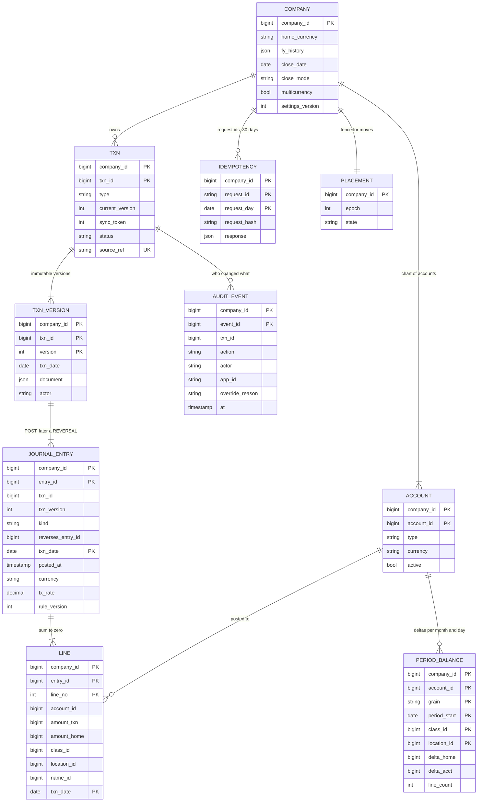

Access patterns that justify it:
- **Partition key is `company_id`, everywhere.** It is the first column of every primary key, so one company's rows sit together and every posting transaction is single-shard. No distributed transaction exists anywhere on the write path.
- **Post** (every write): insert by primary key into `IDEMPOTENCY`, `TXN`, `TXN_VERSION`, `JOURNAL_ENTRY`, `LINE`; upsert `PERIOD_BALANCE` by its full key (`delta = delta + x`).
- **Edit** (~10% of writes): `TXN` by `(company_id, txn_id)` `FOR UPDATE`, then the previous version's entry by `(company_id, txn_id, txn_version)` (secondary index) to build the reversal.
- **As-of report**: `PERIOD_BALANCE` range scan on `(company_id, account_id, grain, period_start)`. In Postgres a covering index (`INCLUDE (delta_home, delta_acct)`) makes it an index-only scan. `delta_acct` is in the account's own currency: euros for a euro bank account, home currency for an income account.
- **GL detail**: `LINE` by `(company_id, account_id, txn_date, entry_id)`, keyset-paged.
- **Customer filter**: `LINE` by `(company_id, name_id, txn_date)`. Customer is **not** a balance-row dimension: millions of customers at the largest tenants would multiply the rows. One customer's lines are a small slice, so the line index answers it.
- **Import dedup**: unique `(company_id, source_ref)` on `TXN`, kept forever. A bank feed item or a Shopify order can never post twice. `source_ref` ends in a generation (`bank:9913:tx_77#g1`): undoing an accepted bank item voids the post and bumps the generation, so a re-accept posts again.
- **Retention of `IDEMPOTENCY`**: partitioned by `request_day`, the day **inside** the UUIDv7, so a retry after midnight lands in the same partition as the original. Ids more than 1 day ahead or 29 days old are rejected; partitions drop after 30 days [estimate]. Imports do not rely on it.
- **Line and entry tables are partitioned by `txn_date` year** (§5.7), so `txn_date` is part of their primary keys.
- **Money**: integer minor units plus an ISO 4217 currency code. FX rates as exact decimals stored on the entry. No floats anywhere.

---
## 4. High-level design

One subsection per functional requirement. Each traces input to output through the boxes, adds the boxes it needs to one diagram, and ends with what is still missing. The design at the end of §4 is deliberately the simple version; §5 breaks it.

### 4.1 Post a business transaction as one balanced journal entry

**Flow: a bookkeeper saves a $1,080 invoice dated March 10.**

1. The QBO web app sends `POST /v1/companies/c_7/transactions` with `type INVOICE, txn_date 2026-03-10`, one item (consulting, $1,000.00), tax code 8%, and `request_id r_91` (generated once per save click, reused on retry).
2. The **API gateway** checks the OAuth token, takes `company_id = c_7` from it (a body that names another company is rejected), applies the per-company rate limit, and forwards.
3. The **posting engine** looks up `c_7` in its in-process copy of the **shard directory**: logical shard 417 on cluster 26, epoch 3.
4. It loads `c_7`'s chart of accounts and settings from a per-company cache keyed by `settings_version`, applies the posting rule for `INVOICE` (rule version 12), and gets three lines: AR +108,000, Consulting income −100,000, Sales tax payable −8,000. They sum to zero. The balance-row deltas follow from the lines: one month row (2026-03) and one day row (2026-03-10) per account. Why both grains is §4.4.
5. One transaction on the shard: insert `IDEMPOTENCY(c_7, r_91)` with the response (the ids are minted up front), then `TXN`, `TXN_VERSION` v1, `JOURNAL_ENTRY` E1 (`kind POST`), and last the 3 `LINE` rows in one statement. A statement-level trigger on `LINE` turns that statement's new rows into the 6 `PERIOD_BALANCE` upserts (`delta_home = delta_home + x`), one multi-row statement in sorted key order. `COMMIT` is pipelined behind it and waits for a synchronous standby.
6. The engine waits, at most ~1 s, until the cross-region replica has flushed the commit (manual and API posts, §5.5), then returns `txn_id t_5501, version 1, sync_token 0, entry_id E1`. ~26 ms p50.

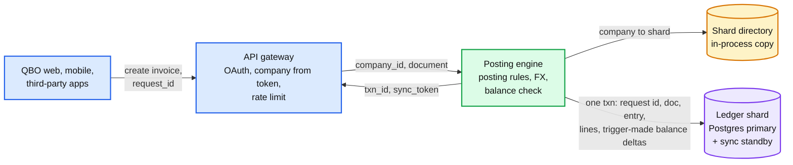

Data model touched: `IDEMPOTENCY`, `TXN`, `TXN_VERSION`, `JOURNAL_ENTRY`, `LINE`, `PERIOD_BALANCE`. ~14 row writes in one commit, the balance rows written by the trigger, last.

**What breaks, and the pick:**
- **Journal written later, by another service.** The invoice service saves the invoice in its own database and emits an event; a ledger service posts it. For a window (seconds normally, hours when the consumer lags) the invoice exists and AR does not show it, so read-your-writes is broken. Two databases also mean an outbox or a saga to avoid an invoice that never posts. At ~900 posts/s, even a 0.01% loss is ~7,800 unposted invoices a day.
- **Lines only, no balance rows.** The post is cheaper, but every report sums lines. At the largest company that is up to 600 M lines over 10 years (§4.4).
- **Balance deltas computed by the application.** Works until one code path forgets a delta or applies it twice; then the rows drift silently. A statement-level trigger with transition tables derives them from the lines that were actually inserted, one upsert per key per statement, so that bug class is gone (§10.1).
- **Pick: the document, the entry, the lines and the trigger-maintained balance deltas in one single-shard transaction.** It is possible only because all of a company's rows share a shard. The document and its accounting effect can never disagree, and a report that runs after the commit sees it.

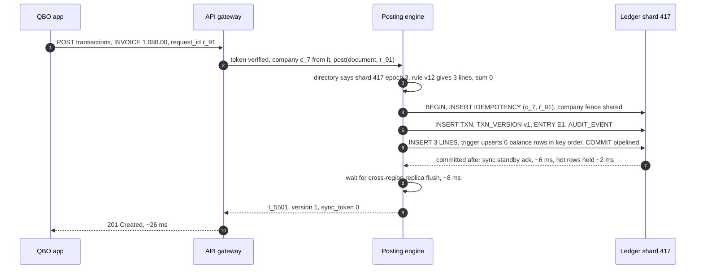

**What is still missing:** the bookkeeper notices the invoice should have been $1,200. What does an edit write?

### 4.2 Keep history immutable: edits and voids post reversals

**Flow: on May 2, the invoice dated March 10 is edited from $1,000 to $1,200 (tax 8%).**

1. The app sends `PUT .../transactions/t_5501` with the new document, `sync_token 0`, `request_id r_140`.
2. The posting engine opens a transaction on shard 417. It claims `IDEMPOTENCY(c_7, r_140)`, takes the company fence (shared), then takes the `TXN` header `FOR UPDATE` and compares `sync_token`: 0 equals 0, so it proceeds. (A stale token returns `409 STALE`; §5.1.)
3. It writes `TXN_VERSION` v2, `AUDIT_EVENT(edit, t_5501, v1 to v2, actor, app_id, ip)`, and sets `TXN.current_version = 2, sync_token = 1`.
4. It writes **reversal** entry E2 (`kind REVERSAL, reverses E1`, `txn_date 2026-03-10`) and **new** entry E3 (`kind POST`, version 2, `txn_date 2026-03-10`).
5. Last, all 6 lines in one statement: E2 has AR −108,000, Consulting income +100,000, Sales tax payable +8,000; E3 has AR +129,600, income −120,000, tax −9,600. The statement trigger groups them by balance key, so the net deltas (March AR +21,600, income −20,000, tax −1,600) update 3 month rows and 3 day rows once each. Commit.

**The rule: a reversal is never re-dated.** It always carries the `txn_date` of the version it cancels, so the cancelled amount leaves exactly the period it entered. If that period is now closed, the edit needs a closed-period override (§4.3), even when the new version is dated in an open period.

So the March P&L now says $1,200 of income. That is what QBO users expect: a report shows each transaction as it is now, on its own date. **"What did March say before the edit?"** is still answerable, because every line has a `posted_at`: the lines with `posted_at` before May 2 are exactly the books as they stood then. A **void** is the same transaction without E3. A changed date (March 10 to April 2) puts the reversal in March and the new entry in April: two months touched, both correct.

The **GL detail** report shows the current view: the lines of the `POST` entry of each transaction's current version (none for a voided one). The **audit view** shows all entries, reversals included. Both sum to the same totals, because a reversal cancels its original exactly.

Audit is written **in the same transaction** as the change, so there is no change without its audit row. A CDC stream copies audit events to a write-once archive in object storage, kept 7+ years (§5.4). QBO's own audit log shows who changed what, and "events recorded in the audit log are available for two years" ([QuickBooks help](https://quickbooks.intuit.com/learn-support/en-us/help-article/audit-log/use-audit-log-quickbooks-online/L2WoVnW6I_US_en_US)); our archive keeps them behind that view for the full retention.

```mermaid
%% Incremental diagram, step 2 of 4: edits post a reversal plus a new version. Audit events stream to a write-once archive. New boxes: CDC stream, audit archive.
flowchart LR
    APP[QBO web, mobile,<br/>third-party apps] -->|"create, edit, void<br/>request_id, sync_token"| GW[API gateway]
    GW -->|"company_id, document"| PE[Posting engine<br/>posting rules, reversal<br/>builder, balance check]
    PE -->|"company to shard"| DIR[(Shard directory)]
    PE -->|"one txn: version + reversal<br/>+ new entry + net deltas + audit"| DB[(Ledger shard<br/>insert-only lines)]
    DB -->|"committed changes,<br/>logical decoding"| CDC[[CDC stream<br/>Kafka]]
    CDC -->|"audit events,<br/>7+ years"| AUD[(Audit archive<br/>write-once object storage)]

    class APP,GW client
    class PE service
    class DIR cache
    class DB,AUD store
    class CDC queue

    classDef client   fill:#dbeafe,stroke:#2563eb,stroke-width:2px,color:#111
    classDef service  fill:#dcfce7,stroke:#16a34a,stroke-width:2px,color:#111
    classDef store    fill:#ede9fe,stroke:#7c3aed,stroke-width:2px,color:#111
    classDef cache    fill:#fef3c7,stroke:#d97706,stroke-width:2px,color:#111
    classDef queue    fill:#cffafe,stroke:#0891b2,stroke-width:2px,color:#111
```

Data model touched: `TXN` (the only updated row, a version pointer), `TXN_VERSION`, two `JOURNAL_ENTRY` rows, 6 `LINE` rows, 6 `PERIOD_BALANCE` upserts, `AUDIT_EVENT`.

**What breaks, and the pick:**
- **Update the lines in place.** No history: "who changed March revenue, and from what?" has no answer. The balance rows must then be fixed by computing a diff, and a bug in that diff makes the books drift with no trace. CDC consumers and the verifier see `UPDATE`s on the source of truth and cannot tell a fix from a corruption.
- **Keep a history table filled by a trigger.** History exists, but the ledger itself still mutates, and tamper evidence over a mutable table is hard to prove to an auditor.
- **Post only the difference** (+$200). Cheaper, but "the lines of version 2" now means replaying every earlier diff, and a date change produces a negative entry in March and a positive one in April that matches no document.
- **Pick: reversal plus a full new version.** Lines are insert-only. The only mutable row is the `TXN` header's pointer and token. Each version's lines are exactly its document's effect. The database enforces it: the application role has no `UPDATE` or `DELETE` on `LINE`, `JOURNAL_ENTRY` or `TXN_VERSION`.

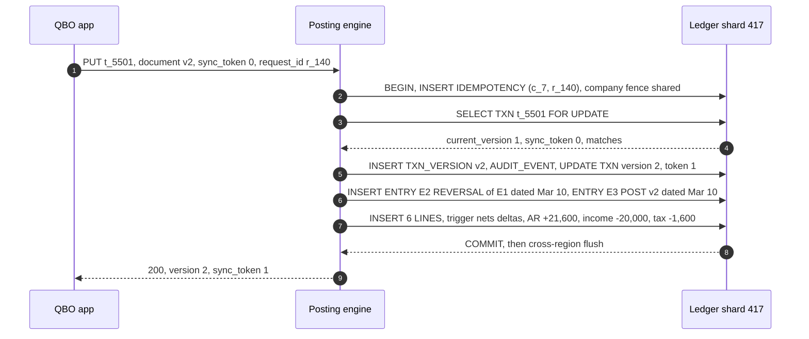

**What is still missing:** nothing stops an edit to a period the owner already filed taxes on.

### 4.3 Respect closed periods

**Flow: books are closed through December 31, 2025. On January 12, a bank feed item dated December 30 is accepted.**

1. The bank feed service ([#51](../bank-feed-aggregation/)) delivers new bank lines to our **import service**, which puts them in the company's **For review** list. Nothing touches the ledger yet. An item dated on or before the closing date is marked "in a closed period".
2. The user accepts the $42 fuel expense with its suggested category. The import service calls the posting engine with `source_ref bank:9913:tx_77#g1` and `request_id`.
3. In the posting transaction, the engine takes the **company fence** in shared mode, `pg_advisory_xact_lock_shared(company_id)`, then reads the settings row: `close_date = 2025-12-31`, `close_mode = PASSWORD`.
4. `txn_date 2025-12-30` is on or before the closing date. With no override, the engine rolls back and returns `409 CLOSED_PERIOD` with a suggestion: date it January 1, 2026 (the first open day), which is the usual way to record a late item.
5. If the user instead enters the closing password and a reason, the auth service issues a short-lived **override token** bound to this request. The engine posts, and writes `AUDIT_EVENT(CLOSED_PERIOD_OVERRIDE, actor, reason)` in the same transaction. In `WARN` mode an explicit acknowledgement flag replaces the password; it is audited the same way.
6. For an **edit**, the check covers both dates: the `txn_date` of the version being reversed and the new one. Moving a closed December invoice into January is still a change to December.

**Closing the books.** `PUT .../settings/closing-date` takes the same fence in exclusive mode, `pg_advisory_xact_lock(company_id)`. That waits for in-flight posts (which hold it shared) to finish, later posts queue behind it (the lock queue is fair, so a stream of posts cannot starve the close), and every post after it reads the new date. An advisory lock writes nothing, so unlike a `FOR KEY SHARE` row lock on a hot settings row it causes no MultiXact churn and no WAL per post. In the same transaction it records a **close snapshot**: the trial balance as of the closing date, stored as an immutable artifact. A later override is then visible as a diff: "December changed by +$42 since you closed it". The list behind it is a line query (`txn_date` on or before the closing date, `posted_at` after the close), which is what an accountant needs before re-filing. QBO offers the same two modes: "Allow changes after viewing a warning" and "Allow changes after viewing a warning and entering password" ([QuickBooks help](https://quickbooks.intuit.com/learn-support/en-us/help-article/close-books/close-books-quickbooks-online/L59LelyPM_US_en_US)).

```mermaid
%% Incremental diagram, step 3 of 4: imports land in a review list, and every post checks the closing date inside its transaction. New boxes: external sources, import service.
flowchart LR
    APP[QBO web, mobile,<br/>third-party apps] -->|"create, edit, void,<br/>accept from review"| GW[API gateway]
    SRC[Bank feeds, Shopify,<br/>Payments, Payroll] -->|"bank lines, orders"| IMP[Import service<br/>For review list,<br/>dedup by source_ref]
    IMP -->|"accepted items"| PE[Posting engine<br/>rules, reversals,<br/>closing-date check]
    GW -->|"company_id, document"| PE
    GW -->|"accept, recategorize"| IMP
    PE -->|"company to shard"| DIR[(Shard directory)]
    PE -->|"one txn, company fence<br/>shared, then settings"| DB[(Ledger shard)]
    DB -->|"logical decoding"| CDC[[CDC stream]]
    CDC -->|"audit events"| AUD[(Audit archive)]

    class APP,GW client
    class PE,IMP service
    class DIR cache
    class DB,AUD store
    class CDC queue
    class SRC external

    classDef client   fill:#dbeafe,stroke:#2563eb,stroke-width:2px,color:#111
    classDef service  fill:#dcfce7,stroke:#16a34a,stroke-width:2px,color:#111
    classDef store    fill:#ede9fe,stroke:#7c3aed,stroke-width:2px,color:#111
    classDef cache    fill:#fef3c7,stroke:#d97706,stroke-width:2px,color:#111
    classDef queue    fill:#cffafe,stroke:#0891b2,stroke-width:2px,color:#111
    classDef external fill:#e5e7eb,stroke:#6b7280,stroke-width:2px,color:#111,stroke-dasharray:4 3
```

Data model touched: `COMPANY` (`close_date`, `close_mode`, `settings_version`), `AUDIT_EVENT` with `override_reason`, a close-snapshot artifact.

**What breaks, and the pick:**
- **Check the closing date in the UI (user interface).** API apps and imports never see it, and most volume comes through them.
- **Check it in the posting engine before the transaction.** It races with a close: post T1 reads `close_date = Nov 30`, the accountant sets Dec 31 and commits, T1 commits a Dec 30 entry a millisecond later. The books were closed, and then changed, with no override and no audit.
- **Lock the period hard, no override.** Accountants find mistakes after close, and fixing them in the closed period (then re-filing) is a normal workflow. A hard lock pushes them to work around it.
- **Pick: check inside the posting transaction under the company fence**, posts holding it shared and the close holding it exclusive, so the two can never interleave; overrides need a permission plus the password, and are audited and diffable against the close snapshot.

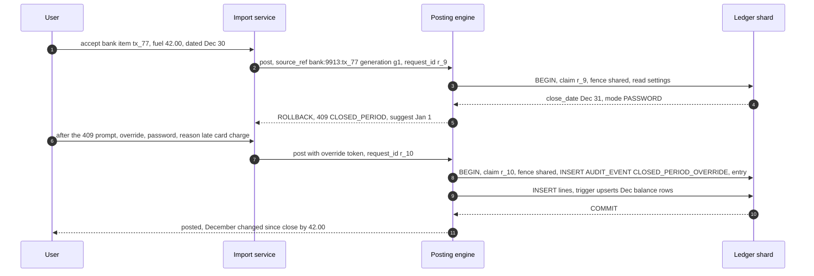

**What is still missing:** reports. Everything so far writes period balance rows; nothing reads them yet.

### 4.4 Report fast over the whole history

**Flow: balance sheet as of June 15, 2019, for a company with books since 2016 and a fiscal year starting in January.**

1. The app calls `GET .../reports/balance-sheet?as_of=2019-06-15`. The **report service** routes to the company's shard primary.
2. Asset, liability and equity accounts are cumulative since the first entry: sum their **month rows** from the first month through May 2019, plus their **day rows** for June 1 to 15.
3. **Net income for the current fiscal year** = income and expense accounts, month rows January to May 2019 plus day rows June 1 to 15.
4. **Retained earnings** = income and expense accounts, all month rows **before** January 2019, plus anything posted directly to the retained earnings account. Computed now, from the same rows. No closing entry exists. The fiscal year start comes from the company's effective-dated history (`fy_history`): a company that moved its year end in 2021 still gets its 2019 boundary for a 2019 report.
5. It is one SQL statement in one snapshot, grouped by account: ~60 accounts × ≤ 42 months, plus ≤ 15 day rows each. ~3k index entries, **~5 ms**.
6. The service maps accounts to report sections and returns rows and totals. Assets equal liabilities plus equity because every entry summed to zero.

The other reports are the same reads:
- **P&L, January to June 2019, by month:** income and expense month rows in the range, plus day rows for a partial first or last month.
- **Trial balance as of a date:** the balance-sheet read, listed per account as debit or credit.
- **GL detail:** `LINE` rows by `(company, account, txn_date, entry_id)`, 500 per page, keyset-paged. The opening balance at `from` comes from the balance rows; the cursor carries `(last key, running balance)`, so page 40 does not re-sum pages 1 to 39. The cursor also pins `posted_before = start − 5 s` for every page, so a backdated post made while the user pages cannot shift rows under the running balance; Postgres 17's `transaction_timeout = 5 s` on the posting role guarantees no post older than that is still uncommitted.
- **Filters:** class and location are columns of the balance row, so a filtered report reads the rows for that class. A customer filter reads lines through the `(company, name_id, txn_date)` index.

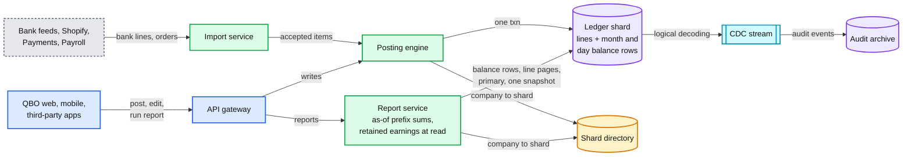

Data model touched: `PERIOD_BALANCE` (read), `LINE` (GL detail), `ACCOUNT` (types and sections), `COMPANY` (fiscal year start).

**What breaks, and the pick:**
- **Sum the lines at query time.** A median company has `600 × 3 × 120 = 216k` lines after 10 years: ~100 to 200 ms, fine. The largest has `1 M × 5 × 120 = 600 M` (e-commerce orders carry ~5 lines [estimate]): minutes, and it reads the same disks every post needs.
- **A running balance on each line, or cumulative month-end snapshots.** As-of becomes one lookup. But a backdated write has to rewrite every later row: an edit to a 2019 invoice updates 84 month-end snapshots per account (or every later line's running balance), and those rows are exactly the ones the next post needs.
- **Pick: per-period deltas.** A backdated write touches one month row and one day row per account. An as-of read is a prefix sum: at most 12 month rows per account per year, plus at most 31 day rows for the partial month, whatever the tenant's volume. The partial month is why day rows exist: summing a month of lines is ~20 lines for a median account but up to ~1 M for the largest company's clearing account. Day rows cost ~0.64 TB/year, ~1% of storage (§2).
- **Retained earnings at read time, not by closing entries.** The textbook year-end closing entry moves income and expense into retained earnings. In a database it is a derived number: a backdated change to last year, or a changed fiscal year start, would force re-posting closing entries. Computing it at read makes both automatic.

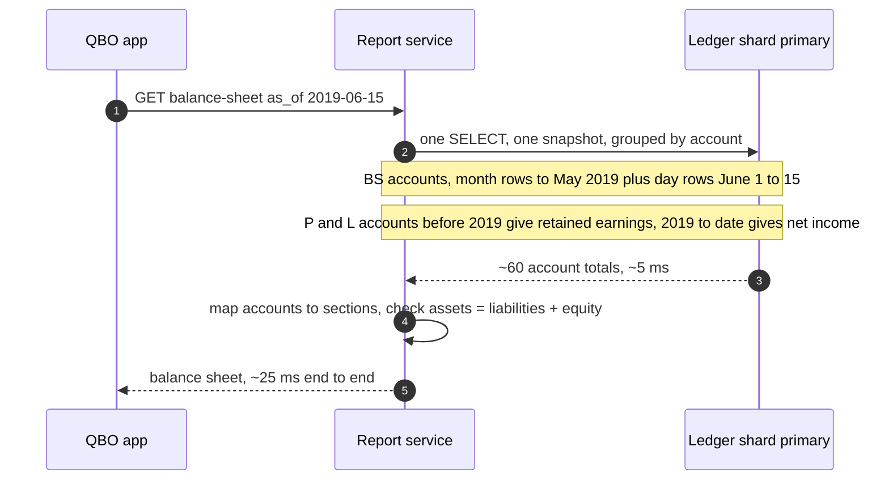

**What is still missing** (all of it is §5): two apps posting at once, retries, and the cent that does not convert (§5.1); replicas, dimensions and the largest tenants' reads (§5.2); one company importing a million orders (§5.3); proof that the balance rows still equal the lines (§5.4); a shard that dies or a company that must move (§5.5); an accountant looking across 50 companies (§5.6); and ten years of history that never stops growing (§5.7).

---
## 5. Deep dives

One per non-functional requirement, phrased as the interviewer asks it. Each names what breaks in the §4 design with a number, fixes it, and lists what changed in the API, the data model and the diagram. The red node is the same everywhere: the hot balance row on a shard primary (§5.3 says why).

### 5.1 "How do you guarantee every entry balances, with retries, crashes and two apps posting at once?"

**What breaks in the §4 design.**

1. **Retries.** The client times out at 5 s, but the commit landed. It resends. Without a guard, that is a second invoice and double revenue. At ~900 posts/s and a 0.1% retry rate [estimate], that is `900 × 86,400 × 0.001 ≈ 78k` duplicate postings a day.
2. **Two apps, one invoice.** The bookkeeper edits invoice t_5501 in the browser while a sync app updates the same invoice from an old copy. Last writer wins, and one change is silently lost.
3. **A bug in a posting path.** A new tax rule rounds each line on its own and the entry is off by a cent. The engine's pre-check is the only guard, and a new code path (a backfill script, a second engine version) can skip it.
4. **Currency.** An invoice in euros balances in euros, but each line converted to dollars and rounded no longer sums to zero. Someone has to own the cent.
5. **Deadlock.** Post A updates AR then Income; post B, an edit, updates Income then AR. Both wait on each other.

**The fix.**

- **Idempotency by claim, not by lookup.** The first statement of every posting transaction is `INSERT INTO idempotency (company_id, request_id, request_hash)`. A retry of a committed post collides on the primary key and returns the stored response. A concurrent duplicate blocks on the uncommitted key until the first commits, then collides. A reused id with a different body (`request_hash` differs) returns `422`. The id is a UUIDv7 and its embedded day is the partition key, so a retry after midnight finds the original; ids over 1 day ahead or 29 days old are rejected, partitions drop at 30 days [estimate]. The stored response is written before `COMMIT`, so it cannot hold its own commit position; a replayed response carries the shard's current flush LSN as `as_of_commit`, a safe upper bound. Imports also carry `source_ref`, unique on `TXN` forever, so a bank line or an order can never post twice, however late the retry. QBO's public API takes a client `requestid` for the same purpose [unverified].
- **Optimistic concurrency on the transaction header.** Every edit sends the `sync_token` it read. The engine takes the `TXN` row `FOR UPDATE` and compares; a mismatch is `409 STALE` and the client re-reads. Two edits never interleave, and posting different transactions never conflicts except briefly on shared balance rows. QBO's API carries a `SyncToken` on every entity for the same purpose (visible in the JournalEntry docs; the exact stale-token error is [unverified]).
- **The invariant is enforced in three layers.** (1) The engine pre-checks with rich errors. (2) The database re-checks: a constraint trigger on `LINE`, fired once per entry (`WHEN (NEW.line_no = 1)`), re-sums the entry and aborts if `Σ amount_home ≠ 0` or `Σ amount_txn ≠ 0`. It is deferrable, so any code path gets it at `COMMIT` at the latest; the engine runs `SET CONSTRAINTS entry_balanced IMMEDIATE` just before the lines statement, so the check runs at the end of that statement, before the balance trigger locks any hot row. ~0.1 ms per entry, and no path that writes lines can skip it. The application role has no `UPDATE` or `DELETE` on `LINE`, `JOURNAL_ENTRY` or `TXN_VERSION`, and no write on `PERIOD_BALANCE` at all: only the balance trigger (running as the ledger owner) and audited repairs write it. (3) The verifier re-checks after the fact (§5.4).
- **Multi-currency: the engine owns the cent.** Each entry stores its transaction currency and the rate used (from the rate table or typed by the user); the rate is never looked up again. Each line carries `amount_txn` and `amount_home = round_half_even(amount_txn × rate)`. If the rounded home amounts do not sum to zero, the residual goes to a **home-only line** (`amount_txn = 0`) on the company's exchange gain or loss account, created when multicurrency is turned on. A residual larger than half a cent per line means the input itself does not balance: `400`, not a rounding line.

  Worked example, rate 1.0877 USD per EUR: AR €100.00 = $108.77. Three income items €33.33, €33.33, €33.34 = $36.25, $36.25, $36.26 = $108.76. Residual one cent: a home-only credit of $0.01 to exchange gain or loss. Euros sum to zero, dollars sum to zero. When the customer pays €100.00 at 1.1000: bank +€100.00 / +$110.00, AR −€100.00 / −$108.77, and a **realized** exchange gain line −$1.23. Same rule, bigger number ([`diagrams.md`](diagrams.md#d4f-a-euro-invoice-then-its-payment-at-a-new-rate)).

  Balance rows keep `delta_home` plus `delta_acct` in the **account's** currency (euros for a euro bank account or euro AR, home currency for income and expense), never a mix of transaction currencies. At period end, foreign-currency balance-sheet accounts are **revalued**: a home-currency adjustment entry restates their home balance at the period-end rate against an unrealized exchange gain or loss account (home-only lines, euros untouched), reversed on day one of the next period. It is an ordinary balanced, audited posting.
- **One lock order everywhere.** The idempotency claim, then the company fence (shared advisory lock), then the `TXN` header `FOR UPDATE` (edits), then the version, audit and entry inserts, then the lines in one statement whose trigger upserts the balance rows **in sorted key order, as one statement, last**, with `COMMIT` pipelined behind it. Sorted order rules out deadlock; last keeps the hot rows locked only for that statement and the commit (~2 ms), not the whole transaction.

**Push back on the textbook answer.** "Use `SERIALIZABLE` isolation for a ledger." Our writes are inserts plus `delta = delta + x` under a row lock, which cannot lose an update at `READ COMMITTED`. The only read that guards a write (the closing date, the sync token) is taken with an explicit lock. `SERIALIZABLE` would add predicate tracking and abort-and-retry on exactly the hot rows of §5.3, for no extra safety.

**What changed.** API: `request_id` required on every write, `409 STALE`, `422` on key reuse. Schema: `request_hash` on `IDEMPOTENCY`, FX rate and currency on `JOURNAL_ENTRY`, `amount_txn` and `amount_home` on `LINE`, exchange gain or loss accounts and the period-end revaluation, the balance-check and balance-maintenance triggers, and the revoked grants. Diagram: no new box; the check now lives in two places on the write path. Deep dive: [`deep-dives/posting-engine-and-balance-invariant.md`](deep-dives/posting-engine-and-balance-invariant.md).

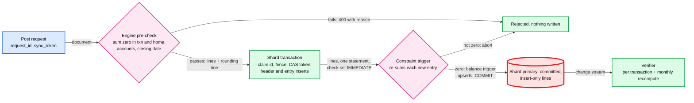

### 5.2 "Balance sheet as of any date in 10 years under 1 s, and it shows the post I just made?"

**What breaks in the §4 design.**

1. **The obvious scaling move breaks read-your-writes.** "Reports go to read replicas" is the standard answer. Replica lag is milliseconds on a quiet day and seconds to minutes during a long replay or a vacuum conflict, and the bookkeeper who just saved an invoice opens the P&L and does not see it.
2. **Heavy queries on the primary.** Interactive reports cost ~10 ms each, ~0.4 core per cluster at peak (§2). The danger is the tail: a GL detail export for a full year at the largest company is ~60 M lines (`1 M × 5 lines × 12`, e-commerce orders carry ~5 lines), and a "P&L by customer" across 1 M customers. One of them reads gigabytes from the disks every post needs.
3. **The largest companies' as-of reads.** ~2k accounts [estimate] × 120 months = 240k month rows: ~150 to 300 ms, fine. The same company with class and location tracking in ~10 combinations reads up to ~3 M rows (120 month rows plus up to 30 day rows per account and combination): 2 to 4 s, past the 1 s target.

**The fix.**

- **Interactive reports stay on the primary.** At ~0.4 core per cluster they are cheaper than any routing scheme, and read-your-writes is free.
- **Heavy queries go to a read-only standby in the same region, with a freshness token.** Every post response carries the commit LSN (log sequence number). A report request from the same session passes it along; the standby serves it once its replay position has passed that LSN (normally milliseconds), waiting up to 200 ms, else the request falls back to the primary. "Heavy" is decided before running: `line_count` on the balance rows gives the exact number of lines a GL detail would read, and the planner's statistics estimate a customer report. Over ~100k lines it runs on the standby; over ~5 M it becomes an asynchronous export job.
- **A third grain for the few largest companies.** When `accounts × dimension combinations × years` passes ~500k rows (a few hundred companies [estimate]), the balance trigger also maintains **year rows**. They are deltas like the others, so a backdated write still touches one row per grain. A partial year or month is also read from whichever end is shorter (the month row minus the day rows after the date, say). An as-of read becomes ≤ 10 year rows + ≤ 6 month rows + ≤ 15 day rows per account and combination: the 3 M-row report drops to ~0.4 M rows typical (~620k worst case), ~300 ms. Turning it on sets a per-company flag and backfills the year rows from the month rows under the exclusive company fence (one ~1 to 2 s write pause, once), then a targeted recompute checks the new rows against the lines.
- **GL detail stays paged.** Keyset on `(account, txn_date, entry_id)`, 500 lines a page, first page ~20 ms; the cursor carries the running balance and the pinned `posted_before` (§4.4).

**Push back on the textbook answer.** "Cache report results in Redis." A report costs ~5 to 15 ms of index-only scan. A cache saves little, and invalidating it on every post (including backdated edits that change every later as-of date) is a correctness bug waiting to happen in the one system where a stale number is a support ticket. The balance rows already are the cache, and they are updated in the same transaction as the lines.

**What changed.** API: `as_of_commit` (the LSN) on post responses and an optional `min_commit` on report requests; asynchronous export for oversized reports. Schema: grain `Y` in `PERIOD_BALANCE` for flagged companies. Diagram: the report service gains a replica path and a planner. Deep dive: [`deep-dives/fast-reports-period-balances.md`](deep-dives/fast-reports-period-balances.md).

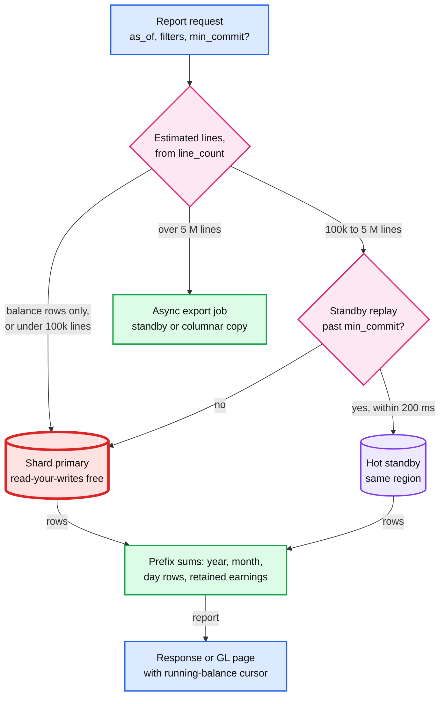

### 5.3 "One company syncs 1 M Shopify orders a month into the same two accounts. Where is the hot spot?"

**What breaks in the §4 design.** Walk the write path. The gateway and engine are stateless. The shard holds ~125k companies [estimate] and runs ~160 commits/s at peak. Inside it, **one row**: the largest company's Sales income month row (and its day row, and the clearing account's), touched by every order.

1. **Live sync is fine.** 1 M orders a month is 0.39/s; a 10x Black Friday is ~4/s, 0.8% of the row's ~500/s ceiling. A third-party connector cannot even reach that ceiling through the public API: QBO throttles each company at 500 requests a minute ([Intuit developer help](https://help.developer.intuit.com/s/article/API-call-limits-and-throttling)), ~8/s.
2. **Bulk import breaks it.** A migration from QuickBooks Desktop or a CSV of last year's orders: 12 M transactions through first-party paths that the public throttle does not cover. One commit per transaction saturates the hot row at ~500/s for **~6.7 hours**. The company's own bookkeeper posting to Sales income queues behind it: 60 waiters × 2 ms is the whole ~120 ms of p99 headroom, and it gets worse from there.
3. **The neighbours pay too.** 12 M × 2 KB = 24 GB of writes into one cluster, next to ~62k other active companies.
4. **Head-of-line.** If imports share a Kafka partition keyed by company, every company hashed to that partition waits behind the ~7-hour job.

**The fix: batch per company, in a separate lane.**

- **Two lanes.** `LIVE` imports (bank lines accepted, a Shopify order webhook) post one by one through the normal engine path within ~10 s. `BULK` imports (migrations, CSV, a backfill of last year) run as a per-company job with its own queue, so they never block another company's live items.
- **A per-company batcher.** One worker holds a lease on a company's bulk job. It takes up to 500 transactions (or 1 s of input), validates them in memory (posting rules, balance, closing date; failures go to the review list with a reason), then runs **one** transaction: claim all `source_ref`s with one `INSERT ... ON CONFLICT DO NOTHING RETURNING` (duplicates drop out), multi-row inserts of versions and entries **for the claimed items only**, then all ~2,500 lines in one statement, whose balance trigger writes **one upsert per balance key** for the whole batch, last, in sorted order, and commit. The hot row is now updated **once per batch**, not once per order: 1k transactions/s is ~2 row updates/s. A batch of ~2,500 lines takes ~50 to 100 ms [estimate].
- **Admission control.** Bulk runs at most 1k transactions/s per company and 3k/s per cluster [estimate], and backs off when the cluster's interactive post p99 passes 150 ms. The 12 M-order migration takes `12 M ÷ 1k/s = 3.3 hours` instead of ~6.7 hours of a locked row, and an interactive post waits at most for one batch's final upsert and commit (~3 ms).
- **Placement.** The directory spreads the largest companies across clusters. A company whose share of its cluster's writes or storage passes ~10% moves to a cluster with headroom (§5.5). None is close today.

**Why the hot row is red and the biggest tenant is not.** The biggest company's whole 10-year footprint is `1 M × 12 × 10 × 2 KB ≈ 240 GB` (~300 GB with its 5-line orders), ~3% of a ~9 TB cluster, and its live write rate is ~0.4/s against a cluster that does thousands. As a tenant it is small. What breaks first is the one row every one of its orders funnels into, which serializes at ~500/s the moment a bulk path ignores batching. That row is red in every diagram.

**Push back on the textbook answer.** "Split the hot account into N sub-accounts (or N bucketed balance rows) and sum them at read." Do the arithmetic first: live traffic uses 0.08% of the row, and batching removes the bulk problem. Buckets would multiply every as-of read of that account by N and make every consumer (the verifier, CDC, the columnar copy) aware of the split. Keep it as the seam: if a first-party live stream (a point-of-sale app posting each sale) ever passes ~100/s sustained on one account, give that account's current-period rows 16 buckets keyed by `hash(entry_id)` and sum them at read, for that account only. TigerBeetle makes the same bet at the other extreme: it accepts transfers in large batches per request so that one commit carries thousands of balance updates.

**What changed.** API: `lane` on `POST /imports`. New boxes: the import queue (Kafka, `LIVE` topic keyed by company) and the bulk batcher with per-company leases and an admission controller. Schema: none. Deep dive: [`deep-dives/tenant-sharding-and-hot-tenants.md`](deep-dives/tenant-sharding-and-hot-tenants.md).

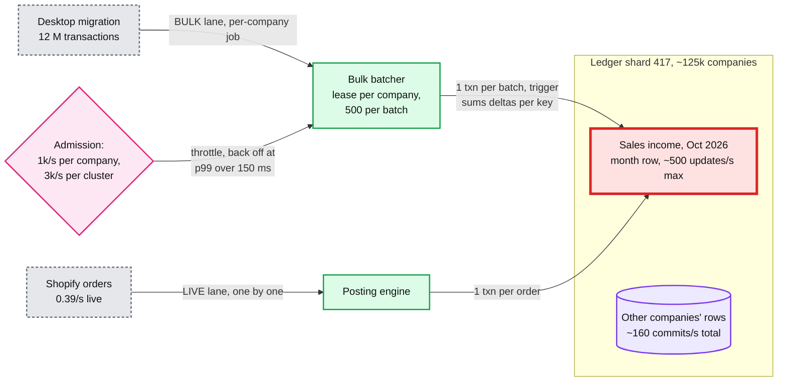

### 5.4 "How do you know the books are right?"

**What breaks in the current design.** The balance rows are derived data. The balance trigger removes the "forgot or doubled a delta" bug, and the constraint trigger proves each entry balances, but nothing proves `PERIOD_BALANCE = Σ LINE` over time. It can still drift through a bug in the trigger itself, a path that writes balance rows without lines (the shard mover, a repair, a year-row backfill), a hand-written data fix, a restore from a backup, or a CDC consumer bug that makes the copy disagree. Today a customer finds it: "my balance sheet does not balance", weeks later.

**The fix: a continuous verifier, in three loops.**

- **Per transaction, from the change stream (within ~1 minute).** The verifier reads the same logical-decoding stream as CDC, grouped by database transaction. For each one it checks, statelessly: every new entry's lines sum to zero in both currencies; for every balance key, `Σ (new − old)` of the balance rows equals `Σ` of that transaction's lines mapped to the key, per grain; no `UPDATE` or `DELETE` ever appears on `LINE`, `JOURNAL_ENTRY`, `TXN_VERSION` or `AUDIT_EVENT`; every `TXN` change has an `AUDIT_EVENT` in the same transaction; no write lands for a company whose placement says it moved. `PERIOD_BALANCE` uses `REPLICA IDENTITY FULL` so the stream carries the old row; the rows are ~80 B, so the extra WAL (write-ahead log) is small. Load: `900 × 14 ≈ 13k` row changes/s on average, a few cores. Changes applied by the shard mover carry a replication origin and are skipped only if `(origin, company, move window)` is on an allowlist the mover registers; any origin-tagged write outside it pages.
- **Targeted recompute after every lineless write.** Every path that writes balance rows without lines (the mover's copy, a repair, a year-row backfill) ends with a recompute of exactly the companies and keys it touched, in one snapshot, before it reports success.
- **Per company, monthly, from a snapshot.** On the cross-region replica, inside one `REPEATABLE READ` snapshot, recompute `Σ LINE` per balance key and compare with every row, check that each period's trial balance sums to zero, and that the current view equals all entries. Comparing both sides in one snapshot matters: across two snapshots, a concurrent post would raise false alarms. Cost: at year 10 the fleet holds ~850 B lines × 250 B ≈ 212 TB; scanning it once a month is `212 TB ÷ 2.592 M s ≈ 82 MB/s` fleet-wide, **~1.3 MB/s per cluster**. Cheap enough to run forever.
- **Tamper evidence, daily.** For each company and day, the verifier hashes the day's new entries and their lines in `entry_id` order into a Merkle root, chains it with the previous day's root, and writes it to write-once object storage that database administrators cannot alter. An auditor recomputes any day from the lines. A row edited behind the application's back breaks the chain at that day ([`../../concepts/merkle-tree.md`](../../concepts/merkle-tree.md)).

**When it fires.** An unbalanced entry, or a mutated line, is a P1 page: the database guard was bypassed, so stop the code path that did it. A balance row off by any amount is a P2 page plus a repair: rebuild the affected rows from lines (lines are the truth) under the exclusive company fence, as an audited system action that ends with a targeted recompute. Nothing is auto-fixed silently, and nothing in the customer's lines is ever rewritten.

**Push back on the textbook answer.** "Hash-chain every entry as it commits, blockchain style." A per-company chain head is one more row every post of that company must lock and read, so it serializes the company's writes and makes §5.3 worse. Auditors need evidence that history was not changed, which a daily root gives with zero cost on the write path. Stripe's Ledger takes the same stance at much larger scale: it sees five billion events a day and verifies 99.99% of dollar volume within four days, so completeness is checked after the fact, not inside each write.

**What changed.** New box: the verifier, reading the CDC stream and the replica. Schema: `REPLICA IDENTITY FULL` on `PERIOD_BALANCE`; a daily-root table in write-once storage. Operability: two new pages. Deep dive: [`deep-dives/audit-trail-and-continuous-verification.md`](deep-dives/audit-trail-and-continuous-verification.md).

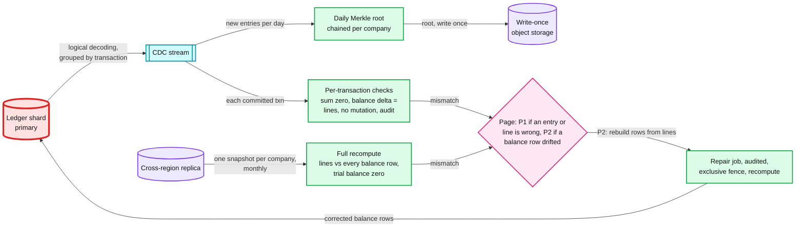

### 5.5 "A shard dies, or a company must move. How do you keep 99.95% and move it with zero downtime?"

**What breaks in the current design.**

1. **A primary dies.** One cluster holds ~125k companies (1/64 of all). Until a standby is promoted, none of them can post.
2. **A company must move.** A cluster fills (9 TB at year 10), a big tenant needs headroom, a country requires data residency, or a cluster needs a major-version upgrade. With hash sharding, one company cannot move alone. An offline copy of the largest company (~240 GB at ~100 MB/s) is 40 minutes of its books read-only.

**The fix.**

- **High availability inside a region.** Each cluster has a primary and two synchronous standby candidates in the other two AZs (`ANY 1`), so losing an AZ loses no committed post, and losing one standby does not stop commits. A failover manager promotes a standby in ~15 to 30 s [estimate]. During that window the gateway answers `503` with `Retry-After` for that cluster's companies, apps retry with the same `request_id` (no duplicates), bulk jobs pause, and reports fall back to a standby with a "may be a few seconds behind" banner: read-your-writes is suspended, visibly. The 99.95% budget is 21.9 min a month per company: room for ~40 such failovers.
- **Region loss: no acknowledged manual post is lost.** A replica in a second region streams the WAL asynchronously, but a **manual or API post is acknowledged only after that replica has flushed its commit**: right after `COMMIT` the engine reads `pg_current_wal_flush_lsn()` (at or past its own commit) and holds the response until the cross-region replica's `flush_lsn` passes it. A per-cluster watcher polls `pg_stat_replication.flush_lsn` every ~2 ms [estimate] and fans it out to the engine pods, which adds ~1 to 2 ms to the network's +8 ms (nearby region) or +67 ms (cross-country). The wait is capped at ~1 s: past it the post is answered `201` with `durability: region`, and its `request_id` is logged so it can be re-driven after a failover. The wait is **after** `COMMIT`, so the hot row's ~2 ms hold is unchanged. Making the cross-region flush part of `COMMIT` instead would keep the row locked for the round trip: ~500/s drops to ~100/s (nearby) or ~14/s (cross-country), so we reject it. **Imports** are acknowledged locally and re-driven after a failover from each source's watermark (bank feed cursor, Shopify `updated_at`) minus a margin; `source_ref` makes the overlap a no-op. RTO (recovery time objective) ~15 minutes [estimate]. Two details make the promotion safe: ids are time-ordered 64-bit values minted by the engine, so the promoted replica cannot re-issue an id a client already saw (a sequence could), and CDC events are versioned by `(timeline, LSN)`, because the new primary's LSNs restart below positions the lost WAL had already published. If the remote replica falls more than 5 s behind, the cluster pages and degrades to local-only acknowledgement rather than stopping posts; only a second failure in that window can lose an acknowledged post, and those posts were answered `durability: region`.
- **Directory-based placement** (`company_id → logical shard, epoch, state`): 1,024 logical shards on 64 clusters. A logical shard moves as a unit for rebalancing; a single company can also move alone.
- **Zero-downtime move of one company:**
  1. **Copy.** Export the company's rows from a consistent snapshot at LSN L0 to the target, while posts continue.
  2. **Catch up.** Stream changes after L0 from logical decoding, filtered to `company_id`, and apply them by primary key (idempotent upserts) with `session_replication_role = replica` (a privilege only the mover's role holds), so the balance trigger does not fire and balance rows arrive as copied values. The `PLACEMENT` row is shard-local and never copied. Wait until the lag is under ~1 s.
  3. **Freeze.** On the **source** shard, take the company fence exclusive (`pg_advisory_xact_lock(company_id)`), then set `PLACEMENT.state = FROZEN` and commit. Every posting transaction holds the fence shared and then reads its placement row, so in-flight posts finish first and any later post fails with `MOVING` (retryable).
  4. **Drain and verify.** Apply the last changes; compare per-key balance rows and line counts on both sides, then run the targeted recompute on the target (§5.4).
  5. **Flip.** Write the directory entry: target shard, `epoch + 1`, state `ACTIVE`. Set source placement to `MOVED`. Routers refresh on the `MOVING` or `MOVED` error.
  6. **Unfreeze** on the target. The write pause is ~1 to 3 s [estimate]; retries with the same `request_id` are safe.
  7. **Clean up** the source copy after 7 days, through a privileged path.

  The placement row is the fence: a router with a stale directory can only reach the source, and the source refuses. Rollback before step 5 is "drop the target copy"; after it, run the same move in reverse ([`../../concepts/leases-fencing-clocks.md`](../../concepts/leases-fencing-clocks.md)).

**What changed.** Schema: `PLACEMENT` per company on each shard, epoch and state in `SHARD_DIRECTORY`, time-ordered ids. New box: the shard mover. API: retryable `MOVING` and `503` responses; manual posts acknowledged after the remote flush. Deep dive: [`deep-dives/tenant-sharding-and-hot-tenants.md`](deep-dives/tenant-sharding-and-hot-tenants.md).

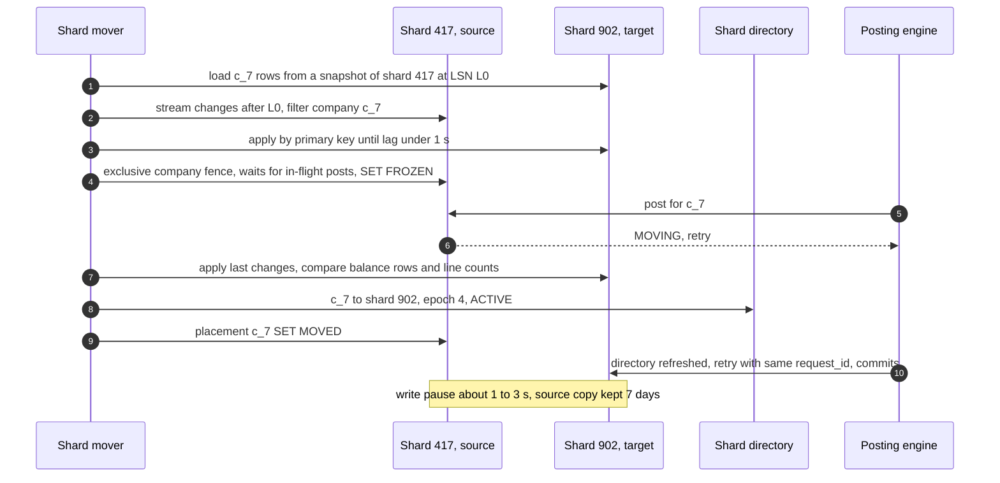

### 5.6 "An accountant runs a report across 50 client companies. Where does that query go?"

**What breaks in the current design.** The 50 clients live on up to 50 different shards. A firm dashboard (P&L summary, overdue AR, items to review per client) on every page load is a scatter-gather across shards. 50 clients × ~10 ms in parallel is ~30 ms, which works. But firm size is unbounded (some firms have thousands of clients [unverified]), the fan-out then touches every cluster on every refresh, and Intuit's own analytics (benchmarks, model features) would want to scan lines across all companies on the primaries.

**The fix: a CDC copy in a columnar store, eventual within 5 minutes.**

- Logical decoding on each shard publishes committed changes to Kafka, keyed by `company_id`, with per-shard progress markers (the cdc-pipeline pattern, [`../cdc-pipeline/`](../cdc-pipeline/)).
- A loader writes them to a columnar store (ClickHouse or similar): `LINE`, `JOURNAL_ENTRY`, `PERIOD_BALANCE` and `TXN` tables partitioned by month and ordered by `(company_id, account_id, txn_date)`. Balance rows are applied as the latest value per key (a replacing merge versioned by `(timeline, LSN)`, so a post-failover LSN never loses to a pre-failover one), lines as inserts. Each shard's applied position becomes a **freshness watermark**.
- The firm dashboard reads the columnar copy and says so: "as of 10:42, 2 minutes ago". Drilling into one client switches to that client's shard, strong again.
- Access is enforced in the query service, not in the SQL the client sends: the firm's grants (which clients, which roles) are a table joined into every query, and the client list comes from the authenticated session.
- The same copy feeds Intuit analytics and the verifier's completeness check (per company per day, row counts and sums in the copy equal the ledger).

**Push back on the textbook answer.** "50 clients is small, just fan out." True for 50: it is fresher and simple. We still route firm-level views to the copy, because the ledger's capacity plan should depend on the number of posts, not on the size of the largest accounting firm. The price is up to 5 minutes of staleness on a screen that is labelled with it.

**What changed.** New boxes: Kafka CDC topics, the columnar store, the firm query service (part of the report service). Schema: firm grants. Consistency: cross-company edges are eventual, everything inside one company stays strong. Deep dive: [`deep-dives/fast-reports-period-balances.md`](deep-dives/fast-reports-period-balances.md) (the columnar copy section) and [`../../concepts/columnar-db.md`](../../concepts/columnar-db.md).

```mermaid
%% Cross-company reads never touch a ledger primary. Freshness is a per-shard watermark shown on the screen.
flowchart LR
    SH[(Ledger shard primaries<br/>64 clusters)] -->|"logical decoding"| K[[Kafka CDC topics<br/>keyed by company_id]]
    K -->|"inserts, latest balance<br/>per key, watermark"| OL[(Columnar store<br/>all companies)]
    ACC[Accountant, 50 clients] -->|"firm dashboard"| FQ[Firm query service<br/>grants from session]
    FQ -->|"client list + metrics,<br/>eventual, under 5 min"| OL
    FQ -->|"drill into one client,<br/>strong"| SH
    OL -->|"daily counts and sums"| VER[Verifier completeness check]
    OL -->|"aggregates"| ANA[Intuit analytics,<br/>model features]

    class OL store
    class SH critical
    class K queue
    class ACC client
    class FQ,VER service
    class ANA external

    classDef client   fill:#dbeafe,stroke:#2563eb,stroke-width:2px,color:#111
    classDef service  fill:#dcfce7,stroke:#16a34a,stroke-width:2px,color:#111
    classDef store    fill:#ede9fe,stroke:#7c3aed,stroke-width:2px,color:#111
    classDef queue    fill:#cffafe,stroke:#0891b2,stroke-width:2px,color:#111
    classDef external fill:#e5e7eb,stroke:#6b7280,stroke-width:2px,color:#111,stroke-dasharray:4 3
    classDef critical fill:#fee2e2,stroke:#dc2626,stroke-width:4px,color:#111
```

### 5.7 "Keep all history for the life of the account. What does that cost in year 10?"

**What breaks.** Nothing functionally; the bill does. ~58 TB of new primary data a year, four copies, so ~2.3 PB of block storage at year 10 at today's volume. At ~$0.08 per GB-month [estimate] that is ~$184k a month for data that is almost never read: reports read balance rows, which are ~1% of the bytes, and GL detail for 2017 is opened a few times a year.

**The decision: keep everything hot until year 3, with the seam built in from day one.**

- **Day one.** `LINE`, `JOURNAL_ENTRY` and `TXN_VERSION` are partitioned by `txn_date` year inside each shard, so an old year is a partition that can be detached without touching live rows; `txn_date` is therefore part of their primary keys. Balance rows stay hot forever (they are what reports read).
- **The seam, built when storage passes ~30% of the ledger's cost [estimate].** Partitions for fiscal years more than 3 years old and before the closing date move to compressed Parquet in object storage (~5x smaller, ~$0.023 per GB-month [estimate]): roughly a 90% cut on those bytes. A tiered year keeps a small hot **late-lines** partition for override posts that arrive after it moved (written through the parent `LINE`, like every insert, so the balance trigger fires); GL detail for that year reads both. It runs on a query engine over Parquet with a ~5 s first page instead of 2 s. That is a product decision, not an engineering one, so it goes to the product owner before it is built.
- **Closed accounts.** A cancelled company goes read-only and is kept 7 years after close (the README's floor, above the IRS's 3 to 7 years). Then its rows are deleted from the shard and its per-company data key in the KMS (key management service) is destroyed. That key encrypts the PII fields and the company's archive files, so they become unreadable in every backup and copy at once; backups of the remaining rows age out within 35 days [estimate].

**What changed.** Schema: yearly partitions. Runbook: the tiering job is a seam, not a component. No new box.

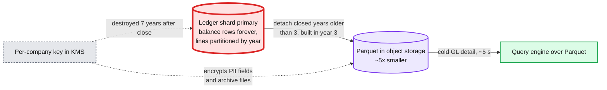

---
## 6. Final design and the six core flows

Everything from §5 composed. 14 nodes; zoom-ins live in [`diagrams.md`](diagrams.md).

```mermaid
%% D3: final design. The ledger shard primary is red: it is the only place a company's writes serialize, its hot balance row is the first thing a bulk path breaks, and its failover is the largest per-company outage.
flowchart LR
    APP[QBO apps, accountants,<br/>third-party apps] -->|"post, edit, void,<br/>reports"| GW[API gateway<br/>OAuth, company from token]
    SRC[Bank feeds, Shopify,<br/>Payments, Payroll, FX rates] -->|"bank lines, orders, rates"| K[[Kafka<br/>LIVE imports, CDC topics]]
    K -->|"LIVE and BULK lanes,<br/>keyed by company"| IMP[Import service<br/>review list, bulk batcher,<br/>admission control]
    GW -->|"accept, import jobs"| IMP
    GW -->|"writes, request_id"| PE[Posting engine<br/>rules, FX, reversals,<br/>closing date]
    IMP -->|"one post, or one txn<br/>per 500 orders"| PE
    PE -->|"one single-shard txn,<br/>strong"| DB[(Ledger shard primary<br/>64 clusters, company = key,<br/>hot balance row)]
    GW -->|"reports"| RS[Report service<br/>planner, prefix sums,<br/>firm views]
    RS -->|"interactive, read-your-writes"| DB
    RS -->|"heavy, min_commit"| RP[(Standbys + async replica<br/>other AZs and region)]
    DB -->|"sync commit to a standby,<br/>remote flush before ack"| RP
    PE -->|"company to shard, epoch"| DIR[(Shard directory<br/>in-process copies)]
    DB -->|"logical decoding"| K
    K -->|"CDC, eventual"| OL[(Columnar store<br/>cross-company)]
    RS -->|"firm dashboards, under 5 min"| OL
    K -->|"each committed txn"| VER[Verifier<br/>per txn, monthly, daily roots]
    VER -->|"monthly snapshot recompute"| RP
    VER -->|"daily roots, audit events"| ARC[(Write-once archive)]
    MOV[Shard mover] -->|"copy, catch up, freeze, flip"| DB
    MOV -->|"epoch + 1"| DIR

    class APP,GW client
    class PE,IMP,RS,VER,MOV service
    class DB critical
    class RP,OL,ARC store
    class DIR cache
    class K queue
    class SRC external

    classDef client   fill:#dbeafe,stroke:#2563eb,stroke-width:2px,color:#111
    classDef service  fill:#dcfce7,stroke:#16a34a,stroke-width:2px,color:#111
    classDef store    fill:#ede9fe,stroke:#7c3aed,stroke-width:2px,color:#111
    classDef cache    fill:#fef3c7,stroke:#d97706,stroke-width:2px,color:#111
    classDef queue    fill:#cffafe,stroke:#0891b2,stroke-width:2px,color:#111
    classDef critical fill:#fee2e2,stroke:#dc2626,stroke-width:4px,color:#111
    classDef external fill:#e5e7eb,stroke:#6b7280,stroke-width:2px,color:#111,stroke-dasharray:4 3
```

The six flows below are the ones to say from memory. Each is the final design, not the §4 version. Shard primary failover is in §10.4.

### Flow 1: post a $1,080 invoice (~26 ms p50, ~180 ms p99)

1. App to gateway with `request_id r_91`. The gateway takes `c_7` from the OAuth token and checks the per-company rate limit (~5 ms).
2. Posting engine: directory copy says shard 417, epoch 3; settings and chart of accounts from the per-company cache; rule v12 gives AR +108,000, income −100,000, tax −8,000 (~1 ms).
3. One transaction: claim `r_91` (UUIDv7, partition from its day); company fence shared, then settings and placement (closing date, not moving); insert `TXN`, `TXN_VERSION`, `AUDIT_EVENT`, `JOURNAL_ENTRY` (~4 ms). Then `SET CONSTRAINTS ... IMMEDIATE` and the 3 lines in one statement: the entry check passes, the balance trigger upserts 6 rows (month and day for 3 accounts) in one sorted statement, and the pipelined `COMMIT` waits for one of two sync standbys. Hot rows are held ~2 ms.
4. The engine waits for the cross-region replica to flush the commit (~8 ms nearby, ~1 s cap). Response: `t_5501`, `sync_token 0`, `as_of_commit` LSN. The next report sees it; the verifier checks it within ~1 minute, the columnar copy has it within 5.

### Flow 2: edit last March's invoice from $1,000 to $1,200

1. `PUT` with `sync_token 0`, `request_id r_140`. Claim; fence shared; `TXN` `FOR UPDATE`; token matches.
2. The closing date is checked against **both** dates (the old version's March 10 and the new one). March is open, so no override is needed.
3. Insert `TXN_VERSION` v2, `AUDIT_EVENT` (v1 to v2), header to version 2 and token 1, reversal E2 (never re-dated: March 10) and new entry E3 (March 10).
4. All 6 lines in one statement; the trigger nets them per key (AR +21,600, income −20,000, tax −1,600), one upsert each at month and day grain; commit, remote flush. ~30 ms. March P&L now says $1,200. "What did March say on May 1?" is the lines with `posted_at` before May 2, a slow-path query, or the close snapshot if March was closed.

### Flow 3: a bank item dated December 30 after the books closed through December 31

1. The item lands in the review list, flagged "closed period". Nothing posts.
2. The user accepts it. The engine's transaction takes the company fence shared and reads settings: closed through Dec 31, mode password. It rolls back with `409 CLOSED_PERIOD`, suggesting January 1.
3. Either the user re-dates it to January 1 (normal post), or enters the password and a reason: an override token bound to the request, a post into December, and `AUDIT_EVENT CLOSED_PERIOD_OVERRIDE` in the same transaction. The close snapshot diff then shows "December changed by $42.00 since close".

### Flow 4: balance sheet as of June 15, 2019 (~25 ms end to end)

1. Report service: directory lookup; planner estimates "balance rows only", so it reads the primary.
2. One statement in one snapshot: balance-sheet accounts' month rows through May 2019 plus day rows June 1 to 15; income and expense rows before 2019 into retained earnings, 2019 to date into net income. ~3k index entries, index-only, ~5 ms.
3. Map to sections; assets equal liabilities plus equity; return.

### Flow 5: a 12 M-order bulk import (~3.3 hours)

1. `POST /imports` with `lane BULK`. The import service creates a per-company job and stages the file.
2. One batcher takes the company's lease. Each batch: up to 500 orders, validated in memory (bad ones go to the review list with a reason).
3. One transaction per batch: claim 500 `source_ref`s (duplicates drop out), insert entries for the claimed ones, then all lines in one statement whose trigger writes ~6 balance upserts last; commit. ~50 to 100 ms.
4. Admission keeps it at 1k orders/s for the company and 3k/s for the cluster, and pauses when the cluster's interactive p99 passes 150 ms.
5. The hot Sales income row is updated ~2 times a second instead of 1,000; the bookkeeper's own posts wait at most ~3 ms on it. A crash mid-batch rolls that batch back, the job resumes after the last committed batch, and `source_ref` makes any overlap a no-op.

### Flow 6: move company c_7 from shard 417 to shard 902 (write pause ~1 to 3 s)

1. Snapshot copy at LSN L0 to the target; stream changes after L0, filtered to `c_7`, until lag is under 1 s.
2. Freeze: take `c_7`'s company fence exclusive on the source (waits for in-flight posts), set `FROZEN`; new posts get a retryable `MOVING`. Apply the tail, compare balance rows and line counts.
3. Targeted recompute on the target. Flip the directory to shard 902, epoch 4; mark the source `MOVED`; unfreeze. Retries with the same `request_id` commit once on the target. The source copy is deleted after 7 days.

---

## 7. Trade-offs

| Decision | Option A | Option B | Chose | Why |
|---|---|---|---|---|
| Where the journal lives | A ledger service with its own database, fed by events from the document services | The document and its journal entry in the same company shard, one transaction | Same shard | No window where an invoice exists without its entry, no saga, read-your-writes for free |
| Shard key | Account or entry id | Company (realm) | Company | Every posting is single-shard. No query needs two companies in one transaction |
| Sharding scheme | Hash of `company_id` | Directory with epochs, 1,024 logical shards on 64 clusters | Directory | One company can move alone (big tenant, residency, upgrade) |
| Database | Distributed SQL (Spanner, CockroachDB) | Sharded Postgres | Postgres | We never need a cross-shard transaction, so consensus on every commit buys nothing. Square chose Spanner to avoid running sharding; a fair choice at a smaller team size |
| Balance model | Running balance per line, or cumulative month-end snapshots | Per-period deltas, covering index | Deltas | A backdated write touches one row per grain instead of every later row. The covering index makes reads index-only but rules out HOT (heap-only tuple) updates, so every balance update also writes an index entry; we pay that write cost for bounded reads |
| Grains | Month only | Month and day, plus year for the largest companies | Month and day (+ year) | Bounded partial-month reads for ~1% more storage |
| Retained earnings | Year-end closing entries | Computed at read from income and expense rows | At read | Backdated changes and fiscal-year changes need no re-posting |
| Edits | Update in place, or post the difference | Reversal plus a full new version | Reversal + version | Insert-only lines, each version's lines equal its document, history reproducible by `posted_at` |
| Isolation and edit conflicts | `SERIALIZABLE`, last writer wins | `READ COMMITTED` with explicit locks and atomic increments, `sync_token` compare-and-set | Read committed + CAS | Same safety, no abort storms on hot rows, no silently lost edits between two apps |
| Balance invariant | In the engine only | Engine, a constraint trigger checked before the hot rows lock, verifier | All three | The database layer cannot be skipped by a new code path |
| Balance maintenance | Deltas computed by the application | Statement-level trigger with transition tables, one upsert per key per statement | Trigger + verifier | Removes the "forgot or doubled a delta" bug class and keeps batching (one upsert per key per batch). Cost: logic in the database, and lineless paths (mover, repair) must skip it and recompute |
| Company fence | `FOR KEY SHARE` on the settings row, `FOR UPDATE` to close | Advisory lock on `company_id`, shared for posts, exclusive for close, freeze, year-row enablement | Advisory lock | Fair queue, no MultiXact churn and no WAL per post on the hottest company's settings row |
| Cross-region durability | Async replica, RPO ~1 s | Manual and API posts acknowledged after the remote flush; imports re-driven by watermark | Remote flush before ack | RPO 0 for typed entries at +8 to +67 ms of response time; the wait is after `COMMIT`, so the hot row is not held for it |
| Hot account | Sub-bucketed balance rows | Per-company batching in a bulk lane, balance rows last with a ~2 ms hold | Batching | Live traffic is 0.08% of a row's ~500/s ceiling. Buckets are the seam above ~100/s live |
| Report reads | All reports on replicas | Interactive on the primary, heavy on a standby with a commit token | Primary first | ~0.4 core per cluster; read-your-writes for free |
| Report cache | Redis cache of results | None, balance rows are the cache | None | ~5 to 15 ms per report; invalidation on backdated edits is a correctness risk |
| Cross-company | Fan-out to shards | CDC into a columnar store | CDC | Ledger capacity independent of firm size; 5-minute staleness is labelled |
| Tamper evidence | Synchronous hash chain | Daily Merkle roots in write-once storage | Daily roots | No hot chain head on the write path |
| FX rounding | Adjust the largest line silently | Explicit home-only rounding line | Explicit line | Auditable, deterministic, one account to look at |
| Closed periods | Hard lock | Lock with audited password override and a close snapshot | Override | Accountants fix closed periods for a living; the audit trail is the control |
| Retention | Tier old years to object storage now | Keep hot, partition by year, tier in year 3 | Later | Saves ~90% of cold bytes but costs the 2 s GL SLO for old years; a product decision |
| What we refused to build | Closing entries, sub-bucketed balances, cross-shard transactions, a report cache, a synchronous hash chain, a custom ledger database, per-customer deployments, hard period locks, cash-basis reports (deferred) | | | Each adds cost or a failure mode the requirements do not pay for |

**Consistency model, stated once.** Inside one company everything is **strong**: one primary per company, single-shard transactions, interactive reports on the primary, so a report sees every post that returned before it (read-your-writes). Heavy reports on a replica are **read-your-writes by token** (`min_commit`). Cross-company views, analytics and the audit archive are **eventual**, under 5 minutes, with the freshness watermark shown. Across regions, manual and API posts are acknowledged only after the remote replica has flushed them (RPO 0); imports are acknowledged locally and re-driven from the source after a failover.

---

## 8. Staff-level notes

- **Simplest thing that meets the requirement.** Postgres, company = shard key, one transaction per post, insert-only lines, delta rows by month and day, a verifier. We refused distributed SQL, a custom ledger database, sub-bucketed balances, closing entries, a report cache and a synchronous hash chain, and each refusal has a number behind it.
- **Failure modes and blast radius.** A posting-engine pod: nothing, it is stateless; the client retries with the same `request_id`. A shard primary: ~125k companies (1/64) cannot post for ~15 to 30 s; reports go to a standby with a banner. A standby: heavy reports use the other standby or the primary. The cross-region replica: manual posts' acknowledgements wait on it, so past 5 s of lag the cluster degrades to local-only acknowledgement and pages; the monthly recompute waits. Kafka: imports and CDC lag, the columnar copy goes stale (labelled), the verifier falls behind; posting continues, and replication slots are capped so a stalled consumer cannot fill the primary's disk. The directory store: every pod keeps routing from its in-process copy; only moves pause. The columnar store: firm dashboards stale or down; each client's own books are unaffected. **The widest blast radius is a bad posting-rule release**: every company's new entries could be wrong. So rule versions roll out by company cohort (1%, 10%, 50%, 100%), each new version first runs in shadow, computing lines both ways and diffing for 24 h, and the trigger and verifier catch anything unbalanced.
- **Migration from an existing ledger** (one whose reports scan lines or read nightly snapshot tables, and whose edit paths update lines in place). Phase 1: add `PERIOD_BALANCE` and the balance trigger, a no-op for companies whose flag is off; then, company by company under the exclusive fence (~1 to 2 s pause), backfill from lines, turn the flag on, and run a targeted recompute. Phase 2: shadow reads, running both report paths on 1% of calls and diffing totals, with the verifier live. Phase 3: flip reads per cohort; rollback is the flag, because lines stayed the source of truth throughout. Phase 4: move edit paths to reversal plus version, one transaction type at a time, then revoke `UPDATE` and `DELETE` and add the balance-check constraint trigger; rollback is a re-grant. Phase 5: load the current placement into the directory as a no-op, then use the mover. Phase 6: CDC into the columnar store, retire the nightly extract. The gantt is D12 in [`diagrams.md`](diagrams.md#d12-rollout--migration).
- **Operability.** SLOs (service level objectives) over 28 days: post p99 under 300 ms and 99.95% success per cluster; report p99 under 1 s; CDC freshness p99 under 5 minutes; verifier per-transaction lag under 5 minutes; zero unexplained mismatches. Pages at 3 AM: post errors above 0.5% on a cluster for 5 minutes; post p99 above 300 ms for 10 minutes; any verifier P1 (unbalanced entry or mutated line); any P2 (balance drift) during business hours, paged at night only above 10 companies; a replication slot above 50 GB or 15 minutes behind; the cross-region replica more than 5 s behind (the cluster is on local-only acknowledgement); a failover. Not a page: a bulk job that is throttled.
- **Cost** [estimate]. 64 clusters × 4 instances (primary, two sync standby candidates, a cross-region replica) = 256 database instances, plus ~2.3 PB of block storage by year 10 at today's volume (~$184k a month at ~$0.08 per GB-month, which is what the year-3 tiering seam attacks). The posting and report services are small stateless fleets. Engineering: a ledger platform team of ~8 to 10 owns the posting engine, shards, mover and verifier; product teams own their transaction types' posting rules through a reviewed contract; the reports team owns the report service; the data platform team owns CDC and the columnar store; the accountant-tools team owns firm views.
- **Explicit trade-off.** We accept a ~500 updates/s ceiling on any single balance row, +8 to +67 ms on every manual post for cross-region durability, and a batching rule for every bulk path, in exchange for a ledger whose whole consistency story is "one transaction on one shard".

---

## 9. What is expected at each level

**Mid (80/20 breadth/depth).** Draws double-entry tables (entries and lines), checks debits equal credits, partitions by company, and adds a balance table or a cache for reports. Likely updates balances in place and edits lines in place, and may compute reports from lines. Mentions idempotency when asked.

**Senior (60/40).** Makes the post one transaction including the balance update, makes it idempotent on a request id, uses reversals for edits, and pre-aggregates balances per period. Knows backdated entries break running balances. Shards by company and puts analytics on a separate copy. Goes deep on one of: the posting engine, the report model, or sharding.

**Staff+ (40/60).** Everything above, plus: says in the first minute that accounting time differs from system time and that the company is the unit; stores per-period deltas so a backdated write touches one row and an as-of read is a bounded prefix sum; computes retained earnings at read; enforces the invariant in the database as well as the engine and verifies it continuously; does the hot-row arithmetic and picks batching over sub-buckets with numbers; keeps interactive reports on the primary and explains why replicas break read-your-writes; designs the closing-date check inside the transaction under the right lock; moves a company between shards with a fence; owns the cent in multi-currency; and gives a migration from an in-place ledger with a rollback at each phase.

---
## 10. Nitty-gritty (past interview scope)

### 10.1 Internals of each chosen technology

**Postgres as the ledger shard.** Each write is a new row version (MVCC, multi-version concurrency control), so readers never block writers and a report's single statement sees one consistent snapshot ([`../../concepts/mvcc-and-isolation.md`](../../concepts/mvcc-and-isolation.md)). The pieces this design leans on:

- **Advisory locks as the company fence.** `pg_advisory_xact_lock_shared(k)` in every post, `pg_advisory_xact_lock(k)` for a close, a freeze or a year-row enablement, where `k` is derived from `company_id` in a key space no other code uses. Transaction-scoped, so they release at commit or abort. Waiters queue in order, so an exclusive request is not starved by a stream of shared ones, and later shared requests wait behind it. Unlike `FOR KEY SHARE` on a settings row, taking one writes no tuple: no MultiXact churn and no WAL per post on the largest company's hottest row.
- **Atomic increments.** `delta = delta + x` re-reads the latest committed version under the row lock, so two concurrent posts never lose an update at `READ COMMITTED`. With the upsert as the last statement and `COMMIT` pipelined behind it (sent without waiting for the upsert's reply), the row is held for the statement plus the standby flush: ~2 ms, so ~500 updates/s per row.
- **Two triggers on `LINE`.** The balance check is a `CONSTRAINT TRIGGER ... DEFERRABLE INITIALLY DEFERRED ... WHEN (NEW.line_no = 1)`: once per entry, at `COMMIT` by default. The engine sets it `IMMEDIATE` just before the lines statement, so it fires at the end of that statement, after all of the entry's lines exist and before the hot rows are locked; a deferred check at `COMMIT` would run while they are held. The balance maintenance is an `AFTER INSERT ... REFERENCING NEW TABLE AS new_lines FOR EACH STATEMENT` trigger: it groups `new_lines` by balance key (month, day, and year when enabled; `delta_acct` in the account's currency) and runs one sorted `INSERT ... ON CONFLICT DO UPDATE SET delta = delta + EXCLUDED.delta`. A 2,500-line batch is still one upsert per key. Row-level AFTER triggers fire before statement-level AFTER triggers at the end of a statement (per the Postgres docs), so the check precedes the upsert. Three rules keep it airtight. Statement-level triggers fire only for the table the statement names, not its partitions, so the app role may `INSERT` into the parent `LINE` only. The balance function is `SECURITY DEFINER`, owned by a ledger-owner role, and the app role has no `INSERT` or `UPDATE` on `PERIOD_BALANCE`. `session_replication_role = replica` (superuser-only unless granted, and it also silences foreign-key triggers) is granted to the mover's role alone; repairs write balance values directly as the ledger owner, so replica mode is irrelevant to them. The mover and repairs end with a targeted recompute.
- **Synchronous replication.** `synchronous_standby_names = 'ANY 1 (s_az2, s_az3)'` with `synchronous_commit = on`: the commit returns once one standby has flushed the WAL. Losing an AZ loses nothing committed; losing one standby does not stop commits. The cross-region replica is not in that list; after `COMMIT` the engine compares `pg_current_wal_flush_lsn()` with the replica's `flush_lsn` from `pg_stat_replication`, outside every lock, for at most ~1 s (§5.5).
- **Logical decoding.** A replication slot streams committed changes in commit order, grouped by transaction, to the CDC connector and the verifier. The slot holds WAL until the consumer confirms, so `max_slot_wal_keep_size` caps it. Events carry `(timeline, LSN)`: after a promotion the timeline rises and LSNs may restart below already-published ones.
- **Index-only scans.** The balance-row index `INCLUDE`s the delta columns, so an as-of read never visits the heap for pages the visibility map marks all-visible. Old months are all-visible after vacuum; only the current month's pages are not, and they are few. The price: an update that changes an indexed column cannot be a HOT (heap-only tuple) update, so every balance update also writes a new index entry. Accepted; vacuum keeps the current month's bloat small.

```mermaid
%% One post inside a shard: the order of statements, where locks are held, and where the change stream picks the commit up.
flowchart LR
    B[BEGIN] -->|"claim request_id"| I1[INSERT idempotency]
    I1 -->|"advisory lock shared"| L1[Company fence, then<br/>settings + placement]
    L1 -->|"edits only"| L2[TXN header FOR UPDATE]
    L2 -->|"insert-only"| I2[INSERT version,<br/>audit, entries]
    I2 -->|"SET CONSTRAINTS IMMEDIATE,<br/>lines in one statement"| T{Check trigger:<br/>entry sums to zero?}
    T -->|"no: abort"| AB[Rollback, nothing visible]
    T -->|"yes"| U[Statement trigger:<br/>one sorted balance upsert,<br/>row locks start here]
    U -->|"COMMIT pipelined"| W[(WAL flushed locally<br/>and on 1 of 2 standbys)]
    W -->|"locks released, ~2 ms"| SL[[Logical slot:<br/>CDC + verifier]]

    class B,I1,I2,U,L1,L2,AB service
    class T decision
    class W store
    class SL queue

    classDef service  fill:#dcfce7,stroke:#16a34a,stroke-width:2px,color:#111
    classDef store    fill:#ede9fe,stroke:#7c3aed,stroke-width:2px,color:#111
    classDef queue    fill:#cffafe,stroke:#0891b2,stroke-width:2px,color:#111
    classDef decision fill:#fce7f3,stroke:#db2777,stroke-width:2px,color:#111
```

**Kafka.** Two uses. `imports-live` is keyed by `company_id`, so one company's live items are applied in order by one consumer, and the consumer commits its offset only after the database commit; a replay is a no-op through `source_ref`. CDC topics (one per table) are keyed by `company_id` as well, so a downstream consumer sees one company's changes in commit order. Bulk jobs are not Kafka partitions: a 12 M-row job on a shared partition would block every other company hashed to it, so bulk work is a per-company job row with a lease ([`../../concepts/exactly-once.md`](../../concepts/exactly-once.md)).

**The columnar store** (ClickHouse-style). Data lands in immutable sorted parts that merge in the background. Lines are plain inserts. Balance rows use a replacing merge keyed by the balance key with `(timeline, LSN)` as version, so the latest value wins after merges, and queries that need exact current values aggregate with `argMax` on that version instead of trusting merge timing. Partitioned by month, ordered by `(company_id, account_id, txn_date)`, so one company's slice is a contiguous range. The flow is the §5.6 diagram ([`../../concepts/columnar-db.md`](../../concepts/columnar-db.md)).

### 10.2 Configuration knobs that matter

| Component | Knob | Value | Why |
|---|---|---|---|
| Postgres | `synchronous_standby_names` | `ANY 1 (s_az2, s_az3)` | RPO 0 on AZ loss; one standby lost does not stop writes |
| Postgres | `lock_timeout` / `statement_timeout` for posts | 200 ms / 2 s [estimate] | A post stuck behind a hot row fails fast and retries instead of eating the 300 ms p99 silently |
| Postgres 17 | `transaction_timeout` on the posting role only | 5 s | No post outlives the GL cursor's 5 s `posted_before` margin. Not set for the mover, recompute or backfill roles, whose snapshots run for minutes |
| Posting engine | cross-region flush wait / degrade threshold | at most ~1 s, then `durability: region` / remote lag over 5 s: local-only acks, page | RPO 0 for manual posts without letting a slow region stop posting |
| Postgres | `max_slot_wal_keep_size` | ~100 GB [estimate], page at 50 GB | A stalled CDC consumer must not fill the primary's disk |
| Postgres | `REPLICA IDENTITY` on `PERIOD_BALANCE` | `FULL` | The verifier needs old and new values per transaction |
| Postgres standbys and replica | `hot_standby_feedback` | on | Long reports and verifier snapshots are not cancelled by replay conflicts |
| Bulk batcher | batch size / window | 500 transactions / 1 s | One hot-row update per batch; ~50 to 100 ms per transaction |
| Bulk admission | per company / per cluster / back-off | 1k/s / 3k/s / interactive p99 over 150 ms [estimate] | Imports never take the bookkeeper's latency |
| Report planner | replica / export thresholds | 100k / 5 M lines | Keep the primary for interactive work |
| Report planner | `min_commit` wait on replica | 200 ms, then primary | Read-your-writes without blocking |
| Large-company year rows | enable when | `accounts × dims × years` over 500k rows, under the exclusive fence | Keeps the largest as-of reads under ~400 ms |
| Verifier | full recompute cycle | every company every 28 days | ~1.3 MB/s per cluster replica |
| Shard mover | catch-up lag before freeze / freeze timeout | under 1 s / abort after 10 s | Bounds the write pause; abort is always safe before the flip |

### 10.3 Capacity math per component

| Component | Per unit | Total | Headroom |
|---|---|---|---|
| Posting engine | ~1k posts/s per pod (I/O bound) | 10k/s peak on ~20 pods per region | Sized for an AZ loss |
| Ledger cluster writes | ~160 commits/s, ~2.2k row writes/s at peak | 64 clusters | A primary does tens of thousands of row writes/s: under 10% |
| Ledger cluster storage | ~0.9 TB/year | ~9 TB at year 10 per cluster, 576 TB fleet | The first real limit; tiering seam at year 3 |
| Hottest balance row | ~500 updates/s ceiling (~2 ms hold) | largest company: 0.39/s live, ~2/s under bulk batching | ~1,000x live; batching removes the bulk risk |
| Largest as-of read | ~240k rows; up to ~3 M with 10 dimension combinations, ~0.4 M with year rows | ~150 to 400 ms | **Closest to its SLO** among reads |
| CDC | ~13k row changes/s average, ~140k/s peak, ~300 B each | ~4 MB/s average, ~42 MB/s peak | A modest Kafka cluster |
| Verifier, streaming | ~13k row changes/s, stateless per transaction | a few cores | Large |
| Verifier, recompute | 212 TB a month at year 10 | ~82 MB/s fleet, ~1.3 MB/s per replica | Large |

Nothing is near a limit for live traffic. The first limits are **storage per cluster** (which the tiering seam or more clusters fix) and **the as-of read of the largest companies with many dimensions** (which year rows fix). The hot row is the first thing that breaks only when a bulk path skips batching, which is why it stays red.

### 10.4 Failure timeline

**A shard primary dies at month-start peak.**

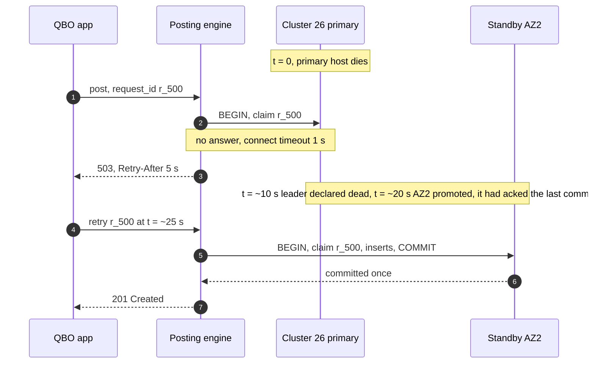

Data at risk: none committed (`ANY 1` sync). Meanwhile reports used a standby, with a stale banner. Requests that failed were never acknowledged, and their retries are idempotent. What the on-call sees: one failover page, error rate on cluster 26, then recovery.

**A balance row drifts.** Code paths only insert lines now, so drift comes from the trigger or a repair. t = 0: a balance-trigger release that adds year rows maps December lines of companies with a non-January fiscal year to the wrong year's row. t + 40 s: the verifier's per-transaction check, which maps lines to keys with its own independent code, finds `Σ (new − old) ≠ Σ lines` for those year keys and pages P2 with company, key and transaction. t + 15 min: on-call rolls the trigger function back to the previous version (a one-statement migration). t + 1 h: the repair job rebuilds the affected year rows from lines under the exclusive fence for the ~300 companies touched, audited, each ending with a targeted recompute. Customers saw wrong year totals for large-company reports for under an hour; no line was ever wrong. A repair that writes a stale recomputed value is caught the same way, by its own closing recompute.

**CDC stalls.** t = 0: the connector for cluster 26 hangs. t + 5 min: the firm dashboard's watermark for those companies passes 5 minutes and shows "data delayed". t + 15 min: slot lag pages. Posting is unaffected; the slot holds WAL, capped by `max_slot_wal_keep_size`. If the cap is hit, the slot is dropped, and the columnar copy for that shard is re-snapshotted from the replica (hours, during which dashboards for those companies say "rebuilding").

### 10.5 Exactly-once and idempotency end to end

| Hop | Where duplicates come from | Dedup key | Where removed | Lifetime |
|---|---|---|---|---|
| App or API client to posting engine | Timeouts, double clicks, retries across a failover | `(company_id, request_id)`, UUIDv7 | First insert of the posting transaction, in the partition of the id's own day; a repeat returns the stored response | 30 days; older ids rejected |
| Edit of a transaction | Two apps, a stale copy | `sync_token` | `TXN` row `FOR UPDATE`, compare-and-set | Life of the transaction |
| Import item (bank line, order) | Source re-sends, overlapping fetch windows, re-drive after a region failover | `(company_id, source_ref)` with a generation suffix | Unique on `TXN`; an undo bumps the generation | Forever |
| Kafka `imports-live` to engine | Offset committed after the DB commit | same `source_ref` | Same unique key | Forever |
| Bulk batch | Crash mid-batch, a resumed job overlapping a committed batch | 500 `source_ref`s | `ON CONFLICT DO NOTHING RETURNING`; entries and lines inserted only for returned rows, so the balance trigger sees only them | Forever |
| Shard move catch-up | Changes applied twice around the snapshot LSN | primary keys | Upserts by primary key with triggers off; balance rows copied as values; targeted recompute at the end | Move duration |
| CDC to columnar | At-least-once delivery, replays after a failover | primary key + `(timeline, LSN)` | Replacing merge, `argMax` by `(timeline, LSN)` | Retention of the copy |
| Verifier and repair | Repeated runs | balance key | Repair sets the recomputed value, so running it twice is the same as once | n/a |

The one trap is the bulk batch: entries and lines must be inserted only for the items the claim returned. Inserting them for the whole input would double-count the overlap after a resumed job (the trigger faithfully sums whatever lines arrive), and the verifier would page.

### 10.6 Consistency model per edge

| Edge | Model | Why |
|---|---|---|
| App to gateway to posting engine | Synchronous, idempotent on `request_id` | One effect per request |
| Posting engine to ledger shard | Strong: one transaction on one primary, sync standby | The balance invariant and the closing date |
| Report service to shard primary | Strong, read-your-writes | Interactive reports |
| Report service to standby | Read-your-writes by `min_commit` token, else fall back | Heavy reports |
| Shard directory to engines and report service | Cached copy, fenced by placement rows and epochs | A stale router can only reach a shard that refuses |
| Import service to engine (LIVE) | At-least-once delivery, exactly-once effect by `source_ref`, per-company order | Bank lines and orders arrive late and twice |
| Shard primary to standbys | Synchronous to one of two in-region | RPO 0 on AZ loss |
| Shard primary to cross-region replica | Asynchronous stream, but manual and API posts acknowledged only after it flushes | RPO 0 for typed posts; imports re-driven by source watermark |
| Shard to CDC to columnar | Eventual, p99 under 5 minutes, watermark shown | Cross-company views |
| Shard to verifier | Eventual, within ~1 minute; monthly snapshot recompute | Detection, not prevention |

### 10.7 Alternatives rejected

| Alternative | Why it looked attractive | Why rejected |
|---|---|---|
| Spanner or CockroachDB | No sharding code, global transactions, automatic splits | We have no cross-company transaction to pay for. Consensus on every commit adds latency and cost. Moving one company is easier with a directory than with automatic range splits keyed on our ids |
| TigerBeetle as the ledger store | Purpose-built double entry, immutable transfers, per-account `debits_posted` and `credits_posted`, very high throughput through batching | Built for money movement with fixed-size accounts and transfers. We need documents, versions, dimensions, backdating and as-of reports by accounting date. We would rebuild a GL beside it |
| Event sourcing with snapshots | History by construction | The journal already is the event log. Reports need aggregates by accounting date, which is exactly what the delta rows are |
| Balance deltas computed by the application, or a per-row trigger | Logic stays in the code that owns posting rules | A path that forgets a delta or applies it twice drifts silently; a per-row trigger would undo batching (one upsert per line). We use a statement-level trigger with transition tables instead (§10.1), and still verify |
| DynamoDB keyed by company | Serverless, scales writes | Multi-row transactions are limited in size, and reports need ordered range scans and SQL aggregation per company. A 500-transaction batch would not fit in one transaction |
| Every report on read replicas | Offload the primary | Breaks read-your-writes for ~0.4 core per cluster of savings |
| Cross-region synchronous replication inside `COMMIT` | One knob gives RPO 0 | The hot row stays locked for the round trip: ~500/s per row falls to ~100/s (nearby region) or ~14/s (cross-country). Waiting after `COMMIT` gives the same guarantee to the client |
| Per-shard sequences for ids | Built in, compact | Can re-issue ids after a cross-region promotion and collide when a company moves shards |
| One database per company | Perfect isolation | 8 M databases. Schema migrations, connection pools and backups multiply by 8 M |
| Closing entries at year end | What accounting textbooks show | Re-posting on every backdated change and fiscal-year change |

### 10.8 How the big companies do it

- **Stripe Ledger** models money movement as double-entry fund flows. "Each day, Ledger sees five billion events", and "99.99% of our dollar volume is fully ingested and verified within four days". Their emphasis is the same as our verifier's: correctness is checked continuously after the fact, as a data-quality system, not only inside each write ([stripe.dev](https://stripe.dev/blog/ledger-stripe-system-for-tracking-and-validating-money-movement)).
- **Square Books** is an immutable double-entry accounting database on Google Cloud Spanner, chosen so the team did not have to run sharding. Journal entries and book entries are "effectively append-only and immutable once stored", with balances cached on the book entries. At the time of the post it managed ~20 TB with a team of three ([Square developer blog](https://developer.squareup.com/blog/books-an-immutable-double-entry-accounting-database-service/)). Same immutability, the opposite storage choice, and a fair one for a team that size.
- **TigerBeetle** makes transfers immutable ("never modified once they are successfully created"), keeps `debits_posted` and `credits_posted` on each account, enforces limits with account flags such as `debits_must_not_exceed_credits`, and makes multi-transfer operations atomic with linked events. Its throughput comes from batching many transfers into one request, the same idea as our bulk batcher ([docs.tigerbeetle.com](https://docs.tigerbeetle.com/reference/transfer/)).
- **QuickBooks Online itself**, from its public docs: a JournalEntry is rejected when "the total amount on debit is not equal to total amount on credit"; entities carry a `SyncToken`; the closing date has two modes, "Allow changes after viewing a warning" and "...and entering password"; the audit log keeps events "for two years"; multicurrency rates update "every 4 hours", and once multicurrency is on it cannot be turned off and the home currency cannot change. Our design keeps the audit history 7+ years in an archive behind the 2-year product view.

### 10.9 Operational runbook

- **Dashboards (the five):** post rate, error rate and p50/p99 per cluster; lock wait time on balance rows, top 20 keys; report p99 by type and by planner branch; CDC slot lag and columnar watermark age per cluster; verifier lag and open mismatches.
- **Alerts:** as in §8. Plus: bulk backlog older than 24 h (ticket to the import team); a company over 10% of its cluster's writes or storage (ticket to plan a move); directory and placement disagreement (page).
- **Rollout:** posting-rule versions by company cohort after 24 h of shadow diffing; engine and report service one AZ at a time; schema changes expand-then-contract (add column, backfill, dual-write, switch reads, drop), never during the first 5 business days of a month, when bookkeepers close.
- **Rollback:** rule versions by cohort flag (entries posted under the bad version are found by `rule_version` and corrected by reversal plus re-post, an audited system action); code by redeploy; a shard move by moving back.

### 10.10 Security and abuse

- **Authentication.** Intuit identity for people; OAuth 2.0 for third-party apps, with tokens scoped to one company and to accounting scopes ([`../../concepts/oauth.md`](../../concepts/oauth.md)). The gateway takes `company_id` from the token; a path or body naming another company is a `403`, logged.
- **Authorization.** Roles per company (admin, standard, limited, reports-only, accountant). Closing-date changes and overrides need admin plus the closing password; the override token is single-use and bound to the request.
- **Tenant isolation in depth.** Every query goes through a data layer that sets `app.company_id` on the session, and Postgres row-level security policies on every table filter by it. A query that forgets `WHERE company_id = ?` returns nothing instead of another company's books.
- **PII (personally identifiable information) and encryption.** Names, addresses, bank account and tax identification numbers live in documents and the name list. TLS everywhere; storage encrypted with KMS keys; bank and tax ids additionally field-encrypted with a per-company data key, which is also what crypto-shredding destroys.
- **Audit.** Every change has an audit event in the same transaction, archived write-once for 7+ years, and daily Merkle roots make silent edits detectable. Support staff access to a company's books is itself an audited, time-limited grant.
- **Abuse.** Per-company and per-app rate limits at the gateway (QBO's public API throttles at 500 requests a minute per company; [Intuit developer help](https://help.developer.intuit.com/s/article/API-call-limits-and-throttling)); bulk imports have their own admission; a malicious app with a valid token can only write balanced entries into the one company it was granted, every write audited with its app id, and the company admin can revoke it.

### 10.11 Evolution

- **10x volume.** Split logical shards onto more clusters (the directory makes it a move, not a re-hash). Turn on year rows for more companies. Build the storage tiering seam. The posting engine and report service scale out.
- **Multi-region for latency or residency.** Each company gets a home region in the directory; EU, Canadian or Australian companies live on in-region clusters, with their CDC copy in-region too. No company ever spans regions, so nothing about the transaction changes.
- **A new reporting dimension** (projects, tags). Low cardinality goes into the balance key like class and location; high cardinality stays on lines with an index and in the columnar copy. Name the seam: the balance key definition.
- **Cash-basis reports.** A second set of delta rows keyed by payment date, written by the same transaction when a payment applies to an invoice. Same read path, different grain source.
- **GDPR (General Data Protection Regulation) erasure while retention applies.** Pseudonymize the name list and documents (the person), keep the amounts and accounts (the books), and crypto-shred after the retention period ends.
- **Consolidation across companies.** A consolidation ledger that reads each subsidiary's balance rows through CDC, adds elimination entries, and produces group reports; never a cross-shard transaction.

---

## 11. Follow-up questions to expect

Ranked by how likely an interviewer asks them. Answers in [`edge-cases.md`](edge-cases.md) and the deep dives.

1. **How do you guarantee every entry balances under retries and two apps?** §5.1, [`deep-dives/posting-engine-and-balance-invariant.md`](deep-dives/posting-engine-and-balance-invariant.md).
2. **The user edits last March's invoice. What rows do you write?** §4.2, [`deep-dives/edits-reversals-and-closed-periods.md`](deep-dives/edits-reversals-and-closed-periods.md).
3. **Balance sheet as of any date over 10 years in under 1 s?** §4.4, §5.2, [`deep-dives/fast-reports-period-balances.md`](deep-dives/fast-reports-period-balances.md).
4. **A backdated entry arrives into a closed year. What changes?** §4.3 and retained earnings at read, [`deep-dives/edits-reversals-and-closed-periods.md`](deep-dives/edits-reversals-and-closed-periods.md).
5. **One company syncs a million orders into two accounts.** §5.3, [`deep-dives/tenant-sharding-and-hot-tenants.md`](deep-dives/tenant-sharding-and-hot-tenants.md).
6. **How do you know the balance rows are right?** §5.4, [`deep-dives/audit-trail-and-continuous-verification.md`](deep-dives/audit-trail-and-continuous-verification.md).
7. **Move a company to another shard with zero downtime.** §5.5, [`deep-dives/tenant-sharding-and-hot-tenants.md`](deep-dives/tenant-sharding-and-hot-tenants.md).
8. **Euros balance, dollars do not. Who fixes the cent?** §5.1, [`deep-dives/posting-engine-and-balance-invariant.md`](deep-dives/posting-engine-and-balance-invariant.md).
9. **An accountant runs a report across 50 clients.** §5.6, [`edge-cases.md`](edge-cases.md).
10. **Why not read replicas, a report cache, Spanner, TigerBeetle or event sourcing?** §5.2 push-backs, §10.7.
11. **What does an auditor get, and how do they know nothing was changed?** §5.4, §10.10.

---

## 12. Presenting this as an Intuit case study

Intuit hands the problem out before the loop, and every round re-opens the deck ([`../company-questions.md`](../company-questions.md) §1). Scoping is graded, the AI part is graded everywhere, and security as a side note has failed candidates.

**The 10 slides.**
1. **The problem in one line**, and the three facts: the invariant is the product, accounting time is not system time, the company is the unit.
2. **Scope and what we cut.** In: post, immutable history, closing date, reports, multi-currency rounding. Cut: bank feeds, payroll, sales tax, inventory costing, consolidation, cash basis, and why each is a source or a seam, not a requirement.
3. **Numbers.** 2.4 B transactions a month, ~900/s, ~10k/s peak, 85 B lines a year, 58 TB a year, 160 commits/s per cluster: storage is the constraint, not QPS.
4. **Data model.** Documents, entries, insert-only lines, delta rows by month and day, keyed by company.
5. **The post.** One single-shard transaction, idempotent on `request_id`, invariant in the engine and the database.
6. **Edits and closed periods.** Reversal plus version; the closing date checked under the right lock; overrides audited.
7. **Reports.** Prefix sums, retained earnings at read, primary for read-your-writes.
8. **Scale and the red node.** The hot balance row, batching, the biggest tenant, shard moves.
9. **Correctness and security.** The verifier, daily roots, row-level security, OAuth scopes, PII encryption, audit.
10. **Operations and the AI story.** SLOs, pages, migration with rollback per phase, the categorization model with its guardrails.

**The AI story: one place a model does real work.** Categorizing incoming bank transactions. For each new bank line, a model proposes the account (and class, and payee) from the description, amount, the company's own history and similar companies' choices from the columnar copy. Guardrails: the output is a schema-checked suggestion whose account must exist, be active and have an allowed type in that company's chart of accounts; it never posts by itself into a closed period; amounts above a per-company threshold always need a human; the model and its version are stored on the audit event of the post it led to. Fallback: if the model does not answer in 200 ms, the review list shows the rule-based suggestion (the vendor's last category); the user experience degrades to the old behaviour, never to an error. The model only ever proposes; the posting engine still enforces balance, closing date and permissions, so the worst a bad model does is a wrong suggestion a human accepted, which is an ordinary, reversible edit.

**The security story.** Authentication: Intuit identity plus OAuth 2.0 tokens scoped to one company. Authorization: company roles; closing-date overrides need admin plus a password. Tenant isolation: company from the token, row-level security on every table. PII: names, addresses, bank and tax ids encrypted at rest with per-company keys; crypto-shredding at end of retention. Audit: every change attributed in the same transaction, archived write-once for 7+ years, daily Merkle roots for tamper evidence.

**Questions each round will re-open.**
- **Round 1, architecture:** why not Spanner; what exactly is in the post transaction; what happens when a primary dies mid-commit.
- **Round 2, data and correctness:** walk an edit of a closed-period invoice row by row; why deltas and not running balances; how the verifier compares without false alarms.
- **Round 3, scale and operations:** the hot row arithmetic and why not sub-buckets; a 12 M-order migration end to end; what pages at 3 AM and the SLOs.
- **Round 4, AI and security:** where the model can hurt the books and what stops it; how a third-party app is confined to one company; what an auditor receives and how they trust it.
