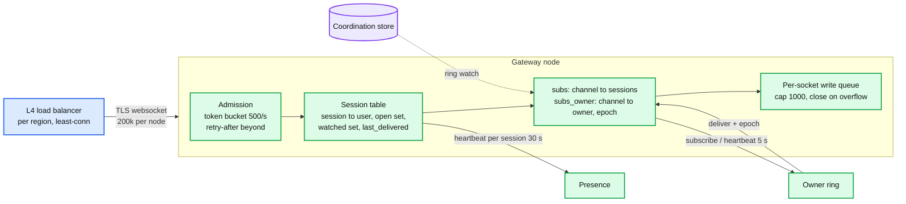
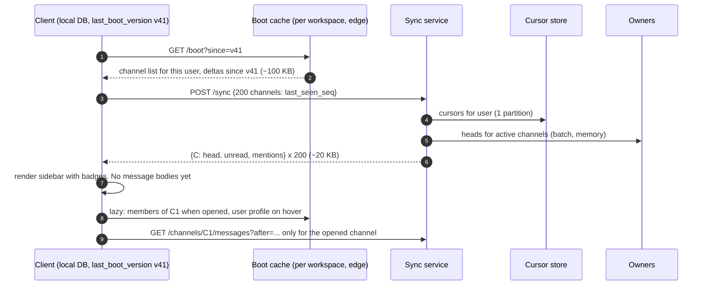

# Deep dive: connection layer, reconnect storms, and the boot payload

> One-line: the gateway holds sockets and subscription sets and nothing durable, so losing one is free; the two things that actually take a chat system down are the reconnect storm and the boot payload, and both are fixed with admission control, jittered backoff, a lazy per-workspace edge cache, and a `/sync` that returns numbers instead of messages.

Zoom-in on [`solution.md`](../solution.md) §5.3. Related: [`fan-out-and-large-channels.md`](fan-out-and-large-channels.md) (what flows into the gateway), [`sync-offline-multi-device.md`](sync-offline-multi-device.md) (what the client does after reconnecting).

---

## 1. What a gateway is

- Per socket: ~20 KB (TLS state, kernel buffers, two goroutines, the open and watched sets, `last_delivered` per open channel). 200 k sockets = 4 GB. Go or Netty on a 16-core box is comfortable; WhatsApp's 2 M per node in Erlang is a headline, not a requirement.
- The gateway is stateless with respect to durable data. It can be killed at any moment; the cost is the reconnect, nothing else.
- Regional: a user connects to the nearest region's gateways regardless of their workspace's home. The gateway talks to the home region's owners over the backbone (+80 ms cross-region).
- Sends do not go over the socket. HTTPS `POST` gets load balancing, retries, and idempotency for free; the socket is server-to-client plus `subscribe` and `ping`.

## 2. Connection lifecycle

| Event | Client | Server |
|---|---|---|
| Connect | Token in the first frame | Admission bucket, token check, session created, presence heartbeat started |
| Subscribe | `{open: [C1], watched: [C2..C200], presence: [users on screen]}` | Per-channel: add to `subs`, call owner on 0 -> 1 |
| Ping | every 30 s | 2 missed (60 s) = dead, session torn down, owner unsubscribes on 1 -> 0 after 60 s grace |
| Half-open | client sends nothing, TCP still "up" | Same ping rule catches it; kernel keepalive at 45 s as a second net |
| Drain | receives `reconnect(after: 0..30 s)` | Sent to 1% of sockets per second on deploy; node exits when empty or after 5 min |
| Disconnect | backoff: `min(60, 1 x 2^n)` x `random(0, 1)` (full jitter) | |
| Resume | `POST /sync` with cursor map, then subscribe | Gap rule fills anything pushed during the outage |

Why full jitter: 200 k clients with plain exponential backoff still bunch at 1 s, 2 s, 4 s. Full jitter spreads a storm roughly uniformly over the current window.

## 3. The reconnect storm, with numbers

Gateway dies with 200 k sockets. Without control: 200 k connects in ~1 s to the other 199 nodes (1 k/s each), each subscribing to ~200 channels = 40 M owner subscribes in a second, plus 200 k `/sync` calls. That is how Slack's May 2020 and January 2021 incidents grew: reconnects amplified into cache misses and network saturation.

With control:
- Client backoff with full jitter: connects spread over ~30 s -> ~7 k/s cluster-wide.
- Admission bucket 500/s per node: the fleet accepts 100 k/s, far above the storm; the bucket is there for the correlated case (a whole AZ, or a bad client release) where it replies `retry-after` instead of accepting and then falling over.
- Subscribe dedup per gateway: a gateway subscribes to a channel once regardless of how many of its sessions are in it. 200 k sessions x 200 channels collapses to the number of distinct channels on the node, ~1.5 M, over 30 s = 50 k/s across 100 owners. Fine.
- `/sync` reads only cursors (one partition per user) and heads (owner memory for active channels, channel table otherwise). 200 k calls over 30 s = 7 k/s, ~1.4 M point reads/s at the peak second, absorbed by a Redis cache in front of the cursor store.

The correlated worst case is a bad client release that reconnects in a tight loop. The defence is a server-side kill switch per client version that forces old clients into a fallback (poll `/sync` every 30 s, no socket). Slack's worst outages were client-amplified; this switch is cheap insurance.

## 4. The boot payload: Slack's Flannel problem

The original Slack client called `rtm.start`, which returned the whole workspace: every user, every channel, every membership. For a 30 k-user org that was ~30 MB per login. Monday 9 am for a 500 k-user org is 830 logins/s x 50 MB = 41 GB/s from one tenant. Slack built **Flannel** (2017), an application-level edge cache that holds the workspace model in memory near the user and answers lazy queries (autocomplete a user name, load the members of the channel you just opened) instead of shipping the whole model. Boot for that 30 k org dropped to well under 1 MB.

Rules that keep boot cheap:
- The client keeps a local database (Messenger's LightSpeed rewrite made SQLite the client's universal store) and asks for deltas by version.
- The user directory is never sent whole. Autocomplete and member lists are queries against the edge cache.
- `/sync` returns numbers, not messages. Two point reads per channel.
- Message bodies load per opened channel, paged.

Per login cost is O(channels the user is in), independent of workspace size. That is the invariant to state in the interview.

## 5. Load balancing and stickiness

- L4 (TCP) balancing with least-connections per region. No stickiness needed: the gateway is stateless, and subscriptions are re-established on reconnect. Stickiness would only make draining harder.
- Consistent routing is needed one layer down (channel -> owner), not here.
- Envoy or an L4 balancer in front; Slack moved its websocket edge from HAProxy to Envoy after the 2020 HAProxy state bug. The reason to care: the balancer must handle long-lived connections and draining without dropping in-flight frames.

## 6. Mobile specifics

- Background: iOS and Android kill the socket within seconds to minutes of backgrounding. Delivery to a backgrounded app is a push notification (APNs / FCM) carrying `(channel, seq, preview)`; the app reconnects and `/sync`s on foreground. Push is lossy and unordered; it is a wake-up, never the source of truth.
- Battery: 30 s ping is a compromise between detection time and radio wake-ups. Telegram and WhatsApp use similar intervals with server-side keepalive tuning.
- Roaming networks: NAT rebinding kills the socket silently; the ping rule catches it in 60 s; the client's own timer (no frame received in 45 s) reconnects sooner.

## 7. What pages and what does not

| Signal | Threshold | Action |
|---|---|---|
| Socket count drop | > 5% in 1 min per region | Page: storm starting, check admission and retry-after rates |
| Admission rejections | > 1% of connects for 5 min | Page: fleet undersized or correlated reconnect |
| Per-socket write queue closes | > 0.1% of sockets per min | Ticket: slow clients or a hot channel body flood |
| Owner subscribe errors (`NOT_OWNER` loops) | > 30 s | Page real-time: ring disagreement |
| Boot cache miss rate | > 10% | Ticket: cache warming or eviction misconfigured |

## 8. What to say in the interview, in order

1. "The gateway holds sockets and subscriptions, nothing durable. Killing one costs a reconnect."
2. "Reconnect is full-jitter backoff plus server admission with retry-after; subscriptions are deduped per gateway."
3. "Boot is O(the user's channels), never O(the workspace). Directory from a lazy edge cache; `/sync` returns heads, not bodies."
4. "The thing that actually kills Slack is client amplification. Server-side kill switch per client version."
