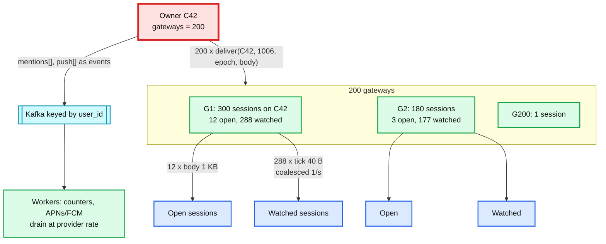
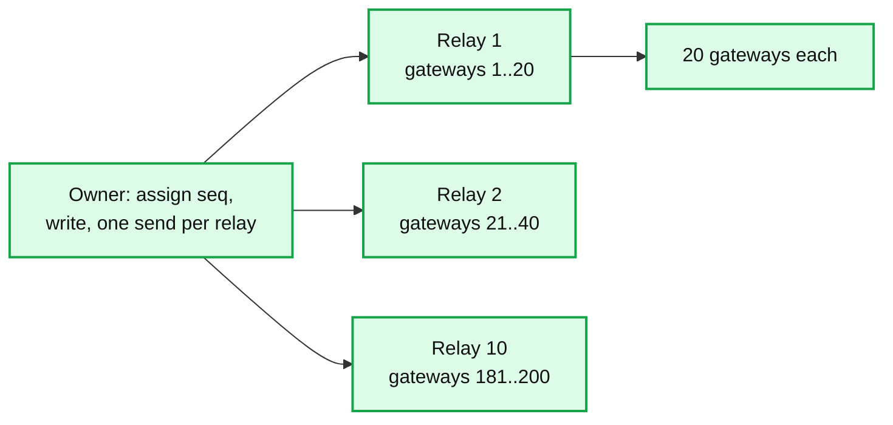

# Deep dive: fan-out and the 100k-member channel

> One-line: fan out once per gateway, not once per member; send bodies only to sessions with the channel open and a 40-byte tick to everyone else; bound every per-gateway queue and turn overflow into a pull, so the owner's cost per message is O(gateways) and never O(members).

Zoom-in on [`solution.md`](../solution.md) §4.2 and §5.2. Related: [`connection-layer.md`](connection-layer.md) (what the gateway does with a delivered event), [`presence.md`](presence.md) (the other N x M problem).

---

## 1. The cost model

Define for one message in channel C:
- `M` = members, `Mon` = online members, `G` = gateways with at least one online member of C, `Open` = online sessions with C on screen.

| Design | Owner sends | Bytes out of the owner | Socket writes |
|---|---|---|---|
| Fan-out per member (naive) | `Mon` | `Mon` x 1 KB | `Mon` |
| Broker pub/sub per socket | 1 to the broker, then broker does `Mon` | broker: `Mon` x 1 KB | `Mon` |
| **Per gateway, tick for watched** | `G` (<= 200) | `G` x 1 KB | `Open` x 1 KB + (`Mon` - `Open`) x 40 B |

For a 100 k channel with 40 k online, 200 gateways, and 500 sessions with it open:
- naive: 40 k sends, 40 MB, one process.
- per gateway: 200 sends, 200 KB from the owner; sockets get 0.5 MB of bodies plus 1.6 MB of ticks, spread over 200 machines.

That table is the whole answer to "what melts". The owner's per-message cost is now the same for a 100 k channel as for a 200-member one.

## 2. Subscription protocol between gateway and owner

- Gateway state: `subs[C] -> set(session)`, `subs_owner[C] -> (owner_id, epoch)`.
- On a session's `subscribe(C)`: add to `subs[C]`; if the set went 0 -> 1, call `Owner.subscribe(gateway_id, C, last_delivered_seq)`. The owner replies with `head_seq` and re-delivers anything above `last_delivered` from its `recent` cache (or tells the gateway to have clients pull if the gap is larger than 100).
- On 1 -> 0: schedule `unsubscribe` after 60 s; cancel if a session re-subscribes. Flapping users do not churn the owner.
- Gateway heartbeats every owner it has subscriptions on, every 5 s, with its total socket count. Owner drops a gateway after 3 misses.
- Owner state: `gateways[C] -> map(gateway_id -> queue)`. Max 200 entries per channel, no matter how big the channel.

Subscribing per gateway rather than per session is the same trick as Discord's Manifold ("batch by destination node") and Slack's gateway servers subscribing to channel servers on behalf of their connected users.

## 3. Open vs watched: ticks

A session declares at most ~5 channels **open** (on screen) and everything else **watched**. The gateway sends:
- open: the full event, in seq order, with the gap rule applied server-side too (`last_delivered[S][C]`).
- watched: `tick(C, head_seq)`, coalesced so a session receives at most one tick per channel per second. The client computes `unread = head - last_read` locally and updates the badge. When the user opens the channel the client does `GET after=last_seen`.

Why this is safe: the tick is just a hint. The correctness backstop is that the client pulls on open and on any gap. A lost tick delays a badge by up to the next tick or the next `/sync`; it never loses a message.

Why this matters more than it looks: a user in 200 channels would otherwise receive every message in all 200, most of which they will never read. Slack's boot problem was partly this: the old client subscribed to everything and received everything.

## 4. Backpressure: the rule that makes push safe

Every owner->gateway queue is bounded at 10 k events (~10 MB). On overflow the owner drops the whole queue for that gateway and enqueues a single `resync(C, head_seq)` per affected channel. The gateway forwards `resync` to its sessions on C; open sessions do `GET after=`, watched sessions treat it as a tick.

Consequences:
- A slow gateway degrades only its own clients, and only into a pull (bounded, `truncated` past 10 k).
- The owner's memory is bounded: 200 gateways x 10 MB = 2 GB worst case per channel, which is why we also cap outstanding bytes per owner node and shed the largest queues first.
- The owner never blocks on a socket write. Delivery is fire-and-forget into a queue; the queue's drainer does the network.

The same rule at the gateway->socket hop: per-socket write queue of 1 000 events; on overflow close the socket. The client reconnects with backoff and pulls. A stuck mobile client on a bad network cannot hold gateway memory.

## 5. `@channel` and the side effects of one message

A message has three side effects proportional to `M`, not `G`: mention counter increments, push notifications, and (for search) one index document. None of them are on the send path.

- The owner emits `mentioned(C, seq, user_ids[])` and `notify(C, seq, user_ids[])` to Kafka, keyed by `user_id`. For `@channel` the owner emits one event with a `broadcast: true` flag and the worker expands it against membership in pages of 1 000, so the owner never enumerates 100 k users.
- Workers increment `unread_mentions` in the cursor store (50 k writes/s capacity, so 100 k increments take ~2 s) and call APNs/FCM at the provider's rate (thousands/s per connection). Push notifications for a `@channel` are additionally collapsed per user per channel per minute; nobody needs 30 notifications from one channel.
- Product rule: `@channel` and `@here` above 1 k members require a role. This is how Slack actually caps it.

The read storm after `@channel`: 40 k clients open the channel within seconds and `GET after=`. The owner's `recent` cache (last 100 messages) answers the common case with no store read; the API tier coalesces identical in-flight reads to one store call (Discord's data service does this for hot partitions).

## 6. The ceiling and what is beyond it

One actor per channel caps a single channel at roughly:
- appends: ~20 k/s (batched LWT every 5 ms),
- deliveries: ~200 k gateway sends/s per owner node, shared across that node's channels.

A channel at 1 k sends/s with 200 gateways is 200 k sends/s: the node's whole budget. The per-channel rate limit (1 k/s) is set exactly there and is 100x any human channel. Beyond it (a live event with a million viewers chatting):

The seam already exists: the actor separates "assign + write" from "deliver". The relay layer replaces the per-gateway queues with per-relay queues. Slack does not need this for chat; Discord effectively has it for the largest guilds.

## 7. Fan-out on read, honestly

"Fan-out on read for large channels" is often offered. In this design it already exists in two places: ticks (members pull bodies when they open the channel) and `/sync` (a returning device pulls heads). Pure fan-out on read (no push at all for big channels) would trade sub-second delivery for polling and is not needed once fan-out is per gateway. Name it as the fallback and say why it is not the primary path.

## 8. What to say in the interview, in order

1. "The owner fans out once per gateway, not per member. A 100 k channel is 200 sends."
2. "Bodies only to open sessions, a tick to the rest, coalesced to 1/s."
3. "Every queue is bounded; overflow becomes a resync, so push degrades into pull, never into blocking."
4. "Mentions and push go through Kafka off the send path; `@channel` needs a role above 1 k members."
5. "The ceiling is one actor per channel; the per-channel rate limit sits under it; a relay split is the next seam."
