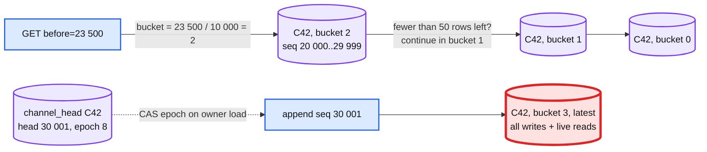

# Deep dive: message storage, partitioning, retention, and the Vitess migration

> One-line: partition messages by `(channel_id, seq / 10 000)` so every hot path is a single-partition read, use a conditional quorum write as the ordering fence, tier rows older than a year to object storage, and treat the store as replaceable (wide-column or Vitess-sharded MySQL) as long as the partition key is the channel.

Zoom-in on [`solution.md`](../solution.md) §5.4. Related: [`ordering-and-sequencer.md`](ordering-and-sequencer.md) (the writer), [`sync-offline-multi-device.md`](sync-offline-multi-device.md) (the reader).

---

## 1. Access patterns first

| Pattern | Rate at peak | Shape |
|---|---|---|
| Append | 350 k/s (batched to ~70 k LWT/s) | one partition, conditional |
| Page back (`before`) | ~500 k/s | one partition, 50 rows, clustered desc |
| Catch-up (`after`) | ~1.5 M/s in a storm | one partition, up to 200 rows |
| Head lookup | in owner memory; store fallback ~100 k/s | point read on `channel_head` |
| Cursor read at boot | 170 k/s | one partition per user |
| Dedup lookup | rare (after owner failover) | point read |
| Edit / delete | ~1% of appends | one partition, two rows |

Everything except cursors is keyed by channel. Nothing scans across channels on a user path. Search is a separate index fed by CDC.

## 2. Schema (wide-column shape)

```
messages     ((channel_id, bucket), seq DESC) -> client_msg_id, sender_id, ts, type, body, target_seq, thread_parent_seq, deleted, epoch
channel_head ((channel_id)) -> head_seq, owner_epoch, bucket_divisor, split_seq
dedup        ((channel_id), client_msg_id) -> seq        TTL 24 h
cursors      ((user_id), channel_id) -> last_read_seq, unread_mentions
membership   ((channel_id), user_id) -> joined_at, role
```

`bucket = seq / bucket_divisor` (default 10 000). At ~1 KB per row a full bucket is ~10 MB, well under the 100 MB partition guideline with room for 40 KB messages and reactions.



## 3. Seq buckets vs time buckets

Discord partitions by `(channel_id, bucket)` with a bucket of ~10 days of Snowflake time. It bounds partition size for busy channels, but a quiet channel has hundreds of empty buckets, and paging back must probe each; Discord added tracking of which buckets are non-empty to avoid the probes. With a server-assigned seq the bucket can be a function of the seq instead:

| | Time bucket | Seq bucket |
|---|---|---|
| Partition size | bounded above only if the rate is bounded; a 1 k/s channel makes 800 M rows per 10 days | always <= divisor rows |
| Empty partitions | many for quiet channels | none: every bucket below the latest is full |
| Locating a seq | needs a `ts` for the seq, or an index | arithmetic on the client |
| Changing the scheme | rewrite | `split_seq` in `channel_head`: old divisor below, new above; no backfill |

The only cost of seq buckets is that you must own the seq, which we do. Push back on "use Discord's scheme" with this table.

## 4. The write: conditional, quorum, batched

- `INSERT ... IF NOT EXISTS` at LOCAL_QUORUM, RF 3, one replica per AZ. In Cassandra this is a lightweight transaction (Paxos, ~4 round trips inside the cluster, ~5 to 10 ms); in ScyllaDB the same with less tail; in a Raft-per-range store (CockroachDB, TiKV, Spanner) it is a normal conditional write with the same guarantee.
- The owner batches per channel (5 ms or 100 rows) into one single-partition batch that also updates `channel_head` with `IF owner_epoch = ?`. Single-partition batches are atomic, so message rows and head advance together, and a stale owner's batch fails as a unit.
- Ack after quorum. AZ loss never loses an acked row.
- Edit and delete: the mutation event is a new row (`type = edit`, `target_seq`) and the target row is updated in place in the same batch. Both the log view (for catch-up) and the materialised view (for paging) are written once, atomically.

## 5. Hot partition

The latest bucket of a busy channel takes every write and every live read for that channel. At 10 sends/s and 1 k reads/s it is nothing. The two real cases:
- **Bot flood** at 1 k sends/s: ~10 batched LWT/s (5 ms window x 100 rows) is fine; the per-channel limit sits at 1 k/s, so the partition never sees more.
- **Read storm** after `@channel`: 40 k `GET after=` in seconds on one partition. The owner's `recent` cache (last 100 rows) serves most of them without touching the store; the API coalesces identical in-flight reads (Discord's Rust data service does this in front of ScyllaDB and it was the fix that made their hot partitions survivable).

Cassandra-family stores also let a partition's replicas take reads at LOCAL_ONE for history paging (stale by milliseconds, acceptable), which triples read capacity on the hot partition. Never for `channel_head`.

## 6. Retention and tiering

- Row TTL from the workspace policy (default none). Retention change: background job sets TTL per bucket, oldest first; cold-tier files deleted.
- Hot tier: 1 year on NVMe. 3.3 PB raw/yr is too much to keep forever at NVMe prices.
- Cold tier: rows older than 1 year rewritten as Parquet by `(channel_id, bucket)` in object storage (one file per bucket, ~10 MB compressed to ~3 MB). Paging past the hot tier: the API reads the file for the computed bucket, p99 seconds. Because the bucket is arithmetic on the seq, the cold path needs no index either.
- Compaction: leveled (read-heavy, small partitions). Tombstones from deletes are ~1% of rows; `gc_grace_seconds` 3 days with repair on schedule.
- Search index: a Kafka `index` topic keyed by channel, consumed into a per-workspace Elasticsearch / OpenSearch index with the channel's membership as a filter term; permission filtering at query time by the caller's channel list; lag target < 5 s. Deletes and retention apply the same events. Not part of the 45-minute answer beyond this paragraph.

## 7. Slack's actual path: workspace shards to Vitess

Slack started with MySQL sharded by **workspace**: one shard held everything for a set of workspaces. It broke in two ways:
1. **Hot shards**: a 100 k-user workspace on the same shard as a thousand small ones starved them. Balancing by moving whole workspaces is coarse and slow.
2. **Shared channels**: a channel belonging to two workspaces has no single workspace shard. The model could not express the product.

The move (2017 to 2020) was to **Vitess**, with per-table sharding keys chosen by access pattern: messages and channel membership by `channel_id`, users by `workspace_id` or `user_id`. Vitess gave online resharding (VReplication copies and tails a shard split while the old shard serves), so hot channels could be split away without downtime. Slack reported the datastore serving multi-million QPS on thousands of shards after the migration. Our design keeps the same invariant (partition by channel) and only changes the engine.

Migration mechanics with a rollback at each phase (D12 in [`diagrams.md`](../diagrams.md)):
1. **Shadow**: the owner ring assigns seqs and writes the new store; the old path stays authoritative and acks. Nightly diff counts and order per channel.
2. **Dual read**: 1% of channels page history from the new store; results diffed against old in the background. Flag off = rollback.
3. **Backfill**: copy historical rows per channel, assigning seqs in `ts` order (ties broken by the old primary key so it is deterministic). Verify counts. Set `head_seq` above the max.
4. **Cutover per workspace**: new path authoritative; dual-write to old for 14 days. Flag back = rollback; the old store is current because of the dual-write.
5. **Retire**: stop old writes, archive.

The step people forget: backfilled rows have no `client_msg_id`; the dedup table starts empty, which is fine because nothing older than 24 h is retried.

## 8. Engine choice, stated as a trade-off

| | Wide-column (Cassandra / Scylla) | Vitess-sharded MySQL (Slack) | Raft KV (CockroachDB / TiKV) |
|---|---|---|---|
| Conditional write | LWT, Paxos per partition, ~5 to 10 ms | Row lock in a transaction, ~2 ms in-shard | Raft write, ~2 to 5 ms |
| Partition bound | must bucket | must reshard by hand (VReplication) | ranges split automatically |
| Multi-AZ durability | RF 3 quorum, native | semi-sync replication | Raft quorum, native |
| Operational fit | large clusters, TTL native | teams that already run MySQL | strongest consistency, newer ops story |

Any of the three works. The interview answer is the partition key and the fence, not the vendor.

## 9. What to say in the interview, in order

1. "Partition by channel, bucket by seq so every partition is bounded and every hot path is one partition."
2. "The conditional quorum write is the fence; the owner batches so a hot channel pays one round per 5 ms."
3. "Hot partition is the latest bucket of a busy channel; owner cache and read coalescing handle the read storm; the rate limit handles the write."
4. "One year hot, then Parquet by bucket in object storage; the bucket is arithmetic so the cold path needs no index."
5. "Slack went workspace shards to channel-keyed Vitess for hot shards and shared channels; migrate with shadow, dual-read, backfill, per-workspace cutover, each with a flag rollback."
