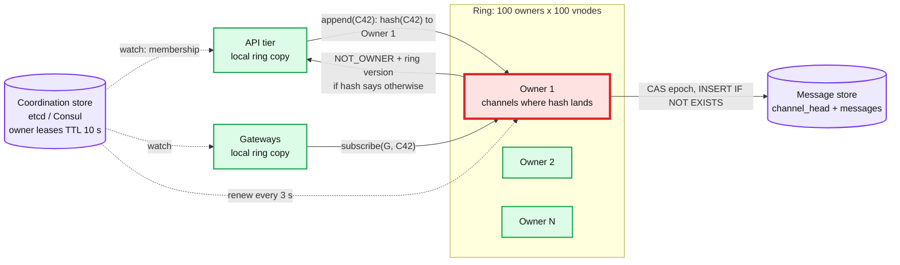
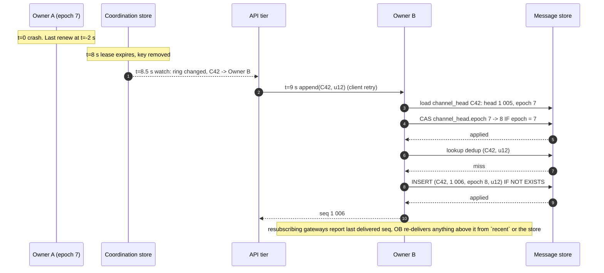

# Deep dive: per-channel ordering and the channel owner

> One-line: order in a channel is decided by exactly one process at a time, the leased channel owner, and the message store's conditional write on `(channel_id, seq)` is what makes a stale owner harmless.

Zoom-in on [`solution.md`](../solution.md) §4.1 and §5.1. Related: [`fan-out-and-large-channels.md`](fan-out-and-large-channels.md) (what the owner does after the write), [`message-storage.md`](message-storage.md) (the partition the fence lives in).

---

## 1. What "ordered" has to mean

The requirement is: every reader of channel C sees the same sequence of messages, with no gaps and no reordering after delivery. Three weaker things are often offered instead, and each fails a specific interview follow-up:

| Offered | Fails on |
|---|---|
| Client timestamp | Clock skew; two clients in the same ms; a client with a wrong clock inserting into the past |
| Server receive timestamp on any API node | Two API nodes, two clocks, same ms; no gap detection possible |
| Snowflake / KSUID id | Unique and roughly time-ordered, but ties in one ms are broken by worker id; readers cannot detect a missing id |
| Kafka partition offset | Correct order, but 500 M channels do not get 500 M partitions; hashing many channels to one partition serialises unrelated channels behind each other; offset is only known after the produce ack, so a stateful hop is still needed to return it to the sender |

A gapless per-channel integer has one more property the others lack: **the reader can prove completeness**. Holding 1 000 and receiving 1 002 means 1 001 is missing. That property is what makes reconnect sync, multi-device, and edit ordering cheap. Telegram's `pts` and Iris's queue position are the same idea.

## 2. The owner ring



- Each owner node registers an ephemeral key with a 10 s lease and renews every 3 s. The ring is the sorted set of live keys, 100 virtual nodes each, so adding or losing a node moves ~1/N of channels.
- API servers and gateways watch the key prefix and rebuild the ring locally. Lookups never touch the coordination store.
- An owner that receives a call for a channel the current ring does not assign to it answers `NOT_OWNER` with its ring version; the caller refreshes and retries. This handles the seconds of disagreement during a ring change.
- Slack's channel servers are this shape: consistent hashing managed by Consul, no consensus inside the channel server.

## 3. The actor: what one channel's state is

Per active channel the owner holds an actor with a mailbox:

```
head_seq        last assigned seq (loaded from channel_head at start)
owner_epoch     fencing token, CAS-incremented at load
dedup_lru       last 1 000 client_msg_id -> seq
recent          last 100 messages (serves GET after= for hot reads)
gateways        set of gateway_id subscribed, with per-gateway bounded queue
members_cache   member count + membership bloom, 60 s TTL
```

Append handling, in order:
1. `dedup_lru.get(client_msg_id)` -> return existing seq if hit.
2. `seq = ++head_seq`. Put in the current batch.
3. Batch flushes at 5 ms or 100 rows: one single-partition `BATCH` of `INSERT ... IF NOT EXISTS` rows at LOCAL_QUORUM (the batch is one Paxos round because all rows share the partition).
4. On `applied`: update `channel_head.head_seq` (same batch), ack each sender, insert into `recent`, enqueue `deliver` per gateway.
5. On `not applied` (a row already existed): the actor is stale or something wrote behind its back. It fences itself: unload, reply `NOT_OWNER`, let the caller retry against whatever the ring says now.

Batching is why one actor handles 20 k sends/s on a hot channel with one LWT every 5 ms instead of 20 k LWTs/s.

## 4. Failover, step by step



Numbers: detection 8 to 10 s, propagation ~0.5 s, actor load ~5 ms (two point reads and a CAS). Worst case ~11 s during which sends to that ~1% of channels get retried by clients. Receive of already-delivered messages is unaffected. Reads from the store are unaffected.

To make failover sub-second: graceful handoff on planned drains (the leaving owner sends `head_seq` and `epoch` to the successor directly and stops), and a shorter lease (5 s) if GC pauses allow. Sub-second unplanned failover needs a replicated owner (Raft group per ring shard, or a warm standby that tails the batches), which is the §10.11 evolution, not the day-one design.

## 5. Why a stale owner is harmless: two fences

Assume Owner A was partitioned, not dead, and wakes up believing it owns C42.

1. **Epoch fence.** A's writes carry `epoch 7`. `channel_head.epoch` is 8. The batch includes a conditional update on `channel_head` (`IF epoch = 7`), which fails, and since the batch is atomic the message rows do not apply either.
2. **Seq fence.** Even without the epoch check, A would try `(C42, 1 006) IF NOT EXISTS` and B already wrote 1 006. Fails.

Either alone is sufficient for the store. The epoch is still needed for the delivery path: A might push a stale in-memory event to a gateway. Every `deliver` carries the epoch; gateways track the highest epoch seen per channel and drop lower ones. So a stale owner can neither commit nor deliver anything the new owner did not.

What A can do: ack a client for a seq it committed **before** losing the lease, which is correct, because that row is durable and the new owner sees it.

## 6. Clock skew, GC pauses, and the lease

- Leases are relative durations on the coordination store's clock, not wall-clock deadlines compared across machines. An owner considers itself fenced when its own renew fails or when it has not heard a renew ack in TTL minus margin (7 s). A 6 s GC pause is tolerated; a 12 s pause means the owner wakes fenced, which is correct.
- The gap between "owner believes it holds the lease" and "store believes so" is exactly why the store's conditional writes are the real fence. The lease is a liveness optimisation (avoid two owners fighting), not the safety mechanism.

## 7. Why not the alternatives, briefly

| Alternative | Verdict |
|---|---|
| DB `UPDATE head_seq = head_seq + 1` per message | Correct; no batching, no shedding, DB is the hot spot. The "Good" rung |
| Raft group per shard of channels | Sub-second failover; a second consensus system to operate; the store already fences. Evolution path |
| Kafka partition per channel hash | Serialises unrelated channels; offset returned after produce needs a stateful hop anyway; Kafka stays the side channel |
| Per-channel Redis INCR | Fast, but Redis is not the durable store, so seq and row can diverge on Redis failover. If used, treat it as the owner's cache and keep the LWT |
| Client-side vector clocks / CRDT order | Causal but not total; different devices render different orders. Fine for E2E apps, not for Slack |

## 8. What to say in the interview, in order

1. "The sequencer is the consistency boundary. One leased owner per channel, in memory."
2. "The store's conditional write on `(channel, seq)` is the fence. A stale owner cannot commit."
3. "Failover is lease TTL plus a CAS on the epoch, about 10 s, and the client retry is deduped by id."
4. "Everything downstream (sync, unread, multi-device) is `after seq N`, which is why I insist on gapless integers."
