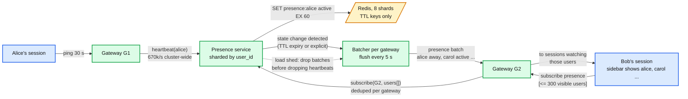

# Deep dive: presence and typing

> One-line: presence is a cost problem, not a consistency problem; make it heartbeat-driven with a TTL, deliver it only to the sessions that are looking at the user, batch it every few seconds, give it its own SLO, and shed it first under load so it can never take messages down with it.

Zoom-in on [`solution.md`](../solution.md) §4.5. Related: [`fan-out-and-large-channels.md`](fan-out-and-large-channels.md) (the other fan-out), [`connection-layer.md`](connection-layer.md) (where heartbeats come from).

---

## 1. The math that rules out broadcast

Workspace of `N` users, each watching all others: a status flip fans out to `N` watchers. Flip rate `r` per user per minute.

```
N = 100 000, r = 1 %/min  ->  1 000 flips/min x 100 000 watchers = 100 M updates/min = 1.7 M/s
20 M online users overall, same rate -> the presence stream would be several times the message stream
```

Every design that promises exact, instant presence for everyone has to pay N x M. No production system does. Slack sends presence only for users on the client's screen; Discord lazy-loads member lists and presence for large guilds and had to build Manifold batching after presence storms; WhatsApp reduced it to "last seen" timestamps.

## 2. Design



- **State**: `presence:{user_id} -> active | away, last_active` in Redis with a 60 s TTL. Heartbeats every 30 s refresh it. Expiry means away. Explicit "set away" or "do not disturb" is a write with the same TTL refreshed by heartbeats. Nothing durable; on Redis loss everyone is "unknown" for 60 s until heartbeats rebuild it.
- **Subscriptions**: a session subscribes to at most ~300 users (the sidebar plus the open channel's visible members). The gateway dedups per user across its sessions and subscribes to the presence service once per (gateway, user). The presence service keeps `watchers[user_id] -> set(gateway_id)`.
- **Delivery**: on a state change the service enqueues `(user, state)` to each watching gateway's batch; batches flush every 5 s (or at 1 000 entries). The gateway maps entries to sessions. A flip is visible within 5 s; nobody can perceive faster for a status dot.
- **Numbers**: 20 M online x 1 heartbeat / 30 s = 670 k `SET EX`/s across 8 Redis shards, ~85 k/s each. State changes ~20 M x 1%/min = 3.3 k/s, each to a handful of gateways. Trivial next to messages.

## 3. Load shedding order

Presence and typing are the first things dropped, in this order:
1. Typing events (never queued; dropped at the owner if the gateway queue is above 50%).
2. Presence batches (a batch may be skipped; the next batch carries the current state anyway, since it is state, not events).
3. Heartbeat processing (never dropped; if it were, everyone would go away at once, which is itself a storm).

Because presence is state, skipping a batch loses nothing: the next one is the full current state for the changed users. This is why presence is modeled as TTL keys rather than as an event log.

## 4. Typing

- `typing(C)` from a client every 3 s while typing, sent over the socket. The gateway forwards to the owner of C, which sends it to gateways with **open** sessions on C only (never watched). Gateways forward to open sessions. Nothing is stored. The client shows "is typing" for 5 s after the last event.
- A 100 k channel with 500 open sessions: one typing event is ~50 gateway sends and 500 socket writes every 3 s per typist. Cap at 3 concurrent typists shown; beyond that show "several people are typing" and stop forwarding individual events.

## 5. Push interaction

Presence feeds push suppression: if a user is `active` on any device, mobile push notifications are collapsed or skipped (Slack's default behaviour). This is the one place presence affects something that matters, so the rule errs toward sending: unknown presence means send the push.

## 6. Failure modes

| Failure | Effect | Handling |
|---|---|---|
| Redis shard down | 1/8 of users show unknown | Clients render unknown as away; heartbeats rebuild in 60 s after recovery |
| Presence service node down | Its watchers get no batches | Gateways resubscribe on reconnect to another node; state is in Redis, not in the node |
| Heartbeat flood on reconnect storm | 200 k heartbeats in a burst | Coalesced per gateway per 5 s; Redis pipelining |
| Flapping (mobile radio) | active / away every 30 s | Hysteresis: away needs 60 s silence, active is immediate; clients debounce the dot for 10 s |
| Subscription storm (user opens a 5 k member list) | 5 k subscribes | Cap 300 visible per session; the member list beyond the viewport shows no dot until scrolled into view |

## 7. Why this is a separate service and team

Presence has a different SLO (99.9%, staleness up to 60 s), a different data model (TTL keys, no history), and a different failure mode (cosmetic). Putting it in the owner or the gateway couples the worst-behaved traffic (heartbeats, flaps, subscription churn) with the traffic that must never fail. Slack runs presence servers separately from channel servers for this reason. Say this as an org boundary, not just a box.

## 8. What to say in the interview, in order

1. "Exact presence is N x M. For a 100 k workspace that is 1.7 M updates/s. Nobody builds that."
2. "Heartbeat sets a 60 s TTL key. Expiry is away. Redis, nothing durable."
3. "Subscribe to the users on screen, at most a few hundred. Batch every 5 s. State, not events, so a dropped batch loses nothing."
4. "Shed typing first, then presence batches, never heartbeats. Separate service, separate SLO, separate pager."
