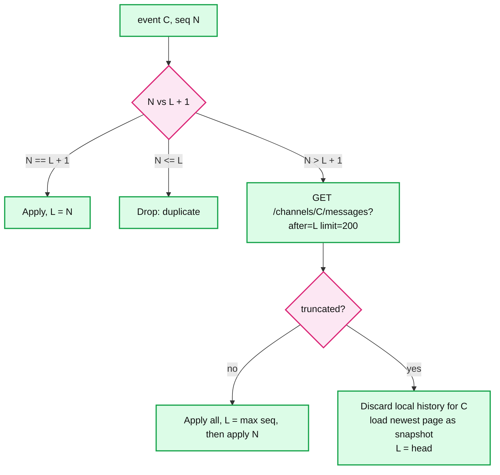
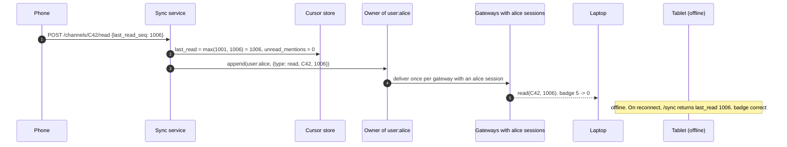

# Deep dive: sync, offline delivery, multi-device, and unread counts

> One-line: every device keeps `last_seen_seq` per channel and asks "everything after N"; the user (not the device) keeps `last_read_seq` per channel; unread is the difference of two numbers; read state converges across devices by fanning the cursor change through the user's own topic. Push is a hint, pull is the truth.

Zoom-in on [`solution.md`](../solution.md) §4.3 and §4.4. Related: [`ordering-and-sequencer.md`](ordering-and-sequencer.md) (where the numbers come from), [`connection-layer.md`](connection-layer.md) (the boot path).

---

## 1. Two cursors, deliberately different scopes

| Cursor | Scope | Written by | Meaning |
|---|---|---|---|
| `last_seen_seq[C]` | per **device**, local only | the client, on every event it renders or pulls | "I hold everything up to here"; drives the gap rule and `GET after=` |
| `last_read_seq[C]` | per **user**, durable server-side | `POST /read`, monotonic max | "the human has read up to here"; drives unread and badges |

Keeping delivery state per device and read state per user is what makes 5 devices cheap: the server tracks one number per (user, channel), not five, and devices are free to be at different `last_seen` positions.

Discord, Slack, and Telegram all converge on this shape; Messenger's Iris keeps a per-device queue position, which is the same delivery cursor with a per-device server-side copy (useful when the server cannot read the payload, as in E2E apps).

## 2. The gap rule (Telegram `pts`, made explicit)

On any event for channel C with `seq N`, the client compares with `last_seen[C] = L`:

Properties:
- Duplicates from any hop (owner re-delivery after failover, socket flap, two gateways during overlap) are dropped for free.
- A lost push is detected by the next push or by `/sync`, never silently.
- Catch-up is bounded: `truncated` at 10 000 messages behind. A device off for a week in a 50 k-message channel gets a snapshot, not 50 k rows.
- The server applies the same rule per open session (`last_delivered[S][C]`) so it does not waste socket bytes on things the client already has.

## 3. Reconnect: `/sync` returns numbers

`POST /sync {C1: 990, C2: 4410, ...}` (up to 500 channels) returns per channel `{head_seq, unread, unread_mentions}`. Cost: cursors are one partition read per user; heads come from owner memory for active channels and from the channel table otherwise. ~20 KB response. No bodies.

Then the client:
1. Renders the sidebar with badges (`unread = head - last_read`).
2. Subscribes: open channels + watched channels.
3. Pulls bodies only for open channels (`GET after=last_seen`).
4. Watched channels with `head > last_seen` show a badge; bodies load when opened.

A 200-channel user costs 400 point reads and one round trip. Compare with "refetch the last 50 of every channel": 10 MB and 200 range scans.

## 4. Unread without counters

`unread[C] = head_seq[C] - last_read_seq[C]`, computed client-side from ticks and `/sync`, never stored. One write per **read action** (cursor advance), zero writes per message. Correctness under concurrency:
- A message arriving while the user is reading: the client advances `last_read` to the newest seq it has rendered as read, which is a `max`, so a late tick cannot push the badge negative.
- A stale device reporting an old cursor: `SET last_read = max(current, new)` at the sync service (read-then-conditional-write). Cursors never go backwards.
- Deleted messages: a tombstone keeps its seq, so the subtraction stays right. "Unread" may count a deleted message for one refresh; acceptable and invisible in practice.

Mentions are the exception because they need a count of messages that mention *me*, which no subtraction expresses. `unread_mentions` is a per-(user, channel) counter incremented by a Kafka worker only for mention events (keyed by user_id so one user's increments are ordered), zeroed by `POST /read`. Eventual, seconds under a `@channel` storm. This is the only counter in the system and it is off the send path.

## 5. Multi-device convergence

The user topic `user:{id}` is an ordinary channel on the owner ring whose only members are the user's sessions. It carries read events, preference changes, "you were added to channel X", and typing-in-DM hints. Reusing the message path means multi-device sync inherits ordering, dedup, and backpressure with no new machinery.

Delivery vs read: a message is "delivered" per device (each device pulls or receives it) and "read" per user (one cursor). Ticks show "delivered" (badge appears); `read` events clear it everywhere. A push notification tapped on the phone does not mark read until the app actually opens the channel, or the laptop clears a badge for something nobody looked at.

## 6. Offline delivery and push notifications

- The server keeps no per-device queue. Offline delivery is the message store plus the device's cursor. This is why per-user inboxes (Iris-style, one row per member per message) are unnecessary here: the channel partition already is the queue, and the cursor already is the position.
- Push notifications (APNs, FCM) carry `(channel_id, seq, preview)` and are a wake-up. They are best-effort, unordered, and may be dropped by the provider or the OS. The app never renders from push alone; it reconnects and `/sync`s. The phone dedups notifications by `(channel, seq)`.
- Push volume control: collapse per user per channel per minute; respect do-not-disturb server-side; skip push for a user who is active on another device (presence says active in the last 60 s), which is what Slack does and what cuts push volume by more than half.

## 7. Retention interaction

A device whose cursor is below the retention floor (rows expired) gets `truncated` and snapshots. A device that was offline longer than the dedup window (24 h) and retries an unsent message will create a duplicate; clients ask the user before retrying anything older than 1 h.

## 8. Threads

A thread is a child channel `thread:{C}:{parent_seq}` on the same ring. It has its own seq, cursor, and unread. The parent channel's tick carries a `thread_activity` flag so "threads" badges work without subscribing to every thread. A reply also bumps a `reply_count` on the parent row (in the same owner batch since the parent and thread share the owner by construction: hash on the parent channel id).

## 9. What to say in the interview, in order

1. "Delivery cursor per device, read cursor per user. Two numbers, different scopes."
2. "Gap rule: apply only `L + 1`, drop below, pull above, snapshot past 10 k."
3. "`/sync` returns heads and unreads, not messages. O(channels), 20 KB."
4. "Unread is head minus cursor. The only counter is mentions, via Kafka, eventual."
5. "Read state fans out on the user's own topic, same path as a message, so five devices converge in one delivery latency."
6. "Push is a wake-up. Never the truth."
