# Diagrams: Slack / large-scale messaging platform

The D1 to D12 set from `hld/CLAUDE.md` §4. Diagrams already embedded in [`solution.md`](solution.md) are linked, not pasted twice. Colors per root `CLAUDE.md` §3. Red is only for the thing that breaks first: the owner of a hot channel.

| # | Diagram | Where |
|---|---|---|
| D1 | Context | below |
| D2 | Data flow | below |
| D3 | Component architecture | [`solution.md` §6](solution.md#6-final-design) |
| D4 | Happy path per FR | FR1 send and FR3 sync in `solution.md` §4.1 and §4.3; FR2 receive, FR4 unread, FR5 presence below |
| D5 | Failure paths | owner failover in §5.1, gateway death and region loss in §10.4; slow gateway resync and duplicate send below |
| D6 | Decision flow: gateway delivery | below |
| D7 | Entity relationship | [`solution.md` §3.3](solution.md#33-data-model) |
| D8 | State machines: message, socket session, owner actor | below |
| D9 | Deployment topology | below |
| D10 | Scaling and partitioning | below |
| D11 | Failure mode map | below |
| D12 | Migration from workspace sharding | below |

---

## D1. Context

Our system is one box. Everything around it and what flows on each edge.

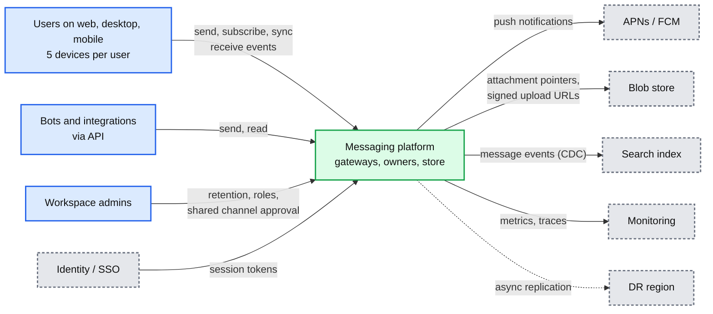

## D2. Data flow

Inputs to outputs with name, format, size, and rate at peak.

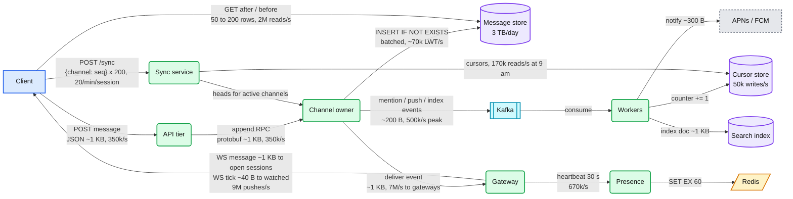

## D3. Component architecture

See [`solution.md` §6](solution.md#6-final-design).

## D4. Happy paths per FR

FR1 send: [`solution.md` §4.1](solution.md#41-send-a-message-who-decides-the-order-and-is-it-durable). FR3 sync: [`solution.md` §4.3](solution.md#43-history-and-reconnect-sync).

### D4.2 FR2: receive on every device, including the sender's other devices

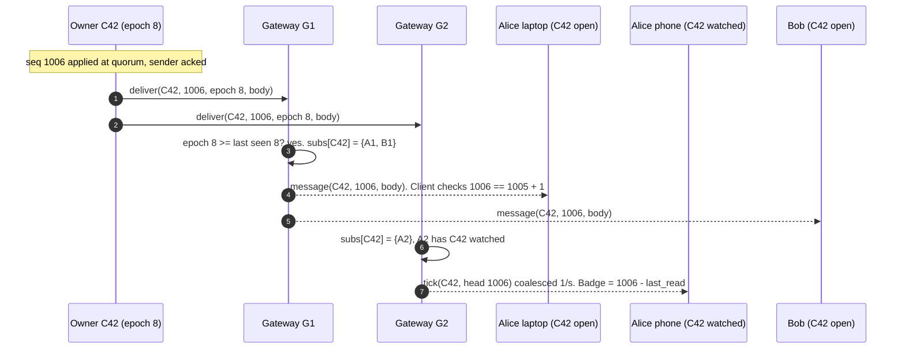

### D4.4 FR4: unread and mentions across devices

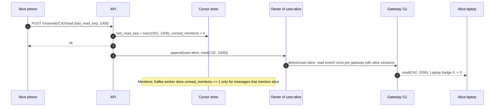

### D4.5 FR5: presence for visible users only

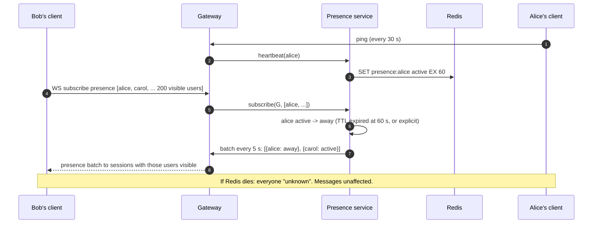

## D5. Failure paths

Owner failover mid-send: [`solution.md` §5.1](solution.md#51-two-senders-in-the-same-millisecond-who-is-first-and-what-if-the-owner-dies). Gateway death and region loss: [`solution.md` §10.4](solution.md#104-failure-timelines).

### D5.3 Slow gateway: backpressure turns push into pull

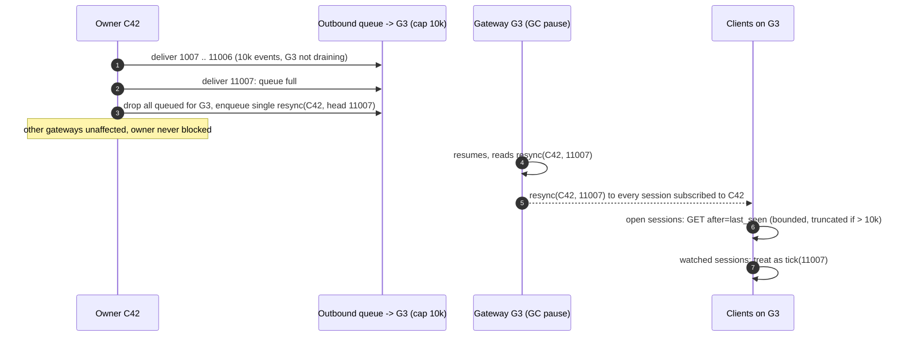

### D5.4 Duplicate send after a client timeout

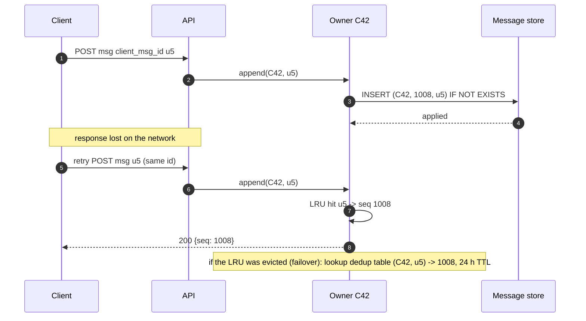

## D6. Decision flow: what a gateway does with a delivered event

```mermaid
%% D6: gateway delivery logic per event per session. The hardest branching in the system.
flowchart TD
    E[deliver event arrives<br/>channel C, seq N, epoch e] --> EP{epoch e >= last<br/>epoch seen for C?}
    EP -- no --> DROP1[Drop: stale owner]
    EP -- yes --> HAS{any local sessions<br/>subscribed to C?}
    HAS -- no --> UNSUB[Unsubscribe from owner<br/>after 60 s grace]
    HAS -- yes --> LOOP[For each session S in subs C]
    LOOP --> OPEN{C open<br/>on S?}
    OPEN -- yes --> GAP{N == last_delivered S,C + 1?}
    GAP -- yes --> SEND[Write full event to socket<br/>last_delivered = N]
    GAP -- no, N greater --> RESYNC[Send resync C, N<br/>client pulls after=last]
    GAP -- no, N smaller or equal --> DROP2[Drop: already delivered]
    OPEN -- no, watched --> TICK{tick for C sent<br/>in last 1 s?}
    TICK -- yes --> COAL[Coalesce: update pending head]
    TICK -- no --> SENDT[Write tick C, N]
    SEND --> QF{socket write<br/>queue full?}
    QF -- yes --> KILL[Close socket<br/>client reconnects with backoff]
    QF -- no --> DONE[Done]

    class E service
    class EP,HAS,OPEN,GAP,TICK,QF decision
    class DROP1,DROP2,UNSUB,SEND,RESYNC,COAL,SENDT,DONE,LOOP service
    class KILL critical

    classDef service  fill:#dcfce7,stroke:#16a34a,stroke-width:2px,color:#111
    classDef decision fill:#fce7f3,stroke:#db2777,stroke-width:2px,color:#111
    classDef critical fill:#fee2e2,stroke:#dc2626,stroke-width:4px,color:#111
```

## D7. Entity relationship

See [`solution.md` §3.3](solution.md#33-data-model).

## D8. State machines

### D8.1 Message

```mermaid
%% D8.1: a message from the client's point of view and the server's
stateDiagram-v2
    [*] --> Composing
    Composing --> Sending: POST with client_msg_id
    Sending --> Sending: timeout, retry same id (backoff)
    Sending --> Acked: 200 {seq}
    Sending --> Failed: 4xx (not a member, rate limited, too large)
    Acked --> Delivered: members' gateways pushed it (best effort)
    Delivered --> Read: member advanced cursor past seq
    Acked --> Edited: edit event with new seq, target = seq
    Edited --> Edited: further edits
    Acked --> Deleted: tombstone; row kept, body cleared
    Edited --> Deleted
    Deleted --> [*]: retention TTL expires
    Read --> [*]: retention TTL expires
```

### D8.2 Socket session at the gateway

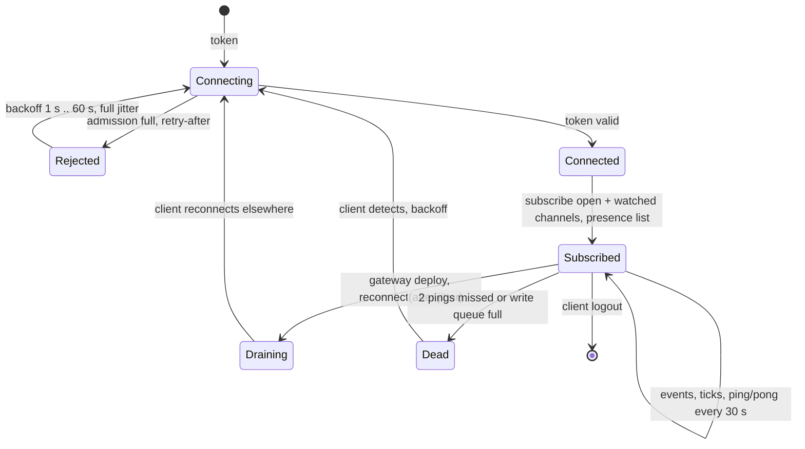

### D8.3 Owner actor for one channel

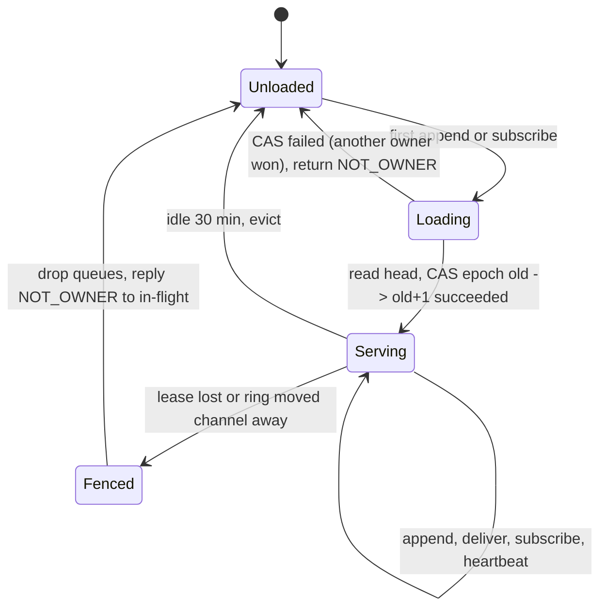

## D9. Deployment topology

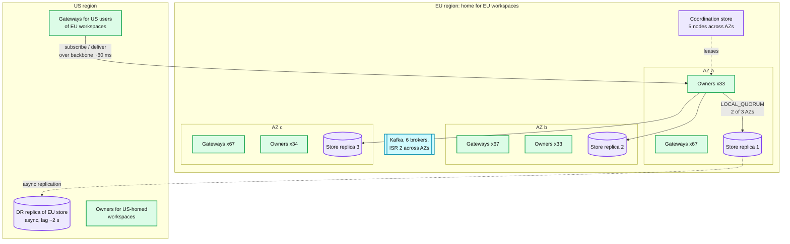

What crosses a region boundary: gateway subscriptions and deliveries for users away from their workspace's home (adds ~80 ms), async store replication (RPO), nothing on the LWT path.

## D10. Scaling and partitioning

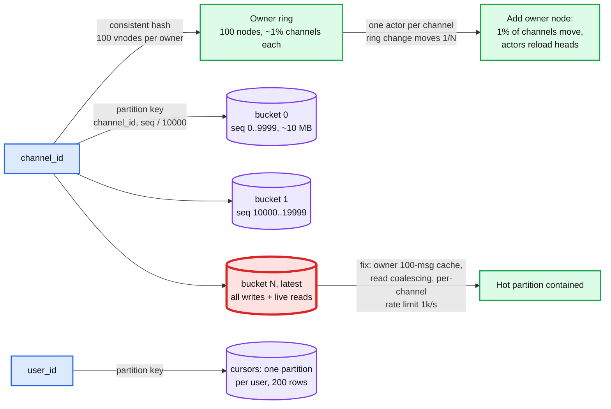

## D11. Failure mode map

```mermaid
%% D11: component -> what fails -> blast radius -> mitigation
flowchart TD
    GW[Gateway node] --> GWF[200k sockets drop] --> GWB[0.5% of users, 30 s reconnect] --> GWM[Backoff + jitter, admission, no durable state]
    OW[Owner node] --> OWF[1% of channels cannot send] --> OWB[~11 s per channel] --> OWM[Lease expiry, ring reassign, LWT fence, client retry same id]
    HOT[One hot channel] --> HOTF[Owner actor saturated]:::critical --> HOTB[That channel slow, node neighbours slower] --> HOTM[Per-channel rate limit, relay split later]
    MS[Message store AZ] --> MSF[1 of 3 replicas gone] --> MSB[LWT p99 up, no data loss] --> MSM[LOCAL_QUORUM survives; repair on return]
    K[Coordination store] --> KF[Ring frozen] --> KB[Nothing until an owner also dies] --> KM[Page; owners keep serving on last lease view]
    KA[Kafka] --> KAF[Mentions, push, index stall] --> KAB[Badges lag, no message impact] --> KAM[Replay on recovery, 3 d retention]
    RD[Presence Redis] --> RDF[Presence unknown] --> RDB[Cosmetic] --> RDM[Separate SLO, rebuild from heartbeats in 60 s]
    RG[Home region] --> RGF[All sends for its workspaces fail] --> RGB[RTO ~10 min, RPO ~2 s] --> RGM[Promote DR, rebuild ring, flip home]
    CL[Bad client release] --> CLF["/sync storm"] --> CLB[Everyone] --> CLM[Server-side version kill switch]

    class GW,OW,MS,K,KA,RD,RG,CL,HOT service
    class GWF,OWF,MSF,KF,KAF,RDF,RGF,CLF decision
    class GWB,OWB,MSB,KB,KAB,RDB,RGB,CLB,HOTB store
    class GWM,OWM,MSM,KM,KAM,RDM,RGM,CLM,HOTM service
    class HOTF critical

    classDef service  fill:#dcfce7,stroke:#16a34a,stroke-width:2px,color:#111
    classDef decision fill:#fce7f3,stroke:#db2777,stroke-width:2px,color:#111
    classDef store    fill:#ede9fe,stroke:#7c3aed,stroke-width:2px,color:#111
    classDef critical fill:#fee2e2,stroke:#dc2626,stroke-width:4px,color:#111
```

## D12. Migration from workspace-sharded MySQL to channel-keyed storage with an owner ring

This is the Slack Vitess story with a rollback point per phase. Each phase is flag-controlled; rollback is flipping the flag.

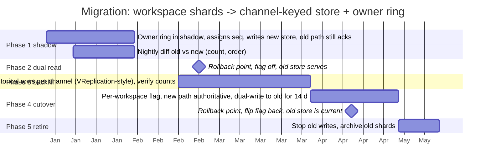

Backfill needs care on one point: historical messages have no `seq`. Assign seqs in `ts` order per channel during backfill, and start the owner's `head_seq` above the backfilled maximum before phase 4 flips that workspace. Rollback after phase 4 needs a reverse copy of anything written to the new store during dual-write, which is why dual-write to the old store stays on for 14 days.
