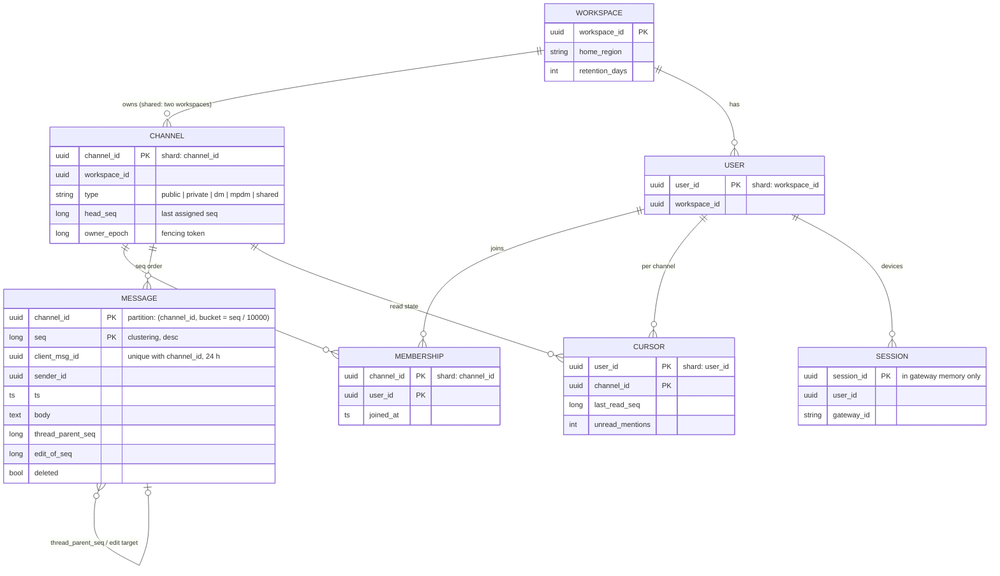
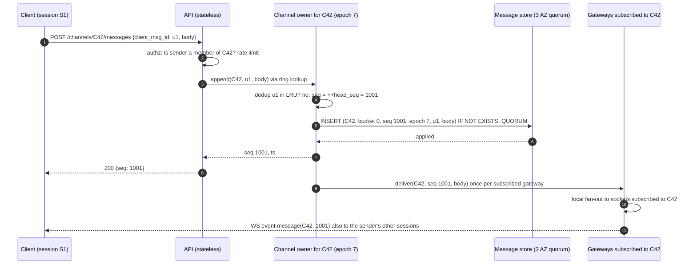
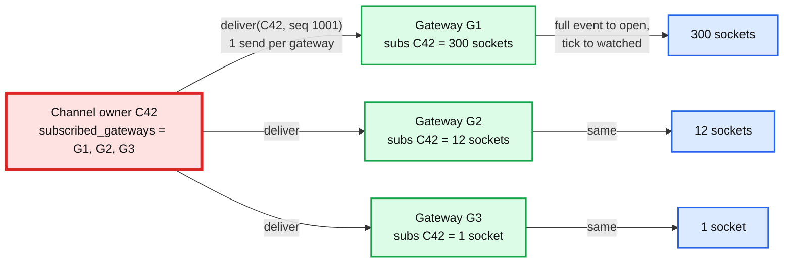
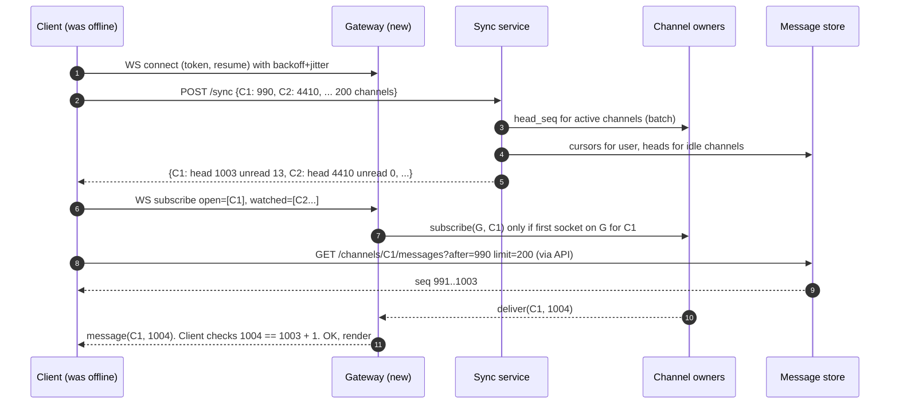
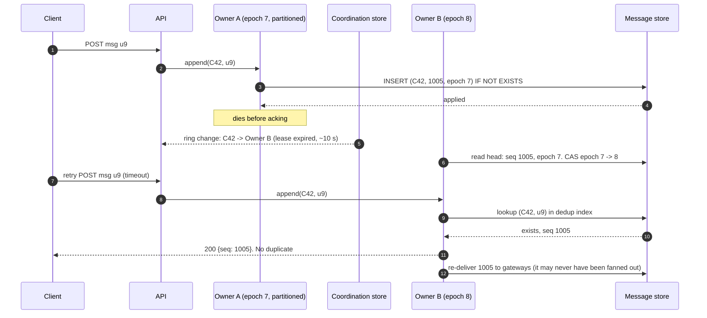
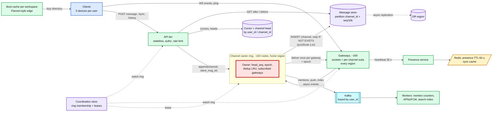
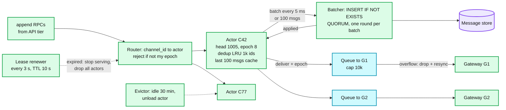
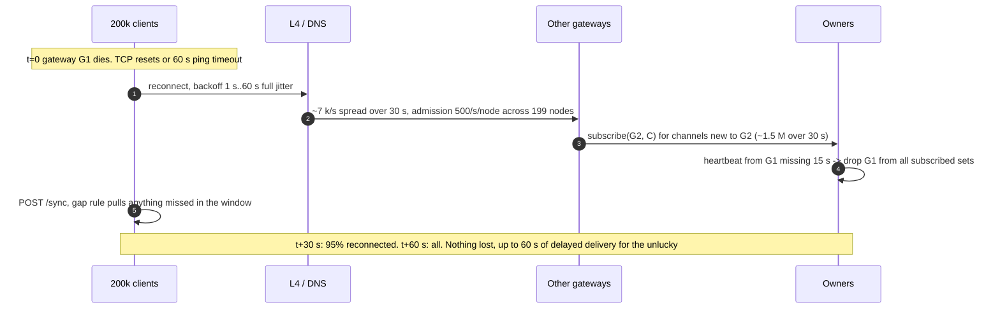
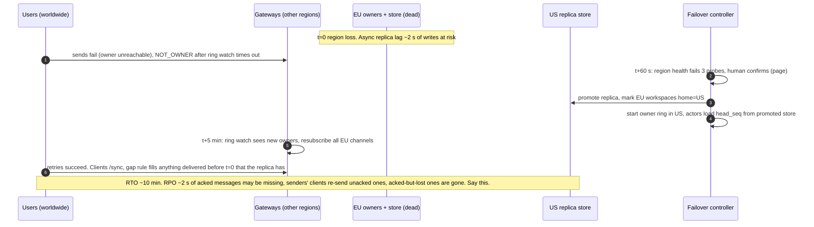

# HLD: Slack / large-scale messaging platform

> One-line answer: regional websocket gateways hold the sockets and know nothing else; a consistent-hash ring of channel owners (one leased owner per channel) assigns a gapless per-channel sequence number, does a conditional write to a channel-sharded message store, then fans the message out once per subscribed gateway; every other feature (history, reconnect sync, unread counts, multi-device, edits) is expressed as "give me everything after seq N in channel C", so one number does all the work.

Sources this follows: Slack Engineering (real-time messaging 2023, Flannel 2017, Vitess 2020, job queue 2020, cellular architecture 2023), Discord (trillions of messages 2023, Elixir scaling, Manifold), Meta Iris (2014), Telegram `pts` sync docs, WhatsApp multi-device (2021). Raw notes with links in [`research/`](research/). Diagrams D1 to D12 are in [`diagrams.md`](diagrams.md).

---

## 1. Understanding the problem

Interviewer's framing (Databricks, 15 reports): "Design Slack." Then, within 10 minutes: "two users send at the same time, who wins", "a channel has 100k members", "a user is offline for a week on one of five devices". The prompt is simple so the ladder can go deep. The tell is that every follow-up is about one of three things: ordering, fan-out, or sync. Design so those three share one mechanism.

### 1.1 Functional requirements

Core:
1. **Send** a message to a channel (public, private, DM, group DM). Text up to 40 KB, optional attachment pointer, optional thread parent, client-generated id.
2. **Receive** in real time on every connected device of every channel member. Same order for everyone.
3. **History and sync**: page backwards from any point; on reconnect, fetch everything since the device's last seen point, per channel.
4. **Unread counts and mention badges** per user per channel, correct across devices within seconds.
5. **Presence and typing** for users the client is currently looking at.
6. **Edit, delete, react.** Every member sees the mutation in order relative to the original.

Below the line (say it out loud):
- Search. It is a CDC consumer feeding an index; sketched in [`deep-dives/message-storage.md`](deep-dives/message-storage.md) §6, not designed here.
- End-to-end encryption. Slack is not E2E by design: server-side search, retention policies, compliance export, and edit-in-place all need the server to read the message. Meta asks about it; the Staff answer is to name the cost and refuse.
- Huddles, screen share, the app platform, workflow builder.
- Attachment storage. An attachment is a pointer to a blob store; upload goes direct-to-blob with a signed URL.

### 1.2 Non-functional requirements

Ask for scale first. Numbers assumed (Slack public figures are ~47 M DAU and ~1.5 B messages/day; round up to leave headroom):

| Dimension | Core target | Below the line |
|---|---|---|
| Users | 50 M DAU, 20 M peak concurrent sockets, 2 M workspaces, largest workspace 500 k users | 10x (§10.11) |
| Sends | 3 B messages/day = 35 k/s avg, **350 k/s peak** (10x heuristic, Monday 9 am) | |
| Fan-out | mean channel 50 members, 40% online; p99 channel 5 k; max 500 k members | |
| Latency | send to visible on another online client: p50 < 200 ms, p99 < 1 s in-region; history page p99 < 300 ms | cross-region p99 < 1.5 s |
| Ordering | **Total order per channel. Gapless. Every reader sees the same sequence** | causal order across channels (not needed) |
| Consistency | Sender: read-your-writes. Members: eventual, bounded by delivery latency. Unread counts: eventual, seconds | |
| Availability | 99.99% for send and receive. Presence and typing may degrade first | |
| Durability | Message acked to sender is on 3 replicas in 3 AZs. Never lost | |
| Retention | Default forever. 3 TB/day of message rows, ~1 PB/yr logical | |
| Tenancy | Workspace A never reads workspace B. Shared channels are the one deliberate bridge | |
| Multi-region | Workspace pinned to a home region (data residency). Members of a shared channel may sit in two regions | |

The ordering row drives everything. "Total order per channel, gapless" rules out client timestamps, rules out Snowflake ids as the order, and forces exactly one writer per channel at any instant. That single writer is the thing that breaks first under a hot channel, so it is the red box.

---

## 2. Back-of-envelope

```
DAU                 = 50 M, peak concurrent = 20 M sockets
Sends               = 3 B/day = 35 k/s avg, 350 k/s peak
Message row         = ~1 KB (text avg 200 B + ids, ts, user, thread, reactions map, edit history pointer)
Storage             = 3 B x 1 KB = 3 TB/day = 1.1 PB/yr logical, x3 replicas = 3.3 PB/yr raw
                      10 yr retention on hot tier is not affordable: tier after 1 yr (§5.4)

Deliveries (socket pushes)
  online members / msg  = 50 members x 40% online = 20, but heavy tail: p99 channel 5k x 40% = 2k
  weighted mean         ~ 25 pushes per message
  peak pushes           = 350 k/s x 25 = ~9 M socket pushes/s
  per gateway node      = 9 M / 200 nodes = 45 k pushes/s/node, ~45 MB/s. Fine for one box.

Owner -> gateway fan-out (the thing we optimise)
  a message goes once per gateway that has >= 1 subscribed socket, not once per socket
  small channel: 20 online members on ~20 distinct gateways -> 20 sends
  100 k channel: 40 k online members on at most 200 gateways -> 200 sends, then local fan-out
  peak owner egress   = 350 k/s x ~20 = 7 M owner->gateway sends/s across 100 owner nodes = 70 k/s/node. OK.

Connections
  20 M sockets / 200 k per gateway node = 100 nodes; run 200 (3 AZ x ~67) for N+1 per AZ
  per socket memory ~ 20 KB (TLS + buffers + subscription set) -> 200 k x 20 KB = 4 GB/node

Channels
  total channels ~ 500 M, active per day ~ 50 M, active per hour ~ 10 M
  owner state per active channel: seq head + epoch + member count + subscribed gateway set ~ 1 KB
  10 M active x 1 KB = 10 GB across 100 owner nodes = 100 MB each. Trivial. Membership itself stays in the DB.

Message store
  350 k writes/s peak at 1 KB = 350 MB/s. A wide-column node does ~10 to 20 k writes/s at 1 KB with quorum.
  -> 350 k / 15 k = ~25 nodes for writes; reads (history + catch-up) ~ 5x writes -> ~150 nodes. Plan 200 nodes, 3 AZs.
  per channel per year: a busy channel at 10 msgs/s = 300 M rows = 300 GB. Must bucket (§5.4).

Presence
  20 M online users, heartbeat every 30 s -> 670 k heartbeats/s. Must not touch a DB. Redis TTL keys.
  naive presence fan-out: 100 k user workspace, one user flips -> 100 k updates. Flip rate ~1%/min
  -> 1 k flips/min x 100 k watchers = 1.7 M updates/s for ONE workspace. Impossible. Subscribe to visible users only (§4.5).

Monday boot
  500 k user workspace, everyone opens the client between 8:55 and 9:05 -> 830 logins/s
  naive boot payload (all users + all channels + last 50 msgs x 200 channels) ~ 50 MB each
  -> 830 x 50 MB = 41 GB/s from one workspace. This is the Slack Flannel problem. Fix in §5.3.
```

Implications:
- Fan-out must be per gateway, not per socket. That one decision turns a 100k channel from a 40k-send problem into a 200-send problem.
- The message store needs bounded partitions and a hot-tier / cold-tier split.
- Presence and boot are the two things that melt on their own, unrelated to message volume. They get their own sections and their own services.

---

## 3. The set-up

Product-style set-up.

### 3.1 Core entities

- **Workspace**: tenant. `workspace_id`, home region, retention policy.
- **User**: `user_id`, workspace_id, profile. A user has N **Sessions** (one per device connection).
- **Channel**: `channel_id`, workspace_id (or two, for shared), type, `head_seq`, `owner_epoch`. Membership is a separate relation.
- **Message**: `(channel_id, seq)` is the identity. `client_msg_id` for dedup, `sender_id`, `ts`, `body`, `thread_parent_seq`, `edit_seq`, `deleted`.
- **Cursor**: `(user_id, channel_id) -> last_read_seq`. One per user, shared by all their devices.
- **Mention**: `(user_id, channel_id) -> unread_mentions` counter, mentions only.
- **Presence**: `user_id -> status, last_active` with TTL. Not durable.

### 3.2 API

Clients hold one websocket per session. Sends go over HTTPS (retries and idempotency are easier over request/response); everything server-to-client goes over the socket. All calls carry a session token.

| Call | Transport | Args | Returns | Notes |
|---|---|---|---|---|
| `POST /channels/{c}/messages` | HTTPS | `client_msg_id`, body, thread_parent_seq?, attachment_ids? | `seq`, `ts` | Idempotent on `(channel_id, client_msg_id)` for 24 h |
| `GET /channels/{c}/messages?before=seq&limit=50` | HTTPS | | messages, next cursor | Backwards paging |
| `GET /channels/{c}/messages?after=seq&limit=200` | HTTPS | | messages, `head_seq`, `truncated?` | Catch-up. `truncated` means "your cursor is too old, resnapshot" |
| `POST /sync` | HTTPS | `{channel_id: last_seen_seq}` for up to 500 channels | `{channel_id: head_seq, unread, mentions}` | Cheap boot / reconnect. No bodies |
| `PATCH /channels/{c}/messages/{seq}` | HTTPS | body | new `edit_seq` | Edit is a new seq that references the target |
| `DELETE /channels/{c}/messages/{seq}` | HTTPS | | tombstone `seq` | |
| `POST /channels/{c}/read` | HTTPS | `last_read_seq` | | Advances the cursor, fans out to the user's other sessions |
| `WS subscribe` | socket | `{channel_ids: [...]}`, `{presence_user_ids: [...]}` | | Gateway subscribes to owners on the client's behalf |
| `WS event` | socket, server to client | `message`, `edit`, `delete`, `reaction`, `tick(channel, head_seq)`, `read(channel, seq)`, `presence`, `typing` | | `tick` carries no body; used for channels not open on screen |
| `WS ping/pong` | socket | | | 30 s; 2 missed = dead |

Internal RPCs: `Owner.append(channel, client_msg_id, body) -> seq`, `Owner.subscribe(gateway_id, channel)`, `Owner.unsubscribe`, `Gateway.deliver(session_ids[], event)`, `Presence.heartbeat`, `Presence.subscribe`.

### 3.3 Data model



Access patterns and why the keys are what they are:
- **Append to channel**: `INSERT (channel_id, seq) IF NOT EXISTS`. Single partition, conditional. This is the fencing point (§5.1).
- **Page history**: `SELECT ... WHERE channel_id=? AND bucket=? AND seq < ? LIMIT 50`. One partition, clustered by seq desc. Cross bucket only at boundaries.
- **Catch-up**: `WHERE channel_id=? AND seq > cursor LIMIT 200`. Same partition. If `head_seq - cursor > 10 000`, respond `truncated` and the client resnapshots (§4.3).
- **Unread for one channel**: `head_seq - last_read_seq`. Two point reads, no scan, no per-message counter update.
- **Boot for a user**: `SELECT channel_id, last_read_seq FROM CURSOR WHERE user_id=?` (one partition), then `head_seq` for those channels from the owner's cache or the channel table.
- **Members of a channel** (for fan-out and `@channel`): `MEMBERSHIP WHERE channel_id=?`. Loaded into the owner on first activity.

Partition keys: messages, membership, and channel head by `channel_id` because every hot path is per channel. Cursors by `user_id` because boot reads all of a user's cursors at once. Users by `workspace_id` because the directory is read per workspace. The seq-based bucket (`seq / 10 000`, ~10 MB per partition at 1 KB) bounds partition size without the empty-partition scans a time bucket causes on quiet channels; see §5.4.

---

## 4. High-level design

One subsection per functional requirement.

### 4.1 Send a message: who decides the order, and is it durable

**Bad: client timestamp is the order; API server writes to the DB and broadcasts.**
- Approach: client stamps `ts`, `POST` to any API server, insert into a messages table, broadcast.
- Why it breaks: two clients in the same millisecond, or with skewed clocks, produce different orders on different readers. The 350 k/s peak also lands on whatever DB is behind the API tier with no per-channel structure. And "the API server that took the request dies after the insert but before the broadcast" is a lost delivery with no record of it.

**Good: the database assigns the sequence.**
- Approach: per-channel row `head_seq`; `UPDATE channel SET head_seq = head_seq + 1 RETURNING head_seq` inside the same transaction as the message insert (MySQL/Vitess, sharded by channel_id), or a Cassandra lightweight transaction on `(channel_id, seq) IF NOT EXISTS`.
- Cost: every send pays a row lock or a Paxos round on the DB: +5 to 20 ms, and a hot channel serialises on one row with no batching. Fan-out state (who is subscribed) has to live somewhere else anyway. Works to maybe 1 k sends/s per channel, and the DB is the hot spot for a busy channel.

**Great: one leased channel owner per channel assigns the seq in memory, then does a conditional write.**
- Approach: a ring of ~100 **channel owner** nodes. `owner(channel_id) = consistent_hash(channel_id)` over a membership list held in a coordination store (etcd / Consul / ZooKeeper; Slack uses Consul). The owner holds, per active channel: `head_seq`, `owner_epoch`, an LRU of recent `client_msg_id`, and the set of subscribed gateways. On `append`: dedup on `client_msg_id`, `seq = ++head_seq`, write `(channel_id, seq, epoch, ...) IF NOT EXISTS` with quorum to the store, ack the sender with `seq`, then fan out. The owner batches conditional writes per channel (group commit, 5 ms window) so a hot channel does 1 round trip per batch, not per message.
- The owner is exactly one process per channel at any instant, enforced by a lease on the ring membership (§5.1) and made safe by the conditional write: a stale owner that still thinks it owns the channel will collide on `(channel_id, seq)` and get `EXISTS`, and it also carries an old `owner_epoch` that the current head row rejects. Two fences, either is sufficient.
- Ack rule stated precisely: **the sender is acked when the row is on a quorum of replicas across 3 AZs.** Delivery to members happens after the ack and is best-effort push with a pull backstop (§4.3). So a message is never "delivered but not stored", and "stored but not yet delivered" is recovered by the next sync.
- Challenges: owner failover takes ~2 to 5 s during which that channel's sends retry (§5.1). A single hot channel (10 k sends/s, say a bot flood) is capped by one owner process; we rate-limit per channel at 100 sends/s per sender and 1 k/s per channel, which is far above any human channel. The owner ring is a stateful tier to operate: rebalancing on scale-out moves channels between owners (§10.11).



### 4.2 Receive in real time on every device of every member

**Bad: clients poll `GET /messages?after=seq` every 2 s.**
- Why it breaks: 20 M clients x 200 channels each / 2 s = 2 B reads/s. And 2 s of added latency. Long-poll fixes the latency, not the read rate.

**Good: websockets; a pub/sub topic per channel; every online member's socket subscribes.**
- Approach: the client opens a websocket to a gateway; the gateway subscribes to a Redis / Kafka topic per channel for each channel the user is in; on publish, the broker delivers one copy per subscriber.
- Cost: the broker does the fan-out per subscriber: 40 k online members in a 100 k channel means 40 k copies out of the broker per message, and every gateway holds tens of thousands of subscriptions to renew on reconnect. A broker partition for a busy channel becomes the hot spot. A user in 200 channels forces 200 subscriptions per socket, 4 B subscriptions in the broker at peak.

**Great: subscriptions are per gateway, not per socket; the owner fans out once per gateway; the gateway fans out locally. Payload only to open channels, `tick` to the rest.**
- Approach: when a session subscribes to channel C, the gateway adds the session to its local `subs[C]` set and, only if that set was empty, calls `Owner.subscribe(gateway_id, C)`. The owner keeps `subscribed_gateways[C]`, at most 200 entries no matter how big the channel. On a new message the owner sends one `deliver` per gateway in that set. The gateway walks `subs[C]` and writes to each socket. Sessions declare which channels are **open** (on screen, at most a handful) and which are **watched** (everything else, for badges). Open channels get the full event. Watched channels get `tick(C, head_seq)` coalesced to at most one per channel per second per gateway. A client that receives a tick for a channel it then opens does a `GET after=cursor` (§4.3).
- Numbers: 100 k channel, 40 k online, 200 gateways: owner does 200 sends; each gateway does ~200 socket writes. Total socket writes are still 40 k but they are spread over 200 machines and 200 network links, and the owner's cost is O(gateways), not O(members).
- Challenges: the owner must know when a gateway dies, or it keeps sending into a dead set (gateway heartbeats to owners it subscribes to; 3 missed = drop). A slow gateway must not stall the owner: per-gateway bounded outbound queue (10 k events), overflow drops the queue and sends the gateway a single `resync(C, head_seq)` so its clients re-pull. This is the backpressure rule and it is what turns "push" into "push with a pull backstop".



### 4.3 History and reconnect sync

**Bad: on reconnect, refetch the last 50 messages of every channel.**
- Why it breaks: 200 channels x 50 messages x 1 KB = 10 MB per reconnect; a gateway restart with 200 k sockets triggers 2 TB of reads. And the client cannot tell if it missed message 51.

**Good: per-channel cursor; `GET after=last_seen_seq` for each channel.**
- Approach: the client persists `last_seen_seq` per channel locally. On reconnect it asks each channel for what it missed. Gapless seqs mean the client can prove it has everything: if it holds 1000 and receives 1002, it knows 1001 is missing and pulls it. This is Telegram's `pts` rule and Iris's queue position.
- Cost: still 200 requests per reconnect, most returning nothing.

**Great: one `POST /sync` with the cursor map returns `head_seq` per channel and nothing else; bodies are pulled lazily for open channels; stale cursors are cut off and resnapshotted.**
- Approach: `POST /sync {C1: 990, C2: 4410, ...}` returns `{C1: {head: 1003, unread: 13, mentions: 1}, C2: {head: 4410, ...}}`. Head seqs come from the owners' memory (active channels) or the channel table (idle). Only channels the user opens then do `GET after=`. If `head - cursor > 10 000` the server returns `truncated: true`; the client drops its local history for that channel and loads the newest page as a snapshot. Bounded catch-up cost per channel regardless of how long the device was away.
- Delivery over the socket applies the same rule: the gateway includes `seq`, the client checks `seq == last + 1`, and on a gap it issues `GET after=last` rather than trusting push. Push is fast; pull is correct.
- Challenges: 20 M clients reconnecting after a bad deploy all call `/sync` at once. The endpoint reads only cursors and heads (two point lookups per channel, cacheable), and the gateway admission control (§5.3) spreads reconnects over 30 s. A week-old device with 5 000 messages in a channel pays a `truncated` snapshot, which is the right trade: nobody scrolls through 5 000 missed messages.



### 4.4 Unread counts and mention badges, correct across devices

**Bad: on every message, increment `unread[user][channel]` for every member.**
- Why it breaks: write amplification equals fan-out. One message in a 100 k channel is 100 k counter writes. 350 k/s x 25 = 9 M counter writes/s at peak, more than the message writes themselves. And every device must then be told the new count.

**Good: never store an unread count. Store `last_read_seq` per (user, channel). Unread = `head_seq - last_read_seq`.**
- Approach: the cursor is written only when the user reads (one write per read action, not per message). Head is already maintained by the owner. Unread is computed at `/sync` time and updated client-side from ticks (`tick(C, head)` gives the client the new head; it knows its own cursor).
- Cost: mentions need a count, not a difference, because "3 unread" and "1 mention" are different badges. And the count must be of mentions of me, which the difference cannot express.

**Great: cursor for unread; a small per-(user, channel) mention counter updated by an async job only for messages that mention that user; read events fanned out to the user's own sessions.**
- Approach: the owner emits a `mentioned(user_ids[])` side event to a job queue (Kafka topic, keyed by user_id). A worker increments `unread_mentions` for those users only. `@channel` in a 100 k channel is 100 k increments, but through the queue at whatever rate the store tolerates, off the send path, and the badge is allowed to lag by seconds (NFR says eventual). When the user reads, `POST /read {last_read_seq}` sets the cursor, zeroes mentions for that channel, and the owner of the **user topic** (a per-user pseudo-channel, `user:{user_id}`, handled by the same owner ring) fans a `read(C, seq)` event to the user's other sessions. Read state converges across 5 devices in one delivery latency.
- Challenges: the read cursor must be monotonic (a stale device reporting an older read must not move it backwards): `SET last_read_seq = max(current, new)`. A push notification tapped on the phone marks read on the phone only when the app actually opens the channel, not on tap, or the laptop shows a badge for a message nobody read.

### 4.5 Presence and typing

**Bad: broadcast every status change to every member of the workspace.**
- Why it breaks: computed in §2: one 100 k workspace produces ~1.7 M presence updates/s. That is 5x our entire message fan-out for something nobody is looking at.

**Good: presence service with heartbeat TTL; clients subscribe to presence for the users they need.**
- Approach: the gateway forwards a heartbeat per session every 30 s to a presence service that sets `presence:{user_id} = active` with a 60 s TTL in Redis. Clients subscribe to presence for the users on screen (the sidebar, the open channel's members visible in the header), at most a few hundred. Status flips fan out only to subscribers. Slack does exactly this.
- Cost: subscribe / unsubscribe churn as the user scrolls a member list. A presence subscription storm when a big channel is opened (1 k subscribes at once).

**Great: same, plus batching, a separate SLO, and explicit load shedding.**
- Approach: presence changes are coalesced per subscriber into one batch per 5 s. Sidebar membership is capped (Slack caps at a few hundred visible). Typing is a fire-and-forget event routed through the channel owner to gateways with open sessions only, never persisted, dropped first under load. Presence service has its own SLO (99.9%, staleness up to 60 s allowed) and its own pager; if Redis dies, everyone shows "unknown" and messages keep flowing. Presence never sits on the send path.
- Push back on the textbook: presence is not a consistency problem, it is a cost problem. Any design that promises "exact" presence has to be able to afford N x M. Say that out loud and design for "roughly right within a minute".

### 4.6 Edit, delete, react

- An edit, delete, or reaction is a new message row with its own `seq`, `type = edit | delete | reaction`, and `target_seq`. It goes through the same owner, gets the same ordering guarantee, and fans out the same way. The client applies it to the target it already holds. A device that was offline sees the original and the edit in order on catch-up.
- The owner also updates the original row in place (`body`, `edit_of_seq`, `deleted = true`) so history pages return the current state without replaying mutations. The store therefore holds both the event log (for sync) and the materialised view (for paging). A delete leaves a tombstone row so seqs stay gapless.
- Trade-off: one edit costs two writes. The alternative (clients replay all mutations when paging) makes history pages unbounded for a heavily edited message.

---

## 5. Deep dives

One subsection per non-functional requirement, phrased as the interviewer asks it.

### 5.1 "Two senders in the same millisecond. Who is first, and what if the owner dies?"

Walk the send path: API (stateless, no ordering) -> owner (the only place order is decided) -> store (conditional write, the fence) -> gateways (deliver in seq order per channel, no reordering).

**Bad: order by client timestamp or by Snowflake id.** Different readers get different orders under skew, and Snowflake ties within a millisecond break on worker id, which has nothing to do with causality. Snowflakes are fine as unique ids, not as the order. Discord uses them as ids and buckets, not as a strict order guarantee.

**Good: DB row lock on `head_seq`.** Correct, and the DB is the single writer, but it costs a locked round trip per message and puts the hot channel's serialisation point inside the database where you cannot batch or shed.

**Great: leased owner assigns seq in memory; the store's conditional write is the fence; failover re-derives state from the store.**
- Who is first: whichever `append` the owner dequeues first. The owner processes a channel's appends on one goroutine / actor, so "first" is well defined and identical for every reader, because every reader gets `seq` from that owner. Same-millisecond is not special.
- Owner death: the owner holds a session lease in the coordination store (TTL 10 s, renewed every 3 s). When it expires, the ring membership changes, every API server and gateway sees the new ring within one watch notification (~1 s), and `owner(C)` now maps to a different node. The new owner loads `head_seq` and `owner_epoch` from the channel row, increments the epoch, writes it back with a conditional write on the old epoch, and starts serving. Total gap: lease TTL 10 s worst case + 1 s propagation + 50 ms state load. Clients retry with the same `client_msg_id`; the new owner checks the store's `(channel_id, client_msg_id)` unique index (24 h TTL) since its LRU is empty, so a retry of a message the old owner did persist returns the existing seq instead of a duplicate.
- Split brain: the old owner is partitioned but alive and still thinks it is the owner (GC pause, network). Two fences: (1) its writes carry `epoch 7`; the head row now says 8; the conditional write fails. (2) Even without the epoch, it would try `seq 1005 IF NOT EXISTS` and the new owner has already written 1005, so it fails. It cannot ack a client for a seq it did not persist. What it can do is deliver a stale in-memory message to gateways it still talks to; gateways carry the epoch on every `deliver` and drop events from an epoch lower than the latest they have seen for that channel.
- Push back on the textbook: you do not need Raft inside the owner. The store already gives you a linearizable conditional write on one partition. The owner is a cache plus a batcher in front of that write. Raft would only buy faster failover (sub-second instead of ~10 s) at the cost of a second consensus system to operate. Slack's channel servers are exactly this shape: consistent hashing over Consul, no Raft.

The full owner lifecycle and failover proof is in [`deep-dives/ordering-and-sequencer.md`](deep-dives/ordering-and-sequencer.md).



### 5.2 "A channel has 100k members and someone sends a message. What melts?"

Walk the path: owner -> gateways -> sockets -> push notifications -> mention counters.

**Bad: fan out per member at the owner** (100 k sends per message, one owner, dead at 10 messages/s).

**Good: fan out per gateway** (§4.2 Great). Owner cost is O(200). Socket writes are spread over 200 machines. This alone makes a 100 k channel cost the same as a 200-member channel at the owner.

**Great: same, plus three more rules for the tail.**
1. **Ticks, not payloads, for watched channels.** In a 100 k channel most online members do not have it open. They get a 40-byte `tick`, coalesced to 1/s. Only open sessions get the 1 KB body. Bandwidth per message drops from 40 MB to ~2 MB.
2. **Push notifications and mention counters go through a queue, rate-limited per channel.** `@channel` in a 100 k channel is 100 k APNs/FCM calls and 100 k counter increments. Both go to Kafka keyed by user_id and drain at the provider's rate (APNs tolerates thousands/s per connection). Sending them synchronously would take the owner out for minutes. Product rule on top: `@channel` requires a permission in channels above 1 k members. Slack does this.
3. **Owner-level backpressure.** Per-gateway outbound queue of 10 k events; overflow = drop the queue and send `resync`. A slow gateway therefore degrades its own clients (they re-pull) and never blocks the owner or the other 199 gateways.
- What still melts, honestly: a single channel at 1 k sends/s (a bot flood) saturates one owner actor at ~200 gateway sends each = 200 k sends/s. That is the ceiling of "one owner per channel", and it is 100x any human channel. The fix beyond that is splitting the channel's fan-out across helper nodes (owner sends to 10 relays, each relays to 20 gateways), which Discord effectively does with Manifold batching by destination node. We do not build it on day one.

Numbers, worked in [`deep-dives/fan-out-and-large-channels.md`](deep-dives/fan-out-and-large-channels.md).

### 5.3 "20 M sockets. A gateway dies. Monday 9 am. Where is the bottleneck?"

Walk the path: DNS / L4 -> gateway -> subscriptions to owners -> `/sync` -> boot payload.

**Bad: one gateway tier with sticky sessions, boot returns everything.** A gateway death drops 200 k sockets that all reconnect in the same second and all call a 50 MB boot endpoint. Slack's January 2021 outage was this shape: cold caches plus everyone reconnecting after the holidays saturated the network.

**Good: gateways are stateless with respect to durable data, reconnect uses backoff with jitter, boot is paged.**
- Approach: a gateway holds only sockets and subscription sets; losing one loses nothing durable. Clients reconnect with exponential backoff, base 1 s, cap 60 s, full jitter, so 200 k reconnects spread over ~30 s (~7 k/s). Gateways enforce an admission token bucket on new connections (say 500/s/node) and reply `retry-after` beyond it.
- Cost: reconnect still triggers subscriptions: 200 k sockets x 200 channels = 40 M `subscribe` calls to owners. Per-gateway dedup (subscribe once per channel per gateway) cuts it to the number of distinct channels on that gateway, ~1 to 2 M, spread over 30 s. Fine.

**Great: same, plus a boot cache at the edge (Flannel) and a client-side persistent cache with delta boot.**
- Approach: the boot payload (users, channels, membership for the workspace) is served by a per-workspace edge cache that holds the workspace model in memory and answers queries lazily (Slack's Flannel: cut a 32 k-user org boot from ~30 MB to <1 MB by not sending the whole user list). The client keeps its own local DB and sends `last_boot_version`; boot returns only the changes since. Message bodies are never in boot; `/sync` returns heads and unreads (§4.3), bodies load per opened channel.
- The 9 am number: 830 logins/s for a 500 k workspace, each `/sync` reading ~200 cursor rows from one partition and 200 heads mostly from owner memory. ~170 k point reads/s. A Redis-fronted cursor read handles this on a handful of nodes. The boot payload from the edge cache is ~100 KB, so 83 MB/s for the workspace. Both are fine. What is not fine is anything O(workspace size) per login, which is why the user directory is lazy.
- Push back on the textbook: do not put the gateway in Erlang because WhatsApp did. 200 k sockets per node is comfortable in Go or Netty with a 20 KB per-socket budget; the constraint is not the language, it is that the gateway must hold nothing durable, so that killing one is free.

Connection lifecycle, admission control, and the boot cache are in [`deep-dives/connection-layer.md`](deep-dives/connection-layer.md).

### 5.4 "Never lose an acked message, keep 1 PB/yr queryable, and what is the hot partition?"

**Bad: one messages table by `message_id`.** History paging becomes a scatter; a channel's rows are spread across every shard.

**Good: wide-column store, partition by `(channel_id, time_bucket)`, cluster by id desc (Discord).** History and catch-up read one partition. Buckets bound partition size (Discord uses ~10 days per bucket, target under 100 MB). Cost: a quiet channel has hundreds of empty buckets, and paging back through them means probing each; Discord had to add a "which buckets are non-empty" fix.

**Great: partition by `(channel_id, seq / 10 000)`; quorum writes across 3 AZs; per-workspace retention via TTL; cold tier after 1 year.**
- Bucket by seq, not time: every bucket is full (10 000 rows, ~10 MB) except the last, and the client knows which bucket a seq lives in without a lookup. Paging back from seq 23 500 reads bucket 2 then bucket 1; no empty probes ever.
- Durability: `INSERT ... IF NOT EXISTS` at QUORUM with RF 3 in 3 AZs. Ack after 2 of 3. A single AZ loss loses nothing. The conditional write costs a Paxos round on one partition (Cassandra LWT ~5 to 10 ms; ScyllaDB or a Raft-per-partition store like CockroachDB / TiKV does the same faster). This is the price of the fence, paid once per batch, not per message (§4.1).
- Hot partition: a busy channel's latest bucket. All writes and all live reads for that channel hit one partition on 3 nodes. At 10 sends/s and 1 k history reads/s this is nothing. At a bot flood of 1 k sends/s the partition's node does 1 k LWT/s, which is roughly its ceiling. Mitigation is the same per-channel rate limit as the owner's. The real hot spot in production is not the write, it is the read: a `@channel` on a 100 k channel makes 40 k clients `GET after=` the same partition within a second. Request coalescing at the read service (Discord's data service: identical in-flight reads to one partition share one DB call) and a 1 s owner-side cache of the last 100 messages per active channel absorb it.
- Retention: TTL per row from the workspace policy. Rows older than 1 year move to object storage in Parquet by (channel, bucket), and paging past the hot tier goes to a slower read path (p99 seconds, acceptable for year-old history).
- Slack's actual choice is sharded MySQL via Vitess with `channel_id` as the sharding key, after workspace sharding produced hot shards for large customers and broke on shared channels. Either store works; the invariant is the partition key. The migration story is in [`deep-dives/message-storage.md`](deep-dives/message-storage.md) §5.

### 5.5 "Region dies. Who is down? And a shared channel across two regions?"

**Bad: one global cluster.** Latency to the far side of the world on every send, and one region's failure is everyone's.

**Good: workspace home region. All of a workspace's owners, store, and cursors live in its home region. Gateways are everywhere; a user connects to the nearest gateway, which talks to the home region's owners over the backbone.**
- A US user in an EU-homed workspace pays ~80 ms extra on send and delivery. Acceptable against a 1 s p99.
- Region loss: every workspace homed there is down for send and history. Sockets stay up (gateways are elsewhere) but every channel's owner is gone. RPO: the store replicates asynchronously to a second region (lag ~seconds); RTO: promote the replica, rebuild the owner ring in the new region (owners are stateless with respect to durable data, they reload heads from the store), flip the workspace's home pointer. ~10 minutes with automation. The seconds of async lag are the messages at risk: they were acked to senders. State that honestly. The fix, at cost, is synchronous cross-region quorum for workspaces that pay for it (RPO 0, +80 ms per send).

**Great: same, plus shared channels have exactly one home, and residency is enforced at the store.**
- A shared channel between an EU-homed and a US-homed workspace has one owner and one partition, in the region of the workspace that created it. Members from the other workspace subscribe cross-region. Order is still decided by one owner; nothing is merged. Data residency for the EU workspace is satisfied for its own channels and explicitly waived for the shared channel at creation time (product rule; this is what Slack Connect does).
- Push back: active-active with conflict resolution for messages is never worth it. A channel needs one sequencer. "Active-active" here means every region is active for its own workspaces, which is all the availability you get from it.

Failover timeline in [`diagrams.md`](diagrams.md) D9 and §10.4 timeline 3.

---

## 6. Final design



Zoom-ins: [`diagrams.md`](diagrams.md) D2 (data flow with sizes), D4 (per-FR sequences), D5 (failure sequences), D6 (gateway delivery decision flow), D9 (deployment), D10 (partitioning), D11 (failure map), D12 (Vitess-style migration).

---

## 7. Trade-offs

| Decision | Option A | Option B | Chose | Why |
|---|---|---|---|---|
| Who assigns order | DB row lock / LWT per message | Leased in-memory owner + conditional write per batch | B | Batching for hot channels, shedding and rate limits at the owner, DB still the fence. Costs a stateful tier |
| Owner consensus | Raft group per shard of channels | Lease in a coordination store, store write as fence | B | One consensus system fewer; the store's conditional write is already linearizable. Costs ~10 s failover vs ~1 s |
| Fan-out unit | Per socket (broker pub/sub) | Per gateway, then local | B | Owner cost O(200) not O(members); the 100 k channel becomes ordinary |
| Watched channels | Full payload to all subscribers | `tick(head_seq)`, pull on open | tick | 20x less bandwidth; pull is the correctness backstop anyway |
| Unread counts | Per-user counter incremented per message | `head - last_read` from cursors | cursors | Zero write amplification; mentions get the only counter, via a queue |
| Message store | Vitess / sharded MySQL by channel_id (Slack) | Wide-column by (channel_id, seq bucket) | wide-column | Partition is the natural unit; LWT gives the fence. MySQL is a fine answer if the interviewer prefers; the key is identical |
| Bucketing | Time bucket (Discord) | Seq bucket (`seq / 10 000`) | seq | No empty buckets, client computes the bucket, bounded size |
| Send transport | Over the websocket | HTTPS POST | HTTPS | Retries, idempotency, and load balancing are solved; socket is receive-only plus subscribe |
| Presence | Exact, broadcast | Heartbeat TTL, subscribe to visible, batch 5 s | B | N x M is unaffordable; product only needs "roughly right" |
| Multi-region | Active-active per channel | Home region per workspace, one owner per channel | B | A channel has one sequencer or it has no order. Shared channels pick one home |
| Cross-region durability | Async replication, RPO seconds | Sync quorum, RPO 0, +80 ms | async default | Offered per workspace as a paid tier |
| Refused to build | E2E encryption, exact presence, global ordering across channels, active-active writes | | Refused | Each one breaks something the product needs (search, cost, a single sequencer) |

---

## 8. Staff-level notes

- **Failure modes and blast radius.** Owner node loss: ~1% of active channels cannot send for ~10 s; receive keeps working for already-delivered data; sockets unaffected. Gateway loss: 0.5% of sockets reconnect over 30 s, no data loss. Coordination store loss: ring frozen, nothing fails until an owner also dies (leases cannot expire either, so the frozen ring is safe); page immediately. Message store AZ loss: quorum survives, LWT latency rises. Kafka loss: mention badges and push notifications stall; messages keep flowing; the queue is replayed when it returns. Redis loss: presence goes "unknown", `/sync` falls back to the store with higher latency. Worst blast radius: a bad client release that spins on `/sync`; ship clients behind a server-side kill switch per version.
- **Migration.** From workspace-sharded MySQL (where Slack started) to channel-keyed storage: (1) add the owner ring in shadow mode assigning seqs and writing to the new store while the old path stays authoritative; compare nightly. (2) Dual-read: serve history from the new store for 1% of channels behind a flag, diff against old. (3) Backfill old messages per channel with VReplication-style copy and verify counts. (4) Flip authoritative per workspace, keep dual-write for 2 weeks, rollback = flip the flag. (5) Stop old writes. No downtime at any step; each step has a rollback. D12 in `diagrams.md`.
- **Operability.** SLO: send-to-deliver p99 < 1 s in-region, send success 99.99%. Pages at 3 am: any channel without an owner for 30 s; owner->gateway queue overflow rate above 0.1%; LWT p99 above 50 ms; `/sync` p99 above 500 ms; DR replication lag above 60 s; socket count dropping more than 5% in a minute (reconnect storm incoming); Kafka mention lag above 5 min (ticket, not page). Dashboards: send p99 by stage (API, owner, store, gateway), fan-out sends per second per owner, hot channel top-10, socket count per gateway, presence heartbeat rate.
- **Cost.** 200 gateways + 100 owners + ~50 API and sync nodes are ~350 mid-size boxes, ~$3 M/yr. Message store 200 nodes with NVMe ~$4 M/yr, growing 3.3 PB raw/yr; cold tier at object storage prices is ~$0.3 M/yr per year of retention. Kafka and Redis are small. Total ~$8 to 10 M/yr, well under $1 per DAU per year. Engineering: gateways + owners are one team of 6, storage + sync another 6, presence + notifications 4. First production in ~9 months if the store is bought (Scylla / Cassandra / CockroachDB), not built.
- **Team boundaries.** Real-time (gateway, owner ring, delivery) owns the ordering guarantee and the socket protocol. Storage (message store, cursors, retention, search feed) owns durability and the schema. Presence and notifications is a separate team with a looser SLO on purpose, so its incidents never page the real-time team. The client protocol (`seq`, `tick`, gap rule) is the contract between all three; version it.

---

## 9. What is expected at each level

**Mid (80/20 breadth/depth).** Websockets for receive, a chat service, a message table keyed by channel, a pub/sub layer for fan-out, a presence store in Redis, push notifications for offline. Knows messages need an order and says "timestamp" until challenged.

**Senior (60/40).** Everything above, plus: server-assigned per-channel sequence numbers and why timestamps fail; partition the store by channel; per-channel cursor for sync and unread; websocket gateways separate from the chat logic; fan-out on write for small channels, discussion of the large-channel problem; presence subscriptions rather than broadcast; numbers for QPS, storage, connections.

**Staff+ (40/60).** Unprompted: the sequencer is the consistency boundary, it is one leased owner per channel, and the store's conditional write is what makes a stale owner harmless. Fan-out per gateway, ticks for watched channels, pull as the backstop for push. Unread from cursors, mentions via a queue. The boot payload and reconnect storm as the real availability risk (Slack's 2021 outage), with admission control and an edge cache. Home region per workspace, one owner per shared channel, RPO seconds stated honestly. Refuses E2E and exact presence with the reason. Migration from workspace sharding with a rollback per phase. What pages at 3 am.

---

## 10. Nitty-gritty (past interview scope)

### 10.1 Internals of each chosen technology

**Channel owner process.**



- One actor (goroutine + mailbox) per active channel. Actor load on first `append` or `subscribe`: read channel row, CAS epoch, load membership count. Unload after 30 min idle. Memory per actor ~1 KB plus the 100-message cache (~100 KB) for channels that have had reads recently.
- Batcher: groups conditional writes per channel. A batch is one `BATCH` of `INSERT IF NOT EXISTS` rows in the same partition (single-partition LWT batch is atomic in Cassandra / Scylla). Ack all senders in the batch after the batch applies.
- The owner never reads the store on the delivery path. Its 100-message cache serves `GET after=` for recent seqs and is invalidated by its own writes only.

**Gateway.**
- One goroutine pair per socket (read, write) plus a write queue of 1 000 events. Per-socket state: session_id, user_id, workspace_id, `open` set, `watched` set, last delivered seq per open channel (for the gap rule on the server side too).
- `subs[channel] -> set(session_id)` and `subs_owner[channel] -> owner_id, epoch`. Subscribe to an owner only on 0 -> 1 transition; unsubscribe on 1 -> 0 with a 60 s delay to absorb flapping.
- Heartbeat to every owner it holds a subscription on, every 5 s, carrying its socket count so owners can prioritise big gateways on resync.
- Draining for deploy: stop accepting, send `reconnect(after: jitter 0..30 s)` to sockets in batches of 1% per second, exit when empty or after 5 min.

**Message store (Scylla / Cassandra shape).**
- Table `messages ((channel_id, bucket), seq) WITH CLUSTERING ORDER BY (seq DESC)`, RF 3, one replica per AZ, `LOCAL_QUORUM` for reads and writes, LWT for inserts. Compaction: leveled (read-heavy). Row TTL from workspace retention.
- Table `dedup ((channel_id), client_msg_id) -> seq` with 24 h TTL. Checked only when the owner's LRU misses (after failover or eviction).
- Table `channel_head (channel_id) -> head_seq, owner_epoch`. CAS on `owner_epoch` at actor load.
- Table `cursors ((user_id), channel_id) -> last_read_seq, unread_mentions`. Reads at boot are one partition. Writes are `last_read_seq = max(...)`, implemented as a read-then-conditional-write at the sync service.

**Coordination store (etcd / Consul).** Owner nodes register an ephemeral key with a 10 s lease. The ring is the sorted set of live keys with 100 virtual nodes each. Every API server and gateway watches the prefix and rebuilds the ring locally on change. A ring change moves ~1/N of channels; an owner receiving an `append` for a channel it no longer owns returns `NOT_OWNER` with the ring version, and the caller refreshes.

**Kafka side channel.** Topic `mentions` keyed by user_id (so one user's counter updates are ordered), topic `push` keyed by user_id, topic `index` keyed by channel_id for search. `acks=all`, `min.insync.replicas=2`, retention 3 days. Consumers are idempotent on `(channel_id, seq)`.

### 10.2 Configuration knobs that matter

| Component | Knob | Value | Why |
|---|---|---|---|
| Owner | lease TTL / renew | 10 s / 3 s | Failover gap vs false expiry on GC pause. 10 s tolerates a 6 s pause |
| Owner | batch window / size | 5 ms / 100 | Hot channel throughput 20 k/s per actor at ~1 LWT per 5 ms |
| Owner | per-gateway queue cap | 10 k events | ~10 MB; overflow triggers resync rather than memory growth |
| Owner | actor idle eviction | 30 min | 10 M active channels fit in 100 nodes with cache |
| Owner | per-channel send limit | 1 k/s channel, 100/s sender | 100x any human load; caps bot floods before the LWT partition saturates |
| Gateway | ping interval / dead after | 30 s / 2 missed | Mobile battery vs stale socket detection at 60 s |
| Gateway | admission | 500 new sockets/s/node, `retry-after` beyond | 200 k sockets refill in 400 s worst case, 30 s typical with jitter |
| Gateway | tick coalescing | 1 per channel per second | Badge freshness nobody can perceive below 1 s |
| Client | reconnect backoff | base 1 s, cap 60 s, full jitter | Spreads a storm over ~30 s |
| Client | resnapshot threshold | `head - cursor > 10 000` | Bounded catch-up per channel |
| Store | RF / consistency | 3 / LOCAL_QUORUM + LWT on insert | Survive 1 AZ, fence stale owners |
| Store | bucket size | 10 000 seqs | ~10 MB partitions, under the 100 MB guideline with margin |
| Store | hot tier | 1 year, then Parquet in object storage | 3.3 PB raw/yr is too much NVMe to keep forever |
| Presence | heartbeat / TTL / batch | 30 s / 60 s / 5 s | 670 k heartbeats/s at 20 M online, no DB involved |
| Kafka | acks / ISR / retention | all / 2 / 3 d | Mentions and push are replayable for 3 days |

### 10.3 Capacity math per component

| Component | Unit | Load at peak | Capacity per unit | Units | Headroom |
|---|---|---|---|---|---|
| Gateway | node | 20 M sockets, 9 M pushes/s | 200 k sockets, 100 k pushes/s | 200 (3 AZ) | 2x on sockets, 2x on pushes |
| Owner | node | 350 k appends/s, 7 M gateway sends/s | 20 k appends/s per actor, 200 k sends/s per node | 100 | 3x on sends. **Closest to its limit on a single hot channel** |
| Message store | node | 350 k LWT/s (batched to ~70 k/s), 2 M reads/s | 15 k LWT/s, 20 k reads/s | 200 | 1.5x on reads during a storm; add read replicas or owner cache |
| Cursor store | node | 170 k point reads/s at 9 am, 50 k writes/s | 50 k/s | 10 + Redis | 3x |
| Presence | Redis | 670 k SET EX/s, 1 M subscribe fan-outs/s | 200 k/s per shard | 8 shards | 2x |
| Kafka | broker | 500 k events/s during an `@channel` storm | 200 k/s | 6 | 2x |
| Coordination | cluster | 100 leases, 300 watchers, ring change ~1/day | trivial | 5 | n/a |

The component closest to its limit is one owner actor when one channel is flooded. The per-channel rate limit is what protects it; the ceiling beyond that is the fan-out relay split described in §5.2.

### 10.4 Failure timelines

**1. Gateway node dies with 200 k sockets.**



**2. Owner failover mid-send.** §5.1 diagram. Detection = lease TTL 10 s. Gap = ~11 s for the 1% of channels on that node. Data at risk: none (ack implies quorum). User sees: a "sending" spinner for up to 11 s then success, no duplicate.

**3. Home region lost.**



### 10.5 Exactly-once and idempotency end to end

| Hop | Duplicate source | Removed by | Key | Lifetime |
|---|---|---|---|---|
| Client -> API | Retry on timeout | Owner LRU, then store `dedup` table | `(channel_id, client_msg_id)` | LRU 1 k per channel; table 24 h |
| API -> owner | Ring change mid-call, retry to new owner | Same | Same | Same |
| Owner -> store | Batch retry after timeout | `IF NOT EXISTS` on `(channel_id, seq)` | seq | Forever (it is the primary key) |
| Owner -> gateway | Re-delivery after failover (new owner re-sends last N) | Gateway drops `seq <= last delivered` per open channel | seq | Socket lifetime |
| Gateway -> client | Socket flap mid-write | Client drops `seq <= last seen` | seq | Client DB |
| Owner -> Kafka -> counters | At-least-once consumer | Worker idempotent on `(channel_id, seq)` | seq | 3 d (Kafka retention) |
| Push notifications | APNs/FCM retry | None server-side; the phone dedups by `(channel_id, seq)` in the notification payload | seq | n/a |

Where exactly-once is real: the store (one row per seq, by construction). Where it is a dedup window: the client id (24 h; a client that retries a 2-day-old unsent message will duplicate, which is acceptable and visible). Where it is at-least-once with client-side dedup: every push hop. There is no hop where a duplicate becomes a second seq.

### 10.6 Consistency model per edge

| Edge | Model | Note |
|---|---|---|
| Sender -> owner -> store (append) | Linearizable per channel | One actor, one partition, LWT |
| Sender's own view after ack | Read-your-writes | Ack carries `seq`; client renders locally with it |
| Owner -> gateway -> other members | Eventual, bounded by delivery latency, in seq order per channel | Push may be lost; gap rule + `/sync` repair it |
| `GET after` / `before` | Read-your-writes vs the store's quorum | LOCAL_QUORUM read sees every LWT-applied row |
| `/sync` heads from owner memory | Linearizable for active channels | Owner is the writer |
| `/sync` heads from channel table for idle channels | Eventual, seconds | Updated by the batcher after apply |
| Read cursor across devices | Eventual, one delivery latency | Via user topic; monotonic max |
| Mention counters | Eventual, seconds to minutes under storm | Kafka consumer lag |
| Presence | Eventual, up to 60 s | TTL-based by design |
| Home region -> DR region | Eventual, seconds | RPO on region loss |

Where it changes: at the owner boundary (linearizable inside, eventual push outside, repaired by pull) and at the region boundary. Everywhere else it is either "one number, one writer" or explicitly best-effort.

### 10.7 Alternatives rejected

| Alternative | Why it looked attractive | Why rejected |
|---|---|---|
| Kafka partition per channel as the sequencer | Offsets are a free total order | 500 M channels is 500 M partitions; hashing channels onto fewer partitions serialises unrelated channels; the offset is only known after the produce ack, so you still need a stateful step to hand it to the client. Kafka is the side channel, not the sequencer |
| Raft group per owner shard | Sub-second failover, no store LWT | A second consensus system to run; the store already fences. Revisit if 10 s failover misses the SLO |
| Per-user inbox (fan-out on write to a mailbox per member, Iris-style) | Multi-device sync is a queue position per device | Write amplification equals fan-out; a 100 k channel writes 100 k rows per message. Iris works for Messenger because threads are small. Per-channel cursors give the same sync property at one write per message |
| Fan-out on read for large channels | Zero fan-out cost | Latency: members must poll or be ticked anyway. Ticks per gateway are already the cheap version of this |
| Redis pub/sub per channel for delivery | Simple | Not durable, no backpressure, fan-out per subscriber inside Redis. Fine for typing, not for messages |
| Snowflake id as order | No sequencer | Ties in one ms are ordered by worker id; readers cannot detect gaps |
| Client timestamps (WhatsApp) | No server order at all | Works only because WhatsApp is E2E and 1:1 heavy; group order there is "whatever the device shows". Slack promises the same order for everyone |
| Time buckets (Discord) | Well known | Empty buckets on quiet channels; seq buckets are strictly better when you own the seq |
| Per-message unread counters | Instant badges | 9 M writes/s |
| Exact presence | Product asks for it | N x M, computed in §2 |
| E2E encryption | Meta asks | Kills search, retention policies, compliance export, server-side edit |
| Active-active per channel across regions | Availability | Two sequencers, no order. One home per channel |

### 10.8 How the big companies do it

- **Slack** (real-time messaging blog, 2023): stateful in-memory **Channel Servers** on a consistent hash ring managed by Consul, each responsible for a set of channels and holding recent history; **Gateway Servers** in every region hold websockets and subscribe to channel servers on behalf of their users; **Admin Servers** are the stateless bridge from the web app to channel servers; **Presence Servers** track status with clients subscribing to visible users only. Message `ts` is a per-channel unique id assigned server-side. Storage moved from workspace-sharded MySQL to **Vitess** with channel-based keys after large customers created hot shards and shared channels broke the workspace key. **Flannel** (2017) is the edge cache that made boot lazy. Our design is this shape with the fencing made explicit.
- **Discord**: messages in **ScyllaDB** (from Cassandra, 177 nodes to 72) partitioned by `(channel_id, bucket)` with ~10-day buckets; Rust **data services** in front doing request coalescing so a burst of identical reads on a hot partition becomes one DB read; one Elixir **guild process** per server doing fan-out, with **Manifold** batching sends per destination node (our "once per gateway"), **FastGlobal** for the ring lookup, and lazy member lists / presence for large guilds; passive-update deltas cut websocket bytes 40%.
- **Meta Messenger Iris** (2014): one totally ordered update queue per thread, every device holds a queue position, reconnect sends the position and gets the delta. Our per-channel seq plus cursor is the same idea without the per-device write amplification.
- **Telegram**: per-user `pts` sequence with explicit gap detection (`local_pts + pts_count == new_pts` apply, less means fetch the difference) and per-channel `pts` for big channels so one busy channel does not block the user's common sequence. Our gap rule is this.
- **WhatsApp**: Erlang gateways at ~2 M connections per node, no server-side history, client fan-out encryption per device since 2021 multi-device. Shows what E2E costs: the server cannot dedup, order, or search.

### 10.9 Operational runbook

Dashboards (5 metrics): send-to-deliver p99 by stage; owner->gateway queue overflow rate; LWT p99 and failure rate; socket count per gateway with 1-minute delta; hot channels top-10 by appends/s and by gateway sends/s.

Alerts:
| Alert | Threshold | Who |
|---|---|---|
| Channel with no owner (NOT_OWNER loop) | 30 s | page real-time |
| Owner queue overflow / resync rate | > 0.1% of deliveries for 5 min | page real-time |
| Send p99 | > 1 s for 5 min | page real-time |
| LWT p99 / failure rate | > 50 ms / > 0.1% | page storage |
| Socket count drop | > 5% in 1 min on any region | page real-time (storm incoming) |
| `/sync` p99 | > 500 ms | page storage |
| DR replication lag | > 60 s | page storage |
| Kafka mention consumer lag | > 5 min | ticket; page if > 30 min |
| Presence Redis down | any | ticket (degrades to "unknown") |
| Coordination store quorum lost | any | page real-time |

Rollout: gateways first, 1% then 10% then 50% per hour, each node drained over 5 min with client `reconnect(jitter)`; watch socket count and resync rate. Owners: one node at a time, drain by removing from the ring first (channels move, ~1% each), then deploy. Store: rolling one node per AZ per hour. Clients: server-side version gate; a protocol change to the gap rule ships server-first with both behaviours supported for 2 releases.

Rollback: gateway and owner binaries roll back freely (no schema). Store schema changes are additive only, enforced in CI. A rollback of the seq-bucket size needs no backfill (bucket is computed from seq with a versioned divisor stored in the channel row).

### 10.10 Security and abuse

- Auth boundary: session token (signed, 1 h, refreshable) validated at the API tier and at the gateway on connect. The gateway never trusts a client's `user_id`; it is in the token. Owners trust API and gateways (mTLS inside).
- Tenancy: every `append`, `subscribe`, `GET` checks membership of `(user_id, channel_id)`; membership is cached in the owner actor with a 60 s TTL and invalidated by a leave event. Cross-workspace access exists only through a shared channel's membership relation.
- Rate limits: 100 sends/s per sender, 1 k/s per channel, 500 connects/s per gateway, 20 `/sync` per minute per session, `@channel` requires a role above 1 k members. Attachments upload direct to blob with a signed URL sized to the workspace quota.
- A malicious client can: flood its own rate limit, open many sockets (capped at 10 per user), subscribe to channels it belongs to. It cannot: read channels it is not in, forge a seq, move another user's cursor, or make the server fan out more than the per-channel cap.
- Malformed input: body capped at 40 KB, mention list capped at 100 explicit users, `client_msg_id` must be a UUID, `after` / `before` seqs validated against `head_seq`.

### 10.11 Evolution

- **10x users (500 M DAU, 200 M sockets):** gateways scale linearly (2 000 nodes). Owner ring to 1 000 nodes; the ring change cost (1/N of channels move) gets smaller. The coordination store still holds only 1 000 keys. The seam is the owner->gateway subscribed set, which at 2 000 gateways makes a 100 k channel cost 2 000 sends; add the relay layer from §5.2 at that point.
- **10x message rate on one channel (bot floods, live events):** the relay layer plus splitting the channel's actor into a sequencer and N fan-out workers. The seam is that the actor already separates "assign seq + write" from "deliver".
- **Sub-second owner failover:** replace the lease with a Raft group per shard of the ring (like Slack's channel server pairs). The seam is that the store's LWT stays the fence, so the owner can change how it elects without touching the write path.
- **Global ordering across channels (an audit log):** not needed for chat. If required, the Kafka `index` topic keyed by workspace gives a per-workspace order for compliance consumers without touching the send path.
- **GDPR delete:** per-message delete is already a tombstone; user erasure is a job over `MEMBERSHIP` -> channels -> rows by sender, plus the search index and the cold tier. Cold tier files are rewritten per (channel, bucket). Attachments are deleted via the blob store's per-workspace key.
- **New dimension (threads as first-class, huddles chat):** a thread is a child channel `thread:{channel}:{parent_seq}` on the same owner ring, so it inherits ordering and sync for free. The seam is that "channel" is just "a thing with a seq".

---

## 11. Follow-up questions to expect

Ranked by likelihood.

1. "Same-millisecond sends, who is first?" -> §5.1, [`deep-dives/ordering-and-sequencer.md`](deep-dives/ordering-and-sequencer.md), edge case "concurrent sends".
2. "100 k member channel." -> §5.2, [`deep-dives/fan-out-and-large-channels.md`](deep-dives/fan-out-and-large-channels.md), edge case "@channel in a 100k channel".
3. "User offline a week on one of five devices." -> §4.3, §4.4, [`deep-dives/sync-offline-multi-device.md`](deep-dives/sync-offline-multi-device.md), edge case "stale cursor".
4. "Owner / sequencer dies after persisting but before acking." -> §5.1 diagram, §10.5.
5. "Gateway dies with 200 k sockets / Monday boot." -> §5.3, §10.4 timeline 1, [`deep-dives/connection-layer.md`](deep-dives/connection-layer.md).
6. "Unread counts across devices." -> §4.4, edge case "read on phone, badge on laptop".
7. "Message store partitioning and the hot partition." -> §5.4, [`deep-dives/message-storage.md`](deep-dives/message-storage.md).
8. "Region loss, RPO." -> §5.5, §10.4 timeline 3.
9. "Shared channel across two workspaces / regions." -> §5.5, edge case "shared channel".
10. "Edit and delete ordering." -> §4.6.
11. "Presence at 100 k users." -> §4.5, [`deep-dives/presence.md`](deep-dives/presence.md).
12. "Why not Kafka as the sequencer?" -> §10.7 row 1.
13. "Why HTTPS for send and not the socket?" -> §7 row 8.
14. "Migrate from workspace sharding." -> §8, D12, [`deep-dives/message-storage.md`](deep-dives/message-storage.md) §5.
15. "E2E encryption?" -> §1.1 below the line, §10.7.
16. "Search?" -> [`deep-dives/message-storage.md`](deep-dives/message-storage.md) §6.
