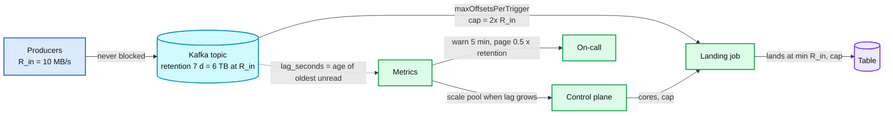

# Deep dive: backpressure, lag, and catch-up

> One-line answer: backpressure in an ingestion platform ends at Kafka, because producers must never block on the lake; the consumer pulls at the rate it can land, bounded per batch by `maxOffsetsPerTrigger`, lag is measured in seconds against retention, catch-up after an outage is linear at a per-pipeline multiplier, and the only way to lose data is to stay dead longer than retention, which is why the page fires at half of it.

Part of [`../solution.md`](../solution.md) §5.2, §5.5. Concepts: [`../../../concepts/stream-processing.md`](../../../concepts/stream-processing.md) §6, [`../../../concepts/rate-limiting-and-load-shedding.md`](../../../concepts/rate-limiting-and-load-shedding.md).

## 1. Where backpressure stops

Three places it could go, one that is right:

| Push back to | What happens | Verdict |
|---|---|---|
| Producers | Apps block or drop when the lake is slow | Wrong. The lake being down must be invisible to a checkout service |
| Kafka | Data accumulates in the log, consumers read later | Right. Kafka is the buffer, retention is the SLA |
| Inside the job (operator to operator) | Flink credit-based flow control | Not applicable. A stateless batch has no operator chain to throttle |

So "backpressure" means: the consumer decides how much to read per batch, and Kafka absorbs the difference.

## 2. Bounded batches

Without a cap, a batch after an outage tries to read everything that accumulated. A 1 h outage on a 10 MB/s topic is 36 GB in one batch: 100x the normal batch, executor OOM, batch fails, restart, same batch, same OOM. With `maxOffsetsPerTrigger = 2 × normal per-trigger volume` the job runs back-to-back batches of 2x size until lag is zero. Memory is flat, recovery is linear.

Rules for the cap:
- Per pipeline, set from the measured p50 batch volume × multiplier (2x default, up to 5x for catch-up when the control plane adds cores).
- Distributed across partitions proportionally to their backlog, so a hot partition does not starve the rest.
- The same for files (`maxFilesPerTrigger`, `maxBytesPerTrigger`): one 100 GB file and 10k tiny ones must not share a batch.

## 3. Lag in seconds

Offsets behind is meaningless without the rate: 1 M offsets behind is 10 s on a busy topic and a day on a quiet one. Define:

`lag_seconds(pipeline) = now − min over partitions of (timestamp of the first unread record)`

Compute it from the record timestamp at the last committed offset (the job knows it) or from `offsetsForTimes` probing. Alert thresholds:

| Level | Threshold | Meaning |
|---|---|---|
| Warn | > freshness SLO × 5 (5 min for tier A) | Something is slow |
| Warn | `batch_duration / trigger_interval > 1` for 10 batches | Leading indicator: lag is about to grow |
| Page | `lag_seconds > 0.5 × retention` | Data loss in half a retention window if nothing changes |
| Page | start offset < earliest available | Loss happened. Refuse to auto-reset |

## 4. Catch-up math

Let `R` be the ingest rate, `c` the cap multiplier, `T` the outage. Backlog at recovery: `R × T`. Landing rate during catch-up: `c × R`. Lag decays at `(c − 1) × R`, so recovery time is `T / (c − 1)`.

| Outage | Cap 2x | Cap 3x | Cap 5x |
|---|---|---|---|
| 1 h | 60 min | 30 min | 15 min |
| 6 h | 6 h | 3 h | 1.5 h |
| 24 h | 24 h | 12 h | 6 h |

The multiplier costs cores for the duration. The control plane raises it and scales the pool when `lag_seconds` exceeds a threshold, and drops it back when lag is zero. The platform ceiling on total catch-up cores stops one pipeline's recovery from starving live ingestion for the others.

## 5. Retention is the SLA

7 days of retention means a pipeline can be dead for 7 days and lose nothing. Costs:
- Local disk: 7 days × 1 PB × RF 3 / 3x compression = 7 PB. Too much for brokers.
- Tiered storage: keep 24 h local, ship closed segments to S3, serve older offsets from there. Local becomes ~1 PB, S3 holds ~2.3 PB at ~$50k/month. A catch-up read of 5-day-old data streams from S3 at S3 speeds (slower, and does not evict the page cache that live consumers depend on).
- The 24 h local window is the number to watch. If tiering falls behind, brokers fill.

With tiering cheap, tier A topics get 30 days. That turns "dead for a week" from a loss into a lag.

## 6. Sink outage timeline

`solution.md` §5.2 has the sequence diagram. Summary: t=0 commit fails, retry with backoff (5 s to 60 s, jittered), t=5 min warn, t=60 min sink back, catch-up at cap, t=120 min lag zero (2x) or t=75 min (5x). No partial commit is possible, so every retry is a full batch re-execution, which costs compute and nothing else.

## 7. Skew

A batch finishes when its slowest task does. One partition at 10x the rate makes one task 10x slower, so the batch takes 10x longer and the pipeline's freshness p99 is set by one partition.
- Keyless topics: sticky partitioner, balanced by construction. Check the producer first.
- Keyed topics: fix upstream (more partitions, a better key). Ordering per key must hold, so the job cannot re-partition.
- Inside the job: `minPartitions` splits one Kafka partition's offset range into several tasks. The `_offset` column preserves order in the data even though tasks run in parallel.
- Metric: `max task duration / median task duration` per batch. Above 3 is skew.

## 8. Multiplexed jobs and isolation

A job carrying 100 small pipelines has one batch clock. The slowest pipeline in the group sets the batch time for all. Group by tier and by similar volume, cap each pipeline inside the group, and move a pipeline to a dedicated job when it crosses ~50 MB/s or when its batch time is consistently the group's maximum.

## 9. What not to say

- "Backpressure to the producer." The producer is a checkout service. No.
- "Drop records under load." Ingestion never sheds. The buffer exists so it never has to.
- "Flink handles backpressure automatically." It handles it between operators of one job. The question is about the sink being down, which Flink answers the same way we do: the source stops reading and Kafka accumulates.

## 10. Interview soundbite

"The lake can be down for a day and nobody upstream notices, because the buffer absorbs it. My job is to make sure the buffer is big enough (retention with tiering), that catch-up is bounded (cap per batch), and that I get paged before retention runs out, not after."
