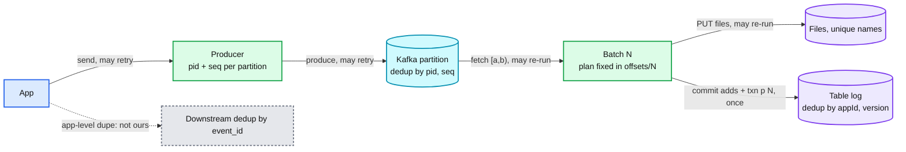

# Deep dive: exactly-once from source to table

> One-line answer: every hop is at-least-once and there is exactly one place where duplicates die, the table commit, because the batch's source position (`txn(appId, batchId)`) is written in the same atomic log entry as the batch's files; a re-executed batch reads the same fixed plan, finds its own marker, and skips, so exactly-once is a property of the commit, not of the transport.

Part of [`../solution.md`](../solution.md) §4.1, §10.5. Concepts: [`../../../concepts/exactly-once.md`](../../../concepts/exactly-once.md), [`../../../concepts/stream-processing.md`](../../../concepts/stream-processing.md) §5. Table side: [`../../delta-lake-transactions/deep-dives/streaming-and-idempotent-writes.md`](../../delta-lake-transactions/deep-dives/streaming-and-idempotent-writes.md).

## 1. The two halves

Exactly-once **delivery** does not exist: a network can always lose the ack. Exactly-once **effect** is routine: make the effect idempotent under a key and retry freely. Ingestion has three effects to make idempotent: the record reaching Kafka, the record reaching the table, and (for files) the file being marked consumed. Each has its own key and its own store.

## 2. Hop 1: producer to Kafka

- `enable.idempotence = true` (default since 3.0) gives the producer a producer id and a per-partition sequence number. The broker keeps the last 5 sequences per (pid, partition) and rejects a duplicate. Retries up to `delivery.timeout.ms` (2 min default) are safe.
- `acks = all` with `min.insync.replicas = 2` means the ack arrives after 2 of 3 replicas have the record. A leader failure after the ack loses nothing.
- What it does not cover: the app calling `send` twice (a new record, a new sequence), a producer restart (a new pid, so a message in flight during the restart can be doubled). Cover the second with a transactional producer if it matters; for logs and clicks nobody does.

## 3. Hop 2: Kafka to batch

The driver writes `offsets/N` before running batch N. The plan is `{partition: [start, end)}`. Two properties:
- **Deterministic.** Every execution of batch N reads exactly the same records. Not "roughly the same window", the same offsets.
- **Durable before side effects.** The plan is in the checkpoint directory before any task runs. A crash anywhere afterwards re-executes N, never N with a different range.

This is the whole reason micro-batch is simpler than a stream processor here: the checkpoint is a few hundred bytes of offsets, written once per batch, and there is no operator state to snapshot.

## 4. Hop 3: batch to table

The commit for batch N is one log entry containing `add` actions for the new files and `txn { appId: p, version: N }`. Before committing, the driver reads the current snapshot's `txn` map. If `txn[p] >= N`, the batch already landed; skip. Otherwise commit with put-if-absent.

Why it is airtight:
- Marker and data are in the same object. There is no window where one exists without the other.
- The snapshot read and the put-if-absent are not atomic together, but the put-if-absent fails if anyone else committed in between, and the retry re-reads the snapshot. A stale read can only cause a retry, not a duplicate.
- `appId` is the pipeline id, not the job id, so a pipeline moved to a different job (multiplexing change, cluster migration) keeps its markers.
- `version` must be monotonic per appId. The batch id from the checkpoint is.

What to say about retention: markers live in the table's snapshot; `setTransactionRetentionDuration` expires them. A pipeline that restarts after longer than that with an old checkpoint could re-land a batch. Keep the retention longer than any plausible pause (30 days), and start a pipeline that was paused for longer from a fresh checkpoint with a new `appId`.

## 5. Hop 3b: file sources

Same commit, plus a state store. The file list is the plan (`offsets/N` holds `(key, etag, size)` per file). After the table commit, the file-state entries flip to `landed`. If the driver dies between the commit and that flip, the re-executed batch skips the commit (marker) and flips the entries. The file-state store is snapshotted into the checkpoint with each batch so a restore is consistent with `commits/N`.

## 6. Hop 3c: CDC

Two layers. The changelog bronze uses the `txn` marker like any stream. The mirror uses `MERGE ... WHEN MATCHED AND source.lsn > target._lsn`, which is idempotent on its own: applying the same batch twice converges. Both are used because the marker prevents wasted work and the guard protects against connector-level duplicates (a restarted connector re-emits from its last committed offset, so the same change can appear at two Kafka offsets).

## 7. Multiplexed jobs

One job, 100 pipelines, 100 tables per batch. Each table gets its own commit with its own `txn(p_i, N)`. A crash between table 37 and 38 re-runs the batch; tables 1 to 37 skip, 38 to 100 commit. No cross-table atomicity, and none is promised.

## 8. Replay

A replay pipeline has its own `appId` (`p_replay_17`) and lands into a staging table with its own markers. The swap is `INSERT ... REPLACE WHERE range`, one commit that removes old files and adds new. Running the swap twice is idempotent (same predicate, same files). The live pipeline's blind appends never conflict with a `replaceWhere` on a disjoint predicate.

## 9. What is not exactly-once

| Case | Why | Whose job |
|---|---|---|
| App sends the same business event twice | Two Kafka records, two offsets | Downstream dedup by `event_id` with a window |
| Producer restarts with a message in flight | New pid, sequence dedup does not apply | Transactional producer, or accept |
| A replay of a range that the live job also re-landed | Cannot happen: the swap replaces the range | n/a |
| Two pipelines writing the same table | Different `appId`s, both land | Do not do this; one writer per table |
| A file re-uploaded with the same bytes and a new etag | New identity, lands again | `on_overwrite = replace` policy or downstream dedup |

## 10. Interview soundbite

"Exactly-once here is one write: the table commit carries the files and the source offsets together. Everything upstream is at-least-once and I do not try to fix that; I make the last write idempotent under `(pipeline, batch)` and let every hop retry."
