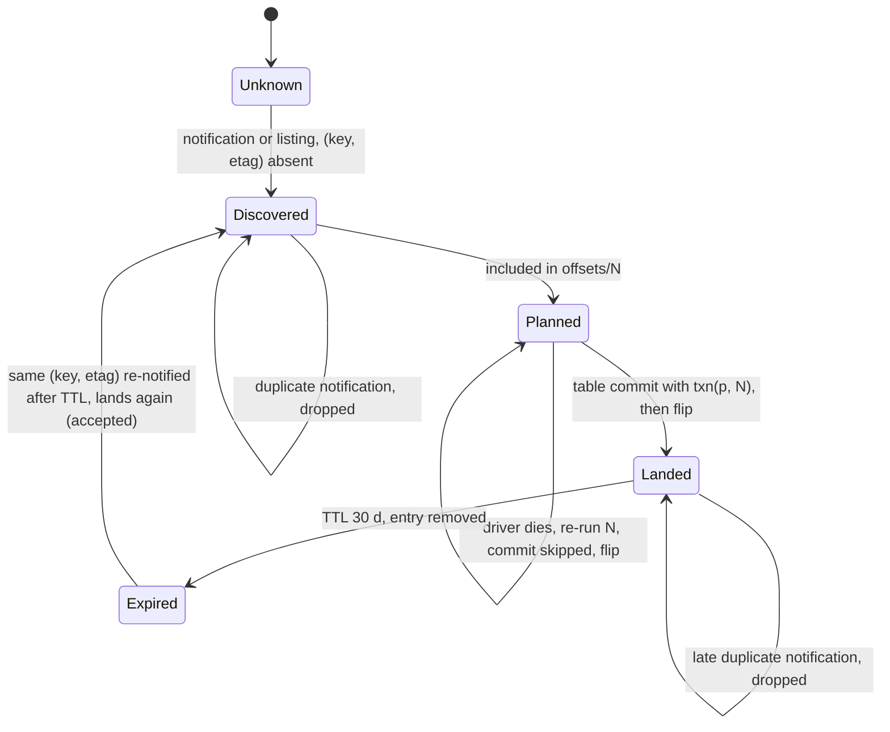
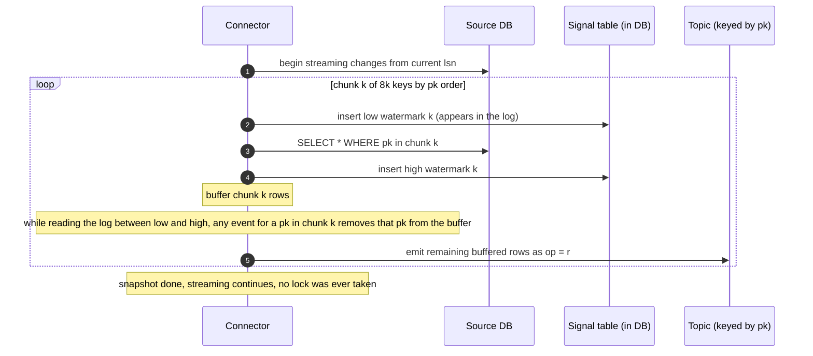

# Deep dive: file sources and CDC sources

> One-line answer: files and database logs are turned into the same thing Kafka already is, a bounded replayable range with a durable position, so the landing job does not care; files get that through notifications plus a file-state store plus a backup listing, and CDC gets it through a connector that writes a keyed, ordered topic and a chunked snapshot with watermarks that interleaves with the live log without gaps or double applies.

Part of [`../solution.md`](../solution.md) §4.2, §4.3. Sources: [Auto Loader file notification mode](https://docs.databricks.com/aws/en/ingestion/cloud-object-storage/auto-loader/file-notification-mode), [S3 event notifications](https://docs.aws.amazon.com/AmazonS3/latest/userguide/EventNotifications.html), [Debezium incremental snapshots](https://debezium.io/blog/2021/10/07/incremental-snapshots/). Concepts: [`../../../concepts/stream-processing.md`](../../../concepts/stream-processing.md) §7.

## Part A: files

### A1. Discovery: notifications vs listing

| | Notifications (S3 → SQS) | Listing |
|---|---|---|
| Latency | Seconds | The listing interval, minutes to hours |
| Cost at 10 M files/day | 10 M SQS messages, ~$4/day | 10k LIST pages per full scan; hourly on 1,000 pipelines is $1,200/day |
| Completeness | At-least-once, can be lost (misconfig, expired queue) | Complete by construction |
| Ordering | None | Lexicographic |
| Setup | Bucket notification config, queue per pipeline, IAM | None |

Use both: notifications for latency, a backup listing (hourly for small prefixes, daily for large, and always on pipeline start) for completeness. A listing that finds files the state store does not know is a signal that notifications are broken.

Layout matters for the listing: `prefix/date=2026-09-17/hour=14/` lets the backup listing scan only recent prefixes. A flat prefix with 300 M objects cannot be listed in any useful time.

### A2. The file-state store

Keyed by `(key, etag)` (or `(key, version_id)` with bucket versioning). Value: size, discovered_at, batch_id, state ∈ {discovered, landed}. Lives in RocksDB inside the job, snapshotted into the checkpoint with each batch so a restore is consistent with `commits/N`.

Sizing: 200 B per entry (hash the key and etag to 32 B each, plus metadata) × 10 M/day × 30 days = 60 GB for the biggest pipeline. Too big for a checkpoint snapshot. Above ~20 GB, move to an external KV (a small table keyed by pipeline, or DynamoDB) and treat the flip as idempotent after the table commit. Or, better, ask the uploader for fewer, larger files.

### A3. Reading files

- Splittable (Parquet, ORC, CSV, JSON lines, uncompressed): byte-range splits across tasks, 128 MB each. The file is one state entry; it flips when the batch containing all its splits commits.
- Non-splittable (gzip): one task per file. Cap at 10 GB; above that quarantine by reference and page the owner, or route to a large-file pipeline with a dedicated pool.
- `maxFilesPerTrigger` and `maxBytesPerTrigger` together: 10k files or 100 GB, whichever first.

### A4. Overwrites, deletes, and partial uploads

- Overwrite in place: new etag, new identity, lands. `on_overwrite ∈ {append, replace, reject}` is the owner's policy.
- Delete: `ObjectRemoved` events are ignored by ingestion (bronze is append-only). A downstream job can honor them if the source semantics demand it.
- Partial upload: S3 multipart uploads are invisible until completed, so a notification means a complete object. On a filesystem-like store (ADLS, HDFS) require a rename-on-complete convention (`_tmp/` then move) or a `_SUCCESS` marker per batch of files.

## Part B: CDC

### B1. Extraction

A connector per source database reads the log: Postgres logical decoding through a replication slot (`pgoutput`), MySQL binlog with GTIDs, MongoDB change streams. Output per row change: `{op: c|u|d|r, before, after, source: {lsn or gtid, tx_id, ts}, ts_ms}` to a Kafka topic per source table, keyed by primary key. Per-key order is guaranteed by the partition; cross-key order within a transaction is not, unless the consumer aligns on `tx_id`.

The connector's own offset (how far in the log it has published) is stored in Kafka Connect's offset topic and committed after the records are acknowledged, so a connector restart re-emits from the last committed offset (at-least-once into the topic). The `lsn` guard at apply absorbs that.

### B2. The snapshot handoff

The naive snapshot locks the table, copies it, records the LSN, and streams from there. It blocks writers for the copy duration, which on a 1 TB table is hours. The incremental snapshot (DBLog, Debezium 1.6+) interleaves with the live log and never locks:

Why it is correct: a change event for key `x` that lands in the log between the two marks was committed after the chunk read started, so its `after` image is at least as new as the snapshot row; emitting only the change avoids an older snapshot row overwriting a newer change. A change that lands after the high mark is emitted in order after the snapshot row, so the mirror ends up with the newer state. A change before the low mark was already streamed and the snapshot row is newer.

### B3. Apply

Every batch:
1. Append every change to the changelog bronze (the replay source and the audit trail).
2. Within the batch, keep the latest change per key (max `lsn`).
3. `MERGE INTO mirror USING latest ON pk WHEN MATCHED AND latest.lsn > mirror._lsn THEN (op = d ? DELETE : UPDATE SET *) WHEN NOT MATCHED AND op != d THEN INSERT`.
4. One commit per table with `txn(p, N)`.

Cost: a `MERGE` rewrites every file containing a touched key (copy-on-write) or writes a deletion vector plus new rows (merge-on-read). For a 1 TB mirror with 1,000 changes/s spread uniformly, a 60 s batch touches ~60k keys across most of the ~1,000 files: tens of GB rewritten per minute. This is why CDC batches run at 60 s, not 5 s, and why the hottest mirrors use merge-on-read with a nightly compaction. Freshness under 60 s is met; under 10 s would cost 6x the rewrite.

### B4. Deletes and tombstones

A `d` event carries `before` and a null `after`. On the topic, Debezium also emits a null-value tombstone so a compacted topic drops the key. The mirror either deletes the row or keeps it with `_deleted = true` (soft delete, lets downstream see the deletion). Owner's choice, default soft delete with a 30-day hard delete.

### B5. Failure modes specific to CDC

| Failure | Effect | Mitigation |
|---|---|---|
| Connector down 1 day | Postgres holds WAL for the slot; source disk fills | `max_slot_wal_keep_size`, alert at 50%, drop the slot and re-snapshot as the last resort |
| Connector restarts | Re-emits from last committed offset, duplicates on the topic | `lsn` guard at MERGE |
| Source DDL rename or retype | Mirror cannot guess | Pause with ticket and deadline (see schema deep dive) |
| Source failover to a replica | LSNs differ on the new primary (Postgres) | GTID on MySQL survives failover; on Postgres re-snapshot or use a failover-aware slot (Postgres 17 logical slot sync) |
| Hot key (one row updated 1,000/s) | One partition hot, one file rewritten every batch | Per-batch dedup to latest already collapses it to one change per batch |
| Large transaction (10 M rows) | One batch cannot align to it | Batch by offset, document eventual cross-key consistency, or align to `tx_id` markers at the cost of latency |

## Interview soundbite

"Files and databases are worse sources than Kafka: no offsets, no order, and at-least-once notifications or connectors. I do not make the landing job cope with that. I give each source a state store that turns it into a bounded replayable range (the file-state store for files, the keyed topic plus lsn guard for CDC), and then it is the same job with the same commit."
