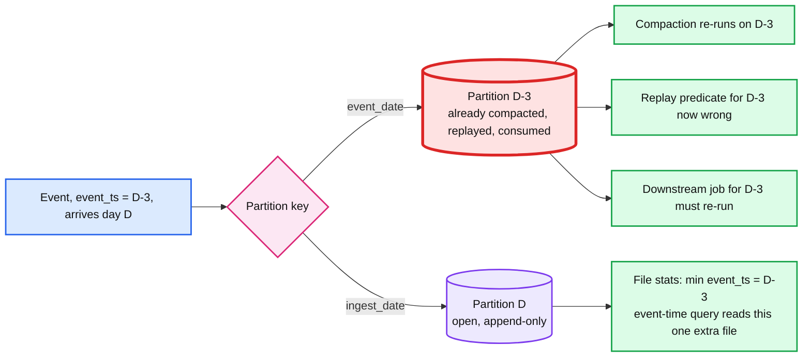

# Deep dive: late events and event time at ingestion

> One-line answer: an ingestion table is partitioned by ingest time and clustered by event time, never partitioned by event time, so a 3-day-late event lands in today's files without rewriting history and is still findable by event-time queries through file statistics; ingestion measures lateness and publishes the histogram, and the watermark lives downstream where a window actually closes.

Part of [`../solution.md`](../solution.md) §5.3. Concepts: [`../../../concepts/stream-processing.md`](../../../concepts/stream-processing.md) §2 and §3.

## 1. Two clocks

| Clock | Column | Who sets it | Trust |
|---|---|---|---|
| Event time | `_event_ts` | The producer, from the device or app clock | Low. Skewed, offline, sometimes garbage |
| Ingest time | `_ingest_ts` | The landing job, from the broker's append timestamp or the job clock | High. Monotonic per partition, bounded skew across jobs |

Kafka gives a third: the broker `LogAppendTime` if configured, which is a good `_ingest_ts` because it is set once and never changes across re-executions of a batch. Prefer it over the job's clock so a replayed batch lands in the same ingest partition.

## 2. Why not partition by event time

With `event_date` partitions every closed partition is forever open. Compaction, replay predicates, retention deletes, and downstream "this day is done" signals all become wrong. With `ingest_date` partitions a partition is closed the moment the day ends, and nothing ever writes to it again except a replay swap.

## 3. Making event-time queries fast anyway

Queries want `WHERE event_ts BETWEEN a AND b`. Without help that scans every ingest partition.
- **File statistics.** Every Parquet file carries min/max per column, stored in the table's metadata. The planner skips files whose `_event_ts` range does not overlap the query.
- **Clustering.** Within a batch, sort by `_event_ts` before writing so each file's range is tight. Over time, liquid clustering or Z-order on `_event_ts` keeps ranges tight after compaction.
- **The shape of lateness.** > 99% of events arrive within minutes. Almost every file in `ingest_date = D` has `_event_ts` within D. The late 1% widen the min of a few files; those few files are the only extra reads for a query on D-3. Cost: a few extra file reads, not a scan.
- **Optional hidden partitioning.** Iceberg's `days(event_ts)` transform or a generated column in Delta can add event-day as a second-level partition. Do not: it recreates the "closed partition reopened" problem one level down. Clustering is enough.

## 4. Measure lateness, do not enforce it

`lateness = _ingest_ts − _event_ts` per record, exported as a histogram per pipeline (p50, p99, p99.9, max). Uses:
- The p99 is the number a downstream job uses for its watermark (`withWatermark("event_ts", "<p99 lateness>")`).
- A shift in the histogram is an alert: a mobile SDK that starts batching for an hour changes p99 from 30 s to 60 min, and every downstream window is now wrong.
- Negative lateness (event in the future) and lateness > 30 days are flagged with `_event_ts_valid = false`. The row lands; the flag lets clustering and downstream filters ignore garbage.

## 5. Where the watermark lives

A watermark says "no event older than W will arrive", which is the condition for closing a window. Ingestion has no window. The first place that does is a downstream aggregation or a silver table partitioned by `event_date`:

1. Downstream job reads bronze with a watermark of p99 lateness (say 10 min).
2. Events inside the watermark go into the silver partition for their event day.
3. Events outside it go to a late side table (or Spark's dropped-late metric, which is loss, so use the side table).
4. A daily reconciliation job merges the side table into silver with `MERGE` and re-runs any aggregate over the affected days.

That is the Dataflow model's answer (watermark plus late-data trigger), placed where it belongs.

## 6. Replay and event time

A replay of ingest range `[t1, t2)` re-lands exactly the events whose `_ingest_ts` was in that range, regardless of their event time. That is the property that makes `replaceWhere _ingest_ts in [t1, t2)` correct. With event-time partitions the equivalent predicate would be "every event whose event time is anything and whose arrival was in that range", which cannot be expressed as a partition swap.

## 7. Ordering

No global order exists. Within a Kafka partition, `_offset` orders records by production time at the broker. Across partitions, nothing. A consumer that needs "all events for user X in order" needs the producer to key by user X, which is the CDC design, not the log design. Say it before the interviewer asks.

## 8. Interview soundbite

"Late data is only a problem if something has already closed. Ingestion closes nothing, so I partition by when I received it, keep event time as a column with tight file stats, publish the lateness histogram, and let the first job that closes a window pick its watermark from that histogram."
