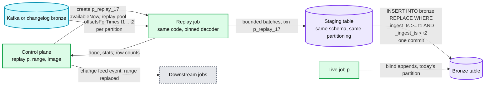

# Deep dive: replay and backfill

> One-line answer: replay is the same landing job run in bounded mode (`availableNow`) over a source range resolved to offsets, landing into a staging table under its own `appId`, then swapped into the live table with one atomic `replaceWhere` commit on an ingest-time predicate, while the live pipeline keeps appending; backfill is the same run without the swap, and the backfill's end offsets become the live pipeline's start offsets. One code path (Kappa), one set of bugs.

Part of [`../solution.md`](../solution.md) §4.4, §5.5. Sources: [Kreps, Questioning the Lambda Architecture (2014)](https://www.oreilly.com/radar/questioning-the-lambda-architecture/), [Spark `Trigger.AvailableNow`](https://spark.apache.org/docs/latest/structured-streaming-programming-guide.html#triggers), [Delta `replaceWhere`](https://docs.delta.io/latest/delta-batch.html#overwrite).

## 1. Why replay is a first-class operation

It will be needed for: a bad decoder release, a wrong partition or clustering choice, a corrupted source range (a producer bug that shipped garbage for 6 hours), a new table that needs history, a schema promotion that needs a column parsed out of `_rescued_data`, an audit that wants "as landed" vs "as corrected". If it is a script someone writes at 2am, it will duplicate rows, stall the live pipeline, or both.

## 2. Kappa, not Lambda

Lambda keeps a batch pipeline and a streaming pipeline that compute the same thing, and merges their outputs. Two implementations, two sets of bugs, and the batch one is the one that gets fixed first. Kappa (Kreps, 2014): one streaming implementation, and "batch" is that implementation run over a bounded range of the log. The precondition is that the log is replayable, which Kafka retention plus tiered storage gives us (7 to 30 days), and the changelog bronze gives us for CDC (the DB log is gone).

## 3. The flow

Steps:
1. **Resolve the range to source coordinates.** Kafka: `offsetsForTimes(t1)` and `offsetsForTimes(t2)` per partition, using the broker's `LogAppendTime` so the range matches `_ingest_ts`. Files: file-state entries with `discovered_at` in range. CDC: changelog bronze rows with `_ingest_ts` in range.
2. **Run bounded.** `availableNow` plans batches at the normal cap until the range is drained, then stops. Same code, same decoder (pinned to the fixed image, or the old image for an "as landed" replay), same `txn` markers under the replay's own `appId`.
3. **Land into staging.** `bronze_p__replay_17`, same schema and partitioning as the target. Row counts and quarantine counts are compared to the original landing for the range before the swap; a large difference stops the swap and pages.
4. **Swap.** `INSERT INTO bronze REPLACE WHERE _ingest_ts >= t1 AND _ingest_ts < t2 SELECT * FROM staging`. One commit: `remove` for every live file whose rows fall in the predicate, `add` for the staged files. Readers see before or after, never a mix.
5. **Notify.** The table's change feed carries the swap; downstream jobs that consumed the range re-run. The control plane records `REPLAY(id, range, image, requested_by, row delta)` for the audit trail.

## 4. Why the swap is safe next to the live stream

- The predicate is on `_ingest_ts`, which the live job never writes into the past. So the files the swap removes are never files the live job is adding to.
- Blind appends and a `replaceWhere` on a disjoint predicate do not conflict under the table format's rules; if the live job's commit lands first, the swap retries its put-if-absent after re-reading the log, and vice versa. Neither ever fails permanently.
- The predicate must be expressible on the partition column or on file statistics, or the table format has to scan every file to find matches. `_ingest_ts` inside `ingest_date` partitions is both.
- Running the swap twice is idempotent (same predicate, same staged files).

## 5. Backfill of a new table

Range = from the earliest available offset (or a chosen start) to "now". No swap: land directly into the target. When the backfill finishes, its last `end_offsets` are written as the live pipeline's `start_offsets` and the live pipeline starts. The gap between "backfill read up to X" and "live starts at X" is zero by construction, and any record in flight is covered because the live pipeline starts at X, not at "latest".

If the history is older than Kafka retention: read from another pipeline's bronze (the raw topic may have been landed elsewhere), from the archived topic on tiered storage, or accept that the table starts at retention minus now.

## 6. Isolation and cost

- Replays run in their own pool with their own quota. A platform-wide bug that triggers 500 replays queues them by tier rather than starving live ingestion.
- Reads of old offsets come from tiered storage, which does not evict the broker page cache that live consumers use.
- A 6 h replay of a 10 MB/s topic is 216 GB raw, ~20 min at 5x normal rate on a dedicated pool, ~$20 of compute. A 30-day replay of a 1 GB/s topic is 2.6 PB and a scheduled, budgeted project.
- Staging tables are dropped 7 days after the swap (time travel on the target covers the rollback window).

## 7. Rollback of a replay

Time travel: `RESTORE bronze TO VERSION AS OF <version before the swap>`. The pre-swap files are still present until `VACUUM` (7 days). After that window the rollback is another replay.

## 8. CDC replay

The mirror cannot be replayed from the source DB (the log is gone) but can be rebuilt from the changelog bronze: `MERGE` the changelog for the range in `lsn` order with the same `lsn` guard. The guard makes it idempotent, so a partial rebuild that dies can be re-run. A full rebuild is "truncate the mirror, apply the whole changelog", which is the same operation at a bigger range.

## 9. What is not replayable

- Data older than the source retention with no bronze copy. State this as the retention SLA.
- Side effects downstream (a notification sent, a payment made) triggered by the first landing. Ingestion's replay is data only; downstream must be idempotent or must not be re-triggered. The change feed event carries `replay_id` so downstream can decide.
- Quarantined rows whose raw bytes expired (30 days). Extend quarantine retention for regulated tables.

## 10. Interview soundbite

"Replay is the same job with a different trigger. It lands into staging under its own identity, then one atomic partition swap on the ingest-time predicate puts it live, and because the live job never writes into the past, the two never conflict. If I had a separate batch pipeline for this I would have two implementations to keep honest."
