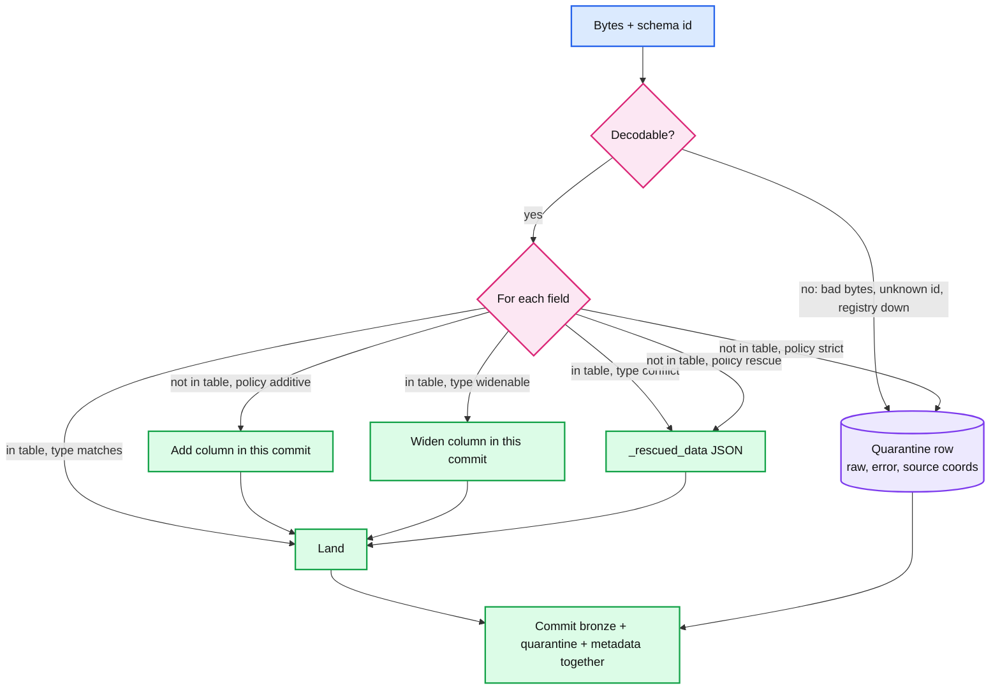

# Deep dive: schema drift, rescue, and quarantine

> One-line answer: the schema registry is the contract and it gates breaking changes at register time so the pipeline never sees them; the pipeline handles the rest by projecting each record onto the table schema, auto-adding optional columns under an `additive` policy, parking unknown or mistyped fields in `_rescued_data` under `rescue`, and writing undecodable records to a quarantine table in the same commit, so a batch never fails because of a schema and nothing is ever dropped.

Part of [`../solution.md`](../solution.md) §4.5, §5.4. Sources: [Confluent schema evolution and compatibility](https://docs.confluent.io/platform/current/schema-registry/fundamentals/schema-evolution.html), [Auto Loader schema evolution](https://docs.databricks.com/aws/en/ingestion/cloud-object-storage/auto-loader/schema).

## 1. Compatibility modes and what each allows

Confluent's registry checks a new schema against the previous one (or all previous, with `_TRANSITIVE`) at registration. Default is `BACKWARD`.

| Mode | New schema can | Reader upgrades | Use for |
|---|---|---|---|
| `BACKWARD` (default) | delete fields, add optional fields | Consumers first (a new reader reads old data) | Ingestion: the table is the reader and it is upgraded by us |
| `FORWARD` | add fields, delete optional fields | Producers first (an old reader reads new data) | Consumers that cannot be updated quickly |
| `FULL` | add or delete optional fields only | Either order | Long-lived contracts |
| `NONE` | anything | n/a | Never in production |

What `BACKWARD` rejects: a type change, a new required field without a default, a rename (Avro sees remove plus add; the remove is fine, the add must have a default). The rejection is an HTTP 409 to the producer's build or deploy. That is the point: the failure happens at 2pm in CI, not at 2am in the pipeline.

## 2. The projection per record

## 3. Policies

| Policy | New field | Type conflict | Default for |
|---|---|---|---|
| `additive` | Add nullable column in the same commit | Rescue | Registry-backed Avro and Protobuf topics |
| `rescue` | Into `_rescued_data` | Rescue | JSON, CSV, partner files |
| `strict` | Quarantine the record | Quarantine | Regulated tables with a signed-off schema |

Auto Loader's `cloudFiles.schemaEvolutionMode` is the same set with different names: `addNewColumns` (default, but it stops the stream on a new column and expects a restart), `rescue`, `failOnNewColumns`, `none`. Our `additive` differs from `addNewColumns` in one way worth saying: we evolve inside the commit and keep running, rather than fail and restart, because a restart at 10k pipelines is an outage.

## 4. `_rescued_data`

A string column holding a JSON object of `{field: original value}` for every field that did not fit, plus the source file or offset. Properties:
- Never null when something was rescued, so `WHERE _rescued_data IS NOT NULL` is the drift query.
- A daily job aggregates the top rescued keys per table and their inferred types, and opens a ticket for the owner.
- Promotion: `promote_rescued(table, key, type)` adds the column and runs a bounded backfill that parses the key out of `_rescued_data` for the affected range. One command, no replay of the source.

## 5. Inference for schema-less sources

The first run samples 1,000 records (or the first N files) and infers a schema. Rules that avoid the classic failures:
- Infer every leaf as `string` unless the owner declares types. `123` and `"N/A"` in the same column is the most common drift; strings never conflict.
- Nested objects are inferred as structs to a depth cap (say 10); beyond it, the subtree is a JSON string.
- Arrays of mixed types become JSON strings.
- The inferred schema is registered as a version in the registry under an `inferred/<pipeline>` subject, so `_schema_id` is meaningful for JSON too and drift is diffable.

## 6. Table evolution mechanics

- `add column` is a metadata action in the same commit as the data. Nullable, at the end of the struct. Readers of older files get null. No file is rewritten.
- Type widening (`int → long`, `float → double`, `decimal` scale up) is supported without rewrite by Delta 4 and Iceberg. Anything else is a new column.
- The evolving commit conflicts with a concurrent commit on the same table (compaction). Standard OCC: the loser re-reads the log and retries. It is rare (one evolution a week per table) and cheap.
- Column cap: an `additive` table stops adding at 500 columns and switches to rescue. A partner's 10k-field JSON is not a reason to have a 10k-column table.

## 7. Breaking changes are a migration

| Change | Registry topic | JSON source | What the owner does |
|---|---|---|---|
| Rename `a → b` | Registers as remove `a`, add `b` (with default) | New key `b` appears, `a` goes null | Table gains `b`, `a` stays null-only. Owner backfills `b` from `a` if needed and drops `a` after consumers move |
| Retype `user_id int → string` | Rejected at registration | Rescued, never coerced | New column `user_id_str` or new table version `events_v2`. Dual write during the move |
| New required field | Rejected unless it has a default | Lands as a new column | Producer adds a default |
| Remove a field | Allowed | Column goes null-only | Owner drops it later. Old data keeps it |
| Semantic change (same name, new meaning) | Invisible to any tool | Invisible | Only process catches this. Version the subject (`events-v2`) |

## 8. CDC DDL

The connector emits schema-change events from the source's DDL log. `ADD COLUMN` flows as additive. `DROP COLUMN` is ignored on the mirror (null-only from then on). `RENAME` and `ALTER TYPE` pause the pipeline with a ticket. A paused CDC pipeline holds the source's replication slot, which holds WAL, so the ticket carries a deadline: fix within the slot's WAL budget or drop the slot and re-snapshot.

## 9. Quarantine

A table per pipeline (or one per platform partitioned by pipeline) with `pipeline_id, batch_id, source_coords, raw bytes, error, error_class, ingest_ts`. TTL 30 days. Written in the same commit as the good rows, so the batch's accounting is exact: `rows in = rows landed + rows quarantined`.

Threshold: above 5% of a batch quarantined, the pipeline auto-pauses and pages the owner, because that is a bad decoder or a bad producer release, not bad data. Replay after the fix uses the quarantine rows' source coordinates for an exact range.

## 10. Interview soundbite

"Schema drift is not an error condition, it is Tuesday. I gate breaking changes at the registry so they fail the producer's deploy, and for everything else the pipeline lands what it understands, rescues what it does not, quarantines what it cannot decode, all in one commit, and tells the owner. A batch never fails because of a field."
