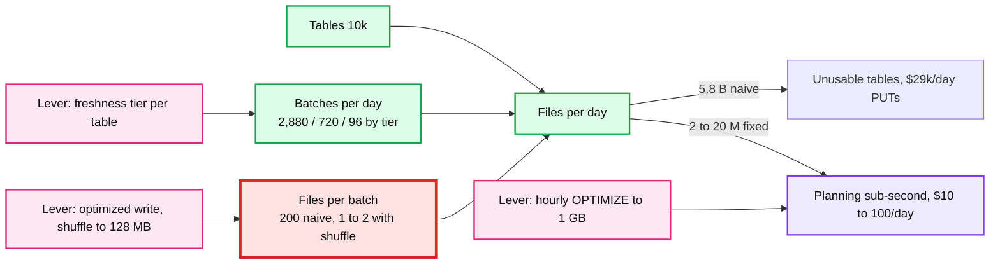

# Deep dive: sink commits, small files, and cost

> One-line answer: the thing that breaks first at 1 PB/day is not bytes, it is the count of files and commits per table, because every file costs a PUT, a log entry, a planner read, and a GET, and the naive design makes 5.8 billion of them a day; the fix is files per commit (shuffle to ~128 MB at write time), a trigger interval per freshness tier, one writer per table, and background compaction to 1 GB that never conflicts with the stream, for ~2x write amplification and a request bill that is a rounding error next to storage.

Part of [`../solution.md`](../solution.md) §2, §5.1. Sources: [Databricks file size tuning](https://docs.databricks.com/aws/en/delta/tune-file-size) (optimized writes and auto compaction target 128 MB, autotune 256 MB to 1 GB by table size), [Iceberg `write.target-file-size-bytes` = 512 MB](https://iceberg.apache.org/docs/latest/configuration/), [S3 pricing](https://aws.amazon.com/s3/pricing/). Table side: [`../../delta-lake-transactions/deep-dives/compaction-and-data-layout.md`](../../delta-lake-transactions/deep-dives/compaction-and-data-layout.md).

## 1. What a file costs

| Cost | Per file | At 5.8 B files/day (naive) | At 2 M files/day (fixed) |
|---|---|---|---|
| S3 PUT | $0.005 / 1,000 | $29,000/day | $10/day |
| Log entry (`add` action, ~1 KB with stats) | 1 KB in the table log and checkpoint | 5.8 TB/day of metadata; a week-old table's checkpoint is tens of GB | 2 GB/day, checkpoints under 100 MB |
| Query planning | The planner reads every `add` for the table | Minutes per query | Sub-second |
| Read | 2 GETs per Parquet file (footer, then data) at $0.0004 / 1,000 | A full scan of one day is 11.6 B GETs, $4,600 | 4 M GETs, $1.60 |
| Compaction | Rewrite once | 5.8 B tiny files to open | Already near target |

Bytes are the same in both columns. Storage of 200 TB/day at $23/TB-month is ~$4,600/day for that day's data, which is the real cost, and it is unaffected by file count.

## 2. Where files come from

`files per day = tables × batches per day × files per batch`

- Tables: 10k. Fixed by the business.
- Batches per day: 2,880 at 30 s, 720 at 2 min, 96 at 15 min. The freshness tier.
- Files per batch: number of tasks writing (200 for 200 partitions) in the naive design; 1 to 2 with a shuffle to target size.

The naive design multiplies 10k × 2,880 × 200. The fixed one multiplies 10k × (mostly 720 or 96) × 1.5.

## 3. Optimized writes: shuffle to size

Before writing, the batch shuffles its rows by the partition column (and clustering column) so that each writer task gets ~128 MB of output. Databricks' `optimizeWrite` does this adaptively (it estimates the output size from the input and picks the number of output partitions). Cost: one extra shuffle of the batch, ~10 to 20% more CPU per batch. Benefit: a 50 MB batch writes one file instead of 200.

For a multiplexed job the shuffle is per table, so 100 small tables each get 1 file per batch.

Target 128 MB, not 1 GB, at write time: a 1 GB target would hold a batch's data in memory longer and make the write tail latency worse. Compaction gets to 1 GB later.

## 4. Compaction that never blocks the stream

- Hourly `OPTIMIZE` on the last hour's partition rewrites 120 × 128 MB files into 15 × 1 GB. It commits with `dataChange = false`: same rows, different files.
- The stream's blind appends never conflict with it (the conflict rules of the table format treat appends and `dataChange = false` rewrites as disjoint).
- A streaming reader of the bronze table ignores `dataChange = false` commits, so it does not re-read the rewritten data.
- Auto compaction: the writer checks its own partition after commit and runs a small compaction if there are more than N (say 50) small files. It covers the tables nobody scheduled.
- Autotune: the target file size grows with the table (256 MB under 2.56 TB, 1 GB above 10 TB). Small tables with 1 GB files are worse for parallelism.

Write amplification: land once (128 MB), compact once (1 GB) = 2x. A second compaction level (daily to Z-order on `_event_ts`) makes it 3x for tables that need it. Budget stated in the NFRs: under ~2x for most tables.

## 5. One writer per table

The table log serialises commits with put-if-absent, so a table sustains a few commits per second at most. With one pipeline per table plus one compaction job, a table sees 2 to 3 commits per minute. Never fan out one topic to 500 jobs writing one table; a tenant or region is a column or a downstream job.

When a table must have many writers (a shared "events" table written by 50 producers' pipelines): merge them upstream into one topic, or accept a coordinator (the Delta problem's §5.3) and the latency it adds.

## 6. Partition granularity

| Partition | Directories per day | Files per directory per hour (fixed design, 30 s trigger) | Use when |
|---|---|---|---|
| `ingest_date` | 1 | 120 | Most tables (< 1 TB/day) |
| `ingest_date, ingest_hour` | 24 | 120 | Tables over ~1 TB/day so compaction and replay touch an hour |
| `ingest_date, tenant` (10k tenants) | 10k | ~1, tiny | Never. 240k directories a day of small files |

A high-cardinality partition column is the small-file bomb by another route. Cluster by it instead.

## 7. Storage cost and retention

200 TB/day landed. Month 1: 6 PB, $138k/month at $23/TB-month. Year 1: 73 PB, $1.7 M/month if nothing expires. So:
- Bronze retention 30 to 90 days for most tables, with a lifecycle rule to infrequent-access ($12.5/TB-month) after 30 days and to archive after 90 for the few that must be kept.
- PII-tagged bronze at 30 days.
- The changelog bronze for CDC is small (50 MB/s) and kept for a year as the audit trail.
- Kafka tiered storage holds ~2.3 PB for 7 days, ~$50k/month. Cheaper than the 600 brokers it replaces.

Compute: ~5,000 cores at ~$0.04/core-hour is ~$150k/month on demand; spot for the multiplexed tier (a spot loss costs one batch) cuts it by half.

## 8. What to measure

- Files per table per day, created and after compaction. Alert when created > 10x expected.
- Small-file ratio per table (files under 32 MB / files). Alert above 20% for more than 6 hours.
- `add` actions per commit. A stream committing 200 adds is missing its shuffle.
- S3 request cost per table per day, from the billing export. A table costing more in requests than in storage is misconfigured.

## 9. Interview soundbite

"The number I watch is files per table per day. One file per task per batch times 10k tables is billions of files and the platform dies of metadata. Shuffle to 128 MB at write, pick a trigger per freshness tier, compact hourly in the background, and the same bytes cost $10 a day in requests instead of $29,000."
