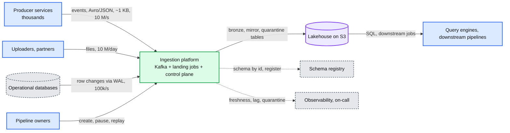
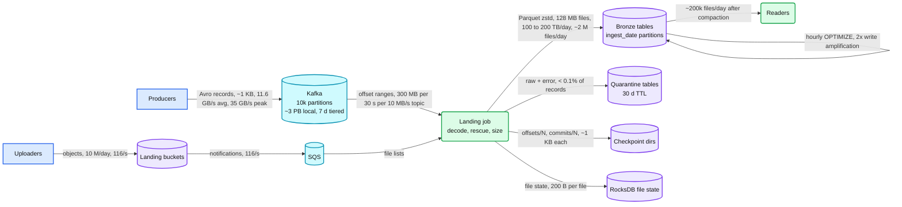
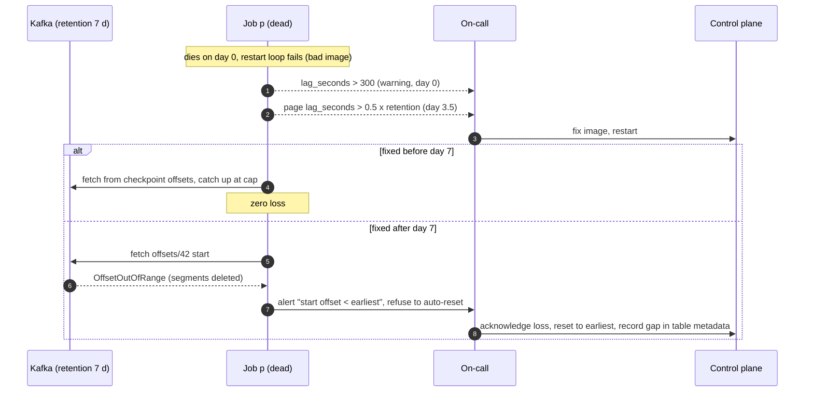
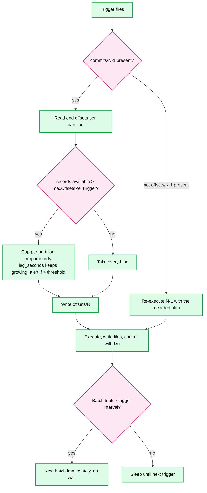
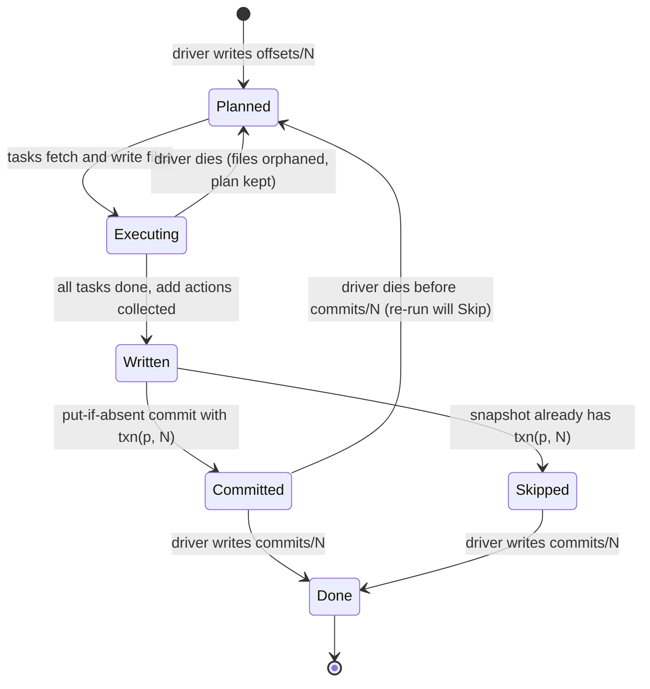
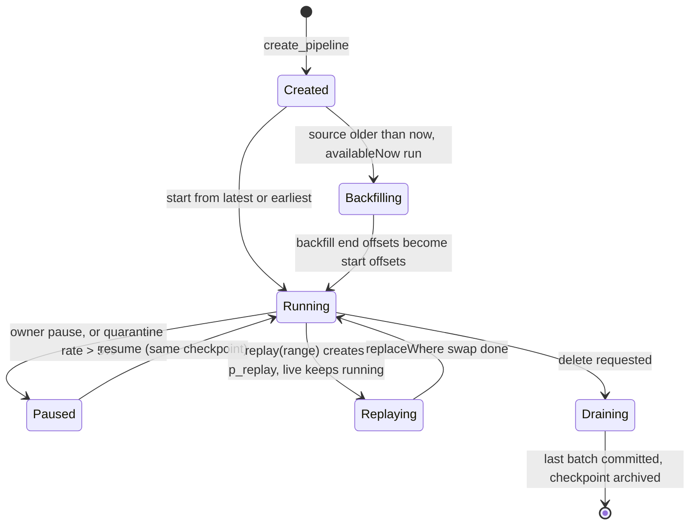
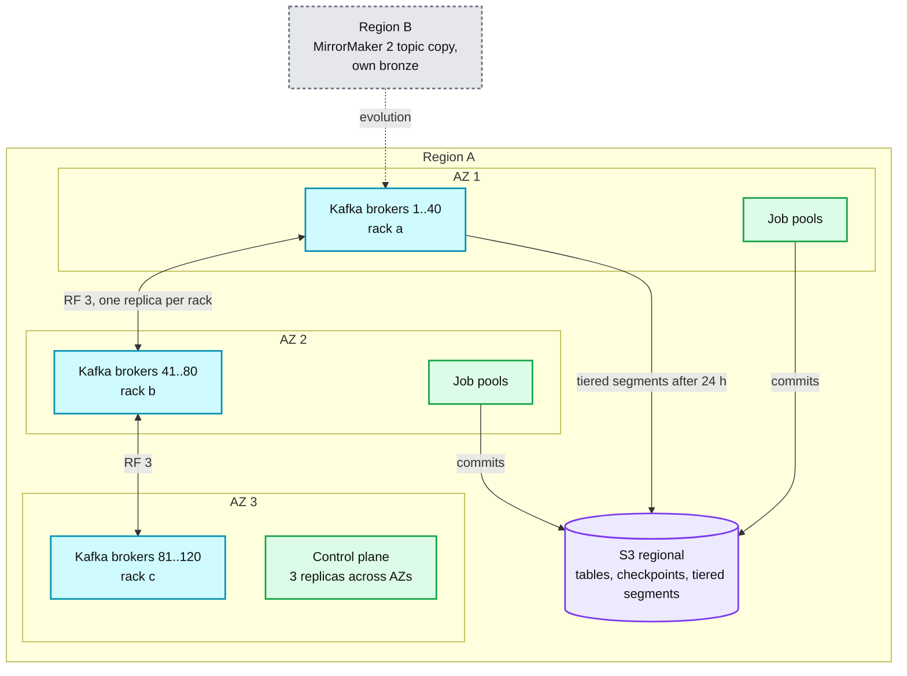
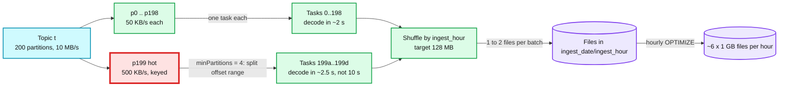
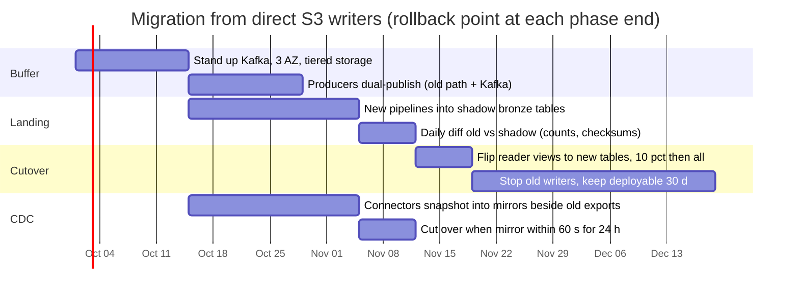

# Diagrams: Petabyte batch + streaming ingestion

The D1 to D12 set from `hld/CLAUDE.md` §4. A diagram is drawn once: the ones embedded in [`solution.md`](solution.md) are linked here, not repeated.

| # | Diagram | Where |
|---|---|---|
| D1 | Context | below |
| D2 | Data flow | below |
| D3 | Component architecture (final design) | `solution.md` §6 |
| D4 | Happy path per FR | FR1 Kafka batch: `solution.md` §6 Flow 1. FR2 file: §6 Flow 2. FR3 CDC: §6 Flow 3. FR4 replay: §6 Flow 4. FR5 schema: §6 Flow 6 |
| D5 | Failure paths | Driver dies after commit: `solution.md` §6 Flow 5. Sink down 60 min: §5.2. Broker dies: §10.4. Job falls off retention: below. Duplicate S3 notification: §6 Flow 2 |
| D6 | Decision flow | Lateness routing: `solution.md` §5.3. Schema mismatch per record: §5.4. Batch planning and rate limit: below |
| D7 | Entity relationship | `solution.md` §3.3 |
| D8 | State machine | Batch lifecycle: below. Pipeline lifecycle: below |
| D9 | Deployment / topology | Pools and control plane: `solution.md` §5.5. Regions and AZs: below |
| D10 | Scaling / partitioning | File bomb and fix: `solution.md` §5.1. Kafka partitions to tasks to files: below |
| D11 | Failure mode map | below |
| D12 | Rollout / migration | below |

---

## D1. Context (zoom-out)

## D2. Data flow

## D5. Failure path: a pipeline falls behind retention

## D6. Decision flow: batch planning and rate limit

## D8. State machine: batch lifecycle

## D8. State machine: pipeline lifecycle

## D9. Deployment: regions and AZs

## D10. Scaling: partitions to tasks to files

## D11. Failure mode map

```mermaid
%% D11: each component, what fails, blast radius, mitigation. Only the buffer being unreachable is a producer-visible outage.
flowchart TD
    KB[Kafka broker dies] -->|"leader moves in ~10 s"| KB1[Blast: none, producers retry<br/>Fix: RF 3, min.isr 2, rack aware]
    KC[Kafka cluster unreachable] -->|"producers block"| KC1[Blast: every producer<br/>Fix: 3 AZ stretch, client buffering, the one real outage]:::critical
    JD[Landing job dies] -->|"lag on one pipeline"| JD1[Blast: one table or one multiplexed group<br/>Fix: restart from checkpoint, re-run is a no-op]
    S3D[S3 or table log down] -->|"every commit fails"| S3D1[Blast: all tables lag, zero loss<br/>Fix: retry with backoff, catch up at cap]
    SRD[Schema registry down] -->|"new ids fail"| SRD1[Blast: records with new schemas quarantined<br/>Fix: cache forever, replay quarantine]
    CPD[Control plane down] -->|"no restarts, no replays"| CPD1[Blast: none for running jobs<br/>Fix: 3 replicas, leases expire gracefully]
    BD[Bad decoder release] -->|"quarantine spike"| BD1[Blast: one pipeline paused<br/>Fix: auto-pause at 5%, rollback, replay range]
    CMP[Compaction dead] -->|"file count grows"| CMP1[Blast: query planning slows over days<br/>Fix: alert on files per table, run OPTIMIZE]
    RET[Job dead past retention] -->|"segments deleted"| RET1[Blast: data loss for that pipeline<br/>Fix: page at half retention, never auto-reset]:::critical

    class KB,KC,JD,S3D,SRD,CPD,BD,CMP,RET service
    class KB1,JD1,S3D1,SRD1,CPD1,BD1,CMP1 store

    classDef service  fill:#dcfce7,stroke:#16a34a,stroke-width:2px,color:#111
    classDef store    fill:#ede9fe,stroke:#7c3aed,stroke-width:2px,color:#111
    classDef critical fill:#fee2e2,stroke:#dc2626,stroke-width:4px,color:#111
```

## D12. Rollout: from direct-to-S3 writers to the platform

