# HLD: Petabyte batch + streaming ingestion

> One-line answer: put a durable log (Kafka) between every producer and the lake so producers never block and the lake is allowed to be behind; run one stateless micro-batch job per pipeline that reads a source offset range, writes immutable Parquet, and commits the files and the source offsets in one atomic table commit (the `txn` marker), so a re-run of any batch is a no-op and the table is exactly-once by construction; land raw data append-only partitioned by ingest time so late events never rewrite history; treat the schema registry as the contract, rescue unknown fields, quarantine bad records, and make replay the same job in bounded mode writing through an atomic partition swap. The thing that breaks first is not throughput, it is the number of files and commits per table.

Sources: [Structured Streaming programming guide](https://spark.apache.org/docs/latest/structured-streaming-programming-guide.html), [Delta protocol, transaction identifiers](https://github.com/delta-io/delta/blob/master/PROTOCOL.md#transaction-identifiers), [Databricks Auto Loader](https://docs.databricks.com/aws/en/ingestion/cloud-object-storage/auto-loader/), [Flink end-to-end exactly-once](https://flink.apache.org/2018/02/28/an-overview-of-end-to-end-exactly-once-processing-in-apache-flink-with-apache-kafka-too/), [Confluent Schema Registry compatibility](https://docs.confluent.io/platform/current/schema-registry/fundamentals/schema-evolution.html), Netflix Keystone, Meta Scribe, Uber and LinkedIn Kafka posts (see [`research/`](research/) for URLs and spot-checks). Written flow-first: §4 builds one diagram one functional requirement at a time, §5 breaks and mutates that design one non-functional requirement at a time, §6 shows the final design and the six core flows to rehearse.

---

## 1. Understanding the problem

Restate before designing. "Ingestion" is the boring half of a data platform and the half that pages people. The job is to move bytes from places that produce them (apps writing to Kafka, systems dropping files, databases changing rows) into a place where they can be queried (tables on an object store), and to do it so that nothing is lost, nothing is doubled, the data is fresh enough, and a producer changing its mind about its schema at 2am does not stop the world. We do not transform, aggregate, or join. We parse, validate, partition, and land. Everything downstream is someone else's job on top of the tables we produce.

Three source shapes, one sink shape:
- **Streams.** Kafka topics. Ordered per partition, replayable within retention, at-least-once from producers.
- **Files.** Objects landing in buckets. Unordered, arrive in bursts, notifications are at-least-once, files can be overwritten.
- **CDC.** Database change logs. Ordered per key, needs an initial snapshot, has deletes.
- **Sink.** Lakehouse tables (Delta or Iceberg) on S3. Atomic commits of a set of files, a few commits per second per table at most, immutable files, and a small-file problem if you commit too often.

### 1.1 Functional requirements

Core:
1. **Stream ingestion.** Kafka topic to table. Every record lands exactly once as an effect. Freshness under 60 s at p99.
2. **File ingestion.** Files landing in a bucket (millions per day, any size) to table. Each file processed exactly once, including when notifications are duplicated or lost.
3. **CDC ingestion.** A database table to a mirror table with inserts, updates, deletes applied in per-key order. Snapshot plus log tail with no gap and no overlap.
4. **Replay and backfill.** Reprocess a time or offset range, or an entire source, into an existing table without duplicating rows and without stalling live ingestion.
5. **Schema drift.** Producers add, rename, or retype fields. The pipeline keeps running, nothing is dropped, additive changes flow through, bad records are quarantined and replayable.

Below the line: transforms and aggregations (downstream jobs), the query engine, table format internals (see [`../delta-lake-transactions/`](../delta-lake-transactions/)), the Kafka broker fleet itself (see [`../../popular_systems_deepdive/kafka/`](../../popular_systems_deepdive/kafka/)), catalog and access control, sub-second freshness.

### 1.2 Non-functional requirements

Ask for scale first. The interviewer will say "petabytes a day". Pin it to 1 PB/day and derive the rest.

| Dimension | Target | Why this number |
|---|---|---|
| Throughput | 1 PB/day raw. 11.6 GB/s average, ~35 GB/s at a 3x daily peak. ~10 M events/s average at 1 KB | Netflix, Uber, LinkedIn all publish trillions of events/day and PB/day scale. Ingestion traffic follows the day, so 3x peak is honest, 10x is for user-facing request paths |
| Fan-in | ~1,000 topics, ~10k pipelines, ~10k target tables, 10 M files/day, ~1,000 CDC tables | One topic often feeds several tables. Tables are the unit of ownership and freshness |
| Freshness | Kafka to queryable p50 < 30 s, p99 < 60 s. Files < 5 min. CDC < 60 s | Micro-batch to an object store costs seconds per commit. Under 10 s is possible, under 1 s is a different architecture |
| Delivery | Exactly-once effect per record per table | Every hop is at-least-once. The dedup lives at the commit point |
| Ordering | Per Kafka partition preserved (offset column). Per key for CDC | No global order. Say it out loud |
| Availability | Producers can always write (Kafka at 99.99%). The lake may lag. 1 h sink outage absorbed silently, 24 h recoverable without loss | The buffer is the availability story |
| Durability | Producer `acks=all` means it lands eventually. Buffer retention 7 days | A consumer 7 days behind loses nothing. Beyond that, data is gone |
| Late data | Any lateness accepted, nothing dropped, event time preserved, lateness measurable | Ingestion is not aggregation. Dropping late data is a downstream choice |
| Cost | Write amplification under ~2x, files per table bounded, S3 requests cheaper than S3 storage | The failure mode is a 20 M file table, not a slow one |

Below the line: sub-second end-to-end (needs a serving store, not an object store), cross-region active-active ingestion (evolution), global ordering across partitions (impossible without a sequencer, unnecessary here).

---

## 2. Back-of-envelope

Bytes. 1 PB/day = 10^15 / 86,400 s = **11.6 GB/s** average. Peak 3x = **35 GB/s**. At ~1 KB per event that is **11.6 M events/s** average, **35 M/s** peak. Per year: 365 PB raw, which is why raw retention on the lake is measured in months and compressed.

Kafka (the buffer). Rule of thumb: keep one partition under ~5 to 10 MB/s of producer ingress so a single consumer task can keep up with headroom. 35 GB/s / 5 MB/s = **7,000 partitions** at peak, round to **10k partitions** across ~1,000 topics. Replication factor 3 triples the write: 105 GB/s of disk writes at peak across the fleet. A broker on a 25 Gbps NIC sustains ~1 GB/s in plus ~2 GB/s of replication and consumer out, so ~**100 to 150 brokers** by network. Disk decides: 7 days × 1 PB × RF 3 = 21 PB raw, ~7 PB after 3x compression. At 12 TB usable per broker that is **600 brokers by disk**. That number is why tiered storage exists: keep ~24 h local (~1 PB, ~100 brokers × 10 TB) and 7 days in object storage. Say this trade explicitly.

Sink (the lake). Parquet with dictionary and zstd lands at ~5 to 10x smaller than raw JSON, so **100 to 200 TB/day** written. At a 1 GB target file that is 100k to 200k files/day if every file were perfectly sized. It never is:
- 10k tables, each committing every 30 s, with a Spark job of 200 tasks writing one file per task per batch: 10k × 2,880 batches/day × 200 files = **5.8 billion files/day**. That is the red node. Nothing else in this design is within two orders of magnitude of it.
- Fixed (§5.1): coalesce to one file per ~128 MB of output per batch, commit every 30 to 60 s, compact hourly to 1 GB. Target: **~1 to 2 M files/day** created, ~200k after compaction. S3 PUT at $0.005 per 1,000: 2 M PUTs/day is $10/day. 5.8 B PUTs/day would be $29k/day.

Compute. JSON parse plus Parquet encode runs ~5 to 20 MB/s per core depending on the schema. At 35 GB/s peak and 10 MB/s per core: **~3,500 cores** for the stream jobs, ~110 nodes of 32 cores. Add 30% headroom for catch-up after an outage: ~5,000 cores. This is small next to the query side. Ingestion is cheap in CPU, expensive in files.

Commits. 10k tables × 2 commits/min = 333 commits/s across the platform, ~0.03/s per table. Far below the few-commits-per-second ceiling per table. The ceiling matters only when one table has many writers (§5.1).

Files as a source. 10 M files/day = 116 files/s. One S3 notification each, one SQS message each. Trivial rate. Listing instead: 10 M keys at 1,000 per LIST page = 10k pages per full listing per pipeline, 10 to 50 ms each. A listing-based poller on 1,000 pipelines every minute is 10 M LIST calls/day at $0.005 per 1,000 = $50/day and minutes of latency. Notifications win on both.

CDC. 1,000 tables, ~100k row changes/s total, ~500 B each = 50 MB/s. Tiny in bytes. Hard in semantics (ordering, snapshot handoff, deletes).

Freshness budget (60 s p99): producer to Kafka ~10 ms, trigger interval 30 s (worst-case wait 30 s), batch execution 10 to 20 s (read, parse, write files), Delta commit ~1 s, planner sees the new version on its next snapshot. p99 lands around 55 s if the batch never runs longer than the trigger. When it does, lag compounds (§5.2).

---

## 3. The set-up

Data-processing style: system interface, naive data flow, then the data model.

### 3.1 System interface

**Input**
- Kafka records: `(topic, partition, offset, key, value bytes, headers, timestamp)`. Value is Avro or Protobuf with a schema id in the header, or JSON.
- Object store events: `(bucket, key, etag, size, event_time)` via notifications, plus the object bytes on read.
- CDC events: `(source table, op ∈ {c,u,d,r}, before, after, lsn or gtid, tx id, commit ts)`.
- Control: `create_pipeline(source, target, schema_policy, trigger, owner)`, `replay(pipeline, range)`, `pause`, `resume`.

**Output**
- Bronze tables: one row per input record, raw fields plus `_ingest_ts`, `_event_ts`, `_source`, `_partition`, `_offset`, `_schema_id`, `_rescued_data`.
- Quarantine tables: `(pipeline, raw bytes, error, source coordinates, ingest ts)`.
- CDC mirror tables: current row per key plus `_lsn`, `_op`, `_deleted`, `_updated_ts`.
- Metrics: lag (seconds and offsets) per pipeline, freshness per table, quarantine rate, lateness histogram.

### 3.2 Data flow (deliberately naive)

1. A consumer per topic reads records and writes each one as a line into a file on S3.
2. Every minute it closes the file and opens a new one.
3. A file watcher does the same for files that land in buckets.
4. A CDC connector reads the binlog and writes each change to the mirror table with an `UPDATE`.

This works at 1 MB/s and fails at every requirement above 1 MB/s: no atomicity (a crash mid-file leaves half a file that a reader sees), duplicates on restart (the consumer re-reads from its last commit but the file is already there), no schema handling, one file per minute per partition (10k partitions → 14 M files/day), and CDC by row `UPDATE` on an object store table is 100k rewrites/s of 1 GB files. Every section of §4 removes one of these.

### 3.3 Data model

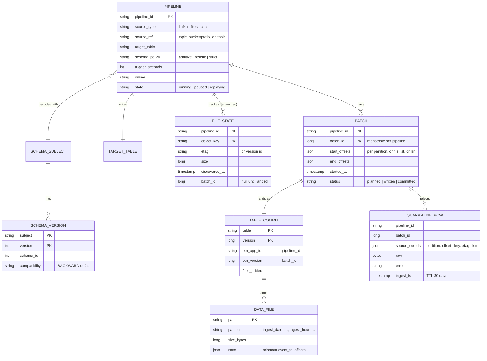

Access patterns that justify it:
- **"What has this pipeline landed?"** is `BATCH` by `(pipeline_id, batch_id)`, one row per batch, thousands per day per pipeline. Lives in the job's checkpoint directory on the object store, not in a database: the job is the only writer and reader.
- **"Has batch N already been committed to this table?"** is the `txn_app_id, txn_version` pair in the table's own log. This is the exactly-once lookup, and it lives in the table so it is atomic with the data.
- **"Have I seen this file?"** is `FILE_STATE` by `(pipeline_id, object_key)`, 10 M rows/day, point lookups at 116/s, and it must survive job restarts. A RocksDB store checkpointed with the batch (Auto Loader's design) or a small KV table.
- **"Which schema decodes this record?"** is `SCHEMA_VERSION` by `schema_id`, cached forever in every task because schema ids are immutable.
- **Bronze table partition key** is `ingest_date` (and `ingest_hour` for the biggest tables). Never event date. §5.3 says why.
- **Quarantine** is written like any bronze table and has a 30-day TTL so it cannot become a second lake.

---

## 4. High-level design

One subsection per functional requirement. Each one traces input to output through the boxes, adds the boxes it needs to a single diagram, and ends with what is still missing (which a deep dive in §5 fixes). The design at the end of §4 is deliberately the simple version.

### 4.1 Stream ingestion: a Kafka topic lands in a table, exactly once, within a minute

The trick everything else builds on: **the table commit is the only commit point, and it carries the source position.** A batch of records is either fully in the table together with "this pipeline has consumed up to offset X", or it is not there at all. Nothing else needs to be transactional.

**Flow: one micro-batch of pipeline `p` (Kafka topic `t`, 200 partitions)**

1. The producer wrote with `acks=all`, `enable.idempotence=true` (the default since Kafka 3.0), so a producer retry never duplicates a record inside a partition. Kafka has the record on at least `min.insync.replicas=2` brokers. This is the durability handoff: the producer's job is done.
2. The stream job for `p` wakes on its trigger (every 30 s). The driver reads the last committed batch from its checkpoint directory on the object store: `commits/41` exists, so batch 41 is done, `offsets/42` says what batch 42 will read. If `offsets/42` exists but `commits/42` does not, batch 42 is re-executed with exactly the same range (this is the replay guarantee).
3. The driver asks Kafka for the current end offsets per partition, caps them by `maxOffsetsPerTrigger` (say 50 M records per batch), and writes `offsets/42 = {partition: [start, end)}` to the checkpoint. Now the batch is planned and deterministic.
4. 200 tasks (one per partition) fetch their range, decode each record with the schema registry (schema id in the header, schema cached in the task), attach `_ingest_ts`, `_event_ts`, `_partition`, `_offset`, `_schema_id`, and write Parquet files under `table/ingest_date=2026-09-17/ingest_hour=14/part-<uuid>.parquet`. Unique names, nothing overwritten.
5. The driver builds one table commit: `add` per file plus `txn(appId = p, version = 42)`. It writes the commit with put-if-absent on the table log. If the table's snapshot already contains `txn(p, 42)` or higher, the driver **skips the commit entirely**: this batch already landed before a crash. That check is the exactly-once mechanism, and it works because the marker and the data are in the same atomic log entry.
6. The driver writes `commits/42` to the checkpoint. Batch 42 is done. Readers of the table see version N+1 with all of batch 42's rows and none of batch 43's.

**Where the duplicates could enter, and why they do not:** producer retry (killed by idempotent producer), driver dies between step 5 and 6 (batch 42 is re-executed, writes new Parquet files, sees `txn(p, 42)` in the snapshot, skips the commit, the orphan files are vacuumed later), driver dies between 3 and 5 (re-executed, no marker yet, commits normally). There is no window where data is in the table and the marker is not.

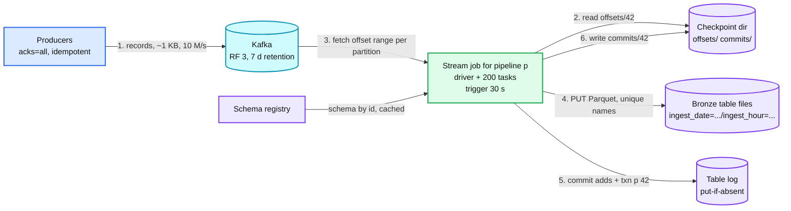

Data model so far: `BATCH(pipeline, batch_id, start_offsets, end_offsets)` in the checkpoint dir, `TABLE_COMMIT(txn_app_id, txn_version)` in the table log, bronze columns `_ingest_ts, _event_ts, _partition, _offset, _schema_id`.

**What is still missing:** (a) 200 files per batch per table every 30 s is the file bomb from §2 (§5.1). (b) When a batch takes longer than 30 s, lag compounds and nothing pushes back (§5.2). (c) A record with `_event_ts` three days old landed in today's partition. Is that right? (§5.3). (d) A record the registry cannot decode kills the task (§4.5, §5.4).

### 4.2 File ingestion: a file lands in a bucket and its rows land in a table, once

Files are a worse source than Kafka: no offsets, no order, at-least-once notifications, and a file can be overwritten in place. The fix is to **turn files into a stream with a state store**, then reuse the batch machinery above.

**Flow: discovery**

1. The bucket has an event notification configured: every `ObjectCreated` sends `(bucket, key, etag, size, time)` to an SQS queue owned by the pipeline. S3 notifications are at-least-once and can arrive out of order.
2. The stream job's driver, at each trigger, drains the queue (up to `maxFilesPerTrigger`, say 10k files or 100 GB) and for every message checks the **file-state store**: a RocksDB keyed by `(key, etag)` that lives in the job's checkpoint and is snapshotted with every batch. Seen already → drop the message. New → record it as `discovered, batch_id = 42`.
3. A backup **listing** runs every hour (or weekly at scale, because it costs 10k LIST pages per 10 M files) to catch notifications that were lost. Anything the listing finds that the state store does not know is enqueued. Notifications give latency, listing gives completeness.

**Flow: landing**

4. Batch 42's plan is the list of files, not offsets: `offsets/42 = [ (key, etag, size) ... ]`. Tasks read the files (splitting big ones by byte range for Parquet and CSV, whole-file for gzip), decode, attach `_source_file`, `_source_etag`, `_ingest_ts`, write Parquet, and the driver commits with `txn(p, 42)` exactly as in §4.1.
5. After the commit, the file-state entries for batch 42 flip to `landed`. If the driver dies before that, the re-executed batch 42 reads the same file list (it is in `offsets/42`), sees `txn(p, 42)` in the table, skips the commit, and marks the files landed.

**The overwritten file.** The key is the same, the etag differs. The state store keys by `(key, etag)`, so the new content is a new file and lands too. Both versions are in the bronze table with different `_source_etag`. That is correct for an append-only raw table; if the source semantics are "replace", the downstream job dedups by `(key, max(_ingest_ts))`. Say that this is a policy the pipeline owner chooses (`on_overwrite = append | replace | reject`), not something ingestion guesses.

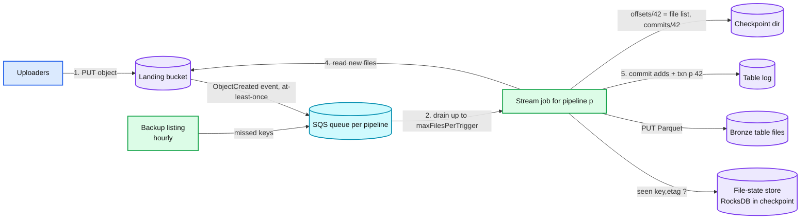

Data model so far: `FILE_STATE(pipeline, key, etag, size, discovered_at, batch_id)`, bronze columns `_source_file, _source_etag`.

**What is still missing:** the file-state store grows by 10 M entries/day per big pipeline. It needs an expiry (30 days, after which a re-upload of an ancient file lands again, which we accept) and the RocksDB snapshot in the checkpoint must stay under a few GB (§5.1 sizing). A 100 GB single file blocks a batch for minutes unless it is split (§10.3).

### 4.3 CDC ingestion: a database table is mirrored, in per-key order, with no gap at the snapshot handoff

Two hard parts: getting the changes out of the database in order, and applying them to a table on an object store where "update one row" means rewriting a file.

**Flow: extraction (connector, Debezium-style)**

1. A connector per source database reads the write-ahead log (Postgres logical replication slot, MySQL binlog with GTIDs) and publishes one Kafka record per row change to a topic per source table, **keyed by primary key** so all changes to one row go to one partition in order. Each record carries `op` (c, u, d), `before`, `after`, `lsn`, `tx_id`, `commit_ts`.
2. Initial load: the connector cannot read a year of binlog. It takes a **snapshot**. Naive snapshot (lock table, copy, then stream from the LSN recorded at lock time) blocks writes. Incremental snapshot (Debezium's design, from DBLog): split the table into chunks by primary key, for each chunk emit a low watermark marker into the log, `SELECT` the chunk, emit a high watermark, and while streaming, any change event for a key in the in-flight chunk that arrives between the two watermarks **wins over the snapshot row** for that key. No lock, no gap, no double apply. Details in [`deep-dives/file-and-cdc-sources.md`](deep-dives/file-and-cdc-sources.md).
3. Deletes are real events (`op = d`) and, on the topic, a tombstone (null value) after them so the topic can be compacted.

**Flow: apply**

4. The stream job reads the CDC topic exactly as in §4.1 into an append-only **changelog bronze table** (every change, forever, with `_lsn`). This is cheap and gives replay.
5. Every trigger, the same batch also upserts into the **mirror table**: within the batch keep the latest change per key by `(lsn)`, then `MERGE INTO mirror USING batch ON pk WHEN MATCHED AND batch.lsn > mirror._lsn THEN UPDATE/DELETE WHEN NOT MATCHED THEN INSERT`. The `lsn` guard makes the merge idempotent, so a re-executed batch converges to the same state even without the `txn` marker (both are used).
6. `MERGE` on a table with immutable files is a rewrite of every file that contains a touched key. At 100k changes/s spread over a 1 TB table this is the dominant cost of CDC and the reason to merge every 60 s, not every second, and to use deletion vectors (merge-on-read) for the hottest tables. See the Delta problem's row-level-changes deep dive.

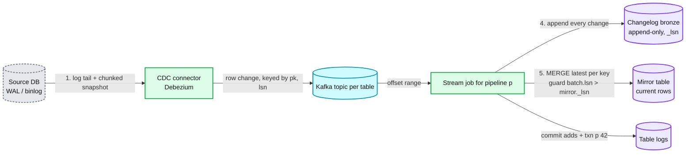

Data model so far: changelog columns `_op, _lsn, _tx_id, _commit_ts, before, after`, mirror columns `_lsn, _op, _deleted, _updated_ts`. The connector's own offset (the LSN it has published up to) lives in a Kafka topic (Connect's offset topic), not in the database.

**What is still missing:** the replication slot on Postgres holds WAL until the connector confirms, so a connector down for a day fills the source database's disk (the source, not us, is the blast radius). A schema change on the source table (`ALTER TABLE ADD COLUMN`) arrives as a DDL event and must flow to the mirror (§4.5). Transactions spanning many rows land in the mirror row by row, not atomically, unless the batch boundary is aligned to `tx_id` (§10.6 says which consistency we promise).

### 4.4 Replay and backfill: reprocess a range without duplicates while the live stream keeps running

Replay is not an afterthought. The bug will happen (a bad decoder release, a wrong partition column, a corrupted week). The design rule: **the batch job and the stream job are the same job with a different trigger.** Kappa, not Lambda: one code path.

**Flow: replay pipeline `p` for 2026-09-10 06:00 to 12:00**

1. The control plane records `REPLAY(p, range, reason, requested_by)` and creates a **replay pipeline** `p_replay_<id>` with the same source, same decoder version (or the fixed one), and `trigger = availableNow` (run until the range is consumed, then stop).
2. The replay job resolves the range to source coordinates: for Kafka, `offsetsForTimes(2026-09-10T06:00)` per partition to `offsetsForTimes(12:00)`; for files, the file-state entries with `discovered_at` in range; for CDC, the changelog bronze rows with `_commit_ts` in range (the DB log itself is gone by then, which is the reason the changelog bronze exists).
3. It reads and lands into a **staging table** `bronze_p__replay_<id>` with its own `txn(p_replay_<id>, batch)` markers. Exactly-once inside the replay works exactly as in §4.1.
4. When the replay finishes, one atomic command swaps the data in: `INSERT INTO bronze_p REPLACE WHERE _source_offset_range ∈ replayed range` (Delta's `replaceWhere`, or Iceberg's overwrite by filter). One commit removes the old files for that predicate and adds the staged files. Readers see the old data or the new data, never both, never neither.
5. The live pipeline `p` never stopped. Its batches for today kept committing. The swap touches only files whose rows fall in the replayed predicate, and blind appends never conflict with a `replaceWhere` on a disjoint predicate (the conflict rules of the table format decide this, which is why the predicate must be on a partition column or an offset range, never "all rows").

**Backfill of a new table from an old source** is the same flow with range = everything and no swap: land directly, then start the live pipeline from the offset where the backfill stopped (the backfill's last `end_offsets` become the live pipeline's `start_offsets`). If the source is older than Kafka retention, the backfill reads the raw bronze of another pipeline, or the archived topic on tiered storage.

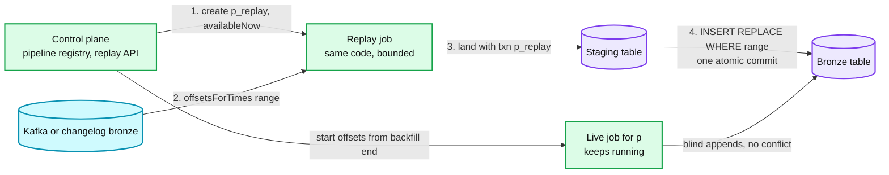

Data model so far: `PIPELINE.state` gains `replaying`, `REPLAY(id, pipeline, range, status, staging_table)`.

**What is still missing:** a replay of a week at 10x speed competes with live ingestion for Kafka consumer bandwidth and for cluster cores. It needs its own quota and its own cluster pool (§5.2 and §8). Downstream tables built from bronze must be told the range changed (a `_replay_id` column and a change feed; downstream is below the line, but the seam must exist).

### 4.5 Schema drift: the producer changes its schema and the pipeline keeps running

Three principles. **The registry is the contract, not the code.** **Additive changes are automatic, everything else is a human decision.** **Nothing is ever dropped: it lands, is rescued, or is quarantined.**

**Flow: decode a record**

1. The record header carries a schema id. The task looks it up in its cache, missing → fetch from the registry (immutable, cache forever).
2. The registry enforces compatibility at **register time**, not at read time: subject `t-value` has mode `BACKWARD` (default), so a producer can add an optional field or remove a field, and every existing reader still decodes. A producer that tries to register a breaking change (rename, type change, new required field) is rejected at registration, before a single record is written. That moves the failure to the producer's deploy, at 2pm, instead of our pipeline at 2am.
3. The task decodes with the writer schema and projects onto the **table schema**. Three cases:
   - Field in both: land it.
   - Field in the record but not in the table (a new optional field): with policy `additive`, the driver evolves the table schema in the same commit (`add column`, additive only, one metadata action in the log) and lands the field. With policy `rescue`, the field goes into `_rescued_data` as JSON, nothing changes, and the owner gets a ticket.
   - Record cannot be decoded at all (bad bytes, unknown schema id, JSON that violates the expected type): the record goes to the **quarantine table** with its raw bytes, the error, and its source coordinates. The batch commits both the bronze rows and the quarantine rows in the same run. The batch never fails because of one bad record.
4. Renames and type changes never happen in place. A rename is "add new column, keep old, backfill, drop old later" on the table side; a type change is a new subject (`t-v2`), a new topic or a new table version, and a dual-write period. That is a migration, and it is the owner's project.

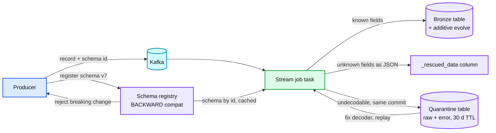

Data model so far: `SCHEMA_VERSION(subject, version, schema_id, compatibility)`, `PIPELINE.schema_policy`, bronze columns `_schema_id, _rescued_data`, `QUARANTINE_ROW`.

**What is still missing:** JSON sources have no registry. The pipeline infers a schema from a sample and then hits drift constantly (§5.4 covers inference, `_rescued_data` as the default for JSON, and the "column appears with 3 types" case). Auto-evolving the table schema is a metadata commit that conflicts with concurrent writers of the same table (the second writer retries, fine). Downstream consumers of the bronze table see a new column appear; that is the contract we give them (additive only, never a type change).

---

## 5. Deep dives

One per non-functional requirement. Each one names what breaks in the §4 design with a number, fixes it, and lists what changed in the API, the data model, and the diagram.

### 5.1 "1 PB/day into 10k tables, files per table bounded": the commit and file bomb

**What breaks.** §4.1 writes one file per task per batch. 200 partitions, a 30 s trigger, 10k tables: **5.8 billion files/day**, ~3 KB each for a quiet topic. Each file costs a PUT ($0.005 per 1,000, so $29k/day), an `add` action in the table log (~1 KB, so the checkpoint of a one-week-old table is 40 GB and query planning takes minutes), and a GET per query. The table is not slow because of bytes. It is unusable because of count. Second, smaller wall: the table log serialises commits, a few per second per table, so any design where many jobs write the same table (say a topic fanned out by tenant to 500 jobs writing one table) stalls at the log.

**Fix, in order of leverage.**
1. **Size files at write time, not after.** Before writing, the batch shuffles its output so that each output file is ~128 MB or more (Databricks calls this optimized writes: an adaptive shuffle on the partition column that targets a file size). A 30 s batch of a 10 MB/s topic is 300 MB raw, ~50 MB compressed, so it produces **one or two files**, not 200. Files per day for that table: ~5k. Across 10k tables: **~2 to 20 M/day** depending on the topic sizes, three orders of magnitude down.
2. **Trigger interval by freshness tier, not one global value.** Tier A (60 s p99) triggers every 20 to 30 s. Tier B (5 min) every 2 min. Tier C (hourly reports) every 15 min. Most tables are tier B or C. Files and commits fall with the interval; freshness is a property the pipeline owner pays for.
3. **Compact in the background, without blocking the stream.** An hourly `OPTIMIZE` per table rewrites the last hour's small files into 1 GB files as a `dataChange = false` commit, which never conflicts with the stream's blind appends. Auto compaction (run a small compaction inside the writer after its own commit when a partition has > N small files) handles the long tail of tables no one schedules. Write amplification: land once, rewrite once, so ~2x, which is the budget.
4. **One writer per table.** A pipeline owns its target table. Fan-out by tenant or region is a partition column or a downstream job, never 500 concurrent committers. The commit ceiling then never matters: a table sees 2 to 3 commits per minute (the stream plus compaction).
5. **Partition granularity.** `ingest_date` for most tables, `ingest_date, ingest_hour` for tables over ~1 TB/day so that a compaction job and a replay touch one hour, not one day. Never a high-cardinality column (tenant, user) as a partition: 10k tenants × 24 hours = 240k directories a day, each with a tiny file.

```mermaid
%% D10 (§5.1): the file bomb and its fix. Left: naive, one file per task per batch. Right: shuffle to size, tiered triggers, background compaction. The naive path is red because it is the thing that breaks first.
flowchart LR
    B[Batch output<br/>200 tasks, 50 MB compressed] --> N[Naive: one file per task<br/>200 x 250 KB per batch<br/>5.8 B files per day platform-wide]:::critical
    B --> S[Optimized write<br/>adaptive shuffle to 128 MB targets]
    S -->|"1 to 2 files per batch"| T[(Table, hour partition<br/>~120 files per hour)]
    T -->|"hourly OPTIMIZE<br/>dataChange=false"| C[(~6 files of 1 GB per hour)]
    TR[Trigger tier<br/>A 30 s, B 2 min, C 15 min] -->|"batches per day"| B
    N -.->|"replaced by"| S

    class B,S service
    class T,C store
    class TR decision

    classDef service  fill:#dcfce7,stroke:#16a34a,stroke-width:2px,color:#111
    classDef store    fill:#ede9fe,stroke:#7c3aed,stroke-width:2px,color:#111
    classDef decision fill:#fce7f3,stroke:#db2777,stroke-width:2px,color:#111
    classDef critical fill:#fee2e2,stroke:#dc2626,stroke-width:4px,color:#111
```

**Push back on the textbook answer.** "Commit less often" is the reflex, and it trades the freshness requirement away for nothing. Files per commit is the lever, not commits per hour. A 30 s trigger writing one file per batch is fine forever. A 15 min trigger writing 200 files per batch is still 2 M files a week for one table.

**What changed.** API: `PIPELINE.trigger_seconds` becomes `freshness_tier`. Data model: `TARGET_TABLE(partitioning, target_file_mb, compaction_schedule)`. Diagram: the writer gains a shuffle stage, the platform gains a compaction service. Numbers: ~2 to 20 M files created/day, ~200k/day after compaction, ~$100/day in PUTs. Details in [`deep-dives/sink-commits-small-files-and-cost.md`](deep-dives/sink-commits-small-files-and-cost.md).

### 5.2 "Sink down for an hour, freshness recovers, nothing lost": backpressure, lag, and catch-up

**What breaks.** In §4.1 a batch that takes longer than its trigger (S3 slow, table service down, a 10x traffic spike) makes the next batch bigger, which takes longer, which makes the next one bigger. With no cap, the job eventually tries to read an hour of a topic in one batch, runs out of memory writing it, dies, and restarts into the same batch. Producers meanwhile are fine: they write to Kafka, which is the whole point. But a job that stays dead for 7 days falls off the end of retention and loses data silently (`auto.offset.reset = latest` would skip to the head and pretend nothing happened).

**Fix.**
1. **Backpressure ends at Kafka.** Producers must never block on the lake, so we never push back past the buffer. The consumer is pull-based, so "backpressure" means the consumer reads at the rate it can land. Say this out loud: it is the opposite of the Flink credit-based flow-control answer, which is for operators inside one job.
2. **Bounded batches.** `maxOffsetsPerTrigger` (and `maxFilesPerTrigger`, `maxBytesPerTrigger`) caps a batch at what the job can land in about one trigger interval at normal parallelism, e.g. 2x the average per-trigger volume. During catch-up the job runs back-to-back batches of that size, so recovery is linear and memory is flat.
3. **Lag in seconds, not offsets.** `lag_seconds = now - timestamp of the oldest unconsumed record`, per pipeline. Alert at 5 min for tier A, 30 min for tier B. Page when `lag_seconds > 0.5 × retention` because that is the point at which the pipeline will lose data if nothing changes. Offsets-behind means nothing without the rate.
4. **Catch-up math and the knob.** A 1 h outage on a 10 MB/s topic leaves 36 GB behind. At a 2x cap the job lands 20 MB/s, so it catches up in **1 h** (lag decays at 1x). To recover in 15 min, raise the cap to 5x and add cores for the duration (the control plane can scale a pipeline's cluster from its lag). The cap is a per-pipeline knob with a platform ceiling so one pipeline's catch-up cannot starve the others.
5. **Retention is the SLA.** 7 days of retention with tiered storage means a pipeline can be dead for a week. `auto.offset.reset = earliest` plus an alert on "start offset requested < earliest available" so a fall-off is loud, never silent.
6. **Sink outage.** S3 503s are retried with backoff inside the task. A table service outage (the commit path) fails the batch at step 5 and the job retries the whole batch: no partial commit is possible, so a retry is safe and cheap (the files are re-written, the old ones are orphans).

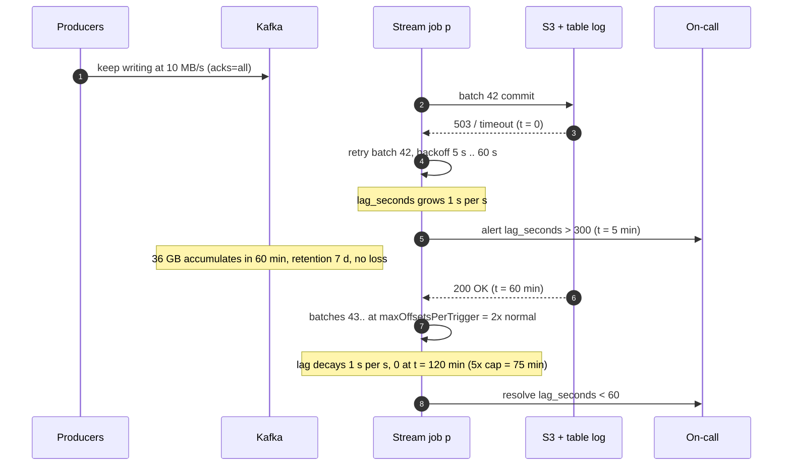

**Push back on the textbook answer.** "Use a stream processor with checkpoints so we do not lose progress" solves a problem we do not have. The batch is deterministic (`offsets/42` fixes its range) and stateless (no windows, no joins). Re-running a lost batch costs one batch. A Flink checkpoint every 60 s buys the same thing at higher complexity. Where Flink wins is sub-second latency and stateful transforms, both below the line here.

**What changed.** API: `PIPELINE.max_records_per_trigger`, `PIPELINE.catch_up_multiplier`, a `scale(pipeline, cores)` control call. Metrics: `lag_seconds`, `batch_duration / trigger_interval` ratio (the leading indicator). Diagram: nothing new, one knob on the consumer edge. Details in [`deep-dives/backpressure-lag-and-catch-up.md`](deep-dives/backpressure-lag-and-catch-up.md).

### 5.3 "Any lateness accepted, nothing dropped, no rewrites": event time at ingestion

**What breaks.** Two wrong answers, both common. (a) Partition bronze by `event_date`. A mobile client that syncs after 3 days offline sends events with `event_ts` three days old, so the batch writes into a 3-day-old partition: the hourly compaction already ran there, the replay predicate for "that day" is now wrong, downstream jobs that "finished" that day did not, and a query for "yesterday" sees a different answer every hour. (b) Apply a watermark at ingestion and drop events later than 10 minutes. That throws away real data to solve a problem (window closing) that ingestion does not have.

**Fix.**
1. **Partition by ingest time, carry event time as a column.** Bronze is partitioned by `ingest_date` (and hour). A 3-day-late event lands in today's partition, today's file, with `_event_ts` three days ago. History is never rewritten. Ingestion is append-only by construction.
2. **Cluster by event time inside the partition.** A query for `event_ts BETWEEN yesterday` would otherwise scan every ingest partition. Sort or cluster files by `_event_ts` (Z-order or liquid clustering on `_event_ts`) and keep per-file min/max stats, so the planner skips files whose `_event_ts` range does not overlap. In practice > 99% of events arrive within minutes, so almost every file in `ingest_date = D` has `event_ts` in `D` and pruning is near-perfect; the few late files are the only extra reads.
3. **Measure lateness, do not enforce it.** `lateness = _ingest_ts - _event_ts` per record, exported as a histogram per pipeline. The p99 of that histogram is the number downstream watermark-based jobs use to set their allowed lateness. Ingestion produces the number; downstream consumes it.
4. **Downstream decides what late means.** A silver table partitioned by `event_date` is built by a downstream job with a watermark and a documented policy: late events beyond the watermark go to a side table and a daily reconciliation job merges them. That is the correct place for a watermark: where a window closes.
5. **Clock skew and garbage timestamps.** `_event_ts` in the year 1970 or 2099 is data, not an error. Land it. Add `_event_ts_valid` (within 30 days of ingest) so clustering and downstream filters can ignore garbage without losing it.

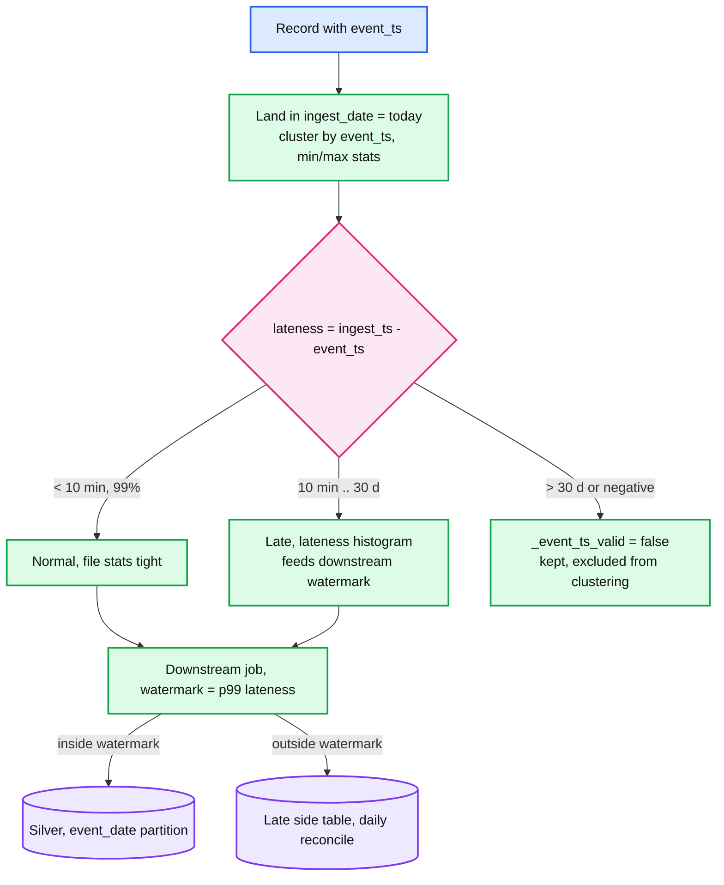

**Push back on the textbook answer.** The Dataflow model's watermark answer is right for aggregation and wrong for landing. An interviewer who asks "what is your watermark" for a raw table should hear "there is none, and here is why: nothing here closes a window, and dropping data at the first hop is unrecoverable".

**What changed.** Data model: bronze partition key fixed as `ingest_date`, columns `_event_ts_valid`, clustering on `_event_ts`. Metrics: lateness histogram per pipeline. API: `PIPELINE.event_ts_field`. Details in [`deep-dives/late-events-and-event-time.md`](deep-dives/late-events-and-event-time.md).

### 5.4 "Schema drift never stops the pipeline and never loses a field": JSON, inference, and evolution conflicts

**What breaks.** §4.5 leans on a registry that gates at register time. Half the sources are JSON with no registry: log lines, webhooks, files from partners. The first version of the pipeline **infers** a schema from a sample of 1,000 records. The next day a field appears that the sample never saw (a new SDK version), or `user_id` shows up as `"123"` in one producer and `123` in another, or a nested object gains depth. A strict pipeline fails the batch, lag grows, and someone hand-edits a schema at 3am.

**Fix.**
1. **JSON sources default to `rescue` policy.** Inferred schema, every field typed as `string` at first unless the owner declares types (inferring `int` from 1,000 samples and then meeting `"N/A"` is the classic failure). Unknown fields go to `_rescued_data`, typed mismatches go there too with the original value, and the batch commits. A daily report lists the top rescued keys per table; the owner promotes them to real columns with one config change, and a replay of the rescued column backfills them.
2. **Additive evolution is a metadata commit, and it conflicts.** When policy is `additive`, the driver appends an `add column` metadata action to the same commit as the data. Two batches of the same pipeline never overlap (one job per pipeline), but compaction on the same table can be committing at that moment; whoever loses the put-if-absent retries after re-reading the log, which is the table format's standard OCC (the Delta problem, §4.3). Type widening (`int → long`, `float → double`) is allowed if the table format supports it without rewriting files; everything else is a breaking change.
3. **Breaking changes are a migration, never a surprise.** For registry-backed topics they are rejected at registration. For JSON there is no gate, so the pipeline detects a type conflict on an existing column and rescues, never coerces. The owner then chooses: new column (`user_id_str`), or new table version (`events_v2`) fed by the same topic with a dual-write window while consumers move.
4. **Schema is versioned per record.** Every bronze row carries `_schema_id` (registry id, or a hash of the inferred schema). A replay can decode with the schema that was current at write time, and downstream can tell which rows predate a column.
5. **CDC DDL.** The connector emits schema change events from the DDL log. `ADD COLUMN` flows as additive. `DROP COLUMN` is ignored on the mirror (the column becomes null-only and is dropped by the owner later). `ALTER TYPE` and `RENAME` pause the pipeline with a ticket, because guessing is worse than lag.

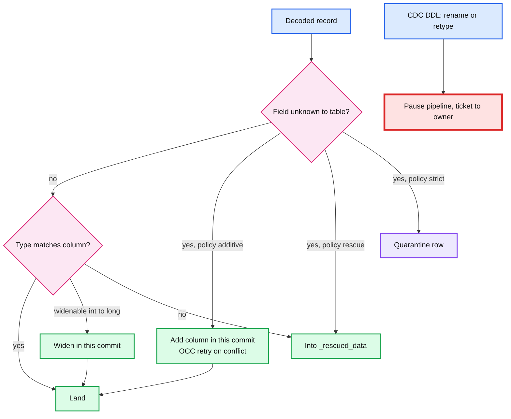

**Push back on the textbook answer.** "Fail fast on schema mismatch" is right for a service API and wrong for ingestion. A failed batch is lag on everything in that topic, for every consumer of the table, because one producer shipped a field. Land and rescue, then tell the owner, is strictly better: the same information, no outage.

**What changed.** API: `PIPELINE.schema_policy ∈ {additive, rescue, strict}` with `rescue` the default for JSON, plus `promote_rescued(table, key, type)`. Data model: `_schema_id` on every row, `SCHEMA_VERSION` gains inferred schemas. Diagram: the decoder gains the branch above. Details in [`deep-dives/schema-drift-and-quarantine.md`](deep-dives/schema-drift-and-quarantine.md).

### 5.5 "10k pipelines, one hot partition, one bad tenant": the control plane and isolation

**What breaks.** §4 has "a stream job per pipeline". At 10k pipelines that is 10k drivers, each with a cluster, each holding a checkpoint, each restarting on its own. Three things go wrong. (a) **Cost.** A driver plus a minimum of two executors for a 100 KB/s topic is ~90% idle; 10k of them is thousands of idle cores. (b) **Skew.** One Kafka partition carrying 10x the others (a keyed topic with a hot key, or an unbalanced partitioner) makes one task take 10x longer, and the batch takes as long as its slowest task, so the whole pipeline's freshness p99 is set by one partition. (c) **Blast radius.** A pipeline whose decoder OOMs on a 100 MB record takes its cluster down with it, and if that cluster was shared, every pipeline on it.

**Fix.**
1. **Tiers of isolation.** Big pipelines (> 50 MB/s, ~200 of them carrying 80% of the bytes) get a dedicated job and cluster. Small pipelines are **multiplexed**: one job consumes 50 to 100 small topics and writes 50 to 100 tables, one commit per table per batch, with a per-table `txn` marker so each table's exactly-once is independent. A failure in the multiplexed job delays 100 small tables by one batch, which is acceptable for tier B and C. Placement by bytes/s and by tier, decided by the control plane, revisited daily.
2. **Skew.** For ingestion we do not need keys, so the producer uses the sticky (round-robin by batch) partitioner and partitions are balanced by construction. Where a key is required (CDC by primary key), a hot key is a hot partition and the fix is on the source side (split the topic by table, or by key range). Inside the job, `minPartitions` splits one Kafka partition's offset range across several tasks so a single hot partition does not set the batch time; ordering inside the partition is preserved by the `_offset` column, not by task order.
3. **The control plane.** A registry (pipelines, tiers, owners, schema policies, quotas) and a scheduler that assigns pipelines to job slots, restarts failed jobs, scales clusters from `lag_seconds`, and runs replay and compaction as pipelines of their own. It is the [`../distributed-job-scheduler/`](../distributed-job-scheduler/) problem with leases and fencing: exactly one job instance runs a pipeline at a time (two would write the same table with the same `appId` and the second's commits would be skipped as duplicates, which is safe but wastes a cluster). The control plane is never on the data path: if it dies, running jobs keep running.
4. **Quotas.** Per pipeline: max cores, max records per trigger, max quarantine rate (above 5% of records the pipeline pauses and pages the owner, because it is probably a bad decoder, not bad data). Per tenant: total cores and total S3 requests. A replay runs in its own pool with its own quota.

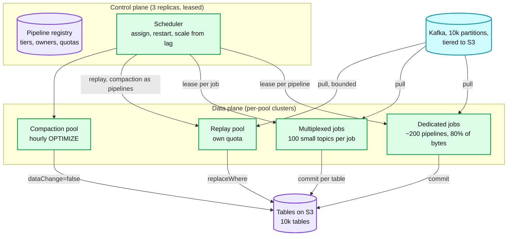

**Push back on the textbook answer.** "One job per topic" is clean and wrong at 10k. "One giant job for everything" is cheap and wrong for blast radius. The answer is tiers, and the tier is decided by bytes/s and freshness, which is a number the control plane already has.

**What changed.** API: `PIPELINE.tier`, `PIPELINE.quota`, `assign(pipeline, job_slot)`, `scale(job, cores)`. Data model: `JOB_SLOT(job_id, pipelines[], cluster, lease_epoch)`. Diagram: the control plane appears, jobs split into dedicated and multiplexed. Numbers: ~200 dedicated jobs, ~100 multiplexed jobs for ~9,800 small pipelines, ~5,000 cores total plus a replay pool. Details in [`deep-dives/backpressure-lag-and-catch-up.md`](deep-dives/backpressure-lag-and-catch-up.md) (skew and scaling) and [`deep-dives/replay-and-backfill.md`](deep-dives/replay-and-backfill.md) (pools).

---

## 6. Final design and the six core flows

Everything from §5 composed. Under 15 nodes; zoom-ins in [`diagrams.md`](diagrams.md).

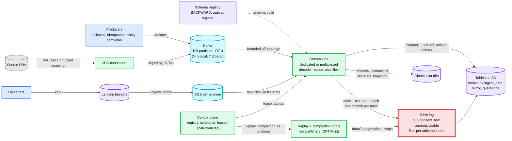

The six flows below are the ones to be able to say from memory. Each is the final design, not the §4 version.

### Flow 1: one Kafka micro-batch (30 s trigger, lands in ~15 s)

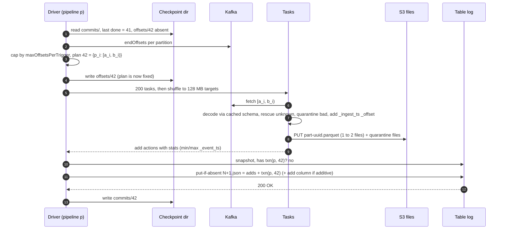

### Flow 2: a file lands (notification path, under 2 min)

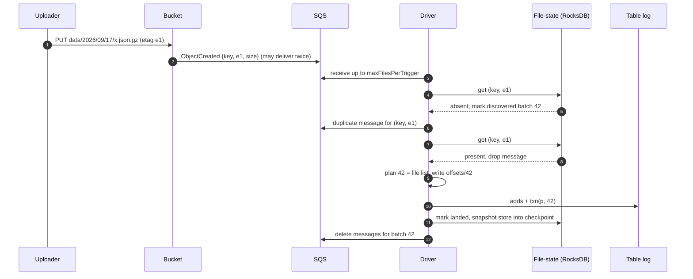

### Flow 3: CDC snapshot handoff and apply (per table, chunked)

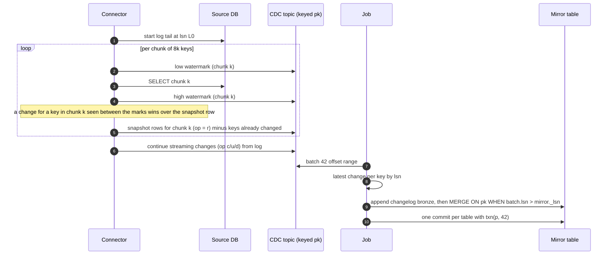

### Flow 4: replay 6 hours after a bad decoder (live stream never stops)

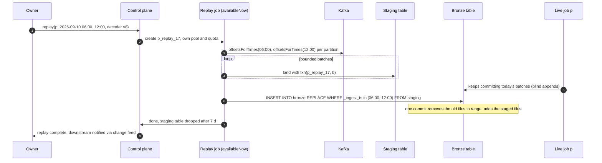

### Flow 5: driver dies after the table commit, before the checkpoint marker (failure, exactly-once)

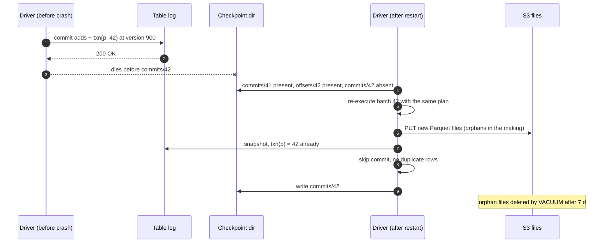

### Flow 6: producer schema change, additive then breaking (schema drift)

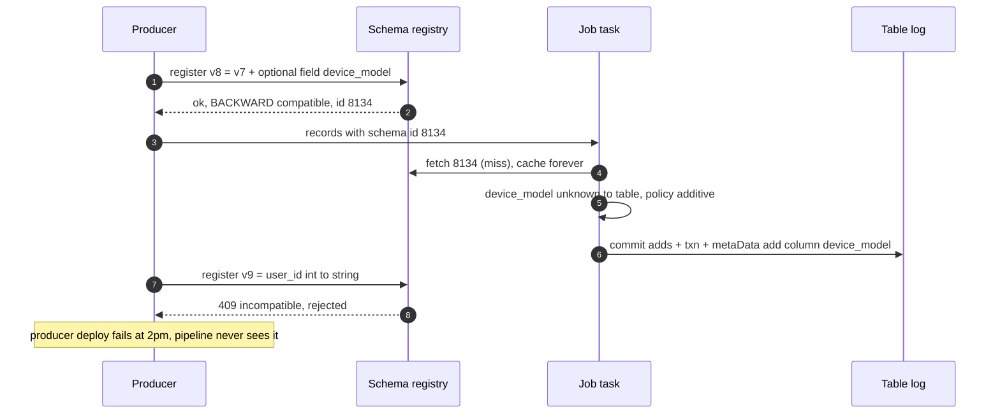

---

## 7. Trade-offs

| Decision | Option A | Option B | Chose | Why |
|---|---|---|---|---|
| Buffer | Kafka in front of every source | Consumers read producers or S3 directly | A | Producers never block, sink can be down for a week, replay for free. Costs ~100 brokers and a team |
| Processing model | Micro-batch (Spark Structured Streaming) | Record-at-a-time with checkpoints (Flink) | A | Batches are deterministic and stateless, a lost batch costs one batch, the table commit is already the checkpoint. Flink for sub-second or stateful, which is below the line |
| Commit point | Table commit carries `txn(appId, batch)` | Offsets in a separate store, 2PC across store and table | A | One atomic write. No cross-system transaction. The re-run check is a snapshot read |
| Bronze partitioning | `ingest_date` | `event_date` | A | Append-only forever, late data never rewrites, replay predicates are stable. Cluster by `_event_ts` for the query side |
| Watermark at ingestion | None, measure lateness | Drop beyond N minutes | A | Dropping at the first hop is unrecoverable. Downstream closes windows |
| Schema gate | Registry compatibility at register time | Validate at read time in the pipeline | A | Failure moves to the producer's deploy. Read-time validation is the fallback for JSON only |
| Unknown fields | Rescue column, land the batch | Fail the batch | A | A failed batch is lag for every consumer of the table. Rescue is the same information without the outage |
| File sizing | Shuffle to ~128 MB at write, compact to 1 GB hourly | Write per task, compact later | A | 1,000x fewer files created, 2x write amplification instead of 3x |
| Job topology | Dedicated for the 200 big pipelines, multiplexed for the rest | One job per pipeline | A | 10k drivers is thousands of idle cores. Multiplexing bounds blast radius to 100 small tables per job |
| Replay | Same code, bounded trigger, staging plus `replaceWhere` | Separate batch pipeline (Lambda) | A | One code path, one set of bugs. The swap is atomic. Lambda means two implementations drift |
| File source | Notifications plus periodic backup listing | Listing only | A | Latency minutes vs hours and 100x fewer LIST calls. Listing catches lost notifications |
| CDC apply | Changelog bronze (append) plus mirror (MERGE by lsn) | Mirror only | A | Changelog is the replay source once the DB log is gone, and the audit trail. Costs 2x storage on tiny data |
| Refused to build | Global ordering, cross-table transactions, sub-second freshness, transforms in the ingestion layer | | | Each one doubles the design for a requirement nobody stated |

---

## 8. Staff-level notes

- **Failure modes and blast radius.** Kafka broker loss: RF 3, `min.insync.replicas = 2`, producers keep writing, zero blast radius. Kafka cluster loss (AZ or misconfig): producers block, this is the one real outage, so Kafka is stretched across 3 AZs with rack-aware replicas. Stream job death: one pipeline lags, recovers on restart within one batch. S3 or table service outage: every pipeline lags, nothing is lost, recovery is linear in the outage length. Control plane death: nothing happens to running jobs, no new replays or restarts until it is back. Schema registry death: cached schemas keep every running task decoding, new schema ids fail the record into quarantine, not the batch. Bad decoder release: quarantine rate spikes, the pipeline auto-pauses at 5%, replay after the fix (Flow 4). The blast radius of a bad tenant is one dedicated job or one multiplexed group, never the platform.
- **Migration.** From "consumers write files to S3 directly": (1) stand up Kafka, dual-publish producers, (2) run the new pipeline into a shadow table, diff daily counts and checksums against the old landing for a week, (3) flip readers to the new table via a view, (4) stop the old writer, keep it deployable for a month. Rollback at each step is a view flip. For CDC: snapshot into the mirror while the old batch export keeps running, cut over when the mirror is within 60 s of the source for 24 h.
- **Operability.** SLO per table: freshness (p99 < 60 s for tier A, measured as `now - max(_ingest_ts)` of the committed table, not job-reported), completeness (rows landed = rows produced ± quarantine, reconciled daily against Kafka offsets), quarantine rate < 0.1%. Pages at 3am: `lag_seconds > 0.5 × retention` for any pipeline (data loss imminent), Kafka under-replicated partitions > 0 for 10 min, quarantine rate > 5% (auto-paused, needs a human), file count per table growing > 10x the expected rate (compaction is dead). Warnings, not pages: lag > 5 min tier A, batch duration > trigger interval for 10 batches.
- **Cost.** Kafka: ~100 to 150 brokers for 24 h local plus tiered storage of ~2 PB compressed for 7 days (~$50k/month at S3 prices). Lake: 200 TB/day landed, 6 PB/month, at $23/TB-month the first month alone is ~$140k, so bronze retention is 30 to 90 days with a lifecycle rule to cold storage. Compute: ~5,000 cores steady, ~$150k/month on-demand, less with spot for the multiplexed tier (a spot loss is one batch). S3 requests: ~$100/day after file sizing, $29k/day without it. Eng-time: the platform is one team of 6 to 8; the per-pipeline work (schema policy, tier, owner) is self-serve or it does not scale to 10k.
- **Team boundaries.** Producers own their schema and its compatibility. The ingestion team owns the buffer, the jobs, the commit protocol, and the bronze tables' physical layout. Table owners own the schema policy, the tier, and the quarantine queue. Downstream teams own everything from bronze onward, including watermarks and late-data policy. The registry is the contract between the first two; the bronze table schema is the contract between the last two.

---

## 9. What is expected at each level

**Mid (80/20 breadth/depth).** Kafka in front, a consumer that writes Parquet to S3, a table format on top, a checkpoint so restarts resume. Says "exactly-once" and means "checkpoints". Partitions by event date because that is what queries want. One job per topic. Talks about the schema registry as a place schemas live.

**Senior (60/40).** Knows the commit point matters and puts offsets with the data somehow. Names the small-file problem and schedules compaction. Uses `maxOffsetsPerTrigger` and alerts on lag. Knows watermarks and applies one, probably at ingestion. Handles schema evolution with `mergeSchema`. Mentions replay as "re-run the job from an earlier offset" without saying how duplicates are avoided.

**Staff+ (40/60).** Says unprompted: the table commit is the only commit point and carries the source position, so a re-run is a no-op; backpressure ends at Kafka and producers never block; bronze is partitioned by ingest time and clustered by event time, and there is no watermark here on purpose; the registry gates at register time and the pipeline rescues rather than fails; replay is the same job in bounded mode with an atomic partition swap; files per commit is the lever, not commits per hour; the 200 big pipelines get dedicated jobs and the 9,800 small ones are multiplexed; the thing that pages at 3am is lag approaching retention. Gives the numbers: 11.6 GB/s, 10k partitions, 5.8 B files/day naive vs 2 M fixed, 2x write amplification, $29k/day vs $100/day in PUTs. Names what was refused: global order, cross-table atomicity, transforms in the ingestion layer, sub-second.

---

## 10. Nitty-gritty (past interview scope)

### 10.1 Internals of each chosen technology

- **Kafka.** A topic is N partitions, each an append-only segmented log on one leader broker with RF − 1 followers. Producers batch by partition (`linger.ms`, `batch.size`), the idempotent producer stamps `(producer id, sequence)` per partition so a broker-side retry dedups. `acks=all` waits for the ISR (in-sync replicas). Consumers pull by offset, a consumer group assigns partitions to members, offsets are committed to `__consumer_offsets` (we do not use group offsets, the checkpoint dir owns them). Tiered storage (KIP-405) copies closed segments to object storage and serves old offsets from there. Zoom-in: [`../../popular_systems_deepdive/kafka/`](../../popular_systems_deepdive/kafka/).
- **Structured Streaming micro-batch.** The driver runs a loop: plan a batch from the source's `latestOffset` capped by the rate limit, write `offsets/N`, run it as a normal Spark job, call the sink's `addBatch(N, df)`, write `commits/N`. The Delta sink's `addBatch` is the `txn` commit. `availableNow` runs the loop until the source is drained, then stops. State store is unused here (no stateful operators).
- **Delta / Iceberg commit.** Immutable Parquet plus a log of JSON commits with put-if-absent; readers replay the log from the last checkpoint. `txn(appId, version)` is an action in the commit; the snapshot keeps the max version per appId. `replaceWhere` is one commit with `remove` for every file matching the predicate and `add` for the new ones. Zoom-in: [`../delta-lake-transactions/`](../delta-lake-transactions/).
- **Auto Loader style file source.** SQS/SNS or EventBridge notifications into a queue, a RocksDB file-state store keyed by path (and etag/version) checkpointed with the batch, optional backfill listing on an interval, schema inference and evolution modes, `_rescued_data`.
- **Debezium.** Reads the DB log via a replication slot or binlog client, emits envelope `{op, before, after, source{lsn, ts}, ts_ms}` per row, stores its own offset in Kafka Connect's offset topic, runs incremental snapshots by primary-key chunks with watermark events written to a signal table.
- **Schema registry.** REST service over a compacted Kafka topic. `subject → [versions]`, each version a schema with a global id. Registration checks the compatibility mode of the subject against the previous version(s). Clients embed the id in the record (magic byte + 4-byte id for Confluent wire format).

### 10.2 Configuration knobs that matter

| Component | Knob | Value | Why |
|---|---|---|---|
| Kafka producer | `acks` | `all` | Durability handoff. Nothing lands that Kafka did not replicate |
| Kafka producer | `enable.idempotence` | `true` (default since 3.0) | Producer retries never duplicate within a partition |
| Kafka producer | `partitioner` | sticky (default) | Balanced partitions for keyless ingestion |
| Kafka broker | `min.insync.replicas` | 2 with RF 3 | Tolerate one replica down without blocking producers |
| Kafka topic | `retention.ms` | 7 days (default), tiered | The catch-up window and the replay window |
| Kafka topic | `local.retention.ms` | 24 h | Bounds broker disk; older reads come from tiered storage |
| Stream job | trigger | 30 s (tier A), 2 min (B), 15 min (C) | Freshness tier drives files and commits |
| Stream job | `maxOffsetsPerTrigger` | ~2x average per-trigger volume | Bounded batch, linear catch-up, flat memory |
| Stream job | `maxFilesPerTrigger`, `maxBytesPerTrigger` | 10k files, 100 GB | Same for file sources |
| Stream job | `minPartitions` | 2 to 4x partitions when skewed | Split hot partitions across tasks |
| Consumer | `auto.offset.reset` | `earliest` plus alert on fall-off | Never skip data silently |
| Sink | optimized writes, target file | on explicitly (default only for MERGE, UPDATE, DELETE), 128 MB | Files per batch to 1 to 2 |
| Sink | auto compaction, `OPTIMIZE` schedule | on, hourly, target 256 MB to 1 GB by table size (autotune) | Bounded file count, 2x amplification |
| Sink | `deletedFileRetentionDuration` | 7 days | Orphans from re-executed batches are vacuumed |
| Registry | compatibility | `BACKWARD` (default) per subject | Add optional and delete are safe, rename and retype rejected |
| Pipeline | `schema_policy` | `additive` (registry), `rescue` (JSON) | Nothing dropped, nothing guessed |
| Pipeline | quarantine pause threshold | 5% of a batch | A bad decoder, not bad data |
| File source | file-state TTL | 30 days | Bounds RocksDB size, accepts re-upload of ancient files |
| CDC | merge interval | 60 s | MERGE cost dominates, batch the changes |
| Postgres | `max_slot_wal_keep_size` | set, alert at 50% | A dead connector must not fill the source disk |

### 10.3 Capacity math per component

| Component | Unit | Load | Limit | Headroom |
|---|---|---|---|---|
| Kafka partition | one of 10k | 3.5 MB/s peak | ~10 MB/s comfortable per partition | 3x, add partitions per topic when a partition passes 5 MB/s |
| Kafka broker | one of ~120 | ~0.3 GB/s in, ~0.9 GB/s replication + out at peak | ~1 GB/s in on 25 Gbps | 3x on network, disk is bounded by 24 h local |
| Kafka local disk | fleet | 1 PB/day raw ÷ 3 compressed × RF 3 = ~1 PB for 24 h | 120 × 10 TB = 1.2 PB | Thin. Tiered offload must keep up |
| Tiered storage | S3 | ~2.3 PB for 7 days compressed | Unbounded | Cost, not capacity |
| Stream task | one core | ~10 MB/s JSON decode + Parquet | | 3,500 cores at peak, 5,000 with catch-up |
| Batch (tier A, 10 MB/s topic) | one | 300 MB raw, ~50 MB Parquet, 1 to 2 files | Must finish in < 30 s | ~15 s typical |
| Table log | one table | 2 to 3 commits/min | few commits/s | 100x |
| Files per table per day | one tier A table | ~3k created, ~150 after compaction | Planning cost grows with count | Checkpoint stays under 10 MB |
| File-state store | one big file pipeline | 10 M entries/day × 200 B = 2 GB/day, 60 GB at 30 d TTL | RocksDB snapshot in checkpoint | Large. Snapshot incrementally, or move to a KV table above 20 GB |
| SQS queue | one | 116 msg/s average | Thousands/s | 10x |
| CDC MERGE | one 1 TB mirror, 1k changes/s | rewrites files holding touched keys: ~60k keys per minute over ~1,000 files → tens of GB rewritten per minute | | The reason for deletion vectors and 60 s batches |
| Control plane | 3 replicas | 10k pipelines, ~1 event/s each | Trivial | It is a metadata service |

The closest to its limit: **local broker disk** (the 24 h window is the number to watch) and **CDC MERGE amplification** on the hottest mirrors. The file count is not close to its limit only because §5.1 fixed it; without §5.1 it is the first thing that dies.

### 10.4 Failure timeline

**Failure 1: table commit path down for 60 min.** Flow 5.2 diagram. t=0 first 503, t=5 s retry, t=5 min lag alert, t=60 min recovered, t=120 min lag zero at 2x cap. Data at risk: none (Kafka). User sees: tables frozen at their last commit, freshness dashboards red. On-call sees: one alert per pipeline (grouped by cause), no action needed unless the outage approaches half of retention.

**Failure 2: Kafka broker loses a disk.**

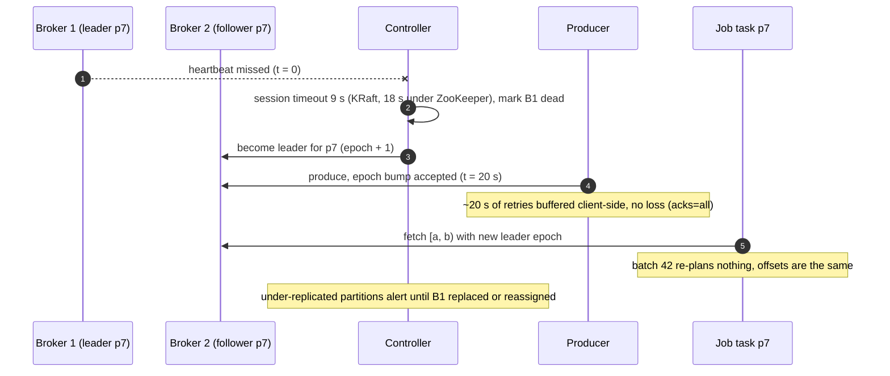

**Failure 3: bad decoder release.** t=0 deploy, t=30 s first batch quarantines 40% of records, t=30 s pipeline auto-pauses (threshold 5%), page. t=10 min rollback deploy, resume. t=15 min `replay(p, [t0, t0+30 s])` for the quarantined batch (quarantine rows carry source coordinates, so the replay range is exact). Data at risk: none, all rows are in quarantine. User sees: a 15 min freshness gap on one table.

### 10.5 Exactly-once and idempotency end to end

| Hop | Duplicate can enter when | Removed by | Key | Lives |
|---|---|---|---|---|
| App → Kafka producer | App retries a `send` after a client timeout | Not removed here. App-level `event_id` if the app needs it | `event_id` (optional, app-owned) | Forever, in the row |
| Producer → broker | Producer retries after a broker timeout | Idempotent producer, broker dedups by (pid, seq) per partition | `(producer id, sequence)` | Per producer session, 5 in-flight |
| Broker → job task | Batch re-executed after a crash | Same plan (`offsets/N`), same range, same rows | Offset range | Checkpoint dir |
| Job → table | Driver dies after commit, before `commits/N` | Snapshot check of `txn(appId, N)` before commit | `(appId, batch_id)` | Table log, kept per appId until `setTransactionRetentionDuration` |
| Notification → file-state | S3 delivers the event twice | File-state lookup | `(key, etag)` | 30 days |
| Backup listing → file-state | Listing finds a file already landed | Same lookup | `(key, etag)` | 30 days |
| CDC connector → topic | Connector restarts, re-reads from its last committed offset | Not removed on the topic. Removed at apply | `(pk, lsn)` guard on MERGE | Mirror row |
| Replay → bronze | Replay run twice | Second `replaceWhere` of the same range is idempotent (same rows) | Predicate | n/a |
| App-level dupes | The app really sent it twice with different offsets | Not ingestion's job. Downstream dedup by `event_id` within a window | `event_id` | Downstream state |

The last row is the one to say out loud: exactly-once at ingestion means "each Kafka record lands once", not "each business event lands once". If the app produced it twice, it is in Kafka twice and lands twice, with two offsets. Deduping by business key is a downstream transform with its own state and its own window. See [`../../concepts/exactly-once.md`](../../concepts/exactly-once.md).

### 10.6 Consistency model per edge

| Edge | Model | Note |
|---|---|---|
| Producer → Kafka | Strong per partition after `acks=all` | Ordered by offset. No cross-partition order |
| Kafka → job | Read-your-writes on offsets (the job wrote `offsets/N` itself) | The plan is fixed before execution |
| Job → table | Strong: one atomic commit per batch per table | Readers see version N or N+1 |
| Table → readers | Snapshot isolation per query | A query pins a version. Freshness lag is the only staleness |
| Across tables in a multiplexed job | Eventual: one batch commits 100 tables one by one | Table A can be at batch 42 while B is at 41 for a few seconds. No cross-table atomicity, by design |
| CDC source txn → mirror | Eventual within a batch: a multi-row source transaction may straddle two batches | Batch boundary is by offset, not by `tx_id`. Row-level consistency per key is strong (lsn guard). Say it out loud; aligning to `tx_id` is possible and costs latency |
| Schema registry → tasks | Eventual for new schemas, immutable per id | A task may lag by one fetch. Ids never change meaning |
| Control plane → jobs | Eventual, lease-based | A stale lease holder's commits are skipped by the `txn` marker, so a double-run is wasteful, never wrong |
| Replay → bronze | Strong at the swap | `replaceWhere` is one commit |

### 10.7 Alternatives rejected

| Alternative | Why it looked attractive | Why rejected |
|---|---|---|
| Flink with 2PC sinks for everything | Sub-second latency, one framework | Ingestion is stateless; a Flink checkpoint every 60 s buys what the batch plan already gives. Adds a state backend and transaction timeouts to operate. Keep for the stateful downstream |
| Kafka Connect S3 sink writing raw files, table format applied later | Off the shelf, no Spark | Exactly-once via deterministic file names works, but the "later" step is a second pipeline with its own commit problem, and schema handling is thin |
| Kinesis / Pub/Sub instead of Kafka | Managed | Retention limits (Kinesis 7 days max at extra cost, 24 h default), per-shard throughput caps, no tiered storage, weaker replay. Fine for a small platform |
| Offsets in a database (2PC with the table) | Familiar | Two systems to keep in sync, coordinator failure between prepare and commit. The `txn` action makes it one write |
| Partition bronze by `event_date` | Queries want it | Late data rewrites history, replay predicates drift, compaction races. Cluster by `_event_ts` instead |
| Watermark and drop at ingestion | Textbook | Unrecoverable data loss at the first hop |
| Fail the batch on schema mismatch | Loud and simple | Lag for every consumer of the table because of one producer |
| One job per pipeline for all 10k | Isolation | Thousands of idle cores. Tiered isolation instead |
| Lambda: separate batch pipeline for replay | Batch is "simpler" | Two code paths drift, bugs fixed twice. Same job in `availableNow` mode |
| Listing-only file discovery | No SQS to run | 10k LIST pages per 10 M files per scan, minutes of latency, $50/day at 1,000 pipelines. Notifications plus backup listing |
| Apply CDC row by row with `UPDATE` | Simplest | 100k file rewrites/s. MERGE per 60 s batch with the lsn guard |

### 10.8 How the big companies do it

- **Netflix Keystone** (2016: 36 Kafka clusters, 4,000+ brokers, 700 B messages/day; 2018: "beyond the trillion events per day scale") routes events from a fronting Kafka through stateless "router" jobs into S3/Hive, Elasticsearch, and consumer Kafka clusters, with a self-serve UI where a producer declares a stream and its sinks; the router is exactly the landing job here, and the fronting Kafka is the buffer that "absorbs temporary outages from downstream sinks".
- **Meta Scribe** (2019) takes "an input rate that can exceed 2.5 terabytes per second", "several petabytes every hour", with producers buffering in memory and the host daemon buffering on local disk when the network is down, and "buckets" so several consumers share one category. The post says delivery guarantees are still being made explicit (at-least-once vs exactly-once), which is the honest version of the same split as §10.5: a lossy-under-pressure transport with idempotence at the sink.
- **Uber** runs Kafka at trillions of messages/day, mirrors clusters with uReplicator, and lands into the lake with Hudi (DeltaStreamer ingests Kafka with the checkpoint stored in the Hudi commit metadata, the same "source position inside the table commit" idea as `txn`).
- **LinkedIn** (Kafka's birthplace, Oct 2019: 7 trillion messages/day, 100+ clusters, 4,000+ brokers, 7 M partitions) uses Brooklin for change capture and mirroring and Gobblin for file and Kafka ingestion into HDFS with a job-level watermark that is the same thing as our `BATCH.end_offsets`.
- **Databricks** productised the design: Auto Loader (notifications, RocksDB file state, rescue column, schema evolution modes), Structured Streaming with the Delta `txn` sink, Lakeflow Connect for managed CDC. **Confluent** productised the other half: Connect with the S3 sink's deterministic file naming and Tableflow, which materialises topics as Iceberg or Delta tables directly from the broker.

Numbers and URLs are verified in [`research/`](research/) with a spot-check section per file.

### 10.9 Operational runbook

Dashboards (5 metrics): `lag_seconds` per pipeline (with the retention line drawn), freshness per table (`now - max(_ingest_ts)` from the table, not the job), `batch_duration / trigger_interval` per pipeline, quarantine rate per pipeline, files per table and small-file ratio.

Alerts: page on `lag_seconds > 0.5 × retention` (any tier), Kafka under-replicated partitions > 0 for 10 min, quarantine rate > 5% (pipeline auto-paused), compaction not run for 6 h on a tier A table, Postgres slot WAL > 50% of `max_slot_wal_keep_size`. Warn on lag > 5 min tier A, batch/trigger ratio > 1 for 10 batches, file-state store > 20 GB.

Rollout: a decoder or job image change goes to a canary set of 10 low-tier pipelines for 1 h (quarantine rate and batch duration compared to the prior week), then 10% of tier B, then everything. Rollback is a redeploy of the previous image; the checkpoint format is backward compatible by contract. A change to the commit protocol (e.g. a new `txn` retention) is rolled out table by table with a flag.

Rollback with data: a bad release that landed wrong rows is fixed by Flow 4 (replay the range with the previous decoder). The quarantine table gives the exact source coordinates. Never delete from bronze by hand; `replaceWhere` is the only mutation.

### 10.10 Security and abuse

- Producers authenticate to Kafka (mTLS or SASL) and are ACL'd to their topics. A producer cannot write to another team's topic, so cannot poison another team's table.
- Schema registration is ACL'd per subject. Only the owning team can register a new version.
- Landing buckets are per tenant with a bucket policy; the pipeline's role can read, not delete. A malicious uploader can upload garbage (lands in quarantine, quota on quarantine rate pauses the pipeline) or upload 1 TB (per-pipeline `maxBytesPerTrigger` and a size cap per file, oversize files quarantined by reference).
- A producer sending 100x its normal rate fills its own partitions; quotas on the broker (`producer_byte_rate` per client id) throttle it before it affects the cluster. Its pipeline lags; others do not.
- Bronze tables carry raw payloads, so PII lives there. Column-level tags from the registry (a `pii` annotation) drive downstream masking and the bronze retention (30 days for PII-tagged tables). GDPR delete is a `DELETE WHERE user_id = ...` on bronze which the table format turns into a rewrite or a deletion vector; the Kafka copy expires with retention (7 days), so the SLA is "gone from the lake within 7 days of the request, gone from Kafka within 7 days of production".
- The control plane API is authenticated; `replay` on a pipeline requires the owner role, because a replay is a write to a production table.

### 10.11 Evolution

- **10x (10 PB/day).** Kafka: 100k partitions, ~1,000 brokers, tiered storage mandatory, and the per-cluster limits (partition count per broker, controller metadata) force multiple Kafka clusters with a routing layer. Jobs: 50k cores, and the multiplexed tier needs a smarter packer. Tables: the per-table commit rate is unchanged (still one writer), but the 200 big tables need hourly partitions and per-hour compaction. The file-state store for the biggest file pipelines moves out of RocksDB into a KV table. Nothing in the commit protocol changes; that is the point of putting the position inside the table commit.
- **Multi-region.** Producers write to the Kafka in their region. Either mirror topics to one home region (MirrorMaker 2 / uReplicator) and land once, or land per region into per-region bronze tables and union in a view. The first is simpler and doubles cross-region egress; the second keeps data local (residency) and makes replay per region. The seam is `PIPELINE.region` and a table naming convention.
- **Sub-second freshness for a few tables.** Add a Flink job for those pipelines writing to a serving store (Kafka to Redis or a KV), keep the lake path as is. Two sinks, one source, no change to the lake protocol.
- **A new source type (an HTTP webhook, a queue).** The contract is "give me a bounded, replayable range": a webhook receiver writes to Kafka and becomes source type 1. Anything that cannot be replayed must be put behind Kafka first.
- **New dimension to slice by (tenant).** A column and a clustering key, never a partition. If tenant isolation of tables is needed, it is a fan-out job from bronze.
- **GDPR at scale.** A `user_id → files` index (or the table format's deletion vectors) so a delete touches tens of files, not a scan of 6 PB. Build it when deletes exceed ~100/day.

---

## 11. Follow-up questions to expect

Ranked by how often they come up.

1. **"Walk me through what happens when the driver dies after the commit but before the checkpoint."** Flow 5. The `txn` marker is in the same commit as the data; the re-run finds it and skips. [`edge-cases.md`](edge-cases.md) "driver dies after commit".
2. **"The sink is down for an hour. Then eight days."** §5.2. One hour: lag then linear catch-up. Eight days: data older than retention is gone, the alert at half retention exists to prevent that, and tiered storage makes retention cheap to extend. [`deep-dives/backpressure-lag-and-catch-up.md`](deep-dives/backpressure-lag-and-catch-up.md).
3. **"Where does a 3-day-late event go and what does yesterday's query see?"** §5.3. Today's ingest partition, `_event_ts` three days old, visible to an event-time query via file stats, never rewrites yesterday. [`edge-cases.md`](edge-cases.md) "late event".
4. **"A producer changes `user_id` from int to string."** §4.5 and §5.4. Rejected at the registry for Avro; for JSON, rescued, never coerced; a new column or new table version is the owner's migration. [`deep-dives/schema-drift-and-quarantine.md`](deep-dives/schema-drift-and-quarantine.md).
5. **"You have 20 M files. How did that happen and how do you fix it?"** §5.1. One file per task per batch. Shuffle to size at write, tiered triggers, compaction. [`deep-dives/sink-commits-small-files-and-cost.md`](deep-dives/sink-commits-small-files-and-cost.md).
6. **"Replay 6 hours while the live stream runs."** Flow 4. Same job, bounded, staging, `replaceWhere`. [`deep-dives/replay-and-backfill.md`](deep-dives/replay-and-backfill.md).
7. **"Is this exactly-once? Really?"** §10.5. Exactly-once effect per Kafka record per table. Not per business event. Say the difference.
8. **"One partition is 10x hotter."** §5.5. Keyless topics use the sticky partitioner; keyed topics fix it at the source; `minPartitions` inside the job splits the range.
9. **"How does the CDC snapshot not miss or double-apply a change?"** Flow 3. Chunked snapshot with low/high watermarks, changes between the marks win. [`deep-dives/file-and-cdc-sources.md`](deep-dives/file-and-cdc-sources.md).
10. **"Why not Flink?"** §7 and §10.7. Stateless landing, deterministic batch plan, the table commit is the checkpoint. Flink for sub-second and stateful, downstream.
11. **"The same file uploaded twice with different bytes."** §4.2. `(key, etag)` is the identity; both land; overwrite policy is the owner's.
12. **"What pages you at 3am?"** §8 and §10.9. Lag approaching retention, under-replicated partitions, quarantine spike, dead compaction.
13. **"How do you migrate from the current direct-to-S3 writers?"** §8. Dual publish, shadow table, diff, view flip, keep the old path deployable.
14. **"What did you refuse to build?"** §7 last row.
